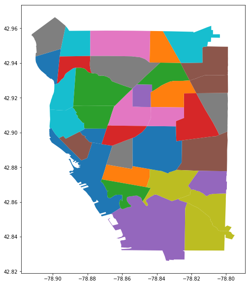
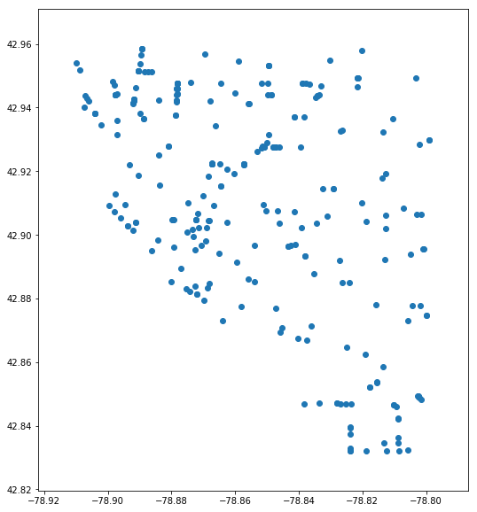
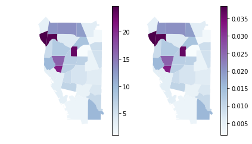
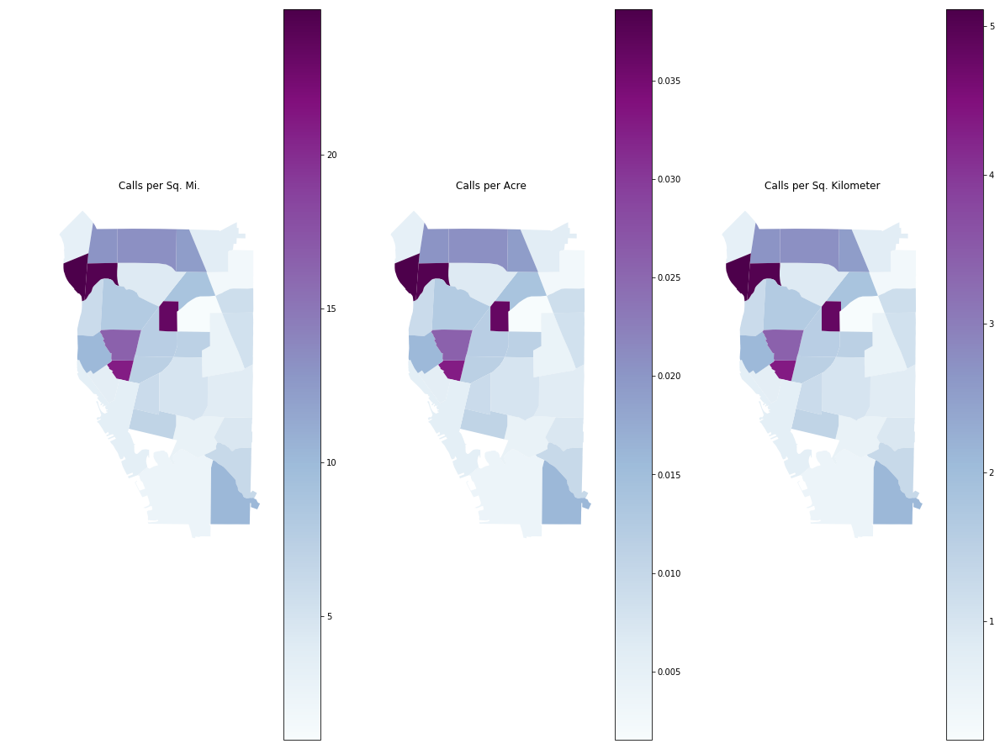

## Assignment
### Harsha kankanamge
Repeat this analysis for Feb 1 - 15, 2018.       

1. Were there a lot more 311 calls for service during this time period in 2018?          

2. Was the distribution of calls by neighborhood similar to the one shown above?          


```python
# import libraries

# to read from a Socrata open dataset
import sodapy 
from sodapy import Socrata

# to manipulate data
import pandas as pd
import geopandas as gpd
import numpy as np

# visualization
%matplotlib inline
import matplotlib.pyplot as plt
from matplotlib import gridspec
# draw maps in the notebook
#%matplotlib inline 
```


```python
socrata_domain = "data.buffalony.gov"
socrata_dataset_identifier = "drz9-ujg7"
#app_token = ..... not necessary but helps with app development

client = Socrata(socrata_domain, None) # put app_token where None is if you get an app token
metadata = client.get_metadata(socrata_dataset_identifier)
metadata.keys() # metadat is a dictionary - these are the keys. just for demonstration purposes
```

    WARNING:root:Requests made without an app_token will be subject to strict throttling limits.
    


    dict_keys(['id', 'name', 'averageRating', 'createdAt', 'description', 'displayType', 'downloadCount', 'hideFromCatalog', 'hideFromDataJson', 'indexUpdatedAt', 'newBackend', 'numberOfComments', 'oid', 'provenance', 'publicationAppendEnabled', 'publicationDate', 'publicationGroup', 'publicationStage', 'rowsUpdatedAt', 'rowsUpdatedBy', 'tableId', 'totalTimesRated', 'viewCount', 'viewLastModified', 'viewType', 'columns', 'grants', 'owner', 'query', 'rights', 'tableAuthor', 'flags'])


```python
#you can access specific information in the metadata

[x['fieldName'] for x in metadata['columns']]# show field names in dataset
```


    ['the_geom',
     'shape_starea',
     'shape_stlength',
     'objectid',
     'nbhdname',
     'placename',
     'objectid_1',
     'nbhdnum',
     'calcacres',
     'sqmiles',
     'shape_leng',
     'sde_vector_gis_osp_neighborhoods_2018_area']


```python
meta_nbhd = [x for x in metadata['columns'] if x['fieldName'] == 'nbhdname'][0]
meta_nbhd
```


    {'id': 363400942,
     'name': 'NbhdName',
     'dataTypeName': 'text',
     'fieldName': 'nbhdname',
     'position': 14,
     'renderTypeName': 'text',
     'tableColumnId': 66025892,
     'cachedContents': {'largest': 'West Side',
      'null': '0',
      'top': [{'item': 'Allentown', 'count': '1'},
       {'item': 'Seneca Babcock', 'count': '1'},
       {'item': 'Lovejoy', 'count': '1'},
       {'item': 'Fruit Belt', 'count': '1'},
       {'item': 'Delavan Grider', 'count': '1'},
       {'item': 'Kensington-Bailey', 'count': '1'},
       {'item': 'Genesee-Moselle', 'count': '1'},
       {'item': 'Grant-Amherst', 'count': '1'},
       {'item': 'Ellicott', 'count': '1'},
       {'item': 'Central', 'count': '1'},
       {'item': 'West Side', 'count': '1'},
       {'item': 'Black Rock', 'count': '1'},
       {'item': 'Lower West Side', 'count': '1'},
       {'item': 'Fillmore-Leroy', 'count': '1'},
       {'item': 'Kaisertown', 'count': '1'},
       {'item': 'Broadway Fillmore', 'count': '1'},
       {'item': 'Riverside', 'count': '1'},
       {'item': 'Central Park', 'count': '1'},
       {'item': 'University Heights', 'count': '1'},
       {'item': 'MLK Park', 'count': '1'}],
      'not_null': '35',
      'smallest': 'Allentown',
      'cardinality': '35'},
     'format': {}}


```python
url = "https://data.buffalony.gov/resource/drz9-ujg7.geojson"
gdf = gpd.read_file(url)
```


```python
gdf.crs
```


    {'init': 'epsg:4326'}


```python
gdf.shape[0]
```


    35


```python
gdf.geometry.name
```


    'geometry'


```python
gdf.plot(column='nbhdname', figsize=(9,10));
```





## Reproject to EPSG 3857

Web Mercator Auxiliary Sphere, WGS 84, units = meters

Create a new dataframe with a field containing sq. kilometers.   

The data owner provided a field with sq. miles and acres calculated. We could use either (or both) of these for a choropleth map. But, since the new units of the projected data are meters, we can calculate sq. kilometers as a third measure of size for a choropleth map.


```python
neighborhoods = gdf[['nbhdname', 'geometry', 'sqmiles','calcacres']].copy() # make sure you copy to avoid warnings later
neighborhoods = neighborhoods.to_crs({'init': 'epsg:3857'})
neighborhoods['sqkilo']=neighborhoods.geometry.area/1000**2 # in sq kilometers
neighborhoods['sqkilo'][:10]
```


    0     7.147233
    1     1.610757
    2     4.106326
    3    11.110428
    4     4.101096
    5     4.350064
    6     4.942666
    7     8.721404
    8     2.933698
    9    19.980053
    Name: sqkilo, dtype: float64


### Get open data on pot hole service requests
The City of Buffalo has an open data set on 311 service calls. One type of call they receive from the public is for pot hole repair. On Feb 16, WIVB reported on the city's pot hole blitz (https://www.wivb.com/news/local-news/city-of-buffalo-goes-on-saturday-pothole-blitz/1788423791). The story indicted where the crews were dispatched to fix the pot holes.

The blitz included:

* crews on Main Street between Humboldt and Hertel
* crew on South Park Avenue between Bailey and Dorrance
* crew the Hamlin Park neighborhood
* crew the Broadway Fillmore area
* other crews across the city on various pothole requests that were logged into 311.

**The story went on to indicate:**       
"The City of Buffalo said that 311 calls are not as high as they were in 2018. In February 2018, the city got 1100 calls for potholes through 311. In the two weeks of February 2019, the city said there have been 400 calls."

We will pull data for the first two weeks in Feb 2018 and map that data to the Buffalo Neighborhoods.    

The SODA endpoint is:
  
311 Service Requests https://data.buffalony.gov/resource/p7e8-krif.geojson

Read this into a geodataframe since there is a geometry in the dataset.

The query will include an SQL query to

increase the default limit of 1000 records (\?$limit=1000000\&)     

Select specific dates:                            

     * open_date between 2/1/2018 and 2/15/2018 ($where=open_date between '2018-02-01T00:00:00' and '2018-02-15T00:00:00')

Select specific call type: type contains 'Pot Hole' (and type like 'Pot Hole%')  

The statement below uses URL percent encoding to represent all ascii charaters.
* %20 is a space
* %25 is a percent sign - used to ignore whatever characters follow the words Pot Hole
* %27 is a single quotation mark


```python
url='https://data.buffalony.gov/resource/p7e8-krif.geojson?$limit=1000000&\
$where=open_date%20between%20%272018-02-01T00:00:00%27%20and%20%272018-02-15T00:00:00%27\
%20and%20type%20like%20%27Pot%20Hole%25%27'

phgdf =  gpd.read_file(url)
phgdf.crs
```


    {'init': 'epsg:4326'}


```python
nrows = phgdf.shape[0] # how many rows in this slice of the data
phgdf.plot(figsize=(9,10));
```





### Spatial Join
to count the number of pothole service requests in each neighborhood. Before two spatial datasets are joined they have to be in the same projection. However, if you enter
* phgdf = phgdf.to_crs({'init': 'epsg:3857'})

in the next cell you will get an error about geometry type being NONE instead of POINT. So first we must
* remove records with no location information
* reproject to same crs as neighborhoods


```python
phgdf['Type'] = phgdf.geom_type
```


```python
phgdf['Type']=phgdf['Type'].astype(str)
phgdf = phgdf[phgdf.Type != 'None'] # keep only point types
removed = nrows -phgdf.shape[0] # how many rows are miising coordinate information
pctremoved=(removed/nrows)*100 # what percent of the data is missing spatial information
print("Original number of rows = {}\nNumber of rows missing coordinates = {},\nPercent missing data ={:6.1f}%".format(nrows,removed, pctremoved))
```

    Original number of rows = 334
    Number of rows missing coordinates = 57,
    Percent missing data =  17.1%
    


```python
phgdf = phgdf.to_crs({'init': 'epsg:3857'})
```

So, there are 271 valid requests for pot hole repairs in the first week of Feb, 2018. 

Use sjoin method to join the pot hole request points to the neighborhood polygons. Both of these datasets have a geometry field which is used in a spatial join.

* How = inner: "use intersection of keys from both dfs, retain only left_df geometry column", and 
* op = within (can be intersects, contains, or within).


```python
PH_in_neigh = gpd.sjoin(phgdf,neighborhoods,how='inner',op='within')
PH_in_neigh.shape
```


    (271, 36)


### One call not joined to a neighborhood

This means the point does not fall within any of the polygons.

### Summarize the number of calls for each neighborhood
* group the point data (from the spatial join) by the neighborhood name
* count the number of points in each group.


```python
rfs =PH_in_neigh.nbhdname.groupby(PH_in_neigh['nbhdname'])\
            .count()\
            .sort_values(ascending=False)
rfsph = rfs.to_frame(name='counts').reset_index()
rfsph.shape
```


    (34, 2)


### Join final counts in each neighborhood to the polygon database
This is a regular merge - not a spatial join. The dataframe with the final counts is not geospatial, so the neighborhood names (in nbhdname) are used for the merge.   

**However** there are 35 neighborhoods (polygons) but one does not have any pot hole service calls assigned to it.

### Proportional symbols
Instead of using a classification scheme and min/max circle size (The ArcGIS approach), an alternative is to create proportional symbols. The size of the symbol is proportional to the value mapped. For example, if value = 100 is circle size 5, then value of 200 is size 10. With this approach only positive values are mapped (no zeros).

Get rid of zeros by merging the dataframes together so that only polygons with positive counts are kept.


```python
nozerodf = pd.merge(neighborhoods,rfsph)
nozerodf.tail()
```


<div>
<style scoped>
    .dataframe tbody tr th:only-of-type {
        vertical-align: middle;
    }

    .dataframe tbody tr th {
        vertical-align: top;
    }

    .dataframe thead th {
        text-align: right;
    }
</style>
<table border="1" class="dataframe">
  <thead>
    <tr style="text-align: right;">
      <th></th>
      <th>nbhdname</th>
      <th>geometry</th>
      <th>sqmiles</th>
      <th>calcacres</th>
      <th>sqkilo</th>
      <th>counts</th>
    </tr>
  </thead>
  <tbody>
    <tr>
      <th>29</th>
      <td>Hamlin Park</td>
      <td>(POLYGON ((-8777608.583221421 5300964.48174737...</td>
      <td>0.47307671000000001</td>
      <td>302.76909584999999</td>
      <td>2.286270</td>
      <td>11</td>
    </tr>
    <tr>
      <th>30</th>
      <td>Fruit Belt</td>
      <td>(POLYGON ((-8779976.808981806 5295748.75442217...</td>
      <td>0.68012198999999995</td>
      <td>435.27807389999998</td>
      <td>3.284536</td>
      <td>5</td>
    </tr>
    <tr>
      <th>31</th>
      <td>South Park</td>
      <td>(POLYGON ((-8773788.155840665 5290166.51688690...</td>
      <td>1.6651265500000001</td>
      <td>1065.6809914999999</td>
      <td>8.026896</td>
      <td>17</td>
    </tr>
    <tr>
      <th>32</th>
      <td>Kaisertown</td>
      <td>(POLYGON ((-8771922.533265801 5293379.36050432...</td>
      <td>0.88003118999999996</td>
      <td>563.21996217000003</td>
      <td>4.246151</td>
      <td>4</td>
    </tr>
    <tr>
      <th>33</th>
      <td>MLK Park</td>
      <td>(POLYGON ((-8777063.884218687 5297327.90975671...</td>
      <td>0.68687759000000004</td>
      <td>439.60165978999999</td>
      <td>3.318255</td>
      <td>5</td>
    </tr>
  </tbody>
</table>
</div>


### Calculate circle size for each point
Use the minimum value in the data and the smallest circle size to determine circle size for all points


```python
minct = nozerodf['counts'].min()
mincir = 5
nozerodf['ssize'] = nozerodf['counts']/minct * mincir
nozerodf['ssize'] =nozerodf['ssize'].round(0).astype(int)
nozerodf['ssize'][:10]
```


    0    20
    1    35
    2    55
    3    40
    4    70
    5    40
    6     5
    7    35
    8    75
    9    50
    Name: ssize, dtype: int32


### Map counts as graduated circles using a classification scheme

Counts and amounts are mapped as graduated circles. The center of the circle is the centroid of each neighborhood polygon. The classification scheme allows for creating a legend.

* Use the centroid method to determine the geometric center of neighborhood.
* Set this field to the geometry field.


```python
nozerodf['centroids']=nozerodf['geometry'].centroid
nozerodf = nozerodf.set_geometry('centroids')
```

### Classify values to be mapped
Traditionally, values to be mapped are divided into a fixed number of groups. The analyst determines the number of groups and the method used to group the data. There are links on Blackboard to information related to this topic. PYSAL's mapclassify method offers a variety of ways to group data. Detailed information of the methods supported is at https://pysal.readthedocs.io/en/v1.6/library/esda/mapclassify.html

There are also three methods to evaluate how well the classification scheme works for the data. Before we test a few schemes we will get a bit of information about the values in our dataset.


```python
maxc = nozerodf['counts'].max()
minc = nozerodf['counts'].min()
rangec = maxc-minc
print ("Min calls = {}. Max calls = {}. Range = {}".format(minc,maxc,rangec))
```

    Min calls = 1. Max calls = 24. Range = 23
    


```python
import mapclassify # from pysal.esda
```


```python
fj4 =mapclassify.Fisher_Jenks(nozerodf['counts'],k=4) # method = Fisher Jenks, number of classes = 4
fjm1=fj4.get_adcm() #absolute deviation around class median
fjm2=fj4.get_gadf() #goodness of absolute deviation of fit
fjm3=fj4.get_tss() # total sum of squares around class means

print("Fisher Jenks 4 classes\nACDM = {:6.3f}\nGADF = {:6.3f}\nTSS = {:6.3f}".format(fjm1,fjm2,fjm3))
```

    Fisher Jenks 4 classes
    ACDM = 37.000
    GADF =  0.704
    TSS = 66.041
    


```python
eqi4 =mapclassify.Equal_Interval(nozerodf['counts'],k=4) # method = Equal Interval, number of classes = 4
eqim1=eqi4.get_adcm() #absolute deviation around class median
eqim2=eqi4.get_gadf() #goodness of absolute deviation of fit
eqim3=eqi4.get_tss() # total sum of squares around class means

print("Equal Interval 4 classes\nACDM = {:6.3f}\nGADF = {:6.3f}\nTSS = {:6.3f}".format(eqim1,eqim2,eqim3))
```

    Equal Interval 4 classes
    ACDM = 37.000
    GADF =  0.704
    TSS = 66.041
    

We could continue to test differrent methods and/or change the number of classes, but........                             
Mapclassify has a method to determine the "best" classification method and number of classes.


```python
ks = mapclassify.K_classifiers(nozerodf['counts'])
ks.best.name
```

    C:\Users\harsh\Anaconda3\lib\site-packages\scipy\stats\stats.py:1713: FutureWarning: Using a non-tuple sequence for multidimensional indexing is deprecated; use `arr[tuple(seq)]` instead of `arr[seq]`. In the future this will be interpreted as an array index, `arr[np.array(seq)]`, which will result either in an error or a different result.
      return np.add.reduce(sorted[indexer] * weights, axis=axis) / sumval
    


    'Fisher_Jenks'


```python
ks.best.k  # optimum numer of classes
```


    6


```python
fj6 =mapclassify.Fisher_Jenks(nozerodf['counts'],k=6) # method = Fisher Jenks, number of classes = 6
fjm1=fj6.get_adcm() #absolute deviation around class median
fjm2=fj6.get_gadf() #goodness of absolute deviation of fit
fjm3=fj6.get_tss() # total sum of squares around class means

print("Fisher Jenks 6 classes\nACDM = {:6.3f}\nGADF = {:6.3f}\nTSS = {:6.3f}".format(fjm1,fjm2,fjm3))
```

    Fisher Jenks 6 classes
    ACDM = 19.000
    GADF =  0.848
    TSS = 18.133
    


```python
print ("Bin assignments are in fj6.yb and class cutpoints are in fj6.bins.")
print ("The bin cutpoints are {}".format(fj6.bins))
```

    Bin assignments are in fj6.yb and class cutpoints are in fj6.bins.
    The bin cutpoints are [ 3  5  8 11 17 24]
    

### Create field to assign circle size

We will use the classification results to assign values to a new field in the dataframe that indicates the size of the circle to draw.

We will add a new field that indicates the cutpoint (upper class) value for the class into which the point falls.

For a simplified legend (Bokeh doesn't have a graduated circle legend) we will assign colors to each point based on the bin.


```python
nozerodf['bins'] = fj6.yb
cutpoints =fj6.bins
cutpoints
```


    array([ 3,  5,  8, 11, 17, 24], dtype=int64)


```python
def cutpoint_value(row):
    return cutpoints[row['bins']]
```


```python
nozerodf['lsize'] =nozerodf.apply (lambda row: cutpoint_value (row),axis=1) 
nozerodf.head(10)
```


<div>
<style scoped>
    .dataframe tbody tr th:only-of-type {
        vertical-align: middle;
    }

    .dataframe tbody tr th {
        vertical-align: top;
    }

    .dataframe thead th {
        text-align: right;
    }
</style>
<table border="1" class="dataframe">
  <thead>
    <tr style="text-align: right;">
      <th></th>
      <th>nbhdname</th>
      <th>geometry</th>
      <th>sqmiles</th>
      <th>calcacres</th>
      <th>sqkilo</th>
      <th>counts</th>
      <th>ssize</th>
      <th>centroids</th>
      <th>bins</th>
      <th>lsize</th>
    </tr>
  </thead>
  <tbody>
    <tr>
      <th>0</th>
      <td>Genesee-Moselle</td>
      <td>(POLYGON ((-8772416.996419497 5296559.07454772...</td>
      <td>1.47959668</td>
      <td>946.94187391000003</td>
      <td>7.147233</td>
      <td>4</td>
      <td>20</td>
      <td>POINT (-8773994.185873291 5297794.935210697)</td>
      <td>1</td>
      <td>5</td>
    </tr>
    <tr>
      <th>1</th>
      <td>Allentown</td>
      <td>(POLYGON ((-8779653.692074601 5297097.05578435...</td>
      <td>0.33354297999999999</td>
      <td>213.46750796000001</td>
      <td>1.610757</td>
      <td>7</td>
      <td>35</td>
      <td>POINT (-8780446.359534284 5296543.288019243)</td>
      <td>2</td>
      <td>8</td>
    </tr>
    <tr>
      <th>2</th>
      <td>West Hertel</td>
      <td>(POLYGON ((-8780700.712571777 5305677.54742905...</td>
      <td>0.84885460000000001</td>
      <td>543.26694092000002</td>
      <td>4.106326</td>
      <td>11</td>
      <td>55</td>
      <td>POINT (-8781624.309603618 5304544.537125081)</td>
      <td>3</td>
      <td>11</td>
    </tr>
    <tr>
      <th>3</th>
      <td>Central</td>
      <td>(POLYGON ((-8783340.355813986 5297073.00487966...</td>
      <td>2.3023353599999998</td>
      <td>1473.49462724</td>
      <td>11.110428</td>
      <td>8</td>
      <td>40</td>
      <td>POINT (-8780575.657097308 5293112.515570052)</td>
      <td>2</td>
      <td>8</td>
    </tr>
    <tr>
      <th>4</th>
      <td>Elmwood Bryant</td>
      <td>(POLYGON ((-8779794.565021925 5299104.69078922...</td>
      <td>0.84892204000000004</td>
      <td>543.31010802000003</td>
      <td>4.101096</td>
      <td>14</td>
      <td>70</td>
      <td>POINT (-8780433.715698674 5298216.715782064)</td>
      <td>4</td>
      <td>17</td>
    </tr>
    <tr>
      <th>5</th>
      <td>Fillmore-Leroy</td>
      <td>(POLYGON ((-8775844.626891373 5301069.18769751...</td>
      <td>0.89977421000000002</td>
      <td>575.85549312000001</td>
      <td>4.350064</td>
      <td>8</td>
      <td>40</td>
      <td>POINT (-8775916.274480719 5301790.813848895)</td>
      <td>2</td>
      <td>8</td>
    </tr>
    <tr>
      <th>6</th>
      <td>Delavan Grider</td>
      <td>(POLYGON ((-8776808.903445955 5298992.59193480...</td>
      <td>1.0227150199999999</td>
      <td>654.53761255999996</td>
      <td>4.942666</td>
      <td>1</td>
      <td>5</td>
      <td>POINT (-8775489.570209272 5300097.942009616)</td>
      <td>0</td>
      <td>3</td>
    </tr>
    <tr>
      <th>7</th>
      <td>Lovejoy</td>
      <td>(POLYGON ((-8771895.127383217 5296570.98019066...</td>
      <td>1.80658257</td>
      <td>1156.21284599</td>
      <td>8.721404</td>
      <td>7</td>
      <td>35</td>
      <td>POINT (-8773322.145359097 5294876.822697167)</td>
      <td>2</td>
      <td>8</td>
    </tr>
    <tr>
      <th>8</th>
      <td>Black Rock</td>
      <td>(POLYGON ((-8782663.178737236 5303422.25013478...</td>
      <td>0.60669930999999999</td>
      <td>388.28755895</td>
      <td>2.933698</td>
      <td>15</td>
      <td>75</td>
      <td>POINT (-8783311.200631212 5302734.9392576)</td>
      <td>4</td>
      <td>17</td>
    </tr>
    <tr>
      <th>9</th>
      <td>Hopkins-Tifft</td>
      <td>(POLYGON ((-8779366.576895932 5289643.06054361...</td>
      <td>4.1442699799999998</td>
      <td>2652.3327890400001</td>
      <td>19.980053</td>
      <td>10</td>
      <td>50</td>
      <td>POINT (-8776646.487858228 5288586.174991202)</td>
      <td>3</td>
      <td>11</td>
    </tr>
  </tbody>
</table>
</div>


```python
def label_color(row):
    return fillcolors[row['bins']]
```


```python
fillcolors = ['#daf7a6','#ffc300','#ff5733','#c70039','#900c3f','#581845']
nozerodf['ptcolor']=nozerodf.apply (lambda row: label_color (row),axis=1) 
```

### Use BOKEH to create interactive maps with graduated circles.


```python
from bokeh.tile_providers import STAMEN_TERRAIN, CARTODBPOSITRON_RETINA
from bokeh.io import output_notebook, show, output_file, save
from bokeh.plotting import figure
from bokeh.models import (ColumnDataSource,HoverTool,LogColorMapper)

output_notebook()
```


    <div class="bk-root">
        <a href="https://bokeh.pydata.org" target="_blank" class="bk-logo bk-logo-small bk-logo-notebook"></a>
        <span id="1003">Loading BokehJS ...</span>
    </div>


```python
def getmyPointCoords(row, geom, coord_type):
    """Calculates coordinates ('x' or 'y') of a Point geometry"""
    if coord_type == 'x':
        return row[geom].x
    elif coord_type == 'y':
        return row[geom].y
```


```python
geom =nozerodf.geometry.name
geom
```


    'centroids'


```python
nozerodf['x'] = nozerodf.apply(getmyPointCoords, geom=geom, coord_type='x', axis=1)
nozerodf['y'] = nozerodf.apply(getmyPointCoords, geom=geom, coord_type='y', axis=1)
```


```python
nozerodf = nozerodf.sort_values('lsize')
```


```python
# simple static plot

f = figure(plot_height=700, plot_width=800, title="Total Pot Hole Calls for Service")
f.add_tile(STAMEN_TERRAIN)

f.background_fill_color = 'gray'

nozerodf1 = nozerodf.drop(['geometry','centroids'], axis=1).copy()

fsource = ColumnDataSource(nozerodf1)

f.circle('x', 'y', source = fsource, alpha=0.6, size='ssize', fill_color = 'ptcolor',line_color = 'ptcolor',legend='lsize')
show(f)
```


  <div class="bk-root" id="614c2987-0878-4f4a-b7f0-8ae9b95dddb0"></div>


```python
# interactive plot with pop-ups

TOOLS="pan,wheel_zoom,box_zoom,reset,save"

f = figure(title="Feb 2018 311 calls for pot hole service", tools=TOOLS,
           plot_width=800, plot_height=700,
           outline_line_color=None,
           min_border=0, min_border_left=0, min_border_right=0,
           min_border_top=0, min_border_bottom=0)
f.grid.grid_line_color = None
f.add_tile(CARTODBPOSITRON_RETINA)
f.background_fill_color = 'gray'

incsource = ColumnDataSource(dict(
    xpt = nozerodf['x'],
    ypt= nozerodf['y'],
    cnt= nozerodf['counts'],
    nname = nozerodf['nbhdname'],
    circlesize=nozerodf['ssize'],
    colors = nozerodf['ptcolor'],
    legsize = nozerodf['lsize']
    ))
                           
f.title.text_font_style = "italic"
f.title.text_font_size = '14pt'

Circle=f.circle( x='xpt', y='ypt', size='circlesize', color='colors',legend = 'legsize',source=incsource)

c_hover = HoverTool(renderers=[Circle])
c_hover.point_policy = "follow_mouse"
c_hover.tooltips=[
    ("Neighborhood", "@nname"),
    ("Number of calls", "@cnt")    
]

f.add_tools(c_hover)
                            
output_file("Feb2019PotHoles_PC.html", title="Feb 2018 311 calls for pot hole service")
show(f)
```


  <div class="bk-root" id="7ad890dd-a90a-45eb-8a3b-286987d75e65"></div>


## Make Static Chorpleth Map


```python
nozerodf = nozerodf.set_geometry('geometry')
```


```python
nozerodf['mapvaluesqmi']=nozerodf['counts']/nozerodf['sqmiles'].astype(float)
nozerodf['mapvalueacre']=nozerodf['counts']/nozerodf['calcacres'].astype(float)
nozerodf['mapvaluesqki']=nozerodf['counts']/nozerodf['sqkilo'].astype(float)
```


```python
fig, axes = plt.subplots(ncols=2)

m1 =nozerodf.plot(column='mapvaluesqmi',cmap = 'BuPu',legend= True,ax=axes[0]);
m2=nozerodf.plot(column='mapvalueacre',cmap = 'BuPu',legend= True,ax=axes[1]);
m1.axis('off');
m2.axis('off');
```





```python
fig, (ax1,ax2,ax3) = plt.subplots(nrows=1, ncols=3, figsize=(20, 16))
ax1 = nozerodf.plot(ax=ax1, column='mapvaluesqmi', cmap = 'BuPu',legend=True)
ax2 = nozerodf.plot(ax=ax2, column='mapvalueacre', cmap = 'BuPu',legend=True)
ax3 = nozerodf.plot(ax=ax3, column='mapvaluesqki', cmap = 'BuPu',legend=True)
ax1.axis('off')
ax1.set_title('Calls per Sq. Mi.')
ax2.axis('off')
ax2.set_title('Calls per Acre')
ax3.axis('off')
ax3.set_title('Calls per Sq. Kilometer')
```


    Text(0.5, 1.0, 'Calls per Sq. Kilometer')





##### There are 271 valid requests for pot hole repairs in the first weeks of Feb, 2018. and there are 296 valid requests for pot hole repairs in the first weeks of Feb, 2019 . so there is no that much different. News story is not true
##### Distribution of calls by neighborhood in 2018 somewhat similar to the 2019 in this period of time

### Count calls in each neighborhood


```python
rfs =PH_in_neigh.nbhdname.groupby(PH_in_neigh['nbhdname'])\
            .count()\
            .sort_values(ascending=False)
rfsph = rfs.to_frame(name='counts').reset_index()
```

### Calculate circle size


```python
nozerodf = pd.merge(gdf,rfsph)
minct = nozerodf['counts'].min()
mincir = 20
nozerodf['ssize'] = (nozerodf['counts']/minct * mincir)**.5
nozerodf['ssize'] =nozerodf['ssize'].round(0).astype(int)
```

### Get x,y coordinates for mapping


```python
nozerodf['centroids']=nozerodf['geometry'].centroid
nozerodf = nozerodf.set_geometry('centroids')
```


```python
def getmyPointCoords(row, geom, coord_type):
    """Calculates coordinates ('x' or 'y') of a Point geometry"""
    if coord_type == 'x':
        return row[geom].x
    elif coord_type == 'y':
        return row[geom].y
```


```python
geom =nozerodf.geometry.name
nozerodf['x'] = nozerodf.apply(getmyPointCoords, geom=geom, coord_type='x', axis=1)
nozerodf['y'] = nozerodf.apply(getmyPointCoords, geom=geom, coord_type='y', axis=1)

```


```python
nozerodf.head()
```


<div>
<style scoped>
    .dataframe tbody tr th:only-of-type {
        vertical-align: middle;
    }

    .dataframe tbody tr th {
        vertical-align: top;
    }

    .dataframe thead th {
        text-align: right;
    }
</style>
<table border="1" class="dataframe">
  <thead>
    <tr style="text-align: right;">
      <th></th>
      <th>nbhdname</th>
      <th>sqmiles</th>
      <th>objectid_1</th>
      <th>objectid</th>
      <th>shape_leng</th>
      <th>placename</th>
      <th>sde_vector_gis_osp_neighborhoods_2018_area</th>
      <th>calcacres</th>
      <th>shape_stlength</th>
      <th>nbhdnum</th>
      <th>shape_starea</th>
      <th>geometry</th>
      <th>counts</th>
      <th>ssize</th>
      <th>centroids</th>
      <th>x</th>
      <th>y</th>
    </tr>
  </thead>
  <tbody>
    <tr>
      <th>0</th>
      <td>Genesee-Moselle</td>
      <td>1.47959668</td>
      <td>31</td>
      <td>23</td>
      <td>28981.7250981</td>
      <td>Buffalo</td>
      <td>41248623.032700002</td>
      <td>946.94187391000003</td>
      <td>28981.725319542264</td>
      <td>23</td>
      <td>41248622.208818763</td>
      <td>(POLYGON ((-78.803962665535 42.898656777428, -...</td>
      <td>4</td>
      <td>9</td>
      <td>POINT (-78.81813076696949 42.90678783292247)</td>
      <td>-78.818131</td>
      <td>42.906788</td>
    </tr>
    <tr>
      <th>1</th>
      <td>Allentown</td>
      <td>0.33354297999999999</td>
      <td>24</td>
      <td>3</td>
      <td>12763.1189798</td>
      <td>Buffalo</td>
      <td>9298607.4520699997</td>
      <td>213.46750796000001</td>
      <td>12763.118890667369</td>
      <td>3</td>
      <td>9298607.124521479</td>
      <td>(POLYGON ((-78.86897100867 42.902196962558, -7...</td>
      <td>7</td>
      <td>12</td>
      <td>POINT (-78.87609164151722 42.8985527620775)</td>
      <td>-78.876092</td>
      <td>42.898553</td>
    </tr>
    <tr>
      <th>2</th>
      <td>West Hertel</td>
      <td>0.84885460000000001</td>
      <td>1</td>
      <td>11</td>
      <td>20858.132954100001</td>
      <td>Buffalo</td>
      <td>23664613.287999999</td>
      <td>543.26694092000002</td>
      <td>20858.132570415859</td>
      <td>11</td>
      <td>23664613.529301703</td>
      <td>(POLYGON ((-78.878376553824 42.958633404865, -...</td>
      <td>11</td>
      <td>15</td>
      <td>POINT (-78.88667336709899 42.95118375922944)</td>
      <td>-78.886673</td>
      <td>42.951184</td>
    </tr>
    <tr>
      <th>3</th>
      <td>Central</td>
      <td>2.3023353599999998</td>
      <td>26</td>
      <td>1</td>
      <td>78080.953510899999</td>
      <td>Buffalo</td>
      <td>64185169.220899999</td>
      <td>1473.49462724</td>
      <td>78080.952053290006</td>
      <td>1</td>
      <td>64185169.866503179</td>
      <td>(POLYGON ((-78.90208887251499 42.902038699938,...</td>
      <td>8</td>
      <td>13</td>
      <td>POINT (-78.87725208777054 42.87596820967948)</td>
      <td>-78.877252</td>
      <td>42.875968</td>
    </tr>
    <tr>
      <th>4</th>
      <td>Elmwood Bryant</td>
      <td>0.84892204000000004</td>
      <td>22</td>
      <td>5</td>
      <td>20649.218719699998</td>
      <td>Buffalo</td>
      <td>23666493.638999999</td>
      <td>543.31010802000003</td>
      <td>20649.2190189844</td>
      <td>5</td>
      <td>23666494.19880639</td>
      <td>(POLYGON ((-78.870236491887 42.915406408528, -...</td>
      <td>14</td>
      <td>17</td>
      <td>POINT (-78.87597804770475 42.90956389529074)</td>
      <td>-78.875978</td>
      <td>42.909564</td>
    </tr>
  </tbody>
</table>
</div>


## Make graduated circle map


```python
import folium
def plot_counts(mydf,mygdf):
    # generate a new map
    folium_map = folium.Map(location=[42.9, -78.88],
                            zoom_start=12,
                            tiles="cartodbpositron",
                            width='75%')
    #style_function = dict(color=#e6e6e6,weight=2,opacity=0.6)
    folium.Choropleth(
        geo_data=mygdf,
        fill_color='#e6e6e6',
        name='Neighborhoods').add_to(folium_map)

    # for each row in the data, add a cicle marker
    for index, row in mydf.iterrows():
                
        # generate the popup message that is shown on click.
        popup_text = "<b>{}</b><p><i>Total 311 service calls:</i> {}</p> "
        popup_text = popup_text.format(row["nbhdname"],
                          row["counts"])
                          
        
        # radius of circles
        radius = row['ssize']
        
        # choose the color of the marker
        color="#0A8A9F" # teal
        
        # add marker to the map
        folium.CircleMarker(location=(row["y"],
                                      row["x"]),
                            radius=radius,
                            color=color,
                            popup=popup_text,
                            fill=True).add_to(folium_map)
    folium.LayerControl().add_to(folium_map)
    
    return folium_map
```


```python
plot_counts(nozerodf,gdf)
```


<div style="width:100%;"><div style="position:relative;width:100%;height:0;padding-bottom:60%;"><iframe src="data:text/html;charset=utf-8;base64,PCFET0NUWVBFIGh0bWw+CjxoZWFkPiAgICAKICAgIDxtZXRhIGh0dHAtZXF1aXY9ImNvbnRlbnQtdHlwZSIgY29udGVudD0idGV4dC9odG1sOyBjaGFyc2V0PVVURi04IiAvPgogICAgPHNjcmlwdD5MX1BSRUZFUl9DQU5WQVM9ZmFsc2U7IExfTk9fVE9VQ0g9ZmFsc2U7IExfRElTQUJMRV8zRD1mYWxzZTs8L3NjcmlwdD4KICAgIDxzY3JpcHQgc3JjPSJodHRwczovL2Nkbi5qc2RlbGl2ci5uZXQvbnBtL2xlYWZsZXRAMS40LjAvZGlzdC9sZWFmbGV0LmpzIj48L3NjcmlwdD4KICAgIDxzY3JpcHQgc3JjPSJodHRwczovL2FqYXguZ29vZ2xlYXBpcy5jb20vYWpheC9saWJzL2pxdWVyeS8xLjExLjEvanF1ZXJ5Lm1pbi5qcyI+PC9zY3JpcHQ+CiAgICA8c2NyaXB0IHNyYz0iaHR0cHM6Ly9tYXhjZG4uYm9vdHN0cmFwY2RuLmNvbS9ib290c3RyYXAvMy4yLjAvanMvYm9vdHN0cmFwLm1pbi5qcyI+PC9zY3JpcHQ+CiAgICA8c2NyaXB0IHNyYz0iaHR0cHM6Ly9jZG5qcy5jbG91ZGZsYXJlLmNvbS9hamF4L2xpYnMvTGVhZmxldC5hd2Vzb21lLW1hcmtlcnMvMi4wLjIvbGVhZmxldC5hd2Vzb21lLW1hcmtlcnMuanMiPjwvc2NyaXB0PgogICAgPGxpbmsgcmVsPSJzdHlsZXNoZWV0IiBocmVmPSJodHRwczovL2Nkbi5qc2RlbGl2ci5uZXQvbnBtL2xlYWZsZXRAMS40LjAvZGlzdC9sZWFmbGV0LmNzcyIvPgogICAgPGxpbmsgcmVsPSJzdHlsZXNoZWV0IiBocmVmPSJodHRwczovL21heGNkbi5ib290c3RyYXBjZG4uY29tL2Jvb3RzdHJhcC8zLjIuMC9jc3MvYm9vdHN0cmFwLm1pbi5jc3MiLz4KICAgIDxsaW5rIHJlbD0ic3R5bGVzaGVldCIgaHJlZj0iaHR0cHM6Ly9tYXhjZG4uYm9vdHN0cmFwY2RuLmNvbS9ib290c3RyYXAvMy4yLjAvY3NzL2Jvb3RzdHJhcC10aGVtZS5taW4uY3NzIi8+CiAgICA8bGluayByZWw9InN0eWxlc2hlZXQiIGhyZWY9Imh0dHBzOi8vbWF4Y2RuLmJvb3RzdHJhcGNkbi5jb20vZm9udC1hd2Vzb21lLzQuNi4zL2Nzcy9mb250LWF3ZXNvbWUubWluLmNzcyIvPgogICAgPGxpbmsgcmVsPSJzdHlsZXNoZWV0IiBocmVmPSJodHRwczovL2NkbmpzLmNsb3VkZmxhcmUuY29tL2FqYXgvbGlicy9MZWFmbGV0LmF3ZXNvbWUtbWFya2Vycy8yLjAuMi9sZWFmbGV0LmF3ZXNvbWUtbWFya2Vycy5jc3MiLz4KICAgIDxsaW5rIHJlbD0ic3R5bGVzaGVldCIgaHJlZj0iaHR0cHM6Ly9yYXdjZG4uZ2l0aGFjay5jb20vcHl0aG9uLXZpc3VhbGl6YXRpb24vZm9saXVtL21hc3Rlci9mb2xpdW0vdGVtcGxhdGVzL2xlYWZsZXQuYXdlc29tZS5yb3RhdGUuY3NzIi8+CiAgICA8c3R5bGU+aHRtbCwgYm9keSB7d2lkdGg6IDEwMCU7aGVpZ2h0OiAxMDAlO21hcmdpbjogMDtwYWRkaW5nOiAwO308L3N0eWxlPgogICAgPHN0eWxlPiNtYXAge3Bvc2l0aW9uOmFic29sdXRlO3RvcDowO2JvdHRvbTowO3JpZ2h0OjA7bGVmdDowO308L3N0eWxlPgogICAgCiAgICA8bWV0YSBuYW1lPSJ2aWV3cG9ydCIgY29udGVudD0id2lkdGg9ZGV2aWNlLXdpZHRoLAogICAgICAgIGluaXRpYWwtc2NhbGU9MS4wLCBtYXhpbXVtLXNjYWxlPTEuMCwgdXNlci1zY2FsYWJsZT1ubyIgLz4KICAgIDxzdHlsZT4jbWFwXzRmODE2MjMxZjMzMTQxMGU4NzNiNjdmOTMwYmQxODcwIHsKICAgICAgICBwb3NpdGlvbjogcmVsYXRpdmU7CiAgICAgICAgd2lkdGg6IDc1LjAlOwogICAgICAgIGhlaWdodDogMTAwLjAlOwogICAgICAgIGxlZnQ6IDAuMCU7CiAgICAgICAgdG9wOiAwLjAlOwogICAgICAgIH0KICAgIDwvc3R5bGU+CjwvaGVhZD4KPGJvZHk+ICAgIAogICAgCiAgICA8ZGl2IGNsYXNzPSJmb2xpdW0tbWFwIiBpZD0ibWFwXzRmODE2MjMxZjMzMTQxMGU4NzNiNjdmOTMwYmQxODcwIiA+PC9kaXY+CjwvYm9keT4KPHNjcmlwdD4gICAgCiAgICAKICAgIAogICAgICAgIHZhciBib3VuZHMgPSBudWxsOwogICAgCgogICAgdmFyIG1hcF80ZjgxNjIzMWYzMzE0MTBlODczYjY3ZjkzMGJkMTg3MCA9IEwubWFwKAogICAgICAgICdtYXBfNGY4MTYyMzFmMzMxNDEwZTg3M2I2N2Y5MzBiZDE4NzAnLCB7CiAgICAgICAgY2VudGVyOiBbNDIuOSwgLTc4Ljg4XSwKICAgICAgICB6b29tOiAxMiwKICAgICAgICBtYXhCb3VuZHM6IGJvdW5kcywKICAgICAgICBsYXllcnM6IFtdLAogICAgICAgIHdvcmxkQ29weUp1bXA6IGZhbHNlLAogICAgICAgIGNyczogTC5DUlMuRVBTRzM4NTcsCiAgICAgICAgem9vbUNvbnRyb2w6IHRydWUsCiAgICAgICAgfSk7CgoKICAgIAogICAgdmFyIHRpbGVfbGF5ZXJfMTE1MTdhZjkxNjk1NGI2OGE5MmZiNmRkMGRlYTQzMDEgPSBMLnRpbGVMYXllcigKICAgICAgICAnaHR0cHM6Ly9jYXJ0b2RiLWJhc2VtYXBzLXtzfS5nbG9iYWwuc3NsLmZhc3RseS5uZXQvbGlnaHRfYWxsL3t6fS97eH0ve3l9LnBuZycsCiAgICAgICAgewogICAgICAgICJhdHRyaWJ1dGlvbiI6IG51bGwsCiAgICAgICAgImRldGVjdFJldGluYSI6IGZhbHNlLAogICAgICAgICJtYXhOYXRpdmVab29tIjogMTgsCiAgICAgICAgIm1heFpvb20iOiAxOCwKICAgICAgICAibWluWm9vbSI6IDAsCiAgICAgICAgIm5vV3JhcCI6IGZhbHNlLAogICAgICAgICJvcGFjaXR5IjogMSwKICAgICAgICAic3ViZG9tYWlucyI6ICJhYmMiLAogICAgICAgICJ0bXMiOiBmYWxzZQp9KS5hZGRUbyhtYXBfNGY4MTYyMzFmMzMxNDEwZTg3M2I2N2Y5MzBiZDE4NzApOwogICAgCiAgICAgICAgICAgIHZhciBjaG9yb3BsZXRoXzI0Y2UyNWFkMTVkZTRjMDJhYTQwMTI5YWUxNThmNzVkID0gTC5mZWF0dXJlR3JvdXAoCiAgICAgICAgICAgICAgICApLmFkZFRvKG1hcF80ZjgxNjIzMWYzMzE0MTBlODczYjY3ZjkzMGJkMTg3MCk7CiAgICAgICAgCiAgICAKICAgICAgICB2YXIgZ2VvX2pzb25fYTIyYTg3YTRjM2E5NDI4MGIzNDdkOGZjZDViMDVlY2EgPSBMLmdlb0pzb24oCiAgICAgICAgICAgIHsiYmJveCI6IFstNzguOTEyNDU5NTMxMDc1LCA0Mi44MjYwMzA0ODQ2MTcsIC03OC43OTUwMzYxOTU3LCA0Mi45NjY0MTE1NTA5NzFdLCAiZmVhdHVyZXMiOiBbeyJiYm94IjogWy03OC44Mjg5ODIwNjA0NTIsIDQyLjg5NDkzMTMyNzc4NCwgLTc4LjgwMzk2MjY2NTUzNSwgNDIuOTIyNjMyODcwNTYxXSwgImdlb21ldHJ5IjogeyJjb29yZGluYXRlcyI6IFtbW1stNzguODAzOTYyNjY1NTM1LCA0Mi44OTg2NTY3Nzc0MjhdLCBbLTc4LjgwNTk1OTk0Mjk2LCA0Mi44OTc3NzI5NzEzODFdLCBbLTc4LjgwNjM4NTY0ODEzNywgNDIuODk3ODE1NjA1NDMzXSwgWy03OC44MDY2MzA5MDc3NTQsIDQyLjg5NzgyMzMyMjk0Ml0sIFstNzguODA4NzQwMDU3Mzc4LCA0Mi44OTc2MTUwMTI0OV0sIFstNzguODA5NDM3MDE4NjMsIDQyLjg5NzUyMzk5MDU2OF0sIFstNzguODExODA2Mzc3NDM1LCA0Mi44OTcyMTQ4NDkxMzVdLCBbLTc4LjgxMzk5MzAzOTI1OCwgNDIuODk2OTI3MDIwOTRdLCBbLTc4LjgxNTIxMjAwODQ2NiwgNDIuODk2NzY4MDM2MjVdLCBbLTc4LjgxNTU3NzA0MTY2NywgNDIuODk2NzIzOTc5NTA4XSwgWy03OC44MTU5MDY5OTMxMTYsIDQyLjg5NjY4MTAwMjkyM10sIFstNzguODE2NjY2MDE5NjA4LCA0Mi44OTY1ODIwMTMxNzFdLCBbLTc4LjgxNjkxMDk4NDgxMywgNDIuODk2NTUwOTY0NjU0XSwgWy03OC44MTc2ODcwMzIzNTQsIDQyLjg5NjQ1MjAyOTcyN10sIFstNzguODE4OTY1MDAyNDQ0LCA0Mi44OTYyODY5ODI0MzIwMV0sIFstNzguODE5OTExMDAxNTk4LCA0Mi44OTYxNjU5NjgyODVdLCBbLTc4LjgyMDA1Mzk2MjU2OCwgNDIuODk2MTQ2OTY1Mjg2XSwgWy03OC44MjA4NTM5OTcxNzEsIDQyLjg5NjA0Mzk2NTkwOF0sIFstNzguODIxMTE4MDA0NjUzLCA0Mi44OTYwMTAwMjE0ODFdLCBbLTc4LjgyMTc2Njk5MTQ5NiwgNDIuODk1OTI4MDAxMTE3XSwgWy03OC44MjIxMDI5OTQ1MTgsIDQyLjg5NTg4MjAxMzQzNl0sIFstNzguODIyNjc1MDE3MjA1LCA0Mi44OTU4MDQ5OTI1MDJdLCBbLTc4LjgyMzYyNDk4MTc0MiwgNDIuODk1NjgxMDIzNTU0XSwgWy03OC44MjQ1NzQwMTQ1NCwgNDIuODk1NTQ3OTg0MzYxXSwgWy03OC44MjQ3MzYwMTQ0NDYsIDQyLjg5NTUyNDAxNjU4N10sIFstNzguODI1NDY0OTM5OTIzLCA0Mi44OTU0MTc5NjE2MTldLCBbLTc4LjgyNTkzNjk3MjA3NCwgNDIuODk1MzQ3OTYyMTg4XSwgWy03OC44MjYzNTAwNDQzNjUsIDQyLjg5NTI4Njk1Njc1Nl0sIFstNzguODI3MjQ1MDA0MzQsIDQyLjg5NTE1MzAwNDYzNV0sIFstNzguODI4MTA4OTc2MDYzLCA0Mi44OTUwMjI5NjM4MTldLCBbLTc4LjgyODI1NTA1MTk1MywgNDIuODk1MDAwOTY0MTg2XSwgWy03OC44Mjg3MjAzNDM5NDcsIDQyLjg5NDkzMTMyNzc4NF0sIFstNzguODI4NzIxOTMzNDcwMDIsIDQyLjg5NDk3MTIzNzQ3OV0sIFstNzguODI4OTU4MDAyMTQxLCA0Mi45MDA4OTkwMTQzNzFdLCBbLTc4LjgyODk3MTk0NDUsIDQyLjkwMzUzMjk1Njg4MV0sIFstNzguODI4OTgyMDYwNDUyLCA0Mi45MDY1MTYwMTIzMjZdLCBbLTc4LjgyODMzMjAwNjYxNywgNDIuOTA2Nzg0MDM2NzQ1XSwgWy03OC44MjQyMzMwMjk0ODMsIDQyLjkwODQyNjAzNTI2NF0sIFstNzguODI0MjYyMDM4ODg2LCA0Mi45MTAzMTkwMDQ3OTVdLCBbLTc4LjgyNDI3Mjk2OTI0LCA0Mi45MTQ0NTAwMTAwMjldLCBbLTc4LjgyNDQxMzA1NTQyNiwgNDIuOTE4ODc3OTU3OTI3XSwgWy03OC44MjQyODk5NTQwNDgsIDQyLjkyMjU2NzAzOTE4N10sIFstNzguODIzNzM4OTU3NDMxLCA0Mi45MjI1Nzk5Nzk2NF0sIFstNzguODIxNTI5MDE1NDIxLCA0Mi45MjI1OTg5NTk0MzVdLCBbLTc4LjgxOTUyMjk5NDQzNiwgNDIuOTIyNjEyOTc0OTQzXSwgWy03OC44MTcxODIzMTU0NjcsIDQyLjkyMjYzMjg3MDU2MV0sIFstNzguODE1OTg5NDI5NTQwMDEsIDQyLjkyMDM3ODQ5NDk2M10sIFstNzguODEyMTA3MDUyMjk3LCA0Mi45MTMyODI5NjUwMDJdLCBbLTc4LjgwNzU0MzMzNTEzNCwgNDIuOTA1Njk4Mzc1NjU2XSwgWy03OC44MDc1NDI5NzYzMjYsIDQyLjkwNTY5NzY5ODQ5NF0sIFstNzguODA1MjQ0MjgyODExMDIsIDQyLjkwMTM1NDU5MzQyNDAxXSwgWy03OC44MDM5NjI2NjU1MzUsIDQyLjg5ODY1Njc3NzQyOF1dXV0sICJ0eXBlIjogIk11bHRpUG9seWdvbiJ9LCAiaWQiOiAiMCIsICJwcm9wZXJ0aWVzIjogeyJjYWxjYWNyZXMiOiAiOTQ2Ljk0MTg3MzkxMDAwMDAzIiwgImhpZ2hsaWdodCI6IHt9LCAibmJoZG5hbWUiOiAiR2VuZXNlZS1Nb3NlbGxlIiwgIm5iaGRudW0iOiAiMjMiLCAib2JqZWN0aWQiOiAiMjMiLCAib2JqZWN0aWRfMSI6ICIzMSIsICJwbGFjZW5hbWUiOiAiQnVmZmFsbyIsICJzZGVfdmVjdG9yX2dpc19vc3BfbmVpZ2hib3Job29kc18yMDE4X2FyZWEiOiAiNDEyNDg2MjMuMDMyNzAwMDAyIiwgInNoYXBlX2xlbmciOiAiMjg5ODEuNzI1MDk4MSIsICJzaGFwZV9zdGFyZWEiOiAiNDEyNDg2MjIuMjA4ODE4NzYzIiwgInNoYXBlX3N0bGVuZ3RoIjogIjI4OTgxLjcyNTMxOTU0MjI2NCIsICJzcW1pbGVzIjogIjEuNDc5NTk2NjgiLCAic3R5bGUiOiB7ImNvbG9yIjogImJsYWNrIiwgImZpbGxDb2xvciI6ICIjZTZlNmU2IiwgImZpbGxPcGFjaXR5IjogMC42LCAib3BhY2l0eSI6IDEsICJ3ZWlnaHQiOiAxfX0sICJ0eXBlIjogIkZlYXR1cmUifSwgeyJiYm94IjogWy03OC44ODQ1NTYwNDY1MDksIDQyLjg5MzMyNDA4Mjc3OSwgLTc4Ljg2ODk3MTAwODY3LCA0Mi45MDIzNDMwMzYyMzZdLCAiZ2VvbWV0cnkiOiB7ImNvb3JkaW5hdGVzIjogW1tbWy03OC44Njg5NzEwMDg2NywgNDIuOTAyMTk2OTYyNTU4XSwgWy03OC44NzA3MjgwMzEwMTMsIDQyLjg5NjgwNDAzMzAyNV0sIFstNzguODcxMjU1OTkzNjY3LCA0Mi44OTUxODYwMTE4MzNdLCBbLTc4Ljg3MTg3MzYxNzIzMywgNDIuODkzMzI0MDgyNzc5XSwgWy03OC44NzMwNDkwMTUzNTUsIDQyLjg5MzUyNTA0MzI4NF0sIFstNzguODc3MjYzOTU0NjU0MDEsIDQyLjg5NDI0Nzk1NjI0NV0sIFstNzguODc4MjI5OTU4OTg3LCA0Mi44OTQ0MTI5OTg2ODFdLCBbLTc4Ljg3ODkxOTAxOTQyLCA0Mi44OTQ1MzE5Njc0NF0sIFstNzguODgwMTE3OTY4MDA3LCA0Mi44OTU3NzE5NjcwMjRdLCBbLTc4Ljg4MTYxNDAyMzI2NDAyLCA0Mi44OTczMzUwMDI4NjRdLCBbLTc4Ljg4MDk0NTk3NTg3NiwgNDIuODk3Njc1OTY2OTldLCBbLTc4Ljg4MzQwMzk4ODgyNiwgNDIuODk4NzM0OTcwNTMyXSwgWy03OC44ODMwNjYwMTgzNzUsIDQyLjg5ODkwNjk4ODYyMV0sIFstNzguODg0NTU2MDQ2NTA5LCA0Mi45MDA0NzI5Nzk3MDJdLCBbLTc4Ljg4MzUyODA0NDA5OSwgNDIuOTAxMDAwOTUzNjY3XSwgWy03OC44ODIwNjIyOTQ3MzgsIDQyLjkwMTc1Njg3MjY4OF0sIFstNzguODgxNjg2MDQxNjg0LCA0Mi45MDIzNDMwMzYyMzZdLCBbLTc4Ljg4MDMyMDAwMDU0LCA0Mi45MDIyNzY5NTk2NzgwMDVdLCBbLTc4Ljg3NzEzNzA0NTI2OCwgNDIuOTAyMjU1MDM5MzU1MDA1XSwgWy03OC44NzMwMjIwMDk2MjEsIDQyLjkwMjIzMjAyMDYyXSwgWy03OC44Njg5NzEwMDg2NywgNDIuOTAyMTk2OTYyNTU4XV1dXSwgInR5cGUiOiAiTXVsdGlQb2x5Z29uIn0sICJpZCI6ICIxIiwgInByb3BlcnRpZXMiOiB7ImNhbGNhY3JlcyI6ICIyMTMuNDY3NTA3OTYwMDAwMDEiLCAiaGlnaGxpZ2h0Ijoge30sICJuYmhkbmFtZSI6ICJBbGxlbnRvd24iLCAibmJoZG51bSI6ICIzIiwgIm9iamVjdGlkIjogIjMiLCAib2JqZWN0aWRfMSI6ICIyNCIsICJwbGFjZW5hbWUiOiAiQnVmZmFsbyIsICJzZGVfdmVjdG9yX2dpc19vc3BfbmVpZ2hib3Job29kc18yMDE4X2FyZWEiOiAiOTI5ODYwNy40NTIwNjk5OTk3IiwgInNoYXBlX2xlbmciOiAiMTI3NjMuMTE4OTc5OCIsICJzaGFwZV9zdGFyZWEiOiAiOTI5ODYwNy4xMjQ1MjE0NzkiLCAic2hhcGVfc3RsZW5ndGgiOiAiMTI3NjMuMTE4ODkwNjY3MzY5IiwgInNxbWlsZXMiOiAiMC4zMzM1NDI5Nzk5OTk5OTk5OSIsICJzdHlsZSI6IHsiY29sb3IiOiAiYmxhY2siLCAiZmlsbENvbG9yIjogIiNlNmU2ZTYiLCAiZmlsbE9wYWNpdHkiOiAwLjYsICJvcGFjaXR5IjogMSwgIndlaWdodCI6IDF9fSwgInR5cGUiOiAiRmVhdHVyZSJ9LCB7ImJib3giOiBbLTc4Ljg5NjAwNTY4NzMzNCwgNDIuOTQzODA0NjU0NDc3MDA2LCAtNzguODc4Mzc2NTUzODI0LCA0Mi45NjEyOTI2MTExMDQwMV0sICJnZW9tZXRyeSI6IHsiY29vcmRpbmF0ZXMiOiBbW1tbLTc4Ljg3ODM3NjU1MzgyNCwgNDIuOTU4NjMzNDA0ODY1MDA0XSwgWy03OC44Nzg0MTg5NzE5MzIsIDQyLjk0NDA2NTk3NDI3N10sIFstNzguODk2MDA1Njg3MzM0LCA0Mi45NDM4MDQ2NTQ0NzcwMDZdLCBbLTc4Ljg5NTM3MjI4NjA2OCwgNDIuOTQ4MTg1MTkwMDZdLCBbLTc4Ljg5MjYyMjI2NDMyMSwgNDIuOTYxMjkyNjExMTA0MDFdLCBbLTc4Ljg5MjM2MDMwODIyOCwgNDIuOTYxMDU1NjgxMDg3XSwgWy03OC44OTE0MTU5NDAwMzksIDQyLjk1OTkwNzUyNTUyXSwgWy03OC44OTA4MDQxNzc5NzEsIDQyLjk1ODk2NDk0NDAxNl0sIFstNzguODkwNTQzNDc0NjU1LCA0Mi45NTg1NjIyOTgyODZdLCBbLTc4Ljg4OTEyNzE1OTk1MiwgNDIuOTU4NTYwOTQ1OTFdLCBbLTc4Ljg4NTA2MDAzNzE5NywgNDIuOTU4NTkxMjg4NTA4XSwgWy03OC44ODEzOTcyNjAwOTIsIDQyLjk1ODYxMjg4ODg3NV0sIFstNzguODgwOTQ1MjQ3MTQyLCA0Mi45NTg2MTUwOTM5MTRdLCBbLTc4Ljg3ODM3NjU1MzgyNCwgNDIuOTU4NjMzNDA0ODY1MDA0XV1dXSwgInR5cGUiOiAiTXVsdGlQb2x5Z29uIn0sICJpZCI6ICIyIiwgInByb3BlcnRpZXMiOiB7ImNhbGNhY3JlcyI6ICI1NDMuMjY2OTQwOTIwMDAwMDIiLCAiaGlnaGxpZ2h0Ijoge30sICJuYmhkbmFtZSI6ICJXZXN0IEhlcnRlbCIsICJuYmhkbnVtIjogIjExIiwgIm9iamVjdGlkIjogIjExIiwgIm9iamVjdGlkXzEiOiAiMSIsICJwbGFjZW5hbWUiOiAiQnVmZmFsbyIsICJzZGVfdmVjdG9yX2dpc19vc3BfbmVpZ2hib3Job29kc18yMDE4X2FyZWEiOiAiMjM2NjQ2MTMuMjg3OTk5OTk5IiwgInNoYXBlX2xlbmciOiAiMjA4NTguMTMyOTU0MTAwMDAxIiwgInNoYXBlX3N0YXJlYSI6ICIyMzY2NDYxMy41MjkzMDE3MDMiLCAic2hhcGVfc3RsZW5ndGgiOiAiMjA4NTguMTMyNTcwNDE1ODU5IiwgInNxbWlsZXMiOiAiMC44NDg4NTQ2MDAwMDAwMDAwMSIsICJzdHlsZSI6IHsiY29sb3IiOiAiYmxhY2siLCAiZmlsbENvbG9yIjogIiNlNmU2ZTYiLCAiZmlsbE9wYWNpdHkiOiAwLjYsICJvcGFjaXR5IjogMSwgIndlaWdodCI6IDF9fSwgInR5cGUiOiAiRmVhdHVyZSJ9LCB7ImJib3giOiBbLTc4LjkwMjA4ODg3MjUxNSwgNDIuODUxNjg4OTk4NTgzLCAtNzguODU5ODMxMDY2MzQyLCA0Mi45MDI1MDQwMjQ3OV0sICJnZW9tZXRyeSI6IHsiY29vcmRpbmF0ZXMiOiBbW1tbLTc4LjkwMjA4ODg3MjUxNSwgNDIuOTAyMDM4Njk5OTM4XSwgWy03OC45MDIwNzUzMzEwOTIsIDQyLjkwMjEzMzYyNzA4MDAwNV0sIFstNzguOTAxODYyMDc3NTg1LCA0Mi45MDE5MzU5NTcxNl0sIFstNzguOTAxNjIxMTM2NTk5LCA0Mi45MDIwNzEyNDA3MDVdLCBbLTc4LjkwMTc1NDU1ODk5NCwgNDIuOTAyMzMxMDQwMzMxXSwgWy03OC45MDE2ODI2Nzc0MjUsIDQyLjkwMjMzOTU4OTc3Ml0sIFstNzguOTAwNzQ3OTY2OTUwMDEsIDQyLjkwMjUwNDAyNDc5XSwgWy03OC45MDAwMTQ5Nzg5MTMsIDQyLjkwMTI0Njk5ODU5MDAwNF0sIFstNzguODk4NTE4MzIwNjIsIDQyLjg5OTAzOTM2MDYwNV0sIFstNzguODk3NzkxOTk3ODQ2LCA0Mi44OTgyNTY5NzAwMzFdLCBbLTc4Ljg5NjM4OTIyNDQ3MSwgNDIuODk2Nzk3NjQ1MDA5MDFdLCBbLTc4Ljg5NjM3OTAyMTY2NCwgNDIuODk2Nzg3MDI2OTAxXSwgWy03OC44OTUzMzE4MjQzODgsIDQyLjg5NTY3NjMzODg3Nl0sIFstNzguODkzMzEwMDQxMjc5LCA0Mi44OTM2MjI5NzczMDldLCBbLTc4Ljg5MjU3MDAxNDcwNSwgNDIuODkyOTA4OTc1MjAxXSwgWy03OC44OTAzMzQwMDEwMzgsIDQyLjg5MDU1MTAzMDAxMl0sIFstNzguODg5MDg4ODg0MzU4LCA0Mi44ODk1MDA4NzA2MTRdLCBbLTc4Ljg4MzU0Mzk3NTU4OSwgNDIuODgzOTIwOTc5NjY5MDFdLCBbLTc4Ljg4MDE4MTAwODYzLCA0Mi44ODUyNDUwMTA0MTIwMV0sIFstNzguODc4MzMwNTA1MjU2LCA0Mi44OTA4OTM1NTE4NDFdLCBbLTc4Ljg3NzI2Mzk1NDY1NDAxLCA0Mi44OTQyNDc5NTYyNDVdLCBbLTc4Ljg3MzA0OTAxNTM1NSwgNDIuODkzNTI1MDQzMjg0XSwgWy03OC44Njk2NTEwMDc0NTQsIDQyLjg5Mjk0NDA0MjI5M10sIFstNzguODY1NTk0OTcxOTE1LCA0Mi44OTIzODk5NjYxMjVdLCBbLTc4Ljg2NjcwNDAxNzI4MiwgNDIuODg4OTk1OTU0MTYyXSwgWy03OC44NjczOTgwMzk1ODgwMSwgNDIuODg2ODU0OTc3Mzc1XSwgWy03OC44NjkxMDcwMTI1NjIsIDQyLjg4MTU3MDAyNjA4OV0sIFstNzguODY5ODg0MDM0MzEzLCA0Mi44Nzg4MjQ5NTM1OTVdLCBbLTc4Ljg3MDcwNjAzOTM1NCwgNDIuODc2Mjg5MDQwMjY5XSwgWy03OC44NzE0NDQwMzMxMjEsIDQyLjg3Mzk5NjAwNjYxMl0sIFstNzguODcxNzgzMDI2NzQ0LCA0Mi44NzMwMDY5ODg2MzNdLCBbLTc4Ljg3MTgxNjk4NzE3MSwgNDIuODcyOTEwNTI0MTU0XSwgWy03OC44NzE4NzQ0NDEwNzIsIDQyLjg3MjcyODE5MTk3NV0sIFstNzguODcxOTE0NjkyMDc2LCA0Mi44NzI2MDU0MzIyNl0sIFstNzguODcxOTg2OTU2MTkyLCA0Mi44NzIzODUwMzU0MDVdLCBbLTc4Ljg3MjA3NjAyMzE5MjAxLCA0Mi44NzIxMzM5NjU5ODZdLCBbLTc4Ljg3MjEwNzY1NzgzMywgNDIuODcyMDg0ODgwNjg0XSwgWy03OC44NzIxOTM5NTU5NjIsIDQyLjg3MTk1MDk3Njk1OF0sIFstNzguODcyMjc5MDA5MDAyLCA0Mi44NzE4NDY5ODM1NjRdLCBbLTc4Ljg3MjM0NTM2Nzg5MywgNDIuODcxNzk0OTU3NzQzXSwgWy03OC44NzIzNDY5MzEyMjksIDQyLjg3MTc5MzczMjE5Ml0sIFstNzguODcyMzcyMTU0MTc0LCA0Mi44NzE2OTI4NzY2ODRdLCBbLTc4Ljg3MjI0OTY5ODU5MSwgNDIuODcxNjA4NDMwNTIxXSwgWy03OC44NzIyMzMwMDY2ODYsIDQyLjg3MTYwMTAyODY4NF0sIFstNzguODcyMTg5OTk0ODA0LCA0Mi44NzE2MTIwMjk5MjRdLCBbLTc4Ljg3MjE1NDk3NzExOCwgNDIuODcxNjA3OTkzNDM3XSwgWy03OC44NzIxMDM5NTg4NTcsIDQyLjg3MTU4NDk2MTE0OF0sIFstNzguODcxOTU5OTk4ODIyLCA0Mi44NzE0NDgwMjgyMDRdLCBbLTc4Ljg3MTc2Nzk1NjMyOSwgNDIuODcxMzMyOTgxODQ2XSwgWy03OC44NzE1MjAxNzQzMzcwMSwgNDIuODcxMTIyMTUwMjQ1XSwgWy03OC44NzEzMTk1NTI5NjYsIDQyLjg3MDk4ODQxODk1M10sIFstNzguODcxMjUzNzYxODg5LCA0Mi44NzA4ODI3MDcyXSwgWy03OC44NzExNDY5NDE2NzEsIDQyLjg3MDc4NDk3NTUxOV0sIFstNzguODcxMDE4OTk3OTYzLCA0Mi44NzA2MzIwMTIyMTddLCBbLTc4Ljg3MDg0OTk3NDAyNSwgNDIuODcwMzgyMDI5MzkzXSwgWy03OC44NzA3MzQ5NjYxMTksIDQyLjg3MDI0NjAwNTIxNV0sIFstNzguODcwNjk4MDQ5NDY4LCA0Mi44NzAxNDkwMjM5NDFdLCBbLTc4Ljg3MDY4MTk5ODc2MiwgNDIuODcwMDUwOTc2NjM1XSwgWy03OC44NzA2MjQwNTAxNSwgNDIuODY5OTI0OTk1MTYzXSwgWy03OC44NzA1NjY5ODc0MzYsIDQyLjg2OTgzODc3Nzk2Nl0sIFstNzguODcwNDQ4MDMyMjk2LCA0Mi44Njk2NTkwNDEyNjldLCBbLTc4Ljg3MDIyOTcwNTk1NCwgNDIuODY5MjM3MjE3NDQ5XSwgWy03OC44Njk4NjI4MTU1ODIsIDQyLjg2ODY0NzY2MDY1N10sIFstNzguODY5NDUzMzE1MjIsIDQyLjg2Nzc3MTAxMzg5N10sIFstNzguODY5NDQxMDIyNDcyLCA0Mi44Njc3NDU5Nzg3NDddLCBbLTc4Ljg2OTQzNzk5MDY1MSwgNDIuODY3NzM4MjA5Mjc4XSwgWy03OC44Njk0MDk4ODQwODksIDQyLjg2NzY3ODAzNzM0Ml0sIFstNzguODY4OTY3NDA4Njc5LCA0Mi44NjY3MzA3NjkxODJdLCBbLTc4Ljg2ODg1OTA0ODk4LCA0Mi44NjY1NTUwMzEwMDZdLCBbLTc4Ljg2ODgxOTAyNDI5NCwgNDIuODY2NTExOTk2NTE1XSwgWy03OC44Njg3NDE4MTI1NTQsIDQyLjg2NjQ2MTY3Mjg2N10sIFstNzguODY4Njg0MDIxMDU3LCA0Mi44NjY0MjQwMDY1NDhdLCBbLTc4Ljg2ODY0Mzk0ODE2MSwgNDIuODY2Mzg3OTk3NDc0XSwgWy03OC44Njg2MTM0MjM2NzIsIDQyLjg2NjM0NTkyODU4NF0sIFstNzguODY3OTk1MjM4NDczLCA0Mi44NjY0NTEzMjYyMTRdLCBbLTc4Ljg2NzkyMjUyMTkyOCwgNDIuODY2MzY4MTA2NTAzXSwgWy03OC44Njg2NDYwOTQzMjUsIDQyLjg2NjAxOTU5ODI5XSwgWy03OC44Njg2MTk5OTY5OTgsIDQyLjg2NTY4Nzk1NTQ0OV0sIFstNzguODY4NTQyMDQ4NjI0LCA0Mi44NjQ4NzYwMjI4ODFdLCBbLTc4Ljg2ODU4NjcyOTQ5NDAxLCA0Mi44NjQ1NzA4MDI2MDFdLCBbLTc4Ljg2ODU3MjYxNzQyOSwgNDIuODY0MzQ4MTQyNjM0XSwgWy03OC44Njg1MzQyMTg0NDEsIDQyLjg2Mzc0MjMyMjQ1N10sIFstNzguODY4NDUxOTkxMTQ3LCA0Mi44NjI4NzM4NDI2MTVdLCBbLTc4Ljg2ODA2ODMxOTcyNSwgNDIuODYyNTU0MDQ4NjkyXSwgWy03OC44Njc2MzgwMjYzMzMsIDQyLjg2MjE5NTM4OTQ1NF0sIFstNzguODY3NjAxMDQyMzExLCA0Mi44NjIxNzYwMzFdLCBbLTc4Ljg2NzU4Nzk3NDE0OCwgNDIuODYyMTcyMjg2OTk2XSwgWy03OC44Njc0MjE1NDQ1NjUsIDQyLjg2MjE3NTI2MjEwN10sIFstNzguODY3Mzg4OTQ1MDksIDQyLjg2MjE4MjAzNjE2OV0sIFstNzguODY2Nzk1MDUwMDc3LCA0Mi44NjIyNDIwMTE5MjddLCBbLTc4Ljg2NjY0MTk2NjM1OSwgNDIuODYyMjY0MDI2ODUzXSwgWy03OC44NjY1NTgwNjA0MzYsIDQyLjg2MjMwNjAzMTAzM10sIFstNzguODY1OTQyMDEyMTMsIDQyLjg2MjcwMDk3MTgzOF0sIFstNzguODY1NzQ1MDI2NzMxLCA0Mi44NjI4NDcwMTA5MThdLCBbLTc4Ljg2NDM2Njk3Njc3LCA0Mi44NjM3NTAwMzg4MV0sIFstNzguODY0MTczOTY1NzI1LCA0Mi44NjM4NTU5NjM5NV0sIFstNzguODYzMTA0OTk0NTMsIDQyLjg2NDA3ODAxOTEyN10sIFstNzguODYyNzIzMDAwMDE0LCA0Mi44NjQxMzI5NzQ0NDldLCBbLTc4Ljg2MjI5MjAzNzQxOSwgNDIuODY0MTI4OTg3NjAzXSwgWy03OC44NjE3NDUwMjM0OTUsIDQyLjg2NDE1ODAwMDk5NF0sIFstNzguODYxNTc3OTQ3NTc3LCA0Mi44NjQxNTQwMTA0MzldLCBbLTc4Ljg2MTEwMDAzNzcyMSwgNDIuODY0MDk1OTYxMjAxXSwgWy03OC44NjA1Nzg5NTYyNTYsIDQyLjg2NDAwOTAyNTQ0M10sIFstNzguODYwMTgxNzM4MTQzLCA0Mi44NjM5NTY0NzI2NzldLCBbLTc4Ljg2MDA3OTEyMjYwNCwgNDIuODYzOTk3ODcwMDc3XSwgWy03OC44NTk5MjI5MDQ3ODcsIDQyLjg2Mzk3Mzk1NDk3XSwgWy03OC44NTk4MzEwNjYzNDIsIDQyLjg2MDU3MDY0OTgwNF0sIFstNzguODYwMDk5ODY2MDg1LCA0Mi44NjA1Njg1NDY0OThdLCBbLTc4Ljg2MDEwMjM0NTAyNiwgNDIuODYwNjc2NDM0NDNdLCBbLTc4Ljg2MDE5NTAwODEwOCwgNDIuODYwNjk0MDE3Nzc3XSwgWy03OC44NjAyNDYxNTcwOTEsIDQyLjg2MDc0MzgyNjkzNl0sIFstNzguODYwMzMwOTUzNzIsIDQyLjg2MTUzNzA0MjUxOF0sIFstNzguODYwMzM2MjU1ODg1LCA0Mi44NjE3MzYwMTExNzldLCBbLTc4Ljg2MDQwOTE5Mzc2OCwgNDIuODYxNzAyODMzMzA1XSwgWy03OC44NjA3MjA1ODk2MTcsIDQyLjg2MTQ3NjI4NjM5XSwgWy03OC44NjA5ODc4NTA5NDYsIDQyLjg2MTIyMTc0NTk5NF0sIFstNzguODYxMTY2MTg5MzM3MDEsIDQyLjg2MDkzODY1MDQ0NF0sIFstNzguODYxMzA4MTE1Nzg4LCA0Mi44NjA2MTY2ODQ4MTZdLCBbLTc4Ljg2MTQyMDA1Nzc0LCA0Mi44NjAyOTk4Mjg1OTFdLCBbLTc4Ljg2MTQ4NjA2NDE2OSwgNDIuODYwMDMxNzc4ODg5XSwgWy03OC44NjE1NzU3NDQxNDMsIDQyLjg1OTcwOTE1NTY5Nl0sIFstNzguODYxNjA0ODIwMDc1LCA0Mi44NTk0MjQxNzc3NTddLCBbLTc4Ljg2MTYxNzA1NDY0NSwgNDIuODU4OTg5OTA5MzQ5XSwgWy03OC44NjE2MTAyMTU4NTMsIDQyLjg1ODg3NTUxMzQ3NF0sIFstNzguODYxNTczMjgzNTY3LCA0Mi44NTg1NDAzMjEwMjldLCBbLTc4Ljg2MTQyODAwOTc3OSwgNDIuODU4MDUwMTIxNTQ1XSwgWy03OC44NjEyNzIxOTMzMTUsIDQyLjg1NzY5MTQ4NDA2NDAwNl0sIFstNzguODYxMDkwNzY2NDAxMDIsIDQyLjg1NzE1MTQ0MTY1XSwgWy03OC44NjEwMjc3MTkzNTEsIDQyLjg1Njk3NTA1MTk4Nl0sIFstNzguODYwOTk2NzEwNDgzLCA0Mi44NTY3MDU3ODM3OThdLCBbLTc4Ljg2MDkzMzQwNzM5NTAxLCA0Mi44NTY1NDAzNjM5NTNdLCBbLTc4Ljg2NjM5MTgwOTEzNywgNDIuODUzMTI3ODUwMDM5MDFdLCBbLTc4Ljg2NjUzODUwNzkzODAyLCA0Mi44NTMwODU0NzU0NjZdLCBbLTc4Ljg3MTY2MDI5NTA2OCwgNDIuODUxNzIwMjMwMjEzXSwgWy03OC44NzE3NTI3MDM2OTcsIDQyLjg1MTY5NTgyMzY2Ml0sIFstNzguODcxNzcwMzk0NTQzLCA0Mi44NTE2ODg5OTg1ODNdLCBbLTc4Ljg3MjA2MDczMTM4MywgNDIuODUyMTYyMTg4MDQ5XSwgWy03OC44NzIyODY3MDU0MzEsIDQyLjg1MjUzMDQ3NDUzMV0sIFstNzguODcyMTUyMDc3OTQ1LCA0Mi44NTI1NjU0MTA4NDddLCBbLTc4Ljg3MTc3NzY0MjA3MywgNDIuODUyNjY1MTE0MTk2XSwgWy03OC44Njk0MDA4MTY2MDQsIDQyLjg1MzM2MTc0OTczMV0sIFstNzguODY5MjIzMzExMjUsIDQyLjg1MzU5NTM1MTA3NV0sIFstNzguODY5MzMzNjYyMDE3LCA0Mi44NTM3MDI5NzQwMzhdLCBbLTc4Ljg2OTUyMjM1OTY2LCA0Mi44NTQwNTgwNDAxMjRdLCBbLTc4Ljg2OTU3ODA0MzI5MiwgNDIuODU0MTYyODE3OTE4XSwgWy03OC44Njk2NDYwNzgyOTQsIDQyLjg1NDE0MzIxNzMwNV0sIFstNzguODcyNzQyMTQzNDIsIDQyLjg1MzI1MTIzNzM3XSwgWy03OC44NzI4Mjk2OTg3MTUsIDQyLjg1MzIyNjAxMDQxM10sIFstNzguODcyOTExMzI5ODA3LCA0Mi44NTMzNDMwNDY5MDVdLCBbLTc4Ljg3MjkzNDI5NDIyNywgNDIuODUzMzc1OTcxMzU0XSwgWy03OC44NzQ3NTAyMjI2MDYsIDQyLjg1NTk3OTM4MDU0NV0sIFstNzguODc0OTUyOTAwOTUsIDQyLjg1NjI3MTk2OTQwM10sIFstNzguODc1MDcyODAzMDcsIDQyLjg1NjQ0NTA1ODQ1OV0sIFstNzguODc1MjA3NTU4NDg2LCA0Mi44NTY2OTA5ODU1ODZdLCBbLTc4Ljg3NTQyMTU4Njc1NSwgNDIuODU3MDk1NzM2MzA2XSwgWy03OC44NzU2ODEyNTI5MjQsIDQyLjg1NzY2MTI3NDc5OF0sIFstNzguODc1NzkwMzY1ODAzLCA0Mi44NTgwMTc4Nzc1MDRdLCBbLTc4Ljg3NTk2NTY0NDIwOCwgNDIuODU4NDA5MzA2NDA0XSwgWy03OC44NzYxMTA0NjMwNTMsIDQyLjg1ODcwMjI4NzYwN10sIFstNzguODc2MDk3MTU4MTk5LCA0Mi44NTg5NTQ1NDg4OTFdLCBbLTc4Ljg3NTkzNzc1OTc0NiwgNDIuODU5MDY3ODE2ODVdLCBbLTc4Ljg3NTE4NDk0NzQwMSwgNDIuODU5MzM4MzYzMTE0XSwgWy03OC44NzM0NTI3MjI0MiwgNDIuODU5OTkxODc2Mzg5XSwgWy03OC44NzM2MDE3ODE3MTUsIDQyLjg2MDA2NjQ1ODY0MV0sIFstNzguODczNzc3MzAwNTY0LCA0Mi44NjAxNjA1MjI4OTZdLCBbLTc4Ljg3MzgzNDk2OTE0LCA0Mi44NjAyNDkwMzg5ODFdLCBbLTc4Ljg3MzcxMzkwMjEzMiwgNDIuODYwMzE4ODc1OTY4XSwgWy03OC44NzM4MTMzMDM5NzQsIDQyLjg2MDUzOTYwODY3XSwgWy03OC44NzQwMTQ2OTA4NjEsIDQyLjg2MDU0NzU4ODUwM10sIFstNzguODc0MTc2NTgxMDA3LCA0Mi44NjA2OTI3NTIwNjldLCBbLTc4Ljg3NDM5MTE0MTc4MiwgNDIuODYwOTc4NTEwMjgxXSwgWy03OC44NzQ0ODU1ODAyNDYsIDQyLjg2MTE2ODAyMTY0NF0sIFstNzguODc0NjQxODA3NDYyLCA0Mi44NjExOTE5MDY5NjddLCBbLTc4Ljg3NDcxMDc2MDY4MSwgNDIuODYxMTE1OTMzMzY5XSwgWy03OC44NzQ3OTM3MTgwODUsIDQyLjg2MDk5MDg2MjY1NV0sIFstNzguODc0ODcyODQ5OTE4LCA0Mi44NjA4MDIwNzczMDddLCBbLTc4Ljg3NDkwNjg4Mjg1LCA0Mi44NjA3MDY3OTk4MjRdLCBbLTc4Ljg3NDkyNDQ3Nzk0NSwgNDIuODYwNTkxNzc5OTIyXSwgWy03OC44NzQ4NTQxNjUxNTEwMiwgNDIuODYwNDA0MzMzODEzMDFdLCBbLTc4Ljg3NDkxNjY4NDAxNCwgNDIuODYwMzY5NjQxOTM2XSwgWy03OC44NzUyNzAxMTk4MDcsIDQyLjg2MDE3MzUxOTEzN10sIFstNzguODc1NzE0Mjc1MTc5LCA0Mi44NjAwMTQzODk3NzJdLCBbLTc4Ljg3NjIxMDU0NTQzMywgNDIuODU5ODYxMzkwMDZdLCBbLTc4Ljg3NjM4MjIwNTMzNiwgNDIuODU5ODYzNTEyODc3XSwgWy03OC44NzY2NTYxOTM2MDUsIDQyLjg1OTk2MDE4ODc3XSwgWy03OC44NzY5MzI1NzEzNDgsIDQyLjg2MDI3NjM5MjQ2M10sIFstNzguODc3NDgzNzczMTE1LCA0Mi44NjExODU0OTM0OTJdLCBbLTc4Ljg3NzY1MTAxMjQxNCwgNDIuODYxNDkyNTE5NzM5XSwgWy03OC44Nzc2NzE4ODk3NDIwMiwgNDIuODYxNjM0OTA2MTQxXSwgWy03OC44Nzc3MjA5NTI2ODcsIDQyLjg2MTc1ODk0ODE4MV0sIFstNzguODc4MTA0NTU0NjIsIDQyLjg2MjQ0MTg0MTMwN10sIFstNzguODc4NTI4NzU3NTg1LCA0Mi44NjI5OTc4MTYyOF0sIFstNzguODc4Nzg0OTIzMTAzLCA0Mi44NjMyODk5ODI3OTNdLCBbLTc4Ljg3OTAxNTMyNTE3OCwgNDIuODYzNTYyOTUyMjIzMDA2XSwgWy03OC44Nzk2NjEyNjIxMiwgNDIuODY0MjcxODg3MTI5XSwgWy03OC44ODAyNjUxMDI2MDQsIDQyLjg2NTA5Nzc5MDI1MV0sIFstNzguODgwODU5MTk1Njc2LCA0Mi44NjU3OTAzODg0MTRdLCBbLTc4Ljg4MTI4MDMwMjQ1MywgNDIuODY2MTkyMTQ1MDk1XSwgWy03OC44ODE2NDI4MTExOTcsIDQyLjg2NjQ1MzA1MjQwNF0sIFstNzguODgxOTQzNTIzODY5LCA0Mi44NjY2ODE2NDA1MTFdLCBbLTc4Ljg4MjIyODQ0MTQyOSwgNDIuODY2OTU5NjIyOTk5XSwgWy03OC44ODIzNjU0NTk5MzgsIDQyLjg2NzE2OTgzMTQ5MDAxXSwgWy03OC44ODI0OTY1MzAyMzIsIDQyLjg2NzMxNDExOTI2Ml0sIFstNzguODgyNjQ0Njc5MDYyLCA0Mi44NjczNjUzMjc1N10sIFstNzguODgyNzE1NTMyOTQ5LCA0Mi44Njc1MzA4MjMzNTFdLCBbLTc4Ljg3OTI1ODM0ODc2LCA0Mi44Njg2OTAwODQ0MTRdLCBbLTc4Ljg3OTk5NTAzNjA3NSwgNDIuODY5NTQ5NDEwNV0sIFstNzguODgzNjU4NjA1MDQ3LCA0Mi44Njg0MDM5NTQ2NjddLCBbLTc4Ljg4NDAwNjA0MTU4OCwgNDIuODY4ODgwMTQ3NTkxXSwgWy03OC44ODA0Mjc0NDQ3NTIsIDQyLjg3MDA2MDY2ODQwMl0sIFstNzguODgwODY0NTYyMzI4MDEsIDQyLjg3MDU4MDI0Mzk2NF0sIFstNzguODgxMTMxNTgwOTA0LCA0Mi44NzA0OTEwMjI1NjddLCBbLTc4Ljg4MTIxMDM0NjkzOSwgNDIuODcwNTIyNDE4MjU1XSwgWy03OC44ODE0ODY3Mjc2NTEsIDQyLjg3MDYzMjU4MjIzXSwgWy03OC44ODE2MDEyMTA3NTUsIDQyLjg3MDU5OTkxNzM3XSwgWy03OC44ODQ2MjA5NjU4MTksIDQyLjg2OTczODI2MTk3OF0sIFstNzguODg0ODAxNzczODE5LCA0Mi44Njk5OTI5MDUyMjVdLCBbLTc4Ljg4NDc5MTUzNTUyOCwgNDIuODcwMTEzNTAxOTc2XSwgWy03OC44ODQ3NDQzNDkxNzEsIDQyLjg3MDIxNzE4NDQ1Ml0sIFstNzguODg0NjMwMTA5NzM3LCA0Mi44NzAzMTQ1NTcyNjJdLCBbLTc4Ljg4NDQ4NzE0NDY2MTAxLCA0Mi44NzAzNjIxODcwODZdLCBbLTc4Ljg4NDMwNjYwMzM2NSwgNDIuODcwNDIwMzMxMTE1XSwgWy03OC44ODM4Nzg5MTQxMjksIDQyLjg3MDQ5NzY2NzYxN10sIFstNzguODgzNjIzNjU0MTI4LCA0Mi44NzA1NzEwNzE5MzldLCBbLTc4Ljg4MzQ4NzkwMzUsIDQyLjg3MDYyOTc2Nzg1OF0sIFstNzguODgzNDU1NTE4MDU4LCA0Mi44NzA3MzkxMTc1MTVdLCBbLTc4Ljg4MzUzOTM5MTgxNiwgNDIuODcxMDU2NDEzMTNdLCBbLTc4Ljg4MzgyMjg1MTI0NCwgNDIuODcxNjQ5MDY0MjExXSwgWy03OC44ODQyODc0MDY3NTgsIDQyLjg3MTQyNDQyOTAyNzAxXSwgWy03OC44ODUyNzI2MjE5MjYsIDQyLjg3MDk0ODAxNjMwOF0sIFstNzguODg1NTQ3MTA0MTI1MDEsIDQyLjg3MDk1NTY2NjkwOF0sIFstNzguODg1NjI0MjkzMjkzLCA0Mi44NzEwNzExNTAwOV0sIFstNzguODg2MzQ3Mjg1NDEsIDQyLjg3MTg2MjY1MDg0OF0sIFstNzguODg2NjI4MDc1NjY1LCA0Mi44NzIzMTE2MjA3NDldLCBbLTc4Ljg4NzIyNDQ1Njk2OCwgNDIuODczMDIzODE1NDc4XSwgWy03OC44ODg4NDQ4NjE3NjMsIDQyLjg3NDgzNjY2MTEyNV0sIFstNzguODg5NDA5OTQzNzE3LCA0Mi44NzU0NjY1MDg1NTkwMV0sIFstNzguODg5ODg0NzA4MDg3LCA0Mi44NzU2NDYxNzE2NDNdLCBbLTc4Ljg5MDM4NzAyNjU1MzAxLCA0Mi44NzU5NzQzMTU1NzldLCBbLTc4Ljg4ODM3MjkxMTAxNywgNDIuODc2OTE1NzQ5MzQ3XSwgWy03OC44ODgxMTg4ODIxLCA0Mi44NzY5MjE3NTE1OTddLCBbLTc4Ljg4ODA3NzIzMTg1MTAxLCA0Mi44NzcyMDE0MzA0OTRdLCBbLTc4Ljg4OTI0MDIwNDM0OCwgNDIuODc3MjcxNTQyNDYxXSwgWy03OC44ODkzMTE4NjA1OSwgNDIuODc2OTgxMTMwNjE0XSwgWy03OC44ODk1MjM4MTE0NTIsIDQyLjg3Njg5ODA4MDA5NF0sIFstNzguODkwMTA3NjQ1ODA3LCA0Mi44NzY2NjkzMDg4OTRdLCBbLTc4Ljg5MDU3NzkxMTc5MSwgNDIuODc3NTMxODA5NjYyXSwgWy03OC44ODk3NDk5NTQ0NjEsIDQyLjg3Nzk1MTU3NjQ4M10sIFstNzguODg4NTgyMjgyNDUyLCA0Mi44Nzc4NTg5OTkxNTddLCBbLTc4Ljg4ODUxMDU3MDIyODAxLCA0Mi44Nzc5NDUyMDU3NzddLCBbLTc4Ljg4Nzk0NTY2NzI3OTAxLCA0Mi44Nzg3NTgyNjIzOTddLCBbLTc4Ljg4Nzg5OTI2NzY1MiwgNDIuODc4ODI1MDQxOTcxXSwgWy03OC44ODc4MzAyMDQ1NzUsIDQyLjg3ODgzNTA1NjEwOF0sIFstNzguODg3ODk1NjY1MTgsIDQyLjg3ODk3NzMzOTYyNV0sIFstNzguODg4MTQ1NjkxOTI2LCA0Mi44Nzk1MDA4OTMxM10sIFstNzguODg4NjcyMzM5NDIyMDIsIDQyLjg4MDYwMzY1ODQzOF0sIFstNzguODg5MDE1MjY1MzU1LCA0Mi44ODEyMDk4NTkxMjJdLCBbLTc4Ljg4OTQ1OTAxOTA2OCwgNDIuODgyMTU3MTkzMjQ5XSwgWy03OC44ODk5MDI3ODY0MjQsIDQyLjg4MzEwNDUyMzY1Nl0sIFstNzguODkwNDAxODUzMjA5LCA0Mi44ODQxMzI0MzA0MjNdLCBbLTc4Ljg5MDU3NjUyODAzMywgNDIuODg0MTc2ODYzMDk1XSwgWy03OC44OTA2OTc0NzU4MTgsIDQyLjg4NDM2NjcyODQ0NTAxXSwgWy03OC44OTA4ODg5MTI5MzEsIDQyLjg4NDM2ODMyMzU2NF0sIFstNzguODkwNTcwMTE2MDc2LCA0Mi44ODQ4NTg1MDM0NzddLCBbLTc4Ljg4OTc4OTQyMjY5MywgNDIuODg0NTY1Mzk2NzI3XSwgWy03OC44ODk3NzI3ODk5NDUsIDQyLjg4NDQzOTk5MTY1OF0sIFstNzguODg5NzUxMTAyNjYxLCA0Mi44ODQyNzY0ODM3OTNdLCBbLTc4Ljg4OTY3MTQ0NTMxLCA0Mi44ODM5MzI3ODc2OF0sIFstNzguODg5NjA3MDA3NDk4LCA0Mi44ODM3MDY0MDkxODVdLCBbLTc4Ljg4OTQ2MDgxMDM2MiwgNDIuODgzMjYzNzY5MTY2XSwgWy03OC44ODkzODQ3NTA3MzksIDQyLjg4MzEwMTI1NTQ3OF0sIFstNzguODg5MjU3OTc3NzYsIDQyLjg4MjgzMDM4MzMyNF0sIFstNzguODg5MTcxODY4MzQyLCA0Mi44ODI2NDYzOTYzMTddLCBbLTc4Ljg4OTE2MDc1OTQwOSwgNDIuODgyNjQxNjg5MDJdLCBbLTc4Ljg4OTEzMTcwOTk5NCwgNDIuODgyNTYxNjkyNzA3XSwgWy03OC44ODg3OTg1MjEzMzEsIDQyLjg4MTc3NTUxMjkwMV0sIFstNzguODg4NDExODUwNDg5LCA0Mi44ODEyNzIwMTMxMDRdLCBbLTc4Ljg4Nzk0MjQ2NTA3NCwgNDIuODgwNjg4MDA2MzU0XSwgWy03OC44ODc1ODM5NDMxMTMsIDQyLjg4MDMyNTY5NzE2OF0sIFstNzguODg3MTE1OTU4NzUsIDQyLjg4MDAyNDIyMDkzMl0sIFstNzguODg2MzE4MzkxOTEzLCA0Mi44Nzk2NjMwNzE4M10sIFstNzguODg1ODAyMDU4NjQ3LCA0Mi44Nzk0OTA2Nzc3OTddLCBbLTc4Ljg4NTY3NTE2ODk0MiwgNDIuODc5NTQ0MTU0MDI3XSwgWy03OC44ODU1ODI0NzU0MzUsIDQyLjg3OTQ5NDQ5NjY5OF0sIFstNzguODg1Mzc3Mjk1NzY5LCA0Mi44Nzk1MTc4OTM5NDNdLCBbLTc4Ljg4NTQxMDE0Njc1NSwgNDIuODc5NjIzOTQ2Mjg3XSwgWy03OC44ODUxNzk4NzE0ODYsIDQyLjg3OTY4MTEzNzE1MDAxXSwgWy03OC44ODQyNzE2MzcxNjcsIDQyLjg4MDAyMTcxMjE3MV0sIFstNzguODg0MTU5NTE0MjY4LCA0Mi44ODAwODk3MDU0MDldLCBbLTc4Ljg4NDI0NTQ1OTQ2OSwgNDIuODgwMzIxMDM1ODM5MDFdLCBbLTc4Ljg4NDQ5OTQ4NTYzNywgNDIuODgwMzAxMjAzOTU5XSwgWy03OC44ODQ2ODQ4NTE0NTksIDQyLjg4MDMyNDA1NTM4OV0sIFstNzguODg0Nzk3MjUzNTAxLCA0Mi44ODAzNDc2MjcwOTRdLCBbLTc4Ljg4NDkyMjkwMjk1LCA0Mi44ODA0MjU1NTE2NjldLCBbLTc4Ljg4NTAxMDcyODM1MywgNDIuODgwNTM2MTAwODM0XSwgWy03OC44ODUwNDQ2MDEyNjcwMSwgNDIuODgwNjA0OTQ5NzU1XSwgWy03OC44ODUwNzU4MzIyMDEsIDQyLjg4MDY2ODQyNTg5NV0sIFstNzguODg1MTU3MTg2ODA5LCA0Mi44ODA2ODkxMzk4MzldLCBbLTc4Ljg4NTA2NDIyODI0NywgNDIuODgwNzI5MDQ2ODg3XSwgWy03OC44ODQ3OTk0MDQzODgsIDQyLjg4MDgyODY1MjAwNV0sIFstNzguODgzOTk0MDQwODc0LCA0Mi44ODExMzE1NTg1ODVdLCBbLTc4Ljg4NDE0NzM5NDMwOSwgNDIuODgxMzQ2OTg0MjEyXSwgWy03OC44ODQyMDQyMTM2ODksIDQyLjg4MTMyNDM3ODg0OV0sIFstNzguODg0MzQwNjgyNjIxLCA0Mi44ODEyOTE2ODMyMzFdLCBbLTc4Ljg4NDY4Njg0MzQzOCwgNDIuODgxMjA4NzQ5NzAyXSwgWy03OC44ODQ4MTM2MDM2ODUsIDQyLjg4MTIxNTMwMjY4OF0sIFstNzguODg0OTMyNzI4NTc3LCA0Mi44ODEyMzI3NzI4NDVdLCBbLTc4Ljg4NTAwNjkxNTkzLCA0Mi44ODEyNjA4NDg4OTJdLCBbLTc4Ljg4NTA4ODEzNjQzNiwgNDIuODgxMzE2NDM1MTcxXSwgWy03OC44ODUxNzY1NjQ0MDQsIDQyLjg4MTM4ODU1NjU4OF0sIFstNzguODg1MjQyMTgyMTU1MDEsIDQyLjg4MTQ4Nzk0MDEyNF0sIFstNzguODg1MzUwNzcyMTYzLCA0Mi44ODE3MDI5ODg4MzNdLCBbLTc4Ljg4NTQwMzI5MTU1MiwgNDIuODgxODIzNDkzNjQyXSwgWy03OC44ODU0ODk5ODA0MzQsIDQyLjg4MjAyMjM5Nzc3NzAxXSwgWy03OC44ODU1NDUzMTkyNDgsIDQyLjg4MjE0OTM3MDM3Nl0sIFstNzguODg1NTczMDI5OTExLCA0Mi44ODIyODY4NzAxN10sIFstNzguODg1NTg4OTU5ODU1LCA0Mi44ODIyOTc3NTMyMTldLCBbLTc4Ljg4NTUwMjg2ODMzMywgNDIuODgyNTA3ODU4Mzk5XSwgWy03OC44ODQ5MjM2NTgzMTIsIDQyLjg4MjcwOTM0NjY5MzAwNV0sIFstNzguODg0ODI2OTA1NDk1LCA0Mi44ODI3NTgzMTM0NjldLCBbLTc4Ljg4NDk4Nzk4NDg4NiwgNDIuODgyOTU3MzI5MDA3XSwgWy03OC44ODU2NDgzNjUzODUsIDQyLjg4MjcyMTI2ODE5MV0sIFstNzguODg2MTI5OTU4NDYxLCA0Mi44ODI5NDQ5MzE0NV0sIFstNzguODg2NjM4OTkyMzA4LCA0Mi44ODI1MTg3NjQ0NjhdLCBbLTc4Ljg4NjY4MTkwNzg2NywgNDIuODgyNDgyODM1NDA4XSwgWy03OC44ODY4ODMzNjg3NDMsIDQyLjg4MjQ4NDUyMjI5NjAwNF0sIFstNzguODg3MTAxMDc1MDYyLCA0Mi44ODI2NjE4OTAxXSwgWy03OC44ODcwOTQ1MTA2MTksIDQyLjg4MjY5OTkyODQyMl0sIFstNzguODg3MDgwMjMwNjYzLCA0Mi44ODI3ODI2Njc5NjVdLCBbLTc4Ljg4NjM2MTQ4NDE4OSwgNDIuODgzNDEzNTgwNjI5XSwgWy03OC44ODY5ODI0Njk1NzUsIDQyLjg4Mzc5MjE0NjEyOV0sIFstNzguODg3NzY2MzgzMDMxLCA0Mi44ODMxMzIwMjY4NjddLCBbLTc4Ljg4NzgyMTc5NTQwNSwgNDIuODgzMDg1MzY1MDA3XSwgWy03OC44ODgwNDcxODA3ODEsIDQyLjg4MzA2MTc3NzI4Ml0sIFstNzguODg4MjQzMzgyMTczLCA0Mi44ODMxNTU5MjA1MzRdLCBbLTc4Ljg4ODM0MTg5OTQ0LCA0Mi44ODMyMzI0Njc4MTIwMV0sIFstNzguODg4MzU0NTI2NDUxLCA0Mi44ODMzODA4MjIzNjFdLCBbLTc4Ljg4ODM1MTAxNzMyNiwgNDIuODgzNDExOTgyMTEyXSwgWy03OC44ODgwMzI3NjIwMTEsIDQyLjg4MzcxNjc5Nzc5Ml0sIFstNzguODg3NTQ0ODc4NzczLCA0Mi44ODQwOTg4MzcwOTFdLCBbLTc4Ljg4NzcxNDYyODM1NywgNDIuODg0MjIxMDUyMDMzXSwgWy03OC44ODgwOTUxNzgwNDYsIDQyLjg4NDIyNDIzMjAwOF0sIFstNzguODg4MzY3MjM1MDU2LCA0Mi44ODQ0NjMwOTM1ODRdLCBbLTc4Ljg5MDI2MDk4ODUyMywgNDIuODg2MTI1NzA5NDI1XSwgWy03OC44ODk5MDg2MzIxNjYsIDQyLjg4NjM2MjAxNzQ2N10sIFstNzguODg5ODM2MzI4NjQzLCA0Mi44ODY0MTA1MDc5NzIwMV0sIFstNzguODg5NTE5NTI5NDI1LCA0Mi44ODY3MDE0NTQwMV0sIFstNzguODg5OTgzMTg2NDIyLCA0Mi44ODcxMjI2MTE2NDNdLCBbLTc4Ljg5MDI3NzM1MTc4NSwgNDIuODg2OTIxOTA0NzY2MDA1XSwgWy03OC44OTA1NTA1NjM2MjksIDQyLjg4NzExMDg2NDkzNV0sIFstNzguODkwMjExMzAzODEzLCA0Mi44ODczNDA2MzczMjNdLCBbLTc4Ljg5MDY1ODE1OTUyNywgNDIuODg3NzM1OTU4NTI3MDFdLCBbLTc4Ljg5MDgxODQ2Mzk4OSwgNDIuODg3NzU4MjYyMzA4XSwgWy03OC44OTE1Nzk4OTczMzMsIDQyLjg4Nzg2NDE5NzI4MV0sIFstNzguODkxOTQxNDU3MTc3LCA0Mi44ODc5MTQ0OTcxODgwMV0sIFstNzguODkyMjk3ODYzNjg4LCA0Mi44ODc5NjQwNzk3NzldLCBbLTc4Ljg5Mjk0Mzk5ODYyOSwgNDIuODg4NTA4MTEwODE1XSwgWy03OC44OTMyNjEzNjMzNSwgNDIuODg4Nzc1MzIwMTQ1XSwgWy03OC44OTMzNDY4MjU5ODgsIDQyLjg4ODg0NzI3NDgzNV0sIFstNzguODkzNDYzMjU5NTQxLCA0Mi44ODg5NDUzMDY5MTFdLCBbLTc4Ljg5MzcyNzY3NTI4NiwgNDIuODg5MTY3OTI5OTMzXSwgWy03OC44OTQxNjQzMzQ3MTUsIDQyLjg4OTU0NTUzMTQ4OF0sIFstNzguODk0NjM3NzEwNzE2LCA0Mi44ODk5NDcwNDc2MjldLCBbLTc4Ljg5NTQ2OTExODYwMSwgNDIuODkwNjA5ODc1NjIzXSwgWy03OC44OTY2NzEwODE5OTEsIDQyLjg5MTQ4NzEzNjU4M10sIFstNzguODk5MzQzMjI0MDU1LCA0Mi44OTMzNTMyODk4NjNdLCBbLTc4LjkwMDQ4MTE2MjU3NiwgNDIuODk0MTQ2Mzc5NThdLCBbLTc4LjkwMDQ5MzA4MTc0MiwgNDIuODk0MTQ5MjY0MTc3XSwgWy03OC45MDA0OTM5NDk3OTEsIDQyLjg5NDE1NTcxMTg1NF0sIFstNzguOTAwNjg1ODY5MjEzLCA0Mi44OTQzMTQ0MjcyNzddLCBbLTc4LjkwMDY4OTIxNDExOCwgNDIuODk0MzIwNjI4NjI4XSwgWy03OC45MDA5NDMxMjQwNzksIDQyLjg5NDc5MTQ1NTYyNV0sIFstNzguOTAxMjEyOTc5MjYsIDQyLjg5NTI0MDM0NjE4Ml0sIFstNzguOTAxMjIwOTkzNzQ4MDEsIDQyLjg5NTI0NTc3NjU2NV0sIFstNzguOTAxNTQ3NDU2MDIwMDEsIDQyLjg5NTg2NzAzODE2OV0sIFstNzguOTAxNjEyOTg5OTU5LCA0Mi44OTU5NjU4MTE4MzhdLCBbLTc4LjkwMTc0NzUwNDQ1NSwgNDIuODk2MjI5Mzg1MTQzXSwgWy03OC45MDE5NTgyMjEzNTQsIDQyLjg5NjYxNjI5NTE3NV0sIFstNzguOTAxMTMwMjE4MTE3LCA0Mi44OTcwNzA3MDM0NjNdLCBbLTc4LjkwMTg4ODAzOTAwNCwgNDIuODk3NzkwNzIxNjM4XSwgWy03OC45MDE5MzAwODE1NDUsIDQyLjg5ODAwNjMzMTYxNF0sIFstNzguOTAxOTQ3NzI4NzEzLCA0Mi44OTgwNzkyMzkwNDddLCBbLTc4LjkwMTg5MDEzNjYwMywgNDIuODk4MDg2MTc4ODddLCBbLTc4LjkwMTk2MDQ2MTY3LCA0Mi44OTg2NDc4NjAwNTcwMDRdLCBbLTc4LjkwMTgwNzc5MzAwMywgNDIuODk4NjQ2NjA1MDQxXSwgWy03OC45MDE4NTg2MTExODgsIDQyLjg5ODc0MDM2MzgxOV0sIFstNzguOTAxOTAyMDUzMDQzLCA0Mi44OTg4Mjg1Njk4MzddLCBbLTc4LjkwMTk4MzA1OTg5OCwgNDIuODk4OTAwNjE2NzYyXSwgWy03OC45MDIwNDg2NDE4ODYsIDQyLjg5ODkzODUzNTEyXSwgWy03OC45MDIwMjY3MDg1ODgsIDQyLjg5OTA4ODg0Mjg5OV0sIFstNzguOTAyMDI3OTkxNTU0LCA0Mi44OTkzMzc5NTk5MDVdLCBbLTc4LjkwMjAxMTI2OTMzLCA0Mi44OTkzNDEwODM0MDZdLCBbLTc4LjkwMTk0ODcyMDU3MiwgNDIuODk5NTY2MDc2NjI4XSwgWy03OC45MDIwMDM0MDAwMDEsIDQyLjkwMDI4NzIyMDIxNF0sIFstNzguOTAyMDM1NjkxMDE1LCA0Mi45MDAzNjUyNzc1MDhdLCBbLTc4LjkwMjA0MDA3NjQ0MSwgNDIuOTAwNDE5NTk0NDY1XSwgWy03OC45MDIwMjk4MDAwNDgsIDQyLjkwMDQ2NTEyOTE4M10sIFstNzguOTAyMDA3NjkzNDk5LCA0Mi45MDExMjA5MTM0NzhdLCBbLTc4LjkwMjAzNDQzMTY1NiwgNDIuOTAxMzY0MzkzNDc5XSwgWy03OC45MDIwNzQ1MzgwNzEsIDQyLjkwMTcyOTYxMzQ1MV0sIFstNzguOTAyMDg4ODcyNTE1LCA0Mi45MDIwMzg2OTk5MzhdXV1dLCAidHlwZSI6ICJNdWx0aVBvbHlnb24ifSwgImlkIjogIjMiLCAicHJvcGVydGllcyI6IHsiY2FsY2FjcmVzIjogIjE0NzMuNDk0NjI3MjQiLCAiaGlnaGxpZ2h0Ijoge30sICJuYmhkbmFtZSI6ICJDZW50cmFsIiwgIm5iaGRudW0iOiAiMSIsICJvYmplY3RpZCI6ICIxIiwgIm9iamVjdGlkXzEiOiAiMjYiLCAicGxhY2VuYW1lIjogIkJ1ZmZhbG8iLCAic2RlX3ZlY3Rvcl9naXNfb3NwX25laWdoYm9yaG9vZHNfMjAxOF9hcmVhIjogIjY0MTg1MTY5LjIyMDg5OTk5OSIsICJzaGFwZV9sZW5nIjogIjc4MDgwLjk1MzUxMDg5OTk5OSIsICJzaGFwZV9zdGFyZWEiOiAiNjQxODUxNjkuODY2NTAzMTc5IiwgInNoYXBlX3N0bGVuZ3RoIjogIjc4MDgwLjk1MjA1MzI5MDAwNiIsICJzcW1pbGVzIjogIjIuMzAyMzM1MzU5OTk5OTk5OCIsICJzdHlsZSI6IHsiY29sb3IiOiAiYmxhY2siLCAiZmlsbENvbG9yIjogIiNlNmU2ZTYiLCAiZmlsbE9wYWNpdHkiOiAwLjYsICJvcGFjaXR5IjogMSwgIndlaWdodCI6IDF9fSwgInR5cGUiOiAiRmVhdHVyZSJ9LCB7ImJib3giOiBbLTc4Ljg4ODc0MTczNzg3NiwgNDIuOTAyMTk2OTYyNTU4LCAtNzguODY0MjU5NjM2ODA4LCA0Mi45MTU0OTU3Mzk0MDFdLCAiZ2VvbWV0cnkiOiB7ImNvb3JkaW5hdGVzIjogW1tbWy03OC44NzAyMzY0OTE4ODcsIDQyLjkxNTQwNjQwODUyOF0sIFstNzguODY5OTc0MDU5NjA4LCA0Mi45MTUzOTkyODUzMzVdLCBbLTc4Ljg2NDQ4MTk5OTg3MSwgNDIuOTE1MzQ4OTk5MjM3XSwgWy03OC44NjQyNTk2MzY4MDgsIDQyLjkxNTMzODg4MjkzNV0sIFstNzguODY0NjM3OTY5MTc0LCA0Mi45MTQ5NjcwMjczMDldLCBbLTc4Ljg2NTkxMzAzOTY2NCwgNDIuOTExMjQ4OTUzNzY2XSwgWy03OC44Njc1ODkwMTg5MTIsIDQyLjkwNTgxMTk5NTM2NV0sIFstNzguODY4Mzc0OTk5OTgyMDEsIDQyLjkwNDAxODk1OTQwNV0sIFstNzguODY4OTcxMDA4NjcsIDQyLjkwMjE5Njk2MjU1OF0sIFstNzguODczMDIyMDA5NjIxLCA0Mi45MDIyMzIwMjA2Ml0sIFstNzguODc3MTM3MDQ1MjY4LCA0Mi45MDIyNTUwMzkzNTUwMDVdLCBbLTc4Ljg4MDMyMDAwMDU0LCA0Mi45MDIyNzY5NTk2NzgwMDVdLCBbLTc4Ljg4MTY4NjA0MTY4NCwgNDIuOTAyMzQzMDM2MjM2XSwgWy03OC44ODE2OTA4ODM3ODYsIDQyLjkwMjMzNTQ5NDE4MV0sIFstNzguODgyMDE3OTQxNjQyLCA0Mi45MDI5OTU5Njk2NzJdLCBbLTc4Ljg4MTkwMzAyMzcwMiwgNDIuOTA1NDIxOTYwODIzXSwgWy03OC44ODI2NzAwMDI0MjMsIDQyLjkwNTQzMjAxNjQzMV0sIFstNzguODgzMDQ1MDI1MTI5LCA0Mi45MDU4ODM5NTk3ODhdLCBbLTc4Ljg4NDQ5NDk2NzEsIDQyLjkwNzQ2NTk4NzU5MV0sIFstNzguODg1OTcxMDA5ODAyLCA0Mi45MDkwNDUwMzg3NjVdLCBbLTc4Ljg4NTQzMDAyMjE4NCwgNDIuOTA5MzIyMDE1NDkxXSwgWy03OC44ODY5MzY5NzE5LCA0Mi45MTA5MTk5OTEwMTddLCBbLTc4Ljg4NjEzODAzNzI2OCwgNDIuOTExMzIzOTYwNzk2XSwgWy03OC44ODc0ODE5NDIyMjQsIDQyLjkxMjk4MTA0NDAwNl0sIFstNzguODg3MjkzMDMwNjEsIDQyLjkxMzA3NTk3NDk5OV0sIFstNzguODg4NzQxNzM3ODc2LCA0Mi45MTQ2MTA1NTEwMjVdLCBbLTc4Ljg4ODE1MDc0NjE0MiwgNDIuOTE0OTQ2NjUzMjk5XSwgWy03OC44ODgxNTM5NzIwNTIwMSwgNDIuOTE0OTY2MDExOTkxXSwgWy03OC44ODgxNTA4NzM3MywgNDIuOTE1MzQ3NzgxODA2XSwgWy03OC44ODY3OTcwMDAyNDUsIDQyLjkxNTM4MDk5OTM5Nl0sIFstNzguODg1NjY2MDAwMDczLCA0Mi45MTU0MTA5OTkyNzNdLCBbLTc4Ljg4MjYwMDk5OTYyNywgNDIuOTE1NDg4OTk4NjIxXSwgWy03OC44ODA4Mjk4NjkzODksIDQyLjkxNTQ5NTczOTQwMV0sIFstNzguODc3MDQ2OTk5ODY4LCA0Mi45MTU0NjQ5OTkzMDNdLCBbLTc4Ljg3MzUxNDk5OTUwMywgNDIuOTE1NDI4OTk5Mjk0XSwgWy03OC44NzAyMzY0OTE4ODcsIDQyLjkxNTQwNjQwODUyOF1dXV0sICJ0eXBlIjogIk11bHRpUG9seWdvbiJ9LCAiaWQiOiAiNCIsICJwcm9wZXJ0aWVzIjogeyJjYWxjYWNyZXMiOiAiNTQzLjMxMDEwODAyMDAwMDAzIiwgImhpZ2hsaWdodCI6IHt9LCAibmJoZG5hbWUiOiAiRWxtd29vZCBCcnlhbnQiLCAibmJoZG51bSI6ICI1IiwgIm9iamVjdGlkIjogIjUiLCAib2JqZWN0aWRfMSI6ICIyMiIsICJwbGFjZW5hbWUiOiAiQnVmZmFsbyIsICJzZGVfdmVjdG9yX2dpc19vc3BfbmVpZ2hib3Job29kc18yMDE4X2FyZWEiOiAiMjM2NjY0OTMuNjM4OTk5OTk5IiwgInNoYXBlX2xlbmciOiAiMjA2NDkuMjE4NzE5Njk5OTk4IiwgInNoYXBlX3N0YXJlYSI6ICIyMzY2NjQ5NC4xOTg4MDYzOSIsICJzaGFwZV9zdGxlbmd0aCI6ICIyMDY0OS4yMTkwMTg5ODQ0IiwgInNxbWlsZXMiOiAiMC44NDg5MjIwNDAwMDAwMDAwNCIsICJzdHlsZSI6IHsiY29sb3IiOiAiYmxhY2siLCAiZmlsbENvbG9yIjogIiNlNmU2ZTYiLCAiZmlsbE9wYWNpdHkiOiAwLjYsICJvcGFjaXR5IjogMSwgIndlaWdodCI6IDF9fSwgInR5cGUiOiAiRmVhdHVyZSJ9LCB7ImJib3giOiBbLTc4Ljg1MTUwNzI1NTQwNCwgNDIuOTIzNjY2NTI2NjQzLCAtNzguODIxMTIxNzg1MjMyLCA0Mi45NDAyNDU2MDYxMzhdLCAiZ2VvbWV0cnkiOiB7ImNvb3JkaW5hdGVzIjogW1tbWy03OC44MzQ3NTM1OTM5NDcsIDQyLjkyODMyOTI4MjU0Ml0sIFstNzguODM3MzE2OTUyNzE0LCA0Mi45MjcwNjgwMjE4NzhdLCBbLTc4LjgzOTc0Njk2Mjg1NCwgNDIuOTI1NDEyMDI3OTc0XSwgWy03OC44NDE0Nzg5Mzk5OSwgNDIuOTI0MzMyMDAxNjM1XSwgWy03OC44NDI2OTcyMTUwOSwgNDIuOTIzNjY2NTI2NjQzXSwgWy03OC44NDI3MDQ3Mjk2MTcsIDQyLjkyNTYyODkwOTIwOF0sIFstNzguODQyNzExOTc1NzQxLCA0Mi45Mjc1MjEwMDI4NTJdLCBbLTc4Ljg0NTYwMzk5NjE3MiwgNDIuOTI3NTc0MDE1MTk0MDA0XSwgWy03OC44NDYxMzIwMTQ5OTEsIDQyLjkyNzU3OTAyOTI2N10sIFstNzguODQ5NTg2NDI1MjAxLCA0Mi45Mjc2MjcyMDQzNDkwMV0sIFstNzguODUwNTk5NDgzMjY1LCA0Mi45Mjc2NDA1NzMxNTddLCBbLTc4Ljg1MDYxMzI2Mjg3NCwgNDIuOTI3NjM3MzE3MzEzXSwgWy03OC44NTA2MzU5NDUzNzYsIDQyLjkyNzYzMTk1NjY3OV0sIFstNzguODUxMDUzODg5MzMyLCA0Mi45Mjc2NDMwMzkzMThdLCBbLTc4Ljg1MTUwNDk5OTY3LCA0Mi45Mjc2NTQ5OTg3NjldLCBbLTc4Ljg1MTUwNzI1NTQwNCwgNDIuOTI3NjU1MzkxMzhdLCBbLTc4Ljg1MTI5MTAyOTUxOSwgNDIuOTI3ODU5MDE5Njk3XSwgWy03OC44NTA5NjcwNTM1MTksIDQyLjkyODE2NDk4NjcyMV0sIFstNzguODQ5NTUxMDUxODM0LCA0Mi45Mjk1MDMwMDY2MTVdLCBbLTc4Ljg0ODUxMjk3OTE5MSwgNDIuOTMwNDkxMDA1MTUyXSwgWy03OC44NDgxNTM5NzA0MTcwMiwgNDIuOTMwODI5MDI3MThdLCBbLTc4Ljg0NzQ4MjAyNjI5MywgNDIuOTMxNDYzOTg5MTA1XSwgWy03OC44NDY2NTY5OTk0NDMsIDQyLjkzMjI0NDAxNzgzNV0sIFstNzguODQ2NDA5MDU2Mzc4LCA0Mi45MzI0Nzg5ODUwMDNdLCBbLTc4Ljg0NTgyNzk2Nzg1OCwgNDIuOTMzMDI2OTY1NDk4XSwgWy03OC44NDQ3OTYwNTQ2MDksIDQyLjkzMzk3OTk2OTNdLCBbLTc4Ljg0MzkxMDk1MTA0NywgNDIuOTM0NzkxOTgwOTIxXSwgWy03OC44NDI4NjY5NzMyNDEsIDQyLjkzNTc0Njk5Mzg5OF0sIFstNzguODQyMTE5MDEwNjI1LCA0Mi45MzY0NDAwMzMwNjFdLCBbLTc4Ljg0MTU3Mjk3Nzg3NywgNDIuOTM2OTQ4MDA3NjQ3XSwgWy03OC44NDAzMTk5MzkwMTUsIDQyLjkzODEwMjk3MzA2NV0sIFstNzguODM5MzA1MDAwMjEsIDQyLjkzOTAzNzk4MDUxNl0sIFstNzguODM5MDczOTYwMjEzLCA0Mi45MzkyNTAwMzQ2MDVdLCBbLTc4LjgzNzk5MjcwNjM4MiwgNDIuOTQwMjQ1NjA2MTM4XSwgWy03OC44Mzc2MTY1OTM1NTQsIDQyLjk0MDI0MTQwODIyNV0sIFstNzguODMxNTA0MDAwMDI1LCA0Mi45NDAxNzMwMTE1ODJdLCBbLTc4LjgyNjM2MTA5MTY2LCA0Mi45NDAxMDM4MTQ3ODVdLCBbLTc4LjgyNDg5OTY1ODkxNiwgNDIuOTM3MjEzMTc3NTY1XSwgWy03OC44MjExMjE3ODUyMzIsIDQyLjkzMDA3NjYwOTEwM10sIFstNzguODIxMzE1MDIyMzQsIDQyLjkyOTk5OTk4NjI5OV0sIFstNzguODIyNTMyNTc3NDU3LCA0Mi45Mjk5MDM3NTA2NThdLCBbLTc4LjgyNDgyMzc3NTEyNiwgNDIuOTI5NzU1ODY5OTE4XSwgWy03OC44MzAwNjE5Mjg3MTYsIDQyLjkyOTcxMDE2ODc3N10sIFstNzguODMyMzczNTg2MjYsIDQyLjkyOTMwNjgwODc4Nl0sIFstNzguODM0NzUzNTkzOTQ3LCA0Mi45MjgzMjkyODI1NDJdXV1dLCAidHlwZSI6ICJNdWx0aVBvbHlnb24ifSwgImlkIjogIjUiLCAicHJvcGVydGllcyI6IHsiY2FsY2FjcmVzIjogIjU3NS44NTU0OTMxMjAwMDAwMSIsICJoaWdobGlnaHQiOiB7fSwgIm5iaGRuYW1lIjogIkZpbGxtb3JlLUxlcm95IiwgIm5iaGRudW0iOiAiMTciLCAib2JqZWN0aWQiOiAiMTMiLCAib2JqZWN0aWRfMSI6ICIzNSIsICJwbGFjZW5hbWUiOiAiQnVmZmFsbyIsICJzZGVfdmVjdG9yX2dpc19vc3BfbmVpZ2hib3Job29kc18yMDE4X2FyZWEiOiAiMjUwODQxNjQuOTQzMzk5OTk5IiwgInNoYXBlX2xlbmciOiAiMjMxMzYuMDg5ODUyOCIsICJzaGFwZV9zdGFyZWEiOiAiMjUwODQxNjQuOTk3OTE3OTQzIiwgInNoYXBlX3N0bGVuZ3RoIjogIjIzMTM2LjA5MDEzNTY1NzA1OCIsICJzcW1pbGVzIjogIjAuODk5Nzc0MjEwMDAwMDAwMDIiLCAic3R5bGUiOiB7ImNvbG9yIjogImJsYWNrIiwgImZpbGxDb2xvciI6ICIjZTZlNmU2IiwgImZpbGxPcGFjaXR5IjogMC42LCAib3BhY2l0eSI6IDEsICJ3ZWlnaHQiOiAxfX0sICJ0eXBlIjogIkZlYXR1cmUifSwgeyJiYm94IjogWy03OC44NDM2MTgwNTg3NjksIDQyLjkxNDQ1MDAxMDAyOSwgLTc4LjgxNzE4MjMxNTQ2NywgNDIuOTMwMDc2NjA5MTAzXSwgImdlb21ldHJ5IjogeyJjb29yZGluYXRlcyI6IFtbW1stNzguODQzNDE1ODM3NjE4LCA0Mi45MTQ2Njg5MTY5MjhdLCBbLTc4Ljg0MzU3OTA1ODUwMSwgNDIuOTIyOTkwOTc3OTJdLCBbLTc4Ljg0MzYxODA1ODc2OSwgNDIuOTIzMTYzNTAzOTgyXSwgWy03OC44NDE0Nzg5Mzk5OSwgNDIuOTI0MzMyMDAxNjM1XSwgWy03OC44Mzk3NDY5NjI4NTQsIDQyLjkyNTQxMjAyNzk3NF0sIFstNzguODM3MzE2OTUyNzE0LCA0Mi45MjcwNjgwMjE4NzhdLCBbLTc4LjgzNDc1MzU5Mzk0NywgNDIuOTI4MzI5MjgyNTQyXSwgWy03OC44MzIzNzM1ODYyNiwgNDIuOTI5MzA2ODA4Nzg2XSwgWy03OC44MzAwNjE5Mjg3MTYsIDQyLjkyOTcxMDE2ODc3N10sIFstNzguODI0ODIzNzc1MTI2LCA0Mi45Mjk3NTU4Njk5MThdLCBbLTc4LjgyMjUzMjU3NzQ1NywgNDIuOTI5OTAzNzUwNjU4XSwgWy03OC44MjEzMTUwMjIzNCwgNDIuOTI5OTk5OTg2Mjk5XSwgWy03OC44MjExMjE3ODUyMzIsIDQyLjkzMDA3NjYwOTEwM10sIFstNzguODE3MTgyMzE1NDY3LCA0Mi45MjI2MzI4NzA1NjFdLCBbLTc4LjgxOTUyMjk5NDQzNiwgNDIuOTIyNjEyOTc0OTQzXSwgWy03OC44MjE1MjkwMTU0MjEsIDQyLjkyMjU5ODk1OTQzNV0sIFstNzguODIzNzM4OTU3NDMxLCA0Mi45MjI1Nzk5Nzk2NF0sIFstNzguODI0Mjg5OTU0MDQ4LCA0Mi45MjI1NjcwMzkxODddLCBbLTc4LjgyNDQxMzA1NTQyNiwgNDIuOTE4ODc3OTU3OTI3XSwgWy03OC44MjQyNzI5NjkyNCwgNDIuOTE0NDUwMDEwMDI5XSwgWy03OC44MjkwNzY5NjM0NiwgNDIuOTE0NDk5OTY5MjI4XSwgWy03OC44MzI0MTQwMDAyMjQsIDQyLjkxNDU0MzAwMzAzM10sIFstNzguODM1NDE1MDI0NzYxLCA0Mi45MTQ1NzgwMzY5NDVdLCBbLTc4LjgzOTExODk0MzMzNSwgNDIuOTE0NjIyOTcwMDYxXSwgWy03OC44NDM0MTU4Mzc2MTgsIDQyLjkxNDY2ODkxNjkyOF1dXV0sICJ0eXBlIjogIk11bHRpUG9seWdvbiJ9LCAiaWQiOiAiNiIsICJwcm9wZXJ0aWVzIjogeyJjYWxjYWNyZXMiOiAiNjU0LjUzNzYxMjU1OTk5OTk2IiwgImhpZ2hsaWdodCI6IHt9LCAibmJoZG5hbWUiOiAiRGVsYXZhbiBHcmlkZXIiLCAibmJoZG51bSI6ICIxOSIsICJvYmplY3RpZCI6ICIxOSIsICJvYmplY3RpZF8xIjogIjE4IiwgInBsYWNlbmFtZSI6ICJCdWZmYWxvIiwgInNkZV92ZWN0b3JfZ2lzX29zcF9uZWlnaGJvcmhvb2RzXzIwMThfYXJlYSI6ICIyODUxMTU0NC4zNTY1IiwgInNoYXBlX2xlbmciOiAiMjI4MDcuNjQ5ODg4NjAwMDAxIiwgInNoYXBlX3N0YXJlYSI6ICIyODUxMTU0NC44NDIwNjkwNDUiLCAic2hhcGVfc3RsZW5ndGgiOiAiMjI4MDcuNjQ5NzU5MDY3MTAyIiwgInNxbWlsZXMiOiAiMS4wMjI3MTUwMTk5OTk5OTk5IiwgInN0eWxlIjogeyJjb2xvciI6ICJibGFjayIsICJmaWxsQ29sb3IiOiAiI2U2ZTZlNiIsICJmaWxsT3BhY2l0eSI6IDAuNiwgIm9wYWNpdHkiOiAxLCAid2VpZ2h0IjogMX19LCAidHlwZSI6ICJGZWF0dXJlIn0sIHsiYmJveCI6IFstNzguODI4NzI3MDI5ODY1MDEsIDQyLjg3NzcyNjAzODQxOSwgLTc4Ljc5OTA5NzA3ODU0LCA0Mi45MDA1NTQyMDc2MDNdLCAiZ2VvbWV0cnkiOiB7ImNvb3JkaW5hdGVzIjogW1tbWy03OC43OTkyNzQ2MzYyMTksIDQyLjg5ODczNTEyNDcwMl0sIFstNzguNzk5MDk3MDc4NTQsIDQyLjg5NTU3NjU2OTEwNV0sIFstNzguNzk5Mzk2ODM5MTk3LCA0Mi44ODk3NzU0Mzk1MTFdLCBbLTc4Ljc5OTM5NjM0OTYzNSwgNDIuODg0NjkwMzM3NzI4MDFdLCBbLTc4Ljc5OTQwMTg1NTA4NywgNDIuODg0MzgyNDU5MjJdLCBbLTc4Ljc5OTUyMDgyNzQ1MSwgNDIuODc3NzI4NTIwNDM3XSwgWy03OC44MDAyMjIwMDI2MDEsIDQyLjg3NzcyNjAzODQxOV0sIFstNzguODAxMjU2OTc3OTA3LCA0Mi44Nzc3MzQwMzg2MDRdLCBbLTc4LjgwMTg2NDk5NzM5NywgNDIuODc3NzQxMDExNDA4XSwgWy03OC44MDI5NDIwMjYxMTMsIDQyLjg3Nzc1NTk3MTE0XSwgWy03OC44MDM5NjkwNDY5MjQsIDQyLjg3Nzc2Nzk5MjM2OTAxXSwgWy03OC44MDU1MjI5ODIyNzIsIDQyLjg3Nzc4MjAwMzI4NV0sIFstNzguODA4NDY1MDI5NDUxLCA0Mi44Nzc4MDkwMDUyMTVdLCBbLTc4LjgxNTc5Nzk5MjYyMywgNDIuODc3OTMwMDM4MjkzXSwgWy03OC44Mjg3MjcwMjk4NjUwMSwgNDIuODc4NDM5MDE4NzddLCBbLTc4LjgyODQ2MDAwODEwMiwgNDIuODc4NzcxMDE3MTJdLCBbLTc4LjgyODE2OTQ5NjEyLCA0Mi44NzkxNzcyNzQwOTQwMDVdLCBbLTc4LjgyNzY0OTM2MjM2NiwgNDIuODc5OTA3OTUxNTQ4XSwgWy03OC44MjY4NzQ5OTczMTQwMSwgNDIuODgwOTk2OTY3Njg2XSwgWy03OC44MjU2NDk5OTMyMzcsIDQyLjg4MjcxMzAzMDk5M10sIFstNzguODI1NjM1OTcwNjI2MDEsIDQyLjg4NDQ2NTAwNTE0Ml0sIFstNzguODI1NjI5NTc0MDQzLCA0Mi44ODQ4NzQ2OTkyMzddLCBbLTc4LjgyNTQ2NDkzOTkyMywgNDIuODk1NDE3OTYxNjE5XSwgWy03OC44MjQ3MzYwMTQ0NDYsIDQyLjg5NTUyNDAxNjU4N10sIFstNzguODI0NTc0MDE0NTQsIDQyLjg5NTU0Nzk4NDM2MV0sIFstNzguODIzNjI0OTgxNzQyLCA0Mi44OTU2ODEwMjM1NTRdLCBbLTc4LjgyMjY3NTAxNzIwNSwgNDIuODk1ODA0OTkyNTAyXSwgWy03OC44MjIxMDI5OTQ1MTgsIDQyLjg5NTg4MjAxMzQzNl0sIFstNzguODIxNzY2OTkxNDk2LCA0Mi44OTU5MjgwMDExMTddLCBbLTc4LjgyMTExODAwNDY1MywgNDIuODk2MDEwMDIxNDgxXSwgWy03OC44MjA4NTM5OTcxNzEsIDQyLjg5NjA0Mzk2NTkwOF0sIFstNzguODIwMDUzOTYyNTY4LCA0Mi44OTYxNDY5NjUyODZdLCBbLTc4LjgxOTkxMTAwMTU5OCwgNDIuODk2MTY1OTY4Mjg1XSwgWy03OC44MTg5NjUwMDI0NDQsIDQyLjg5NjI4Njk4MjQzMjAxXSwgWy03OC44MTc2ODcwMzIzNTQsIDQyLjg5NjQ1MjAyOTcyN10sIFstNzguODE2OTEwOTg0ODEzLCA0Mi44OTY1NTA5NjQ2NTRdLCBbLTc4LjgxNjY2NjAxOTYwOCwgNDIuODk2NTgyMDEzMTcxXSwgWy03OC44MTU5MDY5OTMxMTYsIDQyLjg5NjY4MTAwMjkyM10sIFstNzguODE1NTc3MDQxNjY3LCA0Mi44OTY3MjM5Nzk1MDhdLCBbLTc4LjgxNTIxMjAwODQ2NiwgNDIuODk2NzY4MDM2MjVdLCBbLTc4LjgxMzk5MzAzOTI1OCwgNDIuODk2OTI3MDIwOTRdLCBbLTc4LjgxMTgwNjM3NzQzNSwgNDIuODk3MjE0ODQ5MTM1XSwgWy03OC44MDk0MzcwMTg2MywgNDIuODk3NTIzOTkwNTY4XSwgWy03OC44MDg3NDAwNTczNzgsIDQyLjg5NzYxNTAxMjQ5XSwgWy03OC44MDY2MzA5MDc3NTQsIDQyLjg5NzgyMzMyMjk0Ml0sIFstNzguODA2Mzg1NjQ4MTM3LCA0Mi44OTc4MTU2MDU0MzNdLCBbLTc4LjgwNTk1OTk0Mjk2LCA0Mi44OTc3NzI5NzEzODFdLCBbLTc4LjgwMzk2MjY2NTUzNSwgNDIuODk4NjU2Nzc3NDI4XSwgWy03OC43OTkyMjAxMzM2NTgsIDQyLjkwMDU1NDIwNzYwM10sIFstNzguNzk5MjU0NjU3MTA2LCA0Mi44OTkxNTk0MzQ1NTFdLCBbLTc4Ljc5OTI3MTQ5MjI0NiwgNDIuODk4ODAxOTA5ODk4XSwgWy03OC43OTkyNzQ2MzYyMTksIDQyLjg5ODczNTEyNDcwMl1dXV0sICJ0eXBlIjogIk11bHRpUG9seWdvbiJ9LCAiaWQiOiAiNyIsICJwcm9wZXJ0aWVzIjogeyJjYWxjYWNyZXMiOiAiMTE1Ni4yMTI4NDU5OSIsICJoaWdobGlnaHQiOiB7fSwgIm5iaGRuYW1lIjogIkxvdmVqb3kiLCAibmJoZG51bSI6ICIyNSIsICJvYmplY3RpZCI6ICIzMiIsICJvYmplY3RpZF8xIjogIjM0IiwgInBsYWNlbmFtZSI6ICJCdWZmYWxvIiwgInNkZV92ZWN0b3JfZ2lzX29zcF9uZWlnaGJvcmhvb2RzXzIwMThfYXJlYSI6ICI1MDM2NDQzMC4xMTMyMDAwMDEiLCAic2hhcGVfbGVuZyI6ICIyOTkyMy45MzI4NzY5OTk5OTkiLCAic2hhcGVfc3RhcmVhIjogIjUwMzY0NDMwLjQzODIwNTEzOCIsICJzaGFwZV9zdGxlbmd0aCI6ICIyOTkyMy45MzMwOTcxNjQyNzgiLCAic3FtaWxlcyI6ICIxLjgwNjU4MjU3IiwgInN0eWxlIjogeyJjb2xvciI6ICJibGFjayIsICJmaWxsQ29sb3IiOiAiI2U2ZTZlNiIsICJmaWxsT3BhY2l0eSI6IDAuNiwgIm9wYWNpdHkiOiAxLCAid2VpZ2h0IjogMX19LCAidHlwZSI6ICJGZWF0dXJlIn0sIHsiYmJveCI6IFstNzguOTA5OTYzNDM4ODY3LCA0Mi45Mjc2MjI0MzQ5NTQsIC03OC44OTUzNzIyODYwNjgsIDQyLjk0ODE4NTE5MDA2XSwgImdlb21ldHJ5IjogeyJjb29yZGluYXRlcyI6IFtbW1stNzguODk2MDA1Njg3MzM0LCA0Mi45NDM4MDQ2NTQ0NzcwMDZdLCBbLTc4Ljg5NzYyMDIxMjc2NCwgNDIuOTI4MDQwNjMyNTgzXSwgWy03OC44OTkxMDA3MjU3NTQsIDQyLjkyNzYyMjQzNDk1NF0sIFstNzguODk5MDk4MDU1MDU5LCA0Mi45Mjc2OTUwNzI2MDldLCBbLTc4Ljg5OTE1MTI0NDU1NiwgNDIuOTI4MTI1ODI4NDMxXSwgWy03OC44OTkyMzA1MDQyNzgsIDQyLjkyODY2ODkyMDM1Ml0sIFstNzguODk5MzM1MzU1MjkzLCA0Mi45MjkyMzA2NzY4MDddLCBbLTc4Ljg5OTQzOTUzNzYxNywgNDIuOTI5NjYxMjkwNzA1XSwgWy03OC44OTk2NTc4NzQzMjcsIDQyLjkyOTk3OTE4MDEzMl0sIFstNzguODk5ODExODAzNjY2LCA0Mi45MzAxNjYxMDM4NjJdLCBbLTc4Ljg5OTk3ODE5MzkyMywgNDIuOTMwMjk2Nzg3MDgyXSwgWy03OC45MDAzNzUxNDc0MjksIDQyLjkzMDY0MjI4MzgxOV0sIFstNzguOTAwODg2OTMxNDAzLCA0Mi45MzEwMDYxOTQxNTJdLCBbLTc4LjkwMDk3NDM0NTIzNCwgNDIuOTMwOTk0NjA4OTI3XSwgWy03OC45MDExMDM0OTczMjQsIDQyLjkzMDk3NzQ5MTE4OV0sIFstNzguOTAxMzMyNjY3NzEsIDQyLjkzMDkyMDY0OTg5MV0sIFstNzguOTAyODk0MTg2MzI3LCA0Mi45MzIxMzQwNjcyNl0sIFstNzguOTAzNzY0NDQ3Njg3MDEsIDQyLjkzMjc4NzM1NDYyOV0sIFstNzguOTAzNTg2ODQ3NDc1LCA0Mi45MzI5NTY0NjQ1MjVdLCBbLTc4LjkwMzY5NDQ2MTQxNywgNDIuOTMzMDQ2MTQzNDczXSwgWy03OC45MDU0NjkwMjU0NjgsIDQyLjkzNDUyNDkxMDY3MV0sIFstNzguOTA1NjQ4Mjg1OTA3LCA0Mi45MzQ2NzQyODQ1ODNdLCBbLTc4LjkwNTg5MTU4MzM3NiwgNDIuOTM0ODc5NjgyNjczMDFdLCBbLTc4LjkwNjI2Mjk1NDc3NSwgNDIuOTM1MTk3MTI3ODc5XSwgWy03OC45MDYzOTA3MzQ5ODgsIDQyLjkzNTI1Mjk3MTMyNF0sIFstNzguOTA2NTU3Mjk5ODI5LCA0Mi45MzU0MTE3NDcyNDldLCBbLTc4LjkwNzA1NzI5MjY3MSwgNDIuOTM1OTQ0Mjc3NTY5XSwgWy03OC45MDc2MjE1ODA1NzksIDQyLjkzNjU3OTY2NDczNl0sIFstNzguOTA4MDU4MDQ1MDAxLCA0Mi45MzcxNDk4NDAxMjNdLCBbLTc4LjkwODU5ODAzODY5NSwgNDIuOTM4MDEwMTA4ODUzXSwgWy03OC45MDg4MTY3NDgxODgsIDQyLjkzODM4NDE4NDEwMV0sIFstNzguOTA4OTU4NzY3NjMyLCA0Mi45Mzg3MjEwMDY1ODNdLCBbLTc4LjkwOTEwMDY4ODY0OCwgNDIuOTM5MDM5MDk0ODAyXSwgWy03OC45MDkzNDU5OTE2LCA0Mi45Mzk2MTkxNzY0ODVdLCBbLTc4LjkwOTczMjc4MTU3LCA0Mi45NDA0MzMwMzg0NzldLCBbLTc4LjkwOTgxMTI1ODU4NSwgNDIuOTQwODA3NTExNDIyXSwgWy03OC45MDk4NjQ0MzU1NTgsIDQyLjk0MTIxOTUyNjAzNl0sIFstNzguOTA5OTQzOTA1OTA0LCA0Mi45NDE3ODEzNDM4ODNdLCBbLTc4LjkwOTk1ODc4NDEzNiwgNDIuOTQyMTg0MDk5MTNdLCBbLTc4LjkwOTk2MzQzODg2NywgNDIuOTQzMDY0NjIyOTk1XSwgWy03OC45MDk5NTM2NjA2NzYsIDQyLjk0MzYyNjY5NDM3NTAwNl0sIFstNzguOTA5OTQ2MDA3MTE5LCA0Mi45NDM4MTA0ODM4OF0sIFstNzguODk1MzcyMjg2MDY4LCA0Mi45NDgxODUxOTAwNl0sIFstNzguODk2MDA1Njg3MzM0LCA0Mi45NDM4MDQ2NTQ0NzcwMDZdXV1dLCAidHlwZSI6ICJNdWx0aVBvbHlnb24ifSwgImlkIjogIjgiLCAicHJvcGVydGllcyI6IHsiY2FsY2FjcmVzIjogIjM4OC4yODc1NTg5NSIsICJoaWdobGlnaHQiOiB7fSwgIm5iaGRuYW1lIjogIkJsYWNrIFJvY2siLCAibmJoZG51bSI6ICI4IiwgIm9iamVjdGlkIjogIjgiLCAib2JqZWN0aWRfMSI6ICI5IiwgInBsYWNlbmFtZSI6ICJCdWZmYWxvIiwgInNkZV92ZWN0b3JfZ2lzX29zcF9uZWlnaGJvcmhvb2RzXzIwMThfYXJlYSI6ICIxNjkxMzczOC40MTI5MDAwMDEiLCAic2hhcGVfbGVuZyI6ICIxODk5My44ODIzNiIsICJzaGFwZV9zdGFyZWEiOiAiMTY5MTM3MzguMzU0NTg1MjAxIiwgInNoYXBlX3N0bGVuZ3RoIjogIjE4OTkzLjg4MjY0Nzk3MDk3NSIsICJzcW1pbGVzIjogIjAuNjA2Njk5MzA5OTk5OTk5OTkiLCAic3R5bGUiOiB7ImNvbG9yIjogImJsYWNrIiwgImZpbGxDb2xvciI6ICIjZTZlNmU2IiwgImZpbGxPcGFjaXR5IjogMC42LCAib3BhY2l0eSI6IDEsICJ3ZWlnaHQiOiAxfX0sICJ0eXBlIjogIkZlYXR1cmUifSwgeyJiYm94IjogWy03OC44NjgyMTUyNzg4MjksIDQyLjgyNjAzMDQ4NDYxNywgLTc4LjgyMjM4MTk5OTg3MiwgNDIuODY0MjM2MDI2MDk1XSwgImdlb21ldHJ5IjogeyJjb29yZGluYXRlcyI6IFtbW1stNzguODY2MzkxODA5MTM3LCA0Mi44NTMxMjc4NTAwMzkwMV0sIFstNzguODYwOTMzNDA3Mzk1MDEsIDQyLjg1NjU0MDM2Mzk1M10sIFstNzguODYwODEwNjYzMTk2LCA0Mi44NTYzNjMyMjQ5NDVdLCBbLTc4Ljg2MDY1OTM1ODg4MSwgNDIuODU2MjUyMzc2NTc4XSwgWy03OC44NjAyMzQ5OTkwMzQsIDQyLjg1NjA1NDAxNTA1Nl0sIFstNzguODU5NzYwMDAyMzg1LCA0Mi44NTU4NjUwMzY2NTFdLCBbLTc4Ljg1OTY2ODk5NTc2OSwgNDIuODU1ODUzOTczNzgyXSwgWy03OC44NTk0NzE5OTIxNzQsIDQyLjg1NTg3NjAyMTIxNF0sIFstNzguODU4MDUwMDA1NDM1LCA0Mi44NTY0MTQ5OTIzMTJdLCBbLTc4Ljg1NzAzOTk2NjY4NSwgNDIuODU2ODE5MDM4NTI3XSwgWy03OC44NTY3NTE5NzUxMSwgNDIuODU2OTAzMDM1NDExXSwgWy03OC44NTY0MzQ5NTYxOTMsIDQyLjg1Njk2OTAxMjU1XSwgWy03OC44NTQ4NDE5OTg5MTcsIDQyLjg1NzIyMDAwODczNV0sIFstNzguODU0Nzg3MDQ0Mjg2LCA0Mi44NTcyNzEwMjI1Nl0sIFstNzguODU0NzU4MDM5MzIzLCA0Mi44NTczMjYwMjMxNjZdLCBbLTc4Ljg1NDc1Nzk4MTQ4LCA0Mi44NTczODc5NzA2MTVdLCBbLTc4Ljg1NDg4OTA1MjM0MTAxLCA0Mi44NTc4Mjc5Nzc4NzFdLCBbLTc4Ljg1NDk1NTA1MjQxOCwgNDIuODU3OTY5OTkzMjMzXSwgWy03OC44NTUyMzU5NzEyMzcsIDQyLjg1ODI4Njk5NjY3Nl0sIFstNzguODU1NDkxMDEyODUzLCA0Mi44NTg0OTg5ODgyNjddLCBbLTc4Ljg1NTc5Njk5ODAxNiwgNDIuODU4NjgzOTYxMDkzXSwgWy03OC44NTU5Nzg5NjY1ODQsIDQyLjg1ODgyNzAxNTk0OV0sIFstNzguODU2MDQxMDI3NTczLCA0Mi44NTg4OTIwMDA0NDZdLCBbLTc4Ljg1NzAxODA2NTkwOSwgNDIuODYwMjk1NjAxNTEzXSwgWy03OC44NTcwOTUwMjU5NywgNDIuODYwNDUxMDEzNTU1MDFdLCBbLTc4Ljg1NzE5MzA1MTg5ODAxLCA0Mi44NjA3NjQ5OTk1MzVdLCBbLTc4Ljg1NzMyMTA1MTcwMiwgNDIuODYxMDY2OTg4MzkzXSwgWy03OC44NTczNDI5ODMxOTEsIDQyLjg2MTE5MTA0MTEwMTAxXSwgWy03OC44NTczMjc5OTI2ODUsIDQyLjg2MTMwMDA0MjE2XSwgWy03OC44NTcyODUwMzE5OSwgNDIuODYxNDA2MDI1MDY2XSwgWy03OC44NTcyNDc5OTU3NTgsIDQyLjg2MTgyNDk2MDExXSwgWy03OC44NTcyODgwMjY4NSwgNDIuODYyMTQ5MDA1MTU0XSwgWy03OC44NTcyODQ5ODQyODQsIDQyLjg2MjI2OTAzODY3OF0sIFstNzguODU3MjQxMDA5ODc1LCA0Mi44NjIzOTk5OTYyNDZdLCBbLTc4Ljg1NzE4MTk3MjU0OSwgNDIuODYyNTIxMDE4MDE4XSwgWy03OC44NTcxMTI5Nzk5NzQsIDQyLjg2MjYwNzk4MTAwNl0sIFstNzguODU2OTcxMDIwMjAyLCA0Mi44NjI3MjgwMTg5MjJdLCBbLTc4Ljg1NjgzMTkwMTQ3MiwgNDIuODYyODAxNDk5MTg2XSwgWy03OC44NTY2MzUxMjY2MzIsIDQyLjg2Mjg5NzI4ODU4Nl0sIFstNzguODU2NTAyODY0Njg0LCA0Mi44NjI5NTk2MDYzODRdLCBbLTc4Ljg1NjM0Mzk2MDU4MywgNDIuODYzMDIwMDA2MTYxXSwgWy03OC44NTYwNTU5NTg3MzcsIDQyLjg2MzA2Njk5NjU1MV0sIFstNzguODU1ODQwNjUzMTEsIDQyLjg2MzExMDE3OTAwNTAwNV0sIFstNzguODU1NDAyOTQ1ODI3LCA0Mi44NjMxOTc5NjU3MTRdLCBbLTc4Ljg1NTI5MjU4ODI1MywgNDIuODYzMjA2NDgyMDY5XSwgWy03OC44NTUyMjgzODg1ODYsIDQyLjg2MzE5Mjg3OTk5MV0sIFstNzguODU1MTYyOTg0Nzg3LCA0Mi44NjMxODkwNDA5ODVdLCBbLTc4Ljg1NTA1MjA1Mzg4OSwgNDIuODYzMjA5OTc4ODg3XSwgWy03OC44NTQ5ODMwNTIwNzYsIDQyLjg2MzIzNDAwNDkwOV0sIFstNzguODU0NjMwMDA5NDA0LCA0Mi44NjMyOTU5NzAwMjhdLCBbLTc4Ljg1NDMzOTA1NDY5NDAxLCA0Mi44NjMzMjkwMDk1OTNdLCBbLTc4Ljg1NDA0Njk5Mzg4OCwgNDIuODYzMzA2OTgyNDEzXSwgWy03OC44NTM5NDYwMjcxMTgsIDQyLjg2MzMxNDk3ODM0MV0sIFstNzguODUzODQwMDE4MzExLCA0Mi44NjMzNTYwMDcyOF0sIFstNzguODUzNzU3MDQ1OTc4LCA0Mi44NjM0MDU2MzczODZdLCBbLTc4Ljg1MzU0NjAzNTM0NywgNDIuODYzNDc2MDMzNjEzXSwgWy03OC44NTMzMzUwMDk5MzIsIDQyLjg2MzUyMDk2MjA5NF0sIFstNzguODUyNzQxOTUxNjE1LCA0Mi44NjM1ODQ5Nzg4MTNdLCBbLTc4Ljg1MjM3NTAyNDYxOSwgNDIuODYzNTk4OTY0MTk5XSwgWy03OC44NTIyNDk2Njg5OTEsIDQyLjg2MzU5MTcyMTFdLCBbLTc4Ljg1MTg4MjkyMTExNiwgNDIuODYzNjMwOTc0NzI5XSwgWy03OC44NTE1MDIyODMzNDcsIDQyLjg2MzYyNjE1NDA1XSwgWy03OC44NTEyMTI1MDMxOTQsIDQyLjg2MzU2NzYwOTIzOV0sIFstNzguODUwOTgyNDMyMjgyLCA0Mi44NjM1MDk4MTk4NTVdLCBbLTc4Ljg1MDc4MzYzNjQ1MywgNDIuODYzMzkyMDYzMTI1XSwgWy03OC44NTA2NjAzODY2NzUsIDQyLjg2MzIzNjg1NjczXSwgWy03OC44NTA3NTcyMzQ1NDIsIDQyLjg2MzExODI2MzQ1NDAwNV0sIFstNzguODUwNzE2MDQ5ODI2LCA0Mi44NjMxMDQ5OTQ4ODYwMV0sIFstNzguODUwNjYxOTkyMzgyLCA0Mi44NjMxNDMwMTA3MjVdLCBbLTc4Ljg1MDYzNTk4OTk2MTAyLCA0Mi44NjMxNDgwMjgwNzhdLCBbLTc4Ljg1MDUzMjUwMjQ1OSwgNDIuODYzMTEyNjkwMDAzXSwgWy03OC44NTAzMTYzMzAxMTksIDQyLjg2MzAzODg3MzQyNF0sIFstNzguODUwMjY5NjE3MzA0LCA0Mi44NjMwMjg4NjkyMDFdLCBbLTc4Ljg1MDA5NzQzNzk5NDAxLCA0Mi44NjMwNDg2MzcwNTRdLCBbLTc4Ljg0OTMyOTU0MDQ5NiwgNDIuODYyNjg3NzAxODM1XSwgWy03OC44NDg5NjkzNDA3MjksIDQyLjg2MjEzNDM5NDkwM10sIFstNzguODQ4ODE3NTQyMDUsIDQyLjg2MTkyMzk0NjQyNF0sIFstNzguODQ4NzY3MjQ1NjI3LCA0Mi44NjE4NDA5OTgyNjVdLCBbLTc4Ljg0ODcyNTk2OTIzNywgNDIuODYxNjkyMzE1MzY0XSwgWy03OC44NDg2Mzg5MzI0MiwgNDIuODYxMjY4NjgwNjUzXSwgWy03OC44NDg1NDgxNDA1ODcsIDQyLjg2MTAwNDEzMTczOV0sIFstNzguODQ4NDQ4NzE1NTI2LCA0Mi44NjA3ODg4NjQwMThdLCBbLTc4Ljg0ODE5ODUxODQ3NiwgNDIuODYwMzYwNDUwOTg3XSwgWy03OC44NDgxNzg0NDM4NDIsIDQyLjg2MDMyNjA3NzI2N10sIFstNzguODQ4MDYxMjgwNDA4LCA0Mi44NjAxMjU0NTYzODZdLCBbLTc4Ljg0Nzg5MzUyMzc4OSwgNDIuODU5OTU4NzA0NDg1XSwgWy03OC44NDc2NjAwMjgyMTUsIDQyLjg1OTczMDc1NDU3OF0sIFstNzguODQ3NTE0MDE1MzU5LCA0Mi44NTk1OTE3MTM5OTVdLCBbLTc4Ljg0NzEzMDk0MDk2NiwgNDIuODU5MDYwMDU2NDgzXSwgWy03OC44NDY3Mzk3NjY0MTYsIDQyLjg1ODU1NTczMDA1MV0sIFstNzguODQ2NDEzNTQ5Njc5LCA0Mi44NTgxNDU1MTQ4NDhdLCBbLTc4Ljg0NjI0NTkzNDk4OCwgNDIuODU3OTczMjcyMzYyXSwgWy03OC44NDYxMjkxMzA3NjYsIDQyLjg1Nzg2MjA0MTExOV0sIFstNzguODQ1OTc0NjIxMDkyLCA0Mi44NTc3NjY3ODcwNTZdLCBbLTc4Ljg0NTgxMjUxNzYyNzAxLCA0Mi44NTc2NzY5MjcyNDYwMDRdLCBbLTc4Ljg0NTY3NzAwMjU2NiwgNDIuODU3Njg0OTc1Mjc3XSwgWy03OC44NDU1NjEwMzAzODYsIDQyLjg1NzczMjk5NTI3Nl0sIFstNzguODQ1NDQwOTgyMTczLCA0Mi44NTc4MDk5NjQwOF0sIFstNzguODQ1MjYxOTcwOCwgNDIuODU3OTc3OTYyNjYzXSwgWy03OC44NDUxNzQ5NDMwNzMsIDQyLjg1ODA5MDAxNThdLCBbLTc4Ljg0NTEzOTAyMDQ1MywgNDIuODU4MTUzOTgwNzM5XSwgWy03OC44NDUxMjgwMTYxOTksIDQyLjg1ODIyODk5MjA5MV0sIFstNzguODQ1MTg2MDE1ODc0LCA0Mi44NTg1MzgwMzE1MzldLCBbLTc4Ljg0NTI5NDk5MTQ5OCwgNDIuODU4ODUwMDM5Mzk5XSwgWy03OC44NDUzNjc5ODM3ODQsIDQyLjg1OTE2MTk5NjI2MV0sIFstNzguODQ1NDE0OTYxNTE4LCA0Mi44NTkyNzE5NzI5NTJdLCBbLTc4Ljg0NTQ1MTk2OTc2LCA0Mi44NTkzMjE5NTk3MzldLCBbLTc4Ljg0NTYwMzk2MDU1NiwgNDIuODU5NDMzOTg2MDddLCBbLTc4Ljg0NTY0NDA1NDkxNywgNDIuODU5NTExOTYwOTddLCBbLTc4Ljg0NTYzMzAwNTk2OCwgNDIuODU5NjAwMDI5MzQyXSwgWy03OC44NDU2NDQwNTcyNDUsIDQyLjg1OTYzOTk5NDc4OF0sIFstNzguODQ1NzM5MDE2MDUxLCA0Mi44NTk2MjU5OTU2MzFdLCBbLTc4Ljg0NTc2ODAyMzIzNywgNDIuODU5NjI2MDEwMTY5MDFdLCBbLTc4Ljg0NTkxMjk3ODUyNiwgNDIuODU5ODA0MDAxMDA0XSwgWy03OC44NDYxMTAwMDA2MzEsIDQyLjg2MDA5NTAzNzgzOF0sIFstNzguODQ2MjE0OTk4OTQ0LCA0Mi44NjAyNzU5OTI1OTVdLCBbLTc4Ljg0NjI1MTk5MDUxOSwgNDIuODYwMzY3MDM2NjhdLCBbLTc4Ljg0NjI2Mjk2MDIzMSwgNDIuODYwNzY0MDA1MDM0XSwgWy03OC44NDYyNTUwMjgyMiwgNDIuODYwOTE1OTg1MDZdLCBbLTc4Ljg0NjIzMjk4NjI4NCwgNDIuODYxMDI4MDEzOTI5XSwgWy03OC44NDYxNjA5NDY1MzIsIDQyLjg2MTE0Mjk4NDI4M10sIFstNzguODQ1OTU5NTEyODY5LCA0Mi44NjEyOTQyMjE4MDJdLCBbLTc4Ljg0NTg2OTk4MzcwMywgNDIuODYxMzUzMDE2NTUzXSwgWy03OC44NDU2ODM5NjkxMTksIDQyLjg2MTUwNDk1NTUxMV0sIFstNzguODQ1NTU3MDUzMzIzLCA0Mi44NjE2MzMwMjcwNjVdLCBbLTc4Ljg0NTA5MjAyMjgwNCwgNDIuODYyMDE0MDQxNTI5XSwgWy03OC44NDQ5MDMwNTgyODUsIDQyLjg2MjE1NTk5MzQzN10sIFstNzguODQ0Mzg3NzU3ODk0LCA0Mi44NjI0NTkyMjk1NzddLCBbLTc4Ljg0NDMyNjk2ODE4MywgNDIuODYyNDk1MDAwOTE0XSwgWy03OC44NDM4MDQ1MTA2ODAwMiwgNDIuODYyODI5OTcxOTk0XSwgWy03OC44NDM1NzIwMDgwMTIsIDQyLjg2Mjk3OTAzNzk4Nl0sIFstNzguODQzMjM2MDM4MjQ2LCA0Mi44NjMxODAwNDI5XSwgWy03OC44NDMwMjcwMDY0MDksIDQyLjg2MzI3Mjk2NTkxNl0sIFstNzguODQyNjc1MDI0MzM0LCA0Mi44NjM0MzEwMTg4MDFdLCBbLTc4Ljg0MjA5MzYxMjA1MywgNDIuODYzNzMyNjg0NzU3XSwgWy03OC44NDIwNzEwMDc4NzIsIDQyLjg2Mzc3NTk5NTI5N10sIFstNzguODQyMTA3OTUzODQ2LCA0Mi44NjM4MjEwMzI5MjRdLCBbLTc4Ljg0MjEwMjk1OTQxOCwgNDIuODYzODQ3MDQxODM3XSwgWy03OC44NDIwNjI5MjEyMzYsIDQyLjg2Mzg2ODg3NjM3Nl0sIFstNzguODQxOTA1MDE3MjY2LCA0Mi44NjM5NTQ5ODY4MDhdLCBbLTc4Ljg0MTY2MjYxOTE4NywgNDIuODY0MDQwNjg0NTM5XSwgWy03OC44NDE2MjUwMDEyMjcsIDQyLjg2NDA1Mzk4MzgyNF0sIFstNzguODQxMTYxOTYwNDA4LCA0Mi44NjQxNzM5ODYwMTVdLCBbLTc4Ljg0MDcxNjk4MzI4NywgNDIuODY0MjM2MDI2MDk1XSwgWy03OC44NDA1NzUwNTQ2NywgNDIuODY0MjI1MDM3MzIzXSwgWy03OC44NDA0MDI5OTY3NCwgNDIuODY0MTk1OTcyODc0XSwgWy03OC44NDAwMDU5MDc0OTEsIDQyLjg2NDA5MDA1MTk0NV0sIFstNzguODM5NTc2MDA2NTQzLCA0Mi44NjM5NjU5NzE3XSwgWy03OC44MzkyMDY5NzA3MzMsIDQyLjg2MzgwNjAzMjg2N10sIFstNzguODM4MzkzOTg0NjEzLCA0Mi44NjM0ODIwMDQ2NDVdLCBbLTc4LjgzNzYyNDk0MzMyNDAyLCA0Mi44NjMxNTAwMTEzNjNdLCBbLTc4LjgzNzUyMjk4NzYxNiwgNDIuODYzMDc2OTkxNzY2XSwgWy03OC44MzczNTIwNTI2MjgsIDQyLjg2Mjk5Mjk2MTQzXSwgWy03OC44MzM4ODgwNDk2NjQwMSwgNDIuODYxNTY4OTkyMzkxXSwgWy03OC44MzI2NzczOTc2MTQsIDQyLjg2MTA1MjQ2NTc0Ml0sIFstNzguODMyNjIwODIxMjM3LCA0Mi44NjEwMjkzODM4MDFdLCBbLTc4LjgzMjU0MjMwOTYwMiwgNDIuODYwOTk3MzUyNzE0XSwgWy03OC44MzI0NDAwNjcxNzQsIDQyLjg2MDk0NjUyMjQ2Nl0sIFstNzguODMyMjI1MDYyNTExLCA0Mi44NjA4Mzk2MzI2NF0sIFstNzguODMxNzg4NTM3NjM1LCA0Mi44NjA2NzQ4ODk1NDNdLCBbLTc4LjgzMTQ3MDg4ODI4MiwgNDIuODYwNTc3NDc3MTE2XSwgWy03OC44MzEzNjg5OTE0MDYwMSwgNDIuODYwNTcxMDA1NjE4XSwgWy03OC44MzEyMzM5Nzc5NzIsIDQyLjg2MDU0ODk2ODgwMjAxXSwgWy03OC44MzEwODQwNDkwODgwMiwgNDIuODYwNTQ0OTg5MzM4XSwgWy03OC44MzA5MjQwNTUyODEsIDQyLjg2MDU4NjAwNTg1OF0sIFstNzguODMwNjkzOTY0NzEsIDQyLjg2MDY3MzAzOTI1MjAwNl0sIFstNzguODI5NTQyMDUyNTEsIDQyLjg2MTA1NTAzNTAzOV0sIFstNzguODI4MzQ5OTk5MzE5LCA0Mi44NjE0NjY5OTUzMzldLCBbLTc4LjgyODA0MDAxMDc2MywgNDIuODYxNTk4MDI2MzZdLCBbLTc4LjgyNzg3Nzk3NDY1NywgNDIuODYxNzEwOTU2NjYyXSwgWy03OC44Mjc2NjIyMjg1MTIsIDQyLjg2MTc3ODQyMjAwMV0sIFstNzguODI2NjY2Mzk3Njc1LCA0Mi44NjA4OTQxOTMzMjFdLCBbLTc4LjgyMjM4MTk5OTg3MiwgNDIuODU5NDkwOTk4ODk0XSwgWy03OC44MjI0MjgyOTExNzUsIDQyLjg1OTQxNjEzMDMwNl0sIFstNzguODIyNTQzOTYxNzg3LCA0Mi44NTkyMjkwNTExNDVdLCBbLTc4LjgyMjU3Nzk5OTU4NSwgNDIuODU5MTczOTk4Njc5XSwgWy03OC44MjI2NTQzOTM1MzgsIDQyLjg1ODk1NjE4ODQ5OV0sIFstNzguODIyOTE0MjU0ODMzLCA0Mi44NTgyMDQ1NzA0ODRdLCBbLTc4LjgyMzE0NzcwOTMxNSwgNDIuODU3NTI0NTMzNzMxXSwgWy03OC44MjM0Mzc4NTE5MjQsIDQyLjg1NjY4MzI2NzUxM10sIFstNzguODIzNTU5Nzg2MjAzMDIsIDQyLjg1NjMyOTcxMzk5Nl0sIFstNzguODIzNjAzOTk5NTM3LCA0Mi44NTYzNjM5OTkxXSwgWy03OC44MjM2MDc3OTA0NTUsIDQyLjg1NjA3NTg5MzIzXSwgWy03OC44MjM2MDE5NDMxNTYsIDQyLjg1NjA2Mzk3NDc4OV0sIFstNzguODIzNjg4OTcxMTYsIDQyLjg0NzczNjk1Njg5NF0sIFstNzguODIzNzM4OTQ1MTU5LCA0Mi44NDMzMzE5NzE2NzldLCBbLTc4LjgyMzg0MDk0MTQ4OCwgNDIuODM1NTU4OTg4Mzc4XSwgWy03OC44MjM4OTY4NjA5NywgNDIuODMyMDQ0NTAxNTIzXSwgWy03OC44MjM5MDc4MDQ0ODUsIDQyLjgzMjA0NDU1MjM1XSwgWy03OC44MjQwMDQ5MDMzMzQsIDQyLjgzMjA1MjAzNzE3OF0sIFstNzguODI0ODE2MDA3NTQ1LCA0Mi44MzIwMjA4NDUxMjFdLCBbLTc4LjgyNTAxMTYxODU0NywgNDIuODMyMDEzMzIxNDk5XSwgWy03OC44MjM5ODUxNDI0NjMsIDQyLjgzMTQzODg0MzEwOF0sIFstNzguODIzOTM4OTI3MjY3LCA0Mi44MzA0NTY5NjM1NDNdLCBbLTc4LjgyMzk2NzA1Mzg0NCwgNDIuODI5MDU4MzY3MDgzMDFdLCBbLTc4LjgyMzk5NDE3MjU1MywgNDIuODI3NzYwNjExODQ2MDFdLCBbLTc4LjgyNDAxMTA5NzgzMSwgNDIuODI2OTU4NDk2Nzg0XSwgWy03OC44MjQwMTQyNDQ5MzMwMSwgNDIuODI2ODEwNzA4MTEyXSwgWy03OC44MzAxOTU5OTk0NTUsIDQyLjgyNjg0MDU3NDM4Nl0sIFstNzguODMwMTk0ODE5NjA4LCA0Mi44MjY1NDQwNjMwNzFdLCBbLTc4LjgzMTM3MTI3MDIxNjAxLCA0Mi44MjY1ODg5NjI5NjNdLCBbLTc4LjgzMjU5NjMwMDE4OSwgNDIuODI2NjkzMDQ3Nzk5XSwgWy03OC44MzI2MDg3MDI2MzgsIDQyLjgyNjY4Mzg2MzY0Ml0sIFstNzguODMyODg1NTQzMTE2LCA0Mi44MjY3MTg3ODY0ODZdLCBbLTc4LjgzMjg1ODQ2NzIxODAyLCA0Mi44MjY1OTM5NTQ1M10sIFstNzguODMyOTA4NjIyNzc5LCA0Mi44MjYwMzA0ODQ2MTddLCBbLTc4LjgzNDY0NTE4OTc0NiwgNDIuODI2MjI4OTA1NTYzXSwgWy03OC44MzUzNTk2MDYyMjYsIDQyLjgyODY0Mzk5MzgzMV0sIFstNzguODM2MDkyMjYxMzQsIDQyLjgzMDQ5MjYyNzEwNF0sIFstNzguODM2NDY5NzU5NjMsIDQyLjgzMTMxNzkwMzc5M10sIFstNzguODM2NjU0ODA1ODA2LCA0Mi44MzE4NTcwNTcwMjldLCBbLTc4LjgzNjcwMDY3MzM4MiwgNDIuODMxODYxMzYwMzc2XSwgWy03OC44MzY3MTA1NTkxNTEsIDQyLjgzMTk1MDExMDI3N10sIFstNzguODM2NzQzMDMwNDc4LCA0Mi44MzIwMDkzNDExMzRdLCBbLTc4LjgzNjkxMzIxNjA0OCwgNDIuODMyMDExMDgzNTE1XSwgWy03OC44NTI5MzkwMzUxNjcsIDQyLjgzMjE3Mzk4MjUyN10sIFstNzguODUzNjI1MDg1MDUxLCA0Mi44MzIxNzIzNjUxMzldLCBbLTc4Ljg1MzcyODU0NDI3NCwgNDIuODMyMTg1MTgxNDIzXSwgWy03OC44NjAxNDI5MTE0ODcsIDQyLjgzMjIxMjk5NjM5OF0sIFstNzguODYwMjg5NDkwNzQyLCA0Mi44MzIxNTg2MTEwMDRdLCBbLTc4Ljg2MDUyMDQ5NDMzLCA0Mi44MzI5NzYxMTUxMDldLCBbLTc4Ljg2MDE4NTc0NTMxLCA0Mi44MzI5MjEwNjAyNTJdLCBbLTc4Ljg2MDI1MTU3NjYyNiwgNDIuODMyODAxNzE3NzIyXSwgWy03OC44NTk3OTMzNDA5NDksIDQyLjgzMjgzNzU5NTUxN10sIFstNzguODU2NzEwODA5ODMyLCA0Mi44MzMwMjA2MTQ0MTRdLCBbLTc4Ljg1NTcyNDA5NjA0MiwgNDIuODMzMDk2NTAxMjcyXSwgWy03OC44NTUzNTg5NTU4NTgsIDQyLjgzMzE5OTY3NzgyNl0sIFstNzguODU0OTQ2MTIwNDA1LCA0Mi44MzMzMTYzMjkzODVdLCBbLTc4Ljg1NDUwMzgzOTMwNzAxLCA0Mi44MzM0NDEyOTk4MDVdLCBbLTc4Ljg1NDYwMzM1MjQyMywgNDIuODMzNjI3NDk2NDUzXSwgWy03OC44NTQ3Mzk1ODUxODcsIDQyLjgzMzg4MjM5NjE5N10sIFstNzguODU0OTI4OTY0MzMyLCA0Mi44MzM4ODE5NDcxNTkwMV0sIFstNzguODU1MDcxNTA0MTk3LCA0Mi44MzM4NzEyODg3MzNdLCBbLTc4Ljg1NTMxNDEwNzQ4NSwgNDIuODMzODUzMTQ2NTM3XSwgWy03OC44NTU2Mzg3MzQxNSwgNDIuODMzNzYxNjE1NTQ3XSwgWy03OC44NTYxNTM0NDM5NjEsIDQyLjgzMzY2MjA5NDE2N10sIFstNzguODU2NTQzMTc2MjMyLCA0Mi44MzM2MTk4MTAxMjZdLCBbLTc4Ljg1NzE4Mzg2MTIyNywgNDIuODMzNjI2MTM3NzU1XSwgWy03OC44NTc0NzUyNzA1MzksIDQyLjgzMzYyOTAxNTI1OTAxXSwgWy03OC44NTc2MzgxODc3NDgsIDQyLjgzMzY3OTMyODc3OV0sIFstNzguODU3OTc2MDI3ODAzLCA0Mi44MzM2ODc4NjE1NDddLCBbLTc4Ljg1ODE0ODI5MTEyOSwgNDIuODMzNjkyMjExMzU3XSwgWy03OC44NTg3MDE5MDk3ODIsIDQyLjgzMzY5NjI2Mzc4OF0sIFstNzguODU5MzE0MTgzMywgNDIuODMzNzQ0OTkxMDY0XSwgWy03OC44NTk4ODExNzQ2ODcsIDQyLjgzMzgxNzIxMjQyOF0sIFstNzguODYwMjgxMjUwNTAxLCA0Mi44MzM3NTY3NjQ1NDFdLCBbLTc4Ljg2MDM1OTk0MTgwNywgNDIuODMzNzYwNzA5ODQ0XSwgWy03OC44NjA0ODc3NTAzNjEsIDQyLjgzMzc2NzExODA3OF0sIFstNzguODYwNTAwMzgxMTUzLCA0Mi44MzM4MjQ5Njk2MjhdLCBbLTc4Ljg2MDUwMjc3NjIwNSwgNDIuODMzOTMwNjQ2Mzk0XSwgWy03OC44NjA1NDE3NjM4MDksIDQyLjgzNDM3ODQ4NTA5OF0sIFstNzguODYwNTg2NDU0Nzc4LCA0Mi44MzQ2MTA3NzQ5ODFdLCBbLTc4Ljg2MDU2MTYzMDI0LCA0Mi44MzQ3MTQ3Mjg4NzhdLCBbLTc4Ljg2MDQ0ODE2OTEyMSwgNDIuODM0OTY2MjY4NjI3XSwgWy03OC44NjA0NTQzNjY4NjMsIDQyLjgzNTE1MjM5MzM1NV0sIFstNzguODYwNTI2MDc2MTc4LCA0Mi44MzUzMzkwMjc0NzVdLCBbLTc4Ljg2MDY1MTQ5ODk5MiwgNDIuODM1NzA2NTA4MzU1XSwgWy03OC44NjA4MDg0NjYxOTUsIDQyLjgzNjI0Mzc4Nzg3MV0sIFstNzguODYwOTg3NDY3NTM0LCA0Mi44MzY4MTExMTU1ODVdLCBbLTc4Ljg2MTA5OTAwNDEwMiwgNDIuODM3MjYyMjEyMzA0XSwgWy03OC44NjEwNjI0ODQ2MjMsIDQyLjgzNzU0NzExMjA0NjAxXSwgWy03OC44NjA5MTkxODkyMDIsIDQyLjgzNzYxMTE2Njk5NV0sIFstNzguODYwMzgzNTYxMzMzLCA0Mi44Mzc4NTY4ODkyNzVdLCBbLTc4Ljg1OTk2MzgyOTI4NywgNDIuODM3OTMzOTQ2NTA2XSwgWy03OC44NTk3NDgxMDY5NDEsIDQyLjgzNzkwMzgwNTY0MV0sIFstNzguODU5NjE4NjIxNzIxLCA0Mi44Mzc4OTkxMDkyNzJdLCBbLTc4Ljg1OTIzNDk2MjU1NywgNDIuODM3OTQ2NjIwMzYyXSwgWy03OC44NTg0NTkwNTQxODIsIDQyLjgzODEzNDU5MDA1Nl0sIFstNzguODU3ODQ2MzkxODM1LCA0Mi44MzgzNTU1Nzk3NjNdLCBbLTc4Ljg1ODAxNTc2ODI4OSwgNDIuODM4NzgzNjg0NzU3XSwgWy03OC44NTgwOTg5NTQyOTIsIDQyLjgzODk5MzkzNjM4MV0sIFstNzguODU4MDk5NTQ1MDQ2LCA0Mi44MzkxMjcyNjUyODddLCBbLTc4Ljg1ODE0MzkzNTc0OCwgNDIuODM5MzU5MzE4MDkzXSwgWy03OC44NTgyMzAzMzgwMTEsIDQyLjgzOTU5Nzc3ODY3OV0sIFstNzguODU4MjgwOTg5ODEsIDQyLjgzOTczNzU3MjU1M10sIFstNzguODU4MzE2MzM3MjE2LCA0Mi44Mzk4MzUxMjU2NzNdLCBbLTc4Ljg1ODc4NjQ0NTA5OSwgNDIuODM5ODQ5NzE5MTMxXSwgWy03OC44NTk2MTUwMzQwNTEsIDQyLjgzOTYwNzUwMDE2Ml0sIFstNzguODU5NjcxNzU1NjM5LCA0Mi44Mzk1OTA5MTg3OV0sIFstNzguODYwMDg4MDQ2MTIxLCA0Mi44Mzk0NjkyMjIyNzZdLCBbLTc4Ljg2MDI2OTU5ODIxMSwgNDIuODM5MzU3MTg5OTQ4XSwgWy03OC44NjA3NjIwMzA5NjIsIDQyLjgzOTIyNzA2NDI5NF0sIFstNzguODYyMTgxODUwMjAzLCA0Mi44Mzg4NTE4NjEwNDNdLCBbLTc4Ljg2MjM1NTUyMjM1NywgNDIuODM5MDg0NTEwMTQyXSwgWy03OC44NjI5OTE2MDY4NzYsIDQyLjgzODk0ODA0MDkyNF0sIFstNzguODYzMDQzNTcxNzk4LCA0Mi44MzkxMzA3MTgyMzldLCBbLTc4Ljg2MDMxMjI3NDYyMywgNDIuODM5OTY5ODc5MzI2XSwgWy03OC44NjAxNDQ1MzE5NzIsIDQyLjg0MDEyMTQzMDgxM10sIFstNzguODYwMDA0MDgyNzk1LCA0Mi44NDAyMjEyMjMxMjNdLCBbLTc4Ljg1OTcxOTE2ODgwOCwgNDIuODQwNTg1ODgyOTk2XSwgWy03OC44NTk2MDI1ODk0OTUsIDQyLjg0MDk1NDI0NDc1M10sIFstNzguODU5NTk3NjI0OTYzLCA0Mi44NDExNjgzMjk0ODNdLCBbLTc4Ljg1OTU5NTQ1MTM5OCwgNDIuODQxMjYyMDE2MTk3MDFdLCBbLTc4Ljg1OTYxMjAzNDM0NiwgNDIuODQxMzAzMTQ5OTc2XSwgWy03OC44NTk5NTA0MTM3OTgsIDQyLjg0MjE0MjUwNDQwOV0sIFstNzguODYwMTEzNzE3MjMxLCA0Mi44NDI1NjI0NTM3OThdLCBbLTc4Ljg2MDUxMjM5OTg4LCA0Mi44NDM1ODc2ODEyMThdLCBbLTc4Ljg2MDcwMjQxMjMzOSwgNDIuODQzODQ4ODAyNDIyXSwgWy03OC44NjA2ODg2MDgyNTMsIDQyLjg0Mzg2MDkwMzQyOV0sIFstNzguODYwNzg5NDk5NzcxLCA0Mi44NDQxMTQ1NTY4NjRdLCBbLTc4Ljg2MDg2ODMzNzM0MSwgNDIuODQ0MzEyNzYwMDQ1XSwgWy03OC44NjA5OTg1Njk4NTgwMSwgNDIuODQ0MzkxNzExMjU4XSwgWy03OC44NjEzMjc0MzMyMjIsIDQyLjg0NDI3NzUyNzY2NF0sIFstNzguODYxOTg0MTE5NjUyLCA0Mi44NDQwNzU0NTg1NTRdLCBbLTc4Ljg2MzM4MjU0ODIzNCwgNDIuODQzNzE3OTE3NDI4XSwgWy03OC44NjM3NTEzOTIzMDEsIDQyLjg0MzYxMzY2MzkyMV0sIFstNzguODY0MDU5ODU5MDQyLCA0Mi44NDM4OTQ5OTEyXSwgWy03OC44NjYyMTIwNjYyMzgsIDQyLjg0NzAyMDcwODU1N10sIFstNzguODY4MjE1Mjc4ODI5LCA0Mi44NDk5Mjk3MTEzMV0sIFstNzguODY3MTUyNjY3ODc5LCA0Mi44NTA2ODQ3MzY0MDFdLCBbLTc4Ljg2NzAyNjMxODg0MiwgNDIuODUwNjYxMjEzMjkyMDFdLCBbLTc4Ljg2Njk0MDA5NDg3NywgNDIuODUwNTE3NDYzMzU2XSwgWy03OC44NjY5ODYwMjAzNTYsIDQyLjg1MDQ2ODY0NjM2NF0sIFstNzguODY3MTI0ODcyNjg3LCA0Mi44NTAzNjU0MTQzNTFdLCBbLTc4Ljg2NzY5MjE0NzQ3MywgNDIuODQ5OTQzNjU4MTAzXSwgWy03OC44Njc4MzAxOTg3OTgsIDQyLjg0OTg0MTAxODY2NV0sIFstNzguODY1ODcwMzQ4Njk3LCA0Mi44NDY5NDgyNjQ2ODFdLCBbLTc4Ljg2NTUxMjIzMjI4NiwgNDIuODQ2NDQ5ODQ2ODczXSwgWy03OC44NjU0MDg1MzQ0MzUsIDQyLjg0NjQxNTYyNzIzMV0sIFstNzguODYyMzY3Mzc5MzA1LCA0Mi44NDcxOTUzMDQ3MTldLCBbLTc4Ljg2MjIyOTQ2OTQ2MywgNDIuODQ3MzQ3MjMzNzgyXSwgWy03OC44NjIyNzAwMDYzNTksIDQyLjg0NzUzMzcyMjY3Ml0sIFstNzguODYyMzM0NDc0OTgsIDQyLjg0NzY0NDg3NjEzNl0sIFstNzguODYyNDMyMDQ1MzQyLCA0Mi44NDc3Nzc4MTU0MjZdLCBbLTc4Ljg2MjUzODI3NzA3NCwgNDIuODQ3OTEzNzkxNTg1XSwgWy03OC44NjI3ODAyMTQ2NzQsIDQyLjg0ODM2MzIzMjY4NV0sIFstNzguODYzNjU5NjQzMTUxLCA0Mi44NDk5OTY4NjMxNjNdLCBbLTc4Ljg2Mzc3OTIzMjExNSwgNDIuODUwMTkyODg4NDI1MDA2XSwgWy03OC44NjM5NTU5MTExNjksIDQyLjg1MDI4ODY3NDYwN10sIFstNzguODY0MTAzMTcwMTY3LCA0Mi44NTAzNjc1ODEzNjldLCBbLTc4Ljg2NDM2OTkxNzc2OCwgNDIuODUwNDQyNjU5NTI0MDA2XSwgWy03OC44NjQ0Nzk2MDI3MzEsIDQyLjg1MDUzMjAyMzI0Ml0sIFstNzguODY0NzA0OTgxMjExLCA0Mi44NTA2ODA2MTU3NjldLCBbLTc4Ljg2NTM4NzA1ODQxMiwgNDIuODUxOTU0MDMyNzg3XSwgWy03OC44NjU0MDU0MzAxMSwgNDIuODUxOTk0MjE1MTAyXSwgWy03OC44NjUzNzAyMDQyMzksIDQyLjg1MjIwNzgzMDQ3XSwgWy03OC44NjUzMzYyMjE2NDYsIDQyLjg1MjM3MjA1MzU3MV0sIFstNzguODY1NDI3OTUwNDAyLCA0Mi44NTI1ODE5NDI1MjhdLCBbLTc4Ljg2NTc3ODAxNTA4NiwgNDIuODUyOTA1MjE3MjQ5XSwgWy03OC44NjU5MDM3Mjg5MzIsIDQyLjg1Mjk1MDg4MjU4OF0sIFstNzguODY2MDE2MTgxOTQ2LCA0Mi44NTI5MzA0ODc2MjZdLCBbLTc4Ljg2NjI2MTk0NTg0LCA0Mi44NTI5NTAzNzE1OF0sIFstNzguODY2MzkxODA5MTM3LCA0Mi44NTMxMjc4NTAwMzkwMV1dXV0sICJ0eXBlIjogIk11bHRpUG9seWdvbiJ9LCAiaWQiOiAiOSIsICJwcm9wZXJ0aWVzIjogeyJjYWxjYWNyZXMiOiAiMjY1Mi4zMzI3ODkwNDAwMDAxIiwgImhpZ2hsaWdodCI6IHt9LCAibmJoZG5hbWUiOiAiSG9wa2lucy1UaWZmdCIsICJuYmhkbnVtIjogIjM0IiwgIm9iamVjdGlkIjogIjMzIiwgIm9iamVjdGlkXzEiOiAiMTQiLCAicGxhY2VuYW1lIjogIkJ1ZmZhbG8iLCAic2RlX3ZlY3Rvcl9naXNfb3NwX25laWdoYm9yaG9vZHNfMjAxOF9hcmVhIjogIjExNTUzNTE1NC4xNDkiLCAic2hhcGVfbGVuZyI6ICI2MzIxMy44OTAwODA4OTk5OTciLCAic2hhcGVfc3RhcmVhIjogIjExNTUzNTE1Mi45NDc4MDAyNSIsICJzaGFwZV9zdGxlbmd0aCI6ICI2MzIxMy44ODkzNTMwNTI5NTMiLCAic3FtaWxlcyI6ICI0LjE0NDI2OTk3OTk5OTk5OTgiLCAic3R5bGUiOiB7ImNvbG9yIjogImJsYWNrIiwgImZpbGxDb2xvciI6ICIjZTZlNmU2IiwgImZpbGxPcGFjaXR5IjogMC42LCAib3BhY2l0eSI6IDEsICJ3ZWlnaHQiOiAxfX0sICJ0eXBlIjogIkZlYXR1cmUifSwgeyJiYm94IjogWy03OC44OTYzODkyMjMyNTEsIDQyLjg4MzkyMDk3OTY2OTAxLCAtNzguODc3MjYzOTU0NjU0MDEsIDQyLjkwMDQ3Mjk3OTcwMl0sICJnZW9tZXRyeSI6IHsiY29vcmRpbmF0ZXMiOiBbW1tbLTc4Ljg5MDMzNDAwMTAzOCwgNDIuODkwNTUxMDMwMDEyXSwgWy03OC44OTI1NzAwMTQ3MDUsIDQyLjg5MjkwODk3NTIwMV0sIFstNzguODkzMzEwMDQxMjc5LCA0Mi44OTM2MjI5NzczMDldLCBbLTc4Ljg5NTMzMTgyNDM4OCwgNDIuODk1Njc2MzM4ODc2XSwgWy03OC44OTYzNzkwMjE2NjQsIDQyLjg5Njc4NzAyNjkwMV0sIFstNzguODk2Mzg5MjIzMjUxLCA0Mi44OTY3OTc2NDU5MTJdLCBbLTc4Ljg5NjMzOTk5OTg0OCwgNDIuODk2ODI1OTk4ODA5XSwgWy03OC44OTQwMTkwMzg1NzYsIDQyLjg5Nzk5OTAzMTU4M10sIFstNzguODkyOTg2MTYyMzQ3LCA0Mi44OTY5MDAyMzI5ODldLCBbLTc4Ljg5MjU0Njk1ODAzNywgNDIuODk2NDMzMDAyOTY2MDA2XSwgWy03OC44ODQ1NTYwNDY1MDksIDQyLjkwMDQ3Mjk3OTcwMl0sIFstNzguODgzMDY2MDE4Mzc1LCA0Mi44OTg5MDY5ODg2MjFdLCBbLTc4Ljg4MzQwMzk4ODgyNiwgNDIuODk4NzM0OTcwNTMyXSwgWy03OC44ODA5NDU5NzU4NzYsIDQyLjg5NzY3NTk2Njk5XSwgWy03OC44ODE2MTQwMjMyNjQwMiwgNDIuODk3MzM1MDAyODY0XSwgWy03OC44ODAxMTc5NjgwMDcsIDQyLjg5NTc3MTk2NzAyNF0sIFstNzguODc4OTE5MDE5NDIsIDQyLjg5NDUzMTk2NzQ0XSwgWy03OC44NzgyMjk5NTg5ODcsIDQyLjg5NDQxMjk5ODY4MV0sIFstNzguODc3MjYzOTU0NjU0MDEsIDQyLjg5NDI0Nzk1NjI0NV0sIFstNzguODc4MzMwNTA1MjU2LCA0Mi44OTA4OTM1NTE4NDFdLCBbLTc4Ljg4MDE4MTAwODYzLCA0Mi44ODUyNDUwMTA0MTIwMV0sIFstNzguODgzNTQzOTc1NTg5LCA0Mi44ODM5MjA5Nzk2NjkwMV0sIFstNzguODg5MDg4ODg0MzU4LCA0Mi44ODk1MDA4NzA2MTRdLCBbLTc4Ljg5MDMzNDAwMTAzOCwgNDIuODkwNTUxMDMwMDEyXV1dXSwgInR5cGUiOiAiTXVsdGlQb2x5Z29uIn0sICJpZCI6ICIxMCIsICJwcm9wZXJ0aWVzIjogeyJjYWxjYWNyZXMiOiAiMzU5LjkzNjU0OTM1MDAwMDAxIiwgImhpZ2hsaWdodCI6IHt9LCAibmJoZG5hbWUiOiAiTG93ZXIgV2VzdCBTaWRlIiwgIm5iaGRudW0iOiAiMiIsICJvYmplY3RpZCI6ICIyIiwgIm9iamVjdGlkXzEiOiAiMjMiLCAicGxhY2VuYW1lIjogIkJ1ZmZhbG8iLCAic2RlX3ZlY3Rvcl9naXNfb3NwX25laWdoYm9yaG9vZHNfMjAxOF9hcmVhIjogIjE1Njc4NzczLjM3NDUwMDAwMSIsICJzaGFwZV9sZW5nIjogIjE3Nzc1Ljg0NTc1IiwgInNoYXBlX3N0YXJlYSI6ICIxNTY3ODc3Mi44MjUwNDU4NTQiLCAic2hhcGVfc3RsZW5ndGgiOiAiMTc3NzUuODQ2MjI1MTE1OTczIiwgInNxbWlsZXMiOiAiMC41NjI0MDA4NiIsICJzdHlsZSI6IHsiY29sb3IiOiAiYmxhY2siLCAiZmlsbENvbG9yIjogIiNlNmU2ZTYiLCAiZmlsbE9wYWNpdHkiOiAwLjYsICJvcGFjaXR5IjogMSwgIndlaWdodCI6IDF9fSwgInR5cGUiOiAiRmVhdHVyZSJ9LCB7ImJib3giOiBbLTc4LjgxNzE4MjYzNTAwMywgNDIuODk4NjU2Nzc3NDI4LCAtNzguNzk4OTM0MjAxNDAzMDEsIDQyLjkyMjc4NTA0MDYwNV0sICJnZW9tZXRyeSI6IHsiY29vcmRpbmF0ZXMiOiBbW1tbLTc4Ljc5OTIyMDEzMzY1OCwgNDIuOTAwNTU0MjA3NjAzXSwgWy03OC44MDM5NjI2NjU1MzUsIDQyLjg5ODY1Njc3NzQyOF0sIFstNzguODA1MjQ0MjgyODExMDIsIDQyLjkwMTM1NDU5MzQyNDAxXSwgWy03OC44MDc1NDMzMzUxMzQsIDQyLjkwNTY5ODM3NTY1Nl0sIFstNzguODEyMTA3MDUyMjk3LCA0Mi45MTMyODI5NjUwMDJdLCBbLTc4LjgxNTk4OTQyOTU0MDAxLCA0Mi45MjAzNzg0OTQ5NjNdLCBbLTc4LjgxNzE4MjYzNTAwMywgNDIuOTIyNjMzNDczOTU0XSwgWy03OC44MTcxMTYwNTU1MjUsIDQyLjkyMjYzNDA0MDI0Ml0sIFstNzguODEyNTc4OTc2NTg2LCA0Mi45MjI2NjkwMzc1MTRdLCBbLTc4LjgwNTg5MDk5MjAzNywgNDIuOTIyNzM0OTcwNTFdLCBbLTc4Ljc5OTg1OTA0NzU5LCA0Mi45MjI3Nzg5NzQ4NDNdLCBbLTc4Ljc5OTE1MTA0NjMwMywgNDIuOTIyNzg1MDQwNjA1XSwgWy03OC43OTkxMjAxNDYxMTYsIDQyLjkyMjc4NDU5MjkzM10sIFstNzguNzk5MTI0MjgwNzI1LCA0Mi45MjIyODcwNDc4NzRdLCBbLTc4Ljc5ODk4NzIyODcwNywgNDIuOTE5OTI4MTg3Mjg4XSwgWy03OC43OTg5ODQ1NDk2NiwgNDIuOTE4OTEwMjUyNjM5XSwgWy03OC43OTkwMDM1NTM2NTEsIDQyLjkxODcyNTY3NDk1OV0sIFstNzguNzk4OTM0MjAxNDAzMDEsIDQyLjkxODU4MzIzMDA0NV0sIFstNzguNzk5MDU2Mjg1MzM2LCA0Mi45MTYyNTY4ODUyNzRdLCBbLTc4Ljc5ODk4Mzg5NDMzMywgNDIuOTEzNjk2NjQ3NTM0XSwgWy03OC43OTkxMDE0MDI2MDcsIDQyLjkxMjA5NDgxNzg2M10sIFstNzguNzk5MDYyNzk0OTI0LCA0Mi45MDk2MTYzNjI1MzMwMV0sIFstNzguNzk5MTEyNzg3ODIsIDQyLjkwODA2NjYwNjA2MV0sIFstNzguNzk5MTU0OTk5OTExLCA0Mi45MDYzMDkwOTA0NzNdLCBbLTc4Ljc5OTE1NDk5OTQ2LCA0Mi45MDUwNDA5OTg5MjZdLCBbLTc4Ljc5OTE1NTAwMDQwMiwgNDIuOTA0NTM1NDA5NDQ5XSwgWy03OC43OTkyMDI5NjcyOTIsIDQyLjkwNDUxODExOTQxNV0sIFstNzguNzk5MTU1NzAzMDUyLCA0Mi45MDMxNTcxMDU4NThdLCBbLTc4Ljc5OTIyMDEzMzY1OCwgNDIuOTAwNTU0MjA3NjAzXV1dXSwgInR5cGUiOiAiTXVsdGlQb2x5Z29uIn0sICJpZCI6ICIxMSIsICJwcm9wZXJ0aWVzIjogeyJjYWxjYWNyZXMiOiAiNjA2LjAzNzM1NDQ4OTk5OTk4IiwgImhpZ2hsaWdodCI6IHt9LCAibmJoZG5hbWUiOiAiU2NoaWxsZXIgUGFyayIsICJuYmhkbnVtIjogIjI0IiwgIm9iamVjdGlkIjogIjI0IiwgIm9iamVjdGlkXzEiOiAiNSIsICJwbGFjZW5hbWUiOiAiQnVmZmFsbyIsICJzZGVfdmVjdG9yX2dpc19vc3BfbmVpZ2hib3Job29kc18yMDE4X2FyZWEiOiAiMjYzOTg4ODEuNTY1NiIsICJzaGFwZV9sZW5nIjogIjIzODMzLjAwNjc5OTEiLCAic2hhcGVfc3RhcmVhIjogIjI2Mzk4ODgyLjY3NDUyNjk0NSIsICJzaGFwZV9zdGxlbmd0aCI6ICIyMzgzMy4wMDY2Njg1NjM4NzQiLCAic3FtaWxlcyI6ICIwLjk0NjkzMzM3IiwgInN0eWxlIjogeyJjb2xvciI6ICJibGFjayIsICJmaWxsQ29sb3IiOiAiI2U2ZTZlNiIsICJmaWxsT3BhY2l0eSI6IDAuNiwgIm9wYWNpdHkiOiAxLCAid2VpZ2h0IjogMX19LCAidHlwZSI6ICJGZWF0dXJlIn0sIHsiYmJveCI6IFstNzguODI2MzYxMDkxNjYsIDQyLjkyOTkxNTA0MDQ2OSwgLTc4Ljc5ODg1ODE0OTI5MSwgNDIuOTQ5NjQyOTI3ODk5XSwgImdlb21ldHJ5IjogeyJjb29yZGluYXRlcyI6IFtbW1stNzguODEzNjg5OTkyOTMyLCA0Mi45NDg5NDUxNTg4NDVdLCBbLTc4LjgxMzY4MTA0MTY1OSwgNDIuOTQ4OTQ0OTgwNjExXSwgWy03OC44MTM0NjI5OTY2OTEsIDQyLjk0ODk0MTAwMDkyNF0sIFstNzguODEzNDUzNjQ4Njc2LCA0Mi45NDg5NTQ3MTkxNTJdLCBbLTc4LjgxMzM5ODYwMzgxOTAxLCA0Mi45NDkwMzU1MDk1NTJdLCBbLTc4LjgxMzM2Mzc1NjA5NiwgNDIuOTQ5MDc0NzA5MTI2XSwgWy03OC44MTMyOTk5NjQ2MjcsIDQyLjk0OTEzNjk1ODI3MDAxXSwgWy03OC44MTMyNzUwODc4NTgsIDQyLjk0OTE1NzI5NTQzNV0sIFstNzguODEzMjEzMDQ0OTE1LCA0Mi45NDkyMDgwMTY0OTVdLCBbLTc4LjgxMzE1ODc3ODc1NCwgNDIuOTQ5MjM1NDA3MzAxXSwgWy03OC44MTMxMDU4NTQzMzQwMSwgNDIuOTQ5MjYyMTE5MzI5XSwgWy03OC44MTMwNDU3NzA3NzMsIDQyLjk0OTI5MjQ0NTY0OTAxXSwgWy03OC44MTI5NTExNzU5ODgsIDQyLjk0OTMzNTI2MzIwMl0sIFstNzguODEyODk5MDQ1MjU3LCA0Mi45NDkzNTY5NjgzNTldLCBbLTc4LjgxMjc4NzAzODM1MiwgNDIuOTQ5Mzg1Mzk3NDg4XSwgWy03OC44MTI2NzUxNTUyOTgsIDQyLjk0OTQxMTU2NTgyNF0sIFstNzguODEyNjUwMDIxNzU0LCA0Mi45NDk0MTQ5NzU3NjldLCBbLTc4LjgxMjQ5ODA0OTcsIDQyLjk0OTQzNjk3MTYzXSwgWy03OC44MTIwNTk4MDk5MDEsIDQyLjk0OTQzOTA1NDQwMjAwNl0sIFstNzguODExNjQ4MDU0MDA1LCA0Mi45NDk0NDEwMDk3Nl0sIFstNzguODExNTM3MDM3MTIsIDQyLjk0OTQ2Mjk2MzE2Ml0sIFstNzguODExNDQ1OTU5NTkzLCA0Mi45NDk0ODA5NzI1MDJdLCBbLTc4LjgxMTM1MzMxNjE2OSwgNDIuOTQ5NTEyMDA1NTYzXSwgWy03OC44MTEyMzQwMTY0ODkwMSwgNDIuOTQ5NTUxOTY1OTE4XSwgWy03OC44MTExNzMxMDk3MTEsIDQyLjk0OTU5MDAwNTAxNF0sIFstNzguODExMTI1ODQ3NDg3LCA0Mi45NDk2MTk1MjI1Ml0sIFstNzguODExMDg4MzcxMjA5LCA0Mi45NDk2NDI5Mjc4OTldLCBbLTc4LjgxMTEyNjcyMzU3MywgNDIuOTQ5NjEwNTE5NTUxXSwgWy03OC44MDMzODQwNTk1NTQsIDQyLjk0OTQ1NDE3NDczNF0sIFstNzguNzk4OTEzOTQ5NjcxLCA0Mi45NDkzOTg2MzgzNzldLCBbLTc4Ljc5ODkyOTE2OTQ0MywgNDIuOTQ3NzUwMDI2NjU2XSwgWy03OC43OTg5Mzg2Njg3MiwgNDIuOTQ0MDAwMzA2NjEzXSwgWy03OC43OTg5MTExMDYwNzgsIDQyLjk0MjU3MzQ4MDM0NV0sIFstNzguNzk4OTQ5MDM0OTM5LCA0Mi45NDA0OTk0NTY1NTddLCBbLTc4Ljc5ODg5MzA4NTUyMiwgNDIuOTM4NzMxNzAyNDAxXSwgWy03OC43OTkwMjc1NTU4MjksIDQyLjkzNzg1MjE4MDkwNF0sIFstNzguNzk5MDE5NzAwMTU0LCA0Mi45MzczNDAxMjMwODhdLCBbLTc4Ljc5OTAxOTgwMDQ1OCwgNDIuOTM2NTY2MzU0MjM3XSwgWy03OC43OTkwMTc3MTI4NzgsIDQyLjkzNTgzNDQzMzE4N10sIFstNzguNzk4ODU4MTQ5MjkxLCA0Mi45MzU0NTYwODA4NTVdLCBbLTc4Ljc5OTAxNzQ1NjU4OSwgNDIuOTM1MDkyNTYzMDE5XSwgWy03OC43OTkwMDcxNDE5MDIsIDQyLjkzNDQxMDM4OTY1OV0sIFstNzguNzk4OTk5NDEyNjEzLCA0Mi45MzM4MDA5MjQ0Ml0sIFstNzguNzk5MDMwODcyMzkzLCA0Mi45MzMyMjMyNzE4MDVdLCBbLTc4LjgwMjExNjAyNDEwMDAyLCA0Mi45MzMwMDgwMDM2OTRdLCBbLTc4LjgwNjY1ODk5MTExMywgNDIuOTMzMDU1OTY4MTc0XSwgWy03OC44MTA1NjY5NzkxOTUsIDQyLjkzMzA3MTk3ODQ1XSwgWy03OC44MTI1MDAwMDE0NzQsIDQyLjkzMjkyMTk4NTk4XSwgWy03OC44MTM2NDYwMTQyMjgwMSwgNDIuOTMyNDg0OTgyMDU0XSwgWy03OC44MTU3OTEwMDA2MywgNDIuOTMxNzgwMzk5NjM5XSwgWy03OC44MTczNzQwNDk3NTcsIDQyLjkzMTA3Mzk5Njk4Nl0sIFstNzguODE5MzI1OTc5NDAzLCA0Mi45MzA1MjE5NjE5NjVdLCBbLTc4LjgyMDk1Nzk4NjcwNywgNDIuOTI5OTE1MDQwOTQ2XSwgWy03OC44MjEwMzYyNjY5MzEsIDQyLjkyOTkxNTA0MDQ2OV0sIFstNzguODI0ODk5NjU4OTE2LCA0Mi45MzcyMTMxNzc1NjVdLCBbLTc4LjgyNjM2MTA5MTY2LCA0Mi45NDAxMDM4MTQ3ODVdLCBbLTc4LjgyNjA3NTIyMTI2MSwgNDIuOTQwMDk5OTYxNjY4XSwgWy03OC44MjUwMDc5NjkyNTEsIDQyLjk0MDA4NTk4MDgzM10sIFstNzguODIxNTY3OTQzMzkzLCA0Mi45NDAxMDgwMzUyNTJdLCBbLTc4LjgxMzYzNDA0ODM3LCA0Mi45NDAyMDg5Njc0MjZdLCBbLTc4LjgxMzY0Nzk1Nzc5NSwgNDIuOTQyNDk1OTkyMTMzXSwgWy03OC44MTM2Njg5NDE5MDgsIDQyLjk0NzQyMzAzNDEzM10sIFstNzguODEzNjg5OTkyOTMyLCA0Mi45NDg5NDUxNTg4NDVdXV1dLCAidHlwZSI6ICJNdWx0aVBvbHlnb24ifSwgImlkIjogIjEyIiwgInByb3BlcnRpZXMiOiB7ImNhbGNhY3JlcyI6ICI3NTEuNDMzNTk5ODg5OTk5OTgiLCAiaGlnaGxpZ2h0Ijoge30sICJuYmhkbmFtZSI6ICJLZW5zaW5ndG9uLUJhaWxleSIsICJuYmhkbnVtIjogIjE2IiwgIm9iamVjdGlkIjogIjE2IiwgIm9iamVjdGlkXzEiOiAiNiIsICJwbGFjZW5hbWUiOiAiQnVmZmFsbyIsICJzZGVfdmVjdG9yX2dpc19vc3BfbmVpZ2hib3Job29kc18yMDE4X2FyZWEiOiAiMzI3MzIzMTYuNjgxNjAwMDAxIiwgInNoYXBlX2xlbmciOiAiMjY3MTEuMTE5MzMwMDk5OTk4IiwgInNoYXBlX3N0YXJlYSI6ICIzMjczMjMxNy4xMDk5MDY0MzUiLCAic2hhcGVfc3RsZW5ndGgiOiAiMjY3MTEuMTE5NDgzMDY4NTA5IiwgInNxbWlsZXMiOiAiMS4xNzQxMTUiLCAic3R5bGUiOiB7ImNvbG9yIjogImJsYWNrIiwgImZpbGxDb2xvciI6ICIjZTZlNmU2IiwgImZpbGxPcGFjaXR5IjogMC42LCAib3BhY2l0eSI6IDEsICJ3ZWlnaHQiOiAxfX0sICJ0eXBlIjogIkZlYXR1cmUifSwgeyJiYm94IjogWy03OC44NzE3ODMwMjY3NDQsIDQyLjg2ODQ3MTk2OTk0NywgLTc4Ljg0NDA3NTU3MjUwNiwgNDIuODgxNTcwMDI2MDg5XSwgImdlb21ldHJ5IjogeyJjb29yZGluYXRlcyI6IFtbW1stNzguODQ1OTgwNzMyMDIyLCA0Mi44Njg0NzE5Njk5NDddLCBbLTc4Ljg0NTk5NTAwMDIyMSwgNDIuODY4NDc0OTk4ODgxXSwgWy03OC44NDc1NDk5OTk2ODQsIDQyLjg2ODc1MTk5ODY1OF0sIFstNzguODU0ODcwOTk5OTg5LCA0Mi44NzAwNTQ5OTg2MTJdLCBbLTc4Ljg2MTYzMDk5OTUzNiwgNDIuODcxMjMyOTk5NDk5XSwgWy03OC44NjQ0MjMwMDA0OTksIDQyLjg3MTcyMDk5OTExNV0sIFstNzguODY4MDExMDUzOTg2LCA0Mi44NzIzNDQ5NTg0MzhdLCBbLTc4Ljg2OTIwNzAwMTMzNSwgNDIuODcyNTUwMDE4NjIyXSwgWy03OC44Njk4NTcwNDUzMjcsIDQyLjg3MjY2Mzk3MjYxMDAwNl0sIFstNzguODcxNzgzMDI2NzQ0LCA0Mi44NzMwMDY5ODg2MzNdLCBbLTc4Ljg3MTQ0NDAzMzEyMSwgNDIuODczOTk2MDA2NjEyXSwgWy03OC44NzA3MDYwMzkzNTQsIDQyLjg3NjI4OTA0MDI2OV0sIFstNzguODY5ODg0MDM0MzEzLCA0Mi44Nzg4MjQ5NTM1OTVdLCBbLTc4Ljg2OTEwNzAxMjU2MiwgNDIuODgxNTcwMDI2MDg5XSwgWy03OC44NjQ3NzMwMTY4MTEsIDQyLjg4MDgxODk1NzE3NV0sIFstNzguODU5OTQyOTUyMDU2MDIsIDQyLjg3OTk4Mzk5MTE2OF0sIFstNzguODU3NTE1MDE2NDA1LCA0Mi44Nzk1NjI5OTQ5MjZdLCBbLTc4Ljg1NDM0NTk4MjU1MywgNDIuODc5MDEyOTcyNDU5XSwgWy03OC44NTQwOTQwMjQyNTQsIDQyLjg3OTc3MTAzMDA2Nl0sIFstNzguODUzOTEyMDIzMzg4LCA0Mi44ODA2MzgwMTUyNTldLCBbLTc4Ljg0ODkzMzk1MjMwMywgNDIuODc5NzgxMDEwMzY1XSwgWy03OC44NDU2NzEwNTYxNjcsIDQyLjg3OTIwODk2NTgyXSwgWy03OC44NDQwODQ5OTg3MjMsIDQyLjg3ODkyODk4OTgxNF0sIFstNzguODQ0MDc1NTcyNTA2LCA0Mi44NzYzNDI1MjA4NjNdLCBbLTc4Ljg0NDA5MDk5NTczNSwgNDIuODc0MzAxMDMxMzUxXSwgWy03OC44NDQ5NTI5NDQ2MjIsIDQyLjg3MTY0NTAxNTE1Ml0sIFstNzguODQ1OTgwNzMyMDIyLCA0Mi44Njg0NzE5Njk5NDddXV1dLCAidHlwZSI6ICJNdWx0aVBvbHlnb24ifSwgImlkIjogIjEzIiwgInByb3BlcnRpZXMiOiB7ImNhbGNhY3JlcyI6ICI1NTkuNTU3NzAyODEwMDAwMDIiLCAiaGlnaGxpZ2h0Ijoge30sICJuYmhkbmFtZSI6ICJFbGxpY290dCIsICJuYmhkbnVtIjogIjMwIiwgIm9iamVjdGlkIjogIjMwIiwgIm9iamVjdGlkXzEiOiAiMjkiLCAicGxhY2VuYW1lIjogIkJ1ZmZhbG8iLCAic2RlX3ZlY3Rvcl9naXNfb3NwX25laWdoYm9yaG9vZHNfMjAxOF9hcmVhIjogIjI0Mzc0MjM2LjAzNzA5OTk5OCIsICJzaGFwZV9sZW5nIjogIjIxNTU5LjkzNDIyMDQ5OTk5OSIsICJzaGFwZV9zdGFyZWEiOiAiMjQzNzQyMzYuNTg2MDkxNDgxIiwgInNoYXBlX3N0bGVuZ3RoIjogIjIxNTU5LjkzNDQ5NTY3MzI2IiwgInNxbWlsZXMiOiAiMC44NzQzMDg5MDk5OTk5OTk5OSIsICJzdHlsZSI6IHsiY29sb3IiOiAiYmxhY2siLCAiZmlsbENvbG9yIjogIiNlNmU2ZTYiLCAiZmlsbE9wYWNpdHkiOiAwLjYsICJvcGFjaXR5IjogMSwgIndlaWdodCI6IDF9fSwgInR5cGUiOiAiRmVhdHVyZSJ9LCB7ImJib3giOiBbLTc4LjgyMTAzNjI2NjkzMSwgNDIuOTIyNjMzNDczOTU0LCAtNzguNzk4ODk0NTgyMDY4LCA0Mi45MzMyMjMyNzE4MDVdLCAiZ2VvbWV0cnkiOiB7ImNvb3JkaW5hdGVzIjogW1tbWy03OC43OTkxMjAxNDYxMTYsIDQyLjkyMjc4NDU5MjkzM10sIFstNzguNzk5MTUxMDQ2MzAzLCA0Mi45MjI3ODUwNDA2MDVdLCBbLTc4Ljc5OTg1OTA0NzU5LCA0Mi45MjI3Nzg5NzQ4NDNdLCBbLTc4LjgwNTg5MDk5MjAzNywgNDIuOTIyNzM0OTcwNTFdLCBbLTc4LjgxMjU3ODk3NjU4NiwgNDIuOTIyNjY5MDM3NTE0XSwgWy03OC44MTcxMTYwNTU1MjUsIDQyLjkyMjYzNDA0MDI0Ml0sIFstNzguODE3MTgyNjM1MDAzLCA0Mi45MjI2MzM0NzM5NTRdLCBbLTc4LjgyMTAzNjI2NjkzMSwgNDIuOTI5OTE1MDQwNDY5XSwgWy03OC44MjA5NTc5ODY3MDcsIDQyLjkyOTkxNTA0MDk0Nl0sIFstNzguODE5MzI1OTc5NDAzLCA0Mi45MzA1MjE5NjE5NjVdLCBbLTc4LjgxNzM3NDA0OTc1NywgNDIuOTMxMDczOTk2OTg2XSwgWy03OC44MTU3OTEwMDA2MywgNDIuOTMxNzgwMzk5NjM5XSwgWy03OC44MTM2NDYwMTQyMjgwMSwgNDIuOTMyNDg0OTgyMDU0XSwgWy03OC44MTI1MDAwMDE0NzQsIDQyLjkzMjkyMTk4NTk4XSwgWy03OC44MTA1NjY5NzkxOTUsIDQyLjkzMzA3MTk3ODQ1XSwgWy03OC44MDY2NTg5OTExMTMsIDQyLjkzMzA1NTk2ODE3NF0sIFstNzguODAyMTE2MDI0MTAwMDIsIDQyLjkzMzAwODAwMzY5NF0sIFstNzguNzk5MDMwODcyMzkzLCA0Mi45MzMyMjMyNzE4MDVdLCBbLTc4Ljc5OTAzNTgyMzI0OSwgNDIuOTMzMTMyMzgyMTUxMDFdLCBbLTc4Ljc5ODk1NzUwMTk5NSwgNDIuOTMyNzU5MDIxMzk3XSwgWy03OC43OTg5NTU0NDQyMywgNDIuOTI5ODk0MDkwMzY3XSwgWy03OC43OTg5MDU1MzY0NjcsIDQyLjkyNTIxOTY2OTE5MV0sIFstNzguNzk4ODk2Njk2MTA2LCA0Mi45MjQ0MjM5NjQ2NTIwMV0sIFstNzguNzk4ODk0NTgyMDY4LCA0Mi45MjQyMTk1NTAxNDldLCBbLTc4Ljc5ODkwMTA4MTU4MywgNDIuOTI0MDc1NDg1MjQ2XSwgWy03OC43OTg5MjA1MzgwMDYsIDQyLjkyMzYzMjMxNDI1XSwgWy03OC43OTg5MzIxOTUxOTgsIDQyLjkyMzM2MjAyMTEyOV0sIFstNzguNzk4OTQ4MjAzMDY2LCA0Mi45MjMyNjgwMTM3NTJdLCBbLTc4Ljc5OTAxMjIzMjcxOCwgNDIuOTIyODkzMzU2MTQxXSwgWy03OC43OTkxMjAxMzMxNDYsIDQyLjkyMjc4NjE0MTMzXSwgWy03OC43OTkxMjAxNDYxMTYsIDQyLjkyMjc4NDU5MjkzM11dXV0sICJ0eXBlIjogIk11bHRpUG9seWdvbiJ9LCAiaWQiOiAiMTQiLCAicHJvcGVydGllcyI6IHsiY2FsY2FjcmVzIjogIjQ0OS41MTIyOTMzOTAwMDAwMiIsICJoaWdobGlnaHQiOiB7fSwgIm5iaGRuYW1lIjogIktlbmZpZWxkIiwgIm5iaGRudW0iOiAiMTgiLCAib2JqZWN0aWQiOiAiMTgiLCAib2JqZWN0aWRfMSI6ICI3IiwgInBsYWNlbmFtZSI6ICJCdWZmYWxvIiwgInNkZV92ZWN0b3JfZ2lzX29zcF9uZWlnaGJvcmhvb2RzXzIwMThfYXJlYSI6ICIxOTU4MDY3Ny4xNzcyOTk5OTkiLCAic2hhcGVfbGVuZyI6ICIxNzY1OC4zNzE0MTM5IiwgInNoYXBlX3N0YXJlYSI6ICIxOTU4MDY3Ni43NzQ4OTE0NjYiLCAic2hhcGVfc3RsZW5ndGgiOiAiMTc2NTguMzcxNTIwNzA4Nzg4IiwgInNxbWlsZXMiOiAiMC43MDIzNjI5NTk5OTk5OTk5OCIsICJzdHlsZSI6IHsiY29sb3IiOiAiYmxhY2siLCAiZmlsbENvbG9yIjogIiNlNmU2ZTYiLCAiZmlsbE9wYWNpdHkiOiAwLjYsICJvcGFjaXR5IjogMSwgIndlaWdodCI6IDF9fSwgInR5cGUiOiAiRmVhdHVyZSJ9LCB7ImJib3giOiBbLTc4Ljg2ODM3NDk5OTk4MjAxLCA0Mi45MDM3MTYwMzQ2MjUsIC03OC44NDMzMTQ2MjYyMzIsIDQyLjkyNTI4ODA0NzIxMV0sICJnZW9tZXRyeSI6IHsiY29vcmRpbmF0ZXMiOiBbW1tbLTc4Ljg0NTAwMzk1ODc1OCwgNDIuOTA0NjAxOTk5OTIzXSwgWy03OC44NDU3MDYzNjg4NzEsIDQyLjkwMzcxNjAzNDYyNV0sIFstNzguODQ3MDY0OTc2MDY0LCA0Mi45MDM3NDc5ODA5ODZdLCBbLTc4Ljg0ODA4Mjk1MTg4NCwgNDIuOTAzNzY3MDE5NzE2XSwgWy03OC44NTM5NzcwMjgxOTIsIDQyLjkwMzgzMTAwNDA1NF0sIFstNzguODU5NzM3MDEyNzEzLCA0Mi45MDM5MDEwMTE0MTZdLCBbLTc4Ljg2MjU3NDAzMDAyNiwgNDIuOTAzOTQ0MDIwNTAxXSwgWy03OC44NjYwMTgwMDYyNjYsIDQyLjkwMzk2MzAxMTYwOF0sIFstNzguODY2NzY5MDQxMDU5LCA0Mi45MDQwNjMwMzA3Ml0sIFstNzguODY3MDEyOTkyMDk0LCA0Mi45MDQwMDM5OTc3NTFdLCBbLTc4Ljg2ODM3NDk5OTk4MjAxLCA0Mi45MDQwMTg5NTk0MDVdLCBbLTc4Ljg2NzU4OTAxODkxMiwgNDIuOTA1ODExOTk1MzY1XSwgWy03OC44NjU5MTMwMzk2NjQsIDQyLjkxMTI0ODk1Mzc2Nl0sIFstNzguODY0NjM3OTY5MTc0LCA0Mi45MTQ5NjcwMjczMDldLCBbLTc4Ljg1NzI4MDk5MzQ3NCwgNDIuOTIyMTk3MDA5MTc5XSwgWy03OC44NTQwMTE5NTg4MDYsIDQyLjkyNTI4ODA0NzIxMV0sIFstNzguODUzOTk0NjQxNzQ0LCA0Mi45MjUxMDg3NjUwOTFdLCBbLTc4Ljg1Mzk5MzAyMDkwMiwgNDIuOTI0ODcxOTk0MDUzMDFdLCBbLTc4Ljg1Mzk5MDk1OTUxOSwgNDIuOTI0NTc0MDM5OTQ4XSwgWy03OC44NTM5OTMwMDk1NywgNDIuOTIzNzYzMDA1ODg3XSwgWy03OC44NTM5OTI5ODI0NjEsIDQyLjkyMjk1MjA0MjMzN10sIFstNzguODUzOTkzMDg0NTUsIDQyLjkyMjg3MjEwODI2OF0sIFstNzguODUzOTk0MDM2NiwgNDIuOTIyMTI2OTk1ODI3XSwgWy03OC44NTM5ODkwMDQ0MzMsIDQyLjkxNDk2Mjk5MzQ1NDAwNF0sIFstNzguODQ5MTA2OTc0NDg4LCA0Mi45MTQ3MjUwMjMzNzldLCBbLTc4Ljg0MzYxNTAwNDcyNywgNDIuOTE0NjcxMDQyNTA0XSwgWy03OC44NDM0MTcwNDE2MDksIDQyLjkxNDY2ODkyOTQ5N10sIFstNzguODQzMzE0NjI2MjMyLCA0Mi45MTA3MDU3MDExNzJdLCBbLTc4Ljg0MzM1NDA1NTU0NCwgNDIuOTA4ODQ5OTg2MzcyMDA1XSwgWy03OC44NDM1ODUwMjc2MjYsIDQyLjkwNzg3OTAwMDM2NjAxXSwgWy03OC44NDQ0OTM4MzE5MDgsIDQyLjkwNjAwNjQ5MTUzMV0sIFstNzguODQ1MDAzOTU4NzU4LCA0Mi45MDQ2MDE5OTk5MjNdXV1dLCAidHlwZSI6ICJNdWx0aVBvbHlnb24ifSwgImlkIjogIjE1IiwgInByb3BlcnRpZXMiOiB7ImNhbGNhY3JlcyI6ICI2ODMuODk4ODU5Nzk5OTk5OTciLCAiaGlnaGxpZ2h0Ijoge30sICJuYmhkbmFtZSI6ICJNYXN0ZW4gUGFyayIsICJuYmhkbnVtIjogIjIxIiwgIm9iamVjdGlkIjogIjIxIiwgIm9iamVjdGlkXzEiOiAiMTkiLCAicGxhY2VuYW1lIjogIkJ1ZmZhbG8iLCAic2RlX3ZlY3Rvcl9naXNfb3NwX25laWdoYm9yaG9vZHNfMjAxOF9hcmVhIjogIjI5NzkwNTE1LjE3MDQ5OTk5OSIsICJzaGFwZV9sZW5nIjogIjI1NjIwLjUwNzE1MTA5OTk5OSIsICJzaGFwZV9zdGFyZWEiOiAiMjk3OTA1MTUuMzMzMjcyMzgzIiwgInNoYXBlX3N0bGVuZ3RoIjogIjI1NjIwLjUwNjg1ODEzMTk4NyIsICJzcW1pbGVzIjogIjEuMDY4NTkxOTY5OTk5OTk5OSIsICJzdHlsZSI6IHsiY29sb3IiOiAiYmxhY2siLCAiZmlsbENvbG9yIjogIiNlNmU2ZTYiLCAiZmlsbE9wYWNpdHkiOiAwLjYsICJvcGFjaXR5IjogMSwgIndlaWdodCI6IDF9fSwgInR5cGUiOiAiRmVhdHVyZSJ9LCB7ImJib3giOiBbLTc4Ljg5NzYyMDIxMjc2NCwgNDIuOTI4MDQwNjMyNTgzLCAtNzguODc3NDczNTQ3MDE0LCA0Mi45NDQxMzAzMjAxOTFdLCAiZ2VvbWV0cnkiOiB7ImNvb3JkaW5hdGVzIjogW1tbWy03OC44NzgzNzEyNjA3NSwgNDIuOTQ0MTAzMTcyNTMxMDFdLCBbLTc4Ljg3ODM3NTA1NzE1NywgNDIuOTQyNzM4Mzc1NjU1XSwgWy03OC44Nzg1NzU5NjY2NTgsIDQyLjk0MDU2NDk2NjUzMl0sIFstNzguODc4NjAyOTQ1NzQyLCA0Mi45Mzg1NzA5OTQ1MzVdLCBbLTc4Ljg3ODQzNzEzMjg3NCwgNDIuOTM3MTE1MjcwOTU4XSwgWy03OC44NzgyODg0NDM2NSwgNDIuOTM2MzMzNjYxNDY5XSwgWy03OC44NzgxOTAwMTkxNzksIDQyLjkzNTgwODk4OTI0NV0sIFstNzguODc3ODM1ODk1MTYyLCA0Mi45MzQ4MjE0ODc4NTZdLCBbLTc4Ljg3NzQ3MzU0NzAxNCwgNDIuOTM0MTg2ODk1ODc4XSwgWy03OC44Nzc0NzQwNTU3MjcsIDQyLjkzNDE4Njk1Mzk4NV0sIFstNzguODc4NDk4Njc2NTk5LCA0Mi45MzQzNTE1MTUzMzZdLCBbLTc4Ljg3OTM1NjAwMDAxMiwgNDIuOTM0Njg2OTk5MDgzXSwgWy03OC44Nzk4Mzc5NjgyLCA0Mi45MzQ5NTgwMzY5M10sIFstNzguODgwMzc2MDAwMTU1LCA0Mi45MzU1NjY5OTkxOTldLCBbLTc4Ljg4MTE4OTAzNDY0MiwgNDIuOTM2NDQ4MDE2NjkzXSwgWy03OC44ODIyMTcwMDAzMTgsIDQyLjkzNjk2MDk5ODk4OF0sIFstNzguODgzNzYxMDM5NTE4LCA0Mi45MzcyNjIwMTA5ODddLCBbLTc4Ljg4NTk1MzgyNjczNCwgNDIuOTM3MzE0Mjk3MjM3XSwgWy03OC44ODc1NzE3OTAxMTUsIDQyLjkzNzE3MjczODU3NV0sIFstNzguODg4Mjk3OTk5NDA1LCA0Mi45MzY5MDQ5OTkxMDcwMV0sIFstNzguODg5MjY0NDgyODIzLCA0Mi45MzYyNjYyOTAyMjhdLCBbLTc4Ljg5MDgyNTg4NjM4MywgNDIuOTM1MTY1NDIxNTgyXSwgWy03OC44OTIwMjI5OTk3ODksIDQyLjkzNDMyMDk5ODg0OV0sIFstNzguODkyNjUyNjU3NzM1LCA0Mi45MzM3MzMyNjc2MjVdLCBbLTc4Ljg5Mjk3MjAwMDAxMiwgNDIuOTMzMjc4OTk5NDg5XSwgWy03OC44OTMxMDI3NzE0ODUsIDQyLjkzMjk1OTI3OTIyN10sIFstNzguODkzMzQ2OTk5OTU1LCA0Mi45MzIzMTU5OTg4NjZdLCBbLTc4Ljg5MzcxMjk5OTkxOCwgNDIuOTMxNjE2OTk5Mzk0XSwgWy03OC44OTQzOTcwNjIwNjUsIDQyLjkzMDk3MjU2MDE5XSwgWy03OC44OTUwOTk5OTg4NTUsIDQyLjkzMDQ3NDAwNjUwNV0sIFstNzguODk1ODYwNjU2MjQ3LCA0Mi45Mjk1MjkyOTI3NzFdLCBbLTc4Ljg5NjU2MzAwNzA4LCA0Mi45Mjg2Nzc0MzY2N10sIFstNzguODk2OTIxNDc2NzM0LCA0Mi45Mjg0MzA5OTgwMzhdLCBbLTc4Ljg5NzU5NDAxNzcxLCA0Mi45MjgwNDgwMzEzNV0sIFstNzguODk3NjIwMjEyNzY0LCA0Mi45MjgwNDA2MzI1ODNdLCBbLTc4Ljg5NjAwNTY4NzMzNCwgNDIuOTQzODA0NjU0NDc3MDA2XSwgWy03OC44Nzg0MTg5NzE5MzIsIDQyLjk0NDA2NTk3NDI3N10sIFstNzguODc4NDE4Nzg0MjE0LCA0Mi45NDQxMzAzMjAxOTFdLCBbLTc4Ljg3ODM3MTI2MDc1LCA0Mi45NDQxMDMxNzI1MzEwMV1dXV0sICJ0eXBlIjogIk11bHRpUG9seWdvbiJ9LCAiaWQiOiAiMTYiLCAicHJvcGVydGllcyI6IHsiY2FsY2FjcmVzIjogIjM2OC45ODE0NDg4MTAwMDAwMiIsICJoaWdobGlnaHQiOiB7fSwgIm5iaGRuYW1lIjogIkdyYW50LUFtaGVyc3QiLCAibmJoZG51bSI6ICI5IiwgIm9iamVjdGlkIjogIjkiLCAib2JqZWN0aWRfMSI6ICIxMCIsICJwbGFjZW5hbWUiOiAiQnVmZmFsbyIsICJzZGVfdmVjdG9yX2dpc19vc3BfbmVpZ2hib3Job29kc18yMDE4X2FyZWEiOiAiMTYwNzI3NjcuNjE4Nzk5OTk5IiwgInNoYXBlX2xlbmciOiAiMjE2ODEuNDM1Mjg0ODk5OTk5IiwgInNoYXBlX3N0YXJlYSI6ICIxNjA3Mjc2OC4wMjkxNzU3NjYiLCAic2hhcGVfc3RsZW5ndGgiOiAiMjE2ODEuNDM0ODc3NTA2MjIxIiwgInNxbWlsZXMiOiAiMC41NzY1MzM1MDk5OTk5OTk5NyIsICJzdHlsZSI6IHsiY29sb3IiOiAiYmxhY2siLCAiZmlsbENvbG9yIjogIiNlNmU2ZTYiLCAiZmlsbE9wYWNpdHkiOiAwLjYsICJvcGFjaXR5IjogMSwgIndlaWdodCI6IDF9fSwgInR5cGUiOiAiRmVhdHVyZSJ9LCB7ImJib3giOiBbLTc4LjkxMjQ1OTUzMTA3NSwgNDIuOTQzODEwNDgzODgsIC03OC44OTI2MjIyNjQzMjEsIDQyLjk2NjQxMTU1MDk3MV0sICJnZW9tZXRyeSI6IHsiY29vcmRpbmF0ZXMiOiBbW1tbLTc4Ljg5NTM3MjI4NjA2OCwgNDIuOTQ4MTg1MTkwMDZdLCBbLTc4LjkwOTk0NjAwNzExOSwgNDIuOTQzODEwNDgzODhdLCBbLTc4LjkwOTkwODQwMjg3NSwgNDIuOTQ0NzEzNDQyNTM2XSwgWy03OC45MDk4NDgzNjI3NTMsIDQyLjk0NTQxNjE2ODYyMV0sIFstNzguOTA5Nzg5OTMxMjM5LCA0Mi45NDU5MDE3OTY1MzhdLCBbLTc4LjkwOTczODUyMjMzNiwgNDIuOTQ1OTIyMzIyMTQ5XSwgWy03OC45MDkzNDEwMDMyNzEsIDQyLjk0NTkyMzQ1NDk0M10sIFstNzguOTA5MzQxOTkxODc2LCA0Mi45NDYxMTA3OTk4NjcwMV0sIFstNzguOTA5Mzk2ODUxNDUyLCA0Mi45NDY4NDEzMDEwOTVdLCBbLTc4LjkwOTQyNDc3NjgwNiwgNDIuOTQ3MzAwMjIzNjUxXSwgWy03OC45MDk0Nzk2ODc5NTgsIDQyLjk0ODA0MDA5MjE0OF0sIFstNzguOTA5NTM0Nzk4MzMzLCA0Mi45NDg4MTc0Mjg1ODRdLCBbLTc4LjkwOTU3NjA2OTkyMSwgNDIuOTQ5Mzg4NzIyMzkxXSwgWy03OC45MDk2NjU3MjcyNjMsIDQyLjk0OTQ2MzQwNTg4M10sIFstNzguOTA5NzU1NTMyMDkzLCA0Mi45NDk1NjYxOTA4MDNdLCBbLTc4LjkwOTY3OTc2NTc3LCA0Mi45NDk3MDY5MTgyMjFdLCBbLTc4LjkwOTU1Mjc5MzU5NSwgNDIuOTQ5ODEwMzIxMTAxMDA1XSwgWy03OC45MDk1NDExMjk5NzQsIDQyLjk1MDAxNjQzNzE2MzAxXSwgWy03OC45MDk0OTIzOTg2MDMsIDQyLjk1MDQ0NzQ3NTk1Nl0sIFstNzguOTA5NTE5MTM5Mjg5LCA0Mi45NTA2ODE1ODQ0NzVdLCBbLTc4LjkwOTU4NTEyMzYzNCwgNDIuOTUxMTAyOTI5NjEzXSwgWy03OC45MDk3MTU1MTM2MTMsIDQyLjk1MTY0NTg2NjMwMV0sIFstNzguOTA5ODIwMDU0NTQ0LCA0Mi45NTIxMjMzMDYwMDNdLCBbLTc4LjkxMDAyNjY2Mzk5OSwgNDIuOTUyNjA5ODIwMTE3XSwgWy03OC45MTAyNTg5MzA2MzIsIDQyLjk1MzEyNDM2MzM0Ml0sIFstNzguOTEwMzc0NjkzNDEsIDQyLjk1MzMxMTM4MDE2OF0sIFstNzguOTEwNDc1MDQzODcyLCA0Mi45NTMzMjQ0ODY3NjhdLCBbLTc4LjkxMDUxNTA2OTAzNCwgNDIuOTUzMzI5NzE0MjI5XSwgWy03OC45MTA1MDkzMTk0OTYsIDQyLjk1MzQwMTc4MzU4NF0sIFstNzguOTEwNTAzMTEwMzE1LCA0Mi45NTM0Nzk2MjY0MDZdLCBbLTc4LjkxMDQ5MTEwMTkyNiwgNDIuOTUzNjIwMTcyMDIxXSwgWy03OC45MTA1OTQ0MTE0MjUsIDQyLjk1Mzg2MzQyODg5NF0sIFstNzguOTExMDcxMTIyODE1LCA0Mi45NTQ3ODAwNjg5NTFdLCBbLTc4LjkxMTE2MDQ5MTQ5NCwgNDIuOTU0Nzk4NTQ3MzRdLCBbLTc4LjkxMTI1MDU1NTI5MywgNDIuOTU0OTQ4MTY3MzMxXSwgWy03OC45MTEyMzgxMDE5NjMsIDQyLjk1NTAwNDQwNzY4OF0sIFstNzguOTExMzE1MDY1MDM2LCA0Mi45NTUwODg0OTM3NzFdLCBbLTc4LjkxMTY4NzAzNDU1LCA0Mi45NTU0OTAyMjUwNDRdLCBbLTc4LjkxMjE0ODQyOTM2NiwgNDIuOTU1OTE5ODAwMTI1XSwgWy03OC45MTIzNTMwNzM4MzEsIDQyLjk1NjAzMTYyMDU0NF0sIFstNzguOTEyNDU5NTMxMDc1LCA0Mi45NTYwODQwMTEwNTRdLCBbLTc4LjkxMjE4ODMwMDY5NCwgNDIuOTU2Mjg4MjE5MzU1XSwgWy03OC45MTIwNDQwOTYxNzcsIDQyLjk1NjY1NDU5NDQ4Nl0sIFstNzguOTA4Njg5MDM4MDEyLCA0Mi45NTkxMzM2NDMxNTJdLCBbLTc4LjkwNzgxMzExNjAxMiwgNDIuOTU5Nzc3NTAzMzAxXSwgWy03OC45MDY4NjMyMTExMzgsIDQyLjk2MDQ3NTc1NjY3XSwgWy03OC45MDYwNjc3MzEwMjIsIDQyLjk2MTA2MDM4NDI2Nl0sIFstNzguOTA1Mjk0NTk5MDc2LCA0Mi45NjE2MzQ5OTYxMDFdLCBbLTc4LjkwMzcyNDA1MDAyNiwgNDIuOTYyNzkyNTAzNDQ5XSwgWy03OC44OTg4MTQ3ODI0MjYsIDQyLjk2NjQxMTU1MDk3MV0sIFstNzguODk2OTA0NDk1OTIxLCA0Mi45NjUwMDIwMDU0MjhdLCBbLTc4Ljg5Njc5NTM3NTkzLCA0Mi45NjQ5MTkzMTQ4NzAwMV0sIFstNzguODk0ODU4ODA0NjUyLCA0Mi45NjMzMDI2MzUxNDNdLCBbLTc4Ljg5NDE2Mzc5OTg5NywgNDIuOTYyNzI0ODg2NDg3XSwgWy03OC44OTM0NDg2NDM4NywgNDIuOTYyMTMwNzI1OTk5XSwgWy03OC44OTI4MTIzMzg5ODksIDQyLjk2MTYxMjgzMjM4MV0sIFstNzguODkyNjI3MjMxMjM1LCA0Mi45NjEyOTcxMDQxMzZdLCBbLTc4Ljg5MjYyMjI2NDMyMSwgNDIuOTYxMjkyNjExMTA0MDFdLCBbLTc4Ljg5NTM3MjI4NjA2OCwgNDIuOTQ4MTg1MTkwMDZdXV1dLCAidHlwZSI6ICJNdWx0aVBvbHlnb24ifSwgImlkIjogIjE3IiwgInByb3BlcnRpZXMiOiB7ImNhbGNhY3JlcyI6ICI2MTAuNjQ5MjY4NzgwMDAwMDYiLCAiaGlnaGxpZ2h0Ijoge30sICJuYmhkbmFtZSI6ICJSaXZlcnNpZGUiLCAibmJoZG51bSI6ICIxMCIsICJvYmplY3RpZCI6ICIxMCIsICJvYmplY3RpZF8xIjogIjExIiwgInBsYWNlbmFtZSI6ICJCdWZmYWxvIiwgInNkZV92ZWN0b3JfZ2lzX29zcF9uZWlnaGJvcmhvb2RzXzIwMThfYXJlYSI6ICIyNjU5OTc3NS43NDg1OTk5OTkiLCAic2hhcGVfbGVuZyI6ICIyMTY3NC40MDY3MDgzMDAwMDEiLCAic2hhcGVfc3RhcmVhIjogIjI2NTk5Nzc0LjY3ODY0MTQ5OCIsICJzaGFwZV9zdGxlbmd0aCI6ICIyMTY3NC40MDY1Mzk0OTcwNDYiLCAic3FtaWxlcyI6ICIwLjk1NDEzOTQ4MDAwMDAwMDA0IiwgInN0eWxlIjogeyJjb2xvciI6ICJibGFjayIsICJmaWxsQ29sb3IiOiAiI2U2ZTZlNiIsICJmaWxsT3BhY2l0eSI6IDAuNiwgIm9wYWNpdHkiOiAxLCAid2VpZ2h0IjogMX19LCAidHlwZSI6ICJGZWF0dXJlIn0sIHsiYmJveCI6IFstNzguODI3NjYyMjI4NTEyLCA0Mi44NDMwNTg2NDY2OTksIC03OC43OTY4MjQ3Mzg5NDUsIDQyLjg2NzEwNzMxMTgxXSwgImdlb21ldHJ5IjogeyJjb29yZGluYXRlcyI6IFtbW1stNzguODE0MTc3NDc4OTEyLCA0Mi44NjUzMDUxOTkwMzFdLCBbLTc4LjgxMzU4Mzk0NjI1MywgNDIuODY1MDcxMDQ0NTIyXSwgWy03OC44MTM1NTMwMDExNDcsIDQyLjg2NTA3MjUyMTAwNF0sIFstNzguODEzNTQ5NTI3Mzc0LCA0Mi44NjUwNDczMDU0Nl0sIFstNzguODEzMjg4MjgzNjc5LCA0Mi44NjQ4OTk5MDk4M10sIFstNzguODEzMTAyMzc5MTc3LCA0Mi44NjQ3NTU0OTk3Ml0sIFstNzguODEyNzk5NjQ5NDM0LCA0Mi44NjQ0ODE4NTM5MDRdLCBbLTc4LjgxMjQwMzU0MTg4LCA0Mi44NjQxNDA2NTMwMjRdLCBbLTc4LjgxMjE2MjQzMDk5MjAyLCA0Mi44NjM5NDU5NjQzNTNdLCBbLTc4LjgxMTg4MzExNDI1NiwgNDIuODYzNjg0NDM1ODMzXSwgWy03OC44MTE3Mzc1MDMwNjcsIDQyLjg2MzU0NDE2NTA5N10sIFstNzguODExNTU2NTQ2Mzg4LCA0Mi44NjM0NTg4NTU5Ml0sIFstNzguODExMTUxNTQ2ODQzLCA0Mi44NjM0MzQxMDUwNjRdLCBbLTc4LjgxMDg4OTkyNjYxNSwgNDIuODYzNDk0MzIyOTIxXSwgWy03OC44MTA2NjMzMTMzNiwgNDIuODYzNTQ5NDU0NjE4XSwgWy03OC44MTA0NzEyNjQ1MjUsIDQyLjg2MzY1Mzk5MjgyOV0sIFstNzguODEwMzQ0OTk5ODg4LCA0Mi44NjM3MTk5OTkzNl0sIFstNzguODEwMDIwOTk5NTQzLCA0Mi44NjM5ODc5OTk0NDJdLCBbLTc4LjgwOTc3Njk5OTYyNSwgNDIuODY0MTk3OTk5MDgxXSwgWy03OC44MDc0MTMzMTYwMzYsIDQyLjg2NDY0MjI0NjkxN10sIFstNzguODAyMTc0OTU0ODEyLCA0Mi44NjQ4MjUwMTAwNTRdLCBbLTc4LjgwMDkyOTUyMzk5LCA0Mi44NjQ4NTgyMzYyODZdLCBbLTc4LjgwMDA3NjM3MDE0NywgNDIuODY0Nzk0MDgzOTk5XSwgWy03OC44MDAwMDA0ODY4OTEsIDQyLjg2NDc4NzkyNjA0MV0sIFstNzguODAwMDA0MTUxNDg1LCA0Mi44NjQ3MjY4NjMwOF0sIFstNzguODAwMDU1NDY5OTksIDQyLjg2NDQ1NzM2NTIxOV0sIFstNzguODAwMTYzMTQ0MDY0LCA0Mi44NjE1MTc0MjExOTgwMV0sIFstNzguODAwMTMyMTQ4ODc5LCA0Mi44NjEwMTQ4NjM2MTVdLCBbLTc4LjgwMDIyMDMzNTM4LCA0Mi44NTc3MjY4MzA1NjNdLCBbLTc4LjgwMDI4NjI0OTI0NCwgNDIuODU1NzQ5MjY1NjI0XSwgWy03OC44MDAzMzg1NDQ1ODIsIDQyLjg1NDE4MDIwOTQ4Nl0sIFstNzguODAwMzgzMzUzNjUzLCA0Mi44NTI3NTA3Mjg1MTRdLCBbLTc4LjgwMDQxNjk1MDc3NCwgNDIuODUxNjc4OTIyNzM1XSwgWy03OC44MDA0NzQ2MzIyNzcsIDQyLjg0OTgzODY0NzAyNV0sIFstNzguODAwNTA2NTQxNTYxLCA0Mi44NDg4MjA1Njk1MTJdLCBbLTc4LjgwMDU0MDA0NzcyNiwgNDIuODQ3NzUxNTI1MDM0XSwgWy03OC44MDA1ODA2MzA0MTcsIDQyLjg0NTUzMzUyNzI2XSwgWy03OC43OTkzNDI1MTA3NTYsIDQyLjg0NjM4OTgyODY3OF0sIFstNzguNzk5MTY1MTY2Njg3LCA0Mi44NDYzNzgzMDI1OV0sIFstNzguNzk2ODI0NzM4OTQ1LCA0Mi44NDU0MzM4NDcyMDRdLCBbLTc4Ljc5ODQ3NjY3MzIsIDQyLjg0MzA1ODY0NjY5OV0sIFstNzguNzk4NjQ4ODg3ODksIDQyLjg0MzE4NDI5NjU4N10sIFstNzguNzk4NzIyMTc0OTEzLCA0Mi44NDMzMTYzNTIwMzJdLCBbLTc4Ljc5OTEwMTA4NzU0NCwgNDIuODQzMzc2Mzc2MjA4XSwgWy03OC43OTkzNjgwNTg5OTEsIDQyLjg0MzM1ODAwOTU2MzAwNV0sIFstNzguNzk5NjAwODkzODQ4LCA0Mi44NDMyOTY4MzI0NTNdLCBbLTc4Ljc5OTg4NzE0MjgyNSwgNDIuODQzMzA1OTI3NDkxMDFdLCBbLTc4LjgwMDE4ODM5MTY3NSwgNDIuODQzMzAyODY2NDE2XSwgWy03OC44MDAzOTY4NDM2NTIsIDQyLjg0MzMxMjQ3Mzg4N10sIFstNzguODAwNjM1MTM5MjM0MDIsIDQyLjg0MzMyMzQ1NjYxXSwgWy03OC44MDEwODY2NTU5MTYsIDQyLjg0MzMxOTAyNTgxOF0sIFstNzguODAxMzQzODAyNTY0LCA0Mi44NDMyNjg1MTcwNTddLCBbLTc4LjgwMTc5OTk1ODk5NywgNDIuODQzMjAzMzM3OTQ1XSwgWy03OC44MDIxMzQ4NzYwMiwgNDIuODQzMTc3Njg4MjY4XSwgWy03OC44MDI0ODQzMTg3MjIsIDQyLjg0MzE0MTI5MjU4MV0sIFstNzguODAyODA0ODIwNiwgNDIuODQzMTU4NTQyODU4XSwgWy03OC44MDMxNDQ4ODI0NzQsIDQyLjg0MzIxNTA1NTEwM10sIFstNzguODAzNTQzNDQ3NjMzLCA0Mi44NDMzMzkzMzY1MzIwMDRdLCBbLTc4LjgwMzc0NzQ2NTYwMSwgNDIuODQzMzY3NTI2MjYzXSwgWy03OC44MDQwNTM2NDU1MjIsIDQyLjg0MzQ1MjY4NDIwNV0sIFstNzguODA0MjY3NjI4Mzg5MDEsIDQyLjg0MzU1MjMwOTUwMTAxXSwgWy03OC44MDQ0NzY3NzA0NDQsIDQyLjg0MzY1NTUxNjc1NF0sIFstNzguODA0NjAzNDI2MDA4LCA0Mi44NDM3NzMxNzQxOTRdLCBbLTc4LjgwNDc1OTM5MTE0NywgNDIuODQzOTQwNzkzMzU0MDFdLCBbLTc4LjgwNDg4MTUzNzAyNywgNDIuODQ0MTU0OTI1MDYzXSwgWy03OC44MDUwMTg0NzkwMzUsIDQyLjg0NDQzMzMzNzY1OV0sIFstNzguODA1MTA2OTU5OTA3LCA0Mi44NDQ3MzY4NTMyMTVdLCBbLTc4LjgwNTMxMTc0OTQ0NCwgNDIuODQ0OTc5NDA2NjA4XSwgWy03OC44MDU1NzQ5NTg4OTUsIDQyLjg0NTI2NDcxOTY1NjAxXSwgWy03OC44MDU5MDU3NjA5MzMsIDQyLjg0NTQ0MjcxNjc1XSwgWy03OC44MDYxNDg4MDkwNjYsIDQyLjg0NTUyMDg0NDgzN10sIFstNzguODA2ODAwNDEyMzY3LCA0Mi44NDU3OTQ2ODA0NTFdLCBbLTc4LjgwNzE5NDY1ODcwNCwgNDIuODQ2MDYwNjc3ODcyXSwgWy03OC44MDc0OTE4Mjk5NTMsIDQyLjg0NjMzNTIwMTkyNl0sIFstNzguODA3Nzk0MDc5NDMzLCA0Mi44NDY2NzA0NTE4NzddLCBbLTc4LjgwNzk1NTMxNzUwNiwgNDIuODQ2OTQ4ODEzMjAxXSwgWy03OC44MDc5NDY2MDM5OTcsIDQyLjg0NzIyMzkzNTY5Ml0sIFstNzguODA3OTIzMTE2MDIxLCA0Mi44NDc0NDE5MjE3M10sIFstNzguODA3OTMzNDczNTEyLCA0Mi44NDc2MjA1NDA5ODhdLCBbLTc4LjgwODA1NTc5MzA1MiwgNDIuODQ3ODc3NTQxMzE0XSwgWy03OC44MDgxNzMxNjcwOTIsIDQyLjg0ODEwOTU0Mjg1OV0sIFstNzguODA4MzAwMDIwMywgNDIuODQ4Mjc3MjE0MjI0XSwgWy03OC44MDgzOTI5MTA0NzUsIDQyLjg0ODQ1MjA5ODIxOV0sIFstNzguODA4NDgwOTcyNDk3LCA0Mi44NDg2MzQxMzc2NDFdLCBbLTc4LjgwODY5MDUxNTM2NCwgNDIuODQ4ODQwOTQ3MjA0XSwgWy03OC44MDg4MDc2ODU2OTUsIDQyLjg0OTAxNTc4MzA1NF0sIFstNzguODA4OTU0MTA3ODkzLCA0Mi44NDkyMjI3MTY0MDFdLCBbLTc4LjgwODk5Mzc0NjAwNywgNDIuODQ5NDQwNTc4MTc0XSwgWy03OC44MDkwMjM2NDY1MTgsIDQyLjg0OTY1MTMxNDAwOF0sIFstNzguODA5MDQzNDA3MjY1LCA0Mi44NDk3NDQxNjc4MTVdLCBbLTc4LjgwOTAyNDU1NzA1NSwgNDIuODQ5OTAxNDA3MzM3XSwgWy03OC44MDkwNzg2MDc2NDYsIDQyLjg1MDA3NjM2NzI3Nl0sIFstNzguODA5MTUyNDk2NTE5LCA0Mi44NTAzNjU2MTc5NDNdLCBbLTc4LjgwOTIyNjEzODcxLCA0Mi44NTA1ODY5ODU1MjhdLCBbLTc4LjgwOTE2Mjk5OTg3NiwgNDIuODUwODc0OTk5NDM3XSwgWy03OC44MDk4MjY3ODExNjgsIDQyLjg1MTQ3NjQ1NDAzNV0sIFstNzguODE0ODUyNzgyNjY0LCA0Mi44NTU1MjYyMDA3ODNdLCBbLTc4LjgxNjI4MDAwMDE4NSwgNDIuODU2NTc0OTk5MjE1XSwgWy03OC44MTcxMzMwMDA0NzIsIDQyLjg1NzAwOTk5OTUwM10sIFstNzguODE3ODMxNTE0MzgsIDQyLjg1NzMyOTA2ODk4M10sIFstNzguODE4NjY2MTIxMzkxLCA0Mi44NTc2NzI1MzMzNjZdLCBbLTc4LjgxOTM2Njk5OTQ2NywgNDIuODU3OTU4OTk5NDYxXSwgWy03OC44MjAyODg5NDY3MTEsIDQyLjg1ODU3ODM4MjI3NF0sIFstNzguODIxNTA4OTk5Nzc0LCA0Mi44NTkyMzE5OTkxNDJdLCBbLTc4LjgyMjM4MTk5OTg3MiwgNDIuODU5NDkwOTk4ODk0XSwgWy03OC44MjY2NjYzOTc2NzUsIDQyLjg2MDg5NDE5MzMyMV0sIFstNzguODI3NjYyMjI4NTEyLCA0Mi44NjE3Nzg0MjIwMDFdLCBbLTc4LjgyNzYxNjY0Mzg1OCwgNDIuODYxNzkyNjc3MTI3XSwgWy03OC44MjczMjExMjQ2ODYsIDQyLjg2MTg4NTA4NzEyM10sIFstNzguODI2ODEwNTg5OTU3LCA0Mi44NjIwNDQ3MzE2NzVdLCBbLTc4LjgyNjEzNjE3NjcwOSwgNDIuODYyMjU1NjE1ODgxXSwgWy03OC44MjU1ODg3NTQ1MjIsIDQyLjg2MjQwNDEyOTg4XSwgWy03OC44MjUyMjc5NTA2LCA0Mi44NjI0OTg5Nzk4NTgwMV0sIFstNzguODI1MTg2NDQzMjU1LCA0Mi44NjI0OTU2MDQzNzNdLCBbLTc4LjgyNDQwMTU4NDgzMiwgNDIuODYyODA4MzMwOTIyXSwgWy03OC44MjM3MjM2NjYxNzEsIDQyLjg2MzA2MjEwNDk1MV0sIFstNzguODIzMzAxOTY3NjAzMDIsIDQyLjg2MzIxOTk2MTk4M10sIFstNzguODIyNDkyOTUzNTYsIDQyLjg2MzU2MDk3NjAzNF0sIFstNzguODIxOTcxOTk4MDc0LCA0Mi44NjM3MDY5Njc5MTJdLCBbLTc4LjgyMTM2NzE1NzE4MiwgNDIuODY0MDI1NzQ4Mzc5XSwgWy03OC44MjA4NzAyMDkyMDMsIDQyLjg2NDEzMDYxNjExMV0sIFstNzguODIwNTQxOTk0MzQ5LCA0Mi44NjQ0ODcwNDMzNTldLCBbLTc4LjgyMDYxNTc2Mjk3OCwgNDIuODY0NzA4Nzg3MTg3XSwgWy03OC44MjA2ODcwMzM3OSwgNDIuODY0OTIzMDIxOTUyXSwgWy03OC44MjA3NTAwMzMxNDQsIDQyLjg2NTA3OTAyMjkwNF0sIFstNzguODIwNzc5MDUwMjMsIDQyLjg2NTIwOTk1OTA5MV0sIFstNzguODIwNzc4OTgzOTY0LCA0Mi44NjU0MTI5OTcwNTRdLCBbLTc4LjgyMDYyMzA1Njk5OCwgNDIuODY1NzYzOTUzNzQ2XSwgWy03OC44MjA0NTEwMjczMTgsIDQyLjg2NjA5MjAzODIxMl0sIFstNzguODIwMjIwMDIxNzU1LCA0Mi44NjY2OTU5ODg5MzldLCBbLTc4LjgxOTg0NTk4NzMwOCwgNDIuODY2OTY0MDE0ODU3XSwgWy03OC44MTkyMDI5NTgwODgsIDQyLjg2NzEwMzk4Nzc5N10sIFstNzguODE5MTA2MTgwMTE1LCA0Mi44NjcxMDczMTE4MV0sIFstNzguODE4NzUyMDAyMjIzLCA0Mi44NjcwNjE5Njc5NTldLCBbLTc4LjgxNzgyMTUyNjEyNDAyLCA0Mi44NjY4MTYyOTM3NDddLCBbLTc4LjgxNzI3Njc0MDgwNSwgNDIuODY2NDk2NDQyNjVdLCBbLTc4LjgxNzE1MjEwODY5MywgNDIuODY2NDAxNTM4ODg4XSwgWy03OC44MTY1ODMwMzYzMDQsIDQyLjg2NjMzODAxMDMwNV0sIFstNzguODE1NDI4NzAxMDM0LCA0Mi44NjYwMzg5NTA2NDJdLCBbLTc4LjgxNDkzNzAyNjM3NiwgNDIuODY1NzczMDM2NTQ0XSwgWy03OC44MTQ0NDMwMDgxODgsIDQyLjg2NTQ4MzAzMTQwOF0sIFstNzguODE0MTc3NDc4OTEyLCA0Mi44NjUzMDUxOTkwMzFdXV1dLCAidHlwZSI6ICJNdWx0aVBvbHlnb24ifSwgImlkIjogIjE4IiwgInByb3BlcnRpZXMiOiB7ImNhbGNhY3JlcyI6ICI3MTguNTg2MzIzMDcwMDAwMDUiLCAiaGlnaGxpZ2h0Ijoge30sICJuYmhkbmFtZSI6ICJTZW5lY2EtQ2F6ZW5vdmlhIiwgIm5iaGRudW0iOiAiMzMiLCAib2JqZWN0aWQiOiAiMzMiLCAib2JqZWN0aWRfMSI6ICIzMCIsICJwbGFjZW5hbWUiOiAiQnVmZmFsbyIsICJzZGVfdmVjdG9yX2dpc19vc3BfbmVpZ2hib3Job29kc18yMDE4X2FyZWEiOiAiMzEzMDE0OTUuMDI2Nzk5OTk5IiwgInNoYXBlX2xlbmciOiAiMjk1NTIuMDk5NDEwMSIsICJzaGFwZV9zdGFyZWEiOiAiMzEzMDE0OTUuMjkyNjA2NzExIiwgInNoYXBlX3N0bGVuZ3RoIjogIjI5NTUyLjA5OTAzMTM4NzYzNSIsICJzcW1pbGVzIjogIjEuMTIyNzkxMTMiLCAic3R5bGUiOiB7ImNvbG9yIjogImJsYWNrIiwgImZpbGxDb2xvciI6ICIjZTZlNmU2IiwgImZpbGxPcGFjaXR5IjogMC42LCAib3BhY2l0eSI6IDEsICJ3ZWlnaHQiOiAxfX0sICJ0eXBlIjogIkZlYXR1cmUifSwgeyJiYm94IjogWy03OC44NzIzNzIxNTQxNzQsIDQyLjg1NTg1Mzk3Mzc4MiwgLTc4Ljg0MzUwMDAxOTc1MywgNDIuODczMDA2OTg4NjMzXSwgImdlb21ldHJ5IjogeyJjb29yZGluYXRlcyI6IFtbW1stNzguODQ4MTc4NDQzODQyLCA0Mi44NjAzMjYwNzcyNjddLCBbLTc4Ljg0ODE5ODUxODQ3NiwgNDIuODYwMzYwNDUwOTg3XSwgWy03OC44NDg0NDg3MTU1MjYsIDQyLjg2MDc4ODg2NDAxOF0sIFstNzguODQ4NTQ4MTQwNTg3LCA0Mi44NjEwMDQxMzE3MzldLCBbLTc4Ljg0ODYzODkzMjQyLCA0Mi44NjEyNjg2ODA2NTNdLCBbLTc4Ljg0ODcyNTk2OTIzNywgNDIuODYxNjkyMzE1MzY0XSwgWy03OC44NDg3NjcyNDU2MjcsIDQyLjg2MTg0MDk5ODI2NV0sIFstNzguODQ4ODE3NTQyMDUsIDQyLjg2MTkyMzk0NjQyNF0sIFstNzguODQ4OTY5MzQwNzI5LCA0Mi44NjIxMzQzOTQ5MDNdLCBbLTc4Ljg0OTMyOTU0MDQ5NiwgNDIuODYyNjg3NzAxODM1XSwgWy03OC44NTAwOTc0Mzc5OTQwMSwgNDIuODYzMDQ4NjM3MDU0XSwgWy03OC44NTAyNjk2MTczMDQsIDQyLjg2MzAyODg2OTIwMV0sIFstNzguODUwMzE2MzMwMTE5LCA0Mi44NjMwMzg4NzM0MjRdLCBbLTc4Ljg1MDUzMjUwMjQ1OSwgNDIuODYzMTEyNjkwMDAzXSwgWy03OC44NTA2MzU5ODk5NjEwMiwgNDIuODYzMTQ4MDI4MDc4XSwgWy03OC44NTA2NjE5OTIzODIsIDQyLjg2MzE0MzAxMDcyNV0sIFstNzguODUwNzE2MDQ5ODI2LCA0Mi44NjMxMDQ5OTQ4ODYwMV0sIFstNzguODUwNzU3MjM0NTQyLCA0Mi44NjMxMTgyNjM0NTQwMDVdLCBbLTc4Ljg1MDY2MDM4NjY3NSwgNDIuODYzMjM2ODU2NzNdLCBbLTc4Ljg1MDc4MzYzNjQ1MywgNDIuODYzMzkyMDYzMTI1XSwgWy03OC44NTA5ODI0MzIyODIsIDQyLjg2MzUwOTgxOTg1NV0sIFstNzguODUxMjEyNTAzMTk0LCA0Mi44NjM1Njc2MDkyMzldLCBbLTc4Ljg1MTUwMjI4MzM0NywgNDIuODYzNjI2MTU0MDVdLCBbLTc4Ljg1MTg4MjkyMTExNiwgNDIuODYzNjMwOTc0NzI5XSwgWy03OC44NTIyNDk2Njg5OTEsIDQyLjg2MzU5MTcyMTFdLCBbLTc4Ljg1MjM3NTAyNDYxOSwgNDIuODYzNTk4OTY0MTk5XSwgWy03OC44NTI3NDE5NTE2MTUsIDQyLjg2MzU4NDk3ODgxM10sIFstNzguODUzMzM1MDA5OTMyLCA0Mi44NjM1MjA5NjIwOTRdLCBbLTc4Ljg1MzU0NjAzNTM0NywgNDIuODYzNDc2MDMzNjEzXSwgWy03OC44NTM3NTcwNDU5NzgsIDQyLjg2MzQwNTYzNzM4Nl0sIFstNzguODUzODQwMDE4MzExLCA0Mi44NjMzNTYwMDcyOF0sIFstNzguODUzOTQ2MDI3MTE4LCA0Mi44NjMzMTQ5NzgzNDFdLCBbLTc4Ljg1NDA0Njk5Mzg4OCwgNDIuODYzMzA2OTgyNDEzXSwgWy03OC44NTQzMzkwNTQ2OTQwMSwgNDIuODYzMzI5MDA5NTkzXSwgWy03OC44NTQ2MzAwMDk0MDQsIDQyLjg2MzI5NTk3MDAyOF0sIFstNzguODU0OTgzMDUyMDc2LCA0Mi44NjMyMzQwMDQ5MDldLCBbLTc4Ljg1NTA1MjA1Mzg4OSwgNDIuODYzMjA5OTc4ODg3XSwgWy03OC44NTUxNjI5ODQ3ODcsIDQyLjg2MzE4OTA0MDk4NV0sIFstNzguODU1MjI4Mzg4NTg2LCA0Mi44NjMxOTI4Nzk5OTFdLCBbLTc4Ljg1NTI5MjU4ODI1MywgNDIuODYzMjA2NDgyMDY5XSwgWy03OC44NTU0MDI5NDU4MjcsIDQyLjg2MzE5Nzk2NTcxNF0sIFstNzguODU1ODQwNjUzMTEsIDQyLjg2MzExMDE3OTAwNTAwNV0sIFstNzguODU2MDU1OTU4NzM3LCA0Mi44NjMwNjY5OTY1NTFdLCBbLTc4Ljg1NjM0Mzk2MDU4MywgNDIuODYzMDIwMDA2MTYxXSwgWy03OC44NTY1MDI4NjQ2ODQsIDQyLjg2Mjk1OTYwNjM4NF0sIFstNzguODU2NjM1MTI2NjMyLCA0Mi44NjI4OTcyODg1ODZdLCBbLTc4Ljg1NjgzMTkwMTQ3MiwgNDIuODYyODAxNDk5MTg2XSwgWy03OC44NTY5NzEwMjAyMDIsIDQyLjg2MjcyODAxODkyMl0sIFstNzguODU3MTEyOTc5OTc0LCA0Mi44NjI2MDc5ODEwMDZdLCBbLTc4Ljg1NzE4MTk3MjU0OSwgNDIuODYyNTIxMDE4MDE4XSwgWy03OC44NTcyNDEwMDk4NzUsIDQyLjg2MjM5OTk5NjI0Nl0sIFstNzguODU3Mjg0OTg0Mjg0LCA0Mi44NjIyNjkwMzg2NzhdLCBbLTc4Ljg1NzI4ODAyNjg1LCA0Mi44NjIxNDkwMDUxNTRdLCBbLTc4Ljg1NzI0Nzk5NTc1OCwgNDIuODYxODI0OTYwMTFdLCBbLTc4Ljg1NzI4NTAzMTk5LCA0Mi44NjE0MDYwMjUwNjZdLCBbLTc4Ljg1NzMyNzk5MjY4NSwgNDIuODYxMzAwMDQyMTZdLCBbLTc4Ljg1NzM0Mjk4MzE5MSwgNDIuODYxMTkxMDQxMTAxMDFdLCBbLTc4Ljg1NzMyMTA1MTcwMiwgNDIuODYxMDY2OTg4MzkzXSwgWy03OC44NTcxOTMwNTE4OTgwMSwgNDIuODYwNzY0OTk5NTM1XSwgWy03OC44NTcwOTUwMjU5NywgNDIuODYwNDUxMDEzNTU1MDFdLCBbLTc4Ljg1NzAxODA2NTkwOSwgNDIuODYwMjk1NjAxNTEzXSwgWy03OC44NTYwNDEwMjc1NzMsIDQyLjg1ODg5MjAwMDQ0Nl0sIFstNzguODU1OTc4OTY2NTg0LCA0Mi44NTg4MjcwMTU5NDldLCBbLTc4Ljg1NTc5Njk5ODAxNiwgNDIuODU4NjgzOTYxMDkzXSwgWy03OC44NTU0OTEwMTI4NTMsIDQyLjg1ODQ5ODk4ODI2N10sIFstNzguODU1MjM1OTcxMjM3LCA0Mi44NTgyODY5OTY2NzZdLCBbLTc4Ljg1NDk1NTA1MjQxOCwgNDIuODU3OTY5OTkzMjMzXSwgWy03OC44NTQ4ODkwNTIzNDEwMSwgNDIuODU3ODI3OTc3ODcxXSwgWy03OC44NTQ3NTc5ODE0OCwgNDIuODU3Mzg3OTcwNjE1XSwgWy03OC44NTQ3NTgwMzkzMjMsIDQyLjg1NzMyNjAyMzE2Nl0sIFstNzguODU0Nzg3MDQ0Mjg2LCA0Mi44NTcyNzEwMjI1Nl0sIFstNzguODU0ODQxOTk4OTE3LCA0Mi44NTcyMjAwMDg3MzVdLCBbLTc4Ljg1NjQzNDk1NjE5MywgNDIuODU2OTY5MDEyNTVdLCBbLTc4Ljg1Njc1MTk3NTExLCA0Mi44NTY5MDMwMzU0MTFdLCBbLTc4Ljg1NzAzOTk2NjY4NSwgNDIuODU2ODE5MDM4NTI3XSwgWy03OC44NTgwNTAwMDU0MzUsIDQyLjg1NjQxNDk5MjMxMl0sIFstNzguODU5NDcxOTkyMTc0LCA0Mi44NTU4NzYwMjEyMTRdLCBbLTc4Ljg1OTY2ODk5NTc2OSwgNDIuODU1ODUzOTczNzgyXSwgWy03OC44NTk3NjAwMDIzODUsIDQyLjg1NTg2NTAzNjY1MV0sIFstNzguODYwMjM0OTk5MDM0LCA0Mi44NTYwNTQwMTUwNTZdLCBbLTc4Ljg2MDY1OTM1ODg4MSwgNDIuODU2MjUyMzc2NTc4XSwgWy03OC44NjA4MTA2NjMxOTYsIDQyLjg1NjM2MzIyNDk0NV0sIFstNzguODYwOTMzNDA3Mzk1MDEsIDQyLjg1NjU0MDM2Mzk1M10sIFstNzguODYwOTk2NzEwNDgzLCA0Mi44NTY3MDU3ODM3OThdLCBbLTc4Ljg2MTAyNzcxOTM1MSwgNDIuODU2OTc1MDUxOTg2XSwgWy03OC44NjEwOTA3NjY0MDEwMiwgNDIuODU3MTUxNDQxNjVdLCBbLTc4Ljg2MTI3MjE5MzMxNSwgNDIuODU3NjkxNDg0MDY0MDA2XSwgWy03OC44NjE0MjgwMDk3NzksIDQyLjg1ODA1MDEyMTU0NV0sIFstNzguODYxNTczMjgzNTY3LCA0Mi44NTg1NDAzMjEwMjldLCBbLTc4Ljg2MTYxMDIxNTg1MywgNDIuODU4ODc1NTEzNDc0XSwgWy03OC44NjE2MTcwNTQ2NDUsIDQyLjg1ODk4OTkwOTM0OV0sIFstNzguODYxNjA0ODIwMDc1LCA0Mi44NTk0MjQxNzc3NTddLCBbLTc4Ljg2MTU3NTc0NDE0MywgNDIuODU5NzA5MTU1Njk2XSwgWy03OC44NjE0ODYwNjQxNjksIDQyLjg2MDAzMTc3ODg4OV0sIFstNzguODYxNDIwMDU3NzQsIDQyLjg2MDI5OTgyODU5MV0sIFstNzguODYxMzA4MTE1Nzg4LCA0Mi44NjA2MTY2ODQ4MTZdLCBbLTc4Ljg2MTE2NjE4OTMzNzAxLCA0Mi44NjA5Mzg2NTA0NDRdLCBbLTc4Ljg2MDk4Nzg1MDk0NiwgNDIuODYxMjIxNzQ1OTk0XSwgWy03OC44NjA3MjA1ODk2MTcsIDQyLjg2MTQ3NjI4NjM5XSwgWy03OC44NjA0MDkxOTM3NjgsIDQyLjg2MTcwMjgzMzMwNV0sIFstNzguODYwMzM2MjU1ODg1LCA0Mi44NjE3MzYwMTExNzldLCBbLTc4Ljg2MDMzMDk1MzcyLCA0Mi44NjE1MzcwNDI1MThdLCBbLTc4Ljg2MDI0NjE1NzA5MSwgNDIuODYwNzQzODI2OTM2XSwgWy03OC44NjAxOTUwMDgxMDgsIDQyLjg2MDY5NDAxNzc3N10sIFstNzguODYwMTAyMzQ1MDI2LCA0Mi44NjA2NzY0MzQ0M10sIFstNzguODYwMDk5ODY2MDg1LCA0Mi44NjA1Njg1NDY0OThdLCBbLTc4Ljg1OTgzMTA2NjM0MiwgNDIuODYwNTcwNjQ5ODA0XSwgWy03OC44NTk5MjI5MDQ3ODcsIDQyLjg2Mzk3Mzk1NDk3XSwgWy03OC44NjAwNzkxMjI2MDQsIDQyLjg2Mzk5Nzg3MDA3N10sIFstNzguODYwMTgxNzM4MTQzLCA0Mi44NjM5NTY0NzI2NzldLCBbLTc4Ljg2MDU3ODk1NjI1NiwgNDIuODY0MDA5MDI1NDQzXSwgWy03OC44NjExMDAwMzc3MjEsIDQyLjg2NDA5NTk2MTIwMV0sIFstNzguODYxNTc3OTQ3NTc3LCA0Mi44NjQxNTQwMTA0MzldLCBbLTc4Ljg2MTc0NTAyMzQ5NSwgNDIuODY0MTU4MDAwOTk0XSwgWy03OC44NjIyOTIwMzc0MTksIDQyLjg2NDEyODk4NzYwM10sIFstNzguODYyNzIzMDAwMDE0LCA0Mi44NjQxMzI5NzQ0NDldLCBbLTc4Ljg2MzEwNDk5NDUzLCA0Mi44NjQwNzgwMTkxMjddLCBbLTc4Ljg2NDE3Mzk2NTcyNSwgNDIuODYzODU1OTYzOTVdLCBbLTc4Ljg2NDM2Njk3Njc3LCA0Mi44NjM3NTAwMzg4MV0sIFstNzguODY1NzQ1MDI2NzMxLCA0Mi44NjI4NDcwMTA5MThdLCBbLTc4Ljg2NTk0MjAxMjEzLCA0Mi44NjI3MDA5NzE4MzhdLCBbLTc4Ljg2NjU1ODA2MDQzNiwgNDIuODYyMzA2MDMxMDMzXSwgWy03OC44NjY2NDE5NjYzNTksIDQyLjg2MjI2NDAyNjg1M10sIFstNzguODY2Nzk1MDUwMDc3LCA0Mi44NjIyNDIwMTE5MjddLCBbLTc4Ljg2NzM4ODk0NTA5LCA0Mi44NjIxODIwMzYxNjldLCBbLTc4Ljg2NzQyMTU0NDU2NSwgNDIuODYyMTc1MjYyMTA3XSwgWy03OC44Njc1ODc5NzQxNDgsIDQyLjg2MjE3MjI4Njk5Nl0sIFstNzguODY3NjAxMDQyMzExLCA0Mi44NjIxNzYwMzFdLCBbLTc4Ljg2NzYzODAyNjMzMywgNDIuODYyMTk1Mzg5NDU0XSwgWy03OC44NjgwNjgzMTk3MjUsIDQyLjg2MjU1NDA0ODY5Ml0sIFstNzguODY4NDUxOTkxMTQ3LCA0Mi44NjI4NzM4NDI2MTVdLCBbLTc4Ljg2ODUzNDIxODQ0MSwgNDIuODYzNzQyMzIyNDU3XSwgWy03OC44Njg1NzI2MTc0MjksIDQyLjg2NDM0ODE0MjYzNF0sIFstNzguODY4NTg2NzI5NDk0MDEsIDQyLjg2NDU3MDgwMjYwMV0sIFstNzguODY4NTQyMDQ4NjI0LCA0Mi44NjQ4NzYwMjI4ODFdLCBbLTc4Ljg2ODYxOTk5Njk5OCwgNDIuODY1Njg3OTU1NDQ5XSwgWy03OC44Njg2NDYwOTQzMjUsIDQyLjg2NjAxOTU5ODI5XSwgWy03OC44Njc5MjI1MjE5MjgsIDQyLjg2NjM2ODEwNjUwM10sIFstNzguODY3OTk1MjM4NDczLCA0Mi44NjY0NTEzMjYyMTRdLCBbLTc4Ljg2ODYxMzQyMzY3MiwgNDIuODY2MzQ1OTI4NTg0XSwgWy03OC44Njg2NDM5NDgxNjEsIDQyLjg2NjM4Nzk5NzQ3NF0sIFstNzguODY4Njg0MDIxMDU3LCA0Mi44NjY0MjQwMDY1NDhdLCBbLTc4Ljg2ODc0MTgxMjU1NCwgNDIuODY2NDYxNjcyODY3XSwgWy03OC44Njg4MTkwMjQyOTQsIDQyLjg2NjUxMTk5NjUxNV0sIFstNzguODY4ODU5MDQ4OTgsIDQyLjg2NjU1NTAzMTAwNl0sIFstNzguODY4OTY3NDA4Njc5LCA0Mi44NjY3MzA3NjkxODJdLCBbLTc4Ljg2OTQwOTg4NDA4OSwgNDIuODY3Njc4MDM3MzQyXSwgWy03OC44Njk0Mzc5OTA2NTEsIDQyLjg2NzczODIwOTI3OF0sIFstNzguODY5NDQxMDIyNDcyLCA0Mi44Njc3NDU5Nzg3NDddLCBbLTc4Ljg2OTQ1MzMxNTIyLCA0Mi44Njc3NzEwMTM4OTddLCBbLTc4Ljg2OTg2MjgxNTU4MiwgNDIuODY4NjQ3NjYwNjU3XSwgWy03OC44NzAyMjk3MDU5NTQsIDQyLjg2OTIzNzIxNzQ0OV0sIFstNzguODcwNDQ4MDMyMjk2LCA0Mi44Njk2NTkwNDEyNjldLCBbLTc4Ljg3MDU2Njk4NzQzNiwgNDIuODY5ODM4Nzc3OTY2XSwgWy03OC44NzA2MjQwNTAxNSwgNDIuODY5OTI0OTk1MTYzXSwgWy03OC44NzA2ODE5OTg3NjIsIDQyLjg3MDA1MDk3NjYzNV0sIFstNzguODcwNjk4MDQ5NDY4LCA0Mi44NzAxNDkwMjM5NDFdLCBbLTc4Ljg3MDczNDk2NjExOSwgNDIuODcwMjQ2MDA1MjE1XSwgWy03OC44NzA4NDk5NzQwMjUsIDQyLjg3MDM4MjAyOTM5M10sIFstNzguODcxMDE4OTk3OTYzLCA0Mi44NzA2MzIwMTIyMTddLCBbLTc4Ljg3MTE0Njk0MTY3MSwgNDIuODcwNzg0OTc1NTE5XSwgWy03OC44NzEyNTM3NjE4ODksIDQyLjg3MDg4MjcwNzJdLCBbLTc4Ljg3MTMxOTU1Mjk2NiwgNDIuODcwOTg4NDE4OTUzXSwgWy03OC44NzE1MjAxNzQzMzcwMSwgNDIuODcxMTIyMTUwMjQ1XSwgWy03OC44NzE3Njc5NTYzMjksIDQyLjg3MTMzMjk4MTg0Nl0sIFstNzguODcxOTU5OTk4ODIyLCA0Mi44NzE0NDgwMjgyMDRdLCBbLTc4Ljg3MjEwMzk1ODg1NywgNDIuODcxNTg0OTYxMTQ4XSwgWy03OC44NzIxNTQ5NzcxMTgsIDQyLjg3MTYwNzk5MzQzN10sIFstNzguODcyMTg5OTk0ODA0LCA0Mi44NzE2MTIwMjk5MjRdLCBbLTc4Ljg3MjIzMzAwNjY4NiwgNDIuODcxNjAxMDI4Njg0XSwgWy03OC44NzIyNDk2OTg1OTEsIDQyLjg3MTYwODQzMDUyMV0sIFstNzguODcyMzcyMTU0MTc0LCA0Mi44NzE2OTI4NzY2ODRdLCBbLTc4Ljg3MjM0NjkzMTIyOSwgNDIuODcxNzkzNzMyMTkyXSwgWy03OC44NzIzNDUzNjc4OTMsIDQyLjg3MTc5NDk1Nzc0M10sIFstNzguODcyMjc5MDA5MDAyLCA0Mi44NzE4NDY5ODM1NjRdLCBbLTc4Ljg3MjE5Mzk1NTk2MiwgNDIuODcxOTUwOTc2OTU4XSwgWy03OC44NzIxMDc2NTc4MzMsIDQyLjg3MjA4NDg4MDY4NF0sIFstNzguODcyMDc2MDIzMTkyMDEsIDQyLjg3MjEzMzk2NTk4Nl0sIFstNzguODcxOTg2OTU2MTkyLCA0Mi44NzIzODUwMzU0MDVdLCBbLTc4Ljg3MTkxNDY5MjA3NiwgNDIuODcyNjA1NDMyMjZdLCBbLTc4Ljg3MTg3NDQ0MTA3MiwgNDIuODcyNzI4MTkxOTc1XSwgWy03OC44NzE4MTY5ODcxNzEsIDQyLjg3MjkxMDUyNDE1NF0sIFstNzguODcxNzgzMDI2NzQ0LCA0Mi44NzMwMDY5ODg2MzNdLCBbLTc4Ljg2OTg1NzA0NTMyNywgNDIuODcyNjYzOTcyNjEwMDA2XSwgWy03OC44NjkyMDcwMDEzMzUsIDQyLjg3MjU1MDAxODYyMl0sIFstNzguODY4MDExMDUzOTg2LCA0Mi44NzIzNDQ5NTg0MzhdLCBbLTc4Ljg2NDQyMzAwMDQ5OSwgNDIuODcxNzIwOTk5MTE1XSwgWy03OC44NjE2MzA5OTk1MzYsIDQyLjg3MTIzMjk5OTQ5OV0sIFstNzguODU0ODcwOTk5OTg5LCA0Mi44NzAwNTQ5OTg2MTJdLCBbLTc4Ljg0NzU0OTk5OTY4NCwgNDIuODY4NzUxOTk4NjU4XSwgWy03OC44NDU5OTUwMDAyMjEsIDQyLjg2ODQ3NDk5ODg4MV0sIFstNzguODQ1OTgwNzMyMDIyLCA0Mi44Njg0NzE5Njk5NDddLCBbLTc4Ljg0NTk4Mjk5MzQ2NywgNDIuODY4NDY0OTg5ODE1XSwgWy03OC44NDU3NDI4NjA2NzMsIDQyLjg2ODQyMTQ2MjcwMl0sIFstNzguODQzNTAwMDE5NzUzLCA0Mi44NjgwMjIwNDMzMDFdLCBbLTc4Ljg0Njc3MTk5OTM5NiwgNDIuODYyMzQ0OTk4NzgzXSwgWy03OC44NDgxNzg0NDM4NDIsIDQyLjg2MDMyNjA3NzI2N11dXV0sICJ0eXBlIjogIk11bHRpUG9seWdvbiJ9LCAiaWQiOiAiMTkiLCAicHJvcGVydGllcyI6IHsiY2FsY2FjcmVzIjogIjQ4Mi42MTg3NjUwNjk5OTk5OSIsICJoaWdobGlnaHQiOiB7fSwgIm5iaGRuYW1lIjogIkZpcnN0IFdhcmQiLCAibmJoZG51bSI6ICIyNiIsICJvYmplY3RpZCI6ICIzMCIsICJvYmplY3RpZF8xIjogIjI4IiwgInBsYWNlbmFtZSI6ICJCdWZmYWxvIiwgInNkZV92ZWN0b3JfZ2lzX29zcF9uZWlnaGJvcmhvb2RzXzIwMThfYXJlYSI6ICIyMTAyMjc4OS4zMTUyMDAwMDEiLCAic2hhcGVfbGVuZyI6ICIyODkyNi43MTAxNjQzOTk5OTkiLCAic2hhcGVfc3RhcmVhIjogIjIxMDIyNzg5Ljc2OTI0MzAzOSIsICJzaGFwZV9zdGxlbmd0aCI6ICIyODkyNi43MTAzNzc4MjU4MTciLCAic3FtaWxlcyI6ICIwLjc1NDA5MTgxOTk5OTk5OTk3IiwgInN0eWxlIjogeyJjb2xvciI6ICJibGFjayIsICJmaWxsQ29sb3IiOiAiI2U2ZTZlNiIsICJmaWxsT3BhY2l0eSI6IDAuNiwgIm9wYWNpdHkiOiAxLCAid2VpZ2h0IjogMX19LCAidHlwZSI6ICJGZWF0dXJlIn0sIHsiYmJveCI6IFstNzguODQ4MTc4NDQzODQyLCA0Mi44NTc2NzY5MjcyNDYwMDQsIC03OC44MTU3OTc5OTI2MjMsIDQyLjg3ODkyODk4OTgxNF0sICJnZW9tZXRyeSI6IHsiY29vcmRpbmF0ZXMiOiBbW1tbLTc4LjgyODcyNzAyOTg2NTAxLCA0Mi44Nzg0MzkwMTg3N10sIFstNzguODE1Nzk3OTkyNjIzLCA0Mi44Nzc5MzAwMzgyOTNdLCBbLTc4LjgxNjQ0MDAwNDM2MiwgNDIuODc3MDAzOTk2ODUxXSwgWy03OC44MTY2OTgwMDg5NDUsIDQyLjg3NjY0MTk4NDUxMl0sIFstNzguODE3MTU3OTg3MzI4LCA0Mi44NzYwMDIwMzQ1NzRdLCBbLTc4LjgxNzg0NTA1MzQ3NiwgNDIuODc1MDQwOTg2NzM1XSwgWy03OC44MTk1MjgzOTAxNTcsIDQyLjg3MjY4OTA4OTI5M10sIFstNzguODE5OTc3OTQ2NTk3LCA0Mi44NzIwNjQwMzUyMThdLCBbLTc4LjgyMTkwNDk5MjI3NSwgNDIuODY5Mjg5MDM4MzE0XSwgWy03OC44MTk5MzA1NzM2MzcsIDQyLjg2NjkwMzQwMjU1NF0sIFstNzguODIwMjIwMDIxNzU1LCA0Mi44NjY2OTU5ODg5MzldLCBbLTc4LjgyMDQ1MTAyNzMxOCwgNDIuODY2MDkyMDM4MjEyXSwgWy03OC44MjA2MjMwNTY5OTgsIDQyLjg2NTc2Mzk1Mzc0Nl0sIFstNzguODIwNzc4OTgzOTY0LCA0Mi44NjU0MTI5OTcwNTRdLCBbLTc4LjgyMDc3OTA1MDIzLCA0Mi44NjUyMDk5NTkwOTFdLCBbLTc4LjgyMDc1MDAzMzE0NCwgNDIuODY1MDc5MDIyOTA0XSwgWy03OC44MjA2ODcwMzM3OSwgNDIuODY0OTIzMDIxOTUyXSwgWy03OC44MjA2MTU3NjI5NzgsIDQyLjg2NDcwODc4NzE4N10sIFstNzguODIwNTQxOTk0MzQ5LCA0Mi44NjQ0ODcwNDMzNTldLCBbLTc4LjgyMDg3MDIwOTIwMywgNDIuODY0MTMwNjE2MTExXSwgWy03OC44MjEzNjcxNTcxODIsIDQyLjg2NDAyNTc0ODM3OV0sIFstNzguODIxOTcxOTk4MDc0LCA0Mi44NjM3MDY5Njc5MTJdLCBbLTc4LjgyMjQ5Mjk1MzU2LCA0Mi44NjM1NjA5NzYwMzRdLCBbLTc4LjgyMzMwMTk2NzYwMzAyLCA0Mi44NjMyMTk5NjE5ODNdLCBbLTc4LjgyMzcyMzY2NjE3MSwgNDIuODYzMDYyMTA0OTUxXSwgWy03OC44MjQ0MDE1ODQ4MzIsIDQyLjg2MjgwODMzMDkyMl0sIFstNzguODI1MTg2NDQzMjU1LCA0Mi44NjI0OTU2MDQzNzNdLCBbLTc4LjgyNTIyNzk1MDYsIDQyLjg2MjQ5ODk3OTg1ODAxXSwgWy03OC44MjU1ODg3NTQ1MjIsIDQyLjg2MjQwNDEyOTg4XSwgWy03OC44MjYxMzYxNzY3MDksIDQyLjg2MjI1NTYxNTg4MV0sIFstNzguODI2ODEwNTg5OTU3LCA0Mi44NjIwNDQ3MzE2NzVdLCBbLTc4LjgyNzYxNjY0Mzg1OCwgNDIuODYxNzkyNjc3MTI3XSwgWy03OC44Mjc4Nzc5NzQ2NTcsIDQyLjg2MTcxMDk1NjY2Ml0sIFstNzguODI4MDQwMDEwNzYzLCA0Mi44NjE1OTgwMjYzNl0sIFstNzguODI4MzQ5OTk5MzE5LCA0Mi44NjE0NjY5OTUzMzldLCBbLTc4LjgyOTU0MjA1MjUxLCA0Mi44NjEwNTUwMzUwMzldLCBbLTc4LjgzMDY5Mzk2NDcxLCA0Mi44NjA2NzMwMzkyNTIwMDZdLCBbLTc4LjgzMDkyNDA1NTI4MSwgNDIuODYwNTg2MDA1ODU4XSwgWy03OC44MzEwODQwNDkwODgwMiwgNDIuODYwNTQ0OTg5MzM4XSwgWy03OC44MzEyMzM5Nzc5NzIsIDQyLjg2MDU0ODk2ODgwMjAxXSwgWy03OC44MzEzNjg5OTE0MDYwMSwgNDIuODYwNTcxMDA1NjE4XSwgWy03OC44MzE0NzA4ODgyODIsIDQyLjg2MDU3NzQ3NzExNl0sIFstNzguODMxNzg4NTM3NjM1LCA0Mi44NjA2NzQ4ODk1NDNdLCBbLTc4LjgzMjIyNTA2MjUxMSwgNDIuODYwODM5NjMyNjRdLCBbLTc4LjgzMjU0MjMwOTYwMiwgNDIuODYwOTk3MzUyNzE0XSwgWy03OC44MzI2MjA4MjEyMzcsIDQyLjg2MTAyOTM4MzgwMV0sIFstNzguODMyNjc3Mzk3NjE0LCA0Mi44NjEwNTI0NjU3NDJdLCBbLTc4LjgzMzg4ODA0OTY2NDAxLCA0Mi44NjE1Njg5OTIzOTFdLCBbLTc4LjgzNzM1MjA1MjYyOCwgNDIuODYyOTkyOTYxNDNdLCBbLTc4LjgzNzUyMjk4NzYxNiwgNDIuODYzMDc2OTkxNzY2XSwgWy03OC44Mzc2MjQ5NDMzMjQwMiwgNDIuODYzMTUwMDExMzYzXSwgWy03OC44MzgzOTM5ODQ2MTMsIDQyLjg2MzQ4MjAwNDY0NV0sIFstNzguODM5MjA2OTcwNzMzLCA0Mi44NjM4MDYwMzI4NjddLCBbLTc4LjgzOTU3NjAwNjU0MywgNDIuODYzOTY1OTcxN10sIFstNzguODQwMDA1OTA3NDkxLCA0Mi44NjQwOTAwNTE5NDVdLCBbLTc4Ljg0MDQwMjk5Njc0LCA0Mi44NjQxOTU5NzI4NzRdLCBbLTc4Ljg0MDU3NTA1NDY3LCA0Mi44NjQyMjUwMzczMjNdLCBbLTc4Ljg0MDcxNjk4MzI4NywgNDIuODY0MjM2MDI2MDk1XSwgWy03OC44NDExNjE5NjA0MDgsIDQyLjg2NDE3Mzk4NjAxNV0sIFstNzguODQxNjI1MDAxMjI3LCA0Mi44NjQwNTM5ODM4MjRdLCBbLTc4Ljg0MTY2MjYxOTE4NywgNDIuODY0MDQwNjg0NTM5XSwgWy03OC44NDE5MDUwMTcyNjYsIDQyLjg2Mzk1NDk4NjgwOF0sIFstNzguODQyMDYyOTIxMjM2LCA0Mi44NjM4Njg4NzYzNzZdLCBbLTc4Ljg0MjEwMjk1OTQxOCwgNDIuODYzODQ3MDQxODM3XSwgWy03OC44NDIxMDc5NTM4NDYsIDQyLjg2MzgyMTAzMjkyNF0sIFstNzguODQyMDcxMDA3ODcyLCA0Mi44NjM3NzU5OTUyOTddLCBbLTc4Ljg0MjA5MzYxMjA1MywgNDIuODYzNzMyNjg0NzU3XSwgWy03OC44NDI2NzUwMjQzMzQsIDQyLjg2MzQzMTAxODgwMV0sIFstNzguODQzMDI3MDA2NDA5LCA0Mi44NjMyNzI5NjU5MTZdLCBbLTc4Ljg0MzIzNjAzODI0NiwgNDIuODYzMTgwMDQyOV0sIFstNzguODQzNTcyMDA4MDEyLCA0Mi44NjI5NzkwMzc5ODZdLCBbLTc4Ljg0MzgwNDUxMDY4MDAyLCA0Mi44NjI4Mjk5NzE5OTRdLCBbLTc4Ljg0NDMyNjk2ODE4MywgNDIuODYyNDk1MDAwOTE0XSwgWy03OC44NDQzODc3NTc4OTQsIDQyLjg2MjQ1OTIyOTU3N10sIFstNzguODQ0OTAzMDU4Mjg1LCA0Mi44NjIxNTU5OTM0MzddLCBbLTc4Ljg0NTA5MjAyMjgwNCwgNDIuODYyMDE0MDQxNTI5XSwgWy03OC44NDU1NTcwNTMzMjMsIDQyLjg2MTYzMzAyNzA2NV0sIFstNzguODQ1NjgzOTY5MTE5LCA0Mi44NjE1MDQ5NTU1MTFdLCBbLTc4Ljg0NTg2OTk4MzcwMywgNDIuODYxMzUzMDE2NTUzXSwgWy03OC44NDU5NTk1MTI4NjksIDQyLjg2MTI5NDIyMTgwMl0sIFstNzguODQ2MTYwOTQ2NTMyLCA0Mi44NjExNDI5ODQyODNdLCBbLTc4Ljg0NjIzMjk4NjI4NCwgNDIuODYxMDI4MDEzOTI5XSwgWy03OC44NDYyNTUwMjgyMiwgNDIuODYwOTE1OTg1MDZdLCBbLTc4Ljg0NjI2Mjk2MDIzMSwgNDIuODYwNzY0MDA1MDM0XSwgWy03OC44NDYyNTE5OTA1MTksIDQyLjg2MDM2NzAzNjY4XSwgWy03OC44NDYyMTQ5OTg5NDQsIDQyLjg2MDI3NTk5MjU5NV0sIFstNzguODQ2MTEwMDAwNjMxLCA0Mi44NjAwOTUwMzc4MzhdLCBbLTc4Ljg0NTkxMjk3ODUyNiwgNDIuODU5ODA0MDAxMDA0XSwgWy03OC44NDU3NjgwMjMyMzcsIDQyLjg1OTYyNjAxMDE2OTAxXSwgWy03OC44NDU3MzkwMTYwNTEsIDQyLjg1OTYyNTk5NTYzMV0sIFstNzguODQ1NjQ0MDU3MjQ1LCA0Mi44NTk2Mzk5OTQ3ODhdLCBbLTc4Ljg0NTYzMzAwNTk2OCwgNDIuODU5NjAwMDI5MzQyXSwgWy03OC44NDU2NDQwNTQ5MTcsIDQyLjg1OTUxMTk2MDk3XSwgWy03OC44NDU2MDM5NjA1NTYsIDQyLjg1OTQzMzk4NjA3XSwgWy03OC44NDU0NTE5Njk3NiwgNDIuODU5MzIxOTU5NzM5XSwgWy03OC44NDU0MTQ5NjE1MTgsIDQyLjg1OTI3MTk3Mjk1Ml0sIFstNzguODQ1MzY3OTgzNzg0LCA0Mi44NTkxNjE5OTYyNjFdLCBbLTc4Ljg0NTI5NDk5MTQ5OCwgNDIuODU4ODUwMDM5Mzk5XSwgWy03OC44NDUxODYwMTU4NzQsIDQyLjg1ODUzODAzMTUzOV0sIFstNzguODQ1MTI4MDE2MTk5LCA0Mi44NTgyMjg5OTIwOTFdLCBbLTc4Ljg0NTEzOTAyMDQ1MywgNDIuODU4MTUzOTgwNzM5XSwgWy03OC44NDUxNzQ5NDMwNzMsIDQyLjg1ODA5MDAxNThdLCBbLTc4Ljg0NTI2MTk3MDgsIDQyLjg1Nzk3Nzk2MjY2M10sIFstNzguODQ1NDQwOTgyMTczLCA0Mi44NTc4MDk5NjQwOF0sIFstNzguODQ1NTYxMDMwMzg2LCA0Mi44NTc3MzI5OTUyNzZdLCBbLTc4Ljg0NTY3NzAwMjU2NiwgNDIuODU3Njg0OTc1Mjc3XSwgWy03OC44NDU4MTI1MTc2MjcwMSwgNDIuODU3Njc2OTI3MjQ2MDA0XSwgWy03OC44NDU5NzQ2MjEwOTIsIDQyLjg1Nzc2Njc4NzA1Nl0sIFstNzguODQ2MTI5MTMwNzY2LCA0Mi44NTc4NjIwNDExMTldLCBbLTc4Ljg0NjI0NTkzNDk4OCwgNDIuODU3OTczMjcyMzYyXSwgWy03OC44NDY0MTM1NDk2NzksIDQyLjg1ODE0NTUxNDg0OF0sIFstNzguODQ2NzM5NzY2NDE2LCA0Mi44NTg1NTU3MzAwNTFdLCBbLTc4Ljg0NzEzMDk0MDk2NiwgNDIuODU5MDYwMDU2NDgzXSwgWy03OC44NDc1MTQwMTUzNTksIDQyLjg1OTU5MTcxMzk5NV0sIFstNzguODQ3NjYwMDI4MjE1LCA0Mi44NTk3MzA3NTQ1NzhdLCBbLTc4Ljg0Nzg5MzUyMzc4OSwgNDIuODU5OTU4NzA0NDg1XSwgWy03OC44NDgwNjEyODA0MDgsIDQyLjg2MDEyNTQ1NjM4Nl0sIFstNzguODQ4MTc4NDQzODQyLCA0Mi44NjAzMjYwNzcyNjddLCBbLTc4Ljg0Njc3MTk5OTM5NiwgNDIuODYyMzQ0OTk4NzgzXSwgWy03OC44NDM1MDAwMTk3NTMsIDQyLjg2ODAyMjA0MzMwMV0sIFstNzguODQ1NzQyODYwNjczLCA0Mi44Njg0MjE0NjI3MDJdLCBbLTc4Ljg0NTk4Mjk5MzQ2NywgNDIuODY4NDY0OTg5ODE1XSwgWy03OC44NDQ5NTI5NDQ2MjIsIDQyLjg3MTY0NTAxNTE1Ml0sIFstNzguODQ0MDkwOTk1NzM1LCA0Mi44NzQzMDEwMzEzNTFdLCBbLTc4Ljg0NDA3NTU3MjUwNiwgNDIuODc2MzQyNTIwODYzXSwgWy03OC44NDQwODQ5OTg3MjMsIDQyLjg3ODkyODk4OTgxNF0sIFstNzguODQyNTYwOTcwMzIyLCA0Mi44Nzg2NTc5ODE0NTcwMV0sIFstNzguODQxMDM1MDA4NTM0LCA0Mi44Nzg0MDA5NzM2MjhdLCBbLTc4Ljg0MDE0ODk0MDk0MSwgNDIuODc4MjQyMDIyNjEyXSwgWy03OC44Mzk4NDQ5NTA4NzksIDQyLjg3ODE2Njk2NzM3MV0sIFstNzguODM3MzQ0MDQyMDg0LCA0Mi44Nzc4NTQ5NTY4NzldLCBbLTc4LjgzMzQyNTkxMjE3NiwgNDIuODc2Mzk1MzY4NzczXSwgWy03OC44MzI5MjkwMzc3MDIsIDQyLjg3NzAyNjk2ODk5Nl0sIFstNzguODMxMTc4MDE5NzYsIDQyLjg3NzU4NDAyMjU1MV0sIFstNzguODI5MjA5ODE5MjY3LCA0Mi44NzgyMzUyMjE5ODddLCBbLTc4LjgyODcyNzAyOTg2NTAxLCA0Mi44Nzg0MzkwMTg3N11dXV0sICJ0eXBlIjogIk11bHRpUG9seWdvbiJ9LCAiaWQiOiAiMjAiLCAicHJvcGVydGllcyI6IHsiY2FsY2FjcmVzIjogIjg4OS4wNjM3OTgwNjk5OTk5NiIsICJoaWdobGlnaHQiOiB7fSwgIm5iaGRuYW1lIjogIlNlbmVjYSBCYWJjb2NrIiwgIm5iaGRudW0iOiAiMzEiLCAib2JqZWN0aWQiOiAiMzIiLCAib2JqZWN0aWRfMSI6ICIzMyIsICJwbGFjZW5hbWUiOiAiQnVmZmFsbyIsICJzZGVfdmVjdG9yX2dpc19vc3BfbmVpZ2hib3Job29kc18yMDE4X2FyZWEiOiAiMzg3Mjc0NjQuMTMzNjk5OTk4IiwgInNoYXBlX2xlbmciOiAiMzE4MDEuNzc4Mzc3OTk5OTk5IiwgInNoYXBlX3N0YXJlYSI6ICIzODcyNzQ2NC43NDg0MDQyOTQiLCAic2hhcGVfc3RsZW5ndGgiOiAiMzE4MDEuNzc5MDA3NjI3NTkyIiwgInNxbWlsZXMiOiAiMS4zODkxNjIxOCIsICJzdHlsZSI6IHsiY29sb3IiOiAiYmxhY2siLCAiZmlsbENvbG9yIjogIiNlNmU2ZTYiLCAiZmlsbE9wYWNpdHkiOiAwLjYsICJvcGFjaXR5IjogMSwgIndlaWdodCI6IDF9fSwgInR5cGUiOiAiRmVhdHVyZSJ9LCB7ImJib3giOiBbLTc4Ljg2OTEwNzAxMjU2MiwgNDIuODc5MDEyOTcyNDU5LCAtNzguODUzOTEyMDIzMzg4LCA0Mi44OTY4NDg0MTkxNTddLCAiZ2VvbWV0cnkiOiB7ImNvb3JkaW5hdGVzIjogW1tbWy03OC44NTM5MTIwMjMzODgsIDQyLjg4MDYzODAxNTI1OV0sIFstNzguODU0MDk0MDI0MjU0LCA0Mi44Nzk3NzEwMzAwNjZdLCBbLTc4Ljg1NDM0NTk4MjU1MywgNDIuODc5MDEyOTcyNDU5XSwgWy03OC44NTc1MTUwMTY0MDUsIDQyLjg3OTU2Mjk5NDkyNl0sIFstNzguODU5OTQyOTUyMDU2MDIsIDQyLjg3OTk4Mzk5MTE2OF0sIFstNzguODY0NzczMDE2ODExLCA0Mi44ODA4MTg5NTcxNzVdLCBbLTc4Ljg2OTEwNzAxMjU2MiwgNDIuODgxNTcwMDI2MDg5XSwgWy03OC44NjczOTgwMzk1ODgwMSwgNDIuODg2ODU0OTc3Mzc1XSwgWy03OC44NjY3MDQwMTcyODIsIDQyLjg4ODk5NTk1NDE2Ml0sIFstNzguODY1NTk0OTcxOTE1LCA0Mi44OTIzODk5NjYxMjVdLCBbLTc4Ljg2NDM3MzAyMzYwMDAxLCA0Mi44OTI5MDkwMTg2NzddLCBbLTc4Ljg2MDQyMDc1ODc0NSwgNDIuODk0NDAzNzk4NDVdLCBbLTc4Ljg1ODg3NDIzNzA2MywgNDIuODk1MDMyNjkzMDNdLCBbLTc4Ljg1Mzk4MjY0NDI2MywgNDIuODk2ODQ4NDE5MTU3XSwgWy03OC44NTM5Njc5OTgxNjEsIDQyLjg5Njc3OTAzOTU2NV0sIFstNzguODUzOTYzMDUzMzY5LCA0Mi44OTQ4NDM1MzIzOTJdLCBbLTc4Ljg1Mzk2NDYzMjYxLCA0Mi44OTM3NzY5NDQwNTddLCBbLTc4Ljg1Mzk2NzEwNTYwNjAyLCA0Mi44OTMzNDk2MTA0MjRdLCBbLTc4Ljg1Mzk2OTA0NzkyLCA0Mi44OTMwMTM5OTg4NTddLCBbLTc4Ljg1Mzk2Nzk4MTc1MSwgNDIuODkxMDQzMDI0MjE0XSwgWy03OC44NTM5NjQ5NzIyMjMsIDQyLjg4OTc5MDk3NTEzMV0sIFstNzguODUzOTUzMDE2MDYsIDQyLjg4NzgyMDAwNzExM10sIFstNzguODUzOTM2MDU0MjM2LCA0Mi44ODUxNTE5NTY2OThdLCBbLTc4Ljg1MzkyODAzMDI4MSwgNDIuODgzMzQ3OTY1NTFdLCBbLTc4Ljg1MzkxNzk3NjgwOSwgNDIuODgxODU1MDMxNzE0XSwgWy03OC44NTM5MTIwMjMzODgsIDQyLjg4MDYzODAxNTI1OV1dXV0sICJ0eXBlIjogIk11bHRpUG9seWdvbiJ9LCAiaWQiOiAiMjEiLCAicHJvcGVydGllcyI6IHsiY2FsY2FjcmVzIjogIjQyOC40OTUwMjg4Mzk5OTk5NyIsICJoaWdobGlnaHQiOiB7fSwgIm5iaGRuYW1lIjogIlByYXR0LVdpbGxlcnQiLCAibmJoZG51bSI6ICIyOSIsICJvYmplY3RpZCI6ICIyOSIsICJvYmplY3RpZF8xIjogIjI3IiwgInBsYWNlbmFtZSI6ICJCdWZmYWxvIiwgInNkZV92ZWN0b3JfZ2lzX29zcF9uZWlnaGJvcmhvb2RzXzIwMThfYXJlYSI6ICIxODY2NTE2OC43OTUyMDAwMDEiLCAic2hhcGVfbGVuZyI6ICIxODE0Mi4wNjA5NzQ5IiwgInNoYXBlX3N0YXJlYSI6ICIxODY2NTE2OS4wMjUxNjE5NDQiLCAic2hhcGVfc3RsZW5ndGgiOiAiMTgxNDIuMDYwNTIwMzczMzA3IiwgInNxbWlsZXMiOiAiMC42Njk1MjM0Nzk5OTk5OTk5NSIsICJzdHlsZSI6IHsiY29sb3IiOiAiYmxhY2siLCAiZmlsbENvbG9yIjogIiNlNmU2ZTYiLCAiZmlsbE9wYWNpdHkiOiAwLjYsICJvcGFjaXR5IjogMSwgIndlaWdodCI6IDF9fSwgInR5cGUiOiAiRmVhdHVyZSJ9LCB7ImJib3giOiBbLTc4Ljg1Mzk4MjY0NDI2MywgNDIuODc2Mzk1MzY4NzczLCAtNzguODI1NDY0OTM5OTIzLCA0Mi45MDM3MTQ2Mjk0NzZdLCAiZ2VvbWV0cnkiOiB7ImNvb3JkaW5hdGVzIjogW1tbWy03OC44MjU0NjQ5Mzk5MjMsIDQyLjg5NTQxNzk2MTYxOV0sIFstNzguODI1NjM1OTcwNjI2MDEsIDQyLjg4NDQ2NTAwNTE0Ml0sIFstNzguODI1NjQ5OTkzMjM3LCA0Mi44ODI3MTMwMzA5OTNdLCBbLTc4LjgyNjg3NDk5NzMxNDAxLCA0Mi44ODA5OTY5Njc2ODZdLCBbLTc4LjgyNzY0OTM2MjM2NiwgNDIuODc5OTA3OTUxNTQ4XSwgWy03OC44MjgxNjk0OTYxMiwgNDIuODc5MTc3Mjc0MDk0MDA1XSwgWy03OC44Mjg0NjAwMDgxMDIsIDQyLjg3ODc3MTAxNzEyXSwgWy03OC44Mjg3MjcwMjk4NjUwMSwgNDIuODc4NDM5MDE4NzddLCBbLTc4LjgyOTIwOTgxOTI2NywgNDIuODc4MjM1MjIxOTg3XSwgWy03OC44MzExNzgwMTk3NiwgNDIuODc3NTg0MDIyNTUxXSwgWy03OC44MzI5MjkwMzc3MDIsIDQyLjg3NzAyNjk2ODk5Nl0sIFstNzguODMzNDI1OTEyMTc2LCA0Mi44NzYzOTUzNjg3NzNdLCBbLTc4LjgzNzM0NDA0MjA4NCwgNDIuODc3ODU0OTU2ODc5XSwgWy03OC44Mzk4NDQ5NTA4NzksIDQyLjg3ODE2Njk2NzM3MV0sIFstNzguODQwMTQ4OTQwOTQxLCA0Mi44NzgyNDIwMjI2MTJdLCBbLTc4Ljg0MTAzNTAwODUzNCwgNDIuODc4NDAwOTczNjI4XSwgWy03OC44NDI1NjA5NzAzMjIsIDQyLjg3ODY1Nzk4MTQ1NzAxXSwgWy03OC44NDQwODQ5OTg3MjMsIDQyLjg3ODkyODk4OTgxNF0sIFstNzguODQ1NjcxMDU2MTY3LCA0Mi44NzkyMDg5NjU4Ml0sIFstNzguODQ4OTMzOTUyMzAzLCA0Mi44Nzk3ODEwMTAzNjVdLCBbLTc4Ljg1MzkxMjAyMzM4OCwgNDIuODgwNjM4MDE1MjU5XSwgWy03OC44NTM5MTc5NzY4MDksIDQyLjg4MTg1NTAzMTcxNF0sIFstNzguODUzOTI4MDMwMjgxLCA0Mi44ODMzNDc5NjU1MV0sIFstNzguODUzOTM2MDU0MjM2LCA0Mi44ODUxNTE5NTY2OThdLCBbLTc4Ljg1Mzk1MzAxNjA2LCA0Mi44ODc4MjAwMDcxMTNdLCBbLTc4Ljg1Mzk2NDk3MjIyMywgNDIuODg5NzkwOTc1MTMxXSwgWy03OC44NTM5Njc5ODE3NTEsIDQyLjg5MTA0MzAyNDIxNF0sIFstNzguODUzOTY5MDQ3OTIsIDQyLjg5MzAxMzk5ODg1N10sIFstNzguODUzOTY3MTA1NjA2MDIsIDQyLjg5MzM0OTYxMDQyNF0sIFstNzguODUzOTY0NjMyNjEsIDQyLjg5Mzc3Njk0NDA1N10sIFstNzguODUzOTYzMDUzMzY5LCA0Mi44OTQ4NDM1MzIzOTJdLCBbLTc4Ljg1Mzk2Nzk5ODE2MSwgNDIuODk2Nzc5MDM5NTY1XSwgWy03OC44NTM5ODI2NDQyNjMsIDQyLjg5Njg0ODQxOTE1N10sIFstNzguODUyNTYyNTY3MDM2LCA0Mi44OTczNzU0ODM0MTFdLCBbLTc4Ljg1MDk5MTc5NTU3MywgNDIuODk4NDgzNjE0NjM2XSwgWy03OC44NDg1NzEwNTM1OCwgNDIuOTAwMTUzOTUzMDE1XSwgWy03OC44NDY3MDcyMDk0ODksIDQyLjkwMjEyMTEwNzM5NV0sIFstNzguODQ1NjQ2NjE1MDIzLCA0Mi45MDM3MTQ2Mjk0NzZdLCBbLTc4Ljg0NDY0NDAxMjg2NTAyLCA0Mi45MDM2OTEwNDI3OTZdLCBbLTc4Ljg0MTU0NzcyNDYzOSwgNDIuOTAzNjQ2NzUwMjkyXSwgWy03OC44MzU1MDk5NzAyNjUsIDQyLjkwMzYwMjk3NjYwOF0sIFstNzguODI5OTQ0MDM4OTY4LCA0Mi45MDM1NDQ5NjA4NjFdLCBbLTc4LjgyODk3MTk0NDUsIDQyLjkwMzUzMjk1Njg4MV0sIFstNzguODI4OTU4MDAyMTQxLCA0Mi45MDA4OTkwMTQzNzFdLCBbLTc4LjgyODcyMTkzMzQ3MDAyLCA0Mi44OTQ5NzEyMzc0NzldLCBbLTc4LjgyODcyMDM0Mzk0NywgNDIuODk0OTMxMzI3Nzg0XSwgWy03OC44MjgyNTUwNTE5NTMsIDQyLjg5NTAwMDk2NDE4Nl0sIFstNzguODI4MTA4OTc2MDYzLCA0Mi44OTUwMjI5NjM4MTldLCBbLTc4LjgyNzI0NTAwNDM0LCA0Mi44OTUxNTMwMDQ2MzVdLCBbLTc4LjgyNjM1MDA0NDM2NSwgNDIuODk1Mjg2OTU2NzU2XSwgWy03OC44MjU5MzY5NzIwNzQsIDQyLjg5NTM0Nzk2MjE4OF0sIFstNzguODI1NDY0OTM5OTIzLCA0Mi44OTU0MTc5NjE2MTldXV1dLCAidHlwZSI6ICJNdWx0aVBvbHlnb24ifSwgImlkIjogIjIyIiwgInByb3BlcnRpZXMiOiB7ImNhbGNhY3JlcyI6ICIxNDQwLjIzNTIxMzE2MDAwMDEiLCAiaGlnaGxpZ2h0Ijoge30sICJuYmhkbmFtZSI6ICJCcm9hZHdheSBGaWxsbW9yZSIsICJuYmhkbnVtIjogIjI3IiwgIm9iamVjdGlkIjogIjIzIiwgIm9iamVjdGlkXzEiOiAiMzIiLCAicGxhY2VuYW1lIjogIkJ1ZmZhbG8iLCAic2RlX3ZlY3Rvcl9naXNfb3NwX25laWdoYm9yaG9vZHNfMjAxOF9hcmVhIjogIjYyNzM2Mzk0LjkzODgiLCAic2hhcGVfbGVuZyI6ICIzMTQ1My44ODU0MTgwMDAwMDIiLCAic2hhcGVfc3RhcmVhIjogIjYyNzM2MzkzLjgzNDI5NzQzMyIsICJzaGFwZV9zdGxlbmd0aCI6ICIzMTQ1My44ODU1MTU0MjA5MDEiLCAic3FtaWxlcyI6ICIyLjI1MDM2NzUyMDAwMDAwMDIiLCAic3R5bGUiOiB7ImNvbG9yIjogImJsYWNrIiwgImZpbGxDb2xvciI6ICIjZTZlNmU2IiwgImZpbGxPcGFjaXR5IjogMC42LCAib3BhY2l0eSI6IDEsICJ3ZWlnaHQiOiAxfX0sICJ0eXBlIjogIkZlYXR1cmUifSwgeyJiYm94IjogWy03OC44NDQxNTg5OTkzMTksIDQyLjk0MDA5OTk2MTY2OCwgLTc4LjgyNjA3NTIyMTI2MSwgNDIuOTU4NDg2ODU5MzI2XSwgImdlb21ldHJ5IjogeyJjb29yZGluYXRlcyI6IFtbW1stNzguODM2NDc5Mjk5MTk0LCA0Mi45NTgzNzUzMTk5OThdLCBbLTc4LjgzNjQ0MDY2NDgxLCA0Mi45NTgzMzk5ODY2MjddLCBbLTc4LjgyNjA3NTIyMTI2MSwgNDIuOTQwMDk5OTYxNjY4XSwgWy03OC44MzE1MDQwMDAwMjUsIDQyLjk0MDE3MzAxMTU4Ml0sIFstNzguODQzMzI1OTcwMjk3LCA0Mi45NDAzMDQ5OTgxNzNdLCBbLTc4Ljg0NDE1ODk5OTMxOSwgNDIuOTQwMzEyMDA4OTg5XSwgWy03OC44NDM5NjQ5NTAzODUsIDQyLjk1MDI4MzAyODIyOF0sIFstNzguODQzODAwOTQ3NzY0LCA0Mi45NTg0NjAwMzE5OThdLCBbLTc4Ljg0MzgwMzY1NTU3MywgNDIuOTU4NDg2ODU5MzI2XSwgWy03OC44NDM4MDA4MDk0OTQsIDQyLjk1ODQ4NjgxODk5MV0sIFstNzguODQyNDU4Njc0OTE4LCA0Mi45NTg0Njg2MDAyODJdLCBbLTc4LjgzODk2MTM2ODg1NSwgNDIuOTU4NDE5MTg2MDI3XSwgWy03OC44MzgyODI4MjcxOSwgNDIuOTU4NDA5MDM3OTc0XSwgWy03OC44MzY4NTY2MDY0OTgsIDQyLjk1ODM4MjM2NjMxOF0sIFstNzguODM2NDc5Mjk5MTk0LCA0Mi45NTgzNzUzMTk5OThdXV1dLCAidHlwZSI6ICJNdWx0aVBvbHlnb24ifSwgImlkIjogIjIzIiwgInByb3BlcnRpZXMiOiB7ImNhbGNhY3JlcyI6ICI1MTcuMDQ3MDM4MDAwMDAwMDQiLCAiaGlnaGxpZ2h0Ijoge30sICJuYmhkbmFtZSI6ICJDZW50cmFsIFBhcmsiLCAibmJoZG51bSI6ICIxNCIsICJvYmplY3RpZCI6ICIxNCIsICJvYmplY3RpZF8xIjogIjMiLCAicGxhY2VuYW1lIjogIkJ1ZmZhbG8iLCAic2RlX3ZlY3Rvcl9naXNfb3NwX25laWdoYm9yaG9vZHNfMjAxOF9hcmVhIjogIjIyNTIyNDc4Ljg4NTAwMDAwMiIsICJzaGFwZV9sZW5nIjogIjIwNjQ4LjY0NjY4MzM5OTk5OCIsICJzaGFwZV9zdGFyZWEiOiAiMjI1MjI0NzkuMzIxMjUxODU0IiwgInNoYXBlX3N0bGVuZ3RoIjogIjIwNjQ4LjY0NjgyNDA2ODY0OCIsICJzcW1pbGVzIjogIjAuODA3ODg1OTk5OTk5OTk5OTkiLCAic3R5bGUiOiB7ImNvbG9yIjogImJsYWNrIiwgImZpbGxDb2xvciI6ICIjZTZlNmU2IiwgImZpbGxPcGFjaXR5IjogMC42LCAib3BhY2l0eSI6IDEsICJ3ZWlnaHQiOiAxfX0sICJ0eXBlIjogIkZlYXR1cmUifSwgeyJiYm94IjogWy03OC44Nzg0MTg3ODQyMTQsIDQyLjk0MDMxMjAwODk4OSwgLTc4Ljg0MzgwMDk0Nzc2NCwgNDIuOTU4NzAwODk1MDI1MDA0XSwgImdlb21ldHJ5IjogeyJjb29yZGluYXRlcyI6IFtbW1stNzguODQzODAzNjU1NTczLCA0Mi45NTg0ODY4NTkzMjZdLCBbLTc4Ljg0MzgwMDk0Nzc2NCwgNDIuOTU4NDYwMDMxOTk4XSwgWy03OC44NDM5NjQ5NTAzODUsIDQyLjk1MDI4MzAyODIyOF0sIFstNzguODQ0MTU4OTk5MzE5LCA0Mi45NDAzMTIwMDg5ODldLCBbLTc4Ljg0NDc2OTUzNjkxMiwgNDIuOTQwNzEwMjQzNjkyXSwgWy03OC44NDU2NjI4NTc3NjgsIDQyLjk0MTQ4NDcxODk5Nl0sIFstNzguODQ2ODM0NTE1OTA3LCA0Mi45NDIyOTk0MTQ3NTddLCBbLTc4Ljg0ODQ1MDM1NjIzNSwgNDIuOTQyOTA4NzI0ODAzXSwgWy03OC44NDk5NDcwMDA1MzcsIDQyLjk0MzQwNTk4NjIyNl0sIFstNzguODUwOTAwNDg3NDIxLCA0Mi45NDM0NzUxOTUyNjZdLCBbLTc4Ljg1NDU3Mzc5NDM2OSwgNDIuOTQzODc1MjQzNjQ3XSwgWy03OC44NTY5NTEwNTgyMjYsIDQyLjk0MzkxNTAwMjc2NTAxXSwgWy03OC44NjgwNzc5OTk3OTUsIDQyLjk0NDA3Mzk5OTQyM10sIFstNzguODc3NjYxMDg4MjUyLCA0Mi45NDQwNzE0MDIwNDddLCBbLTc4Ljg3ODMwODAwMzkxNywgNDIuOTQ0MDY3MDM4MDU4XSwgWy03OC44Nzg0MTg3ODQyMTQsIDQyLjk0NDEzMDMyMDE5MV0sIFstNzguODc4Mzc2NTUzODI0LCA0Mi45NTg2MzM0MDQ4NjUwMDRdLCBbLTc4Ljg3NTE1NTA1MjMzNywgNDIuOTU4NjU0MzUzMjE2XSwgWy03OC44Njk2MjczMTg1NDMsIDQyLjk1ODcwMDg5NTAyNTAwNF0sIFstNzguODY1NTU2NzEyMTE5LCA0Mi45NTg2ODg3MDk3NjhdLCBbLTc4Ljg2MTI2MDA3Mjg4MiwgNDIuOTU4NjcxNDQxMDkyXSwgWy03OC44NTg2NjMxOTA4NzMsIDQyLjk1ODY1MzM2NTE2OV0sIFstNzguODU2MDcwNTQ3ODU3LCA0Mi45NTg2NDM0NTE3Nl0sIFstNzguODU0MjgyOTcwMjU0LCA0Mi45NTg2MzYzNzg1ODRdLCBbLTc4Ljg1MzY1NTM0NTM2OSwgNDIuOTU4NjMxMzQ1ODMzXSwgWy03OC44NTMxNDM5OTk3NTYsIDQyLjk1ODYyNzQwNzU0M10sIFstNzguODUyMDI2MDA2OTQyLCA0Mi45NTg2MTAxNDQ0MDFdLCBbLTc4Ljg1MDkwNzA5MTE4MSwgNDIuOTU4NTk1MjczMzU5XSwgWy03OC44NTAxMjIwNzYwMzIsIDQyLjk1ODU4NDc1ODM2Ml0sIFstNzguODQ3NDY0MzgyMTA3LCA0Mi45NTg1NDA1MDM1OF0sIFstNzguODQ2NjU5Mjc3MTM5LCA0Mi45NTg1MjcyNjczNDZdLCBbLTc4Ljg0MzgwMzY1NTU3MywgNDIuOTU4NDg2ODU5MzI2XV1dXSwgInR5cGUiOiAiTXVsdGlQb2x5Z29uIn0sICJpZCI6ICIyNCIsICJwcm9wZXJ0aWVzIjogeyJjYWxjYWNyZXMiOiAiMTE1Ni44MTEwNTQyNCIsICJoaWdobGlnaHQiOiB7fSwgIm5iaGRuYW1lIjogIk5vcnRoIFBhcmsiLCAibmJoZG51bSI6ICIxMiIsICJvYmplY3RpZCI6ICIxMiIsICJvYmplY3RpZF8xIjogIjIiLCAicGxhY2VuYW1lIjogIkJ1ZmZhbG8iLCAic2RlX3ZlY3Rvcl9naXNfb3NwX25laWdoYm9yaG9vZHNfMjAxOF9hcmVhIjogIjUwMzkwNDg3Ljk1OTg5OTk5OSIsICJzaGFwZV9sZW5nIjogIjMwNzU2LjM5MjAxMjQiLCAic2hhcGVfc3RhcmVhIjogIjUwMzkwNDg2LjQwNzU5ODAxOSIsICJzaGFwZV9zdGxlbmd0aCI6ICIzMDc1Ni4zOTIwNTg2MTk1MDkiLCAic3FtaWxlcyI6ICIxLjgwNzUxNzI3IiwgInN0eWxlIjogeyJjb2xvciI6ICJibGFjayIsICJmaWxsQ29sb3IiOiAiI2U2ZTZlNiIsICJmaWxsT3BhY2l0eSI6IDAuNiwgIm9wYWNpdHkiOiAxLCAid2VpZ2h0IjogMX19LCAidHlwZSI6ICJGZWF0dXJlIn0sIHsiYmJveCI6IFstNzguOTAxODc3MDQwNDY5LCA0Mi45MTI2NTk5OTk0NzEsIC03OC44ODY2MDY5NjkzNDksIDQyLjkzNzI1NzE1NTE3NF0sICJnZW9tZXRyeSI6IHsiY29vcmRpbmF0ZXMiOiBbW1tbLTc4Ljg4ODc0MTczNzg3NiwgNDIuOTE0NjEwNTUxMDI1XSwgWy03OC44ODg5Mzc5OTg3MjEsIDQyLjkxNDU3NDI1NzEzMV0sIFstNzguODkyNzAwOTk5Nzk0LCA0Mi45MTI2NTk5OTk0NzFdLCBbLTc4Ljg5NjI1NTk5OTg1LCA0Mi45MTI4MzI5OTg4NjkwMV0sIFstNzguODk3NzU1OTk5NCwgNDIuOTEyOTM1OTk4Njc0XSwgWy03OC44OTc5MzIwMDA1NTQsIDQyLjkxMjk0Njk5OTIzMV0sIFstNzguODk5NzAzOTk5OTYsIDQyLjkxMzA2NDk5OTMzNV0sIFstNzguOTAxNjgwMDAwMDUzLCA0Mi45MTMwMzE5OTkyMTddLCBbLTc4LjkwMTc2Mjg0MjA2OCwgNDIuOTEzMDQzMjMzMDk2XSwgWy03OC45MDE3NjMzMTY3NjEsIDQyLjkxMzA1NTc0MzkwM10sIFstNzguOTAxNzgwMjU1NzU4LCA0Mi45MTM4NzA2NjU3MTJdLCBbLTc4LjkwMTgwOTA3MjkxOSwgNDIuOTE0NTE2OTQwMDA3XSwgWy03OC45MDE4MzY3Nzk5NjksIDQyLjkxNDk0Nzc2NTU1N10sIFstNzguOTAxODc3MDQwNDY5LCA0Mi45MTUzNDEwODYzODddLCBbLTc4LjkwMTgwMjg4ODIxMiwgNDIuOTE1NzkwOTMwNTg3XSwgWy03OC45MDE3NTM1OTc4NzcsIDQyLjkxNjExODkyNzc1Nl0sIFstNzguOTAxNjc4NTc3MTEsIDQyLjkxNjQwMDE1OTkzNF0sIFstNzguOTAxNTQwNTA1MDYxLCA0Mi45MTY4MTI3MTE4N10sIFstNzguOTAxNDE1MTI5NDE4LCA0Mi45MTcyMTU4NjA2NzRdLCBbLTc4LjkwMTI1MjE5MDUzMSwgNDIuOTE3NzUwMjU4MTYxMDFdLCBbLTc4LjkwMTE2NDU2MzM5NiwgNDIuOTE4MDU5NjI3MDA3XSwgWy03OC45MDExMDIyMzM3MDQsIDQyLjkxODMzMTQ1NTgyMl0sIFstNzguOTAxMDUyNzkzMzI2LCA0Mi45MTg2MzEzNTA4OTFdLCBbLTc4LjkwMTA1MjE2MzAyNTAxLCA0Mi45MTg2NDM2MDQ1OTNdLCBbLTc4LjkwMDU1NjkxMDk4OSwgNDIuOTE5OTQ0OTEwMDI1XSwgWy03OC45MDAxMjY4MjMzNTQsIDQyLjkyMTM0NDAyNzU5XSwgWy03OC44OTk4NTg1OTA5MjUsIDQyLjkyMTg3NTc5NDY0Ml0sIFstNzguODk5NTU2NzYxNTMsIDQyLjkyMjY3Mjg2MTE2XSwgWy03OC44OTkzMTg3MDQ2NzUsIDQyLjkyMzQ3OTExODQxNl0sIFstNzguODk5MzE5OTk2OTg2LCA0Mi45MjM3MzE5ODM3N10sIFstNzguODk5MzE0NDY5ODM4LCA0Mi45MjM3NDg5NTcyOThdLCBbLTc4Ljg5OTMxMzczMjk4LCA0Mi45MjM3NjI3MjgxMzddLCBbLTc4Ljg5OTMwNzQ0MjIwNywgNDIuOTIzNzY5NTQwMzMyXSwgWy03OC44OTkxOTcyMjQyMDEsIDQyLjkyNDY1MDM4MzY0M10sIFstNzguODk5MTM3ODkzODE3LCA0Mi45MjU1MTIzNTEwNTFdLCBbLTc4Ljg5OTEyOTUwMjMxNCwgNDIuOTI2MzY0ODExMDQ3XSwgWy03OC44OTkxMjA0Mzk1MzYwMiwgNDIuOTI3MDg2MTI4NDU3XSwgWy03OC44OTkxMDA3MjU3NTQsIDQyLjkyNzYyMjQzNDk1NF0sIFstNzguODk3NTk0MDE3NzEsIDQyLjkyODA0ODAzMTM1XSwgWy03OC44OTY5MjE0NzY3MzQsIDQyLjkyODQzMDk5ODAzOF0sIFstNzguODk2NTYzMDA3MDgsIDQyLjkyODY3NzQzNjY3XSwgWy03OC44OTU4NjA2NTYyNDcsIDQyLjkyOTUyOTI5Mjc3MV0sIFstNzguODk1MDk5OTk4ODU1LCA0Mi45MzA0NzQwMDY1MDVdLCBbLTc4Ljg5NDM5NzA2MjA2NSwgNDIuOTMwOTcyNTYwMTldLCBbLTc4Ljg5MzcxMjk5OTkxOCwgNDIuOTMxNjE2OTk5Mzk0XSwgWy03OC44OTMzNDY5OTk5NTUsIDQyLjkzMjMxNTk5ODg2Nl0sIFstNzguODkzMTAyNzcxNDg1LCA0Mi45MzI5NTkyNzkyMjddLCBbLTc4Ljg5Mjk3MjAwMDAxMiwgNDIuOTMzMjc4OTk5NDg5XSwgWy03OC44OTI2NTI2NTc3MzUsIDQyLjkzMzczMzI2NzYyNV0sIFstNzguODkyMDIyOTk5Nzg5LCA0Mi45MzQzMjA5OTg4NDldLCBbLTc4Ljg5MDgyNTg4NjM4MywgNDIuOTM1MTY1NDIxNTgyXSwgWy03OC44ODkyNjQ0ODI4MjMsIDQyLjkzNjI2NjI5MDIyOF0sIFstNzguODg4Mjk3OTk5NDA1LCA0Mi45MzY5MDQ5OTkxMDcwMV0sIFstNzguODg3NTcxNzkwMTE1LCA0Mi45MzcxNzI3Mzg1NzVdLCBbLTc4Ljg4NjYwNjk2OTM0OSwgNDIuOTM3MjU3MTU1MTc0XSwgWy03OC44ODY2NjU5Njc4NzksIDQyLjkzNzAyMTk5OTc2Ml0sIFstNzguODg3OTA3OTgxMjQ2LCA0Mi45MjAxNzQwMTQ0NDddLCBbLTc4Ljg4ODEzOTAwNjk5NCwgNDIuOTE2ODEwMDI4NDU4XSwgWy03OC44ODgxNTM5NzIwNTIwMSwgNDIuOTE0OTY2MDExOTkxXSwgWy03OC44ODgxNTA3NDYxNDIsIDQyLjkxNDk0NjY1MzI5OV0sIFstNzguODg4NzQxNzM3ODc2LCA0Mi45MTQ2MTA1NTEwMjVdXV1dLCAidHlwZSI6ICJNdWx0aVBvbHlnb24ifSwgImlkIjogIjI1IiwgInByb3BlcnRpZXMiOiB7ImNhbGNhY3JlcyI6ICI1NDEuMjIyNDc2NzY5OTk5OTYiLCAiaGlnaGxpZ2h0Ijoge30sICJuYmhkbmFtZSI6ICJVcHBlciBXZXN0IFNpZGUiLCAibmJoZG51bSI6ICI2IiwgIm9iamVjdGlkIjogIjYiLCAib2JqZWN0aWRfMSI6ICIxNSIsICJwbGFjZW5hbWUiOiAiQnVmZmFsbyIsICJzZGVfdmVjdG9yX2dpc19vc3BfbmVpZ2hib3Job29kc18yMDE4X2FyZWEiOiAiMjM1NzU1NTYuNzg1Nzk5OTk5IiwgInNoYXBlX2xlbmciOiAiMjI1MTguNDg0MjYyNTk5OTk5IiwgInNoYXBlX3N0YXJlYSI6ICIyMzU3NTU1Ni4yNzQ3MzgxMTgiLCAic2hhcGVfc3RsZW5ndGgiOiAiMjI1MTguNDg0MzM2MTQ4MTQiLCAic3FtaWxlcyI6ICIwLjg0NTY2MDEyMDAwMDAwMDAyIiwgInN0eWxlIjogeyJjb2xvciI6ICJibGFjayIsICJmaWxsQ29sb3IiOiAiI2U2ZTZlNiIsICJmaWxsT3BhY2l0eSI6IDAuNiwgIm9wYWNpdHkiOiAxLCAid2VpZ2h0IjogMX19LCAidHlwZSI6ICJGZWF0dXJlIn0sIHsiYmJveCI6IFstNzguODg4MTUwODczNzMsIDQyLjkxNTMzODg4MjkzNSwgLTc4Ljg1Mzk5NTQzMDEwMiwgNDIuOTM3MzE0Mjk3MjM3XSwgImdlb21ldHJ5IjogeyJjb29yZGluYXRlcyI6IFtbW1stNzguODczNzg4MDAwNDI4LCA0Mi45MzI5Mzg5OTg5NjRdLCBbLTc4Ljg3MzE5NDQ4MjMzNCwgNDIuOTMyNTcyMzMyNTQ3XSwgWy03OC44NzIzMDMwMDA0NTQsIDQyLjkzMjY5Mjk5ODgzOF0sIFstNzguODcxNzc4MDAwMDczLCA0Mi45MzI3ODE5OTkzMTJdLCBbLTc4Ljg3MDg2MzAwMDE1MiwgNDIuOTMyNzEwOTk5Mzc4MDFdLCBbLTc4Ljg2OTg3MzA3NTQ4NywgNDIuOTMyNDc0MDM3ODI1XSwgWy03OC44Njg4MzU0NDIxNzcsIDQyLjkzMjE1ODY3MTc0MV0sIFstNzguODY4NjE0OTk5NTU0LCA0Mi45MzIwNjc5OTg5MjJdLCBbLTc4Ljg2ODAwNzk5OTcyMiwgNDIuOTMxNjcyOTk5NDY4XSwgWy03OC44NjczMjMwMDAxOSwgNDIuOTMxNDEzOTk5NDQ5XSwgWy03OC44NjY5NzgwMDAyMzMsIDQyLjkzMTIxNTk5OTA2OV0sIFstNzguODY2OTI2MDA2OTYyLCA0Mi45MzA5Njk5NDc4MzddLCBbLTc4Ljg2NjkwNzAwMDAxMywgNDIuOTMwODc5OTk5NTA3MDA2XSwgWy03OC44NjY1MzYxMzA1NDYsIDQyLjkzMDQ2Njk2ODkxOF0sIFstNzguODY2MzYyNzA1NDAyLCA0Mi45MzAyNDAwMzMxNDMwMV0sIFstNzguODY2MDk0NTQwMSwgNDIuOTI5ODIyOTY1MzAxXSwgWy03OC44NjU3Nzg5OTk5MzUsIDQyLjkyOTQ4Mzk5OTM2XSwgWy03OC44NTk4ODAwMjc5NzIsIDQyLjkyNzI5NDA5MDQ4M10sIFstNzguODUzOTk1OTc2NTY0LCA0Mi45MjUzMDM5ODI4MTddLCBbLTc4Ljg1Mzk5NTQzMDEwMiwgNDIuOTI1MzAzNjc0NDM1XSwgWy03OC44NTcyODA5OTM0NzQsIDQyLjkyMjE5NzAwOTE3OV0sIFstNzguODY0MjU5NjM2ODA4LCA0Mi45MTUzMzg4ODI5MzVdLCBbLTc4Ljg2NDQ4MTk5OTg3MSwgNDIuOTE1MzQ4OTk5MjM3XSwgWy03OC44Njk5NzQwNTk2MDgsIDQyLjkxNTM5OTI4NTMzNV0sIFstNzguODcwMjM2NDkxODg3LCA0Mi45MTU0MDY0MDg1MjhdLCBbLTc4Ljg3MzUxNDk5OTUwMywgNDIuOTE1NDI4OTk5Mjk0XSwgWy03OC44NzcwNDY5OTk4NjgsIDQyLjkxNTQ2NDk5OTMwM10sIFstNzguODgwODI5ODY5Mzg5LCA0Mi45MTU0OTU3Mzk0MDFdLCBbLTc4Ljg4MjYwMDk5OTYyNywgNDIuOTE1NDg4OTk4NjIxXSwgWy03OC44ODU2NjYwMDAwNzMsIDQyLjkxNTQxMDk5OTI3M10sIFstNzguODg2Nzk3MDAwMjQ1LCA0Mi45MTUzODA5OTkzOTZdLCBbLTc4Ljg4ODE1MDg3MzczLCA0Mi45MTUzNDc3ODE4MDZdLCBbLTc4Ljg4ODEzOTAwNjk5NCwgNDIuOTE2ODEwMDI4NDU4XSwgWy03OC44ODc5MDc5ODEyNDYsIDQyLjkyMDE3NDAxNDQ0N10sIFstNzguODg2NjY1OTY3ODc5LCA0Mi45MzcwMjE5OTk3NjJdLCBbLTc4Ljg4NjYwNjk2OTM0OSwgNDIuOTM3MjU3MTU1MTc0XSwgWy03OC44ODU5NTM4MjY3MzQsIDQyLjkzNzMxNDI5NzIzN10sIFstNzguODgzNzYxMDM5NTE4LCA0Mi45MzcyNjIwMTA5ODddLCBbLTc4Ljg4MjIxNzAwMDMxOCwgNDIuOTM2OTYwOTk4OTg4XSwgWy03OC44ODExODkwMzQ2NDIsIDQyLjkzNjQ0ODAxNjY5M10sIFstNzguODgwMzc2MDAwMTU1LCA0Mi45MzU1NjY5OTkxOTldLCBbLTc4Ljg3OTgzNzk2ODIsIDQyLjkzNDk1ODAzNjkzXSwgWy03OC44NzkzNTYwMDAwMTIsIDQyLjkzNDY4Njk5OTA4M10sIFstNzguODc4NDk4Njc2NTk5LCA0Mi45MzQzNTE1MTUzMzZdLCBbLTc4Ljg3NzQ3NDA1NTcyNywgNDIuOTM0MTg2OTUzOTg1XSwgWy03OC44NzYwNDUwODUyNDksIDQyLjkzNDAyMjMyMDcyMl0sIFstNzguODc0Njc1MDA1MDkyMDIsIDQyLjkzMzkyMzk3NjMwMl0sIFstNzguODczOTY5OTk5OTgyLCA0Mi45MzMzMTk5OTk0N10sIFstNzguODczNzg4MDAwNDI4LCA0Mi45MzI5Mzg5OTg5NjRdXV1dLCAidHlwZSI6ICJNdWx0aVBvbHlnb24ifSwgImlkIjogIjI2IiwgInByb3BlcnRpZXMiOiB7ImNhbGNhY3JlcyI6ICIxMTE4Ljg3MzAzNTY1OTk5OTkiLCAiaGlnaGxpZ2h0Ijoge30sICJuYmhkbmFtZSI6ICJFbG13b29kIEJpZHdlbGwiLCAibmJoZG51bSI6ICI3IiwgIm9iamVjdGlkIjogIjciLCAib2JqZWN0aWRfMSI6ICIxNiIsICJwbGFjZW5hbWUiOiAiQnVmZmFsbyIsICJzZGVfdmVjdG9yX2dpc19vc3BfbmVpZ2hib3Job29kc18yMDE4X2FyZWEiOiAiNDg3Mzc5MTQuNDgxMSIsICJzaGFwZV9sZW5nIjogIjI5Mjc3LjQ4MDkwMTQ5OTk5OSIsICJzaGFwZV9zdGFyZWEiOiAiNDg3Mzc5MTQuNTI3NDk1MzU0IiwgInNoYXBlX3N0bGVuZ3RoIjogIjI5Mjc3LjQ4MDk4MTczOTU0IiwgInNxbWlsZXMiOiAiMS43NDgyMzkxMiIsICJzdHlsZSI6IHsiY29sb3IiOiAiYmxhY2siLCAiZmlsbENvbG9yIjogIiNlNmU2ZTYiLCAiZmlsbE9wYWNpdHkiOiAwLjYsICJvcGFjaXR5IjogMSwgIndlaWdodCI6IDF9fSwgInR5cGUiOiAiRmVhdHVyZSJ9LCB7ImJib3giOiBbLTc4Ljg3ODYwMjk0NTc0MiwgNDIuOTI1MzAzNjc0NDM1LCAtNzguODM3OTkyNzA2MzgyLCA0Mi45NDQxMDMxNzI1MzEwMV0sICJnZW9tZXRyeSI6IHsiY29vcmRpbmF0ZXMiOiBbW1tbLTc4LjgzNzk5MjcwNjM4MiwgNDIuOTQwMjQ1NjA2MTM4XSwgWy03OC44MzkwNzM5NjAyMTMsIDQyLjkzOTI1MDAzNDYwNV0sIFstNzguODM5MzA1MDAwMjEsIDQyLjkzOTAzNzk4MDUxNl0sIFstNzguODQwMzE5OTM5MDE1LCA0Mi45MzgxMDI5NzMwNjVdLCBbLTc4Ljg0MTU3Mjk3Nzg3NywgNDIuOTM2OTQ4MDA3NjQ3XSwgWy03OC44NDIxMTkwMTA2MjUsIDQyLjkzNjQ0MDAzMzA2MV0sIFstNzguODQyODY2OTczMjQxLCA0Mi45MzU3NDY5OTM4OThdLCBbLTc4Ljg0MzkxMDk1MTA0NywgNDIuOTM0NzkxOTgwOTIxXSwgWy03OC44NDQ3OTYwNTQ2MDksIDQyLjkzMzk3OTk2OTNdLCBbLTc4Ljg0NTgyNzk2Nzg1OCwgNDIuOTMzMDI2OTY1NDk4XSwgWy03OC44NDY0MDkwNTYzNzgsIDQyLjkzMjQ3ODk4NTAwM10sIFstNzguODQ2NjU2OTk5NDQzLCA0Mi45MzIyNDQwMTc4MzVdLCBbLTc4Ljg0NzQ4MjAyNjI5MywgNDIuOTMxNDYzOTg5MTA1XSwgWy03OC44NDgxNTM5NzA0MTcwMiwgNDIuOTMwODI5MDI3MThdLCBbLTc4Ljg0ODUxMjk3OTE5MSwgNDIuOTMwNDkxMDA1MTUyXSwgWy03OC44NDk1NTEwNTE4MzQsIDQyLjkyOTUwMzAwNjYxNV0sIFstNzguODUwOTY3MDUzNTE5LCA0Mi45MjgxNjQ5ODY3MjFdLCBbLTc4Ljg1MTI5MTAyOTUxOSwgNDIuOTI3ODU5MDE5Njk3XSwgWy03OC44NTE1MDcyNTU0MDQsIDQyLjkyNzY1NTM5MTM4XSwgWy03OC44NTE1MDc4MDk1MzIsIDQyLjkyNzY1NTQ4ODIwNl0sIFstNzguODUxODg4NzI3NTY4LCA0Mi45MjcyOTUxNjQyNTddLCBbLTc4Ljg1MTkwMTMwNjYxLCA0Mi45MjcyOTQxODQxMTldLCBbLTc4Ljg1MTk1Nzk5OTA5MiwgNDIuOTI3MjI5OTY1NjM1XSwgWy03OC44NTM5OTU0MzAxMDIsIDQyLjkyNTMwMzY3NDQzNV0sIFstNzguODUzOTk1OTc2NTY0LCA0Mi45MjUzMDM5ODI4MTddLCBbLTc4Ljg1OTg4MDAyNzk3MiwgNDIuOTI3Mjk0MDkwNDgzXSwgWy03OC44NjU3Nzg5OTk5MzUsIDQyLjkyOTQ4Mzk5OTM2XSwgWy03OC44NjYwOTQ1NDAxLCA0Mi45Mjk4MjI5NjUzMDFdLCBbLTc4Ljg2NjM2MjcwNTQwMiwgNDIuOTMwMjQwMDMzMTQzMDFdLCBbLTc4Ljg2NjUzNjEzMDU0NiwgNDIuOTMwNDY2OTY4OTE4XSwgWy03OC44NjY5MDcwMDAwMTMsIDQyLjkzMDg3OTk5OTUwNzAwNl0sIFstNzguODY2OTI2MDA2OTYyLCA0Mi45MzA5Njk5NDc4MzddLCBbLTc4Ljg2Njk3ODAwMDIzMywgNDIuOTMxMjE1OTk5MDY5XSwgWy03OC44NjczMjMwMDAxOSwgNDIuOTMxNDEzOTk5NDQ5XSwgWy03OC44NjgwMDc5OTk3MjIsIDQyLjkzMTY3Mjk5OTQ2OF0sIFstNzguODY4NjE0OTk5NTU0LCA0Mi45MzIwNjc5OTg5MjJdLCBbLTc4Ljg2ODgzNTQ0MjE3NywgNDIuOTMyMTU4NjcxNzQxXSwgWy03OC44Njk4NzMwNzU0ODcsIDQyLjkzMjQ3NDAzNzgyNV0sIFstNzguODcwODYzMDAwMTUyLCA0Mi45MzI3MTA5OTkzNzgwMV0sIFstNzguODcxNzc4MDAwMDczLCA0Mi45MzI3ODE5OTkzMTJdLCBbLTc4Ljg3MjMwMzAwMDQ1NCwgNDIuOTMyNjkyOTk4ODM4XSwgWy03OC44NzMxOTQ0ODIzMzQsIDQyLjkzMjU3MjMzMjU0N10sIFstNzguODczNzg4MDAwNDI4LCA0Mi45MzI5Mzg5OTg5NjRdLCBbLTc4Ljg3Mzk2OTk5OTk4MiwgNDIuOTMzMzE5OTk5NDddLCBbLTc4Ljg3NDY3NTAwNTA5MjAyLCA0Mi45MzM5MjM5NzYzMDJdLCBbLTc4Ljg3NjA0NTA4NTI0OSwgNDIuOTM0MDIyMzIwNzIyXSwgWy03OC44Nzc0NzM1NDcwMTQsIDQyLjkzNDE4Njg5NTg3OF0sIFstNzguODc3ODM1ODk1MTYyLCA0Mi45MzQ4MjE0ODc4NTZdLCBbLTc4Ljg3ODE5MDAxOTE3OSwgNDIuOTM1ODA4OTg5MjQ1XSwgWy03OC44NzgyODg0NDM2NSwgNDIuOTM2MzMzNjYxNDY5XSwgWy03OC44Nzg0MzcxMzI4NzQsIDQyLjkzNzExNTI3MDk1OF0sIFstNzguODc4NjAyOTQ1NzQyLCA0Mi45Mzg1NzA5OTQ1MzVdLCBbLTc4Ljg3ODU3NTk2NjY1OCwgNDIuOTQwNTY0OTY2NTMyXSwgWy03OC44NzgzNzUwNTcxNTcsIDQyLjk0MjczODM3NTY1NV0sIFstNzguODc4MzcxMjYwNzUsIDQyLjk0NDEwMzE3MjUzMTAxXSwgWy03OC44NzgzMDgwMDM5MTcsIDQyLjk0NDA2NzAzODA1OF0sIFstNzguODc3NjYxMDg4MjUyLCA0Mi45NDQwNzE0MDIwNDddLCBbLTc4Ljg2ODA3Nzk5OTc5NSwgNDIuOTQ0MDczOTk5NDIzXSwgWy03OC44NTY5NTEwNTgyMjYsIDQyLjk0MzkxNTAwMjc2NTAxXSwgWy03OC44NTQ1NzM3OTQzNjksIDQyLjk0Mzg3NTI0MzY0N10sIFstNzguODUwOTAwNDg3NDIxLCA0Mi45NDM0NzUxOTUyNjZdLCBbLTc4Ljg0OTk0NzAwMDUzNywgNDIuOTQzNDA1OTg2MjI2XSwgWy03OC44NDg0NTAzNTYyMzUsIDQyLjk0MjkwODcyNDgwM10sIFstNzguODQ2ODM0NTE1OTA3LCA0Mi45NDIyOTk0MTQ3NTddLCBbLTc4Ljg0NTY2Mjg1Nzc2OCwgNDIuOTQxNDg0NzE4OTk2XSwgWy03OC44NDQ3Njk1MzY5MTIsIDQyLjk0MDcxMDI0MzY5Ml0sIFstNzguODQ0MTU4OTk5MzE5LCA0Mi45NDAzMTIwMDg5ODldLCBbLTc4Ljg0MzMyNTk3MDI5NywgNDIuOTQwMzA0OTk4MTczXSwgWy03OC44Mzc5OTI3MDYzODIsIDQyLjk0MDI0NTYwNjEzOF1dXV0sICJ0eXBlIjogIk11bHRpUG9seWdvbiJ9LCAiaWQiOiAiMjciLCAicHJvcGVydGllcyI6IHsiY2FsY2FjcmVzIjogIjEwNzkuODUxNzI5NzU5OTk5OSIsICJoaWdobGlnaHQiOiB7fSwgIm5iaGRuYW1lIjogIlBhcmtzaWRlIiwgIm5iaGRudW0iOiAiMTMiLCAib2JqZWN0aWQiOiAiMTMiLCAib2JqZWN0aWRfMSI6ICI4IiwgInBsYWNlbmFtZSI6ICJCdWZmYWxvIiwgInNkZV92ZWN0b3JfZ2lzX29zcF9uZWlnaGJvcmhvb2RzXzIwMThfYXJlYSI6ICI0NzAzODE1My4xOTUyOTk5OTgiLCAic2hhcGVfbGVuZyI6ICIyOTI1NC44MzgzODM3IiwgInNoYXBlX3N0YXJlYSI6ICI0NzAzODE1My43NjQ2OTUwNzgiLCAic2hhcGVfc3RsZW5ndGgiOiAiMjkyNTQuODM5MzI5NTU5MDMyIiwgInNxbWlsZXMiOiAiMS42ODcyNjgzMyIsICJzdHlsZSI6IHsiY29sb3IiOiAiYmxhY2siLCAiZmlsbENvbG9yIjogIiNlNmU2ZTYiLCAiZmlsbE9wYWNpdHkiOiAwLjYsICJvcGFjaXR5IjogMSwgIndlaWdodCI6IDF9fSwgInR5cGUiOiAiRmVhdHVyZSJ9LCB7ImJib3giOiBbLTc4LjkwMTg4MTUyMTc2NiwgNDIuODk2NDMzMDAyOTY2MDA2LCAtNzguODgxNjkwODgzNzg2LCA0Mi45MTQ2MTA1NTEwMjVdLCAiZ2VvbWV0cnkiOiB7ImNvb3JkaW5hdGVzIjogW1tbWy03OC44OTYzODkyMjY5MTUsIDQyLjg5Njc5NzY0NDEwMl0sIFstNzguODk3NzkxOTk3ODQ2LCA0Mi44OTgyNTY5NzAwMzFdLCBbLTc4Ljg5ODUxODMyMDYyLCA0Mi44OTkwMzkzNjA2MDVdLCBbLTc4LjkwMDAxNDk3ODkxMywgNDIuOTAxMjQ2OTk4NTkwMDA0XSwgWy03OC45MDA3NDc5NjY5NTAwMSwgNDIuOTAyNTA0MDI0NzldLCBbLTc4LjkwMTY4MjY3NzQyNSwgNDIuOTAyMzM5NTg5NzcyXSwgWy03OC45MDE2ODMyNTU3NzEsIDQyLjkwMjQ1MTk5NzY3MTAxXSwgWy03OC45MDE4NjQ1ODM3NDgsIDQyLjkwMzAyMjkwODQ4OV0sIFstNzguOTAxODgxNTIxNzY2LCA0Mi45MDM4Mzc4MzE3MTVdLCBbLTc4LjkwMTc4NTQxNzQ1LCA0Mi45MDQ5NzE1NjMyNDFdLCBbLTc4LjkwMTcwMDk5MzM1MywgNDIuOTA1ODk5MTc2NjY1XSwgWy03OC45MDE2Mjc4NjQwMiwgNDIuOTA2NTQ1NzM1MzY4XSwgWy03OC45MDE2MDQ0OTg0NDQsIDQyLjkwNjk1Nzk2OTEwOF0sIFstNzguOTAxNTMxMTI2MDEsIDQyLjkwNzU1NzY5MDgyOV0sIFstNzguOTAxNTU4MDU2NzQzLCA0Mi45MDc4Mzg2Mzk5MzJdLCBbLTc4LjkwMTU4NTgwODE5MywgNDIuOTA4Mjc4ODMzNTk4XSwgWy03OC45MDE1NzUxODUxOCwgNDIuOTA4NjkxMDMxNzg0XSwgWy03OC45MDE2NDE5Mzc3MTksIDQyLjkwOTI4MDk5NjExM10sIFstNzguOTAxNjczNDk3NTg1LCA0Mi45MTA0NjEyMDc5OTRdLCBbLTc4LjkwMTcwNDMzNjgwMywgNDIuOTExNTAwOTEwMTkyXSwgWy03OC45MDE3NTIxOTMxNDMsIDQyLjkxMjc2MjUyNzA4M10sIFstNzguOTAxNzYyODQyMDY4LCA0Mi45MTMwNDMyMzMwOTZdLCBbLTc4LjkwMTY4MDAwMDA1MywgNDIuOTEzMDMxOTk5MjE3XSwgWy03OC44OTk3MDM5OTk5NiwgNDIuOTEzMDY0OTk5MzM1XSwgWy03OC44OTc5MzIwMDA1NTQsIDQyLjkxMjk0Njk5OTIzMV0sIFstNzguODk3NzU1OTk5NCwgNDIuOTEyOTM1OTk4Njc0XSwgWy03OC44OTYyNTU5OTk4NSwgNDIuOTEyODMyOTk4ODY5MDFdLCBbLTc4Ljg5MjcwMDk5OTc5NCwgNDIuOTEyNjU5OTk5NDcxXSwgWy03OC44ODg5Mzc5OTg3MjEsIDQyLjkxNDU3NDI1NzEzMV0sIFstNzguODg4NzQxNzM3ODc2LCA0Mi45MTQ2MTA1NTEwMjVdLCBbLTc4Ljg4NzI5MzAzMDYxLCA0Mi45MTMwNzU5NzQ5OTldLCBbLTc4Ljg4NzQ4MTk0MjIyNCwgNDIuOTEyOTgxMDQ0MDA2XSwgWy03OC44ODYxMzgwMzcyNjgsIDQyLjkxMTMyMzk2MDc5Nl0sIFstNzguODg2OTM2OTcxOSwgNDIuOTEwOTE5OTkxMDE3XSwgWy03OC44ODU0MzAwMjIxODQsIDQyLjkwOTMyMjAxNTQ5MV0sIFstNzguODg1OTcxMDA5ODAyLCA0Mi45MDkwNDUwMzg3NjVdLCBbLTc4Ljg4NDQ5NDk2NzEsIDQyLjkwNzQ2NTk4NzU5MV0sIFstNzguODgzMDQ1MDI1MTI5LCA0Mi45MDU4ODM5NTk3ODhdLCBbLTc4Ljg4MjY3MDAwMjQyMywgNDIuOTA1NDMyMDE2NDMxXSwgWy03OC44ODE5MDMwMjM3MDIsIDQyLjkwNTQyMTk2MDgyM10sIFstNzguODgyMDE3OTQxNjQyLCA0Mi45MDI5OTU5Njk2NzJdLCBbLTc4Ljg4MTY5MDg4Mzc4NiwgNDIuOTAyMzM1NDk0MTgxXSwgWy03OC44ODIwNjIyOTQ3MzgsIDQyLjkwMTc1Njg3MjY4OF0sIFstNzguODgzNTI4MDQ0MDk5LCA0Mi45MDEwMDA5NTM2NjddLCBbLTc4Ljg4NDU1NjA0NjUwOSwgNDIuOTAwNDcyOTc5NzAyXSwgWy03OC44OTI1NDY5NTgwMzcsIDQyLjg5NjQzMzAwMjk2NjAwNl0sIFstNzguODkyOTg2MTYyMzQ3LCA0Mi44OTY5MDAyMzI5ODldLCBbLTc4Ljg5NDAxOTAzODU3NiwgNDIuODk3OTk5MDMxNTgzXSwgWy03OC44OTYzMzk5OTk4NDgsIDQyLjg5NjgyNTk5ODgwOV0sIFstNzguODk2Mzg5MjI2OTE1LCA0Mi44OTY3OTc2NDQxMDJdXV1dLCAidHlwZSI6ICJNdWx0aVBvbHlnb24ifSwgImlkIjogIjI4IiwgInByb3BlcnRpZXMiOiB7ImNhbGNhY3JlcyI6ICI1NjguNTQ3NDU0MzM5OTk5OTQiLCAiaGlnaGxpZ2h0Ijoge30sICJuYmhkbmFtZSI6ICJXZXN0IFNpZGUiLCAibmJoZG51bSI6ICI0IiwgIm9iamVjdGlkIjogIjQiLCAib2JqZWN0aWRfMSI6ICIyMSIsICJwbGFjZW5hbWUiOiAiQnVmZmFsbyIsICJzZGVfdmVjdG9yX2dpc19vc3BfbmVpZ2hib3Job29kc18yMDE4X2FyZWEiOiAiMjQ3NjU4MjguMDQ3NDk5OTk5IiwgInNoYXBlX2xlbmciOiAiMjA5MTIuNjgxMjM3NCIsICJzaGFwZV9zdGFyZWEiOiAiMjQ3NjU4MjguNTYzOTc4NTY4IiwgInNoYXBlX3N0bGVuZ3RoIjogIjIwOTEyLjY4MTQ1MDIxNjk2MiIsICJzcW1pbGVzIjogIjAuODg4MzU1NDAwMDAwMDAwMDIiLCAic3R5bGUiOiB7ImNvbG9yIjogImJsYWNrIiwgImZpbGxDb2xvciI6ICIjZTZlNmU2IiwgImZpbGxPcGFjaXR5IjogMC42LCAib3BhY2l0eSI6IDEsICJ3ZWlnaHQiOiAxfX0sICJ0eXBlIjogIkZlYXR1cmUifSwgeyJiYm94IjogWy03OC44MzY0NzkyOTkxOTQsIDQyLjk0MDA4NTk4MDgzMywgLTc4LjgwMzU1ODE5MjI1NSwgNDIuOTYxNDU2NjkzNTUxXSwgImdlb21ldHJ5IjogeyJjb29yZGluYXRlcyI6IFtbW1stNzguODA3NTUxNzAwNzM2LCA0Mi45NTkwMDQ2MzU3NTNdLCBbLTc4LjgwNzU1NjM2MjI2MiwgNDIuOTU2NTU4ODI3Mjc5XSwgWy03OC44MDQzMTM1MjU2OTYsIDQyLjk1NjU5NzAzMDU5MV0sIFstNzguODAzNTU4MzI5MzA0LCA0Mi45NTY1NTg3MDAyMzNdLCBbLTc4LjgwMzU1ODE5MjI1NSwgNDIuOTU0NTU2MDMyOTRdLCBbLTc4LjgwNDM4MjQ0MzA1OSwgNDIuOTU0NTg2Njg0NDE2XSwgWy03OC44MDg2NTQ3MDM2MDksIDQyLjk1NDY1ODk1NTE2N10sIFstNzguODA4NzU0Mjc1NTY5LCA0Mi45NTIyNTk2MDQyMzJdLCBbLTc4LjgxMDQ2NzMyNjE5NCwgNDIuOTUyMjM5NzU0OTI3XSwgWy03OC44MTA4MTIxNjQ5MjIsIDQyLjk1MDAxMjI1MzY3Ml0sIFstNzguODEwODE4NzY5MTgyLCA0Mi45NTAwMTA2NTg4NzRdLCBbLTc4LjgxMDgzOTI4NDY2NCwgNDIuOTQ5OTE0ODQ1Mzk1XSwgWy03OC44MTA4NDUwMzYwOTEsIDQyLjk0OTg4Nzk4OTYyNzAxXSwgWy03OC44MTA4OTEwMjI2MTUsIDQyLjk0OTgyNTc3OTk1NTAwNl0sIFstNzguODEwOTY0MTE3MTkxLCA0Mi45NDk3NDg1NjI5MzJdLCBbLTc4LjgxMTAyOTAyODAxMiwgNDIuOTQ5Njc5OTkxNTc3XSwgWy03OC44MTEwODgzNzEyMDksIDQyLjk0OTY0MjkyNzg5OV0sIFstNzguODExMTI1ODQ3NDg3LCA0Mi45NDk2MTk1MjI1Ml0sIFstNzguODExMTczMTA5NzExLCA0Mi45NDk1OTAwMDUwMTRdLCBbLTc4LjgxMTIzNDAxNjQ4OTAxLCA0Mi45NDk1NTE5NjU5MThdLCBbLTc4LjgxMTM1MzMxNjE2OSwgNDIuOTQ5NTEyMDA1NTYzXSwgWy03OC44MTE0NDU5NTk1OTMsIDQyLjk0OTQ4MDk3MjUwMl0sIFstNzguODExNTM3MDM3MTIsIDQyLjk0OTQ2Mjk2MzE2Ml0sIFstNzguODExNjQ4MDU0MDA1LCA0Mi45NDk0NDEwMDk3Nl0sIFstNzguODEyMDU5ODA5OTAxLCA0Mi45NDk0MzkwNTQ0MDIwMDZdLCBbLTc4LjgxMjQ5ODA0OTcsIDQyLjk0OTQzNjk3MTYzXSwgWy03OC44MTI2NTAwMjE3NTQsIDQyLjk0OTQxNDk3NTc2OV0sIFstNzguODEyNjc1MTU1Mjk4LCA0Mi45NDk0MTE1NjU4MjRdLCBbLTc4LjgxMjc4NzAzODM1MiwgNDIuOTQ5Mzg1Mzk3NDg4XSwgWy03OC44MTI4OTkwNDUyNTcsIDQyLjk0OTM1Njk2ODM1OV0sIFstNzguODEyOTUxMTc1OTg4LCA0Mi45NDkzMzUyNjMyMDJdLCBbLTc4LjgxMzA0NTc3MDc3MywgNDIuOTQ5MjkyNDQ1NjQ5MDFdLCBbLTc4LjgxMzEwNTg1NDMzNDAxLCA0Mi45NDkyNjIxMTkzMjldLCBbLTc4LjgxMzE1ODc3ODc1NCwgNDIuOTQ5MjM1NDA3MzAxXSwgWy03OC44MTMyMTMwNDQ5MTUsIDQyLjk0OTIwODAxNjQ5NV0sIFstNzguODEzMjc1MDg3ODU4LCA0Mi45NDkxNTcyOTU0MzVdLCBbLTc4LjgxMzI5OTk2NDYyNywgNDIuOTQ5MTM2OTU4MjcwMDFdLCBbLTc4LjgxMzM2Mzc1NjA5NiwgNDIuOTQ5MDc0NzA5MTI2XSwgWy03OC44MTMzOTg2MDM4MTkwMSwgNDIuOTQ5MDM1NTA5NTUyXSwgWy03OC44MTM0NTM2NDg2NzYsIDQyLjk0ODk1NDcxOTE1Ml0sIFstNzguODEzNDYyOTk2NjkxLCA0Mi45NDg5NDEwMDA5MjRdLCBbLTc4LjgxMzY4MTA0MTY1OSwgNDIuOTQ4OTQ0OTgwNjExXSwgWy03OC44MTM2ODk5OTI5MzIsIDQyLjk0ODk0NTE1ODg0NV0sIFstNzguODEzNjY4OTQxOTA4LCA0Mi45NDc0MjMwMzQxMzNdLCBbLTc4LjgxMzY0Nzk1Nzc5NSwgNDIuOTQyNDk1OTkyMTMzXSwgWy03OC44MTM2MzQwNDgzNywgNDIuOTQwMjA4OTY3NDI2XSwgWy03OC44MjE1Njc5NDMzOTMsIDQyLjk0MDEwODAzNTI1Ml0sIFstNzguODI1MDA3OTY5MjUxLCA0Mi45NDAwODU5ODA4MzNdLCBbLTc4LjgyNjA3NTIyMTI2MSwgNDIuOTQwMDk5OTYxNjY4XSwgWy03OC44MzAxNzg4ODIxODMsIDQyLjk0NzMyMjU2OTAzXSwgWy03OC44MzY0NDA2NjQ4MSwgNDIuOTU4MzM5OTg2NjI3XSwgWy03OC44MzY0NzkyOTkxOTQsIDQyLjk1ODM3NTMxOTk5OF0sIFstNzguODM1OTUzNDI4NjE4LCA0Mi45NTgzNjU0OTgyNjUwMV0sIFstNzguODMxOTEyMDEyNDgxLCA0Mi45NTgyODk2Mjk2ODddLCBbLTc4LjgzMTE1NDA2MjY3OSwgNDIuOTU4MjcyNzUyMTgwMDFdLCBbLTc4LjgyOTk1NzU5Njc2NiwgNDIuOTU4MjQ2NTI1ODY0XSwgWy03OC44Mjg4NjM4NzIyMTQsIDQyLjk1ODIyMjQ2NzU3NzAxXSwgWy03OC44Mjc5MzY0MDMxNSwgNDIuOTU4MjAyMTU5NDYyXSwgWy03OC44MjUxODk5NTU0MTQsIDQyLjk1ODE0MTgwMDAxOV0sIFstNzguODI0ODk5OTQ3Njc2LCA0Mi45NTgxMzU1NTI3ODVdLCBbLTc4LjgyMzg0NTkyMzU5NywgNDIuOTU4MTEyNzM0Njg1XSwgWy03OC44MTk3NTEyNTY1NjIsIDQyLjk1ODAyNDIwMDQxOV0sIFstNzguODE4ODc3NDk4NDU0LCA0Mi45NTgwMDUwODA3ODFdLCBbLTc4LjgxODczNTIzNTU4MiwgNDIuOTU3NTU3MDk3MDRdLCBbLTc4LjgxODczMzA1NDc5MSwgNDIuOTU3NTU3OTQ4NjI0MDFdLCBbLTc4LjgxNzM3NDY2NDk3NywgNDIuOTU4MDg4NDIwNzMxXSwgWy03OC44MTU3OTM1MTgxODYsIDQyLjk1ODcwNTU3ODQ4N10sIFstNzguODE0NTcxODQ4Njk5LCA0Mi45NTkxODIwNTI3MjldLCBbLTc4LjgxMzk0MzI5MTU0NCwgNDIuOTU5NDI4MjA4NzUyXSwgWy03OC44MTM4NzYwNjQ2NDMsIDQyLjk1OTQ1NDc1OTk1OV0sIFstNzguODEyMTIzMzYwODE0LCA0Mi45NjAxNDY5NzY2XSwgWy03OC44MTA5MDQ5MjA5MDgsIDQyLjk2MDYyODIwNjg3NF0sIFstNzguODA4NTU1NzU2MTk1LCA0Mi45NjE0NTY2OTM1NTFdLCBbLTc4LjgwODU1NTg3ODIwNiwgNDIuOTU5MDU3NTQxMjY4XSwgWy03OC44MDc1NTE3MDA3MzYsIDQyLjk1OTAwNDYzNTc1M11dXV0sICJ0eXBlIjogIk11bHRpUG9seWdvbiJ9LCAiaWQiOiAiMjkiLCAicHJvcGVydGllcyI6IHsiY2FsY2FjcmVzIjogIjg1NC44MzQ2NTY2NDAwMDAwNSIsICJoaWdobGlnaHQiOiB7fSwgIm5iaGRuYW1lIjogIlVuaXZlcnNpdHkgSGVpZ2h0cyIsICJuYmhkbnVtIjogIjE1IiwgIm9iamVjdGlkIjogIjE1IiwgIm9iamVjdGlkXzEiOiAiNCIsICJwbGFjZW5hbWUiOiAiQnVmZmFsbyIsICJzZGVfdmVjdG9yX2dpc19vc3BfbmVpZ2hib3Job29kc18yMDE4X2FyZWEiOiAiMzcyMzY0NDguNjk2OTAwMDAzIiwgInNoYXBlX2xlbmciOiAiMjk5ODkuMjU5NzAxMzk5OTk4IiwgInNoYXBlX3N0YXJlYSI6ICIzNzIzNjQ0Ny43ODUxMzk0ODYiLCAic2hhcGVfc3RsZW5ndGgiOiAiMjk5ODkuMjU4NzIwMTM3MzUiLCAic3FtaWxlcyI6ICIxLjMzNTY3OTE1IiwgInN0eWxlIjogeyJjb2xvciI6ICJibGFjayIsICJmaWxsQ29sb3IiOiAiI2U2ZTZlNiIsICJmaWxsT3BhY2l0eSI6IDAuNiwgIm9wYWNpdHkiOiAxLCAid2VpZ2h0IjogMX19LCAidHlwZSI6ICJGZWF0dXJlIn0sIHsiYmJveCI6IFstNzguODU0MDExOTU4ODA2LCA0Mi45MTQ2Njg5MTY5MjgsIC03OC44NDI2OTcyMTUwOSwgNDIuOTI3NjU1NDg4MjA2XSwgImdlb21ldHJ5IjogeyJjb29yZGluYXRlcyI6IFtbW1stNzguODUwNTk5NDgzMjY1LCA0Mi45Mjc2NDA1NzMxNTddLCBbLTc4Ljg0OTU4NjQyNTIwMSwgNDIuOTI3NjI3MjA0MzQ5MDFdLCBbLTc4Ljg0NjEzMjAxNDk5MSwgNDIuOTI3NTc5MDI5MjY3XSwgWy03OC44NDU2MDM5OTYxNzIsIDQyLjkyNzU3NDAxNTE5NDAwNF0sIFstNzguODQyNzExOTc1NzQxLCA0Mi45Mjc1MjEwMDI4NTJdLCBbLTc4Ljg0MjY5NzIxNTA5LCA0Mi45MjM2NjY1MjY2NDNdLCBbLTc4Ljg0MzYxODA1ODc2OSwgNDIuOTIzMTYzNTAzOTgyXSwgWy03OC44NDM1NzkwNTg1MDEsIDQyLjkyMjk5MDk3NzkyXSwgWy03OC44NDM0MTU4Mzc2MTgsIDQyLjkxNDY2ODkxNjkyOF0sIFstNzguODQzNjE1MDA0NzI3LCA0Mi45MTQ2NzEwNDI1MDRdLCBbLTc4Ljg0OTEwNjk3NDQ4OCwgNDIuOTE0NzI1MDIzMzc5XSwgWy03OC44NTM5ODkwMDQ0MzMsIDQyLjkxNDk2Mjk5MzQ1NDAwNF0sIFstNzguODUzOTk0MDM2NiwgNDIuOTIyMTI2OTk1ODI3XSwgWy03OC44NTM5OTMwODQ1NSwgNDIuOTIyODcyMTA4MjY4XSwgWy03OC44NTM5OTI5ODI0NjEsIDQyLjkyMjk1MjA0MjMzN10sIFstNzguODUzOTkzMDA5NTcsIDQyLjkyMzc2MzAwNTg4N10sIFstNzguODUzOTkwOTU5NTE5LCA0Mi45MjQ1NzQwMzk5NDhdLCBbLTc4Ljg1Mzk5MzAyMDkwMiwgNDIuOTI0ODcxOTk0MDUzMDFdLCBbLTc4Ljg1Mzk5NDY0MTc0NCwgNDIuOTI1MTA4NzY1MDkxXSwgWy03OC44NTQwMTE5NTg4MDYsIDQyLjkyNTI4ODA0NzIxMV0sIFstNzguODUxOTU3OTk5MDkyLCA0Mi45MjcyMjk5NjU2MzVdLCBbLTc4Ljg1MTkwMTMwNjYxLCA0Mi45MjcyOTQxODQxMTldLCBbLTc4Ljg1MTg4ODcyNzU2OCwgNDIuOTI3Mjk1MTY0MjU3XSwgWy03OC44NTE1MDc4MDk1MzIsIDQyLjkyNzY1NTQ4ODIwNl0sIFstNzguODUxNTA0OTk5NjcsIDQyLjkyNzY1NDk5ODc2OV0sIFstNzguODUwNjM1OTQ1Mzc2LCA0Mi45Mjc2MzE5NTY2NzldLCBbLTc4Ljg1MDU5OTQ4MzI2NSwgNDIuOTI3NjQwNTczMTU3XV1dXSwgInR5cGUiOiAiTXVsdGlQb2x5Z29uIn0sICJpZCI6ICIzMCIsICJwcm9wZXJ0aWVzIjogeyJjYWxjYWNyZXMiOiAiMzAyLjc2OTA5NTg0OTk5OTk5IiwgImhpZ2hsaWdodCI6IHt9LCAibmJoZG5hbWUiOiAiSGFtbGluIFBhcmsiLCAibmJoZG51bSI6ICIyMCIsICJvYmplY3RpZCI6ICIyMCIsICJvYmplY3RpZF8xIjogIjE3IiwgInBsYWNlbmFtZSI6ICJCdWZmYWxvIiwgInNkZV92ZWN0b3JfZ2lzX29zcF9uZWlnaGJvcmhvb2RzXzIwMThfYXJlYSI6ICIxMzE4ODU2OS4wNjA3OTk5OTkiLCAic2hhcGVfbGVuZyI6ICIxNDg1OC4zNzY5NDQzIiwgInNoYXBlX3N0YXJlYSI6ICIxMzE4ODU2OS4xNTA1NDM1NDgiLCAic2hhcGVfc3RsZW5ndGgiOiAiMTQ4NTguMzc3MTMwOTMyMSIsICJzcW1pbGVzIjogIjAuNDczMDc2NzEwMDAwMDAwMDEiLCAic3R5bGUiOiB7ImNvbG9yIjogImJsYWNrIiwgImZpbGxDb2xvciI6ICIjZTZlNmU2IiwgImZpbGxPcGFjaXR5IjogMC42LCAib3BhY2l0eSI6IDEsICJ3ZWlnaHQiOiAxfX0sICJ0eXBlIjogIkZlYXR1cmUifSwgeyJiYm94IjogWy03OC44NzE4NzM2MTcyMzMsIDQyLjg5MjM4OTk2NjEyNSwgLTc4Ljg0NTY0NjYxNTAyMywgNDIuOTA0MDYzMDMwNzJdLCAiZ2VvbWV0cnkiOiB7ImNvb3JkaW5hdGVzIjogW1tbWy03OC44NzE4NzM2MTcyMzMsIDQyLjg5MzMyNDA4Mjc3OV0sIFstNzguODcxMjU1OTkzNjY3LCA0Mi44OTUxODYwMTE4MzNdLCBbLTc4Ljg3MDcyODAzMTAxMywgNDIuODk2ODA0MDMzMDI1XSwgWy03OC44Njg5NzEwMDg2NywgNDIuOTAyMTk2OTYyNTU4XSwgWy03OC44NjgzNzQ5OTk5ODIwMSwgNDIuOTA0MDE4OTU5NDA1XSwgWy03OC44NjcwMTI5OTIwOTQsIDQyLjkwNDAwMzk5Nzc1MV0sIFstNzguODY2NzY5MDQxMDU5LCA0Mi45MDQwNjMwMzA3Ml0sIFstNzguODY2MDE4MDA2MjY2LCA0Mi45MDM5NjMwMTE2MDhdLCBbLTc4Ljg2MjU3NDAzMDAyNiwgNDIuOTAzOTQ0MDIwNTAxXSwgWy03OC44NTk3MzcwMTI3MTMsIDQyLjkwMzkwMTAxMTQxNl0sIFstNzguODUzOTc3MDI4MTkyLCA0Mi45MDM4MzEwMDQwNTRdLCBbLTc4Ljg0ODA4Mjk1MTg4NCwgNDIuOTAzNzY3MDE5NzE2XSwgWy03OC44NDcwNjQ5NzYwNjQsIDQyLjkwMzc0Nzk4MDk4Nl0sIFstNzguODQ1NjQ2NjE1MDIzLCA0Mi45MDM3MTQ2Mjk0NzZdLCBbLTc4Ljg0NjcwNzIwOTQ4OSwgNDIuOTAyMTIxMTA3Mzk1XSwgWy03OC44NDg1NzEwNTM1OCwgNDIuOTAwMTUzOTUzMDE1XSwgWy03OC44NTA5OTE3OTU1NzMsIDQyLjg5ODQ4MzYxNDYzNl0sIFstNzguODUyNTYyNTY3MDM2LCA0Mi44OTczNzU0ODM0MTFdLCBbLTc4Ljg1ODg3NDIzNzA2MywgNDIuODk1MDMyNjkzMDNdLCBbLTc4Ljg2MDQyMDc1ODc0NSwgNDIuODk0NDAzNzk4NDVdLCBbLTc4Ljg2NDM3MzAyMzYwMDAxLCA0Mi44OTI5MDkwMTg2NzddLCBbLTc4Ljg2NTU5NDk3MTkxNSwgNDIuODkyMzg5OTY2MTI1XSwgWy03OC44Njk2NTEwMDc0NTQsIDQyLjg5Mjk0NDA0MjI5M10sIFstNzguODcxODczNjE3MjMzLCA0Mi44OTMzMjQwODI3NzldXV1dLCAidHlwZSI6ICJNdWx0aVBvbHlnb24ifSwgImlkIjogIjMxIiwgInByb3BlcnRpZXMiOiB7ImNhbGNhY3JlcyI6ICI0MzUuMjc4MDczODk5OTk5OTgiLCAiaGlnaGxpZ2h0Ijoge30sICJuYmhkbmFtZSI6ICJGcnVpdCBCZWx0IiwgIm5iaGRudW0iOiAiMjgiLCAib2JqZWN0aWQiOiAiMjgiLCAib2JqZWN0aWRfMSI6ICIyNSIsICJwbGFjZW5hbWUiOiAiQnVmZmFsbyIsICJzZGVfdmVjdG9yX2dpc19vc3BfbmVpZ2hib3Job29kc18yMDE4X2FyZWEiOiAiMTg5NjA2MzcuMDU2NDk5OTk5IiwgInNoYXBlX2xlbmciOiAiMTg3NTMuMzg0MDQ1Mzk5OTk4IiwgInNoYXBlX3N0YXJlYSI6ICIxODk2MDYzNy4yMzg4NTk1NDIiLCAic2hhcGVfc3RsZW5ndGgiOiAiMTg3NTMuMzgzOTU5MjAwMDA4IiwgInNxbWlsZXMiOiAiMC42ODAxMjE5ODk5OTk5OTk5NSIsICJzdHlsZSI6IHsiY29sb3IiOiAiYmxhY2siLCAiZmlsbENvbG9yIjogIiNlNmU2ZTYiLCAiZmlsbE9wYWNpdHkiOiAwLjYsICJvcGFjaXR5IjogMSwgIndlaWdodCI6IDF9fSwgInR5cGUiOiAiRmVhdHVyZSJ9LCB7ImJib3giOiBbLTc4LjgyMzg5Njg2MDk3LCA0Mi44MzE5ODAzNjc1OTEsIC03OC43OTUwMzYxOTU3LCA0Mi44NTk0OTA5OTg4OTRdLCAiZ2VvbWV0cnkiOiB7ImNvb3JkaW5hdGVzIjogW1tbWy03OC44MTYyODAwMDAxODUsIDQyLjg1NjU3NDk5OTIxNV0sIFstNzguODE0ODUyNzgyNjY0LCA0Mi44NTU1MjYyMDA3ODNdLCBbLTc4LjgwOTgyNjc4MTE2OCwgNDIuODUxNDc2NDU0MDM1XSwgWy03OC44MDkxNjI5OTk4NzYsIDQyLjg1MDg3NDk5OTQzN10sIFstNzguODA5MjI2MTM4NzEsIDQyLjg1MDU4Njk4NTUyOF0sIFstNzguODA5MTUyNDk2NTE5LCA0Mi44NTAzNjU2MTc5NDNdLCBbLTc4LjgwOTA3ODYwNzY0NiwgNDIuODUwMDc2MzY3Mjc2XSwgWy03OC44MDkwMjQ1NTcwNTUsIDQyLjg0OTkwMTQwNzMzN10sIFstNzguODA5MDQzNDA3MjY1LCA0Mi44NDk3NDQxNjc4MTVdLCBbLTc4LjgwOTAyMzY0NjUxOCwgNDIuODQ5NjUxMzE0MDA4XSwgWy03OC44MDg5OTM3NDYwMDcsIDQyLjg0OTQ0MDU3ODE3NF0sIFstNzguODA4OTU0MTA3ODkzLCA0Mi44NDkyMjI3MTY0MDFdLCBbLTc4LjgwODgwNzY4NTY5NSwgNDIuODQ5MDE1NzgzMDU0XSwgWy03OC44MDg2OTA1MTUzNjQsIDQyLjg0ODg0MDk0NzIwNF0sIFstNzguODA4NDgwOTcyNDk3LCA0Mi44NDg2MzQxMzc2NDFdLCBbLTc4LjgwODM5MjkxMDQ3NSwgNDIuODQ4NDUyMDk4MjE5XSwgWy03OC44MDgzMDAwMjAzLCA0Mi44NDgyNzcyMTQyMjRdLCBbLTc4LjgwODE3MzE2NzA5MiwgNDIuODQ4MTA5NTQyODU5XSwgWy03OC44MDgwNTU3OTMwNTIsIDQyLjg0Nzg3NzU0MTMxNF0sIFstNzguODA3OTMzNDczNTEyLCA0Mi44NDc2MjA1NDA5ODhdLCBbLTc4LjgwNzkyMzExNjAyMSwgNDIuODQ3NDQxOTIxNzNdLCBbLTc4LjgwNzk0NjYwMzk5NywgNDIuODQ3MjIzOTM1NjkyXSwgWy03OC44MDc5NTUzMTc1MDYsIDQyLjg0Njk0ODgxMzIwMV0sIFstNzguODA3Nzk0MDc5NDMzLCA0Mi44NDY2NzA0NTE4NzddLCBbLTc4LjgwNzQ5MTgyOTk1MywgNDIuODQ2MzM1MjAxOTI2XSwgWy03OC44MDcxOTQ2NTg3MDQsIDQyLjg0NjA2MDY3Nzg3Ml0sIFstNzguODA2ODAwNDEyMzY3LCA0Mi44NDU3OTQ2ODA0NTFdLCBbLTc4LjgwNjE0ODgwOTA2NiwgNDIuODQ1NTIwODQ0ODM3XSwgWy03OC44MDU5MDU3NjA5MzMsIDQyLjg0NTQ0MjcxNjc1XSwgWy03OC44MDU1NzQ5NTg4OTUsIDQyLjg0NTI2NDcxOTY1NjAxXSwgWy03OC44MDUzMTE3NDk0NDQsIDQyLjg0NDk3OTQwNjYwOF0sIFstNzguODA1MTA2OTU5OTA3LCA0Mi44NDQ3MzY4NTMyMTVdLCBbLTc4LjgwNTAxODQ3OTAzNSwgNDIuODQ0NDMzMzM3NjU5XSwgWy03OC44MDQ4ODE1MzcwMjcsIDQyLjg0NDE1NDkyNTA2M10sIFstNzguODA0NzU5MzkxMTQ3LCA0Mi44NDM5NDA3OTMzNTQwMV0sIFstNzguODA0NjAzNDI2MDA4LCA0Mi44NDM3NzMxNzQxOTRdLCBbLTc4LjgwNDQ3Njc3MDQ0NCwgNDIuODQzNjU1NTE2NzU0XSwgWy03OC44MDQyNjc2MjgzODkwMSwgNDIuODQzNTUyMzA5NTAxMDFdLCBbLTc4LjgwNDA1MzY0NTUyMiwgNDIuODQzNDUyNjg0MjA1XSwgWy03OC44MDM3NDc0NjU2MDEsIDQyLjg0MzM2NzUyNjI2M10sIFstNzguODAzNTQzNDQ3NjMzLCA0Mi44NDMzMzkzMzY1MzIwMDRdLCBbLTc4LjgwMzE0NDg4MjQ3NCwgNDIuODQzMjE1MDU1MTAzXSwgWy03OC44MDI4MDQ4MjA2LCA0Mi44NDMxNTg1NDI4NThdLCBbLTc4LjgwMjQ4NDMxODcyMiwgNDIuODQzMTQxMjkyNTgxXSwgWy03OC44MDIxMzQ4NzYwMiwgNDIuODQzMTc3Njg4MjY4XSwgWy03OC44MDE3OTk5NTg5OTcsIDQyLjg0MzIwMzMzNzk0NV0sIFstNzguODAxMzQzODAyNTY0LCA0Mi44NDMyNjg1MTcwNTddLCBbLTc4LjgwMTA4NjY1NTkxNiwgNDIuODQzMzE5MDI1ODE4XSwgWy03OC44MDA2MzUxMzkyMzQwMiwgNDIuODQzMzIzNDU2NjFdLCBbLTc4LjgwMDM5Njg0MzY1MiwgNDIuODQzMzEyNDczODg3XSwgWy03OC44MDAxODgzOTE2NzUsIDQyLjg0MzMwMjg2NjQxNl0sIFstNzguNzk5ODg3MTQyODI1LCA0Mi44NDMzMDU5Mjc0OTEwMV0sIFstNzguNzk5NjAwODkzODQ4LCA0Mi44NDMyOTY4MzI0NTNdLCBbLTc4Ljc5OTM2ODA1ODk5MSwgNDIuODQzMzU4MDA5NTYzMDA1XSwgWy03OC43OTkxMDEwODc1NDQsIDQyLjg0MzM3NjM3NjIwOF0sIFstNzguNzk4NzIyMTc0OTEzLCA0Mi44NDMzMTYzNTIwMzJdLCBbLTc4Ljc5ODY0ODg4Nzg5LCA0Mi44NDMxODQyOTY1ODddLCBbLTc4Ljc5ODQ3NjY3MzIsIDQyLjg0MzA1ODY0NjY5OV0sIFstNzguNzk3ODc5NTQ1MDQyLCA0Mi44NDI4MzQ0MTcxODZdLCBbLTc4Ljc5NzY4Nzg3MTMxNSwgNDIuODQyODA2NTgwOTg2XSwgWy03OC43OTc1NTcwMzMxMiwgNDIuODQyNzg3NTc4OTQyXSwgWy03OC43OTcxMzYzMjI1MiwgNDIuODQyNTI3NzAyOTRdLCBbLTc4Ljc5NzA0MDE3MTczNSwgNDIuODQyNDY4MzEwNjVdLCBbLTc4Ljc5Njc5NjgxOTcxNSwgNDIuODQyMDA2MjAyMzM5XSwgWy03OC43OTY1Mzc2Mzk3MzgsIDQyLjg0MTYyNzE0ODQyNF0sIFstNzguNzk2MTAxMjE1NTE4LCA0Mi44NDEyNjAyODMwMTVdLCBbLTc4Ljc5NTc0NjA3Mjg2MiwgNDIuODQxMDk0ODk1MDE5XSwgWy03OC43OTUzNDI4NjQwMSwgNDIuODQxMDEyNjE4NjEzXSwgWy03OC43OTUwMzYxOTU3LCA0Mi44NDA4ODI3MTkzMjRdLCBbLTc4Ljc5NjQ0MTMzOTQ0NSwgNDIuODM4NjYyODc0MzE3XSwgWy03OC43OTY2MDcxMjk1MzgsIDQyLjgzODQwMDk0OTc1OF0sIFstNzguNzk2NjIwMDAyNDQ2LCA0Mi44Mzg0MDQzMzEzNTFdLCBbLTc4LjgwMDMyOTYwNzIxMSwgNDIuODM5Mzc4ODA2NTMxXSwgWy03OC44MDAyNjExOTQ5MDEwMSwgNDIuODQxMDQ0ODIwNDk1XSwgWy03OC44MDA3Nzk4NzQzNDgsIDQyLjg0MTE1ODM5NDQ5OF0sIFstNzguODAwODEzMDk4NjQ2LCA0Mi44Mzk2MDE1MDgxNTkwMV0sIFstNzguODAwODE1MDg4ODgxLCA0Mi44Mzk1MzE3MzgzNThdLCBbLTc4LjgwMDgzMTc3NTA5NywgNDIuODM4OTQ2NzA3NTA0XSwgWy03OC44MDA4NTU4MTc1NDYsIDQyLjgzODA5NDUwNzYxXSwgWy03OC44MDA5MTY0NTQ3NTUsIDQyLjgzNzMxMTY5MjYyMV0sIFstNzguODAwOTMwNzM1MSwgNDIuODM2NDY3MDU2NzQ5XSwgWy03OC44MDA5NDY4OTMzODQsIDQyLjgzNTQ5MzYyNDc5NV0sIFstNzguODAwOTc4MjE3MDc5LCA0Mi44MzQ0NTk0NTQ5ODZdLCBbLTc4LjgwMTA0OTY3MzM2MywgNDIuODMxOTgwMzY3NTkxXSwgWy03OC44MDE2NTY0MjU4NDgsIDQyLjgzMTk4MjEyODE3MV0sIFstNzguODA1NjE3NTcwNTA1LCA0Mi44MzE5OTQwNTczNzddLCBbLTc4LjgwNzM1NTgyMjg1LCA0Mi44MzIwMDE2NDUzOTRdLCBbLTc4LjgwODUwOTY5MzYwNiwgNDIuODMyMDA4NDcxNzI4XSwgWy03OC44MDk1NTQ5NTE2MTIsIDQyLjgzMjAwNjc1NDQyMl0sIFstNzguODEyNTU0NjUyNjEzLCA0Mi44MzIwMDE2NDU3ODhdLCBbLTc4LjgxMzcwMjg5ODQ5OSwgNDIuODMxOTk5NTEyNDYxXSwgWy03OC44MTUxMTE2ODAyODYsIDQyLjgzMjAwNjk2MDA0MV0sIFstNzguODE3NjU2NjExMzA5LCA0Mi44MzIwMTcwNDI4NzldLCBbLTc4LjgxODU1NjAyNzMzMiwgNDIuODMyMDIwNTE1NTQxXSwgWy03OC44MTk2OTY4NDI0NjEsIDQyLjgzMjAyNTAyNjA4N10sIFstNzguODIwNzUzNzc2OTkyLCA0Mi44MzIwMjk4NzAyNjRdLCBbLTc4LjgyMzg5Njg2MDk3LCA0Mi44MzIwNDQ1MDE1MjNdLCBbLTc4LjgyMzg0MDk0MTQ4OCwgNDIuODM1NTU4OTg4Mzc4XSwgWy03OC44MjM3Mzg5NDUxNTksIDQyLjg0MzMzMTk3MTY3OV0sIFstNzguODIzNjg4OTcxMTYsIDQyLjg0NzczNjk1Njg5NF0sIFstNzguODIzNjAxOTQzMTU2LCA0Mi44NTYwNjM5NzQ3ODldLCBbLTc4LjgyMzYwNzc5MDQ1NSwgNDIuODU2MDc1ODkzMjNdLCBbLTc4LjgyMzYwMzk5OTUzNywgNDIuODU2MzYzOTk5MV0sIFstNzguODIzNTU5Nzg2MjAzMDIsIDQyLjg1NjMyOTcxMzk5Nl0sIFstNzguODIzNDM3ODUxOTI0LCA0Mi44NTY2ODMyNjc1MTNdLCBbLTc4LjgyMzE0NzcwOTMxNSwgNDIuODU3NTI0NTMzNzMxXSwgWy03OC44MjI5MTQyNTQ4MzMsIDQyLjg1ODIwNDU3MDQ4NF0sIFstNzguODIyNjU0MzkzNTM4LCA0Mi44NTg5NTYxODg0OTldLCBbLTc4LjgyMjU3Nzk5OTU4NSwgNDIuODU5MTczOTk4Njc5XSwgWy03OC44MjI1NDM5NjE3ODcsIDQyLjg1OTIyOTA1MTE0NV0sIFstNzguODIyNDI4MjkxMTc1LCA0Mi44NTk0MTYxMzAzMDZdLCBbLTc4LjgyMjM4MTk5OTg3MiwgNDIuODU5NDkwOTk4ODk0XSwgWy03OC44MjE1MDg5OTk3NzQsIDQyLjg1OTIzMTk5OTE0Ml0sIFstNzguODIwMjg4OTQ2NzExLCA0Mi44NTg1NzgzODIyNzRdLCBbLTc4LjgxOTM2Njk5OTQ2NywgNDIuODU3OTU4OTk5NDYxXSwgWy03OC44MTg2NjYxMjEzOTEsIDQyLjg1NzY3MjUzMzM2Nl0sIFstNzguODE3ODMxNTE0MzgsIDQyLjg1NzMyOTA2ODk4M10sIFstNzguODE3MTMzMDAwNDcyLCA0Mi44NTcwMDk5OTk1MDNdLCBbLTc4LjgxNjI4MDAwMDE4NSwgNDIuODU2NTc0OTk5MjE1XV1dXSwgInR5cGUiOiAiTXVsdGlQb2x5Z29uIn0sICJpZCI6ICIzMiIsICJwcm9wZXJ0aWVzIjogeyJjYWxjYWNyZXMiOiAiMTA2NS42ODA5OTE0OTk5OTk5IiwgImhpZ2hsaWdodCI6IHt9LCAibmJoZG5hbWUiOiAiU291dGggUGFyayIsICJuYmhkbnVtIjogIjM1IiwgIm9iamVjdGlkIjogIjM1IiwgIm9iamVjdGlkXzEiOiAiMTMiLCAicGxhY2VuYW1lIjogIkJ1ZmZhbG8iLCAic2RlX3ZlY3Rvcl9naXNfb3NwX25laWdoYm9yaG9vZHNfMjAxOF9hcmVhIjogIjQ2NDIwODc4LjMwNTc5OTk5OCIsICJzaGFwZV9sZW5nIjogIjMzMjIwLjYzMDg5NjciLCAic2hhcGVfc3RhcmVhIjogIjQ2NDIwODc4LjM2NzI5MTg4MyIsICJzaGFwZV9zdGxlbmd0aCI6ICIzMzIyMC42MzAyNDg1ODA3MjUiLCAic3FtaWxlcyI6ICIxLjY2NTEyNjU1MDAwMDAwMDEiLCAic3R5bGUiOiB7ImNvbG9yIjogImJsYWNrIiwgImZpbGxDb2xvciI6ICIjZTZlNmU2IiwgImZpbGxPcGFjaXR5IjogMC42LCAib3BhY2l0eSI6IDEsICJ3ZWlnaHQiOiAxfX0sICJ0eXBlIjogIkZlYXR1cmUifSwgeyJiYm94IjogWy03OC44MjE5MDQ5OTIyNzUsIDQyLjg2MzQzNDEwNTA2NCwgLTc4Ljc5OTQ5NDg0OTA3MiwgNDIuODc3OTMwMDM4MjkzXSwgImdlb21ldHJ5IjogeyJjb29yZGluYXRlcyI6IFtbW1stNzguNzk5NTIwODI3NDUxLCA0Mi44Nzc3Mjg1MjA0MzddLCBbLTc4Ljc5OTY5MTAwNDE1NiwgNDIuODc2MjQ3ODcxNDQyXSwgWy03OC43OTk1OTk2NjI5OTMsIDQyLjg3NTUxNTIzODk4N10sIFstNzguNzk5ODIyNTgxNjA5LCA0Mi44NzQ3ODg3MzQ1NV0sIFstNzguNzk5OTQ0MTIzMDIyLCA0Mi44NzE3Njg3Mzk4M10sIFstNzguNzk5OTMzNDQ3MTE5LCA0Mi44NzE3Mzc2NjgwNjFdLCBbLTc4Ljc5OTg5NDg0Nzc2MywgNDIuODcxNzM2NzE0ODJdLCBbLTc4Ljc5OTcyNzIxMzgzOSwgNDIuODcxNzMyNTc1NjZdLCBbLTc4Ljc5OTQ5NDg0OTA3MiwgNDIuODcxNzI2ODM3MjUzXSwgWy03OC43OTk0OTc0NjIyNCwgNDIuODcxNjA5NzMzNzY1XSwgWy03OC43OTk1NTA1MTI2NTQsIDQyLjg2OTIzMjExODQyNl0sIFstNzguNzk5NTcxMzQ2OTc3LCA0Mi44Njc2MTMxMzg5MThdLCBbLTc4Ljc5OTU3NDQyMzAxNiwgNDIuODY3Mjc2NzA4MDE0XSwgWy03OC43OTk3NDI2NDE2ODksIDQyLjg2NzE3ODc4MDUyM10sIFstNzguNzk5ODIyMjQyMjY3LCA0Mi44NjcxMzI0NDEyNjVdLCBbLTc4Ljc5OTk3NDAzNTAyNCwgNDIuODY2NzExNDExMTk0XSwgWy03OC43OTk5ODU5MDc3NSwgNDIuODY2MTU4OTgzMjIyXSwgWy03OC43OTk5ODc2Mjg2MTUsIDQyLjg2NjA3ODkwMTI4M10sIFstNzguNzk5OTk5MDQ4MzQ5LCA0Mi44NjQ4MTE4OTgxOF0sIFstNzguODAwMDAwNDg2ODkxLCA0Mi44NjQ3ODc5MjYwNDFdLCBbLTc4LjgwMDA3NjM3MDE0NywgNDIuODY0Nzk0MDgzOTk5XSwgWy03OC44MDA5Mjk1MjM5OSwgNDIuODY0ODU4MjM2Mjg2XSwgWy03OC44MDIxNzQ5NTQ4MTIsIDQyLjg2NDgyNTAxMDA1NF0sIFstNzguODA3NDEzMzE2MDM2LCA0Mi44NjQ2NDIyNDY5MTddLCBbLTc4LjgwOTc3Njk5OTYyNSwgNDIuODY0MTk3OTk5MDgxXSwgWy03OC44MTAwMjA5OTk1NDMsIDQyLjg2Mzk4Nzk5OTQ0Ml0sIFstNzguODEwMzQ0OTk5ODg4LCA0Mi44NjM3MTk5OTkzNl0sIFstNzguODEwNDcxMjY0NTI1LCA0Mi44NjM2NTM5OTI4MjldLCBbLTc4LjgxMDY2MzMxMzM2LCA0Mi44NjM1NDk0NTQ2MThdLCBbLTc4LjgxMDg4OTkyNjYxNSwgNDIuODYzNDk0MzIyOTIxXSwgWy03OC44MTExNTE1NDY4NDMsIDQyLjg2MzQzNDEwNTA2NF0sIFstNzguODExNTU2NTQ2Mzg4LCA0Mi44NjM0NTg4NTU5Ml0sIFstNzguODExNzM3NTAzMDY3LCA0Mi44NjM1NDQxNjUwOTddLCBbLTc4LjgxMTg4MzExNDI1NiwgNDIuODYzNjg0NDM1ODMzXSwgWy03OC44MTIxNjI0MzA5OTIwMiwgNDIuODYzOTQ1OTY0MzUzXSwgWy03OC44MTI0MDM1NDE4OCwgNDIuODY0MTQwNjUzMDI0XSwgWy03OC44MTI3OTk2NDk0MzQsIDQyLjg2NDQ4MTg1MzkwNF0sIFstNzguODEzMTAyMzc5MTc3LCA0Mi44NjQ3NTU0OTk3Ml0sIFstNzguODEzMjg4MjgzNjc5LCA0Mi44NjQ4OTk5MDk4M10sIFstNzguODEzNTQ5NTI3Mzc0LCA0Mi44NjUwNDczMDU0Nl0sIFstNzguODEzNTUzMDAxMTQ3LCA0Mi44NjUwNzI1MjEwMDRdLCBbLTc4LjgxMzU4Mzk0NjI1MywgNDIuODY1MDcxMDQ0NTIyXSwgWy03OC44MTQxNzc0Nzg5MTIsIDQyLjg2NTMwNTE5OTAzMV0sIFstNzguODE0NDQzMDA4MTg4LCA0Mi44NjU0ODMwMzE0MDhdLCBbLTc4LjgxNDkzNzAyNjM3NiwgNDIuODY1NzczMDM2NTQ0XSwgWy03OC44MTU0Mjg3MDEwMzQsIDQyLjg2NjAzODk1MDY0Ml0sIFstNzguODE2NTgzMDM2MzA0LCA0Mi44NjYzMzgwMTAzMDVdLCBbLTc4LjgxNzE1MjEwODY5MywgNDIuODY2NDAxNTM4ODg4XSwgWy03OC44MTcyNzY3NDA4MDUsIDQyLjg2NjQ5NjQ0MjY1XSwgWy03OC44MTc4MjE1MjYxMjQwMiwgNDIuODY2ODE2MjkzNzQ3XSwgWy03OC44MTg3NTIwMDIyMjMsIDQyLjg2NzA2MTk2Nzk1OV0sIFstNzguODE5MTA2MTgwMTE1LCA0Mi44NjcxMDczMTE4MV0sIFstNzguODE5MjAyOTU4MDg4LCA0Mi44NjcxMDM5ODc3OTddLCBbLTc4LjgxOTg0NTk4NzMwOCwgNDIuODY2OTY0MDE0ODU3XSwgWy03OC44MTk5MzA1NzM2MzcsIDQyLjg2NjkwMzQwMjU1NF0sIFstNzguODIxOTA0OTkyMjc1LCA0Mi44NjkyODkwMzgzMTRdLCBbLTc4LjgxOTk3Nzk0NjU5NywgNDIuODcyMDY0MDM1MjE4XSwgWy03OC44MTk1MjgzOTAxNTcsIDQyLjg3MjY4OTA4OTI5M10sIFstNzguODE3ODQ1MDUzNDc2LCA0Mi44NzUwNDA5ODY3MzVdLCBbLTc4LjgxNzE1Nzk4NzMyOCwgNDIuODc2MDAyMDM0NTc0XSwgWy03OC44MTY2OTgwMDg5NDUsIDQyLjg3NjY0MTk4NDUxMl0sIFstNzguODE2NDQwMDA0MzYyLCA0Mi44NzcwMDM5OTY4NTFdLCBbLTc4LjgxNTc5Nzk5MjYyMywgNDIuODc3OTMwMDM4MjkzXSwgWy03OC44MDg0NjUwMjk0NTEsIDQyLjg3NzgwOTAwNTIxNV0sIFstNzguODA1NTIyOTgyMjcyLCA0Mi44Nzc3ODIwMDMyODVdLCBbLTc4LjgwMzk2OTA0NjkyNCwgNDIuODc3NzY3OTkyMzY5MDFdLCBbLTc4LjgwMjk0MjAyNjExMywgNDIuODc3NzU1OTcxMTRdLCBbLTc4LjgwMTg2NDk5NzM5NywgNDIuODc3NzQxMDExNDA4XSwgWy03OC44MDEyNTY5Nzc5MDcsIDQyLjg3NzczNDAzODYwNF0sIFstNzguODAwMjIyMDAyNjAxLCA0Mi44Nzc3MjYwMzg0MTldLCBbLTc4Ljc5OTUyMDgyNzQ1MSwgNDIuODc3NzI4NTIwNDM3XV1dXSwgInR5cGUiOiAiTXVsdGlQb2x5Z29uIn0sICJpZCI6ICIzMyIsICJwcm9wZXJ0aWVzIjogeyJjYWxjYWNyZXMiOiAiNTYzLjIxOTk2MjE3MDAwMDAzIiwgImhpZ2hsaWdodCI6IHt9LCAibmJoZG5hbWUiOiAiS2Fpc2VydG93biIsICJuYmhkbnVtIjogIjMyIiwgIm9iamVjdGlkIjogIjMyIiwgIm9iamVjdGlkXzEiOiAiMTIiLCAicGxhY2VuYW1lIjogIkJ1ZmZhbG8iLCAic2RlX3ZlY3Rvcl9naXNfb3NwX25laWdoYm9yaG9vZHNfMjAxOF9hcmVhIjogIjI0NTMzNzYzLjQxNjgiLCAic2hhcGVfbGVuZyI6ICIxOTc3Mi4zMDU2ODk2MDAwMDIiLCAic2hhcGVfc3RhcmVhIjogIjI0NTMzNzYzLjM1ODc5OTAxOCIsICJzaGFwZV9zdGxlbmd0aCI6ICIxOTc3Mi4zMDUwNzEyMzY4OTMiLCAic3FtaWxlcyI6ICIwLjg4MDAzMTE4OTk5OTk5OTk2IiwgInN0eWxlIjogeyJjb2xvciI6ICJibGFjayIsICJmaWxsQ29sb3IiOiAiI2U2ZTZlNiIsICJmaWxsT3BhY2l0eSI6IDAuNiwgIm9wYWNpdHkiOiAxLCAid2VpZ2h0IjogMX19LCAidHlwZSI6ICJGZWF0dXJlIn0sIHsiYmJveCI6IFstNzguODQ1NzA2MzY4ODcxLCA0Mi45MDM1MzI5NTY4ODEsIC03OC44MjQyMzMwMjk0ODMsIDQyLjkxNDY2ODkyOTQ5N10sICJnZW9tZXRyeSI6IHsiY29vcmRpbmF0ZXMiOiBbW1tbLTc4Ljg0NTcwNjM2ODg3MSwgNDIuOTAzNzE2MDM0NjI1XSwgWy03OC44NDUwMDM5NTg3NTgsIDQyLjkwNDYwMTk5OTkyM10sIFstNzguODQ0NDkzODMxOTA4LCA0Mi45MDYwMDY0OTE1MzFdLCBbLTc4Ljg0MzU4NTAyNzYyNiwgNDIuOTA3ODc5MDAwMzY2MDFdLCBbLTc4Ljg0MzM1NDA1NTU0NCwgNDIuOTA4ODQ5OTg2MzcyMDA1XSwgWy03OC44NDMzMTQ2MjYyMzIsIDQyLjkxMDcwNTcwMTE3Ml0sIFstNzguODQzNDE3MDQxNjA5LCA0Mi45MTQ2Njg5Mjk0OTddLCBbLTc4LjgzOTExODk0MzMzNSwgNDIuOTE0NjIyOTcwMDYxXSwgWy03OC44MzU0MTUwMjQ3NjEsIDQyLjkxNDU3ODAzNjk0NV0sIFstNzguODMyNDE0MDAwMjI0LCA0Mi45MTQ1NDMwMDMwMzNdLCBbLTc4LjgyOTA3Njk2MzQ2LCA0Mi45MTQ0OTk5NjkyMjhdLCBbLTc4LjgyNDI3Mjk2OTI0LCA0Mi45MTQ0NTAwMTAwMjldLCBbLTc4LjgyNDI2MjAzODg4NiwgNDIuOTEwMzE5MDA0Nzk1XSwgWy03OC44MjQyMzMwMjk0ODMsIDQyLjkwODQyNjAzNTI2NF0sIFstNzguODI4MzMyMDA2NjE3LCA0Mi45MDY3ODQwMzY3NDVdLCBbLTc4LjgyODk4MjA2MDQ1MiwgNDIuOTA2NTE2MDEyMzI2XSwgWy03OC44Mjg5NzE5NDQ1LCA0Mi45MDM1MzI5NTY4ODFdLCBbLTc4LjgyOTk0NDAzODk2OCwgNDIuOTAzNTQ0OTYwODYxXSwgWy03OC44MzU1MDk5NzAyNjUsIDQyLjkwMzYwMjk3NjYwOF0sIFstNzguODQxNTQ3NzI0NjM5LCA0Mi45MDM2NDY3NTAyOTJdLCBbLTc4Ljg0NDY0NDAxMjg2NTAyLCA0Mi45MDM2OTEwNDI3OTZdLCBbLTc4Ljg0NTcwNjM2ODg3MSwgNDIuOTAzNzE2MDM0NjI1XV1dXSwgInR5cGUiOiAiTXVsdGlQb2x5Z29uIn0sICJpZCI6ICIzNCIsICJwcm9wZXJ0aWVzIjogeyJjYWxjYWNyZXMiOiAiNDM5LjYwMTY1OTc4OTk5OTk5IiwgImhpZ2hsaWdodCI6IHt9LCAibmJoZG5hbWUiOiAiTUxLIFBhcmsiLCAibmJoZG51bSI6ICIyMiIsICJvYmplY3RpZCI6ICIyMiIsICJvYmplY3RpZF8xIjogIjIwIiwgInBsYWNlbmFtZSI6ICJCdWZmYWxvIiwgInNkZV92ZWN0b3JfZ2lzX29zcF9uZWlnaGJvcmhvb2RzXzIwMThfYXJlYSI6ICIxOTE0ODk3MS43MDQyIiwgInNoYXBlX2xlbmciOiAiMTg0NTQuMzgxOTg0ODk5OTk5IiwgInNoYXBlX3N0YXJlYSI6ICIxOTE0ODk3MS45MzEzNDYxMjIiLCAic2hhcGVfc3RsZW5ndGgiOiAiMTg0NTQuMzgyMjAyMjEyNjE1IiwgInNxbWlsZXMiOiAiMC42ODY4Nzc1OTAwMDAwMDAwNCIsICJzdHlsZSI6IHsiY29sb3IiOiAiYmxhY2siLCAiZmlsbENvbG9yIjogIiNlNmU2ZTYiLCAiZmlsbE9wYWNpdHkiOiAwLjYsICJvcGFjaXR5IjogMSwgIndlaWdodCI6IDF9fSwgInR5cGUiOiAiRmVhdHVyZSJ9XSwgInR5cGUiOiAiRmVhdHVyZUNvbGxlY3Rpb24ifSwKICAgICAgICAgICAgewogICAgICAgICAgICB9CiAgICAgICAgKS5hZGRUbyhjaG9yb3BsZXRoXzI0Y2UyNWFkMTVkZTRjMDJhYTQwMTI5YWUxNThmNzVkICk7CiAgICAgICAgZ2VvX2pzb25fYTIyYTg3YTRjM2E5NDI4MGIzNDdkOGZjZDViMDVlY2Euc2V0U3R5bGUoZnVuY3Rpb24oZmVhdHVyZSkge3JldHVybiBmZWF0dXJlLnByb3BlcnRpZXMuc3R5bGU7fSk7CiAgICAgICAgCiAgICAKICAgICAgICAgICAgdmFyIGNpcmNsZV9tYXJrZXJfZDdiN2UxY2IzNjJjNGMyMjlmNDcwMTVlZTY2YTNiZDAgPSBMLmNpcmNsZU1hcmtlcigKICAgICAgICAgICAgICAgIFs0Mi45MDY3ODc4MzI5MjI0NywgLTc4LjgxODEzMDc2Njk2OTQ5XSwKICAgICAgICAgICAgICAgIHsKICAiYnViYmxpbmdNb3VzZUV2ZW50cyI6IHRydWUsCiAgImNvbG9yIjogIiMwQThBOUYiLAogICJkYXNoQXJyYXkiOiBudWxsLAogICJkYXNoT2Zmc2V0IjogbnVsbCwKICAiZmlsbCI6IHRydWUsCiAgImZpbGxDb2xvciI6ICIjMEE4QTlGIiwKICAiZmlsbE9wYWNpdHkiOiAwLjIsCiAgImZpbGxSdWxlIjogImV2ZW5vZGQiLAogICJsaW5lQ2FwIjogInJvdW5kIiwKICAibGluZUpvaW4iOiAicm91bmQiLAogICJvcGFjaXR5IjogMS4wLAogICJyYWRpdXMiOiA5LAogICJzdHJva2UiOiB0cnVlLAogICJ3ZWlnaHQiOiAzCn0KICAgICAgICAgICAgICAgICkKICAgICAgICAgICAgICAgIC5hZGRUbyhtYXBfNGY4MTYyMzFmMzMxNDEwZTg3M2I2N2Y5MzBiZDE4NzApOwogICAgICAgICAgICAKICAgIAogICAgICAgICAgICB2YXIgcG9wdXBfNmNlMmRlZDk4YTA3NDFlODgxOTY0NzQ4YWVmNjk2YzAgPSBMLnBvcHVwKHttYXhXaWR0aDogJzEwMCUnCiAgICAgICAgICAgIAogICAgICAgICAgICB9KTsKCiAgICAgICAgICAgIAogICAgICAgICAgICAgICAgdmFyIGh0bWxfMTEwYzQ5MjFjMTRkNGI1OTg5OWFmMGRjMGJjYjBjNTggPSAkKGA8ZGl2IGlkPSJodG1sXzExMGM0OTIxYzE0ZDRiNTk4OTlhZjBkYzBiY2IwYzU4IiBzdHlsZT0id2lkdGg6IDEwMC4wJTsgaGVpZ2h0OiAxMDAuMCU7Ij48Yj5HZW5lc2VlLU1vc2VsbGU8L2I+PHA+PGk+VG90YWwgMzExIHNlcnZpY2UgY2FsbHM6PC9pPiA0PC9wPiA8L2Rpdj5gKVswXTsKICAgICAgICAgICAgICAgIHBvcHVwXzZjZTJkZWQ5OGEwNzQxZTg4MTk2NDc0OGFlZjY5NmMwLnNldENvbnRlbnQoaHRtbF8xMTBjNDkyMWMxNGQ0YjU5ODk5YWYwZGMwYmNiMGM1OCk7CiAgICAgICAgICAgIAoKICAgICAgICAgICAgY2lyY2xlX21hcmtlcl9kN2I3ZTFjYjM2MmM0YzIyOWY0NzAxNWVlNjZhM2JkMC5iaW5kUG9wdXAocG9wdXBfNmNlMmRlZDk4YTA3NDFlODgxOTY0NzQ4YWVmNjk2YzApCiAgICAgICAgICAgIDsKCiAgICAgICAgICAgIAogICAgICAgIAogICAgCiAgICAgICAgICAgIHZhciBjaXJjbGVfbWFya2VyXzQ4YzE5ZmRiNGJhMDRmYTM4ZjEwOGU4MzFlYzAyNzZkID0gTC5jaXJjbGVNYXJrZXIoCiAgICAgICAgICAgICAgICBbNDIuODk4NTUyNzYyMDc3NSwgLTc4Ljg3NjA5MTY0MTUxNzIyXSwKICAgICAgICAgICAgICAgIHsKICAiYnViYmxpbmdNb3VzZUV2ZW50cyI6IHRydWUsCiAgImNvbG9yIjogIiMwQThBOUYiLAogICJkYXNoQXJyYXkiOiBudWxsLAogICJkYXNoT2Zmc2V0IjogbnVsbCwKICAiZmlsbCI6IHRydWUsCiAgImZpbGxDb2xvciI6ICIjMEE4QTlGIiwKICAiZmlsbE9wYWNpdHkiOiAwLjIsCiAgImZpbGxSdWxlIjogImV2ZW5vZGQiLAogICJsaW5lQ2FwIjogInJvdW5kIiwKICAibGluZUpvaW4iOiAicm91bmQiLAogICJvcGFjaXR5IjogMS4wLAogICJyYWRpdXMiOiAxMiwKICAic3Ryb2tlIjogdHJ1ZSwKICAid2VpZ2h0IjogMwp9CiAgICAgICAgICAgICAgICApCiAgICAgICAgICAgICAgICAuYWRkVG8obWFwXzRmODE2MjMxZjMzMTQxMGU4NzNiNjdmOTMwYmQxODcwKTsKICAgICAgICAgICAgCiAgICAKICAgICAgICAgICAgdmFyIHBvcHVwXzJmYjI1MTgyMmExYzQ5MmY4ZmFmYzExNGZhZGFkNWFlID0gTC5wb3B1cCh7bWF4V2lkdGg6ICcxMDAlJwogICAgICAgICAgICAKICAgICAgICAgICAgfSk7CgogICAgICAgICAgICAKICAgICAgICAgICAgICAgIHZhciBodG1sXzE0ZWZiNTQ3MGUzYzQzNWQ5OTQyOTdkODdhMjIxMzcyID0gJChgPGRpdiBpZD0iaHRtbF8xNGVmYjU0NzBlM2M0MzVkOTk0Mjk3ZDg3YTIyMTM3MiIgc3R5bGU9IndpZHRoOiAxMDAuMCU7IGhlaWdodDogMTAwLjAlOyI+PGI+QWxsZW50b3duPC9iPjxwPjxpPlRvdGFsIDMxMSBzZXJ2aWNlIGNhbGxzOjwvaT4gNzwvcD4gPC9kaXY+YClbMF07CiAgICAgICAgICAgICAgICBwb3B1cF8yZmIyNTE4MjJhMWM0OTJmOGZhZmMxMTRmYWRhZDVhZS5zZXRDb250ZW50KGh0bWxfMTRlZmI1NDcwZTNjNDM1ZDk5NDI5N2Q4N2EyMjEzNzIpOwogICAgICAgICAgICAKCiAgICAgICAgICAgIGNpcmNsZV9tYXJrZXJfNDhjMTlmZGI0YmEwNGZhMzhmMTA4ZTgzMWVjMDI3NmQuYmluZFBvcHVwKHBvcHVwXzJmYjI1MTgyMmExYzQ5MmY4ZmFmYzExNGZhZGFkNWFlKQogICAgICAgICAgICA7CgogICAgICAgICAgICAKICAgICAgICAKICAgIAogICAgICAgICAgICB2YXIgY2lyY2xlX21hcmtlcl8wZmI0YTRkOGZjNDU0M2YwYTA3YWRhN2RkNWRiMDcyYiA9IEwuY2lyY2xlTWFya2VyKAogICAgICAgICAgICAgICAgWzQyLjk1MTE4Mzc1OTIyOTQ0LCAtNzguODg2NjczMzY3MDk5XSwKICAgICAgICAgICAgICAgIHsKICAiYnViYmxpbmdNb3VzZUV2ZW50cyI6IHRydWUsCiAgImNvbG9yIjogIiMwQThBOUYiLAogICJkYXNoQXJyYXkiOiBudWxsLAogICJkYXNoT2Zmc2V0IjogbnVsbCwKICAiZmlsbCI6IHRydWUsCiAgImZpbGxDb2xvciI6ICIjMEE4QTlGIiwKICAiZmlsbE9wYWNpdHkiOiAwLjIsCiAgImZpbGxSdWxlIjogImV2ZW5vZGQiLAogICJsaW5lQ2FwIjogInJvdW5kIiwKICAibGluZUpvaW4iOiAicm91bmQiLAogICJvcGFjaXR5IjogMS4wLAogICJyYWRpdXMiOiAxNSwKICAic3Ryb2tlIjogdHJ1ZSwKICAid2VpZ2h0IjogMwp9CiAgICAgICAgICAgICAgICApCiAgICAgICAgICAgICAgICAuYWRkVG8obWFwXzRmODE2MjMxZjMzMTQxMGU4NzNiNjdmOTMwYmQxODcwKTsKICAgICAgICAgICAgCiAgICAKICAgICAgICAgICAgdmFyIHBvcHVwXzk2ZTBlNzYzZDFiZjRjZDU5OGRlMzc3N2NkOWFmMjYwID0gTC5wb3B1cCh7bWF4V2lkdGg6ICcxMDAlJwogICAgICAgICAgICAKICAgICAgICAgICAgfSk7CgogICAgICAgICAgICAKICAgICAgICAgICAgICAgIHZhciBodG1sX2QwODRlYTEwZjQ4YzQ1NTBiMmE2MmZkMzFlZDZiZDExID0gJChgPGRpdiBpZD0iaHRtbF9kMDg0ZWExMGY0OGM0NTUwYjJhNjJmZDMxZWQ2YmQxMSIgc3R5bGU9IndpZHRoOiAxMDAuMCU7IGhlaWdodDogMTAwLjAlOyI+PGI+V2VzdCBIZXJ0ZWw8L2I+PHA+PGk+VG90YWwgMzExIHNlcnZpY2UgY2FsbHM6PC9pPiAxMTwvcD4gPC9kaXY+YClbMF07CiAgICAgICAgICAgICAgICBwb3B1cF85NmUwZTc2M2QxYmY0Y2Q1OThkZTM3NzdjZDlhZjI2MC5zZXRDb250ZW50KGh0bWxfZDA4NGVhMTBmNDhjNDU1MGIyYTYyZmQzMWVkNmJkMTEpOwogICAgICAgICAgICAKCiAgICAgICAgICAgIGNpcmNsZV9tYXJrZXJfMGZiNGE0ZDhmYzQ1NDNmMGEwN2FkYTdkZDVkYjA3MmIuYmluZFBvcHVwKHBvcHVwXzk2ZTBlNzYzZDFiZjRjZDU5OGRlMzc3N2NkOWFmMjYwKQogICAgICAgICAgICA7CgogICAgICAgICAgICAKICAgICAgICAKICAgIAogICAgICAgICAgICB2YXIgY2lyY2xlX21hcmtlcl9mMzZjZmFmNDA5MDI0Y2M2YmIwN2U0ZGM3MzNhY2I3ZCA9IEwuY2lyY2xlTWFya2VyKAogICAgICAgICAgICAgICAgWzQyLjg3NTk2ODIwOTY3OTQ4NSwgLTc4Ljg3NzI1MjA4Nzc3MDU0XSwKICAgICAgICAgICAgICAgIHsKICAiYnViYmxpbmdNb3VzZUV2ZW50cyI6IHRydWUsCiAgImNvbG9yIjogIiMwQThBOUYiLAogICJkYXNoQXJyYXkiOiBudWxsLAogICJkYXNoT2Zmc2V0IjogbnVsbCwKICAiZmlsbCI6IHRydWUsCiAgImZpbGxDb2xvciI6ICIjMEE4QTlGIiwKICAiZmlsbE9wYWNpdHkiOiAwLjIsCiAgImZpbGxSdWxlIjogImV2ZW5vZGQiLAogICJsaW5lQ2FwIjogInJvdW5kIiwKICAibGluZUpvaW4iOiAicm91bmQiLAogICJvcGFjaXR5IjogMS4wLAogICJyYWRpdXMiOiAxMywKICAic3Ryb2tlIjogdHJ1ZSwKICAid2VpZ2h0IjogMwp9CiAgICAgICAgICAgICAgICApCiAgICAgICAgICAgICAgICAuYWRkVG8obWFwXzRmODE2MjMxZjMzMTQxMGU4NzNiNjdmOTMwYmQxODcwKTsKICAgICAgICAgICAgCiAgICAKICAgICAgICAgICAgdmFyIHBvcHVwXzRlZTUzN2FjM2VlMTRjOWU5Yzg2NmQzMDIzYWJiYTZjID0gTC5wb3B1cCh7bWF4V2lkdGg6ICcxMDAlJwogICAgICAgICAgICAKICAgICAgICAgICAgfSk7CgogICAgICAgICAgICAKICAgICAgICAgICAgICAgIHZhciBodG1sXzE4MDU0NjA1MGNhNTQwMWViYjNiZWUyZWZjMDYxYmVlID0gJChgPGRpdiBpZD0iaHRtbF8xODA1NDYwNTBjYTU0MDFlYmIzYmVlMmVmYzA2MWJlZSIgc3R5bGU9IndpZHRoOiAxMDAuMCU7IGhlaWdodDogMTAwLjAlOyI+PGI+Q2VudHJhbDwvYj48cD48aT5Ub3RhbCAzMTEgc2VydmljZSBjYWxsczo8L2k+IDg8L3A+IDwvZGl2PmApWzBdOwogICAgICAgICAgICAgICAgcG9wdXBfNGVlNTM3YWMzZWUxNGM5ZTljODY2ZDMwMjNhYmJhNmMuc2V0Q29udGVudChodG1sXzE4MDU0NjA1MGNhNTQwMWViYjNiZWUyZWZjMDYxYmVlKTsKICAgICAgICAgICAgCgogICAgICAgICAgICBjaXJjbGVfbWFya2VyX2YzNmNmYWY0MDkwMjRjYzZiYjA3ZTRkYzczM2FjYjdkLmJpbmRQb3B1cChwb3B1cF80ZWU1MzdhYzNlZTE0YzllOWM4NjZkMzAyM2FiYmE2YykKICAgICAgICAgICAgOwoKICAgICAgICAgICAgCiAgICAgICAgCiAgICAKICAgICAgICAgICAgdmFyIGNpcmNsZV9tYXJrZXJfYjg4YjRhYWI3NWZlNGY0Mjk2ZDg3NDE3NTIxMTZiNTYgPSBMLmNpcmNsZU1hcmtlcigKICAgICAgICAgICAgICAgIFs0Mi45MDk1NjM4OTUyOTA3NCwgLTc4Ljg3NTk3ODA0NzcwNDc1XSwKICAgICAgICAgICAgICAgIHsKICAiYnViYmxpbmdNb3VzZUV2ZW50cyI6IHRydWUsCiAgImNvbG9yIjogIiMwQThBOUYiLAogICJkYXNoQXJyYXkiOiBudWxsLAogICJkYXNoT2Zmc2V0IjogbnVsbCwKICAiZmlsbCI6IHRydWUsCiAgImZpbGxDb2xvciI6ICIjMEE4QTlGIiwKICAiZmlsbE9wYWNpdHkiOiAwLjIsCiAgImZpbGxSdWxlIjogImV2ZW5vZGQiLAogICJsaW5lQ2FwIjogInJvdW5kIiwKICAibGluZUpvaW4iOiAicm91bmQiLAogICJvcGFjaXR5IjogMS4wLAogICJyYWRpdXMiOiAxNywKICAic3Ryb2tlIjogdHJ1ZSwKICAid2VpZ2h0IjogMwp9CiAgICAgICAgICAgICAgICApCiAgICAgICAgICAgICAgICAuYWRkVG8obWFwXzRmODE2MjMxZjMzMTQxMGU4NzNiNjdmOTMwYmQxODcwKTsKICAgICAgICAgICAgCiAgICAKICAgICAgICAgICAgdmFyIHBvcHVwX2YxMDAwMTVlM2FhMzQ0NTdiZDg3YTE5MGEyYjEwOGNiID0gTC5wb3B1cCh7bWF4V2lkdGg6ICcxMDAlJwogICAgICAgICAgICAKICAgICAgICAgICAgfSk7CgogICAgICAgICAgICAKICAgICAgICAgICAgICAgIHZhciBodG1sX2I2YzAwMTNhMGZhNjQ2NmNiMjJhODdiMDgxOTk5NDI4ID0gJChgPGRpdiBpZD0iaHRtbF9iNmMwMDEzYTBmYTY0NjZjYjIyYTg3YjA4MTk5OTQyOCIgc3R5bGU9IndpZHRoOiAxMDAuMCU7IGhlaWdodDogMTAwLjAlOyI+PGI+RWxtd29vZCBCcnlhbnQ8L2I+PHA+PGk+VG90YWwgMzExIHNlcnZpY2UgY2FsbHM6PC9pPiAxNDwvcD4gPC9kaXY+YClbMF07CiAgICAgICAgICAgICAgICBwb3B1cF9mMTAwMDE1ZTNhYTM0NDU3YmQ4N2ExOTBhMmIxMDhjYi5zZXRDb250ZW50KGh0bWxfYjZjMDAxM2EwZmE2NDY2Y2IyMmE4N2IwODE5OTk0MjgpOwogICAgICAgICAgICAKCiAgICAgICAgICAgIGNpcmNsZV9tYXJrZXJfYjg4YjRhYWI3NWZlNGY0Mjk2ZDg3NDE3NTIxMTZiNTYuYmluZFBvcHVwKHBvcHVwX2YxMDAwMTVlM2FhMzQ0NTdiZDg3YTE5MGEyYjEwOGNiKQogICAgICAgICAgICA7CgogICAgICAgICAgICAKICAgICAgICAKICAgIAogICAgICAgICAgICB2YXIgY2lyY2xlX21hcmtlcl9hNTg2ZjgzYWNjMWU0NDhhYTk2YjAxZTU0YzYwZTg5YiA9IEwuY2lyY2xlTWFya2VyKAogICAgICAgICAgICAgICAgWzQyLjkzMzA3NTI5MDM1OTI5LCAtNzguODM1Mzk3Mzc4NTY3MzRdLAogICAgICAgICAgICAgICAgewogICJidWJibGluZ01vdXNlRXZlbnRzIjogdHJ1ZSwKICAiY29sb3IiOiAiIzBBOEE5RiIsCiAgImRhc2hBcnJheSI6IG51bGwsCiAgImRhc2hPZmZzZXQiOiBudWxsLAogICJmaWxsIjogdHJ1ZSwKICAiZmlsbENvbG9yIjogIiMwQThBOUYiLAogICJmaWxsT3BhY2l0eSI6IDAuMiwKICAiZmlsbFJ1bGUiOiAiZXZlbm9kZCIsCiAgImxpbmVDYXAiOiAicm91bmQiLAogICJsaW5lSm9pbiI6ICJyb3VuZCIsCiAgIm9wYWNpdHkiOiAxLjAsCiAgInJhZGl1cyI6IDEzLAogICJzdHJva2UiOiB0cnVlLAogICJ3ZWlnaHQiOiAzCn0KICAgICAgICAgICAgICAgICkKICAgICAgICAgICAgICAgIC5hZGRUbyhtYXBfNGY4MTYyMzFmMzMxNDEwZTg3M2I2N2Y5MzBiZDE4NzApOwogICAgICAgICAgICAKICAgIAogICAgICAgICAgICB2YXIgcG9wdXBfNDE1N2ZhYzc1ZDk4NDdkZGE2NTAyOGQ4MTMxNDM0OTkgPSBMLnBvcHVwKHttYXhXaWR0aDogJzEwMCUnCiAgICAgICAgICAgIAogICAgICAgICAgICB9KTsKCiAgICAgICAgICAgIAogICAgICAgICAgICAgICAgdmFyIGh0bWxfNDc2OTliM2VjN2UxNDRiZmJkZDYzMWY4YzVkYmY3MWQgPSAkKGA8ZGl2IGlkPSJodG1sXzQ3Njk5YjNlYzdlMTQ0YmZiZGQ2MzFmOGM1ZGJmNzFkIiBzdHlsZT0id2lkdGg6IDEwMC4wJTsgaGVpZ2h0OiAxMDAuMCU7Ij48Yj5GaWxsbW9yZS1MZXJveTwvYj48cD48aT5Ub3RhbCAzMTEgc2VydmljZSBjYWxsczo8L2k+IDg8L3A+IDwvZGl2PmApWzBdOwogICAgICAgICAgICAgICAgcG9wdXBfNDE1N2ZhYzc1ZDk4NDdkZGE2NTAyOGQ4MTMxNDM0OTkuc2V0Q29udGVudChodG1sXzQ3Njk5YjNlYzdlMTQ0YmZiZGQ2MzFmOGM1ZGJmNzFkKTsKICAgICAgICAgICAgCgogICAgICAgICAgICBjaXJjbGVfbWFya2VyX2E1ODZmODNhY2MxZTQ0OGFhOTZiMDFlNTRjNjBlODliLmJpbmRQb3B1cChwb3B1cF80MTU3ZmFjNzVkOTg0N2RkYTY1MDI4ZDgxMzE0MzQ5OSkKICAgICAgICAgICAgOwoKICAgICAgICAgICAgCiAgICAgICAgCiAgICAKICAgICAgICAgICAgdmFyIGNpcmNsZV9tYXJrZXJfYTg0MmM4NTNmMTQzNGE5OGExOWM2NzY2MWY1ODRjNzkgPSBMLmNpcmNsZU1hcmtlcigKICAgICAgICAgICAgICAgIFs0Mi45MjE5NDAxMzczMDgzLCAtNzguODMxNTY0MjM1MTg2NzZdLAogICAgICAgICAgICAgICAgewogICJidWJibGluZ01vdXNlRXZlbnRzIjogdHJ1ZSwKICAiY29sb3IiOiAiIzBBOEE5RiIsCiAgImRhc2hBcnJheSI6IG51bGwsCiAgImRhc2hPZmZzZXQiOiBudWxsLAogICJmaWxsIjogdHJ1ZSwKICAiZmlsbENvbG9yIjogIiMwQThBOUYiLAogICJmaWxsT3BhY2l0eSI6IDAuMiwKICAiZmlsbFJ1bGUiOiAiZXZlbm9kZCIsCiAgImxpbmVDYXAiOiAicm91bmQiLAogICJsaW5lSm9pbiI6ICJyb3VuZCIsCiAgIm9wYWNpdHkiOiAxLjAsCiAgInJhZGl1cyI6IDQsCiAgInN0cm9rZSI6IHRydWUsCiAgIndlaWdodCI6IDMKfQogICAgICAgICAgICAgICAgKQogICAgICAgICAgICAgICAgLmFkZFRvKG1hcF80ZjgxNjIzMWYzMzE0MTBlODczYjY3ZjkzMGJkMTg3MCk7CiAgICAgICAgICAgIAogICAgCiAgICAgICAgICAgIHZhciBwb3B1cF83MzlkYmIyMjdhZmE0NjFjOWI2ZmMyN2NjMTcwZjU1MiA9IEwucG9wdXAoe21heFdpZHRoOiAnMTAwJScKICAgICAgICAgICAgCiAgICAgICAgICAgIH0pOwoKICAgICAgICAgICAgCiAgICAgICAgICAgICAgICB2YXIgaHRtbF9hNjg4YjA2ZDNkMWM0ODFkYTk4YmYxMGY1NDYxMmIyYiA9ICQoYDxkaXYgaWQ9Imh0bWxfYTY4OGIwNmQzZDFjNDgxZGE5OGJmMTBmNTQ2MTJiMmIiIHN0eWxlPSJ3aWR0aDogMTAwLjAlOyBoZWlnaHQ6IDEwMC4wJTsiPjxiPkRlbGF2YW4gR3JpZGVyPC9iPjxwPjxpPlRvdGFsIDMxMSBzZXJ2aWNlIGNhbGxzOjwvaT4gMTwvcD4gPC9kaXY+YClbMF07CiAgICAgICAgICAgICAgICBwb3B1cF83MzlkYmIyMjdhZmE0NjFjOWI2ZmMyN2NjMTcwZjU1Mi5zZXRDb250ZW50KGh0bWxfYTY4OGIwNmQzZDFjNDgxZGE5OGJmMTBmNTQ2MTJiMmIpOwogICAgICAgICAgICAKCiAgICAgICAgICAgIGNpcmNsZV9tYXJrZXJfYTg0MmM4NTNmMTQzNGE5OGExOWM2NzY2MWY1ODRjNzkuYmluZFBvcHVwKHBvcHVwXzczOWRiYjIyN2FmYTQ2MWM5YjZmYzI3Y2MxNzBmNTUyKQogICAgICAgICAgICA7CgogICAgICAgICAgICAKICAgICAgICAKICAgIAogICAgICAgICAgICB2YXIgY2lyY2xlX21hcmtlcl83NDNiOTQyMTRkYjA0MmMwOWU1M2YxYmJmNmZiZTFhMCA9IEwuY2lyY2xlTWFya2VyKAogICAgICAgICAgICAgICAgWzQyLjg4NzU4NDYxMzAxMTA4NiwgLTc4LjgxMjA5Mzg1NzI4MjgzXSwKICAgICAgICAgICAgICAgIHsKICAiYnViYmxpbmdNb3VzZUV2ZW50cyI6IHRydWUsCiAgImNvbG9yIjogIiMwQThBOUYiLAogICJkYXNoQXJyYXkiOiBudWxsLAogICJkYXNoT2Zmc2V0IjogbnVsbCwKICAiZmlsbCI6IHRydWUsCiAgImZpbGxDb2xvciI6ICIjMEE4QTlGIiwKICAiZmlsbE9wYWNpdHkiOiAwLjIsCiAgImZpbGxSdWxlIjogImV2ZW5vZGQiLAogICJsaW5lQ2FwIjogInJvdW5kIiwKICAibGluZUpvaW4iOiAicm91bmQiLAogICJvcGFjaXR5IjogMS4wLAogICJyYWRpdXMiOiAxMiwKICAic3Ryb2tlIjogdHJ1ZSwKICAid2VpZ2h0IjogMwp9CiAgICAgICAgICAgICAgICApCiAgICAgICAgICAgICAgICAuYWRkVG8obWFwXzRmODE2MjMxZjMzMTQxMGU4NzNiNjdmOTMwYmQxODcwKTsKICAgICAgICAgICAgCiAgICAKICAgICAgICAgICAgdmFyIHBvcHVwXzljZjllNTljYzZjNDRmMjQ4YmZjY2RlMzQwMjk3N2UxID0gTC5wb3B1cCh7bWF4V2lkdGg6ICcxMDAlJwogICAgICAgICAgICAKICAgICAgICAgICAgfSk7CgogICAgICAgICAgICAKICAgICAgICAgICAgICAgIHZhciBodG1sXzQ5NDc4ZmZhYmI2ODRlOTM5NzEzMThiODM3MTQyZGRkID0gJChgPGRpdiBpZD0iaHRtbF80OTQ3OGZmYWJiNjg0ZTkzOTcxMzE4YjgzNzE0MmRkZCIgc3R5bGU9IndpZHRoOiAxMDAuMCU7IGhlaWdodDogMTAwLjAlOyI+PGI+TG92ZWpveTwvYj48cD48aT5Ub3RhbCAzMTEgc2VydmljZSBjYWxsczo8L2k+IDc8L3A+IDwvZGl2PmApWzBdOwogICAgICAgICAgICAgICAgcG9wdXBfOWNmOWU1OWNjNmM0NGYyNDhiZmNjZGUzNDAyOTc3ZTEuc2V0Q29udGVudChodG1sXzQ5NDc4ZmZhYmI2ODRlOTM5NzEzMThiODM3MTQyZGRkKTsKICAgICAgICAgICAgCgogICAgICAgICAgICBjaXJjbGVfbWFya2VyXzc0M2I5NDIxNGRiMDQyYzA5ZTUzZjFiYmY2ZmJlMWEwLmJpbmRQb3B1cChwb3B1cF85Y2Y5ZTU5Y2M2YzQ0ZjI0OGJmY2NkZTM0MDI5NzdlMSkKICAgICAgICAgICAgOwoKICAgICAgICAgICAgCiAgICAgICAgCiAgICAKICAgICAgICAgICAgdmFyIGNpcmNsZV9tYXJrZXJfM2JkYjk5ZjgxY2EzNDI4MDlmMjk3N2U3YzJhYzgzODAgPSBMLmNpcmNsZU1hcmtlcigKICAgICAgICAgICAgICAgIFs0Mi45MzkyODQzMTIxNDYsIC03OC45MDE4MjY5MjQ0NTAzNV0sCiAgICAgICAgICAgICAgICB7CiAgImJ1YmJsaW5nTW91c2VFdmVudHMiOiB0cnVlLAogICJjb2xvciI6ICIjMEE4QTlGIiwKICAiZGFzaEFycmF5IjogbnVsbCwKICAiZGFzaE9mZnNldCI6IG51bGwsCiAgImZpbGwiOiB0cnVlLAogICJmaWxsQ29sb3IiOiAiIzBBOEE5RiIsCiAgImZpbGxPcGFjaXR5IjogMC4yLAogICJmaWxsUnVsZSI6ICJldmVub2RkIiwKICAibGluZUNhcCI6ICJyb3VuZCIsCiAgImxpbmVKb2luIjogInJvdW5kIiwKICAib3BhY2l0eSI6IDEuMCwKICAicmFkaXVzIjogMTcsCiAgInN0cm9rZSI6IHRydWUsCiAgIndlaWdodCI6IDMKfQogICAgICAgICAgICAgICAgKQogICAgICAgICAgICAgICAgLmFkZFRvKG1hcF80ZjgxNjIzMWYzMzE0MTBlODczYjY3ZjkzMGJkMTg3MCk7CiAgICAgICAgICAgIAogICAgCiAgICAgICAgICAgIHZhciBwb3B1cF9lYzE0ZGQwMjk5ZWY0ZTNjODdiN2FlYTYwNjk5MWZkYiA9IEwucG9wdXAoe21heFdpZHRoOiAnMTAwJScKICAgICAgICAgICAgCiAgICAgICAgICAgIH0pOwoKICAgICAgICAgICAgCiAgICAgICAgICAgICAgICB2YXIgaHRtbF8wMjEyNDU0ZmE1YTY0N2Y4YjQwNDdhMDYyODE2YWUwOSA9ICQoYDxkaXYgaWQ9Imh0bWxfMDIxMjQ1NGZhNWE2NDdmOGI0MDQ3YTA2MjgxNmFlMDkiIHN0eWxlPSJ3aWR0aDogMTAwLjAlOyBoZWlnaHQ6IDEwMC4wJTsiPjxiPkJsYWNrIFJvY2s8L2I+PHA+PGk+VG90YWwgMzExIHNlcnZpY2UgY2FsbHM6PC9pPiAxNTwvcD4gPC9kaXY+YClbMF07CiAgICAgICAgICAgICAgICBwb3B1cF9lYzE0ZGQwMjk5ZWY0ZTNjODdiN2FlYTYwNjk5MWZkYi5zZXRDb250ZW50KGh0bWxfMDIxMjQ1NGZhNWE2NDdmOGI0MDQ3YTA2MjgxNmFlMDkpOwogICAgICAgICAgICAKCiAgICAgICAgICAgIGNpcmNsZV9tYXJrZXJfM2JkYjk5ZjgxY2EzNDI4MDlmMjk3N2U3YzJhYzgzODAuYmluZFBvcHVwKHBvcHVwX2VjMTRkZDAyOTllZjRlM2M4N2I3YWVhNjA2OTkxZmRiKQogICAgICAgICAgICA7CgogICAgICAgICAgICAKICAgICAgICAKICAgIAogICAgICAgICAgICB2YXIgY2lyY2xlX21hcmtlcl9iMzE1ZjVkNjAyM2E0ZjRiODRjODZjOWFjZTc2NTVmNyA9IEwuY2lyY2xlTWFya2VyKAogICAgICAgICAgICAgICAgWzQyLjg0NjE2NTI1MDEyMjI3NiwgLTc4Ljg0MTk1NjYyMTE1NzU0XSwKICAgICAgICAgICAgICAgIHsKICAiYnViYmxpbmdNb3VzZUV2ZW50cyI6IHRydWUsCiAgImNvbG9yIjogIiMwQThBOUYiLAogICJkYXNoQXJyYXkiOiBudWxsLAogICJkYXNoT2Zmc2V0IjogbnVsbCwKICAiZmlsbCI6IHRydWUsCiAgImZpbGxDb2xvciI6ICIjMEE4QTlGIiwKICAiZmlsbE9wYWNpdHkiOiAwLjIsCiAgImZpbGxSdWxlIjogImV2ZW5vZGQiLAogICJsaW5lQ2FwIjogInJvdW5kIiwKICAibGluZUpvaW4iOiAicm91bmQiLAogICJvcGFjaXR5IjogMS4wLAogICJyYWRpdXMiOiAxNCwKICAic3Ryb2tlIjogdHJ1ZSwKICAid2VpZ2h0IjogMwp9CiAgICAgICAgICAgICAgICApCiAgICAgICAgICAgICAgICAuYWRkVG8obWFwXzRmODE2MjMxZjMzMTQxMGU4NzNiNjdmOTMwYmQxODcwKTsKICAgICAgICAgICAgCiAgICAKICAgICAgICAgICAgdmFyIHBvcHVwXzY1ZTBmZTZhZjUwODQwODViMzE0YzgyYTY0ZTJkNDVhID0gTC5wb3B1cCh7bWF4V2lkdGg6ICcxMDAlJwogICAgICAgICAgICAKICAgICAgICAgICAgfSk7CgogICAgICAgICAgICAKICAgICAgICAgICAgICAgIHZhciBodG1sXzEwM2Q1MDc4ZjMxNzRmMmZhYWU5Y2U0NTY5OTI2NzJmID0gJChgPGRpdiBpZD0iaHRtbF8xMDNkNTA3OGYzMTc0ZjJmYWFlOWNlNDU2OTkyNjcyZiIgc3R5bGU9IndpZHRoOiAxMDAuMCU7IGhlaWdodDogMTAwLjAlOyI+PGI+SG9wa2lucy1UaWZmdDwvYj48cD48aT5Ub3RhbCAzMTEgc2VydmljZSBjYWxsczo8L2k+IDEwPC9wPiA8L2Rpdj5gKVswXTsKICAgICAgICAgICAgICAgIHBvcHVwXzY1ZTBmZTZhZjUwODQwODViMzE0YzgyYTY0ZTJkNDVhLnNldENvbnRlbnQoaHRtbF8xMDNkNTA3OGYzMTc0ZjJmYWFlOWNlNDU2OTkyNjcyZik7CiAgICAgICAgICAgIAoKICAgICAgICAgICAgY2lyY2xlX21hcmtlcl9iMzE1ZjVkNjAyM2E0ZjRiODRjODZjOWFjZTc2NTVmNy5iaW5kUG9wdXAocG9wdXBfNjVlMGZlNmFmNTA4NDA4NWIzMTRjODJhNjRlMmQ0NWEpCiAgICAgICAgICAgIDsKCiAgICAgICAgICAgIAogICAgICAgIAogICAgCiAgICAgICAgICAgIHZhciBjaXJjbGVfbWFya2VyX2ZhNTI2Y2EyZTcxNTQ5NWFiODEyYzBlNzA5N2E5MTIyID0gTC5jaXJjbGVNYXJrZXIoCiAgICAgICAgICAgICAgICBbNDIuODkyNjkyMzYxMjc4ODI2LCAtNzguODg1MzgwMzY3NzIxMzddLAogICAgICAgICAgICAgICAgewogICJidWJibGluZ01vdXNlRXZlbnRzIjogdHJ1ZSwKICAiY29sb3IiOiAiIzBBOEE5RiIsCiAgImRhc2hBcnJheSI6IG51bGwsCiAgImRhc2hPZmZzZXQiOiBudWxsLAogICJmaWxsIjogdHJ1ZSwKICAiZmlsbENvbG9yIjogIiMwQThBOUYiLAogICJmaWxsT3BhY2l0eSI6IDAuMiwKICAiZmlsbFJ1bGUiOiAiZXZlbm9kZCIsCiAgImxpbmVDYXAiOiAicm91bmQiLAogICJsaW5lSm9pbiI6ICJyb3VuZCIsCiAgIm9wYWNpdHkiOiAxLjAsCiAgInJhZGl1cyI6IDYsCiAgInN0cm9rZSI6IHRydWUsCiAgIndlaWdodCI6IDMKfQogICAgICAgICAgICAgICAgKQogICAgICAgICAgICAgICAgLmFkZFRvKG1hcF80ZjgxNjIzMWYzMzE0MTBlODczYjY3ZjkzMGJkMTg3MCk7CiAgICAgICAgICAgIAogICAgCiAgICAgICAgICAgIHZhciBwb3B1cF83ZGZhZjg3OTBhNmY0YTYxYjFmOWFlNjRkYzMwYmFmYyA9IEwucG9wdXAoe21heFdpZHRoOiAnMTAwJScKICAgICAgICAgICAgCiAgICAgICAgICAgIH0pOwoKICAgICAgICAgICAgCiAgICAgICAgICAgICAgICB2YXIgaHRtbF9kNTZkNTE3MjZjMzk0OWU4ODM5MTc2NzU5ZTA3YzUwNSA9ICQoYDxkaXYgaWQ9Imh0bWxfZDU2ZDUxNzI2YzM5NDllODgzOTE3Njc1OWUwN2M1MDUiIHN0eWxlPSJ3aWR0aDogMTAwLjAlOyBoZWlnaHQ6IDEwMC4wJTsiPjxiPkxvd2VyIFdlc3QgU2lkZTwvYj48cD48aT5Ub3RhbCAzMTEgc2VydmljZSBjYWxsczo8L2k+IDI8L3A+IDwvZGl2PmApWzBdOwogICAgICAgICAgICAgICAgcG9wdXBfN2RmYWY4NzkwYTZmNGE2MWIxZjlhZTY0ZGMzMGJhZmMuc2V0Q29udGVudChodG1sX2Q1NmQ1MTcyNmMzOTQ5ZTg4MzkxNzY3NTllMDdjNTA1KTsKICAgICAgICAgICAgCgogICAgICAgICAgICBjaXJjbGVfbWFya2VyX2ZhNTI2Y2EyZTcxNTQ5NWFiODEyYzBlNzA5N2E5MTIyLmJpbmRQb3B1cChwb3B1cF83ZGZhZjg3OTBhNmY0YTYxYjFmOWFlNjRkYzMwYmFmYykKICAgICAgICAgICAgOwoKICAgICAgICAgICAgCiAgICAgICAgCiAgICAKICAgICAgICAgICAgdmFyIGNpcmNsZV9tYXJrZXJfZWEzMzJlZTY2ZDM5NGVkN2IwYzYwNjI2Zjg2ODg4ZDkgPSBMLmNpcmNsZU1hcmtlcigKICAgICAgICAgICAgICAgIFs0Mi45MTMzNDA4MDE3MzQ4MjYsIC03OC44MDU1NDYyMjg4ODIxNF0sCiAgICAgICAgICAgICAgICB7CiAgImJ1YmJsaW5nTW91c2VFdmVudHMiOiB0cnVlLAogICJjb2xvciI6ICIjMEE4QTlGIiwKICAiZGFzaEFycmF5IjogbnVsbCwKICAiZGFzaE9mZnNldCI6IG51bGwsCiAgImZpbGwiOiB0cnVlLAogICJmaWxsQ29sb3IiOiAiIzBBOEE5RiIsCiAgImZpbGxPcGFjaXR5IjogMC4yLAogICJmaWxsUnVsZSI6ICJldmVub2RkIiwKICAibGluZUNhcCI6ICJyb3VuZCIsCiAgImxpbmVKb2luIjogInJvdW5kIiwKICAib3BhY2l0eSI6IDEuMCwKICAicmFkaXVzIjogMTAsCiAgInN0cm9rZSI6IHRydWUsCiAgIndlaWdodCI6IDMKfQogICAgICAgICAgICAgICAgKQogICAgICAgICAgICAgICAgLmFkZFRvKG1hcF80ZjgxNjIzMWYzMzE0MTBlODczYjY3ZjkzMGJkMTg3MCk7CiAgICAgICAgICAgIAogICAgCiAgICAgICAgICAgIHZhciBwb3B1cF8wOWMwMjE4MTFlM2M0NzRlYjhiZGQwNzUxODJhYWExMiA9IEwucG9wdXAoe21heFdpZHRoOiAnMTAwJScKICAgICAgICAgICAgCiAgICAgICAgICAgIH0pOwoKICAgICAgICAgICAgCiAgICAgICAgICAgICAgICB2YXIgaHRtbF85NGY3MTc5OWMzNWY0ODQ2OWI5MjQ2NTRhZjQwZDhlNSA9ICQoYDxkaXYgaWQ9Imh0bWxfOTRmNzE3OTljMzVmNDg0NjliOTI0NjU0YWY0MGQ4ZTUiIHN0eWxlPSJ3aWR0aDogMTAwLjAlOyBoZWlnaHQ6IDEwMC4wJTsiPjxiPlNjaGlsbGVyIFBhcms8L2I+PHA+PGk+VG90YWwgMzExIHNlcnZpY2UgY2FsbHM6PC9pPiA1PC9wPiA8L2Rpdj5gKVswXTsKICAgICAgICAgICAgICAgIHBvcHVwXzA5YzAyMTgxMWUzYzQ3NGViOGJkZDA3NTE4MmFhYTEyLnNldENvbnRlbnQoaHRtbF85NGY3MTc5OWMzNWY0ODQ2OWI5MjQ2NTRhZjQwZDhlNSk7CiAgICAgICAgICAgIAoKICAgICAgICAgICAgY2lyY2xlX21hcmtlcl9lYTMzMmVlNjZkMzk0ZWQ3YjBjNjA2MjZmODY4ODhkOS5iaW5kUG9wdXAocG9wdXBfMDljMDIxODExZTNjNDc0ZWI4YmRkMDc1MTgyYWFhMTIpCiAgICAgICAgICAgIDsKCiAgICAgICAgICAgIAogICAgICAgIAogICAgCiAgICAgICAgICAgIHZhciBjaXJjbGVfbWFya2VyX2Y5OTc5Zjk2YzQ2ZDQ2YmViZjhiNzM2M2Y5NmQyYTM2ID0gTC5jaXJjbGVNYXJrZXIoCiAgICAgICAgICAgICAgICBbNDIuOTM5Nzc2NTg4MjY4NjMsIC03OC44MDk4ODA2MTIwMDMxM10sCiAgICAgICAgICAgICAgICB7CiAgImJ1YmJsaW5nTW91c2VFdmVudHMiOiB0cnVlLAogICJjb2xvciI6ICIjMEE4QTlGIiwKICAiZGFzaEFycmF5IjogbnVsbCwKICAiZGFzaE9mZnNldCI6IG51bGwsCiAgImZpbGwiOiB0cnVlLAogICJmaWxsQ29sb3IiOiAiIzBBOEE5RiIsCiAgImZpbGxPcGFjaXR5IjogMC4yLAogICJmaWxsUnVsZSI6ICJldmVub2RkIiwKICAibGluZUNhcCI6ICJyb3VuZCIsCiAgImxpbmVKb2luIjogInJvdW5kIiwKICAib3BhY2l0eSI6IDEuMCwKICAicmFkaXVzIjogNiwKICAic3Ryb2tlIjogdHJ1ZSwKICAid2VpZ2h0IjogMwp9CiAgICAgICAgICAgICAgICApCiAgICAgICAgICAgICAgICAuYWRkVG8obWFwXzRmODE2MjMxZjMzMTQxMGU4NzNiNjdmOTMwYmQxODcwKTsKICAgICAgICAgICAgCiAgICAKICAgICAgICAgICAgdmFyIHBvcHVwXzE4NDBhOTFkYzcyOTQxN2Y5MjgwZDJiNDMyYWZiNDMxID0gTC5wb3B1cCh7bWF4V2lkdGg6ICcxMDAlJwogICAgICAgICAgICAKICAgICAgICAgICAgfSk7CgogICAgICAgICAgICAKICAgICAgICAgICAgICAgIHZhciBodG1sXzNhMDliYzE1NjhmYTQ4MTE5MjExNzgyYmRiYmMyZmMwID0gJChgPGRpdiBpZD0iaHRtbF8zYTA5YmMxNTY4ZmE0ODExOTIxMTc4MmJkYmJjMmZjMCIgc3R5bGU9IndpZHRoOiAxMDAuMCU7IGhlaWdodDogMTAwLjAlOyI+PGI+S2Vuc2luZ3Rvbi1CYWlsZXk8L2I+PHA+PGk+VG90YWwgMzExIHNlcnZpY2UgY2FsbHM6PC9pPiAyPC9wPiA8L2Rpdj5gKVswXTsKICAgICAgICAgICAgICAgIHBvcHVwXzE4NDBhOTFkYzcyOTQxN2Y5MjgwZDJiNDMyYWZiNDMxLnNldENvbnRlbnQoaHRtbF8zYTA5YmMxNTY4ZmE0ODExOTIxMTc4MmJkYmJjMmZjMCk7CiAgICAgICAgICAgIAoKICAgICAgICAgICAgY2lyY2xlX21hcmtlcl9mOTk3OWY5NmM0NmQ0NmJlYmY4YjczNjNmOTZkMmEzNi5iaW5kUG9wdXAocG9wdXBfMTg0MGE5MWRjNzI5NDE3ZjkyODBkMmI0MzJhZmI0MzEpCiAgICAgICAgICAgIDsKCiAgICAgICAgICAgIAogICAgICAgIAogICAgCiAgICAgICAgICAgIHZhciBjaXJjbGVfbWFya2VyXzBhNjVlNTFiYzU1NTQzMzJhZDY3Y2Q1ZjBjNjMwY2E2ID0gTC5jaXJjbGVNYXJrZXIoCiAgICAgICAgICAgICAgICBbNDIuODc1Mjk0NTcxMTEyNywgLTc4Ljg1Njk3NzI2MzEyNV0sCiAgICAgICAgICAgICAgICB7CiAgImJ1YmJsaW5nTW91c2VFdmVudHMiOiB0cnVlLAogICJjb2xvciI6ICIjMEE4QTlGIiwKICAiZGFzaEFycmF5IjogbnVsbCwKICAiZGFzaE9mZnNldCI6IG51bGwsCiAgImZpbGwiOiB0cnVlLAogICJmaWxsQ29sb3IiOiAiIzBBOEE5RiIsCiAgImZpbGxPcGFjaXR5IjogMC4yLAogICJmaWxsUnVsZSI6ICJldmVub2RkIiwKICAibGluZUNhcCI6ICJyb3VuZCIsCiAgImxpbmVKb2luIjogInJvdW5kIiwKICAib3BhY2l0eSI6IDEuMCwKICAicmFkaXVzIjogMTEsCiAgInN0cm9rZSI6IHRydWUsCiAgIndlaWdodCI6IDMKfQogICAgICAgICAgICAgICAgKQogICAgICAgICAgICAgICAgLmFkZFRvKG1hcF80ZjgxNjIzMWYzMzE0MTBlODczYjY3ZjkzMGJkMTg3MCk7CiAgICAgICAgICAgIAogICAgCiAgICAgICAgICAgIHZhciBwb3B1cF83NTI2YTk4ZDczZWQ0YmNkOTQ5ZDM3OTdhN2Q4YjI4YiA9IEwucG9wdXAoe21heFdpZHRoOiAnMTAwJScKICAgICAgICAgICAgCiAgICAgICAgICAgIH0pOwoKICAgICAgICAgICAgCiAgICAgICAgICAgICAgICB2YXIgaHRtbF9mNzBlZmJkYzBmODc0ZmUwYmNjMmZkYWEzYWYzNDA2YiA9ICQoYDxkaXYgaWQ9Imh0bWxfZjcwZWZiZGMwZjg3NGZlMGJjYzJmZGFhM2FmMzQwNmIiIHN0eWxlPSJ3aWR0aDogMTAwLjAlOyBoZWlnaHQ6IDEwMC4wJTsiPjxiPkVsbGljb3R0PC9iPjxwPjxpPlRvdGFsIDMxMSBzZXJ2aWNlIGNhbGxzOjwvaT4gNjwvcD4gPC9kaXY+YClbMF07CiAgICAgICAgICAgICAgICBwb3B1cF83NTI2YTk4ZDczZWQ0YmNkOTQ5ZDM3OTdhN2Q4YjI4Yi5zZXRDb250ZW50KGh0bWxfZjcwZWZiZGMwZjg3NGZlMGJjYzJmZGFhM2FmMzQwNmIpOwogICAgICAgICAgICAKCiAgICAgICAgICAgIGNpcmNsZV9tYXJrZXJfMGE2NWU1MWJjNTU1NDMzMmFkNjdjZDVmMGM2MzBjYTYuYmluZFBvcHVwKHBvcHVwXzc1MjZhOThkNzNlZDRiY2Q5NDlkMzc5N2E3ZDhiMjhiKQogICAgICAgICAgICA7CgogICAgICAgICAgICAKICAgICAgICAKICAgIAogICAgICAgICAgICB2YXIgY2lyY2xlX21hcmtlcl82NThiODFiZThjODQ0OWUzYTdmMWE2NmQxODBiOWI3NSA9IEwuY2lyY2xlTWFya2VyKAogICAgICAgICAgICAgICAgWzQyLjkyNzc3OTI3MDI3NTQ0NCwgLTc4LjgwODc1OTUyOTQxMDc2XSwKICAgICAgICAgICAgICAgIHsKICAiYnViYmxpbmdNb3VzZUV2ZW50cyI6IHRydWUsCiAgImNvbG9yIjogIiMwQThBOUYiLAogICJkYXNoQXJyYXkiOiBudWxsLAogICJkYXNoT2Zmc2V0IjogbnVsbCwKICAiZmlsbCI6IHRydWUsCiAgImZpbGxDb2xvciI6ICIjMEE4QTlGIiwKICAiZmlsbE9wYWNpdHkiOiAwLjIsCiAgImZpbGxSdWxlIjogImV2ZW5vZGQiLAogICJsaW5lQ2FwIjogInJvdW5kIiwKICAibGluZUpvaW4iOiAicm91bmQiLAogICJvcGFjaXR5IjogMS4wLAogICJyYWRpdXMiOiA5LAogICJzdHJva2UiOiB0cnVlLAogICJ3ZWlnaHQiOiAzCn0KICAgICAgICAgICAgICAgICkKICAgICAgICAgICAgICAgIC5hZGRUbyhtYXBfNGY4MTYyMzFmMzMxNDEwZTg3M2I2N2Y5MzBiZDE4NzApOwogICAgICAgICAgICAKICAgIAogICAgICAgICAgICB2YXIgcG9wdXBfYTRiZWY2OTBiNmFiNDVlMWIwZDA4ZTNhZDliOWNiODUgPSBMLnBvcHVwKHttYXhXaWR0aDogJzEwMCUnCiAgICAgICAgICAgIAogICAgICAgICAgICB9KTsKCiAgICAgICAgICAgIAogICAgICAgICAgICAgICAgdmFyIGh0bWxfMDVlNTM3YzA5NDU5NDY2Y2JjYjk3NjBiYWE5Y2RkODUgPSAkKGA8ZGl2IGlkPSJodG1sXzA1ZTUzN2MwOTQ1OTQ2NmNiY2I5NzYwYmFhOWNkZDg1IiBzdHlsZT0id2lkdGg6IDEwMC4wJTsgaGVpZ2h0OiAxMDAuMCU7Ij48Yj5LZW5maWVsZDwvYj48cD48aT5Ub3RhbCAzMTEgc2VydmljZSBjYWxsczo8L2k+IDQ8L3A+IDwvZGl2PmApWzBdOwogICAgICAgICAgICAgICAgcG9wdXBfYTRiZWY2OTBiNmFiNDVlMWIwZDA4ZTNhZDliOWNiODUuc2V0Q29udGVudChodG1sXzA1ZTUzN2MwOTQ1OTQ2NmNiY2I5NzYwYmFhOWNkZDg1KTsKICAgICAgICAgICAgCgogICAgICAgICAgICBjaXJjbGVfbWFya2VyXzY1OGI4MWJlOGM4NDQ5ZTNhN2YxYTY2ZDE4MGI5Yjc1LmJpbmRQb3B1cChwb3B1cF9hNGJlZjY5MGI2YWI0NWUxYjBkMDhlM2FkOWI5Y2I4NSkKICAgICAgICAgICAgOwoKICAgICAgICAgICAgCiAgICAgICAgCiAgICAKICAgICAgICAgICAgdmFyIGNpcmNsZV9tYXJrZXJfZDE5NDZlNzQ1NzMyNDYyMzgyMDlmOTI5NzUxNWJiNDcgPSBMLmNpcmNsZU1hcmtlcigKICAgICAgICAgICAgICAgIFs0Mi45MTA5NTkwMjAzNzk1LCAtNzguODU1NTk3NzY4NTA2NDhdLAogICAgICAgICAgICAgICAgewogICJidWJibGluZ01vdXNlRXZlbnRzIjogdHJ1ZSwKICAiY29sb3IiOiAiIzBBOEE5RiIsCiAgImRhc2hBcnJheSI6IG51bGwsCiAgImRhc2hPZmZzZXQiOiBudWxsLAogICJmaWxsIjogdHJ1ZSwKICAiZmlsbENvbG9yIjogIiMwQThBOUYiLAogICJmaWxsT3BhY2l0eSI6IDAuMiwKICAiZmlsbFJ1bGUiOiAiZXZlbm9kZCIsCiAgImxpbmVDYXAiOiAicm91bmQiLAogICJsaW5lSm9pbiI6ICJyb3VuZCIsCiAgIm9wYWNpdHkiOiAxLjAsCiAgInJhZGl1cyI6IDEzLAogICJzdHJva2UiOiB0cnVlLAogICJ3ZWlnaHQiOiAzCn0KICAgICAgICAgICAgICAgICkKICAgICAgICAgICAgICAgIC5hZGRUbyhtYXBfNGY4MTYyMzFmMzMxNDEwZTg3M2I2N2Y5MzBiZDE4NzApOwogICAgICAgICAgICAKICAgIAogICAgICAgICAgICB2YXIgcG9wdXBfYTcwM2Q2MjNiMDMzNDZjNTkxOWY1NTdjY2NhMTUwNjcgPSBMLnBvcHVwKHttYXhXaWR0aDogJzEwMCUnCiAgICAgICAgICAgIAogICAgICAgICAgICB9KTsKCiAgICAgICAgICAgIAogICAgICAgICAgICAgICAgdmFyIGh0bWxfOGQyNzg3ZTk3NTQ2NDBjNjhhZmU0NjRhYzY4NDRlOTIgPSAkKGA8ZGl2IGlkPSJodG1sXzhkMjc4N2U5NzU0NjQwYzY4YWZlNDY0YWM2ODQ0ZTkyIiBzdHlsZT0id2lkdGg6IDEwMC4wJTsgaGVpZ2h0OiAxMDAuMCU7Ij48Yj5NYXN0ZW4gUGFyazwvYj48cD48aT5Ub3RhbCAzMTEgc2VydmljZSBjYWxsczo8L2k+IDg8L3A+IDwvZGl2PmApWzBdOwogICAgICAgICAgICAgICAgcG9wdXBfYTcwM2Q2MjNiMDMzNDZjNTkxOWY1NTdjY2NhMTUwNjcuc2V0Q29udGVudChodG1sXzhkMjc4N2U5NzU0NjQwYzY4YWZlNDY0YWM2ODQ0ZTkyKTsKICAgICAgICAgICAgCgogICAgICAgICAgICBjaXJjbGVfbWFya2VyX2QxOTQ2ZTc0NTczMjQ2MjM4MjA5ZjkyOTc1MTViYjQ3LmJpbmRQb3B1cChwb3B1cF9hNzAzZDYyM2IwMzM0NmM1OTE5ZjU1N2NjY2ExNTA2NykKICAgICAgICAgICAgOwoKICAgICAgICAgICAgCiAgICAgICAgCiAgICAKICAgICAgICAgICAgdmFyIGNpcmNsZV9tYXJrZXJfNDRkMjExMDdmODMwNDRhMmJiNTkxMDJhZDcyNzc1NzMgPSBMLmNpcmNsZU1hcmtlcigKICAgICAgICAgICAgICAgIFs0Mi45Mzg4ODA1NDg4ODI4MiwgLTc4Ljg4ODYwODUwMDg3NzI1XSwKICAgICAgICAgICAgICAgIHsKICAiYnViYmxpbmdNb3VzZUV2ZW50cyI6IHRydWUsCiAgImNvbG9yIjogIiMwQThBOUYiLAogICJkYXNoQXJyYXkiOiBudWxsLAogICJkYXNoT2Zmc2V0IjogbnVsbCwKICAiZmlsbCI6IHRydWUsCiAgImZpbGxDb2xvciI6ICIjMEE4QTlGIiwKICAiZmlsbE9wYWNpdHkiOiAwLjIsCiAgImZpbGxSdWxlIjogImV2ZW5vZGQiLAogICJsaW5lQ2FwIjogInJvdW5kIiwKICAibGluZUpvaW4iOiAicm91bmQiLAogICJvcGFjaXR5IjogMS4wLAogICJyYWRpdXMiOiAxNywKICAic3Ryb2tlIjogdHJ1ZSwKICAid2VpZ2h0IjogMwp9CiAgICAgICAgICAgICAgICApCiAgICAgICAgICAgICAgICAuYWRkVG8obWFwXzRmODE2MjMxZjMzMTQxMGU4NzNiNjdmOTMwYmQxODcwKTsKICAgICAgICAgICAgCiAgICAKICAgICAgICAgICAgdmFyIHBvcHVwXzAzODFiMzU5YmNjZjQ4MzVhOWUzZWZjYmNhMzNhNDkyID0gTC5wb3B1cCh7bWF4V2lkdGg6ICcxMDAlJwogICAgICAgICAgICAKICAgICAgICAgICAgfSk7CgogICAgICAgICAgICAKICAgICAgICAgICAgICAgIHZhciBodG1sXzAxNzA5MTE3MWI5ZjRjZjY4NjczMGFiMmU5ODQ4NzVhID0gJChgPGRpdiBpZD0iaHRtbF8wMTcwOTExNzFiOWY0Y2Y2ODY3MzBhYjJlOTg0ODc1YSIgc3R5bGU9IndpZHRoOiAxMDAuMCU7IGhlaWdodDogMTAwLjAlOyI+PGI+R3JhbnQtQW1oZXJzdDwvYj48cD48aT5Ub3RhbCAzMTEgc2VydmljZSBjYWxsczo8L2k+IDE0PC9wPiA8L2Rpdj5gKVswXTsKICAgICAgICAgICAgICAgIHBvcHVwXzAzODFiMzU5YmNjZjQ4MzVhOWUzZWZjYmNhMzNhNDkyLnNldENvbnRlbnQoaHRtbF8wMTcwOTExNzFiOWY0Y2Y2ODY3MzBhYjJlOTg0ODc1YSk7CiAgICAgICAgICAgIAoKICAgICAgICAgICAgY2lyY2xlX21hcmtlcl80NGQyMTEwN2Y4MzA0NGEyYmI1OTEwMmFkNzI3NzU3My5iaW5kUG9wdXAocG9wdXBfMDM4MWIzNTliY2NmNDgzNWE5ZTNlZmNiY2EzM2E0OTIpCiAgICAgICAgICAgIDsKCiAgICAgICAgICAgIAogICAgICAgIAogICAgCiAgICAgICAgICAgIHZhciBjaXJjbGVfbWFya2VyXzcwZGNjYjBhNTYwMTQ0MDZhNzRlNjNhMTc2NmNiMDFmID0gTC5jaXJjbGVNYXJrZXIoCiAgICAgICAgICAgICAgICBbNDIuOTU0OTUwMTcyNzMzMSwgLTc4LjkwMTkxNTM3MjAwMzY3XSwKICAgICAgICAgICAgICAgIHsKICAiYnViYmxpbmdNb3VzZUV2ZW50cyI6IHRydWUsCiAgImNvbG9yIjogIiMwQThBOUYiLAogICJkYXNoQXJyYXkiOiBudWxsLAogICJkYXNoT2Zmc2V0IjogbnVsbCwKICAiZmlsbCI6IHRydWUsCiAgImZpbGxDb2xvciI6ICIjMEE4QTlGIiwKICAiZmlsbE9wYWNpdHkiOiAwLjIsCiAgImZpbGxSdWxlIjogImV2ZW5vZGQiLAogICJsaW5lQ2FwIjogInJvdW5kIiwKICAibGluZUpvaW4iOiAicm91bmQiLAogICJvcGFjaXR5IjogMS4wLAogICJyYWRpdXMiOiA4LAogICJzdHJva2UiOiB0cnVlLAogICJ3ZWlnaHQiOiAzCn0KICAgICAgICAgICAgICAgICkKICAgICAgICAgICAgICAgIC5hZGRUbyhtYXBfNGY4MTYyMzFmMzMxNDEwZTg3M2I2N2Y5MzBiZDE4NzApOwogICAgICAgICAgICAKICAgIAogICAgICAgICAgICB2YXIgcG9wdXBfZTg1OGViYjQyYTRkNDE4MTgwNWYwNjM0ZjgwYTY5OWYgPSBMLnBvcHVwKHttYXhXaWR0aDogJzEwMCUnCiAgICAgICAgICAgIAogICAgICAgICAgICB9KTsKCiAgICAgICAgICAgIAogICAgICAgICAgICAgICAgdmFyIGh0bWxfYjQ2YjVjYjM5YmY4NDI4YmJlM2ExZWU3MzRkNzczYWYgPSAkKGA8ZGl2IGlkPSJodG1sX2I0NmI1Y2IzOWJmODQyOGJiZTNhMWVlNzM0ZDc3M2FmIiBzdHlsZT0id2lkdGg6IDEwMC4wJTsgaGVpZ2h0OiAxMDAuMCU7Ij48Yj5SaXZlcnNpZGU8L2I+PHA+PGk+VG90YWwgMzExIHNlcnZpY2UgY2FsbHM6PC9pPiAzPC9wPiA8L2Rpdj5gKVswXTsKICAgICAgICAgICAgICAgIHBvcHVwX2U4NThlYmI0MmE0ZDQxODE4MDVmMDYzNGY4MGE2OTlmLnNldENvbnRlbnQoaHRtbF9iNDZiNWNiMzliZjg0MjhiYmUzYTFlZTczNGQ3NzNhZik7CiAgICAgICAgICAgIAoKICAgICAgICAgICAgY2lyY2xlX21hcmtlcl83MGRjY2IwYTU2MDE0NDA2YTc0ZTYzYTE3NjZjYjAxZi5iaW5kUG9wdXAocG9wdXBfZTg1OGViYjQyYTRkNDE4MTgwNWYwNjM0ZjgwYTY5OWYpCiAgICAgICAgICAgIDsKCiAgICAgICAgICAgIAogICAgICAgIAogICAgCiAgICAgICAgICAgIHZhciBjaXJjbGVfbWFya2VyX2FkOTM2OTA2ZDhjNDRhZDhhYjUzNTdhNDRmZjM3MDdlID0gTC5jaXJjbGVNYXJrZXIoCiAgICAgICAgICAgICAgICBbNDIuODU2OTM4OTU5MjU0OTU0LCAtNzguODA5MTk1ODc5NDk5OThdLAogICAgICAgICAgICAgICAgewogICJidWJibGluZ01vdXNlRXZlbnRzIjogdHJ1ZSwKICAiY29sb3IiOiAiIzBBOEE5RiIsCiAgImRhc2hBcnJheSI6IG51bGwsCiAgImRhc2hPZmZzZXQiOiBudWxsLAogICJmaWxsIjogdHJ1ZSwKICAiZmlsbENvbG9yIjogIiMwQThBOUYiLAogICJmaWxsT3BhY2l0eSI6IDAuMiwKICAiZmlsbFJ1bGUiOiAiZXZlbm9kZCIsCiAgImxpbmVDYXAiOiAicm91bmQiLAogICJsaW5lSm9pbiI6ICJyb3VuZCIsCiAgIm9wYWNpdHkiOiAxLjAsCiAgInJhZGl1cyI6IDEyLAogICJzdHJva2UiOiB0cnVlLAogICJ3ZWlnaHQiOiAzCn0KICAgICAgICAgICAgICAgICkKICAgICAgICAgICAgICAgIC5hZGRUbyhtYXBfNGY4MTYyMzFmMzMxNDEwZTg3M2I2N2Y5MzBiZDE4NzApOwogICAgICAgICAgICAKICAgIAogICAgICAgICAgICB2YXIgcG9wdXBfZTY0YTI1NGI0YmZkNGEwNWFiOGJmZDhjNWQ2YWY1ZTggPSBMLnBvcHVwKHttYXhXaWR0aDogJzEwMCUnCiAgICAgICAgICAgIAogICAgICAgICAgICB9KTsKCiAgICAgICAgICAgIAogICAgICAgICAgICAgICAgdmFyIGh0bWxfMTViMzQyYjIwMGQ0NGIwMjgzNDRmNzNhMmQ3NmE5OTggPSAkKGA8ZGl2IGlkPSJodG1sXzE1YjM0MmIyMDBkNDRiMDI4MzQ0ZjczYTJkNzZhOTk4IiBzdHlsZT0id2lkdGg6IDEwMC4wJTsgaGVpZ2h0OiAxMDAuMCU7Ij48Yj5TZW5lY2EtQ2F6ZW5vdmlhPC9iPjxwPjxpPlRvdGFsIDMxMSBzZXJ2aWNlIGNhbGxzOjwvaT4gNzwvcD4gPC9kaXY+YClbMF07CiAgICAgICAgICAgICAgICBwb3B1cF9lNjRhMjU0YjRiZmQ0YTA1YWI4YmZkOGM1ZDZhZjVlOC5zZXRDb250ZW50KGh0bWxfMTViMzQyYjIwMGQ0NGIwMjgzNDRmNzNhMmQ3NmE5OTgpOwogICAgICAgICAgICAKCiAgICAgICAgICAgIGNpcmNsZV9tYXJrZXJfYWQ5MzY5MDZkOGM0NGFkOGFiNTM1N2E0NGZmMzcwN2UuYmluZFBvcHVwKHBvcHVwX2U2NGEyNTRiNGJmZDRhMDVhYjhiZmQ4YzVkNmFmNWU4KQogICAgICAgICAgICA7CgogICAgICAgICAgICAKICAgICAgICAKICAgIAogICAgICAgICAgICB2YXIgY2lyY2xlX21hcmtlcl9hZjY3NTAxODc0YzI0ODExODIyOWZkMGNkNWE5N2MwNyA9IEwuY2lyY2xlTWFya2VyKAogICAgICAgICAgICAgICAgWzQyLjg3MDE3NjQzNTg4MDUsIC03OC44MzIzNzY3MTA2MDcxNF0sCiAgICAgICAgICAgICAgICB7CiAgImJ1YmJsaW5nTW91c2VFdmVudHMiOiB0cnVlLAogICJjb2xvciI6ICIjMEE4QTlGIiwKICAiZGFzaEFycmF5IjogbnVsbCwKICAiZGFzaE9mZnNldCI6IG51bGwsCiAgImZpbGwiOiB0cnVlLAogICJmaWxsQ29sb3IiOiAiIzBBOEE5RiIsCiAgImZpbGxPcGFjaXR5IjogMC4yLAogICJmaWxsUnVsZSI6ICJldmVub2RkIiwKICAibGluZUNhcCI6ICJyb3VuZCIsCiAgImxpbmVKb2luIjogInJvdW5kIiwKICAib3BhY2l0eSI6IDEuMCwKICAicmFkaXVzIjogOSwKICAic3Ryb2tlIjogdHJ1ZSwKICAid2VpZ2h0IjogMwp9CiAgICAgICAgICAgICAgICApCiAgICAgICAgICAgICAgICAuYWRkVG8obWFwXzRmODE2MjMxZjMzMTQxMGU4NzNiNjdmOTMwYmQxODcwKTsKICAgICAgICAgICAgCiAgICAKICAgICAgICAgICAgdmFyIHBvcHVwXzE3Mjc2NTk2NzY3ODQ5ZTRhMmQxMThmNGRjMTU1MWNmID0gTC5wb3B1cCh7bWF4V2lkdGg6ICcxMDAlJwogICAgICAgICAgICAKICAgICAgICAgICAgfSk7CgogICAgICAgICAgICAKICAgICAgICAgICAgICAgIHZhciBodG1sX2E2YmEzYjI5OTQ1YjQ1MjA5ZjViODIyZmM0NGNjMmQ2ID0gJChgPGRpdiBpZD0iaHRtbF9hNmJhM2IyOTk0NWI0NTIwOWY1YjgyMmZjNDRjYzJkNiIgc3R5bGU9IndpZHRoOiAxMDAuMCU7IGhlaWdodDogMTAwLjAlOyI+PGI+U2VuZWNhIEJhYmNvY2s8L2I+PHA+PGk+VG90YWwgMzExIHNlcnZpY2UgY2FsbHM6PC9pPiA0PC9wPiA8L2Rpdj5gKVswXTsKICAgICAgICAgICAgICAgIHBvcHVwXzE3Mjc2NTk2NzY3ODQ5ZTRhMmQxMThmNGRjMTU1MWNmLnNldENvbnRlbnQoaHRtbF9hNmJhM2IyOTk0NWI0NTIwOWY1YjgyMmZjNDRjYzJkNik7CiAgICAgICAgICAgIAoKICAgICAgICAgICAgY2lyY2xlX21hcmtlcl9hZjY3NTAxODc0YzI0ODExODIyOWZkMGNkNWE5N2MwNy5iaW5kUG9wdXAocG9wdXBfMTcyNzY1OTY3Njc4NDllNGEyZDExOGY0ZGMxNTUxY2YpCiAgICAgICAgICAgIDsKCiAgICAgICAgICAgIAogICAgICAgIAogICAgCiAgICAgICAgICAgIHZhciBjaXJjbGVfbWFya2VyXzEyODQ4ZWE2YTdiODQ3MjNhMmYyZjMzNmY1YzIxNDJkID0gTC5jaXJjbGVNYXJrZXIoCiAgICAgICAgICAgICAgICBbNDIuODg3MTA2MTIwNjI1MTU1LCAtNzguODYwMTMzOTEzNzYyOTRdLAogICAgICAgICAgICAgICAgewogICJidWJibGluZ01vdXNlRXZlbnRzIjogdHJ1ZSwKICAiY29sb3IiOiAiIzBBOEE5RiIsCiAgImRhc2hBcnJheSI6IG51bGwsCiAgImRhc2hPZmZzZXQiOiBudWxsLAogICJmaWxsIjogdHJ1ZSwKICAiZmlsbENvbG9yIjogIiMwQThBOUYiLAogICJmaWxsT3BhY2l0eSI6IDAuMiwKICAiZmlsbFJ1bGUiOiAiZXZlbm9kZCIsCiAgImxpbmVDYXAiOiAicm91bmQiLAogICJsaW5lSm9pbiI6ICJyb3VuZCIsCiAgIm9wYWNpdHkiOiAxLjAsCiAgInJhZGl1cyI6IDksCiAgInN0cm9rZSI6IHRydWUsCiAgIndlaWdodCI6IDMKfQogICAgICAgICAgICAgICAgKQogICAgICAgICAgICAgICAgLmFkZFRvKG1hcF80ZjgxNjIzMWYzMzE0MTBlODczYjY3ZjkzMGJkMTg3MCk7CiAgICAgICAgICAgIAogICAgCiAgICAgICAgICAgIHZhciBwb3B1cF8xMGU0YmFiZWQzZTY0NTUwOTQ2NzE5MjMyZjE3YWRlZCA9IEwucG9wdXAoe21heFdpZHRoOiAnMTAwJScKICAgICAgICAgICAgCiAgICAgICAgICAgIH0pOwoKICAgICAgICAgICAgCiAgICAgICAgICAgICAgICB2YXIgaHRtbF80ODkyMzJmNzYwMjU0ODNiYTgzODFjZThkY2ZmZDFkMyA9ICQoYDxkaXYgaWQ9Imh0bWxfNDg5MjMyZjc2MDI1NDgzYmE4MzgxY2U4ZGNmZmQxZDMiIHN0eWxlPSJ3aWR0aDogMTAwLjAlOyBoZWlnaHQ6IDEwMC4wJTsiPjxiPlByYXR0LVdpbGxlcnQ8L2I+PHA+PGk+VG90YWwgMzExIHNlcnZpY2UgY2FsbHM6PC9pPiA0PC9wPiA8L2Rpdj5gKVswXTsKICAgICAgICAgICAgICAgIHBvcHVwXzEwZTRiYWJlZDNlNjQ1NTA5NDY3MTkyMzJmMTdhZGVkLnNldENvbnRlbnQoaHRtbF80ODkyMzJmNzYwMjU0ODNiYTgzODFjZThkY2ZmZDFkMyk7CiAgICAgICAgICAgIAoKICAgICAgICAgICAgY2lyY2xlX21hcmtlcl8xMjg0OGVhNmE3Yjg0NzIzYTJmMmYzMzZmNWMyMTQyZC5iaW5kUG9wdXAocG9wdXBfMTBlNGJhYmVkM2U2NDU1MDk0NjcxOTIzMmYxN2FkZWQpCiAgICAgICAgICAgIDsKCiAgICAgICAgICAgIAogICAgICAgIAogICAgCiAgICAgICAgICAgIHZhciBjaXJjbGVfbWFya2VyXzNiMjZiODQzOTRkNjQ3NzRhODMwMDY5NGU2YjU2NTQyID0gTC5jaXJjbGVNYXJrZXIoCiAgICAgICAgICAgICAgICBbNDIuODkwMzAxNjQ4ODgzMTEsIC03OC44Mzk1NTgxMzQ0NjQ3NF0sCiAgICAgICAgICAgICAgICB7CiAgImJ1YmJsaW5nTW91c2VFdmVudHMiOiB0cnVlLAogICJjb2xvciI6ICIjMEE4QTlGIiwKICAiZGFzaEFycmF5IjogbnVsbCwKICAiZGFzaE9mZnNldCI6IG51bGwsCiAgImZpbGwiOiB0cnVlLAogICJmaWxsQ29sb3IiOiAiIzBBOEE5RiIsCiAgImZpbGxPcGFjaXR5IjogMC4yLAogICJmaWxsUnVsZSI6ICJldmVub2RkIiwKICAibGluZUNhcCI6ICJyb3VuZCIsCiAgImxpbmVKb2luIjogInJvdW5kIiwKICAib3BhY2l0eSI6IDEuMCwKICAicmFkaXVzIjogMTUsCiAgInN0cm9rZSI6IHRydWUsCiAgIndlaWdodCI6IDMKfQogICAgICAgICAgICAgICAgKQogICAgICAgICAgICAgICAgLmFkZFRvKG1hcF80ZjgxNjIzMWYzMzE0MTBlODczYjY3ZjkzMGJkMTg3MCk7CiAgICAgICAgICAgIAogICAgCiAgICAgICAgICAgIHZhciBwb3B1cF8xNWRlY2Q0YjlkNTc0MzBjYjVhMGZkNTgzNDhkYmFlMiA9IEwucG9wdXAoe21heFdpZHRoOiAnMTAwJScKICAgICAgICAgICAgCiAgICAgICAgICAgIH0pOwoKICAgICAgICAgICAgCiAgICAgICAgICAgICAgICB2YXIgaHRtbF9iNzYwMTM2NTRiMTE0YjljYmIzNDViYWMxNjVlNGM4OCA9ICQoYDxkaXYgaWQ9Imh0bWxfYjc2MDEzNjU0YjExNGI5Y2JiMzQ1YmFjMTY1ZTRjODgiIHN0eWxlPSJ3aWR0aDogMTAwLjAlOyBoZWlnaHQ6IDEwMC4wJTsiPjxiPkJyb2Fkd2F5IEZpbGxtb3JlPC9iPjxwPjxpPlRvdGFsIDMxMSBzZXJ2aWNlIGNhbGxzOjwvaT4gMTE8L3A+IDwvZGl2PmApWzBdOwogICAgICAgICAgICAgICAgcG9wdXBfMTVkZWNkNGI5ZDU3NDMwY2I1YTBmZDU4MzQ4ZGJhZTIuc2V0Q29udGVudChodG1sX2I3NjAxMzY1NGIxMTRiOWNiYjM0NWJhYzE2NWU0Yzg4KTsKICAgICAgICAgICAgCgogICAgICAgICAgICBjaXJjbGVfbWFya2VyXzNiMjZiODQzOTRkNjQ3NzRhODMwMDY5NGU2YjU2NTQyLmJpbmRQb3B1cChwb3B1cF8xNWRlY2Q0YjlkNTc0MzBjYjVhMGZkNTgzNDhkYmFlMikKICAgICAgICAgICAgOwoKICAgICAgICAgICAgCiAgICAgICAgCiAgICAKICAgICAgICAgICAgdmFyIGNpcmNsZV9tYXJrZXJfMTU5NjI2OTNmYTRiNGI2OTlmMzM0MDViMmU0ZGE2ZjkgPSBMLmNpcmNsZU1hcmtlcigKICAgICAgICAgICAgICAgIFs0Mi45NDgwMzgzMDQwMzM0MjUsIC03OC44MzcyNzQ1NzI4MDg3Ml0sCiAgICAgICAgICAgICAgICB7CiAgImJ1YmJsaW5nTW91c2VFdmVudHMiOiB0cnVlLAogICJjb2xvciI6ICIjMEE4QTlGIiwKICAiZGFzaEFycmF5IjogbnVsbCwKICAiZGFzaE9mZnNldCI6IG51bGwsCiAgImZpbGwiOiB0cnVlLAogICJmaWxsQ29sb3IiOiAiIzBBOEE5RiIsCiAgImZpbGxPcGFjaXR5IjogMC4yLAogICJmaWxsUnVsZSI6ICJldmVub2RkIiwKICAibGluZUNhcCI6ICJyb3VuZCIsCiAgImxpbmVKb2luIjogInJvdW5kIiwKICAib3BhY2l0eSI6IDEuMCwKICAicmFkaXVzIjogMTQsCiAgInN0cm9rZSI6IHRydWUsCiAgIndlaWdodCI6IDMKfQogICAgICAgICAgICAgICAgKQogICAgICAgICAgICAgICAgLmFkZFRvKG1hcF80ZjgxNjIzMWYzMzE0MTBlODczYjY3ZjkzMGJkMTg3MCk7CiAgICAgICAgICAgIAogICAgCiAgICAgICAgICAgIHZhciBwb3B1cF84YTI5MGQwN2RhNTY0NDU4OTQ2NDE0MzA3ZDBiYjZkYyA9IEwucG9wdXAoe21heFdpZHRoOiAnMTAwJScKICAgICAgICAgICAgCiAgICAgICAgICAgIH0pOwoKICAgICAgICAgICAgCiAgICAgICAgICAgICAgICB2YXIgaHRtbF85YzcyZTA2NTQ2MGY0ZGIyOWZjMmY0ZDEyZWJlMTJiYSA9ICQoYDxkaXYgaWQ9Imh0bWxfOWM3MmUwNjU0NjBmNGRiMjlmYzJmNGQxMmViZTEyYmEiIHN0eWxlPSJ3aWR0aDogMTAwLjAlOyBoZWlnaHQ6IDEwMC4wJTsiPjxiPkNlbnRyYWwgUGFyazwvYj48cD48aT5Ub3RhbCAzMTEgc2VydmljZSBjYWxsczo8L2k+IDEwPC9wPiA8L2Rpdj5gKVswXTsKICAgICAgICAgICAgICAgIHBvcHVwXzhhMjkwZDA3ZGE1NjQ0NTg5NDY0MTQzMDdkMGJiNmRjLnNldENvbnRlbnQoaHRtbF85YzcyZTA2NTQ2MGY0ZGIyOWZjMmY0ZDEyZWJlMTJiYSk7CiAgICAgICAgICAgIAoKICAgICAgICAgICAgY2lyY2xlX21hcmtlcl8xNTk2MjY5M2ZhNGI0YjY5OWYzMzQwNWIyZTRkYTZmOS5iaW5kUG9wdXAocG9wdXBfOGEyOTBkMDdkYTU2NDQ1ODk0NjQxNDMwN2QwYmI2ZGMpCiAgICAgICAgICAgIDsKCiAgICAgICAgICAgIAogICAgICAgIAogICAgCiAgICAgICAgICAgIHZhciBjaXJjbGVfbWFya2VyXzIwNjgyMDIwMjk5NjQ5NDBiODg4NGViMDFkZDE1ZjQ2ID0gTC5jaXJjbGVNYXJrZXIoCiAgICAgICAgICAgICAgICBbNDIuOTUxMTMwNjAxMjA2OTU1LCAtNzguODYwODMxMjM0NDQxODldLAogICAgICAgICAgICAgICAgewogICJidWJibGluZ01vdXNlRXZlbnRzIjogdHJ1ZSwKICAiY29sb3IiOiAiIzBBOEE5RiIsCiAgImRhc2hBcnJheSI6IG51bGwsCiAgImRhc2hPZmZzZXQiOiBudWxsLAogICJmaWxsIjogdHJ1ZSwKICAiZmlsbENvbG9yIjogIiMwQThBOUYiLAogICJmaWxsT3BhY2l0eSI6IDAuMiwKICAiZmlsbFJ1bGUiOiAiZXZlbm9kZCIsCiAgImxpbmVDYXAiOiAicm91bmQiLAogICJsaW5lSm9pbiI6ICJyb3VuZCIsCiAgIm9wYWNpdHkiOiAxLjAsCiAgInJhZGl1cyI6IDIyLAogICJzdHJva2UiOiB0cnVlLAogICJ3ZWlnaHQiOiAzCn0KICAgICAgICAgICAgICAgICkKICAgICAgICAgICAgICAgIC5hZGRUbyhtYXBfNGY4MTYyMzFmMzMxNDEwZTg3M2I2N2Y5MzBiZDE4NzApOwogICAgICAgICAgICAKICAgIAogICAgICAgICAgICB2YXIgcG9wdXBfNmE4ZmI3YTAxNTllNGQ0M2JkMTlhNzJhMzcyMzFhMmIgPSBMLnBvcHVwKHttYXhXaWR0aDogJzEwMCUnCiAgICAgICAgICAgIAogICAgICAgICAgICB9KTsKCiAgICAgICAgICAgIAogICAgICAgICAgICAgICAgdmFyIGh0bWxfYmNhY2JiYjA4NTg5NDdmOGIxZjgwM2VhOGZlZDBjNjEgPSAkKGA8ZGl2IGlkPSJodG1sX2JjYWNiYmIwODU4OTQ3ZjhiMWY4MDNlYThmZWQwYzYxIiBzdHlsZT0id2lkdGg6IDEwMC4wJTsgaGVpZ2h0OiAxMDAuMCU7Ij48Yj5Ob3J0aCBQYXJrPC9iPjxwPjxpPlRvdGFsIDMxMSBzZXJ2aWNlIGNhbGxzOjwvaT4gMjQ8L3A+IDwvZGl2PmApWzBdOwogICAgICAgICAgICAgICAgcG9wdXBfNmE4ZmI3YTAxNTllNGQ0M2JkMTlhNzJhMzcyMzFhMmIuc2V0Q29udGVudChodG1sX2JjYWNiYmIwODU4OTQ3ZjhiMWY4MDNlYThmZWQwYzYxKTsKICAgICAgICAgICAgCgogICAgICAgICAgICBjaXJjbGVfbWFya2VyXzIwNjgyMDIwMjk5NjQ5NDBiODg4NGViMDFkZDE1ZjQ2LmJpbmRQb3B1cChwb3B1cF82YThmYjdhMDE1OWU0ZDQzYmQxOWE3MmEzNzIzMWEyYikKICAgICAgICAgICAgOwoKICAgICAgICAgICAgCiAgICAgICAgCiAgICAKICAgICAgICAgICAgdmFyIGNpcmNsZV9tYXJrZXJfMDk2MzkwNDE1NTA1NDM0MjkxOGE3MjhmOGE1MjU4YjEgPSBMLmNpcmNsZU1hcmtlcigKICAgICAgICAgICAgICAgIFs0Mi45MjI5MjUyMjQwNTEzMSwgLTc4Ljg5MzQwMzI0NjE1MzVdLAogICAgICAgICAgICAgICAgewogICJidWJibGluZ01vdXNlRXZlbnRzIjogdHJ1ZSwKICAiY29sb3IiOiAiIzBBOEE5RiIsCiAgImRhc2hBcnJheSI6IG51bGwsCiAgImRhc2hPZmZzZXQiOiBudWxsLAogICJmaWxsIjogdHJ1ZSwKICAiZmlsbENvbG9yIjogIiMwQThBOUYiLAogICJmaWxsT3BhY2l0eSI6IDAuMiwKICAiZmlsbFJ1bGUiOiAiZXZlbm9kZCIsCiAgImxpbmVDYXAiOiAicm91bmQiLAogICJsaW5lSm9pbiI6ICJyb3VuZCIsCiAgIm9wYWNpdHkiOiAxLjAsCiAgInJhZGl1cyI6IDEwLAogICJzdHJva2UiOiB0cnVlLAogICJ3ZWlnaHQiOiAzCn0KICAgICAgICAgICAgICAgICkKICAgICAgICAgICAgICAgIC5hZGRUbyhtYXBfNGY4MTYyMzFmMzMxNDEwZTg3M2I2N2Y5MzBiZDE4NzApOwogICAgICAgICAgICAKICAgIAogICAgICAgICAgICB2YXIgcG9wdXBfNDkxMGY5NWY1ZGM1NGVkMWFkZjM2MjYyOWNkYWUzN2YgPSBMLnBvcHVwKHttYXhXaWR0aDogJzEwMCUnCiAgICAgICAgICAgIAogICAgICAgICAgICB9KTsKCiAgICAgICAgICAgIAogICAgICAgICAgICAgICAgdmFyIGh0bWxfZDNhMzNiMzQxZDM4NGIyOGE5MzEzNDZjYTViY2MyYjQgPSAkKGA8ZGl2IGlkPSJodG1sX2QzYTMzYjM0MWQzODRiMjhhOTMxMzQ2Y2E1YmNjMmI0IiBzdHlsZT0id2lkdGg6IDEwMC4wJTsgaGVpZ2h0OiAxMDAuMCU7Ij48Yj5VcHBlciBXZXN0IFNpZGU8L2I+PHA+PGk+VG90YWwgMzExIHNlcnZpY2UgY2FsbHM6PC9pPiA1PC9wPiA8L2Rpdj5gKVswXTsKICAgICAgICAgICAgICAgIHBvcHVwXzQ5MTBmOTVmNWRjNTRlZDFhZGYzNjI2MjljZGFlMzdmLnNldENvbnRlbnQoaHRtbF9kM2EzM2IzNDFkMzg0YjI4YTkzMTM0NmNhNWJjYzJiNCk7CiAgICAgICAgICAgIAoKICAgICAgICAgICAgY2lyY2xlX21hcmtlcl8wOTYzOTA0MTU1MDU0MzQyOTE4YTcyOGY4YTUyNThiMS5iaW5kUG9wdXAocG9wdXBfNDkxMGY5NWY1ZGM1NGVkMWFkZjM2MjYyOWNkYWUzN2YpCiAgICAgICAgICAgIDsKCiAgICAgICAgICAgIAogICAgICAgIAogICAgCiAgICAgICAgICAgIHZhciBjaXJjbGVfbWFya2VyX2MxOWYwNzJhYjFlMTQxZDE5MWZhZTc2ZWQ2NGVkYWJhID0gTC5jaXJjbGVNYXJrZXIoCiAgICAgICAgICAgICAgICBbNDIuOTI0NTExMDI1NDM1Nzg0LCAtNzguODc0NTMwODEwOTE2MjNdLAogICAgICAgICAgICAgICAgewogICJidWJibGluZ01vdXNlRXZlbnRzIjogdHJ1ZSwKICAiY29sb3IiOiAiIzBBOEE5RiIsCiAgImRhc2hBcnJheSI6IG51bGwsCiAgImRhc2hPZmZzZXQiOiBudWxsLAogICJmaWxsIjogdHJ1ZSwKICAiZmlsbENvbG9yIjogIiMwQThBOUYiLAogICJmaWxsT3BhY2l0eSI6IDAuMiwKICAiZmlsbFJ1bGUiOiAiZXZlbm9kZCIsCiAgImxpbmVDYXAiOiAicm91bmQiLAogICJsaW5lSm9pbiI6ICJyb3VuZCIsCiAgIm9wYWNpdHkiOiAxLjAsCiAgInJhZGl1cyI6IDE3LAogICJzdHJva2UiOiB0cnVlLAogICJ3ZWlnaHQiOiAzCn0KICAgICAgICAgICAgICAgICkKICAgICAgICAgICAgICAgIC5hZGRUbyhtYXBfNGY4MTYyMzFmMzMxNDEwZTg3M2I2N2Y5MzBiZDE4NzApOwogICAgICAgICAgICAKICAgIAogICAgICAgICAgICB2YXIgcG9wdXBfNDUxZWQ5MmM3NTg5NDdlZWE1YWM2YzE5ZjYwZTVjZjAgPSBMLnBvcHVwKHttYXhXaWR0aDogJzEwMCUnCiAgICAgICAgICAgIAogICAgICAgICAgICB9KTsKCiAgICAgICAgICAgIAogICAgICAgICAgICAgICAgdmFyIGh0bWxfNGI5NjZhMTYzYzllNGEzZjkyNWZhMTRkMzM1MGJkMjUgPSAkKGA8ZGl2IGlkPSJodG1sXzRiOTY2YTE2M2M5ZTRhM2Y5MjVmYTE0ZDMzNTBiZDI1IiBzdHlsZT0id2lkdGg6IDEwMC4wJTsgaGVpZ2h0OiAxMDAuMCU7Ij48Yj5FbG13b29kIEJpZHdlbGw8L2I+PHA+PGk+VG90YWwgMzExIHNlcnZpY2UgY2FsbHM6PC9pPiAxNDwvcD4gPC9kaXY+YClbMF07CiAgICAgICAgICAgICAgICBwb3B1cF80NTFlZDkyYzc1ODk0N2VlYTVhYzZjMTlmNjBlNWNmMC5zZXRDb250ZW50KGh0bWxfNGI5NjZhMTYzYzllNGEzZjkyNWZhMTRkMzM1MGJkMjUpOwogICAgICAgICAgICAKCiAgICAgICAgICAgIGNpcmNsZV9tYXJrZXJfYzE5ZjA3MmFiMWUxNDFkMTkxZmFlNzZlZDY0ZWRhYmEuYmluZFBvcHVwKHBvcHVwXzQ1MWVkOTJjNzU4OTQ3ZWVhNWFjNmMxOWY2MGU1Y2YwKQogICAgICAgICAgICA7CgogICAgICAgICAgICAKICAgICAgICAKICAgIAogICAgICAgICAgICB2YXIgY2lyY2xlX21hcmtlcl82NTllOTg2NGU2YzQ0NDg0YjUxZDRmMmY2MTU1Y2RlYSA9IEwuY2lyY2xlTWFya2VyKAogICAgICAgICAgICAgICAgWzQyLjkzNjY1NzM3NDA4NTgsIC03OC44NjAwMjY4MjM4MTA2NF0sCiAgICAgICAgICAgICAgICB7CiAgImJ1YmJsaW5nTW91c2VFdmVudHMiOiB0cnVlLAogICJjb2xvciI6ICIjMEE4QTlGIiwKICAiZGFzaEFycmF5IjogbnVsbCwKICAiZGFzaE9mZnNldCI6IG51bGwsCiAgImZpbGwiOiB0cnVlLAogICJmaWxsQ29sb3IiOiAiIzBBOEE5RiIsCiAgImZpbGxPcGFjaXR5IjogMC4yLAogICJmaWxsUnVsZSI6ICJldmVub2RkIiwKICAibGluZUNhcCI6ICJyb3VuZCIsCiAgImxpbmVKb2luIjogInJvdW5kIiwKICAib3BhY2l0eSI6IDEuMCwKICAicmFkaXVzIjogMTIsCiAgInN0cm9rZSI6IHRydWUsCiAgIndlaWdodCI6IDMKfQogICAgICAgICAgICAgICAgKQogICAgICAgICAgICAgICAgLmFkZFRvKG1hcF80ZjgxNjIzMWYzMzE0MTBlODczYjY3ZjkzMGJkMTg3MCk7CiAgICAgICAgICAgIAogICAgCiAgICAgICAgICAgIHZhciBwb3B1cF8wYWE4ZjUzODAxNjg0MWFhOWM5ZTA4ZTVmZjI5MTFjNSA9IEwucG9wdXAoe21heFdpZHRoOiAnMTAwJScKICAgICAgICAgICAgCiAgICAgICAgICAgIH0pOwoKICAgICAgICAgICAgCiAgICAgICAgICAgICAgICB2YXIgaHRtbF9mMDQ3ODFjMjQwYWQ0NWMwOGQzZDY4YTAzMWE4ZjRhZiA9ICQoYDxkaXYgaWQ9Imh0bWxfZjA0NzgxYzI0MGFkNDVjMDhkM2Q2OGEwMzFhOGY0YWYiIHN0eWxlPSJ3aWR0aDogMTAwLjAlOyBoZWlnaHQ6IDEwMC4wJTsiPjxiPlBhcmtzaWRlPC9iPjxwPjxpPlRvdGFsIDMxMSBzZXJ2aWNlIGNhbGxzOjwvaT4gNzwvcD4gPC9kaXY+YClbMF07CiAgICAgICAgICAgICAgICBwb3B1cF8wYWE4ZjUzODAxNjg0MWFhOWM5ZTA4ZTVmZjI5MTFjNS5zZXRDb250ZW50KGh0bWxfZjA0NzgxYzI0MGFkNDVjMDhkM2Q2OGEwMzFhOGY0YWYpOwogICAgICAgICAgICAKCiAgICAgICAgICAgIGNpcmNsZV9tYXJrZXJfNjU5ZTk4NjRlNmM0NDQ4NGI1MWQ0ZjJmNjE1NWNkZWEuYmluZFBvcHVwKHBvcHVwXzBhYThmNTM4MDE2ODQxYWE5YzllMDhlNWZmMjkxMWM1KQogICAgICAgICAgICA7CgogICAgICAgICAgICAKICAgICAgICAKICAgIAogICAgICAgICAgICB2YXIgY2lyY2xlX21hcmtlcl8yOWU3MzYwMTkyYzk0ODFhOTMxY2NmMjUzMzcwMzZlNCA9IEwuY2lyY2xlTWFya2VyKAogICAgICAgICAgICAgICAgWzQyLjkwNTUzNDQyNDU0NDExNSwgLTc4Ljg5MjY4MzkzNTU2NzQ4XSwKICAgICAgICAgICAgICAgIHsKICAiYnViYmxpbmdNb3VzZUV2ZW50cyI6IHRydWUsCiAgImNvbG9yIjogIiMwQThBOUYiLAogICJkYXNoQXJyYXkiOiBudWxsLAogICJkYXNoT2Zmc2V0IjogbnVsbCwKICAiZmlsbCI6IHRydWUsCiAgImZpbGxDb2xvciI6ICIjMEE4QTlGIiwKICAiZmlsbE9wYWNpdHkiOiAwLjIsCiAgImZpbGxSdWxlIjogImV2ZW5vZGQiLAogICJsaW5lQ2FwIjogInJvdW5kIiwKICAibGluZUpvaW4iOiAicm91bmQiLAogICJvcGFjaXR5IjogMS4wLAogICJyYWRpdXMiOiAxMywKICAic3Ryb2tlIjogdHJ1ZSwKICAid2VpZ2h0IjogMwp9CiAgICAgICAgICAgICAgICApCiAgICAgICAgICAgICAgICAuYWRkVG8obWFwXzRmODE2MjMxZjMzMTQxMGU4NzNiNjdmOTMwYmQxODcwKTsKICAgICAgICAgICAgCiAgICAKICAgICAgICAgICAgdmFyIHBvcHVwXzNhYmQ4NDNkOGZjZjRlYWU4ZWQzMzk0MGU4NzY5NWZmID0gTC5wb3B1cCh7bWF4V2lkdGg6ICcxMDAlJwogICAgICAgICAgICAKICAgICAgICAgICAgfSk7CgogICAgICAgICAgICAKICAgICAgICAgICAgICAgIHZhciBodG1sX2Y4MDcwODIzYjMwNjRiNGY4YzU3ZGNkMmM4ZDEzMTJhID0gJChgPGRpdiBpZD0iaHRtbF9mODA3MDgyM2IzMDY0YjRmOGM1N2RjZDJjOGQxMzEyYSIgc3R5bGU9IndpZHRoOiAxMDAuMCU7IGhlaWdodDogMTAwLjAlOyI+PGI+V2VzdCBTaWRlPC9iPjxwPjxpPlRvdGFsIDMxMSBzZXJ2aWNlIGNhbGxzOjwvaT4gOTwvcD4gPC9kaXY+YClbMF07CiAgICAgICAgICAgICAgICBwb3B1cF8zYWJkODQzZDhmY2Y0ZWFlOGVkMzM5NDBlODc2OTVmZi5zZXRDb250ZW50KGh0bWxfZjgwNzA4MjNiMzA2NGI0ZjhjNTdkY2QyYzhkMTMxMmEpOwogICAgICAgICAgICAKCiAgICAgICAgICAgIGNpcmNsZV9tYXJrZXJfMjllNzM2MDE5MmM5NDgxYTkzMWNjZjI1MzM3MDM2ZTQuYmluZFBvcHVwKHBvcHVwXzNhYmQ4NDNkOGZjZjRlYWU4ZWQzMzk0MGU4NzY5NWZmKQogICAgICAgICAgICA7CgogICAgICAgICAgICAKICAgICAgICAKICAgIAogICAgICAgICAgICB2YXIgY2lyY2xlX21hcmtlcl9lODQ1NjA0NzFiYTc0ODU3YWNmYzU4MzYxYTlkYWYzNSA9IEwuY2lyY2xlTWFya2VyKAogICAgICAgICAgICAgICAgWzQyLjk1MDk5NTE4ODg2NzQ5LCAtNzguODIwNjQ0NzkyOTE4NV0sCiAgICAgICAgICAgICAgICB7CiAgImJ1YmJsaW5nTW91c2VFdmVudHMiOiB0cnVlLAogICJjb2xvciI6ICIjMEE4QTlGIiwKICAiZGFzaEFycmF5IjogbnVsbCwKICAiZGFzaE9mZnNldCI6IG51bGwsCiAgImZpbGwiOiB0cnVlLAogICJmaWxsQ29sb3IiOiAiIzBBOEE5RiIsCiAgImZpbGxPcGFjaXR5IjogMC4yLAogICJmaWxsUnVsZSI6ICJldmVub2RkIiwKICAibGluZUNhcCI6ICJyb3VuZCIsCiAgImxpbmVKb2luIjogInJvdW5kIiwKICAib3BhY2l0eSI6IDEuMCwKICAicmFkaXVzIjogMTAsCiAgInN0cm9rZSI6IHRydWUsCiAgIndlaWdodCI6IDMKfQogICAgICAgICAgICAgICAgKQogICAgICAgICAgICAgICAgLmFkZFRvKG1hcF80ZjgxNjIzMWYzMzE0MTBlODczYjY3ZjkzMGJkMTg3MCk7CiAgICAgICAgICAgIAogICAgCiAgICAgICAgICAgIHZhciBwb3B1cF82YjI5MmRhZWQ4MTA0Y2E3OTdmNGUzMzEwYjM1MWQ3NCA9IEwucG9wdXAoe21heFdpZHRoOiAnMTAwJScKICAgICAgICAgICAgCiAgICAgICAgICAgIH0pOwoKICAgICAgICAgICAgCiAgICAgICAgICAgICAgICB2YXIgaHRtbF85ODhhMWNjZDhkNDk0MjljOWQ3Mzk1ZTY1YWU3Mzc5MiA9ICQoYDxkaXYgaWQ9Imh0bWxfOTg4YTFjY2Q4ZDQ5NDI5YzlkNzM5NWU2NWFlNzM3OTIiIHN0eWxlPSJ3aWR0aDogMTAwLjAlOyBoZWlnaHQ6IDEwMC4wJTsiPjxiPlVuaXZlcnNpdHkgSGVpZ2h0czwvYj48cD48aT5Ub3RhbCAzMTEgc2VydmljZSBjYWxsczo8L2k+IDU8L3A+IDwvZGl2PmApWzBdOwogICAgICAgICAgICAgICAgcG9wdXBfNmIyOTJkYWVkODEwNGNhNzk3ZjRlMzMxMGIzNTFkNzQuc2V0Q29udGVudChodG1sXzk4OGExY2NkOGQ0OTQyOWM5ZDczOTVlNjVhZTczNzkyKTsKICAgICAgICAgICAgCgogICAgICAgICAgICBjaXJjbGVfbWFya2VyX2U4NDU2MDQ3MWJhNzQ4NTdhY2ZjNTgzNjFhOWRhZjM1LmJpbmRQb3B1cChwb3B1cF82YjI5MmRhZWQ4MTA0Y2E3OTdmNGUzMzEwYjM1MWQ3NCkKICAgICAgICAgICAgOwoKICAgICAgICAgICAgCiAgICAgICAgCiAgICAKICAgICAgICAgICAgdmFyIGNpcmNsZV9tYXJrZXJfNjI1ZTU3NDdjMWNhNDJjZjk0MzgzZjYwYzM0MDBhNzkgPSBMLmNpcmNsZU1hcmtlcigKICAgICAgICAgICAgICAgIFs0Mi45MjExNjExOTg5MTI1NCwgLTc4Ljg0ODUwNDM4NDAyNzU5XSwKICAgICAgICAgICAgICAgIHsKICAiYnViYmxpbmdNb3VzZUV2ZW50cyI6IHRydWUsCiAgImNvbG9yIjogIiMwQThBOUYiLAogICJkYXNoQXJyYXkiOiBudWxsLAogICJkYXNoT2Zmc2V0IjogbnVsbCwKICAiZmlsbCI6IHRydWUsCiAgImZpbGxDb2xvciI6ICIjMEE4QTlGIiwKICAiZmlsbE9wYWNpdHkiOiAwLjIsCiAgImZpbGxSdWxlIjogImV2ZW5vZGQiLAogICJsaW5lQ2FwIjogInJvdW5kIiwKICAibGluZUpvaW4iOiAicm91bmQiLAogICJvcGFjaXR5IjogMS4wLAogICJyYWRpdXMiOiAxNSwKICAic3Ryb2tlIjogdHJ1ZSwKICAid2VpZ2h0IjogMwp9CiAgICAgICAgICAgICAgICApCiAgICAgICAgICAgICAgICAuYWRkVG8obWFwXzRmODE2MjMxZjMzMTQxMGU4NzNiNjdmOTMwYmQxODcwKTsKICAgICAgICAgICAgCiAgICAKICAgICAgICAgICAgdmFyIHBvcHVwXzYyN2U3NGRjNzVmMDQyNmFiNThkNDMyMDhkMGVhNDk0ID0gTC5wb3B1cCh7bWF4V2lkdGg6ICcxMDAlJwogICAgICAgICAgICAKICAgICAgICAgICAgfSk7CgogICAgICAgICAgICAKICAgICAgICAgICAgICAgIHZhciBodG1sX2I5ZGFkOWZmNjMyMTQ5NWI5ZTliMzUwZWVkMmE3ZDgyID0gJChgPGRpdiBpZD0iaHRtbF9iOWRhZDlmZjYzMjE0OTViOWU5YjM1MGVlZDJhN2Q4MiIgc3R5bGU9IndpZHRoOiAxMDAuMCU7IGhlaWdodDogMTAwLjAlOyI+PGI+SGFtbGluIFBhcms8L2I+PHA+PGk+VG90YWwgMzExIHNlcnZpY2UgY2FsbHM6PC9pPiAxMTwvcD4gPC9kaXY+YClbMF07CiAgICAgICAgICAgICAgICBwb3B1cF82MjdlNzRkYzc1ZjA0MjZhYjU4ZDQzMjA4ZDBlYTQ5NC5zZXRDb250ZW50KGh0bWxfYjlkYWQ5ZmY2MzIxNDk1YjllOWIzNTBlZWQyYTdkODIpOwogICAgICAgICAgICAKCiAgICAgICAgICAgIGNpcmNsZV9tYXJrZXJfNjI1ZTU3NDdjMWNhNDJjZjk0MzgzZjYwYzM0MDBhNzkuYmluZFBvcHVwKHBvcHVwXzYyN2U3NGRjNzVmMDQyNmFiNThkNDMyMDhkMGVhNDk0KQogICAgICAgICAgICA7CgogICAgICAgICAgICAKICAgICAgICAKICAgIAogICAgICAgICAgICB2YXIgY2lyY2xlX21hcmtlcl9kYTUwYzI3YWM2NDM0ZDBjYjE1MjA1YjU0OWE4YmUzNyA9IEwuY2lyY2xlTWFya2VyKAogICAgICAgICAgICAgICAgWzQyLjg5OTE1OTk3ODkyMzg2LCAtNzguODYwNjA0NzU1OTg1NzJdLAogICAgICAgICAgICAgICAgewogICJidWJibGluZ01vdXNlRXZlbnRzIjogdHJ1ZSwKICAiY29sb3IiOiAiIzBBOEE5RiIsCiAgImRhc2hBcnJheSI6IG51bGwsCiAgImRhc2hPZmZzZXQiOiBudWxsLAogICJmaWxsIjogdHJ1ZSwKICAiZmlsbENvbG9yIjogIiMwQThBOUYiLAogICJmaWxsT3BhY2l0eSI6IDAuMiwKICAiZmlsbFJ1bGUiOiAiZXZlbm9kZCIsCiAgImxpbmVDYXAiOiAicm91bmQiLAogICJsaW5lSm9pbiI6ICJyb3VuZCIsCiAgIm9wYWNpdHkiOiAxLjAsCiAgInJhZGl1cyI6IDEwLAogICJzdHJva2UiOiB0cnVlLAogICJ3ZWlnaHQiOiAzCn0KICAgICAgICAgICAgICAgICkKICAgICAgICAgICAgICAgIC5hZGRUbyhtYXBfNGY4MTYyMzFmMzMxNDEwZTg3M2I2N2Y5MzBiZDE4NzApOwogICAgICAgICAgICAKICAgIAogICAgICAgICAgICB2YXIgcG9wdXBfMGNkYzBjOTk2NmQ1NGRiZTgzMDJhNGY4MDJiOGNjMTcgPSBMLnBvcHVwKHttYXhXaWR0aDogJzEwMCUnCiAgICAgICAgICAgIAogICAgICAgICAgICB9KTsKCiAgICAgICAgICAgIAogICAgICAgICAgICAgICAgdmFyIGh0bWxfNTY1N2EzMGZjNGRjNDZlYjkzMWM3ZWJiNWE2ZjZkMTQgPSAkKGA8ZGl2IGlkPSJodG1sXzU2NTdhMzBmYzRkYzQ2ZWI5MzFjN2ViYjVhNmY2ZDE0IiBzdHlsZT0id2lkdGg6IDEwMC4wJTsgaGVpZ2h0OiAxMDAuMCU7Ij48Yj5GcnVpdCBCZWx0PC9iPjxwPjxpPlRvdGFsIDMxMSBzZXJ2aWNlIGNhbGxzOjwvaT4gNTwvcD4gPC9kaXY+YClbMF07CiAgICAgICAgICAgICAgICBwb3B1cF8wY2RjMGM5OTY2ZDU0ZGJlODMwMmE0ZjgwMmI4Y2MxNy5zZXRDb250ZW50KGh0bWxfNTY1N2EzMGZjNGRjNDZlYjkzMWM3ZWJiNWE2ZjZkMTQpOwogICAgICAgICAgICAKCiAgICAgICAgICAgIGNpcmNsZV9tYXJrZXJfZGE1MGMyN2FjNjQzNGQwY2IxNTIwNWI1NDlhOGJlMzcuYmluZFBvcHVwKHBvcHVwXzBjZGMwYzk5NjZkNTRkYmU4MzAyYTRmODAyYjhjYzE3KQogICAgICAgICAgICA7CgogICAgICAgICAgICAKICAgICAgICAKICAgIAogICAgICAgICAgICB2YXIgY2lyY2xlX21hcmtlcl82MWYwNjVmMjJhMDY0Y2MxOGI1YmM1NjQyNjhiNzZjNCA9IEwuY2lyY2xlTWFya2VyKAogICAgICAgICAgICAgICAgWzQyLjg0MjcyNjIwNDI4NzE4LCAtNzguODEzNTI4OTY0Njk1OF0sCiAgICAgICAgICAgICAgICB7CiAgImJ1YmJsaW5nTW91c2VFdmVudHMiOiB0cnVlLAogICJjb2xvciI6ICIjMEE4QTlGIiwKICAiZGFzaEFycmF5IjogbnVsbCwKICAiZGFzaE9mZnNldCI6IG51bGwsCiAgImZpbGwiOiB0cnVlLAogICJmaWxsQ29sb3IiOiAiIzBBOEE5RiIsCiAgImZpbGxPcGFjaXR5IjogMC4yLAogICJmaWxsUnVsZSI6ICJldmVub2RkIiwKICAibGluZUNhcCI6ICJyb3VuZCIsCiAgImxpbmVKb2luIjogInJvdW5kIiwKICAib3BhY2l0eSI6IDEuMCwKICAicmFkaXVzIjogMTgsCiAgInN0cm9rZSI6IHRydWUsCiAgIndlaWdodCI6IDMKfQogICAgICAgICAgICAgICAgKQogICAgICAgICAgICAgICAgLmFkZFRvKG1hcF80ZjgxNjIzMWYzMzE0MTBlODczYjY3ZjkzMGJkMTg3MCk7CiAgICAgICAgICAgIAogICAgCiAgICAgICAgICAgIHZhciBwb3B1cF8yNTIxOThhM2U2Y2M0ZmVjYjk0YjlmNmI5MDk1YzIzZiA9IEwucG9wdXAoe21heFdpZHRoOiAnMTAwJScKICAgICAgICAgICAgCiAgICAgICAgICAgIH0pOwoKICAgICAgICAgICAgCiAgICAgICAgICAgICAgICB2YXIgaHRtbF9lMzU0MDljMTk3MzE0YmQxYWMwYjA3MGQ2ZDRhZDE0ZiA9ICQoYDxkaXYgaWQ9Imh0bWxfZTM1NDA5YzE5NzMxNGJkMWFjMGIwNzBkNmQ0YWQxNGYiIHN0eWxlPSJ3aWR0aDogMTAwLjAlOyBoZWlnaHQ6IDEwMC4wJTsiPjxiPlNvdXRoIFBhcms8L2I+PHA+PGk+VG90YWwgMzExIHNlcnZpY2UgY2FsbHM6PC9pPiAxNzwvcD4gPC9kaXY+YClbMF07CiAgICAgICAgICAgICAgICBwb3B1cF8yNTIxOThhM2U2Y2M0ZmVjYjk0YjlmNmI5MDk1YzIzZi5zZXRDb250ZW50KGh0bWxfZTM1NDA5YzE5NzMxNGJkMWFjMGIwNzBkNmQ0YWQxNGYpOwogICAgICAgICAgICAKCiAgICAgICAgICAgIGNpcmNsZV9tYXJrZXJfNjFmMDY1ZjIyYTA2NGNjMThiNWJjNTY0MjY4Yjc2YzQuYmluZFBvcHVwKHBvcHVwXzI1MjE5OGEzZTZjYzRmZWNiOTRiOWY2YjkwOTVjMjNmKQogICAgICAgICAgICA7CgogICAgICAgICAgICAKICAgICAgICAKICAgIAogICAgICAgICAgICB2YXIgY2lyY2xlX21hcmtlcl81ZDZlMTVmZjFhYmI0ZWViYWQxNjg4NWFlNDdlOWY3OCA9IEwuY2lyY2xlTWFya2VyKAogICAgICAgICAgICAgICAgWzQyLjg3MTE2NDAzMjI2OTM1NSwgLTc4LjgwOTM3NzgxNDU3NTY3XSwKICAgICAgICAgICAgICAgIHsKICAiYnViYmxpbmdNb3VzZUV2ZW50cyI6IHRydWUsCiAgImNvbG9yIjogIiMwQThBOUYiLAogICJkYXNoQXJyYXkiOiBudWxsLAogICJkYXNoT2Zmc2V0IjogbnVsbCwKICAiZmlsbCI6IHRydWUsCiAgImZpbGxDb2xvciI6ICIjMEE4QTlGIiwKICAiZmlsbE9wYWNpdHkiOiAwLjIsCiAgImZpbGxSdWxlIjogImV2ZW5vZGQiLAogICJsaW5lQ2FwIjogInJvdW5kIiwKICAibGluZUpvaW4iOiAicm91bmQiLAogICJvcGFjaXR5IjogMS4wLAogICJyYWRpdXMiOiA5LAogICJzdHJva2UiOiB0cnVlLAogICJ3ZWlnaHQiOiAzCn0KICAgICAgICAgICAgICAgICkKICAgICAgICAgICAgICAgIC5hZGRUbyhtYXBfNGY4MTYyMzFmMzMxNDEwZTg3M2I2N2Y5MzBiZDE4NzApOwogICAgICAgICAgICAKICAgIAogICAgICAgICAgICB2YXIgcG9wdXBfMjFjOGQyNDgzNWQxNDk0Yzg0ODgwNzI2ZjRjNzI3MjggPSBMLnBvcHVwKHttYXhXaWR0aDogJzEwMCUnCiAgICAgICAgICAgIAogICAgICAgICAgICB9KTsKCiAgICAgICAgICAgIAogICAgICAgICAgICAgICAgdmFyIGh0bWxfOWEwNzVhM2FjMjYwNGZmMWE5M2JmNWJkY2QyYTkyZWQgPSAkKGA8ZGl2IGlkPSJodG1sXzlhMDc1YTNhYzI2MDRmZjFhOTNiZjViZGNkMmE5MmVkIiBzdHlsZT0id2lkdGg6IDEwMC4wJTsgaGVpZ2h0OiAxMDAuMCU7Ij48Yj5LYWlzZXJ0b3duPC9iPjxwPjxpPlRvdGFsIDMxMSBzZXJ2aWNlIGNhbGxzOjwvaT4gNDwvcD4gPC9kaXY+YClbMF07CiAgICAgICAgICAgICAgICBwb3B1cF8yMWM4ZDI0ODM1ZDE0OTRjODQ4ODA3MjZmNGM3MjcyOC5zZXRDb250ZW50KGh0bWxfOWEwNzVhM2FjMjYwNGZmMWE5M2JmNWJkY2QyYTkyZWQpOwogICAgICAgICAgICAKCiAgICAgICAgICAgIGNpcmNsZV9tYXJrZXJfNWQ2ZTE1ZmYxYWJiNGVlYmFkMTY4ODVhZTQ3ZTlmNzguYmluZFBvcHVwKHBvcHVwXzIxYzhkMjQ4MzVkMTQ5NGM4NDg4MDcyNmY0YzcyNzI4KQogICAgICAgICAgICA7CgogICAgICAgICAgICAKICAgICAgICAKICAgIAogICAgICAgICAgICB2YXIgY2lyY2xlX21hcmtlcl80MjkzMjc0ZDZiODg0NGIyOTQ5NWU5NDQzMjE4NTdmNyA9IEwuY2lyY2xlTWFya2VyKAogICAgICAgICAgICAgICAgWzQyLjkwOTMwNzc4MDkwNDg4LCAtNzguODM0Nzg5MDY3NzA2NzJdLAogICAgICAgICAgICAgICAgewogICJidWJibGluZ01vdXNlRXZlbnRzIjogdHJ1ZSwKICAiY29sb3IiOiAiIzBBOEE5RiIsCiAgImRhc2hBcnJheSI6IG51bGwsCiAgImRhc2hPZmZzZXQiOiBudWxsLAogICJmaWxsIjogdHJ1ZSwKICAiZmlsbENvbG9yIjogIiMwQThBOUYiLAogICJmaWxsT3BhY2l0eSI6IDAuMiwKICAiZmlsbFJ1bGUiOiAiZXZlbm9kZCIsCiAgImxpbmVDYXAiOiAicm91bmQiLAogICJsaW5lSm9pbiI6ICJyb3VuZCIsCiAgIm9wYWNpdHkiOiAxLjAsCiAgInJhZGl1cyI6IDEwLAogICJzdHJva2UiOiB0cnVlLAogICJ3ZWlnaHQiOiAzCn0KICAgICAgICAgICAgICAgICkKICAgICAgICAgICAgICAgIC5hZGRUbyhtYXBfNGY4MTYyMzFmMzMxNDEwZTg3M2I2N2Y5MzBiZDE4NzApOwogICAgICAgICAgICAKICAgIAogICAgICAgICAgICB2YXIgcG9wdXBfMDFlODM5NmQyZTBjNGU1MjllMDc5MDczODkyODk1OWEgPSBMLnBvcHVwKHttYXhXaWR0aDogJzEwMCUnCiAgICAgICAgICAgIAogICAgICAgICAgICB9KTsKCiAgICAgICAgICAgIAogICAgICAgICAgICAgICAgdmFyIGh0bWxfMGFlZDIyYzM3ZWVlNGEyYWIyZmQ1M2ZmOWVhMzFiYTMgPSAkKGA8ZGl2IGlkPSJodG1sXzBhZWQyMmMzN2VlZTRhMmFiMmZkNTNmZjllYTMxYmEzIiBzdHlsZT0id2lkdGg6IDEwMC4wJTsgaGVpZ2h0OiAxMDAuMCU7Ij48Yj5NTEsgUGFyazwvYj48cD48aT5Ub3RhbCAzMTEgc2VydmljZSBjYWxsczo8L2k+IDU8L3A+IDwvZGl2PmApWzBdOwogICAgICAgICAgICAgICAgcG9wdXBfMDFlODM5NmQyZTBjNGU1MjllMDc5MDczODkyODk1OWEuc2V0Q29udGVudChodG1sXzBhZWQyMmMzN2VlZTRhMmFiMmZkNTNmZjllYTMxYmEzKTsKICAgICAgICAgICAgCgogICAgICAgICAgICBjaXJjbGVfbWFya2VyXzQyOTMyNzRkNmI4ODQ0YjI5NDk1ZTk0NDMyMTg1N2Y3LmJpbmRQb3B1cChwb3B1cF8wMWU4Mzk2ZDJlMGM0ZTUyOWUwNzkwNzM4OTI4OTU5YSkKICAgICAgICAgICAgOwoKICAgICAgICAgICAgCiAgICAgICAgCiAgICAKICAgICAgICAgICAgdmFyIGxheWVyX2NvbnRyb2xfOGYzZDk4OGRkZjg0NDM0NjliOTRkOWZjNzVjNzY3YTcgPSB7CiAgICAgICAgICAgICAgICBiYXNlX2xheWVycyA6IHsgImNhcnRvZGJwb3NpdHJvbiIgOiB0aWxlX2xheWVyXzExNTE3YWY5MTY5NTRiNjhhOTJmYjZkZDBkZWE0MzAxLCB9LAogICAgICAgICAgICAgICAgb3ZlcmxheXMgOiB7ICJOZWlnaGJvcmhvb2RzIiA6IGNob3JvcGxldGhfMjRjZTI1YWQxNWRlNGMwMmFhNDAxMjlhZTE1OGY3NWQsIH0KICAgICAgICAgICAgICAgIH07CiAgICAgICAgICAgIEwuY29udHJvbC5sYXllcnMoCiAgICAgICAgICAgICAgICBsYXllcl9jb250cm9sXzhmM2Q5ODhkZGY4NDQzNDY5Yjk0ZDlmYzc1Yzc2N2E3LmJhc2VfbGF5ZXJzLAogICAgICAgICAgICAgICAgbGF5ZXJfY29udHJvbF84ZjNkOTg4ZGRmODQ0MzQ2OWI5NGQ5ZmM3NWM3NjdhNy5vdmVybGF5cywKICAgICAgICAgICAgICAgIHtwb3NpdGlvbjogJ3RvcHJpZ2h0JywKICAgICAgICAgICAgICAgICBjb2xsYXBzZWQ6IHRydWUsCiAgICAgICAgICAgICAgICAgYXV0b1pJbmRleDogdHJ1ZQogICAgICAgICAgICAgICAgfSkuYWRkVG8obWFwXzRmODE2MjMxZjMzMTQxMGU4NzNiNjdmOTMwYmQxODcwKTsKICAgICAgICAgICAgCiAgICAgICAgCjwvc2NyaXB0Pg==" style="position:absolute;width:100%;height:100%;left:0;top:0;border:none !important;" allowfullscreen webkitallowfullscreen mozallowfullscreen></iframe></div></div>


```python
nozerodf = nozerodf.set_geometry('geometry')
nozerodf['rates']=nozerodf['counts']/nozerodf['sqmiles'].astype(float)

```


```python
import mapclassify as mc
```


```python
ks = mc.K_classifiers(nozerodf['rates'])
ks.best.name, ks.best.k
```

    C:\Users\harsh\Anaconda3\lib\site-packages\scipy\stats\stats.py:1713: FutureWarning: Using a non-tuple sequence for multidimensional indexing is deprecated; use `arr[tuple(seq)]` instead of `arr[seq]`. In the future this will be interpreted as an array index, `arr[np.array(seq)]`, which will result either in an error or a different result.
      return np.add.reduce(sorted[indexer] * weights, axis=axis) / sumval
    


    ('Fisher_Jenks', 5)


```python
classification = mc.Fisher_Jenks(nozerodf['rates'],k=5)
cbins = list(classification.bins)
cbins.insert(0,0)
cbins
```


    [0,
     4.545293445792529,
     7.486487101339533,
     10.209434231890663,
     16.491502564829155,
     24.723944386882525]


```python
def plot_density(mydf,mygdf,mybins):
    
    # generate a new map
    folium_map = folium.Map(location=[42.9, -78.88],
                            zoom_start=12,
                            tiles="OpenStreetMap",
                            width='100%')
    
    folium.Choropleth(
        geo_data=mygdf,
        name = 'Neighborhoods',
        data=mydf,
        columns = ['nbhdname','rates'],
        key_on='feature.properties.nbhdname',
        bins = mybins,
        fill_color='YlGn',
        fill_opacity=0.7,
        line_opacity=0.2).add_to(folium_map)
    
    for index, row in mydf.iterrows():
                
        # generate the popup message that is shown on click.
        popup_text = "<b>{}</b><p><i> Total 311 service calls:</i> {}</p><p><i> Service calls per sq. mi:</i> {:4.1f}</p> "
        popup_text = popup_text.format(row["nbhdname"],
                                       row["counts"],
                                       row['rates'])
                          
        # radius of circles
        radius = 3
        
        # choose the color of the marker
        color="#2a2b2d" # dark gray
        
        # add marker to the map
        folium.CircleMarker(location=(row["y"],
                                      row["x"]),
                            radius=radius,
                            color=color,
                            popup=popup_text,
                            fill=True).add_to(folium_map)

    folium.LayerControl().add_to(folium_map)
    folium.LatLngPopup().add_to(folium_map)
    return folium_map
```


```python
plot_density(nozerodf,gdf,cbins)
```


<div style="width:100%;"><div style="position:relative;width:100%;height:0;padding-bottom:60%;"><iframe src="data:text/html;charset=utf-8;base64,PCFET0NUWVBFIGh0bWw+CjxoZWFkPiAgICAKICAgIDxtZXRhIGh0dHAtZXF1aXY9ImNvbnRlbnQtdHlwZSIgY29udGVudD0idGV4dC9odG1sOyBjaGFyc2V0PVVURi04IiAvPgogICAgPHNjcmlwdD5MX1BSRUZFUl9DQU5WQVM9ZmFsc2U7IExfTk9fVE9VQ0g9ZmFsc2U7IExfRElTQUJMRV8zRD1mYWxzZTs8L3NjcmlwdD4KICAgIDxzY3JpcHQgc3JjPSJodHRwczovL2Nkbi5qc2RlbGl2ci5uZXQvbnBtL2xlYWZsZXRAMS40LjAvZGlzdC9sZWFmbGV0LmpzIj48L3NjcmlwdD4KICAgIDxzY3JpcHQgc3JjPSJodHRwczovL2FqYXguZ29vZ2xlYXBpcy5jb20vYWpheC9saWJzL2pxdWVyeS8xLjExLjEvanF1ZXJ5Lm1pbi5qcyI+PC9zY3JpcHQ+CiAgICA8c2NyaXB0IHNyYz0iaHR0cHM6Ly9tYXhjZG4uYm9vdHN0cmFwY2RuLmNvbS9ib290c3RyYXAvMy4yLjAvanMvYm9vdHN0cmFwLm1pbi5qcyI+PC9zY3JpcHQ+CiAgICA8c2NyaXB0IHNyYz0iaHR0cHM6Ly9jZG5qcy5jbG91ZGZsYXJlLmNvbS9hamF4L2xpYnMvTGVhZmxldC5hd2Vzb21lLW1hcmtlcnMvMi4wLjIvbGVhZmxldC5hd2Vzb21lLW1hcmtlcnMuanMiPjwvc2NyaXB0PgogICAgPGxpbmsgcmVsPSJzdHlsZXNoZWV0IiBocmVmPSJodHRwczovL2Nkbi5qc2RlbGl2ci5uZXQvbnBtL2xlYWZsZXRAMS40LjAvZGlzdC9sZWFmbGV0LmNzcyIvPgogICAgPGxpbmsgcmVsPSJzdHlsZXNoZWV0IiBocmVmPSJodHRwczovL21heGNkbi5ib290c3RyYXBjZG4uY29tL2Jvb3RzdHJhcC8zLjIuMC9jc3MvYm9vdHN0cmFwLm1pbi5jc3MiLz4KICAgIDxsaW5rIHJlbD0ic3R5bGVzaGVldCIgaHJlZj0iaHR0cHM6Ly9tYXhjZG4uYm9vdHN0cmFwY2RuLmNvbS9ib290c3RyYXAvMy4yLjAvY3NzL2Jvb3RzdHJhcC10aGVtZS5taW4uY3NzIi8+CiAgICA8bGluayByZWw9InN0eWxlc2hlZXQiIGhyZWY9Imh0dHBzOi8vbWF4Y2RuLmJvb3RzdHJhcGNkbi5jb20vZm9udC1hd2Vzb21lLzQuNi4zL2Nzcy9mb250LWF3ZXNvbWUubWluLmNzcyIvPgogICAgPGxpbmsgcmVsPSJzdHlsZXNoZWV0IiBocmVmPSJodHRwczovL2NkbmpzLmNsb3VkZmxhcmUuY29tL2FqYXgvbGlicy9MZWFmbGV0LmF3ZXNvbWUtbWFya2Vycy8yLjAuMi9sZWFmbGV0LmF3ZXNvbWUtbWFya2Vycy5jc3MiLz4KICAgIDxsaW5rIHJlbD0ic3R5bGVzaGVldCIgaHJlZj0iaHR0cHM6Ly9yYXdjZG4uZ2l0aGFjay5jb20vcHl0aG9uLXZpc3VhbGl6YXRpb24vZm9saXVtL21hc3Rlci9mb2xpdW0vdGVtcGxhdGVzL2xlYWZsZXQuYXdlc29tZS5yb3RhdGUuY3NzIi8+CiAgICA8c3R5bGU+aHRtbCwgYm9keSB7d2lkdGg6IDEwMCU7aGVpZ2h0OiAxMDAlO21hcmdpbjogMDtwYWRkaW5nOiAwO308L3N0eWxlPgogICAgPHN0eWxlPiNtYXAge3Bvc2l0aW9uOmFic29sdXRlO3RvcDowO2JvdHRvbTowO3JpZ2h0OjA7bGVmdDowO308L3N0eWxlPgogICAgCiAgICA8bWV0YSBuYW1lPSJ2aWV3cG9ydCIgY29udGVudD0id2lkdGg9ZGV2aWNlLXdpZHRoLAogICAgICAgIGluaXRpYWwtc2NhbGU9MS4wLCBtYXhpbXVtLXNjYWxlPTEuMCwgdXNlci1zY2FsYWJsZT1ubyIgLz4KICAgIDxzdHlsZT4jbWFwXzcxM2I3YTJjYTY3YzQ4MzJhNjA4OWJlZTg1YjlhYTkwIHsKICAgICAgICBwb3NpdGlvbjogcmVsYXRpdmU7CiAgICAgICAgd2lkdGg6IDEwMC4wJTsKICAgICAgICBoZWlnaHQ6IDEwMC4wJTsKICAgICAgICBsZWZ0OiAwLjAlOwogICAgICAgIHRvcDogMC4wJTsKICAgICAgICB9CiAgICA8L3N0eWxlPgogICAgPHNjcmlwdCBzcmM9Imh0dHBzOi8vY2RuanMuY2xvdWRmbGFyZS5jb20vYWpheC9saWJzL2QzLzMuNS41L2QzLm1pbi5qcyI+PC9zY3JpcHQ+CjwvaGVhZD4KPGJvZHk+ICAgIAogICAgCiAgICA8ZGl2IGNsYXNzPSJmb2xpdW0tbWFwIiBpZD0ibWFwXzcxM2I3YTJjYTY3YzQ4MzJhNjA4OWJlZTg1YjlhYTkwIiA+PC9kaXY+CjwvYm9keT4KPHNjcmlwdD4gICAgCiAgICAKICAgIAogICAgICAgIHZhciBib3VuZHMgPSBudWxsOwogICAgCgogICAgdmFyIG1hcF83MTNiN2EyY2E2N2M0ODMyYTYwODliZWU4NWI5YWE5MCA9IEwubWFwKAogICAgICAgICdtYXBfNzEzYjdhMmNhNjdjNDgzMmE2MDg5YmVlODViOWFhOTAnLCB7CiAgICAgICAgY2VudGVyOiBbNDIuOSwgLTc4Ljg4XSwKICAgICAgICB6b29tOiAxMiwKICAgICAgICBtYXhCb3VuZHM6IGJvdW5kcywKICAgICAgICBsYXllcnM6IFtdLAogICAgICAgIHdvcmxkQ29weUp1bXA6IGZhbHNlLAogICAgICAgIGNyczogTC5DUlMuRVBTRzM4NTcsCiAgICAgICAgem9vbUNvbnRyb2w6IHRydWUsCiAgICAgICAgfSk7CgoKICAgIAogICAgdmFyIHRpbGVfbGF5ZXJfNGZiZGY1ZWVkYjM3NGQ3OWIyMmQ2ZmZmMGViZjE4MWQgPSBMLnRpbGVMYXllcigKICAgICAgICAnaHR0cHM6Ly97c30udGlsZS5vcGVuc3RyZWV0bWFwLm9yZy97en0ve3h9L3t5fS5wbmcnLAogICAgICAgIHsKICAgICAgICAiYXR0cmlidXRpb24iOiBudWxsLAogICAgICAgICJkZXRlY3RSZXRpbmEiOiBmYWxzZSwKICAgICAgICAibWF4TmF0aXZlWm9vbSI6IDE4LAogICAgICAgICJtYXhab29tIjogMTgsCiAgICAgICAgIm1pblpvb20iOiAwLAogICAgICAgICJub1dyYXAiOiBmYWxzZSwKICAgICAgICAib3BhY2l0eSI6IDEsCiAgICAgICAgInN1YmRvbWFpbnMiOiAiYWJjIiwKICAgICAgICAidG1zIjogZmFsc2UKfSkuYWRkVG8obWFwXzcxM2I3YTJjYTY3YzQ4MzJhNjA4OWJlZTg1YjlhYTkwKTsKICAgIAogICAgICAgICAgICB2YXIgY2hvcm9wbGV0aF84MzRjYmM3OTBkOGM0YzA1ODkxOGQ1YWY3NTczODhhOCA9IEwuZmVhdHVyZUdyb3VwKAogICAgICAgICAgICAgICAgKS5hZGRUbyhtYXBfNzEzYjdhMmNhNjdjNDgzMmE2MDg5YmVlODViOWFhOTApOwogICAgICAgIAogICAgCiAgICAgICAgdmFyIGdlb19qc29uX2M0NWIzMDQxMTg3YTQ5ZDNiMzA5Zjk3ZDkyMmI0NDhhID0gTC5nZW9Kc29uKAogICAgICAgICAgICB7ImJib3giOiBbLTc4LjkxMjQ1OTUzMTA3NSwgNDIuODI2MDMwNDg0NjE3LCAtNzguNzk1MDM2MTk1NywgNDIuOTY2NDExNTUwOTcxXSwgImZlYXR1cmVzIjogW3siYmJveCI6IFstNzguODI4OTgyMDYwNDUyLCA0Mi44OTQ5MzEzMjc3ODQsIC03OC44MDM5NjI2NjU1MzUsIDQyLjkyMjYzMjg3MDU2MV0sICJnZW9tZXRyeSI6IHsiY29vcmRpbmF0ZXMiOiBbW1tbLTc4LjgwMzk2MjY2NTUzNSwgNDIuODk4NjU2Nzc3NDI4XSwgWy03OC44MDU5NTk5NDI5NiwgNDIuODk3NzcyOTcxMzgxXSwgWy03OC44MDYzODU2NDgxMzcsIDQyLjg5NzgxNTYwNTQzM10sIFstNzguODA2NjMwOTA3NzU0LCA0Mi44OTc4MjMzMjI5NDJdLCBbLTc4LjgwODc0MDA1NzM3OCwgNDIuODk3NjE1MDEyNDldLCBbLTc4LjgwOTQzNzAxODYzLCA0Mi44OTc1MjM5OTA1NjhdLCBbLTc4LjgxMTgwNjM3NzQzNSwgNDIuODk3MjE0ODQ5MTM1XSwgWy03OC44MTM5OTMwMzkyNTgsIDQyLjg5NjkyNzAyMDk0XSwgWy03OC44MTUyMTIwMDg0NjYsIDQyLjg5Njc2ODAzNjI1XSwgWy03OC44MTU1NzcwNDE2NjcsIDQyLjg5NjcyMzk3OTUwOF0sIFstNzguODE1OTA2OTkzMTE2LCA0Mi44OTY2ODEwMDI5MjNdLCBbLTc4LjgxNjY2NjAxOTYwOCwgNDIuODk2NTgyMDEzMTcxXSwgWy03OC44MTY5MTA5ODQ4MTMsIDQyLjg5NjU1MDk2NDY1NF0sIFstNzguODE3Njg3MDMyMzU0LCA0Mi44OTY0NTIwMjk3MjddLCBbLTc4LjgxODk2NTAwMjQ0NCwgNDIuODk2Mjg2OTgyNDMyMDFdLCBbLTc4LjgxOTkxMTAwMTU5OCwgNDIuODk2MTY1OTY4Mjg1XSwgWy03OC44MjAwNTM5NjI1NjgsIDQyLjg5NjE0Njk2NTI4Nl0sIFstNzguODIwODUzOTk3MTcxLCA0Mi44OTYwNDM5NjU5MDhdLCBbLTc4LjgyMTExODAwNDY1MywgNDIuODk2MDEwMDIxNDgxXSwgWy03OC44MjE3NjY5OTE0OTYsIDQyLjg5NTkyODAwMTExN10sIFstNzguODIyMTAyOTk0NTE4LCA0Mi44OTU4ODIwMTM0MzZdLCBbLTc4LjgyMjY3NTAxNzIwNSwgNDIuODk1ODA0OTkyNTAyXSwgWy03OC44MjM2MjQ5ODE3NDIsIDQyLjg5NTY4MTAyMzU1NF0sIFstNzguODI0NTc0MDE0NTQsIDQyLjg5NTU0Nzk4NDM2MV0sIFstNzguODI0NzM2MDE0NDQ2LCA0Mi44OTU1MjQwMTY1ODddLCBbLTc4LjgyNTQ2NDkzOTkyMywgNDIuODk1NDE3OTYxNjE5XSwgWy03OC44MjU5MzY5NzIwNzQsIDQyLjg5NTM0Nzk2MjE4OF0sIFstNzguODI2MzUwMDQ0MzY1LCA0Mi44OTUyODY5NTY3NTZdLCBbLTc4LjgyNzI0NTAwNDM0LCA0Mi44OTUxNTMwMDQ2MzVdLCBbLTc4LjgyODEwODk3NjA2MywgNDIuODk1MDIyOTYzODE5XSwgWy03OC44MjgyNTUwNTE5NTMsIDQyLjg5NTAwMDk2NDE4Nl0sIFstNzguODI4NzIwMzQzOTQ3LCA0Mi44OTQ5MzEzMjc3ODRdLCBbLTc4LjgyODcyMTkzMzQ3MDAyLCA0Mi44OTQ5NzEyMzc0NzldLCBbLTc4LjgyODk1ODAwMjE0MSwgNDIuOTAwODk5MDE0MzcxXSwgWy03OC44Mjg5NzE5NDQ1LCA0Mi45MDM1MzI5NTY4ODFdLCBbLTc4LjgyODk4MjA2MDQ1MiwgNDIuOTA2NTE2MDEyMzI2XSwgWy03OC44MjgzMzIwMDY2MTcsIDQyLjkwNjc4NDAzNjc0NV0sIFstNzguODI0MjMzMDI5NDgzLCA0Mi45MDg0MjYwMzUyNjRdLCBbLTc4LjgyNDI2MjAzODg4NiwgNDIuOTEwMzE5MDA0Nzk1XSwgWy03OC44MjQyNzI5NjkyNCwgNDIuOTE0NDUwMDEwMDI5XSwgWy03OC44MjQ0MTMwNTU0MjYsIDQyLjkxODg3Nzk1NzkyN10sIFstNzguODI0Mjg5OTU0MDQ4LCA0Mi45MjI1NjcwMzkxODddLCBbLTc4LjgyMzczODk1NzQzMSwgNDIuOTIyNTc5OTc5NjRdLCBbLTc4LjgyMTUyOTAxNTQyMSwgNDIuOTIyNTk4OTU5NDM1XSwgWy03OC44MTk1MjI5OTQ0MzYsIDQyLjkyMjYxMjk3NDk0M10sIFstNzguODE3MTgyMzE1NDY3LCA0Mi45MjI2MzI4NzA1NjFdLCBbLTc4LjgxNTk4OTQyOTU0MDAxLCA0Mi45MjAzNzg0OTQ5NjNdLCBbLTc4LjgxMjEwNzA1MjI5NywgNDIuOTEzMjgyOTY1MDAyXSwgWy03OC44MDc1NDMzMzUxMzQsIDQyLjkwNTY5ODM3NTY1Nl0sIFstNzguODA3NTQyOTc2MzI2LCA0Mi45MDU2OTc2OTg0OTRdLCBbLTc4LjgwNTI0NDI4MjgxMTAyLCA0Mi45MDEzNTQ1OTM0MjQwMV0sIFstNzguODAzOTYyNjY1NTM1LCA0Mi44OTg2NTY3Nzc0MjhdXV1dLCAidHlwZSI6ICJNdWx0aVBvbHlnb24ifSwgImlkIjogIjAiLCAicHJvcGVydGllcyI6IHsiY2FsY2FjcmVzIjogIjk0Ni45NDE4NzM5MTAwMDAwMyIsICJoaWdobGlnaHQiOiB7fSwgIm5iaGRuYW1lIjogIkdlbmVzZWUtTW9zZWxsZSIsICJuYmhkbnVtIjogIjIzIiwgIm9iamVjdGlkIjogIjIzIiwgIm9iamVjdGlkXzEiOiAiMzEiLCAicGxhY2VuYW1lIjogIkJ1ZmZhbG8iLCAic2RlX3ZlY3Rvcl9naXNfb3NwX25laWdoYm9yaG9vZHNfMjAxOF9hcmVhIjogIjQxMjQ4NjIzLjAzMjcwMDAwMiIsICJzaGFwZV9sZW5nIjogIjI4OTgxLjcyNTA5ODEiLCAic2hhcGVfc3RhcmVhIjogIjQxMjQ4NjIyLjIwODgxODc2MyIsICJzaGFwZV9zdGxlbmd0aCI6ICIyODk4MS43MjUzMTk1NDIyNjQiLCAic3FtaWxlcyI6ICIxLjQ3OTU5NjY4IiwgInN0eWxlIjogeyJjb2xvciI6ICJibGFjayIsICJmaWxsQ29sb3IiOiAiI2ZmZmZjYyIsICJmaWxsT3BhY2l0eSI6IDAuNywgIm9wYWNpdHkiOiAwLjIsICJ3ZWlnaHQiOiAxfX0sICJ0eXBlIjogIkZlYXR1cmUifSwgeyJiYm94IjogWy03OC44ODQ1NTYwNDY1MDksIDQyLjg5MzMyNDA4Mjc3OSwgLTc4Ljg2ODk3MTAwODY3LCA0Mi45MDIzNDMwMzYyMzZdLCAiZ2VvbWV0cnkiOiB7ImNvb3JkaW5hdGVzIjogW1tbWy03OC44Njg5NzEwMDg2NywgNDIuOTAyMTk2OTYyNTU4XSwgWy03OC44NzA3MjgwMzEwMTMsIDQyLjg5NjgwNDAzMzAyNV0sIFstNzguODcxMjU1OTkzNjY3LCA0Mi44OTUxODYwMTE4MzNdLCBbLTc4Ljg3MTg3MzYxNzIzMywgNDIuODkzMzI0MDgyNzc5XSwgWy03OC44NzMwNDkwMTUzNTUsIDQyLjg5MzUyNTA0MzI4NF0sIFstNzguODc3MjYzOTU0NjU0MDEsIDQyLjg5NDI0Nzk1NjI0NV0sIFstNzguODc4MjI5OTU4OTg3LCA0Mi44OTQ0MTI5OTg2ODFdLCBbLTc4Ljg3ODkxOTAxOTQyLCA0Mi44OTQ1MzE5Njc0NF0sIFstNzguODgwMTE3OTY4MDA3LCA0Mi44OTU3NzE5NjcwMjRdLCBbLTc4Ljg4MTYxNDAyMzI2NDAyLCA0Mi44OTczMzUwMDI4NjRdLCBbLTc4Ljg4MDk0NTk3NTg3NiwgNDIuODk3Njc1OTY2OTldLCBbLTc4Ljg4MzQwMzk4ODgyNiwgNDIuODk4NzM0OTcwNTMyXSwgWy03OC44ODMwNjYwMTgzNzUsIDQyLjg5ODkwNjk4ODYyMV0sIFstNzguODg0NTU2MDQ2NTA5LCA0Mi45MDA0NzI5Nzk3MDJdLCBbLTc4Ljg4MzUyODA0NDA5OSwgNDIuOTAxMDAwOTUzNjY3XSwgWy03OC44ODIwNjIyOTQ3MzgsIDQyLjkwMTc1Njg3MjY4OF0sIFstNzguODgxNjg2MDQxNjg0LCA0Mi45MDIzNDMwMzYyMzZdLCBbLTc4Ljg4MDMyMDAwMDU0LCA0Mi45MDIyNzY5NTk2NzgwMDVdLCBbLTc4Ljg3NzEzNzA0NTI2OCwgNDIuOTAyMjU1MDM5MzU1MDA1XSwgWy03OC44NzMwMjIwMDk2MjEsIDQyLjkwMjIzMjAyMDYyXSwgWy03OC44Njg5NzEwMDg2NywgNDIuOTAyMTk2OTYyNTU4XV1dXSwgInR5cGUiOiAiTXVsdGlQb2x5Z29uIn0sICJpZCI6ICIxIiwgInByb3BlcnRpZXMiOiB7ImNhbGNhY3JlcyI6ICIyMTMuNDY3NTA3OTYwMDAwMDEiLCAiaGlnaGxpZ2h0Ijoge30sICJuYmhkbmFtZSI6ICJBbGxlbnRvd24iLCAibmJoZG51bSI6ICIzIiwgIm9iamVjdGlkIjogIjMiLCAib2JqZWN0aWRfMSI6ICIyNCIsICJwbGFjZW5hbWUiOiAiQnVmZmFsbyIsICJzZGVfdmVjdG9yX2dpc19vc3BfbmVpZ2hib3Job29kc18yMDE4X2FyZWEiOiAiOTI5ODYwNy40NTIwNjk5OTk3IiwgInNoYXBlX2xlbmciOiAiMTI3NjMuMTE4OTc5OCIsICJzaGFwZV9zdGFyZWEiOiAiOTI5ODYwNy4xMjQ1MjE0NzkiLCAic2hhcGVfc3RsZW5ndGgiOiAiMTI3NjMuMTE4ODkwNjY3MzY5IiwgInNxbWlsZXMiOiAiMC4zMzM1NDI5Nzk5OTk5OTk5OSIsICJzdHlsZSI6IHsiY29sb3IiOiAiYmxhY2siLCAiZmlsbENvbG9yIjogIiMwMDY4MzciLCAiZmlsbE9wYWNpdHkiOiAwLjcsICJvcGFjaXR5IjogMC4yLCAid2VpZ2h0IjogMX19LCAidHlwZSI6ICJGZWF0dXJlIn0sIHsiYmJveCI6IFstNzguODk2MDA1Njg3MzM0LCA0Mi45NDM4MDQ2NTQ0NzcwMDYsIC03OC44NzgzNzY1NTM4MjQsIDQyLjk2MTI5MjYxMTEwNDAxXSwgImdlb21ldHJ5IjogeyJjb29yZGluYXRlcyI6IFtbW1stNzguODc4Mzc2NTUzODI0LCA0Mi45NTg2MzM0MDQ4NjUwMDRdLCBbLTc4Ljg3ODQxODk3MTkzMiwgNDIuOTQ0MDY1OTc0Mjc3XSwgWy03OC44OTYwMDU2ODczMzQsIDQyLjk0MzgwNDY1NDQ3NzAwNl0sIFstNzguODk1MzcyMjg2MDY4LCA0Mi45NDgxODUxOTAwNl0sIFstNzguODkyNjIyMjY0MzIxLCA0Mi45NjEyOTI2MTExMDQwMV0sIFstNzguODkyMzYwMzA4MjI4LCA0Mi45NjEwNTU2ODEwODddLCBbLTc4Ljg5MTQxNTk0MDAzOSwgNDIuOTU5OTA3NTI1NTJdLCBbLTc4Ljg5MDgwNDE3Nzk3MSwgNDIuOTU4OTY0OTQ0MDE2XSwgWy03OC44OTA1NDM0NzQ2NTUsIDQyLjk1ODU2MjI5ODI4Nl0sIFstNzguODg5MTI3MTU5OTUyLCA0Mi45NTg1NjA5NDU5MV0sIFstNzguODg1MDYwMDM3MTk3LCA0Mi45NTg1OTEyODg1MDhdLCBbLTc4Ljg4MTM5NzI2MDA5MiwgNDIuOTU4NjEyODg4ODc1XSwgWy03OC44ODA5NDUyNDcxNDIsIDQyLjk1ODYxNTA5MzkxNF0sIFstNzguODc4Mzc2NTUzODI0LCA0Mi45NTg2MzM0MDQ4NjUwMDRdXV1dLCAidHlwZSI6ICJNdWx0aVBvbHlnb24ifSwgImlkIjogIjIiLCAicHJvcGVydGllcyI6IHsiY2FsY2FjcmVzIjogIjU0My4yNjY5NDA5MjAwMDAwMiIsICJoaWdobGlnaHQiOiB7fSwgIm5iaGRuYW1lIjogIldlc3QgSGVydGVsIiwgIm5iaGRudW0iOiAiMTEiLCAib2JqZWN0aWQiOiAiMTEiLCAib2JqZWN0aWRfMSI6ICIxIiwgInBsYWNlbmFtZSI6ICJCdWZmYWxvIiwgInNkZV92ZWN0b3JfZ2lzX29zcF9uZWlnaGJvcmhvb2RzXzIwMThfYXJlYSI6ICIyMzY2NDYxMy4yODc5OTk5OTkiLCAic2hhcGVfbGVuZyI6ICIyMDg1OC4xMzI5NTQxMDAwMDEiLCAic2hhcGVfc3RhcmVhIjogIjIzNjY0NjEzLjUyOTMwMTcwMyIsICJzaGFwZV9zdGxlbmd0aCI6ICIyMDg1OC4xMzI1NzA0MTU4NTkiLCAic3FtaWxlcyI6ICIwLjg0ODg1NDYwMDAwMDAwMDAxIiwgInN0eWxlIjogeyJjb2xvciI6ICJibGFjayIsICJmaWxsQ29sb3IiOiAiIzMxYTM1NCIsICJmaWxsT3BhY2l0eSI6IDAuNywgIm9wYWNpdHkiOiAwLjIsICJ3ZWlnaHQiOiAxfX0sICJ0eXBlIjogIkZlYXR1cmUifSwgeyJiYm94IjogWy03OC45MDIwODg4NzI1MTUsIDQyLjg1MTY4ODk5ODU4MywgLTc4Ljg1OTgzMTA2NjM0MiwgNDIuOTAyNTA0MDI0NzldLCAiZ2VvbWV0cnkiOiB7ImNvb3JkaW5hdGVzIjogW1tbWy03OC45MDIwODg4NzI1MTUsIDQyLjkwMjAzODY5OTkzOF0sIFstNzguOTAyMDc1MzMxMDkyLCA0Mi45MDIxMzM2MjcwODAwMDVdLCBbLTc4LjkwMTg2MjA3NzU4NSwgNDIuOTAxOTM1OTU3MTZdLCBbLTc4LjkwMTYyMTEzNjU5OSwgNDIuOTAyMDcxMjQwNzA1XSwgWy03OC45MDE3NTQ1NTg5OTQsIDQyLjkwMjMzMTA0MDMzMV0sIFstNzguOTAxNjgyNjc3NDI1LCA0Mi45MDIzMzk1ODk3NzJdLCBbLTc4LjkwMDc0Nzk2Njk1MDAxLCA0Mi45MDI1MDQwMjQ3OV0sIFstNzguOTAwMDE0OTc4OTEzLCA0Mi45MDEyNDY5OTg1OTAwMDRdLCBbLTc4Ljg5ODUxODMyMDYyLCA0Mi44OTkwMzkzNjA2MDVdLCBbLTc4Ljg5Nzc5MTk5Nzg0NiwgNDIuODk4MjU2OTcwMDMxXSwgWy03OC44OTYzODkyMjQ0NzEsIDQyLjg5Njc5NzY0NTAwOTAxXSwgWy03OC44OTYzNzkwMjE2NjQsIDQyLjg5Njc4NzAyNjkwMV0sIFstNzguODk1MzMxODI0Mzg4LCA0Mi44OTU2NzYzMzg4NzZdLCBbLTc4Ljg5MzMxMDA0MTI3OSwgNDIuODkzNjIyOTc3MzA5XSwgWy03OC44OTI1NzAwMTQ3MDUsIDQyLjg5MjkwODk3NTIwMV0sIFstNzguODkwMzM0MDAxMDM4LCA0Mi44OTA1NTEwMzAwMTJdLCBbLTc4Ljg4OTA4ODg4NDM1OCwgNDIuODg5NTAwODcwNjE0XSwgWy03OC44ODM1NDM5NzU1ODksIDQyLjg4MzkyMDk3OTY2OTAxXSwgWy03OC44ODAxODEwMDg2MywgNDIuODg1MjQ1MDEwNDEyMDFdLCBbLTc4Ljg3ODMzMDUwNTI1NiwgNDIuODkwODkzNTUxODQxXSwgWy03OC44NzcyNjM5NTQ2NTQwMSwgNDIuODk0MjQ3OTU2MjQ1XSwgWy03OC44NzMwNDkwMTUzNTUsIDQyLjg5MzUyNTA0MzI4NF0sIFstNzguODY5NjUxMDA3NDU0LCA0Mi44OTI5NDQwNDIyOTNdLCBbLTc4Ljg2NTU5NDk3MTkxNSwgNDIuODkyMzg5OTY2MTI1XSwgWy03OC44NjY3MDQwMTcyODIsIDQyLjg4ODk5NTk1NDE2Ml0sIFstNzguODY3Mzk4MDM5NTg4MDEsIDQyLjg4Njg1NDk3NzM3NV0sIFstNzguODY5MTA3MDEyNTYyLCA0Mi44ODE1NzAwMjYwODldLCBbLTc4Ljg2OTg4NDAzNDMxMywgNDIuODc4ODI0OTUzNTk1XSwgWy03OC44NzA3MDYwMzkzNTQsIDQyLjg3NjI4OTA0MDI2OV0sIFstNzguODcxNDQ0MDMzMTIxLCA0Mi44NzM5OTYwMDY2MTJdLCBbLTc4Ljg3MTc4MzAyNjc0NCwgNDIuODczMDA2OTg4NjMzXSwgWy03OC44NzE4MTY5ODcxNzEsIDQyLjg3MjkxMDUyNDE1NF0sIFstNzguODcxODc0NDQxMDcyLCA0Mi44NzI3MjgxOTE5NzVdLCBbLTc4Ljg3MTkxNDY5MjA3NiwgNDIuODcyNjA1NDMyMjZdLCBbLTc4Ljg3MTk4Njk1NjE5MiwgNDIuODcyMzg1MDM1NDA1XSwgWy03OC44NzIwNzYwMjMxOTIwMSwgNDIuODcyMTMzOTY1OTg2XSwgWy03OC44NzIxMDc2NTc4MzMsIDQyLjg3MjA4NDg4MDY4NF0sIFstNzguODcyMTkzOTU1OTYyLCA0Mi44NzE5NTA5NzY5NThdLCBbLTc4Ljg3MjI3OTAwOTAwMiwgNDIuODcxODQ2OTgzNTY0XSwgWy03OC44NzIzNDUzNjc4OTMsIDQyLjg3MTc5NDk1Nzc0M10sIFstNzguODcyMzQ2OTMxMjI5LCA0Mi44NzE3OTM3MzIxOTJdLCBbLTc4Ljg3MjM3MjE1NDE3NCwgNDIuODcxNjkyODc2Njg0XSwgWy03OC44NzIyNDk2OTg1OTEsIDQyLjg3MTYwODQzMDUyMV0sIFstNzguODcyMjMzMDA2Njg2LCA0Mi44NzE2MDEwMjg2ODRdLCBbLTc4Ljg3MjE4OTk5NDgwNCwgNDIuODcxNjEyMDI5OTI0XSwgWy03OC44NzIxNTQ5NzcxMTgsIDQyLjg3MTYwNzk5MzQzN10sIFstNzguODcyMTAzOTU4ODU3LCA0Mi44NzE1ODQ5NjExNDhdLCBbLTc4Ljg3MTk1OTk5ODgyMiwgNDIuODcxNDQ4MDI4MjA0XSwgWy03OC44NzE3Njc5NTYzMjksIDQyLjg3MTMzMjk4MTg0Nl0sIFstNzguODcxNTIwMTc0MzM3MDEsIDQyLjg3MTEyMjE1MDI0NV0sIFstNzguODcxMzE5NTUyOTY2LCA0Mi44NzA5ODg0MTg5NTNdLCBbLTc4Ljg3MTI1Mzc2MTg4OSwgNDIuODcwODgyNzA3Ml0sIFstNzguODcxMTQ2OTQxNjcxLCA0Mi44NzA3ODQ5NzU1MTldLCBbLTc4Ljg3MTAxODk5Nzk2MywgNDIuODcwNjMyMDEyMjE3XSwgWy03OC44NzA4NDk5NzQwMjUsIDQyLjg3MDM4MjAyOTM5M10sIFstNzguODcwNzM0OTY2MTE5LCA0Mi44NzAyNDYwMDUyMTVdLCBbLTc4Ljg3MDY5ODA0OTQ2OCwgNDIuODcwMTQ5MDIzOTQxXSwgWy03OC44NzA2ODE5OTg3NjIsIDQyLjg3MDA1MDk3NjYzNV0sIFstNzguODcwNjI0MDUwMTUsIDQyLjg2OTkyNDk5NTE2M10sIFstNzguODcwNTY2OTg3NDM2LCA0Mi44Njk4Mzg3Nzc5NjZdLCBbLTc4Ljg3MDQ0ODAzMjI5NiwgNDIuODY5NjU5MDQxMjY5XSwgWy03OC44NzAyMjk3MDU5NTQsIDQyLjg2OTIzNzIxNzQ0OV0sIFstNzguODY5ODYyODE1NTgyLCA0Mi44Njg2NDc2NjA2NTddLCBbLTc4Ljg2OTQ1MzMxNTIyLCA0Mi44Njc3NzEwMTM4OTddLCBbLTc4Ljg2OTQ0MTAyMjQ3MiwgNDIuODY3NzQ1OTc4NzQ3XSwgWy03OC44Njk0Mzc5OTA2NTEsIDQyLjg2NzczODIwOTI3OF0sIFstNzguODY5NDA5ODg0MDg5LCA0Mi44Njc2NzgwMzczNDJdLCBbLTc4Ljg2ODk2NzQwODY3OSwgNDIuODY2NzMwNzY5MTgyXSwgWy03OC44Njg4NTkwNDg5OCwgNDIuODY2NTU1MDMxMDA2XSwgWy03OC44Njg4MTkwMjQyOTQsIDQyLjg2NjUxMTk5NjUxNV0sIFstNzguODY4NzQxODEyNTU0LCA0Mi44NjY0NjE2NzI4NjddLCBbLTc4Ljg2ODY4NDAyMTA1NywgNDIuODY2NDI0MDA2NTQ4XSwgWy03OC44Njg2NDM5NDgxNjEsIDQyLjg2NjM4Nzk5NzQ3NF0sIFstNzguODY4NjEzNDIzNjcyLCA0Mi44NjYzNDU5Mjg1ODRdLCBbLTc4Ljg2Nzk5NTIzODQ3MywgNDIuODY2NDUxMzI2MjE0XSwgWy03OC44Njc5MjI1MjE5MjgsIDQyLjg2NjM2ODEwNjUwM10sIFstNzguODY4NjQ2MDk0MzI1LCA0Mi44NjYwMTk1OTgyOV0sIFstNzguODY4NjE5OTk2OTk4LCA0Mi44NjU2ODc5NTU0NDldLCBbLTc4Ljg2ODU0MjA0ODYyNCwgNDIuODY0ODc2MDIyODgxXSwgWy03OC44Njg1ODY3Mjk0OTQwMSwgNDIuODY0NTcwODAyNjAxXSwgWy03OC44Njg1NzI2MTc0MjksIDQyLjg2NDM0ODE0MjYzNF0sIFstNzguODY4NTM0MjE4NDQxLCA0Mi44NjM3NDIzMjI0NTddLCBbLTc4Ljg2ODQ1MTk5MTE0NywgNDIuODYyODczODQyNjE1XSwgWy03OC44NjgwNjgzMTk3MjUsIDQyLjg2MjU1NDA0ODY5Ml0sIFstNzguODY3NjM4MDI2MzMzLCA0Mi44NjIxOTUzODk0NTRdLCBbLTc4Ljg2NzYwMTA0MjMxMSwgNDIuODYyMTc2MDMxXSwgWy03OC44Njc1ODc5NzQxNDgsIDQyLjg2MjE3MjI4Njk5Nl0sIFstNzguODY3NDIxNTQ0NTY1LCA0Mi44NjIxNzUyNjIxMDddLCBbLTc4Ljg2NzM4ODk0NTA5LCA0Mi44NjIxODIwMzYxNjldLCBbLTc4Ljg2Njc5NTA1MDA3NywgNDIuODYyMjQyMDExOTI3XSwgWy03OC44NjY2NDE5NjYzNTksIDQyLjg2MjI2NDAyNjg1M10sIFstNzguODY2NTU4MDYwNDM2LCA0Mi44NjIzMDYwMzEwMzNdLCBbLTc4Ljg2NTk0MjAxMjEzLCA0Mi44NjI3MDA5NzE4MzhdLCBbLTc4Ljg2NTc0NTAyNjczMSwgNDIuODYyODQ3MDEwOTE4XSwgWy03OC44NjQzNjY5NzY3NywgNDIuODYzNzUwMDM4ODFdLCBbLTc4Ljg2NDE3Mzk2NTcyNSwgNDIuODYzODU1OTYzOTVdLCBbLTc4Ljg2MzEwNDk5NDUzLCA0Mi44NjQwNzgwMTkxMjddLCBbLTc4Ljg2MjcyMzAwMDAxNCwgNDIuODY0MTMyOTc0NDQ5XSwgWy03OC44NjIyOTIwMzc0MTksIDQyLjg2NDEyODk4NzYwM10sIFstNzguODYxNzQ1MDIzNDk1LCA0Mi44NjQxNTgwMDA5OTRdLCBbLTc4Ljg2MTU3Nzk0NzU3NywgNDIuODY0MTU0MDEwNDM5XSwgWy03OC44NjExMDAwMzc3MjEsIDQyLjg2NDA5NTk2MTIwMV0sIFstNzguODYwNTc4OTU2MjU2LCA0Mi44NjQwMDkwMjU0NDNdLCBbLTc4Ljg2MDE4MTczODE0MywgNDIuODYzOTU2NDcyNjc5XSwgWy03OC44NjAwNzkxMjI2MDQsIDQyLjg2Mzk5Nzg3MDA3N10sIFstNzguODU5OTIyOTA0Nzg3LCA0Mi44NjM5NzM5NTQ5N10sIFstNzguODU5ODMxMDY2MzQyLCA0Mi44NjA1NzA2NDk4MDRdLCBbLTc4Ljg2MDA5OTg2NjA4NSwgNDIuODYwNTY4NTQ2NDk4XSwgWy03OC44NjAxMDIzNDUwMjYsIDQyLjg2MDY3NjQzNDQzXSwgWy03OC44NjAxOTUwMDgxMDgsIDQyLjg2MDY5NDAxNzc3N10sIFstNzguODYwMjQ2MTU3MDkxLCA0Mi44NjA3NDM4MjY5MzZdLCBbLTc4Ljg2MDMzMDk1MzcyLCA0Mi44NjE1MzcwNDI1MThdLCBbLTc4Ljg2MDMzNjI1NTg4NSwgNDIuODYxNzM2MDExMTc5XSwgWy03OC44NjA0MDkxOTM3NjgsIDQyLjg2MTcwMjgzMzMwNV0sIFstNzguODYwNzIwNTg5NjE3LCA0Mi44NjE0NzYyODYzOV0sIFstNzguODYwOTg3ODUwOTQ2LCA0Mi44NjEyMjE3NDU5OTRdLCBbLTc4Ljg2MTE2NjE4OTMzNzAxLCA0Mi44NjA5Mzg2NTA0NDRdLCBbLTc4Ljg2MTMwODExNTc4OCwgNDIuODYwNjE2Njg0ODE2XSwgWy03OC44NjE0MjAwNTc3NCwgNDIuODYwMjk5ODI4NTkxXSwgWy03OC44NjE0ODYwNjQxNjksIDQyLjg2MDAzMTc3ODg4OV0sIFstNzguODYxNTc1NzQ0MTQzLCA0Mi44NTk3MDkxNTU2OTZdLCBbLTc4Ljg2MTYwNDgyMDA3NSwgNDIuODU5NDI0MTc3NzU3XSwgWy03OC44NjE2MTcwNTQ2NDUsIDQyLjg1ODk4OTkwOTM0OV0sIFstNzguODYxNjEwMjE1ODUzLCA0Mi44NTg4NzU1MTM0NzRdLCBbLTc4Ljg2MTU3MzI4MzU2NywgNDIuODU4NTQwMzIxMDI5XSwgWy03OC44NjE0MjgwMDk3NzksIDQyLjg1ODA1MDEyMTU0NV0sIFstNzguODYxMjcyMTkzMzE1LCA0Mi44NTc2OTE0ODQwNjQwMDZdLCBbLTc4Ljg2MTA5MDc2NjQwMTAyLCA0Mi44NTcxNTE0NDE2NV0sIFstNzguODYxMDI3NzE5MzUxLCA0Mi44NTY5NzUwNTE5ODZdLCBbLTc4Ljg2MDk5NjcxMDQ4MywgNDIuODU2NzA1NzgzNzk4XSwgWy03OC44NjA5MzM0MDczOTUwMSwgNDIuODU2NTQwMzYzOTUzXSwgWy03OC44NjYzOTE4MDkxMzcsIDQyLjg1MzEyNzg1MDAzOTAxXSwgWy03OC44NjY1Mzg1MDc5MzgwMiwgNDIuODUzMDg1NDc1NDY2XSwgWy03OC44NzE2NjAyOTUwNjgsIDQyLjg1MTcyMDIzMDIxM10sIFstNzguODcxNzUyNzAzNjk3LCA0Mi44NTE2OTU4MjM2NjJdLCBbLTc4Ljg3MTc3MDM5NDU0MywgNDIuODUxNjg4OTk4NTgzXSwgWy03OC44NzIwNjA3MzEzODMsIDQyLjg1MjE2MjE4ODA0OV0sIFstNzguODcyMjg2NzA1NDMxLCA0Mi44NTI1MzA0NzQ1MzFdLCBbLTc4Ljg3MjE1MjA3Nzk0NSwgNDIuODUyNTY1NDEwODQ3XSwgWy03OC44NzE3Nzc2NDIwNzMsIDQyLjg1MjY2NTExNDE5Nl0sIFstNzguODY5NDAwODE2NjA0LCA0Mi44NTMzNjE3NDk3MzFdLCBbLTc4Ljg2OTIyMzMxMTI1LCA0Mi44NTM1OTUzNTEwNzVdLCBbLTc4Ljg2OTMzMzY2MjAxNywgNDIuODUzNzAyOTc0MDM4XSwgWy03OC44Njk1MjIzNTk2NiwgNDIuODU0MDU4MDQwMTI0XSwgWy03OC44Njk1NzgwNDMyOTIsIDQyLjg1NDE2MjgxNzkxOF0sIFstNzguODY5NjQ2MDc4Mjk0LCA0Mi44NTQxNDMyMTczMDVdLCBbLTc4Ljg3Mjc0MjE0MzQyLCA0Mi44NTMyNTEyMzczN10sIFstNzguODcyODI5Njk4NzE1LCA0Mi44NTMyMjYwMTA0MTNdLCBbLTc4Ljg3MjkxMTMyOTgwNywgNDIuODUzMzQzMDQ2OTA1XSwgWy03OC44NzI5MzQyOTQyMjcsIDQyLjg1MzM3NTk3MTM1NF0sIFstNzguODc0NzUwMjIyNjA2LCA0Mi44NTU5NzkzODA1NDVdLCBbLTc4Ljg3NDk1MjkwMDk1LCA0Mi44NTYyNzE5Njk0MDNdLCBbLTc4Ljg3NTA3MjgwMzA3LCA0Mi44NTY0NDUwNTg0NTldLCBbLTc4Ljg3NTIwNzU1ODQ4NiwgNDIuODU2NjkwOTg1NTg2XSwgWy03OC44NzU0MjE1ODY3NTUsIDQyLjg1NzA5NTczNjMwNl0sIFstNzguODc1NjgxMjUyOTI0LCA0Mi44NTc2NjEyNzQ3OThdLCBbLTc4Ljg3NTc5MDM2NTgwMywgNDIuODU4MDE3ODc3NTA0XSwgWy03OC44NzU5NjU2NDQyMDgsIDQyLjg1ODQwOTMwNjQwNF0sIFstNzguODc2MTEwNDYzMDUzLCA0Mi44NTg3MDIyODc2MDddLCBbLTc4Ljg3NjA5NzE1ODE5OSwgNDIuODU4OTU0NTQ4ODkxXSwgWy03OC44NzU5Mzc3NTk3NDYsIDQyLjg1OTA2NzgxNjg1XSwgWy03OC44NzUxODQ5NDc0MDEsIDQyLjg1OTMzODM2MzExNF0sIFstNzguODczNDUyNzIyNDIsIDQyLjg1OTk5MTg3NjM4OV0sIFstNzguODczNjAxNzgxNzE1LCA0Mi44NjAwNjY0NTg2NDFdLCBbLTc4Ljg3Mzc3NzMwMDU2NCwgNDIuODYwMTYwNTIyODk2XSwgWy03OC44NzM4MzQ5NjkxNCwgNDIuODYwMjQ5MDM4OTgxXSwgWy03OC44NzM3MTM5MDIxMzIsIDQyLjg2MDMxODg3NTk2OF0sIFstNzguODczODEzMzAzOTc0LCA0Mi44NjA1Mzk2MDg2N10sIFstNzguODc0MDE0NjkwODYxLCA0Mi44NjA1NDc1ODg1MDNdLCBbLTc4Ljg3NDE3NjU4MTAwNywgNDIuODYwNjkyNzUyMDY5XSwgWy03OC44NzQzOTExNDE3ODIsIDQyLjg2MDk3ODUxMDI4MV0sIFstNzguODc0NDg1NTgwMjQ2LCA0Mi44NjExNjgwMjE2NDRdLCBbLTc4Ljg3NDY0MTgwNzQ2MiwgNDIuODYxMTkxOTA2OTY3XSwgWy03OC44NzQ3MTA3NjA2ODEsIDQyLjg2MTExNTkzMzM2OV0sIFstNzguODc0NzkzNzE4MDg1LCA0Mi44NjA5OTA4NjI2NTVdLCBbLTc4Ljg3NDg3Mjg0OTkxOCwgNDIuODYwODAyMDc3MzA3XSwgWy03OC44NzQ5MDY4ODI4NSwgNDIuODYwNzA2Nzk5ODI0XSwgWy03OC44NzQ5MjQ0Nzc5NDUsIDQyLjg2MDU5MTc3OTkyMl0sIFstNzguODc0ODU0MTY1MTUxMDIsIDQyLjg2MDQwNDMzMzgxMzAxXSwgWy03OC44NzQ5MTY2ODQwMTQsIDQyLjg2MDM2OTY0MTkzNl0sIFstNzguODc1MjcwMTE5ODA3LCA0Mi44NjAxNzM1MTkxMzddLCBbLTc4Ljg3NTcxNDI3NTE3OSwgNDIuODYwMDE0Mzg5NzcyXSwgWy03OC44NzYyMTA1NDU0MzMsIDQyLjg1OTg2MTM5MDA2XSwgWy03OC44NzYzODIyMDUzMzYsIDQyLjg1OTg2MzUxMjg3N10sIFstNzguODc2NjU2MTkzNjA1LCA0Mi44NTk5NjAxODg3N10sIFstNzguODc2OTMyNTcxMzQ4LCA0Mi44NjAyNzYzOTI0NjNdLCBbLTc4Ljg3NzQ4Mzc3MzExNSwgNDIuODYxMTg1NDkzNDkyXSwgWy03OC44Nzc2NTEwMTI0MTQsIDQyLjg2MTQ5MjUxOTczOV0sIFstNzguODc3NjcxODg5NzQyMDIsIDQyLjg2MTYzNDkwNjE0MV0sIFstNzguODc3NzIwOTUyNjg3LCA0Mi44NjE3NTg5NDgxODFdLCBbLTc4Ljg3ODEwNDU1NDYyLCA0Mi44NjI0NDE4NDEzMDddLCBbLTc4Ljg3ODUyODc1NzU4NSwgNDIuODYyOTk3ODE2MjhdLCBbLTc4Ljg3ODc4NDkyMzEwMywgNDIuODYzMjg5OTgyNzkzXSwgWy03OC44NzkwMTUzMjUxNzgsIDQyLjg2MzU2Mjk1MjIyMzAwNl0sIFstNzguODc5NjYxMjYyMTIsIDQyLjg2NDI3MTg4NzEyOV0sIFstNzguODgwMjY1MTAyNjA0LCA0Mi44NjUwOTc3OTAyNTFdLCBbLTc4Ljg4MDg1OTE5NTY3NiwgNDIuODY1NzkwMzg4NDE0XSwgWy03OC44ODEyODAzMDI0NTMsIDQyLjg2NjE5MjE0NTA5NV0sIFstNzguODgxNjQyODExMTk3LCA0Mi44NjY0NTMwNTI0MDRdLCBbLTc4Ljg4MTk0MzUyMzg2OSwgNDIuODY2NjgxNjQwNTExXSwgWy03OC44ODIyMjg0NDE0MjksIDQyLjg2Njk1OTYyMjk5OV0sIFstNzguODgyMzY1NDU5OTM4LCA0Mi44NjcxNjk4MzE0OTAwMV0sIFstNzguODgyNDk2NTMwMjMyLCA0Mi44NjczMTQxMTkyNjJdLCBbLTc4Ljg4MjY0NDY3OTA2MiwgNDIuODY3MzY1MzI3NTddLCBbLTc4Ljg4MjcxNTUzMjk0OSwgNDIuODY3NTMwODIzMzUxXSwgWy03OC44NzkyNTgzNDg3NiwgNDIuODY4NjkwMDg0NDE0XSwgWy03OC44Nzk5OTUwMzYwNzUsIDQyLjg2OTU0OTQxMDVdLCBbLTc4Ljg4MzY1ODYwNTA0NywgNDIuODY4NDAzOTU0NjY3XSwgWy03OC44ODQwMDYwNDE1ODgsIDQyLjg2ODg4MDE0NzU5MV0sIFstNzguODgwNDI3NDQ0NzUyLCA0Mi44NzAwNjA2Njg0MDJdLCBbLTc4Ljg4MDg2NDU2MjMyODAxLCA0Mi44NzA1ODAyNDM5NjRdLCBbLTc4Ljg4MTEzMTU4MDkwNCwgNDIuODcwNDkxMDIyNTY3XSwgWy03OC44ODEyMTAzNDY5MzksIDQyLjg3MDUyMjQxODI1NV0sIFstNzguODgxNDg2NzI3NjUxLCA0Mi44NzA2MzI1ODIyM10sIFstNzguODgxNjAxMjEwNzU1LCA0Mi44NzA1OTk5MTczN10sIFstNzguODg0NjIwOTY1ODE5LCA0Mi44Njk3MzgyNjE5NzhdLCBbLTc4Ljg4NDgwMTc3MzgxOSwgNDIuODY5OTkyOTA1MjI1XSwgWy03OC44ODQ3OTE1MzU1MjgsIDQyLjg3MDExMzUwMTk3Nl0sIFstNzguODg0NzQ0MzQ5MTcxLCA0Mi44NzAyMTcxODQ0NTJdLCBbLTc4Ljg4NDYzMDEwOTczNywgNDIuODcwMzE0NTU3MjYyXSwgWy03OC44ODQ0ODcxNDQ2NjEwMSwgNDIuODcwMzYyMTg3MDg2XSwgWy03OC44ODQzMDY2MDMzNjUsIDQyLjg3MDQyMDMzMTExNV0sIFstNzguODgzODc4OTE0MTI5LCA0Mi44NzA0OTc2Njc2MTddLCBbLTc4Ljg4MzYyMzY1NDEyOCwgNDIuODcwNTcxMDcxOTM5XSwgWy03OC44ODM0ODc5MDM1LCA0Mi44NzA2Mjk3Njc4NThdLCBbLTc4Ljg4MzQ1NTUxODA1OCwgNDIuODcwNzM5MTE3NTE1XSwgWy03OC44ODM1MzkzOTE4MTYsIDQyLjg3MTA1NjQxMzEzXSwgWy03OC44ODM4MjI4NTEyNDQsIDQyLjg3MTY0OTA2NDIxMV0sIFstNzguODg0Mjg3NDA2NzU4LCA0Mi44NzE0MjQ0MjkwMjcwMV0sIFstNzguODg1MjcyNjIxOTI2LCA0Mi44NzA5NDgwMTYzMDhdLCBbLTc4Ljg4NTU0NzEwNDEyNTAxLCA0Mi44NzA5NTU2NjY5MDhdLCBbLTc4Ljg4NTYyNDI5MzI5MywgNDIuODcxMDcxMTUwMDldLCBbLTc4Ljg4NjM0NzI4NTQxLCA0Mi44NzE4NjI2NTA4NDhdLCBbLTc4Ljg4NjYyODA3NTY2NSwgNDIuODcyMzExNjIwNzQ5XSwgWy03OC44ODcyMjQ0NTY5NjgsIDQyLjg3MzAyMzgxNTQ3OF0sIFstNzguODg4ODQ0ODYxNzYzLCA0Mi44NzQ4MzY2NjExMjVdLCBbLTc4Ljg4OTQwOTk0MzcxNywgNDIuODc1NDY2NTA4NTU5MDFdLCBbLTc4Ljg4OTg4NDcwODA4NywgNDIuODc1NjQ2MTcxNjQzXSwgWy03OC44OTAzODcwMjY1NTMwMSwgNDIuODc1OTc0MzE1NTc5XSwgWy03OC44ODgzNzI5MTEwMTcsIDQyLjg3NjkxNTc0OTM0N10sIFstNzguODg4MTE4ODgyMSwgNDIuODc2OTIxNzUxNTk3XSwgWy03OC44ODgwNzcyMzE4NTEwMSwgNDIuODc3MjAxNDMwNDk0XSwgWy03OC44ODkyNDAyMDQzNDgsIDQyLjg3NzI3MTU0MjQ2MV0sIFstNzguODg5MzExODYwNTksIDQyLjg3Njk4MTEzMDYxNF0sIFstNzguODg5NTIzODExNDUyLCA0Mi44NzY4OTgwODAwOTRdLCBbLTc4Ljg5MDEwNzY0NTgwNywgNDIuODc2NjY5MzA4ODk0XSwgWy03OC44OTA1Nzc5MTE3OTEsIDQyLjg3NzUzMTgwOTY2Ml0sIFstNzguODg5NzQ5OTU0NDYxLCA0Mi44Nzc5NTE1NzY0ODNdLCBbLTc4Ljg4ODU4MjI4MjQ1MiwgNDIuODc3ODU4OTk5MTU3XSwgWy03OC44ODg1MTA1NzAyMjgwMSwgNDIuODc3OTQ1MjA1Nzc3XSwgWy03OC44ODc5NDU2NjcyNzkwMSwgNDIuODc4NzU4MjYyMzk3XSwgWy03OC44ODc4OTkyNjc2NTIsIDQyLjg3ODgyNTA0MTk3MV0sIFstNzguODg3ODMwMjA0NTc1LCA0Mi44Nzg4MzUwNTYxMDhdLCBbLTc4Ljg4Nzg5NTY2NTE4LCA0Mi44Nzg5NzczMzk2MjVdLCBbLTc4Ljg4ODE0NTY5MTkyNiwgNDIuODc5NTAwODkzMTNdLCBbLTc4Ljg4ODY3MjMzOTQyMjAyLCA0Mi44ODA2MDM2NTg0MzhdLCBbLTc4Ljg4OTAxNTI2NTM1NSwgNDIuODgxMjA5ODU5MTIyXSwgWy03OC44ODk0NTkwMTkwNjgsIDQyLjg4MjE1NzE5MzI0OV0sIFstNzguODg5OTAyNzg2NDI0LCA0Mi44ODMxMDQ1MjM2NTZdLCBbLTc4Ljg5MDQwMTg1MzIwOSwgNDIuODg0MTMyNDMwNDIzXSwgWy03OC44OTA1NzY1MjgwMzMsIDQyLjg4NDE3Njg2MzA5NV0sIFstNzguODkwNjk3NDc1ODE4LCA0Mi44ODQzNjY3Mjg0NDUwMV0sIFstNzguODkwODg4OTEyOTMxLCA0Mi44ODQzNjgzMjM1NjRdLCBbLTc4Ljg5MDU3MDExNjA3NiwgNDIuODg0ODU4NTAzNDc3XSwgWy03OC44ODk3ODk0MjI2OTMsIDQyLjg4NDU2NTM5NjcyN10sIFstNzguODg5NzcyNzg5OTQ1LCA0Mi44ODQ0Mzk5OTE2NThdLCBbLTc4Ljg4OTc1MTEwMjY2MSwgNDIuODg0Mjc2NDgzNzkzXSwgWy03OC44ODk2NzE0NDUzMSwgNDIuODgzOTMyNzg3NjhdLCBbLTc4Ljg4OTYwNzAwNzQ5OCwgNDIuODgzNzA2NDA5MTg1XSwgWy03OC44ODk0NjA4MTAzNjIsIDQyLjg4MzI2Mzc2OTE2Nl0sIFstNzguODg5Mzg0NzUwNzM5LCA0Mi44ODMxMDEyNTU0NzhdLCBbLTc4Ljg4OTI1Nzk3Nzc2LCA0Mi44ODI4MzAzODMzMjRdLCBbLTc4Ljg4OTE3MTg2ODM0MiwgNDIuODgyNjQ2Mzk2MzE3XSwgWy03OC44ODkxNjA3NTk0MDksIDQyLjg4MjY0MTY4OTAyXSwgWy03OC44ODkxMzE3MDk5OTQsIDQyLjg4MjU2MTY5MjcwN10sIFstNzguODg4Nzk4NTIxMzMxLCA0Mi44ODE3NzU1MTI5MDFdLCBbLTc4Ljg4ODQxMTg1MDQ4OSwgNDIuODgxMjcyMDEzMTA0XSwgWy03OC44ODc5NDI0NjUwNzQsIDQyLjg4MDY4ODAwNjM1NF0sIFstNzguODg3NTgzOTQzMTEzLCA0Mi44ODAzMjU2OTcxNjhdLCBbLTc4Ljg4NzExNTk1ODc1LCA0Mi44ODAwMjQyMjA5MzJdLCBbLTc4Ljg4NjMxODM5MTkxMywgNDIuODc5NjYzMDcxODNdLCBbLTc4Ljg4NTgwMjA1ODY0NywgNDIuODc5NDkwNjc3Nzk3XSwgWy03OC44ODU2NzUxNjg5NDIsIDQyLjg3OTU0NDE1NDAyN10sIFstNzguODg1NTgyNDc1NDM1LCA0Mi44Nzk0OTQ0OTY2OThdLCBbLTc4Ljg4NTM3NzI5NTc2OSwgNDIuODc5NTE3ODkzOTQzXSwgWy03OC44ODU0MTAxNDY3NTUsIDQyLjg3OTYyMzk0NjI4N10sIFstNzguODg1MTc5ODcxNDg2LCA0Mi44Nzk2ODExMzcxNTAwMV0sIFstNzguODg0MjcxNjM3MTY3LCA0Mi44ODAwMjE3MTIxNzFdLCBbLTc4Ljg4NDE1OTUxNDI2OCwgNDIuODgwMDg5NzA1NDA5XSwgWy03OC44ODQyNDU0NTk0NjksIDQyLjg4MDMyMTAzNTgzOTAxXSwgWy03OC44ODQ0OTk0ODU2MzcsIDQyLjg4MDMwMTIwMzk1OV0sIFstNzguODg0Njg0ODUxNDU5LCA0Mi44ODAzMjQwNTUzODldLCBbLTc4Ljg4NDc5NzI1MzUwMSwgNDIuODgwMzQ3NjI3MDk0XSwgWy03OC44ODQ5MjI5MDI5NSwgNDIuODgwNDI1NTUxNjY5XSwgWy03OC44ODUwMTA3MjgzNTMsIDQyLjg4MDUzNjEwMDgzNF0sIFstNzguODg1MDQ0NjAxMjY3MDEsIDQyLjg4MDYwNDk0OTc1NV0sIFstNzguODg1MDc1ODMyMjAxLCA0Mi44ODA2Njg0MjU4OTVdLCBbLTc4Ljg4NTE1NzE4NjgwOSwgNDIuODgwNjg5MTM5ODM5XSwgWy03OC44ODUwNjQyMjgyNDcsIDQyLjg4MDcyOTA0Njg4N10sIFstNzguODg0Nzk5NDA0Mzg4LCA0Mi44ODA4Mjg2NTIwMDVdLCBbLTc4Ljg4Mzk5NDA0MDg3NCwgNDIuODgxMTMxNTU4NTg1XSwgWy03OC44ODQxNDczOTQzMDksIDQyLjg4MTM0Njk4NDIxMl0sIFstNzguODg0MjA0MjEzNjg5LCA0Mi44ODEzMjQzNzg4NDldLCBbLTc4Ljg4NDM0MDY4MjYyMSwgNDIuODgxMjkxNjgzMjMxXSwgWy03OC44ODQ2ODY4NDM0MzgsIDQyLjg4MTIwODc0OTcwMl0sIFstNzguODg0ODEzNjAzNjg1LCA0Mi44ODEyMTUzMDI2ODhdLCBbLTc4Ljg4NDkzMjcyODU3NywgNDIuODgxMjMyNzcyODQ1XSwgWy03OC44ODUwMDY5MTU5MywgNDIuODgxMjYwODQ4ODkyXSwgWy03OC44ODUwODgxMzY0MzYsIDQyLjg4MTMxNjQzNTE3MV0sIFstNzguODg1MTc2NTY0NDA0LCA0Mi44ODEzODg1NTY1ODhdLCBbLTc4Ljg4NTI0MjE4MjE1NTAxLCA0Mi44ODE0ODc5NDAxMjRdLCBbLTc4Ljg4NTM1MDc3MjE2MywgNDIuODgxNzAyOTg4ODMzXSwgWy03OC44ODU0MDMyOTE1NTIsIDQyLjg4MTgyMzQ5MzY0Ml0sIFstNzguODg1NDg5OTgwNDM0LCA0Mi44ODIwMjIzOTc3NzcwMV0sIFstNzguODg1NTQ1MzE5MjQ4LCA0Mi44ODIxNDkzNzAzNzZdLCBbLTc4Ljg4NTU3MzAyOTkxMSwgNDIuODgyMjg2ODcwMTddLCBbLTc4Ljg4NTU4ODk1OTg1NSwgNDIuODgyMjk3NzUzMjE5XSwgWy03OC44ODU1MDI4NjgzMzMsIDQyLjg4MjUwNzg1ODM5OV0sIFstNzguODg0OTIzNjU4MzEyLCA0Mi44ODI3MDkzNDY2OTMwMDVdLCBbLTc4Ljg4NDgyNjkwNTQ5NSwgNDIuODgyNzU4MzEzNDY5XSwgWy03OC44ODQ5ODc5ODQ4ODYsIDQyLjg4Mjk1NzMyOTAwN10sIFstNzguODg1NjQ4MzY1Mzg1LCA0Mi44ODI3MjEyNjgxOTFdLCBbLTc4Ljg4NjEyOTk1ODQ2MSwgNDIuODgyOTQ0OTMxNDVdLCBbLTc4Ljg4NjYzODk5MjMwOCwgNDIuODgyNTE4NzY0NDY4XSwgWy03OC44ODY2ODE5MDc4NjcsIDQyLjg4MjQ4MjgzNTQwOF0sIFstNzguODg2ODgzMzY4NzQzLCA0Mi44ODI0ODQ1MjIyOTYwMDRdLCBbLTc4Ljg4NzEwMTA3NTA2MiwgNDIuODgyNjYxODkwMV0sIFstNzguODg3MDk0NTEwNjE5LCA0Mi44ODI2OTk5Mjg0MjJdLCBbLTc4Ljg4NzA4MDIzMDY2MywgNDIuODgyNzgyNjY3OTY1XSwgWy03OC44ODYzNjE0ODQxODksIDQyLjg4MzQxMzU4MDYyOV0sIFstNzguODg2OTgyNDY5NTc1LCA0Mi44ODM3OTIxNDYxMjldLCBbLTc4Ljg4Nzc2NjM4MzAzMSwgNDIuODgzMTMyMDI2ODY3XSwgWy03OC44ODc4MjE3OTU0MDUsIDQyLjg4MzA4NTM2NTAwN10sIFstNzguODg4MDQ3MTgwNzgxLCA0Mi44ODMwNjE3NzcyODJdLCBbLTc4Ljg4ODI0MzM4MjE3MywgNDIuODgzMTU1OTIwNTM0XSwgWy03OC44ODgzNDE4OTk0NCwgNDIuODgzMjMyNDY3ODEyMDFdLCBbLTc4Ljg4ODM1NDUyNjQ1MSwgNDIuODgzMzgwODIyMzYxXSwgWy03OC44ODgzNTEwMTczMjYsIDQyLjg4MzQxMTk4MjExMl0sIFstNzguODg4MDMyNzYyMDExLCA0Mi44ODM3MTY3OTc3OTJdLCBbLTc4Ljg4NzU0NDg3ODc3MywgNDIuODg0MDk4ODM3MDkxXSwgWy03OC44ODc3MTQ2MjgzNTcsIDQyLjg4NDIyMTA1MjAzM10sIFstNzguODg4MDk1MTc4MDQ2LCA0Mi44ODQyMjQyMzIwMDhdLCBbLTc4Ljg4ODM2NzIzNTA1NiwgNDIuODg0NDYzMDkzNTg0XSwgWy03OC44OTAyNjA5ODg1MjMsIDQyLjg4NjEyNTcwOTQyNV0sIFstNzguODg5OTA4NjMyMTY2LCA0Mi44ODYzNjIwMTc0NjddLCBbLTc4Ljg4OTgzNjMyODY0MywgNDIuODg2NDEwNTA3OTcyMDFdLCBbLTc4Ljg4OTUxOTUyOTQyNSwgNDIuODg2NzAxNDU0MDFdLCBbLTc4Ljg4OTk4MzE4NjQyMiwgNDIuODg3MTIyNjExNjQzXSwgWy03OC44OTAyNzczNTE3ODUsIDQyLjg4NjkyMTkwNDc2NjAwNV0sIFstNzguODkwNTUwNTYzNjI5LCA0Mi44ODcxMTA4NjQ5MzVdLCBbLTc4Ljg5MDIxMTMwMzgxMywgNDIuODg3MzQwNjM3MzIzXSwgWy03OC44OTA2NTgxNTk1MjcsIDQyLjg4NzczNTk1ODUyNzAxXSwgWy03OC44OTA4MTg0NjM5ODksIDQyLjg4Nzc1ODI2MjMwOF0sIFstNzguODkxNTc5ODk3MzMzLCA0Mi44ODc4NjQxOTcyODFdLCBbLTc4Ljg5MTk0MTQ1NzE3NywgNDIuODg3OTE0NDk3MTg4MDFdLCBbLTc4Ljg5MjI5Nzg2MzY4OCwgNDIuODg3OTY0MDc5Nzc5XSwgWy03OC44OTI5NDM5OTg2MjksIDQyLjg4ODUwODExMDgxNV0sIFstNzguODkzMjYxMzYzMzUsIDQyLjg4ODc3NTMyMDE0NV0sIFstNzguODkzMzQ2ODI1OTg4LCA0Mi44ODg4NDcyNzQ4MzVdLCBbLTc4Ljg5MzQ2MzI1OTU0MSwgNDIuODg4OTQ1MzA2OTExXSwgWy03OC44OTM3Mjc2NzUyODYsIDQyLjg4OTE2NzkyOTkzM10sIFstNzguODk0MTY0MzM0NzE1LCA0Mi44ODk1NDU1MzE0ODhdLCBbLTc4Ljg5NDYzNzcxMDcxNiwgNDIuODg5OTQ3MDQ3NjI5XSwgWy03OC44OTU0NjkxMTg2MDEsIDQyLjg5MDYwOTg3NTYyM10sIFstNzguODk2NjcxMDgxOTkxLCA0Mi44OTE0ODcxMzY1ODNdLCBbLTc4Ljg5OTM0MzIyNDA1NSwgNDIuODkzMzUzMjg5ODYzXSwgWy03OC45MDA0ODExNjI1NzYsIDQyLjg5NDE0NjM3OTU4XSwgWy03OC45MDA0OTMwODE3NDIsIDQyLjg5NDE0OTI2NDE3N10sIFstNzguOTAwNDkzOTQ5NzkxLCA0Mi44OTQxNTU3MTE4NTRdLCBbLTc4LjkwMDY4NTg2OTIxMywgNDIuODk0MzE0NDI3Mjc3XSwgWy03OC45MDA2ODkyMTQxMTgsIDQyLjg5NDMyMDYyODYyOF0sIFstNzguOTAwOTQzMTI0MDc5LCA0Mi44OTQ3OTE0NTU2MjVdLCBbLTc4LjkwMTIxMjk3OTI2LCA0Mi44OTUyNDAzNDYxODJdLCBbLTc4LjkwMTIyMDk5Mzc0ODAxLCA0Mi44OTUyNDU3NzY1NjVdLCBbLTc4LjkwMTU0NzQ1NjAyMDAxLCA0Mi44OTU4NjcwMzgxNjldLCBbLTc4LjkwMTYxMjk4OTk1OSwgNDIuODk1OTY1ODExODM4XSwgWy03OC45MDE3NDc1MDQ0NTUsIDQyLjg5NjIyOTM4NTE0M10sIFstNzguOTAxOTU4MjIxMzU0LCA0Mi44OTY2MTYyOTUxNzVdLCBbLTc4LjkwMTEzMDIxODExNywgNDIuODk3MDcwNzAzNDYzXSwgWy03OC45MDE4ODgwMzkwMDQsIDQyLjg5Nzc5MDcyMTYzOF0sIFstNzguOTAxOTMwMDgxNTQ1LCA0Mi44OTgwMDYzMzE2MTRdLCBbLTc4LjkwMTk0NzcyODcxMywgNDIuODk4MDc5MjM5MDQ3XSwgWy03OC45MDE4OTAxMzY2MDMsIDQyLjg5ODA4NjE3ODg3XSwgWy03OC45MDE5NjA0NjE2NywgNDIuODk4NjQ3ODYwMDU3MDA0XSwgWy03OC45MDE4MDc3OTMwMDMsIDQyLjg5ODY0NjYwNTA0MV0sIFstNzguOTAxODU4NjExMTg4LCA0Mi44OTg3NDAzNjM4MTldLCBbLTc4LjkwMTkwMjA1MzA0MywgNDIuODk4ODI4NTY5ODM3XSwgWy03OC45MDE5ODMwNTk4OTgsIDQyLjg5ODkwMDYxNjc2Ml0sIFstNzguOTAyMDQ4NjQxODg2LCA0Mi44OTg5Mzg1MzUxMl0sIFstNzguOTAyMDI2NzA4NTg4LCA0Mi44OTkwODg4NDI4OTldLCBbLTc4LjkwMjAyNzk5MTU1NCwgNDIuODk5MzM3OTU5OTA1XSwgWy03OC45MDIwMTEyNjkzMywgNDIuODk5MzQxMDgzNDA2XSwgWy03OC45MDE5NDg3MjA1NzIsIDQyLjg5OTU2NjA3NjYyOF0sIFstNzguOTAyMDAzNDAwMDAxLCA0Mi45MDAyODcyMjAyMTRdLCBbLTc4LjkwMjAzNTY5MTAxNSwgNDIuOTAwMzY1Mjc3NTA4XSwgWy03OC45MDIwNDAwNzY0NDEsIDQyLjkwMDQxOTU5NDQ2NV0sIFstNzguOTAyMDI5ODAwMDQ4LCA0Mi45MDA0NjUxMjkxODNdLCBbLTc4LjkwMjAwNzY5MzQ5OSwgNDIuOTAxMTIwOTEzNDc4XSwgWy03OC45MDIwMzQ0MzE2NTYsIDQyLjkwMTM2NDM5MzQ3OV0sIFstNzguOTAyMDc0NTM4MDcxLCA0Mi45MDE3Mjk2MTM0NTFdLCBbLTc4LjkwMjA4ODg3MjUxNSwgNDIuOTAyMDM4Njk5OTM4XV1dXSwgInR5cGUiOiAiTXVsdGlQb2x5Z29uIn0sICJpZCI6ICIzIiwgInByb3BlcnRpZXMiOiB7ImNhbGNhY3JlcyI6ICIxNDczLjQ5NDYyNzI0IiwgImhpZ2hsaWdodCI6IHt9LCAibmJoZG5hbWUiOiAiQ2VudHJhbCIsICJuYmhkbnVtIjogIjEiLCAib2JqZWN0aWQiOiAiMSIsICJvYmplY3RpZF8xIjogIjI2IiwgInBsYWNlbmFtZSI6ICJCdWZmYWxvIiwgInNkZV92ZWN0b3JfZ2lzX29zcF9uZWlnaGJvcmhvb2RzXzIwMThfYXJlYSI6ICI2NDE4NTE2OS4yMjA4OTk5OTkiLCAic2hhcGVfbGVuZyI6ICI3ODA4MC45NTM1MTA4OTk5OTkiLCAic2hhcGVfc3RhcmVhIjogIjY0MTg1MTY5Ljg2NjUwMzE3OSIsICJzaGFwZV9zdGxlbmd0aCI6ICI3ODA4MC45NTIwNTMyOTAwMDYiLCAic3FtaWxlcyI6ICIyLjMwMjMzNTM1OTk5OTk5OTgiLCAic3R5bGUiOiB7ImNvbG9yIjogImJsYWNrIiwgImZpbGxDb2xvciI6ICIjZmZmZmNjIiwgImZpbGxPcGFjaXR5IjogMC43LCAib3BhY2l0eSI6IDAuMiwgIndlaWdodCI6IDF9fSwgInR5cGUiOiAiRmVhdHVyZSJ9LCB7ImJib3giOiBbLTc4Ljg4ODc0MTczNzg3NiwgNDIuOTAyMTk2OTYyNTU4LCAtNzguODY0MjU5NjM2ODA4LCA0Mi45MTU0OTU3Mzk0MDFdLCAiZ2VvbWV0cnkiOiB7ImNvb3JkaW5hdGVzIjogW1tbWy03OC44NzAyMzY0OTE4ODcsIDQyLjkxNTQwNjQwODUyOF0sIFstNzguODY5OTc0MDU5NjA4LCA0Mi45MTUzOTkyODUzMzVdLCBbLTc4Ljg2NDQ4MTk5OTg3MSwgNDIuOTE1MzQ4OTk5MjM3XSwgWy03OC44NjQyNTk2MzY4MDgsIDQyLjkxNTMzODg4MjkzNV0sIFstNzguODY0NjM3OTY5MTc0LCA0Mi45MTQ5NjcwMjczMDldLCBbLTc4Ljg2NTkxMzAzOTY2NCwgNDIuOTExMjQ4OTUzNzY2XSwgWy03OC44Njc1ODkwMTg5MTIsIDQyLjkwNTgxMTk5NTM2NV0sIFstNzguODY4Mzc0OTk5OTgyMDEsIDQyLjkwNDAxODk1OTQwNV0sIFstNzguODY4OTcxMDA4NjcsIDQyLjkwMjE5Njk2MjU1OF0sIFstNzguODczMDIyMDA5NjIxLCA0Mi45MDIyMzIwMjA2Ml0sIFstNzguODc3MTM3MDQ1MjY4LCA0Mi45MDIyNTUwMzkzNTUwMDVdLCBbLTc4Ljg4MDMyMDAwMDU0LCA0Mi45MDIyNzY5NTk2NzgwMDVdLCBbLTc4Ljg4MTY4NjA0MTY4NCwgNDIuOTAyMzQzMDM2MjM2XSwgWy03OC44ODE2OTA4ODM3ODYsIDQyLjkwMjMzNTQ5NDE4MV0sIFstNzguODgyMDE3OTQxNjQyLCA0Mi45MDI5OTU5Njk2NzJdLCBbLTc4Ljg4MTkwMzAyMzcwMiwgNDIuOTA1NDIxOTYwODIzXSwgWy03OC44ODI2NzAwMDI0MjMsIDQyLjkwNTQzMjAxNjQzMV0sIFstNzguODgzMDQ1MDI1MTI5LCA0Mi45MDU4ODM5NTk3ODhdLCBbLTc4Ljg4NDQ5NDk2NzEsIDQyLjkwNzQ2NTk4NzU5MV0sIFstNzguODg1OTcxMDA5ODAyLCA0Mi45MDkwNDUwMzg3NjVdLCBbLTc4Ljg4NTQzMDAyMjE4NCwgNDIuOTA5MzIyMDE1NDkxXSwgWy03OC44ODY5MzY5NzE5LCA0Mi45MTA5MTk5OTEwMTddLCBbLTc4Ljg4NjEzODAzNzI2OCwgNDIuOTExMzIzOTYwNzk2XSwgWy03OC44ODc0ODE5NDIyMjQsIDQyLjkxMjk4MTA0NDAwNl0sIFstNzguODg3MjkzMDMwNjEsIDQyLjkxMzA3NTk3NDk5OV0sIFstNzguODg4NzQxNzM3ODc2LCA0Mi45MTQ2MTA1NTEwMjVdLCBbLTc4Ljg4ODE1MDc0NjE0MiwgNDIuOTE0OTQ2NjUzMjk5XSwgWy03OC44ODgxNTM5NzIwNTIwMSwgNDIuOTE0OTY2MDExOTkxXSwgWy03OC44ODgxNTA4NzM3MywgNDIuOTE1MzQ3NzgxODA2XSwgWy03OC44ODY3OTcwMDAyNDUsIDQyLjkxNTM4MDk5OTM5Nl0sIFstNzguODg1NjY2MDAwMDczLCA0Mi45MTU0MTA5OTkyNzNdLCBbLTc4Ljg4MjYwMDk5OTYyNywgNDIuOTE1NDg4OTk4NjIxXSwgWy03OC44ODA4Mjk4NjkzODksIDQyLjkxNTQ5NTczOTQwMV0sIFstNzguODc3MDQ2OTk5ODY4LCA0Mi45MTU0NjQ5OTkzMDNdLCBbLTc4Ljg3MzUxNDk5OTUwMywgNDIuOTE1NDI4OTk5Mjk0XSwgWy03OC44NzAyMzY0OTE4ODcsIDQyLjkxNTQwNjQwODUyOF1dXV0sICJ0eXBlIjogIk11bHRpUG9seWdvbiJ9LCAiaWQiOiAiNCIsICJwcm9wZXJ0aWVzIjogeyJjYWxjYWNyZXMiOiAiNTQzLjMxMDEwODAyMDAwMDAzIiwgImhpZ2hsaWdodCI6IHt9LCAibmJoZG5hbWUiOiAiRWxtd29vZCBCcnlhbnQiLCAibmJoZG51bSI6ICI1IiwgIm9iamVjdGlkIjogIjUiLCAib2JqZWN0aWRfMSI6ICIyMiIsICJwbGFjZW5hbWUiOiAiQnVmZmFsbyIsICJzZGVfdmVjdG9yX2dpc19vc3BfbmVpZ2hib3Job29kc18yMDE4X2FyZWEiOiAiMjM2NjY0OTMuNjM4OTk5OTk5IiwgInNoYXBlX2xlbmciOiAiMjA2NDkuMjE4NzE5Njk5OTk4IiwgInNoYXBlX3N0YXJlYSI6ICIyMzY2NjQ5NC4xOTg4MDYzOSIsICJzaGFwZV9zdGxlbmd0aCI6ICIyMDY0OS4yMTkwMTg5ODQ0IiwgInNxbWlsZXMiOiAiMC44NDg5MjIwNDAwMDAwMDAwNCIsICJzdHlsZSI6IHsiY29sb3IiOiAiYmxhY2siLCAiZmlsbENvbG9yIjogIiMwMDY4MzciLCAiZmlsbE9wYWNpdHkiOiAwLjcsICJvcGFjaXR5IjogMC4yLCAid2VpZ2h0IjogMX19LCAidHlwZSI6ICJGZWF0dXJlIn0sIHsiYmJveCI6IFstNzguODUxNTA3MjU1NDA0LCA0Mi45MjM2NjY1MjY2NDMsIC03OC44MjExMjE3ODUyMzIsIDQyLjk0MDI0NTYwNjEzOF0sICJnZW9tZXRyeSI6IHsiY29vcmRpbmF0ZXMiOiBbW1tbLTc4LjgzNDc1MzU5Mzk0NywgNDIuOTI4MzI5MjgyNTQyXSwgWy03OC44MzczMTY5NTI3MTQsIDQyLjkyNzA2ODAyMTg3OF0sIFstNzguODM5NzQ2OTYyODU0LCA0Mi45MjU0MTIwMjc5NzRdLCBbLTc4Ljg0MTQ3ODkzOTk5LCA0Mi45MjQzMzIwMDE2MzVdLCBbLTc4Ljg0MjY5NzIxNTA5LCA0Mi45MjM2NjY1MjY2NDNdLCBbLTc4Ljg0MjcwNDcyOTYxNywgNDIuOTI1NjI4OTA5MjA4XSwgWy03OC44NDI3MTE5NzU3NDEsIDQyLjkyNzUyMTAwMjg1Ml0sIFstNzguODQ1NjAzOTk2MTcyLCA0Mi45Mjc1NzQwMTUxOTQwMDRdLCBbLTc4Ljg0NjEzMjAxNDk5MSwgNDIuOTI3NTc5MDI5MjY3XSwgWy03OC44NDk1ODY0MjUyMDEsIDQyLjkyNzYyNzIwNDM0OTAxXSwgWy03OC44NTA1OTk0ODMyNjUsIDQyLjkyNzY0MDU3MzE1N10sIFstNzguODUwNjEzMjYyODc0LCA0Mi45Mjc2MzczMTczMTNdLCBbLTc4Ljg1MDYzNTk0NTM3NiwgNDIuOTI3NjMxOTU2Njc5XSwgWy03OC44NTEwNTM4ODkzMzIsIDQyLjkyNzY0MzAzOTMxOF0sIFstNzguODUxNTA0OTk5NjcsIDQyLjkyNzY1NDk5ODc2OV0sIFstNzguODUxNTA3MjU1NDA0LCA0Mi45Mjc2NTUzOTEzOF0sIFstNzguODUxMjkxMDI5NTE5LCA0Mi45Mjc4NTkwMTk2OTddLCBbLTc4Ljg1MDk2NzA1MzUxOSwgNDIuOTI4MTY0OTg2NzIxXSwgWy03OC44NDk1NTEwNTE4MzQsIDQyLjkyOTUwMzAwNjYxNV0sIFstNzguODQ4NTEyOTc5MTkxLCA0Mi45MzA0OTEwMDUxNTJdLCBbLTc4Ljg0ODE1Mzk3MDQxNzAyLCA0Mi45MzA4MjkwMjcxOF0sIFstNzguODQ3NDgyMDI2MjkzLCA0Mi45MzE0NjM5ODkxMDVdLCBbLTc4Ljg0NjY1Njk5OTQ0MywgNDIuOTMyMjQ0MDE3ODM1XSwgWy03OC44NDY0MDkwNTYzNzgsIDQyLjkzMjQ3ODk4NTAwM10sIFstNzguODQ1ODI3OTY3ODU4LCA0Mi45MzMwMjY5NjU0OThdLCBbLTc4Ljg0NDc5NjA1NDYwOSwgNDIuOTMzOTc5OTY5M10sIFstNzguODQzOTEwOTUxMDQ3LCA0Mi45MzQ3OTE5ODA5MjFdLCBbLTc4Ljg0Mjg2Njk3MzI0MSwgNDIuOTM1NzQ2OTkzODk4XSwgWy03OC44NDIxMTkwMTA2MjUsIDQyLjkzNjQ0MDAzMzA2MV0sIFstNzguODQxNTcyOTc3ODc3LCA0Mi45MzY5NDgwMDc2NDddLCBbLTc4Ljg0MDMxOTkzOTAxNSwgNDIuOTM4MTAyOTczMDY1XSwgWy03OC44MzkzMDUwMDAyMSwgNDIuOTM5MDM3OTgwNTE2XSwgWy03OC44MzkwNzM5NjAyMTMsIDQyLjkzOTI1MDAzNDYwNV0sIFstNzguODM3OTkyNzA2MzgyLCA0Mi45NDAyNDU2MDYxMzhdLCBbLTc4LjgzNzYxNjU5MzU1NCwgNDIuOTQwMjQxNDA4MjI1XSwgWy03OC44MzE1MDQwMDAwMjUsIDQyLjk0MDE3MzAxMTU4Ml0sIFstNzguODI2MzYxMDkxNjYsIDQyLjk0MDEwMzgxNDc4NV0sIFstNzguODI0ODk5NjU4OTE2LCA0Mi45MzcyMTMxNzc1NjVdLCBbLTc4LjgyMTEyMTc4NTIzMiwgNDIuOTMwMDc2NjA5MTAzXSwgWy03OC44MjEzMTUwMjIzNCwgNDIuOTI5OTk5OTg2Mjk5XSwgWy03OC44MjI1MzI1Nzc0NTcsIDQyLjkyOTkwMzc1MDY1OF0sIFstNzguODI0ODIzNzc1MTI2LCA0Mi45Mjk3NTU4Njk5MThdLCBbLTc4LjgzMDA2MTkyODcxNiwgNDIuOTI5NzEwMTY4Nzc3XSwgWy03OC44MzIzNzM1ODYyNiwgNDIuOTI5MzA2ODA4Nzg2XSwgWy03OC44MzQ3NTM1OTM5NDcsIDQyLjkyODMyOTI4MjU0Ml1dXV0sICJ0eXBlIjogIk11bHRpUG9seWdvbiJ9LCAiaWQiOiAiNSIsICJwcm9wZXJ0aWVzIjogeyJjYWxjYWNyZXMiOiAiNTc1Ljg1NTQ5MzEyMDAwMDAxIiwgImhpZ2hsaWdodCI6IHt9LCAibmJoZG5hbWUiOiAiRmlsbG1vcmUtTGVyb3kiLCAibmJoZG51bSI6ICIxNyIsICJvYmplY3RpZCI6ICIxMyIsICJvYmplY3RpZF8xIjogIjM1IiwgInBsYWNlbmFtZSI6ICJCdWZmYWxvIiwgInNkZV92ZWN0b3JfZ2lzX29zcF9uZWlnaGJvcmhvb2RzXzIwMThfYXJlYSI6ICIyNTA4NDE2NC45NDMzOTk5OTkiLCAic2hhcGVfbGVuZyI6ICIyMzEzNi4wODk4NTI4IiwgInNoYXBlX3N0YXJlYSI6ICIyNTA4NDE2NC45OTc5MTc5NDMiLCAic2hhcGVfc3RsZW5ndGgiOiAiMjMxMzYuMDkwMTM1NjU3MDU4IiwgInNxbWlsZXMiOiAiMC44OTk3NzQyMTAwMDAwMDAwMiIsICJzdHlsZSI6IHsiY29sb3IiOiAiYmxhY2siLCAiZmlsbENvbG9yIjogIiM3OGM2NzkiLCAiZmlsbE9wYWNpdHkiOiAwLjcsICJvcGFjaXR5IjogMC4yLCAid2VpZ2h0IjogMX19LCAidHlwZSI6ICJGZWF0dXJlIn0sIHsiYmJveCI6IFstNzguODQzNjE4MDU4NzY5LCA0Mi45MTQ0NTAwMTAwMjksIC03OC44MTcxODIzMTU0NjcsIDQyLjkzMDA3NjYwOTEwM10sICJnZW9tZXRyeSI6IHsiY29vcmRpbmF0ZXMiOiBbW1tbLTc4Ljg0MzQxNTgzNzYxOCwgNDIuOTE0NjY4OTE2OTI4XSwgWy03OC44NDM1NzkwNTg1MDEsIDQyLjkyMjk5MDk3NzkyXSwgWy03OC44NDM2MTgwNTg3NjksIDQyLjkyMzE2MzUwMzk4Ml0sIFstNzguODQxNDc4OTM5OTksIDQyLjkyNDMzMjAwMTYzNV0sIFstNzguODM5NzQ2OTYyODU0LCA0Mi45MjU0MTIwMjc5NzRdLCBbLTc4LjgzNzMxNjk1MjcxNCwgNDIuOTI3MDY4MDIxODc4XSwgWy03OC44MzQ3NTM1OTM5NDcsIDQyLjkyODMyOTI4MjU0Ml0sIFstNzguODMyMzczNTg2MjYsIDQyLjkyOTMwNjgwODc4Nl0sIFstNzguODMwMDYxOTI4NzE2LCA0Mi45Mjk3MTAxNjg3NzddLCBbLTc4LjgyNDgyMzc3NTEyNiwgNDIuOTI5NzU1ODY5OTE4XSwgWy03OC44MjI1MzI1Nzc0NTcsIDQyLjkyOTkwMzc1MDY1OF0sIFstNzguODIxMzE1MDIyMzQsIDQyLjkyOTk5OTk4NjI5OV0sIFstNzguODIxMTIxNzg1MjMyLCA0Mi45MzAwNzY2MDkxMDNdLCBbLTc4LjgxNzE4MjMxNTQ2NywgNDIuOTIyNjMyODcwNTYxXSwgWy03OC44MTk1MjI5OTQ0MzYsIDQyLjkyMjYxMjk3NDk0M10sIFstNzguODIxNTI5MDE1NDIxLCA0Mi45MjI1OTg5NTk0MzVdLCBbLTc4LjgyMzczODk1NzQzMSwgNDIuOTIyNTc5OTc5NjRdLCBbLTc4LjgyNDI4OTk1NDA0OCwgNDIuOTIyNTY3MDM5MTg3XSwgWy03OC44MjQ0MTMwNTU0MjYsIDQyLjkxODg3Nzk1NzkyN10sIFstNzguODI0MjcyOTY5MjQsIDQyLjkxNDQ1MDAxMDAyOV0sIFstNzguODI5MDc2OTYzNDYsIDQyLjkxNDQ5OTk2OTIyOF0sIFstNzguODMyNDE0MDAwMjI0LCA0Mi45MTQ1NDMwMDMwMzNdLCBbLTc4LjgzNTQxNTAyNDc2MSwgNDIuOTE0NTc4MDM2OTQ1XSwgWy03OC44MzkxMTg5NDMzMzUsIDQyLjkxNDYyMjk3MDA2MV0sIFstNzguODQzNDE1ODM3NjE4LCA0Mi45MTQ2Njg5MTY5MjhdXV1dLCAidHlwZSI6ICJNdWx0aVBvbHlnb24ifSwgImlkIjogIjYiLCAicHJvcGVydGllcyI6IHsiY2FsY2FjcmVzIjogIjY1NC41Mzc2MTI1NTk5OTk5NiIsICJoaWdobGlnaHQiOiB7fSwgIm5iaGRuYW1lIjogIkRlbGF2YW4gR3JpZGVyIiwgIm5iaGRudW0iOiAiMTkiLCAib2JqZWN0aWQiOiAiMTkiLCAib2JqZWN0aWRfMSI6ICIxOCIsICJwbGFjZW5hbWUiOiAiQnVmZmFsbyIsICJzZGVfdmVjdG9yX2dpc19vc3BfbmVpZ2hib3Job29kc18yMDE4X2FyZWEiOiAiMjg1MTE1NDQuMzU2NSIsICJzaGFwZV9sZW5nIjogIjIyODA3LjY0OTg4ODYwMDAwMSIsICJzaGFwZV9zdGFyZWEiOiAiMjg1MTE1NDQuODQyMDY5MDQ1IiwgInNoYXBlX3N0bGVuZ3RoIjogIjIyODA3LjY0OTc1OTA2NzEwMiIsICJzcW1pbGVzIjogIjEuMDIyNzE1MDE5OTk5OTk5OSIsICJzdHlsZSI6IHsiY29sb3IiOiAiYmxhY2siLCAiZmlsbENvbG9yIjogIiNmZmZmY2MiLCAiZmlsbE9wYWNpdHkiOiAwLjcsICJvcGFjaXR5IjogMC4yLCAid2VpZ2h0IjogMX19LCAidHlwZSI6ICJGZWF0dXJlIn0sIHsiYmJveCI6IFstNzguODI4NzI3MDI5ODY1MDEsIDQyLjg3NzcyNjAzODQxOSwgLTc4Ljc5OTA5NzA3ODU0LCA0Mi45MDA1NTQyMDc2MDNdLCAiZ2VvbWV0cnkiOiB7ImNvb3JkaW5hdGVzIjogW1tbWy03OC43OTkyNzQ2MzYyMTksIDQyLjg5ODczNTEyNDcwMl0sIFstNzguNzk5MDk3MDc4NTQsIDQyLjg5NTU3NjU2OTEwNV0sIFstNzguNzk5Mzk2ODM5MTk3LCA0Mi44ODk3NzU0Mzk1MTFdLCBbLTc4Ljc5OTM5NjM0OTYzNSwgNDIuODg0NjkwMzM3NzI4MDFdLCBbLTc4Ljc5OTQwMTg1NTA4NywgNDIuODg0MzgyNDU5MjJdLCBbLTc4Ljc5OTUyMDgyNzQ1MSwgNDIuODc3NzI4NTIwNDM3XSwgWy03OC44MDAyMjIwMDI2MDEsIDQyLjg3NzcyNjAzODQxOV0sIFstNzguODAxMjU2OTc3OTA3LCA0Mi44Nzc3MzQwMzg2MDRdLCBbLTc4LjgwMTg2NDk5NzM5NywgNDIuODc3NzQxMDExNDA4XSwgWy03OC44MDI5NDIwMjYxMTMsIDQyLjg3Nzc1NTk3MTE0XSwgWy03OC44MDM5NjkwNDY5MjQsIDQyLjg3Nzc2Nzk5MjM2OTAxXSwgWy03OC44MDU1MjI5ODIyNzIsIDQyLjg3Nzc4MjAwMzI4NV0sIFstNzguODA4NDY1MDI5NDUxLCA0Mi44Nzc4MDkwMDUyMTVdLCBbLTc4LjgxNTc5Nzk5MjYyMywgNDIuODc3OTMwMDM4MjkzXSwgWy03OC44Mjg3MjcwMjk4NjUwMSwgNDIuODc4NDM5MDE4NzddLCBbLTc4LjgyODQ2MDAwODEwMiwgNDIuODc4NzcxMDE3MTJdLCBbLTc4LjgyODE2OTQ5NjEyLCA0Mi44NzkxNzcyNzQwOTQwMDVdLCBbLTc4LjgyNzY0OTM2MjM2NiwgNDIuODc5OTA3OTUxNTQ4XSwgWy03OC44MjY4NzQ5OTczMTQwMSwgNDIuODgwOTk2OTY3Njg2XSwgWy03OC44MjU2NDk5OTMyMzcsIDQyLjg4MjcxMzAzMDk5M10sIFstNzguODI1NjM1OTcwNjI2MDEsIDQyLjg4NDQ2NTAwNTE0Ml0sIFstNzguODI1NjI5NTc0MDQzLCA0Mi44ODQ4NzQ2OTkyMzddLCBbLTc4LjgyNTQ2NDkzOTkyMywgNDIuODk1NDE3OTYxNjE5XSwgWy03OC44MjQ3MzYwMTQ0NDYsIDQyLjg5NTUyNDAxNjU4N10sIFstNzguODI0NTc0MDE0NTQsIDQyLjg5NTU0Nzk4NDM2MV0sIFstNzguODIzNjI0OTgxNzQyLCA0Mi44OTU2ODEwMjM1NTRdLCBbLTc4LjgyMjY3NTAxNzIwNSwgNDIuODk1ODA0OTkyNTAyXSwgWy03OC44MjIxMDI5OTQ1MTgsIDQyLjg5NTg4MjAxMzQzNl0sIFstNzguODIxNzY2OTkxNDk2LCA0Mi44OTU5MjgwMDExMTddLCBbLTc4LjgyMTExODAwNDY1MywgNDIuODk2MDEwMDIxNDgxXSwgWy03OC44MjA4NTM5OTcxNzEsIDQyLjg5NjA0Mzk2NTkwOF0sIFstNzguODIwMDUzOTYyNTY4LCA0Mi44OTYxNDY5NjUyODZdLCBbLTc4LjgxOTkxMTAwMTU5OCwgNDIuODk2MTY1OTY4Mjg1XSwgWy03OC44MTg5NjUwMDI0NDQsIDQyLjg5NjI4Njk4MjQzMjAxXSwgWy03OC44MTc2ODcwMzIzNTQsIDQyLjg5NjQ1MjAyOTcyN10sIFstNzguODE2OTEwOTg0ODEzLCA0Mi44OTY1NTA5NjQ2NTRdLCBbLTc4LjgxNjY2NjAxOTYwOCwgNDIuODk2NTgyMDEzMTcxXSwgWy03OC44MTU5MDY5OTMxMTYsIDQyLjg5NjY4MTAwMjkyM10sIFstNzguODE1NTc3MDQxNjY3LCA0Mi44OTY3MjM5Nzk1MDhdLCBbLTc4LjgxNTIxMjAwODQ2NiwgNDIuODk2NzY4MDM2MjVdLCBbLTc4LjgxMzk5MzAzOTI1OCwgNDIuODk2OTI3MDIwOTRdLCBbLTc4LjgxMTgwNjM3NzQzNSwgNDIuODk3MjE0ODQ5MTM1XSwgWy03OC44MDk0MzcwMTg2MywgNDIuODk3NTIzOTkwNTY4XSwgWy03OC44MDg3NDAwNTczNzgsIDQyLjg5NzYxNTAxMjQ5XSwgWy03OC44MDY2MzA5MDc3NTQsIDQyLjg5NzgyMzMyMjk0Ml0sIFstNzguODA2Mzg1NjQ4MTM3LCA0Mi44OTc4MTU2MDU0MzNdLCBbLTc4LjgwNTk1OTk0Mjk2LCA0Mi44OTc3NzI5NzEzODFdLCBbLTc4LjgwMzk2MjY2NTUzNSwgNDIuODk4NjU2Nzc3NDI4XSwgWy03OC43OTkyMjAxMzM2NTgsIDQyLjkwMDU1NDIwNzYwM10sIFstNzguNzk5MjU0NjU3MTA2LCA0Mi44OTkxNTk0MzQ1NTFdLCBbLTc4Ljc5OTI3MTQ5MjI0NiwgNDIuODk4ODAxOTA5ODk4XSwgWy03OC43OTkyNzQ2MzYyMTksIDQyLjg5ODczNTEyNDcwMl1dXV0sICJ0eXBlIjogIk11bHRpUG9seWdvbiJ9LCAiaWQiOiAiNyIsICJwcm9wZXJ0aWVzIjogeyJjYWxjYWNyZXMiOiAiMTE1Ni4yMTI4NDU5OSIsICJoaWdobGlnaHQiOiB7fSwgIm5iaGRuYW1lIjogIkxvdmVqb3kiLCAibmJoZG51bSI6ICIyNSIsICJvYmplY3RpZCI6ICIzMiIsICJvYmplY3RpZF8xIjogIjM0IiwgInBsYWNlbmFtZSI6ICJCdWZmYWxvIiwgInNkZV92ZWN0b3JfZ2lzX29zcF9uZWlnaGJvcmhvb2RzXzIwMThfYXJlYSI6ICI1MDM2NDQzMC4xMTMyMDAwMDEiLCAic2hhcGVfbGVuZyI6ICIyOTkyMy45MzI4NzY5OTk5OTkiLCAic2hhcGVfc3RhcmVhIjogIjUwMzY0NDMwLjQzODIwNTEzOCIsICJzaGFwZV9zdGxlbmd0aCI6ICIyOTkyMy45MzMwOTcxNjQyNzgiLCAic3FtaWxlcyI6ICIxLjgwNjU4MjU3IiwgInN0eWxlIjogeyJjb2xvciI6ICJibGFjayIsICJmaWxsQ29sb3IiOiAiI2ZmZmZjYyIsICJmaWxsT3BhY2l0eSI6IDAuNywgIm9wYWNpdHkiOiAwLjIsICJ3ZWlnaHQiOiAxfX0sICJ0eXBlIjogIkZlYXR1cmUifSwgeyJiYm94IjogWy03OC45MDk5NjM0Mzg4NjcsIDQyLjkyNzYyMjQzNDk1NCwgLTc4Ljg5NTM3MjI4NjA2OCwgNDIuOTQ4MTg1MTkwMDZdLCAiZ2VvbWV0cnkiOiB7ImNvb3JkaW5hdGVzIjogW1tbWy03OC44OTYwMDU2ODczMzQsIDQyLjk0MzgwNDY1NDQ3NzAwNl0sIFstNzguODk3NjIwMjEyNzY0LCA0Mi45MjgwNDA2MzI1ODNdLCBbLTc4Ljg5OTEwMDcyNTc1NCwgNDIuOTI3NjIyNDM0OTU0XSwgWy03OC44OTkwOTgwNTUwNTksIDQyLjkyNzY5NTA3MjYwOV0sIFstNzguODk5MTUxMjQ0NTU2LCA0Mi45MjgxMjU4Mjg0MzFdLCBbLTc4Ljg5OTIzMDUwNDI3OCwgNDIuOTI4NjY4OTIwMzUyXSwgWy03OC44OTkzMzUzNTUyOTMsIDQyLjkyOTIzMDY3NjgwN10sIFstNzguODk5NDM5NTM3NjE3LCA0Mi45Mjk2NjEyOTA3MDVdLCBbLTc4Ljg5OTY1Nzg3NDMyNywgNDIuOTI5OTc5MTgwMTMyXSwgWy03OC44OTk4MTE4MDM2NjYsIDQyLjkzMDE2NjEwMzg2Ml0sIFstNzguODk5OTc4MTkzOTIzLCA0Mi45MzAyOTY3ODcwODJdLCBbLTc4LjkwMDM3NTE0NzQyOSwgNDIuOTMwNjQyMjgzODE5XSwgWy03OC45MDA4ODY5MzE0MDMsIDQyLjkzMTAwNjE5NDE1Ml0sIFstNzguOTAwOTc0MzQ1MjM0LCA0Mi45MzA5OTQ2MDg5MjddLCBbLTc4LjkwMTEwMzQ5NzMyNCwgNDIuOTMwOTc3NDkxMTg5XSwgWy03OC45MDEzMzI2Njc3MSwgNDIuOTMwOTIwNjQ5ODkxXSwgWy03OC45MDI4OTQxODYzMjcsIDQyLjkzMjEzNDA2NzI2XSwgWy03OC45MDM3NjQ0NDc2ODcwMSwgNDIuOTMyNzg3MzU0NjI5XSwgWy03OC45MDM1ODY4NDc0NzUsIDQyLjkzMjk1NjQ2NDUyNV0sIFstNzguOTAzNjk0NDYxNDE3LCA0Mi45MzMwNDYxNDM0NzNdLCBbLTc4LjkwNTQ2OTAyNTQ2OCwgNDIuOTM0NTI0OTEwNjcxXSwgWy03OC45MDU2NDgyODU5MDcsIDQyLjkzNDY3NDI4NDU4M10sIFstNzguOTA1ODkxNTgzMzc2LCA0Mi45MzQ4Nzk2ODI2NzMwMV0sIFstNzguOTA2MjYyOTU0Nzc1LCA0Mi45MzUxOTcxMjc4NzldLCBbLTc4LjkwNjM5MDczNDk4OCwgNDIuOTM1MjUyOTcxMzI0XSwgWy03OC45MDY1NTcyOTk4MjksIDQyLjkzNTQxMTc0NzI0OV0sIFstNzguOTA3MDU3MjkyNjcxLCA0Mi45MzU5NDQyNzc1NjldLCBbLTc4LjkwNzYyMTU4MDU3OSwgNDIuOTM2NTc5NjY0NzM2XSwgWy03OC45MDgwNTgwNDUwMDEsIDQyLjkzNzE0OTg0MDEyM10sIFstNzguOTA4NTk4MDM4Njk1LCA0Mi45MzgwMTAxMDg4NTNdLCBbLTc4LjkwODgxNjc0ODE4OCwgNDIuOTM4Mzg0MTg0MTAxXSwgWy03OC45MDg5NTg3Njc2MzIsIDQyLjkzODcyMTAwNjU4M10sIFstNzguOTA5MTAwNjg4NjQ4LCA0Mi45MzkwMzkwOTQ4MDJdLCBbLTc4LjkwOTM0NTk5MTYsIDQyLjkzOTYxOTE3NjQ4NV0sIFstNzguOTA5NzMyNzgxNTcsIDQyLjk0MDQzMzAzODQ3OV0sIFstNzguOTA5ODExMjU4NTg1LCA0Mi45NDA4MDc1MTE0MjJdLCBbLTc4LjkwOTg2NDQzNTU1OCwgNDIuOTQxMjE5NTI2MDM2XSwgWy03OC45MDk5NDM5MDU5MDQsIDQyLjk0MTc4MTM0Mzg4M10sIFstNzguOTA5OTU4Nzg0MTM2LCA0Mi45NDIxODQwOTkxM10sIFstNzguOTA5OTYzNDM4ODY3LCA0Mi45NDMwNjQ2MjI5OTVdLCBbLTc4LjkwOTk1MzY2MDY3NiwgNDIuOTQzNjI2Njk0Mzc1MDA2XSwgWy03OC45MDk5NDYwMDcxMTksIDQyLjk0MzgxMDQ4Mzg4XSwgWy03OC44OTUzNzIyODYwNjgsIDQyLjk0ODE4NTE5MDA2XSwgWy03OC44OTYwMDU2ODczMzQsIDQyLjk0MzgwNDY1NDQ3NzAwNl1dXV0sICJ0eXBlIjogIk11bHRpUG9seWdvbiJ9LCAiaWQiOiAiOCIsICJwcm9wZXJ0aWVzIjogeyJjYWxjYWNyZXMiOiAiMzg4LjI4NzU1ODk1IiwgImhpZ2hsaWdodCI6IHt9LCAibmJoZG5hbWUiOiAiQmxhY2sgUm9jayIsICJuYmhkbnVtIjogIjgiLCAib2JqZWN0aWQiOiAiOCIsICJvYmplY3RpZF8xIjogIjkiLCAicGxhY2VuYW1lIjogIkJ1ZmZhbG8iLCAic2RlX3ZlY3Rvcl9naXNfb3NwX25laWdoYm9yaG9vZHNfMjAxOF9hcmVhIjogIjE2OTEzNzM4LjQxMjkwMDAwMSIsICJzaGFwZV9sZW5nIjogIjE4OTkzLjg4MjM2IiwgInNoYXBlX3N0YXJlYSI6ICIxNjkxMzczOC4zNTQ1ODUyMDEiLCAic2hhcGVfc3RsZW5ndGgiOiAiMTg5OTMuODgyNjQ3OTcwOTc1IiwgInNxbWlsZXMiOiAiMC42MDY2OTkzMDk5OTk5OTk5OSIsICJzdHlsZSI6IHsiY29sb3IiOiAiYmxhY2siLCAiZmlsbENvbG9yIjogIiMwMDY4MzciLCAiZmlsbE9wYWNpdHkiOiAwLjcsICJvcGFjaXR5IjogMC4yLCAid2VpZ2h0IjogMX19LCAidHlwZSI6ICJGZWF0dXJlIn0sIHsiYmJveCI6IFstNzguODY4MjE1Mjc4ODI5LCA0Mi44MjYwMzA0ODQ2MTcsIC03OC44MjIzODE5OTk4NzIsIDQyLjg2NDIzNjAyNjA5NV0sICJnZW9tZXRyeSI6IHsiY29vcmRpbmF0ZXMiOiBbW1tbLTc4Ljg2NjM5MTgwOTEzNywgNDIuODUzMTI3ODUwMDM5MDFdLCBbLTc4Ljg2MDkzMzQwNzM5NTAxLCA0Mi44NTY1NDAzNjM5NTNdLCBbLTc4Ljg2MDgxMDY2MzE5NiwgNDIuODU2MzYzMjI0OTQ1XSwgWy03OC44NjA2NTkzNTg4ODEsIDQyLjg1NjI1MjM3NjU3OF0sIFstNzguODYwMjM0OTk5MDM0LCA0Mi44NTYwNTQwMTUwNTZdLCBbLTc4Ljg1OTc2MDAwMjM4NSwgNDIuODU1ODY1MDM2NjUxXSwgWy03OC44NTk2Njg5OTU3NjksIDQyLjg1NTg1Mzk3Mzc4Ml0sIFstNzguODU5NDcxOTkyMTc0LCA0Mi44NTU4NzYwMjEyMTRdLCBbLTc4Ljg1ODA1MDAwNTQzNSwgNDIuODU2NDE0OTkyMzEyXSwgWy03OC44NTcwMzk5NjY2ODUsIDQyLjg1NjgxOTAzODUyN10sIFstNzguODU2NzUxOTc1MTEsIDQyLjg1NjkwMzAzNTQxMV0sIFstNzguODU2NDM0OTU2MTkzLCA0Mi44NTY5NjkwMTI1NV0sIFstNzguODU0ODQxOTk4OTE3LCA0Mi44NTcyMjAwMDg3MzVdLCBbLTc4Ljg1NDc4NzA0NDI4NiwgNDIuODU3MjcxMDIyNTZdLCBbLTc4Ljg1NDc1ODAzOTMyMywgNDIuODU3MzI2MDIzMTY2XSwgWy03OC44NTQ3NTc5ODE0OCwgNDIuODU3Mzg3OTcwNjE1XSwgWy03OC44NTQ4ODkwNTIzNDEwMSwgNDIuODU3ODI3OTc3ODcxXSwgWy03OC44NTQ5NTUwNTI0MTgsIDQyLjg1Nzk2OTk5MzIzM10sIFstNzguODU1MjM1OTcxMjM3LCA0Mi44NTgyODY5OTY2NzZdLCBbLTc4Ljg1NTQ5MTAxMjg1MywgNDIuODU4NDk4OTg4MjY3XSwgWy03OC44NTU3OTY5OTgwMTYsIDQyLjg1ODY4Mzk2MTA5M10sIFstNzguODU1OTc4OTY2NTg0LCA0Mi44NTg4MjcwMTU5NDldLCBbLTc4Ljg1NjA0MTAyNzU3MywgNDIuODU4ODkyMDAwNDQ2XSwgWy03OC44NTcwMTgwNjU5MDksIDQyLjg2MDI5NTYwMTUxM10sIFstNzguODU3MDk1MDI1OTcsIDQyLjg2MDQ1MTAxMzU1NTAxXSwgWy03OC44NTcxOTMwNTE4OTgwMSwgNDIuODYwNzY0OTk5NTM1XSwgWy03OC44NTczMjEwNTE3MDIsIDQyLjg2MTA2Njk4ODM5M10sIFstNzguODU3MzQyOTgzMTkxLCA0Mi44NjExOTEwNDExMDEwMV0sIFstNzguODU3MzI3OTkyNjg1LCA0Mi44NjEzMDAwNDIxNl0sIFstNzguODU3Mjg1MDMxOTksIDQyLjg2MTQwNjAyNTA2Nl0sIFstNzguODU3MjQ3OTk1NzU4LCA0Mi44NjE4MjQ5NjAxMV0sIFstNzguODU3Mjg4MDI2ODUsIDQyLjg2MjE0OTAwNTE1NF0sIFstNzguODU3Mjg0OTg0Mjg0LCA0Mi44NjIyNjkwMzg2NzhdLCBbLTc4Ljg1NzI0MTAwOTg3NSwgNDIuODYyMzk5OTk2MjQ2XSwgWy03OC44NTcxODE5NzI1NDksIDQyLjg2MjUyMTAxODAxOF0sIFstNzguODU3MTEyOTc5OTc0LCA0Mi44NjI2MDc5ODEwMDZdLCBbLTc4Ljg1Njk3MTAyMDIwMiwgNDIuODYyNzI4MDE4OTIyXSwgWy03OC44NTY4MzE5MDE0NzIsIDQyLjg2MjgwMTQ5OTE4Nl0sIFstNzguODU2NjM1MTI2NjMyLCA0Mi44NjI4OTcyODg1ODZdLCBbLTc4Ljg1NjUwMjg2NDY4NCwgNDIuODYyOTU5NjA2Mzg0XSwgWy03OC44NTYzNDM5NjA1ODMsIDQyLjg2MzAyMDAwNjE2MV0sIFstNzguODU2MDU1OTU4NzM3LCA0Mi44NjMwNjY5OTY1NTFdLCBbLTc4Ljg1NTg0MDY1MzExLCA0Mi44NjMxMTAxNzkwMDUwMDVdLCBbLTc4Ljg1NTQwMjk0NTgyNywgNDIuODYzMTk3OTY1NzE0XSwgWy03OC44NTUyOTI1ODgyNTMsIDQyLjg2MzIwNjQ4MjA2OV0sIFstNzguODU1MjI4Mzg4NTg2LCA0Mi44NjMxOTI4Nzk5OTFdLCBbLTc4Ljg1NTE2Mjk4NDc4NywgNDIuODYzMTg5MDQwOTg1XSwgWy03OC44NTUwNTIwNTM4ODksIDQyLjg2MzIwOTk3ODg4N10sIFstNzguODU0OTgzMDUyMDc2LCA0Mi44NjMyMzQwMDQ5MDldLCBbLTc4Ljg1NDYzMDAwOTQwNCwgNDIuODYzMjk1OTcwMDI4XSwgWy03OC44NTQzMzkwNTQ2OTQwMSwgNDIuODYzMzI5MDA5NTkzXSwgWy03OC44NTQwNDY5OTM4ODgsIDQyLjg2MzMwNjk4MjQxM10sIFstNzguODUzOTQ2MDI3MTE4LCA0Mi44NjMzMTQ5NzgzNDFdLCBbLTc4Ljg1Mzg0MDAxODMxMSwgNDIuODYzMzU2MDA3MjhdLCBbLTc4Ljg1Mzc1NzA0NTk3OCwgNDIuODYzNDA1NjM3Mzg2XSwgWy03OC44NTM1NDYwMzUzNDcsIDQyLjg2MzQ3NjAzMzYxM10sIFstNzguODUzMzM1MDA5OTMyLCA0Mi44NjM1MjA5NjIwOTRdLCBbLTc4Ljg1Mjc0MTk1MTYxNSwgNDIuODYzNTg0OTc4ODEzXSwgWy03OC44NTIzNzUwMjQ2MTksIDQyLjg2MzU5ODk2NDE5OV0sIFstNzguODUyMjQ5NjY4OTkxLCA0Mi44NjM1OTE3MjExXSwgWy03OC44NTE4ODI5MjExMTYsIDQyLjg2MzYzMDk3NDcyOV0sIFstNzguODUxNTAyMjgzMzQ3LCA0Mi44NjM2MjYxNTQwNV0sIFstNzguODUxMjEyNTAzMTk0LCA0Mi44NjM1Njc2MDkyMzldLCBbLTc4Ljg1MDk4MjQzMjI4MiwgNDIuODYzNTA5ODE5ODU1XSwgWy03OC44NTA3ODM2MzY0NTMsIDQyLjg2MzM5MjA2MzEyNV0sIFstNzguODUwNjYwMzg2Njc1LCA0Mi44NjMyMzY4NTY3M10sIFstNzguODUwNzU3MjM0NTQyLCA0Mi44NjMxMTgyNjM0NTQwMDVdLCBbLTc4Ljg1MDcxNjA0OTgyNiwgNDIuODYzMTA0OTk0ODg2MDFdLCBbLTc4Ljg1MDY2MTk5MjM4MiwgNDIuODYzMTQzMDEwNzI1XSwgWy03OC44NTA2MzU5ODk5NjEwMiwgNDIuODYzMTQ4MDI4MDc4XSwgWy03OC44NTA1MzI1MDI0NTksIDQyLjg2MzExMjY5MDAwM10sIFstNzguODUwMzE2MzMwMTE5LCA0Mi44NjMwMzg4NzM0MjRdLCBbLTc4Ljg1MDI2OTYxNzMwNCwgNDIuODYzMDI4ODY5MjAxXSwgWy03OC44NTAwOTc0Mzc5OTQwMSwgNDIuODYzMDQ4NjM3MDU0XSwgWy03OC44NDkzMjk1NDA0OTYsIDQyLjg2MjY4NzcwMTgzNV0sIFstNzguODQ4OTY5MzQwNzI5LCA0Mi44NjIxMzQzOTQ5MDNdLCBbLTc4Ljg0ODgxNzU0MjA1LCA0Mi44NjE5MjM5NDY0MjRdLCBbLTc4Ljg0ODc2NzI0NTYyNywgNDIuODYxODQwOTk4MjY1XSwgWy03OC44NDg3MjU5NjkyMzcsIDQyLjg2MTY5MjMxNTM2NF0sIFstNzguODQ4NjM4OTMyNDIsIDQyLjg2MTI2ODY4MDY1M10sIFstNzguODQ4NTQ4MTQwNTg3LCA0Mi44NjEwMDQxMzE3MzldLCBbLTc4Ljg0ODQ0ODcxNTUyNiwgNDIuODYwNzg4ODY0MDE4XSwgWy03OC44NDgxOTg1MTg0NzYsIDQyLjg2MDM2MDQ1MDk4N10sIFstNzguODQ4MTc4NDQzODQyLCA0Mi44NjAzMjYwNzcyNjddLCBbLTc4Ljg0ODA2MTI4MDQwOCwgNDIuODYwMTI1NDU2Mzg2XSwgWy03OC44NDc4OTM1MjM3ODksIDQyLjg1OTk1ODcwNDQ4NV0sIFstNzguODQ3NjYwMDI4MjE1LCA0Mi44NTk3MzA3NTQ1NzhdLCBbLTc4Ljg0NzUxNDAxNTM1OSwgNDIuODU5NTkxNzEzOTk1XSwgWy03OC44NDcxMzA5NDA5NjYsIDQyLjg1OTA2MDA1NjQ4M10sIFstNzguODQ2NzM5NzY2NDE2LCA0Mi44NTg1NTU3MzAwNTFdLCBbLTc4Ljg0NjQxMzU0OTY3OSwgNDIuODU4MTQ1NTE0ODQ4XSwgWy03OC44NDYyNDU5MzQ5ODgsIDQyLjg1Nzk3MzI3MjM2Ml0sIFstNzguODQ2MTI5MTMwNzY2LCA0Mi44NTc4NjIwNDExMTldLCBbLTc4Ljg0NTk3NDYyMTA5MiwgNDIuODU3NzY2Nzg3MDU2XSwgWy03OC44NDU4MTI1MTc2MjcwMSwgNDIuODU3Njc2OTI3MjQ2MDA0XSwgWy03OC44NDU2NzcwMDI1NjYsIDQyLjg1NzY4NDk3NTI3N10sIFstNzguODQ1NTYxMDMwMzg2LCA0Mi44NTc3MzI5OTUyNzZdLCBbLTc4Ljg0NTQ0MDk4MjE3MywgNDIuODU3ODA5OTY0MDhdLCBbLTc4Ljg0NTI2MTk3MDgsIDQyLjg1Nzk3Nzk2MjY2M10sIFstNzguODQ1MTc0OTQzMDczLCA0Mi44NTgwOTAwMTU4XSwgWy03OC44NDUxMzkwMjA0NTMsIDQyLjg1ODE1Mzk4MDczOV0sIFstNzguODQ1MTI4MDE2MTk5LCA0Mi44NTgyMjg5OTIwOTFdLCBbLTc4Ljg0NTE4NjAxNTg3NCwgNDIuODU4NTM4MDMxNTM5XSwgWy03OC44NDUyOTQ5OTE0OTgsIDQyLjg1ODg1MDAzOTM5OV0sIFstNzguODQ1MzY3OTgzNzg0LCA0Mi44NTkxNjE5OTYyNjFdLCBbLTc4Ljg0NTQxNDk2MTUxOCwgNDIuODU5MjcxOTcyOTUyXSwgWy03OC44NDU0NTE5Njk3NiwgNDIuODU5MzIxOTU5NzM5XSwgWy03OC44NDU2MDM5NjA1NTYsIDQyLjg1OTQzMzk4NjA3XSwgWy03OC44NDU2NDQwNTQ5MTcsIDQyLjg1OTUxMTk2MDk3XSwgWy03OC44NDU2MzMwMDU5NjgsIDQyLjg1OTYwMDAyOTM0Ml0sIFstNzguODQ1NjQ0MDU3MjQ1LCA0Mi44NTk2Mzk5OTQ3ODhdLCBbLTc4Ljg0NTczOTAxNjA1MSwgNDIuODU5NjI1OTk1NjMxXSwgWy03OC44NDU3NjgwMjMyMzcsIDQyLjg1OTYyNjAxMDE2OTAxXSwgWy03OC44NDU5MTI5Nzg1MjYsIDQyLjg1OTgwNDAwMTAwNF0sIFstNzguODQ2MTEwMDAwNjMxLCA0Mi44NjAwOTUwMzc4MzhdLCBbLTc4Ljg0NjIxNDk5ODk0NCwgNDIuODYwMjc1OTkyNTk1XSwgWy03OC44NDYyNTE5OTA1MTksIDQyLjg2MDM2NzAzNjY4XSwgWy03OC44NDYyNjI5NjAyMzEsIDQyLjg2MDc2NDAwNTAzNF0sIFstNzguODQ2MjU1MDI4MjIsIDQyLjg2MDkxNTk4NTA2XSwgWy03OC44NDYyMzI5ODYyODQsIDQyLjg2MTAyODAxMzkyOV0sIFstNzguODQ2MTYwOTQ2NTMyLCA0Mi44NjExNDI5ODQyODNdLCBbLTc4Ljg0NTk1OTUxMjg2OSwgNDIuODYxMjk0MjIxODAyXSwgWy03OC44NDU4Njk5ODM3MDMsIDQyLjg2MTM1MzAxNjU1M10sIFstNzguODQ1NjgzOTY5MTE5LCA0Mi44NjE1MDQ5NTU1MTFdLCBbLTc4Ljg0NTU1NzA1MzMyMywgNDIuODYxNjMzMDI3MDY1XSwgWy03OC44NDUwOTIwMjI4MDQsIDQyLjg2MjAxNDA0MTUyOV0sIFstNzguODQ0OTAzMDU4Mjg1LCA0Mi44NjIxNTU5OTM0MzddLCBbLTc4Ljg0NDM4Nzc1Nzg5NCwgNDIuODYyNDU5MjI5NTc3XSwgWy03OC44NDQzMjY5NjgxODMsIDQyLjg2MjQ5NTAwMDkxNF0sIFstNzguODQzODA0NTEwNjgwMDIsIDQyLjg2MjgyOTk3MTk5NF0sIFstNzguODQzNTcyMDA4MDEyLCA0Mi44NjI5NzkwMzc5ODZdLCBbLTc4Ljg0MzIzNjAzODI0NiwgNDIuODYzMTgwMDQyOV0sIFstNzguODQzMDI3MDA2NDA5LCA0Mi44NjMyNzI5NjU5MTZdLCBbLTc4Ljg0MjY3NTAyNDMzNCwgNDIuODYzNDMxMDE4ODAxXSwgWy03OC44NDIwOTM2MTIwNTMsIDQyLjg2MzczMjY4NDc1N10sIFstNzguODQyMDcxMDA3ODcyLCA0Mi44NjM3NzU5OTUyOTddLCBbLTc4Ljg0MjEwNzk1Mzg0NiwgNDIuODYzODIxMDMyOTI0XSwgWy03OC44NDIxMDI5NTk0MTgsIDQyLjg2Mzg0NzA0MTgzN10sIFstNzguODQyMDYyOTIxMjM2LCA0Mi44NjM4Njg4NzYzNzZdLCBbLTc4Ljg0MTkwNTAxNzI2NiwgNDIuODYzOTU0OTg2ODA4XSwgWy03OC44NDE2NjI2MTkxODcsIDQyLjg2NDA0MDY4NDUzOV0sIFstNzguODQxNjI1MDAxMjI3LCA0Mi44NjQwNTM5ODM4MjRdLCBbLTc4Ljg0MTE2MTk2MDQwOCwgNDIuODY0MTczOTg2MDE1XSwgWy03OC44NDA3MTY5ODMyODcsIDQyLjg2NDIzNjAyNjA5NV0sIFstNzguODQwNTc1MDU0NjcsIDQyLjg2NDIyNTAzNzMyM10sIFstNzguODQwNDAyOTk2NzQsIDQyLjg2NDE5NTk3Mjg3NF0sIFstNzguODQwMDA1OTA3NDkxLCA0Mi44NjQwOTAwNTE5NDVdLCBbLTc4LjgzOTU3NjAwNjU0MywgNDIuODYzOTY1OTcxN10sIFstNzguODM5MjA2OTcwNzMzLCA0Mi44NjM4MDYwMzI4NjddLCBbLTc4LjgzODM5Mzk4NDYxMywgNDIuODYzNDgyMDA0NjQ1XSwgWy03OC44Mzc2MjQ5NDMzMjQwMiwgNDIuODYzMTUwMDExMzYzXSwgWy03OC44Mzc1MjI5ODc2MTYsIDQyLjg2MzA3Njk5MTc2Nl0sIFstNzguODM3MzUyMDUyNjI4LCA0Mi44NjI5OTI5NjE0M10sIFstNzguODMzODg4MDQ5NjY0MDEsIDQyLjg2MTU2ODk5MjM5MV0sIFstNzguODMyNjc3Mzk3NjE0LCA0Mi44NjEwNTI0NjU3NDJdLCBbLTc4LjgzMjYyMDgyMTIzNywgNDIuODYxMDI5MzgzODAxXSwgWy03OC44MzI1NDIzMDk2MDIsIDQyLjg2MDk5NzM1MjcxNF0sIFstNzguODMyNDQwMDY3MTc0LCA0Mi44NjA5NDY1MjI0NjZdLCBbLTc4LjgzMjIyNTA2MjUxMSwgNDIuODYwODM5NjMyNjRdLCBbLTc4LjgzMTc4ODUzNzYzNSwgNDIuODYwNjc0ODg5NTQzXSwgWy03OC44MzE0NzA4ODgyODIsIDQyLjg2MDU3NzQ3NzExNl0sIFstNzguODMxMzY4OTkxNDA2MDEsIDQyLjg2MDU3MTAwNTYxOF0sIFstNzguODMxMjMzOTc3OTcyLCA0Mi44NjA1NDg5Njg4MDIwMV0sIFstNzguODMxMDg0MDQ5MDg4MDIsIDQyLjg2MDU0NDk4OTMzOF0sIFstNzguODMwOTI0MDU1MjgxLCA0Mi44NjA1ODYwMDU4NThdLCBbLTc4LjgzMDY5Mzk2NDcxLCA0Mi44NjA2NzMwMzkyNTIwMDZdLCBbLTc4LjgyOTU0MjA1MjUxLCA0Mi44NjEwNTUwMzUwMzldLCBbLTc4LjgyODM0OTk5OTMxOSwgNDIuODYxNDY2OTk1MzM5XSwgWy03OC44MjgwNDAwMTA3NjMsIDQyLjg2MTU5ODAyNjM2XSwgWy03OC44Mjc4Nzc5NzQ2NTcsIDQyLjg2MTcxMDk1NjY2Ml0sIFstNzguODI3NjYyMjI4NTEyLCA0Mi44NjE3Nzg0MjIwMDFdLCBbLTc4LjgyNjY2NjM5NzY3NSwgNDIuODYwODk0MTkzMzIxXSwgWy03OC44MjIzODE5OTk4NzIsIDQyLjg1OTQ5MDk5ODg5NF0sIFstNzguODIyNDI4MjkxMTc1LCA0Mi44NTk0MTYxMzAzMDZdLCBbLTc4LjgyMjU0Mzk2MTc4NywgNDIuODU5MjI5MDUxMTQ1XSwgWy03OC44MjI1Nzc5OTk1ODUsIDQyLjg1OTE3Mzk5ODY3OV0sIFstNzguODIyNjU0MzkzNTM4LCA0Mi44NTg5NTYxODg0OTldLCBbLTc4LjgyMjkxNDI1NDgzMywgNDIuODU4MjA0NTcwNDg0XSwgWy03OC44MjMxNDc3MDkzMTUsIDQyLjg1NzUyNDUzMzczMV0sIFstNzguODIzNDM3ODUxOTI0LCA0Mi44NTY2ODMyNjc1MTNdLCBbLTc4LjgyMzU1OTc4NjIwMzAyLCA0Mi44NTYzMjk3MTM5OTZdLCBbLTc4LjgyMzYwMzk5OTUzNywgNDIuODU2MzYzOTk5MV0sIFstNzguODIzNjA3NzkwNDU1LCA0Mi44NTYwNzU4OTMyM10sIFstNzguODIzNjAxOTQzMTU2LCA0Mi44NTYwNjM5NzQ3ODldLCBbLTc4LjgyMzY4ODk3MTE2LCA0Mi44NDc3MzY5NTY4OTRdLCBbLTc4LjgyMzczODk0NTE1OSwgNDIuODQzMzMxOTcxNjc5XSwgWy03OC44MjM4NDA5NDE0ODgsIDQyLjgzNTU1ODk4ODM3OF0sIFstNzguODIzODk2ODYwOTcsIDQyLjgzMjA0NDUwMTUyM10sIFstNzguODIzOTA3ODA0NDg1LCA0Mi44MzIwNDQ1NTIzNV0sIFstNzguODI0MDA0OTAzMzM0LCA0Mi44MzIwNTIwMzcxNzhdLCBbLTc4LjgyNDgxNjAwNzU0NSwgNDIuODMyMDIwODQ1MTIxXSwgWy03OC44MjUwMTE2MTg1NDcsIDQyLjgzMjAxMzMyMTQ5OV0sIFstNzguODIzOTg1MTQyNDYzLCA0Mi44MzE0Mzg4NDMxMDhdLCBbLTc4LjgyMzkzODkyNzI2NywgNDIuODMwNDU2OTYzNTQzXSwgWy03OC44MjM5NjcwNTM4NDQsIDQyLjgyOTA1ODM2NzA4MzAxXSwgWy03OC44MjM5OTQxNzI1NTMsIDQyLjgyNzc2MDYxMTg0NjAxXSwgWy03OC44MjQwMTEwOTc4MzEsIDQyLjgyNjk1ODQ5Njc4NF0sIFstNzguODI0MDE0MjQ0OTMzMDEsIDQyLjgyNjgxMDcwODExMl0sIFstNzguODMwMTk1OTk5NDU1LCA0Mi44MjY4NDA1NzQzODZdLCBbLTc4LjgzMDE5NDgxOTYwOCwgNDIuODI2NTQ0MDYzMDcxXSwgWy03OC44MzEzNzEyNzAyMTYwMSwgNDIuODI2NTg4OTYyOTYzXSwgWy03OC44MzI1OTYzMDAxODksIDQyLjgyNjY5MzA0Nzc5OV0sIFstNzguODMyNjA4NzAyNjM4LCA0Mi44MjY2ODM4NjM2NDJdLCBbLTc4LjgzMjg4NTU0MzExNiwgNDIuODI2NzE4Nzg2NDg2XSwgWy03OC44MzI4NTg0NjcyMTgwMiwgNDIuODI2NTkzOTU0NTNdLCBbLTc4LjgzMjkwODYyMjc3OSwgNDIuODI2MDMwNDg0NjE3XSwgWy03OC44MzQ2NDUxODk3NDYsIDQyLjgyNjIyODkwNTU2M10sIFstNzguODM1MzU5NjA2MjI2LCA0Mi44Mjg2NDM5OTM4MzFdLCBbLTc4LjgzNjA5MjI2MTM0LCA0Mi44MzA0OTI2MjcxMDRdLCBbLTc4LjgzNjQ2OTc1OTYzLCA0Mi44MzEzMTc5MDM3OTNdLCBbLTc4LjgzNjY1NDgwNTgwNiwgNDIuODMxODU3MDU3MDI5XSwgWy03OC44MzY3MDA2NzMzODIsIDQyLjgzMTg2MTM2MDM3Nl0sIFstNzguODM2NzEwNTU5MTUxLCA0Mi44MzE5NTAxMTAyNzddLCBbLTc4LjgzNjc0MzAzMDQ3OCwgNDIuODMyMDA5MzQxMTM0XSwgWy03OC44MzY5MTMyMTYwNDgsIDQyLjgzMjAxMTA4MzUxNV0sIFstNzguODUyOTM5MDM1MTY3LCA0Mi44MzIxNzM5ODI1MjddLCBbLTc4Ljg1MzYyNTA4NTA1MSwgNDIuODMyMTcyMzY1MTM5XSwgWy03OC44NTM3Mjg1NDQyNzQsIDQyLjgzMjE4NTE4MTQyM10sIFstNzguODYwMTQyOTExNDg3LCA0Mi44MzIyMTI5OTYzOThdLCBbLTc4Ljg2MDI4OTQ5MDc0MiwgNDIuODMyMTU4NjExMDA0XSwgWy03OC44NjA1MjA0OTQzMywgNDIuODMyOTc2MTE1MTA5XSwgWy03OC44NjAxODU3NDUzMSwgNDIuODMyOTIxMDYwMjUyXSwgWy03OC44NjAyNTE1NzY2MjYsIDQyLjgzMjgwMTcxNzcyMl0sIFstNzguODU5NzkzMzQwOTQ5LCA0Mi44MzI4Mzc1OTU1MTddLCBbLTc4Ljg1NjcxMDgwOTgzMiwgNDIuODMzMDIwNjE0NDE0XSwgWy03OC44NTU3MjQwOTYwNDIsIDQyLjgzMzA5NjUwMTI3Ml0sIFstNzguODU1MzU4OTU1ODU4LCA0Mi44MzMxOTk2Nzc4MjZdLCBbLTc4Ljg1NDk0NjEyMDQwNSwgNDIuODMzMzE2MzI5Mzg1XSwgWy03OC44NTQ1MDM4MzkzMDcwMSwgNDIuODMzNDQxMjk5ODA1XSwgWy03OC44NTQ2MDMzNTI0MjMsIDQyLjgzMzYyNzQ5NjQ1M10sIFstNzguODU0NzM5NTg1MTg3LCA0Mi44MzM4ODIzOTYxOTddLCBbLTc4Ljg1NDkyODk2NDMzMiwgNDIuODMzODgxOTQ3MTU5MDFdLCBbLTc4Ljg1NTA3MTUwNDE5NywgNDIuODMzODcxMjg4NzMzXSwgWy03OC44NTUzMTQxMDc0ODUsIDQyLjgzMzg1MzE0NjUzN10sIFstNzguODU1NjM4NzM0MTUsIDQyLjgzMzc2MTYxNTU0N10sIFstNzguODU2MTUzNDQzOTYxLCA0Mi44MzM2NjIwOTQxNjddLCBbLTc4Ljg1NjU0MzE3NjIzMiwgNDIuODMzNjE5ODEwMTI2XSwgWy03OC44NTcxODM4NjEyMjcsIDQyLjgzMzYyNjEzNzc1NV0sIFstNzguODU3NDc1MjcwNTM5LCA0Mi44MzM2MjkwMTUyNTkwMV0sIFstNzguODU3NjM4MTg3NzQ4LCA0Mi44MzM2NzkzMjg3NzldLCBbLTc4Ljg1Nzk3NjAyNzgwMywgNDIuODMzNjg3ODYxNTQ3XSwgWy03OC44NTgxNDgyOTExMjksIDQyLjgzMzY5MjIxMTM1N10sIFstNzguODU4NzAxOTA5NzgyLCA0Mi44MzM2OTYyNjM3ODhdLCBbLTc4Ljg1OTMxNDE4MzMsIDQyLjgzMzc0NDk5MTA2NF0sIFstNzguODU5ODgxMTc0Njg3LCA0Mi44MzM4MTcyMTI0MjhdLCBbLTc4Ljg2MDI4MTI1MDUwMSwgNDIuODMzNzU2NzY0NTQxXSwgWy03OC44NjAzNTk5NDE4MDcsIDQyLjgzMzc2MDcwOTg0NF0sIFstNzguODYwNDg3NzUwMzYxLCA0Mi44MzM3NjcxMTgwNzhdLCBbLTc4Ljg2MDUwMDM4MTE1MywgNDIuODMzODI0OTY5NjI4XSwgWy03OC44NjA1MDI3NzYyMDUsIDQyLjgzMzkzMDY0NjM5NF0sIFstNzguODYwNTQxNzYzODA5LCA0Mi44MzQzNzg0ODUwOThdLCBbLTc4Ljg2MDU4NjQ1NDc3OCwgNDIuODM0NjEwNzc0OTgxXSwgWy03OC44NjA1NjE2MzAyNCwgNDIuODM0NzE0NzI4ODc4XSwgWy03OC44NjA0NDgxNjkxMjEsIDQyLjgzNDk2NjI2ODYyN10sIFstNzguODYwNDU0MzY2ODYzLCA0Mi44MzUxNTIzOTMzNTVdLCBbLTc4Ljg2MDUyNjA3NjE3OCwgNDIuODM1MzM5MDI3NDc1XSwgWy03OC44NjA2NTE0OTg5OTIsIDQyLjgzNTcwNjUwODM1NV0sIFstNzguODYwODA4NDY2MTk1LCA0Mi44MzYyNDM3ODc4NzFdLCBbLTc4Ljg2MDk4NzQ2NzUzNCwgNDIuODM2ODExMTE1NTg1XSwgWy03OC44NjEwOTkwMDQxMDIsIDQyLjgzNzI2MjIxMjMwNF0sIFstNzguODYxMDYyNDg0NjIzLCA0Mi44Mzc1NDcxMTIwNDYwMV0sIFstNzguODYwOTE5MTg5MjAyLCA0Mi44Mzc2MTExNjY5OTVdLCBbLTc4Ljg2MDM4MzU2MTMzMywgNDIuODM3ODU2ODg5Mjc1XSwgWy03OC44NTk5NjM4MjkyODcsIDQyLjgzNzkzMzk0NjUwNl0sIFstNzguODU5NzQ4MTA2OTQxLCA0Mi44Mzc5MDM4MDU2NDFdLCBbLTc4Ljg1OTYxODYyMTcyMSwgNDIuODM3ODk5MTA5MjcyXSwgWy03OC44NTkyMzQ5NjI1NTcsIDQyLjgzNzk0NjYyMDM2Ml0sIFstNzguODU4NDU5MDU0MTgyLCA0Mi44MzgxMzQ1OTAwNTZdLCBbLTc4Ljg1Nzg0NjM5MTgzNSwgNDIuODM4MzU1NTc5NzYzXSwgWy03OC44NTgwMTU3NjgyODksIDQyLjgzODc4MzY4NDc1N10sIFstNzguODU4MDk4OTU0MjkyLCA0Mi44Mzg5OTM5MzYzODFdLCBbLTc4Ljg1ODA5OTU0NTA0NiwgNDIuODM5MTI3MjY1Mjg3XSwgWy03OC44NTgxNDM5MzU3NDgsIDQyLjgzOTM1OTMxODA5M10sIFstNzguODU4MjMwMzM4MDExLCA0Mi44Mzk1OTc3Nzg2NzldLCBbLTc4Ljg1ODI4MDk4OTgxLCA0Mi44Mzk3Mzc1NzI1NTNdLCBbLTc4Ljg1ODMxNjMzNzIxNiwgNDIuODM5ODM1MTI1NjczXSwgWy03OC44NTg3ODY0NDUwOTksIDQyLjgzOTg0OTcxOTEzMV0sIFstNzguODU5NjE1MDM0MDUxLCA0Mi44Mzk2MDc1MDAxNjJdLCBbLTc4Ljg1OTY3MTc1NTYzOSwgNDIuODM5NTkwOTE4NzldLCBbLTc4Ljg2MDA4ODA0NjEyMSwgNDIuODM5NDY5MjIyMjc2XSwgWy03OC44NjAyNjk1OTgyMTEsIDQyLjgzOTM1NzE4OTk0OF0sIFstNzguODYwNzYyMDMwOTYyLCA0Mi44MzkyMjcwNjQyOTRdLCBbLTc4Ljg2MjE4MTg1MDIwMywgNDIuODM4ODUxODYxMDQzXSwgWy03OC44NjIzNTU1MjIzNTcsIDQyLjgzOTA4NDUxMDE0Ml0sIFstNzguODYyOTkxNjA2ODc2LCA0Mi44Mzg5NDgwNDA5MjRdLCBbLTc4Ljg2MzA0MzU3MTc5OCwgNDIuODM5MTMwNzE4MjM5XSwgWy03OC44NjAzMTIyNzQ2MjMsIDQyLjgzOTk2OTg3OTMyNl0sIFstNzguODYwMTQ0NTMxOTcyLCA0Mi44NDAxMjE0MzA4MTNdLCBbLTc4Ljg2MDAwNDA4Mjc5NSwgNDIuODQwMjIxMjIzMTIzXSwgWy03OC44NTk3MTkxNjg4MDgsIDQyLjg0MDU4NTg4Mjk5Nl0sIFstNzguODU5NjAyNTg5NDk1LCA0Mi44NDA5NTQyNDQ3NTNdLCBbLTc4Ljg1OTU5NzYyNDk2MywgNDIuODQxMTY4MzI5NDgzXSwgWy03OC44NTk1OTU0NTEzOTgsIDQyLjg0MTI2MjAxNjE5NzAxXSwgWy03OC44NTk2MTIwMzQzNDYsIDQyLjg0MTMwMzE0OTk3Nl0sIFstNzguODU5OTUwNDEzNzk4LCA0Mi44NDIxNDI1MDQ0MDldLCBbLTc4Ljg2MDExMzcxNzIzMSwgNDIuODQyNTYyNDUzNzk4XSwgWy03OC44NjA1MTIzOTk4OCwgNDIuODQzNTg3NjgxMjE4XSwgWy03OC44NjA3MDI0MTIzMzksIDQyLjg0Mzg0ODgwMjQyMl0sIFstNzguODYwNjg4NjA4MjUzLCA0Mi44NDM4NjA5MDM0MjldLCBbLTc4Ljg2MDc4OTQ5OTc3MSwgNDIuODQ0MTE0NTU2ODY0XSwgWy03OC44NjA4NjgzMzczNDEsIDQyLjg0NDMxMjc2MDA0NV0sIFstNzguODYwOTk4NTY5ODU4MDEsIDQyLjg0NDM5MTcxMTI1OF0sIFstNzguODYxMzI3NDMzMjIyLCA0Mi44NDQyNzc1Mjc2NjRdLCBbLTc4Ljg2MTk4NDExOTY1MiwgNDIuODQ0MDc1NDU4NTU0XSwgWy03OC44NjMzODI1NDgyMzQsIDQyLjg0MzcxNzkxNzQyOF0sIFstNzguODYzNzUxMzkyMzAxLCA0Mi44NDM2MTM2NjM5MjFdLCBbLTc4Ljg2NDA1OTg1OTA0MiwgNDIuODQzODk0OTkxMl0sIFstNzguODY2MjEyMDY2MjM4LCA0Mi44NDcwMjA3MDg1NTddLCBbLTc4Ljg2ODIxNTI3ODgyOSwgNDIuODQ5OTI5NzExMzFdLCBbLTc4Ljg2NzE1MjY2Nzg3OSwgNDIuODUwNjg0NzM2NDAxXSwgWy03OC44NjcwMjYzMTg4NDIsIDQyLjg1MDY2MTIxMzI5MjAxXSwgWy03OC44NjY5NDAwOTQ4NzcsIDQyLjg1MDUxNzQ2MzM1Nl0sIFstNzguODY2OTg2MDIwMzU2LCA0Mi44NTA0Njg2NDYzNjRdLCBbLTc4Ljg2NzEyNDg3MjY4NywgNDIuODUwMzY1NDE0MzUxXSwgWy03OC44Njc2OTIxNDc0NzMsIDQyLjg0OTk0MzY1ODEwM10sIFstNzguODY3ODMwMTk4Nzk4LCA0Mi44NDk4NDEwMTg2NjVdLCBbLTc4Ljg2NTg3MDM0ODY5NywgNDIuODQ2OTQ4MjY0NjgxXSwgWy03OC44NjU1MTIyMzIyODYsIDQyLjg0NjQ0OTg0Njg3M10sIFstNzguODY1NDA4NTM0NDM1LCA0Mi44NDY0MTU2MjcyMzFdLCBbLTc4Ljg2MjM2NzM3OTMwNSwgNDIuODQ3MTk1MzA0NzE5XSwgWy03OC44NjIyMjk0Njk0NjMsIDQyLjg0NzM0NzIzMzc4Ml0sIFstNzguODYyMjcwMDA2MzU5LCA0Mi44NDc1MzM3MjI2NzJdLCBbLTc4Ljg2MjMzNDQ3NDk4LCA0Mi44NDc2NDQ4NzYxMzZdLCBbLTc4Ljg2MjQzMjA0NTM0MiwgNDIuODQ3Nzc3ODE1NDI2XSwgWy03OC44NjI1MzgyNzcwNzQsIDQyLjg0NzkxMzc5MTU4NV0sIFstNzguODYyNzgwMjE0Njc0LCA0Mi44NDgzNjMyMzI2ODVdLCBbLTc4Ljg2MzY1OTY0MzE1MSwgNDIuODQ5OTk2ODYzMTYzXSwgWy03OC44NjM3NzkyMzIxMTUsIDQyLjg1MDE5Mjg4ODQyNTAwNl0sIFstNzguODYzOTU1OTExMTY5LCA0Mi44NTAyODg2NzQ2MDddLCBbLTc4Ljg2NDEwMzE3MDE2NywgNDIuODUwMzY3NTgxMzY5XSwgWy03OC44NjQzNjk5MTc3NjgsIDQyLjg1MDQ0MjY1OTUyNDAwNl0sIFstNzguODY0NDc5NjAyNzMxLCA0Mi44NTA1MzIwMjMyNDJdLCBbLTc4Ljg2NDcwNDk4MTIxMSwgNDIuODUwNjgwNjE1NzY5XSwgWy03OC44NjUzODcwNTg0MTIsIDQyLjg1MTk1NDAzMjc4N10sIFstNzguODY1NDA1NDMwMTEsIDQyLjg1MTk5NDIxNTEwMl0sIFstNzguODY1MzcwMjA0MjM5LCA0Mi44NTIyMDc4MzA0N10sIFstNzguODY1MzM2MjIxNjQ2LCA0Mi44NTIzNzIwNTM1NzFdLCBbLTc4Ljg2NTQyNzk1MDQwMiwgNDIuODUyNTgxOTQyNTI4XSwgWy03OC44NjU3NzgwMTUwODYsIDQyLjg1MjkwNTIxNzI0OV0sIFstNzguODY1OTAzNzI4OTMyLCA0Mi44NTI5NTA4ODI1ODhdLCBbLTc4Ljg2NjAxNjE4MTk0NiwgNDIuODUyOTMwNDg3NjI2XSwgWy03OC44NjYyNjE5NDU4NCwgNDIuODUyOTUwMzcxNThdLCBbLTc4Ljg2NjM5MTgwOTEzNywgNDIuODUzMTI3ODUwMDM5MDFdXV1dLCAidHlwZSI6ICJNdWx0aVBvbHlnb24ifSwgImlkIjogIjkiLCAicHJvcGVydGllcyI6IHsiY2FsY2FjcmVzIjogIjI2NTIuMzMyNzg5MDQwMDAwMSIsICJoaWdobGlnaHQiOiB7fSwgIm5iaGRuYW1lIjogIkhvcGtpbnMtVGlmZnQiLCAibmJoZG51bSI6ICIzNCIsICJvYmplY3RpZCI6ICIzMyIsICJvYmplY3RpZF8xIjogIjE0IiwgInBsYWNlbmFtZSI6ICJCdWZmYWxvIiwgInNkZV92ZWN0b3JfZ2lzX29zcF9uZWlnaGJvcmhvb2RzXzIwMThfYXJlYSI6ICIxMTU1MzUxNTQuMTQ5IiwgInNoYXBlX2xlbmciOiAiNjMyMTMuODkwMDgwODk5OTk3IiwgInNoYXBlX3N0YXJlYSI6ICIxMTU1MzUxNTIuOTQ3ODAwMjUiLCAic2hhcGVfc3RsZW5ndGgiOiAiNjMyMTMuODg5MzUzMDUyOTUzIiwgInNxbWlsZXMiOiAiNC4xNDQyNjk5Nzk5OTk5OTk4IiwgInN0eWxlIjogeyJjb2xvciI6ICJibGFjayIsICJmaWxsQ29sb3IiOiAiI2ZmZmZjYyIsICJmaWxsT3BhY2l0eSI6IDAuNywgIm9wYWNpdHkiOiAwLjIsICJ3ZWlnaHQiOiAxfX0sICJ0eXBlIjogIkZlYXR1cmUifSwgeyJiYm94IjogWy03OC44OTYzODkyMjMyNTEsIDQyLjg4MzkyMDk3OTY2OTAxLCAtNzguODc3MjYzOTU0NjU0MDEsIDQyLjkwMDQ3Mjk3OTcwMl0sICJnZW9tZXRyeSI6IHsiY29vcmRpbmF0ZXMiOiBbW1tbLTc4Ljg5MDMzNDAwMTAzOCwgNDIuODkwNTUxMDMwMDEyXSwgWy03OC44OTI1NzAwMTQ3MDUsIDQyLjg5MjkwODk3NTIwMV0sIFstNzguODkzMzEwMDQxMjc5LCA0Mi44OTM2MjI5NzczMDldLCBbLTc4Ljg5NTMzMTgyNDM4OCwgNDIuODk1Njc2MzM4ODc2XSwgWy03OC44OTYzNzkwMjE2NjQsIDQyLjg5Njc4NzAyNjkwMV0sIFstNzguODk2Mzg5MjIzMjUxLCA0Mi44OTY3OTc2NDU5MTJdLCBbLTc4Ljg5NjMzOTk5OTg0OCwgNDIuODk2ODI1OTk4ODA5XSwgWy03OC44OTQwMTkwMzg1NzYsIDQyLjg5Nzk5OTAzMTU4M10sIFstNzguODkyOTg2MTYyMzQ3LCA0Mi44OTY5MDAyMzI5ODldLCBbLTc4Ljg5MjU0Njk1ODAzNywgNDIuODk2NDMzMDAyOTY2MDA2XSwgWy03OC44ODQ1NTYwNDY1MDksIDQyLjkwMDQ3Mjk3OTcwMl0sIFstNzguODgzMDY2MDE4Mzc1LCA0Mi44OTg5MDY5ODg2MjFdLCBbLTc4Ljg4MzQwMzk4ODgyNiwgNDIuODk4NzM0OTcwNTMyXSwgWy03OC44ODA5NDU5NzU4NzYsIDQyLjg5NzY3NTk2Njk5XSwgWy03OC44ODE2MTQwMjMyNjQwMiwgNDIuODk3MzM1MDAyODY0XSwgWy03OC44ODAxMTc5NjgwMDcsIDQyLjg5NTc3MTk2NzAyNF0sIFstNzguODc4OTE5MDE5NDIsIDQyLjg5NDUzMTk2NzQ0XSwgWy03OC44NzgyMjk5NTg5ODcsIDQyLjg5NDQxMjk5ODY4MV0sIFstNzguODc3MjYzOTU0NjU0MDEsIDQyLjg5NDI0Nzk1NjI0NV0sIFstNzguODc4MzMwNTA1MjU2LCA0Mi44OTA4OTM1NTE4NDFdLCBbLTc4Ljg4MDE4MTAwODYzLCA0Mi44ODUyNDUwMTA0MTIwMV0sIFstNzguODgzNTQzOTc1NTg5LCA0Mi44ODM5MjA5Nzk2NjkwMV0sIFstNzguODg5MDg4ODg0MzU4LCA0Mi44ODk1MDA4NzA2MTRdLCBbLTc4Ljg5MDMzNDAwMTAzOCwgNDIuODkwNTUxMDMwMDEyXV1dXSwgInR5cGUiOiAiTXVsdGlQb2x5Z29uIn0sICJpZCI6ICIxMCIsICJwcm9wZXJ0aWVzIjogeyJjYWxjYWNyZXMiOiAiMzU5LjkzNjU0OTM1MDAwMDAxIiwgImhpZ2hsaWdodCI6IHt9LCAibmJoZG5hbWUiOiAiTG93ZXIgV2VzdCBTaWRlIiwgIm5iaGRudW0iOiAiMiIsICJvYmplY3RpZCI6ICIyIiwgIm9iamVjdGlkXzEiOiAiMjMiLCAicGxhY2VuYW1lIjogIkJ1ZmZhbG8iLCAic2RlX3ZlY3Rvcl9naXNfb3NwX25laWdoYm9yaG9vZHNfMjAxOF9hcmVhIjogIjE1Njc4NzczLjM3NDUwMDAwMSIsICJzaGFwZV9sZW5nIjogIjE3Nzc1Ljg0NTc1IiwgInNoYXBlX3N0YXJlYSI6ICIxNTY3ODc3Mi44MjUwNDU4NTQiLCAic2hhcGVfc3RsZW5ndGgiOiAiMTc3NzUuODQ2MjI1MTE1OTczIiwgInNxbWlsZXMiOiAiMC41NjI0MDA4NiIsICJzdHlsZSI6IHsiY29sb3IiOiAiYmxhY2siLCAiZmlsbENvbG9yIjogIiNmZmZmY2MiLCAiZmlsbE9wYWNpdHkiOiAwLjcsICJvcGFjaXR5IjogMC4yLCAid2VpZ2h0IjogMX19LCAidHlwZSI6ICJGZWF0dXJlIn0sIHsiYmJveCI6IFstNzguODE3MTgyNjM1MDAzLCA0Mi44OTg2NTY3Nzc0MjgsIC03OC43OTg5MzQyMDE0MDMwMSwgNDIuOTIyNzg1MDQwNjA1XSwgImdlb21ldHJ5IjogeyJjb29yZGluYXRlcyI6IFtbW1stNzguNzk5MjIwMTMzNjU4LCA0Mi45MDA1NTQyMDc2MDNdLCBbLTc4LjgwMzk2MjY2NTUzNSwgNDIuODk4NjU2Nzc3NDI4XSwgWy03OC44MDUyNDQyODI4MTEwMiwgNDIuOTAxMzU0NTkzNDI0MDFdLCBbLTc4LjgwNzU0MzMzNTEzNCwgNDIuOTA1Njk4Mzc1NjU2XSwgWy03OC44MTIxMDcwNTIyOTcsIDQyLjkxMzI4Mjk2NTAwMl0sIFstNzguODE1OTg5NDI5NTQwMDEsIDQyLjkyMDM3ODQ5NDk2M10sIFstNzguODE3MTgyNjM1MDAzLCA0Mi45MjI2MzM0NzM5NTRdLCBbLTc4LjgxNzExNjA1NTUyNSwgNDIuOTIyNjM0MDQwMjQyXSwgWy03OC44MTI1Nzg5NzY1ODYsIDQyLjkyMjY2OTAzNzUxNF0sIFstNzguODA1ODkwOTkyMDM3LCA0Mi45MjI3MzQ5NzA1MV0sIFstNzguNzk5ODU5MDQ3NTksIDQyLjkyMjc3ODk3NDg0M10sIFstNzguNzk5MTUxMDQ2MzAzLCA0Mi45MjI3ODUwNDA2MDVdLCBbLTc4Ljc5OTEyMDE0NjExNiwgNDIuOTIyNzg0NTkyOTMzXSwgWy03OC43OTkxMjQyODA3MjUsIDQyLjkyMjI4NzA0Nzg3NF0sIFstNzguNzk4OTg3MjI4NzA3LCA0Mi45MTk5MjgxODcyODhdLCBbLTc4Ljc5ODk4NDU0OTY2LCA0Mi45MTg5MTAyNTI2MzldLCBbLTc4Ljc5OTAwMzU1MzY1MSwgNDIuOTE4NzI1Njc0OTU5XSwgWy03OC43OTg5MzQyMDE0MDMwMSwgNDIuOTE4NTgzMjMwMDQ1XSwgWy03OC43OTkwNTYyODUzMzYsIDQyLjkxNjI1Njg4NTI3NF0sIFstNzguNzk4OTgzODk0MzMzLCA0Mi45MTM2OTY2NDc1MzRdLCBbLTc4Ljc5OTEwMTQwMjYwNywgNDIuOTEyMDk0ODE3ODYzXSwgWy03OC43OTkwNjI3OTQ5MjQsIDQyLjkwOTYxNjM2MjUzMzAxXSwgWy03OC43OTkxMTI3ODc4MiwgNDIuOTA4MDY2NjA2MDYxXSwgWy03OC43OTkxNTQ5OTk5MTEsIDQyLjkwNjMwOTA5MDQ3M10sIFstNzguNzk5MTU0OTk5NDYsIDQyLjkwNTA0MDk5ODkyNl0sIFstNzguNzk5MTU1MDAwNDAyLCA0Mi45MDQ1MzU0MDk0NDldLCBbLTc4Ljc5OTIwMjk2NzI5MiwgNDIuOTA0NTE4MTE5NDE1XSwgWy03OC43OTkxNTU3MDMwNTIsIDQyLjkwMzE1NzEwNTg1OF0sIFstNzguNzk5MjIwMTMzNjU4LCA0Mi45MDA1NTQyMDc2MDNdXV1dLCAidHlwZSI6ICJNdWx0aVBvbHlnb24ifSwgImlkIjogIjExIiwgInByb3BlcnRpZXMiOiB7ImNhbGNhY3JlcyI6ICI2MDYuMDM3MzU0NDg5OTk5OTgiLCAiaGlnaGxpZ2h0Ijoge30sICJuYmhkbmFtZSI6ICJTY2hpbGxlciBQYXJrIiwgIm5iaGRudW0iOiAiMjQiLCAib2JqZWN0aWQiOiAiMjQiLCAib2JqZWN0aWRfMSI6ICI1IiwgInBsYWNlbmFtZSI6ICJCdWZmYWxvIiwgInNkZV92ZWN0b3JfZ2lzX29zcF9uZWlnaGJvcmhvb2RzXzIwMThfYXJlYSI6ICIyNjM5ODg4MS41NjU2IiwgInNoYXBlX2xlbmciOiAiMjM4MzMuMDA2Nzk5MSIsICJzaGFwZV9zdGFyZWEiOiAiMjYzOTg4ODIuNjc0NTI2OTQ1IiwgInNoYXBlX3N0bGVuZ3RoIjogIjIzODMzLjAwNjY2ODU2Mzg3NCIsICJzcW1pbGVzIjogIjAuOTQ2OTMzMzciLCAic3R5bGUiOiB7ImNvbG9yIjogImJsYWNrIiwgImZpbGxDb2xvciI6ICIjYzJlNjk5IiwgImZpbGxPcGFjaXR5IjogMC43LCAib3BhY2l0eSI6IDAuMiwgIndlaWdodCI6IDF9fSwgInR5cGUiOiAiRmVhdHVyZSJ9LCB7ImJib3giOiBbLTc4LjgyNjM2MTA5MTY2LCA0Mi45Mjk5MTUwNDA0NjksIC03OC43OTg4NTgxNDkyOTEsIDQyLjk0OTY0MjkyNzg5OV0sICJnZW9tZXRyeSI6IHsiY29vcmRpbmF0ZXMiOiBbW1tbLTc4LjgxMzY4OTk5MjkzMiwgNDIuOTQ4OTQ1MTU4ODQ1XSwgWy03OC44MTM2ODEwNDE2NTksIDQyLjk0ODk0NDk4MDYxMV0sIFstNzguODEzNDYyOTk2NjkxLCA0Mi45NDg5NDEwMDA5MjRdLCBbLTc4LjgxMzQ1MzY0ODY3NiwgNDIuOTQ4OTU0NzE5MTUyXSwgWy03OC44MTMzOTg2MDM4MTkwMSwgNDIuOTQ5MDM1NTA5NTUyXSwgWy03OC44MTMzNjM3NTYwOTYsIDQyLjk0OTA3NDcwOTEyNl0sIFstNzguODEzMjk5OTY0NjI3LCA0Mi45NDkxMzY5NTgyNzAwMV0sIFstNzguODEzMjc1MDg3ODU4LCA0Mi45NDkxNTcyOTU0MzVdLCBbLTc4LjgxMzIxMzA0NDkxNSwgNDIuOTQ5MjA4MDE2NDk1XSwgWy03OC44MTMxNTg3Nzg3NTQsIDQyLjk0OTIzNTQwNzMwMV0sIFstNzguODEzMTA1ODU0MzM0MDEsIDQyLjk0OTI2MjExOTMyOV0sIFstNzguODEzMDQ1NzcwNzczLCA0Mi45NDkyOTI0NDU2NDkwMV0sIFstNzguODEyOTUxMTc1OTg4LCA0Mi45NDkzMzUyNjMyMDJdLCBbLTc4LjgxMjg5OTA0NTI1NywgNDIuOTQ5MzU2OTY4MzU5XSwgWy03OC44MTI3ODcwMzgzNTIsIDQyLjk0OTM4NTM5NzQ4OF0sIFstNzguODEyNjc1MTU1Mjk4LCA0Mi45NDk0MTE1NjU4MjRdLCBbLTc4LjgxMjY1MDAyMTc1NCwgNDIuOTQ5NDE0OTc1NzY5XSwgWy03OC44MTI0OTgwNDk3LCA0Mi45NDk0MzY5NzE2M10sIFstNzguODEyMDU5ODA5OTAxLCA0Mi45NDk0MzkwNTQ0MDIwMDZdLCBbLTc4LjgxMTY0ODA1NDAwNSwgNDIuOTQ5NDQxMDA5NzZdLCBbLTc4LjgxMTUzNzAzNzEyLCA0Mi45NDk0NjI5NjMxNjJdLCBbLTc4LjgxMTQ0NTk1OTU5MywgNDIuOTQ5NDgwOTcyNTAyXSwgWy03OC44MTEzNTMzMTYxNjksIDQyLjk0OTUxMjAwNTU2M10sIFstNzguODExMjM0MDE2NDg5MDEsIDQyLjk0OTU1MTk2NTkxOF0sIFstNzguODExMTczMTA5NzExLCA0Mi45NDk1OTAwMDUwMTRdLCBbLTc4LjgxMTEyNTg0NzQ4NywgNDIuOTQ5NjE5NTIyNTJdLCBbLTc4LjgxMTA4ODM3MTIwOSwgNDIuOTQ5NjQyOTI3ODk5XSwgWy03OC44MTExMjY3MjM1NzMsIDQyLjk0OTYxMDUxOTU1MV0sIFstNzguODAzMzg0MDU5NTU0LCA0Mi45NDk0NTQxNzQ3MzRdLCBbLTc4Ljc5ODkxMzk0OTY3MSwgNDIuOTQ5Mzk4NjM4Mzc5XSwgWy03OC43OTg5MjkxNjk0NDMsIDQyLjk0Nzc1MDAyNjY1Nl0sIFstNzguNzk4OTM4NjY4NzIsIDQyLjk0NDAwMDMwNjYxM10sIFstNzguNzk4OTExMTA2MDc4LCA0Mi45NDI1NzM0ODAzNDVdLCBbLTc4Ljc5ODk0OTAzNDkzOSwgNDIuOTQwNDk5NDU2NTU3XSwgWy03OC43OTg4OTMwODU1MjIsIDQyLjkzODczMTcwMjQwMV0sIFstNzguNzk5MDI3NTU1ODI5LCA0Mi45Mzc4NTIxODA5MDRdLCBbLTc4Ljc5OTAxOTcwMDE1NCwgNDIuOTM3MzQwMTIzMDg4XSwgWy03OC43OTkwMTk4MDA0NTgsIDQyLjkzNjU2NjM1NDIzN10sIFstNzguNzk5MDE3NzEyODc4LCA0Mi45MzU4MzQ0MzMxODddLCBbLTc4Ljc5ODg1ODE0OTI5MSwgNDIuOTM1NDU2MDgwODU1XSwgWy03OC43OTkwMTc0NTY1ODksIDQyLjkzNTA5MjU2MzAxOV0sIFstNzguNzk5MDA3MTQxOTAyLCA0Mi45MzQ0MTAzODk2NTldLCBbLTc4Ljc5ODk5OTQxMjYxMywgNDIuOTMzODAwOTI0NDJdLCBbLTc4Ljc5OTAzMDg3MjM5MywgNDIuOTMzMjIzMjcxODA1XSwgWy03OC44MDIxMTYwMjQxMDAwMiwgNDIuOTMzMDA4MDAzNjk0XSwgWy03OC44MDY2NTg5OTExMTMsIDQyLjkzMzA1NTk2ODE3NF0sIFstNzguODEwNTY2OTc5MTk1LCA0Mi45MzMwNzE5Nzg0NV0sIFstNzguODEyNTAwMDAxNDc0LCA0Mi45MzI5MjE5ODU5OF0sIFstNzguODEzNjQ2MDE0MjI4MDEsIDQyLjkzMjQ4NDk4MjA1NF0sIFstNzguODE1NzkxMDAwNjMsIDQyLjkzMTc4MDM5OTYzOV0sIFstNzguODE3Mzc0MDQ5NzU3LCA0Mi45MzEwNzM5OTY5ODZdLCBbLTc4LjgxOTMyNTk3OTQwMywgNDIuOTMwNTIxOTYxOTY1XSwgWy03OC44MjA5NTc5ODY3MDcsIDQyLjkyOTkxNTA0MDk0Nl0sIFstNzguODIxMDM2MjY2OTMxLCA0Mi45Mjk5MTUwNDA0NjldLCBbLTc4LjgyNDg5OTY1ODkxNiwgNDIuOTM3MjEzMTc3NTY1XSwgWy03OC44MjYzNjEwOTE2NiwgNDIuOTQwMTAzODE0Nzg1XSwgWy03OC44MjYwNzUyMjEyNjEsIDQyLjk0MDA5OTk2MTY2OF0sIFstNzguODI1MDA3OTY5MjUxLCA0Mi45NDAwODU5ODA4MzNdLCBbLTc4LjgyMTU2Nzk0MzM5MywgNDIuOTQwMTA4MDM1MjUyXSwgWy03OC44MTM2MzQwNDgzNywgNDIuOTQwMjA4OTY3NDI2XSwgWy03OC44MTM2NDc5NTc3OTUsIDQyLjk0MjQ5NTk5MjEzM10sIFstNzguODEzNjY4OTQxOTA4LCA0Mi45NDc0MjMwMzQxMzNdLCBbLTc4LjgxMzY4OTk5MjkzMiwgNDIuOTQ4OTQ1MTU4ODQ1XV1dXSwgInR5cGUiOiAiTXVsdGlQb2x5Z29uIn0sICJpZCI6ICIxMiIsICJwcm9wZXJ0aWVzIjogeyJjYWxjYWNyZXMiOiAiNzUxLjQzMzU5OTg4OTk5OTk4IiwgImhpZ2hsaWdodCI6IHt9LCAibmJoZG5hbWUiOiAiS2Vuc2luZ3Rvbi1CYWlsZXkiLCAibmJoZG51bSI6ICIxNiIsICJvYmplY3RpZCI6ICIxNiIsICJvYmplY3RpZF8xIjogIjYiLCAicGxhY2VuYW1lIjogIkJ1ZmZhbG8iLCAic2RlX3ZlY3Rvcl9naXNfb3NwX25laWdoYm9yaG9vZHNfMjAxOF9hcmVhIjogIjMyNzMyMzE2LjY4MTYwMDAwMSIsICJzaGFwZV9sZW5nIjogIjI2NzExLjExOTMzMDA5OTk5OCIsICJzaGFwZV9zdGFyZWEiOiAiMzI3MzIzMTcuMTA5OTA2NDM1IiwgInNoYXBlX3N0bGVuZ3RoIjogIjI2NzExLjExOTQ4MzA2ODUwOSIsICJzcW1pbGVzIjogIjEuMTc0MTE1IiwgInN0eWxlIjogeyJjb2xvciI6ICJibGFjayIsICJmaWxsQ29sb3IiOiAiI2ZmZmZjYyIsICJmaWxsT3BhY2l0eSI6IDAuNywgIm9wYWNpdHkiOiAwLjIsICJ3ZWlnaHQiOiAxfX0sICJ0eXBlIjogIkZlYXR1cmUifSwgeyJiYm94IjogWy03OC44NzE3ODMwMjY3NDQsIDQyLjg2ODQ3MTk2OTk0NywgLTc4Ljg0NDA3NTU3MjUwNiwgNDIuODgxNTcwMDI2MDg5XSwgImdlb21ldHJ5IjogeyJjb29yZGluYXRlcyI6IFtbW1stNzguODQ1OTgwNzMyMDIyLCA0Mi44Njg0NzE5Njk5NDddLCBbLTc4Ljg0NTk5NTAwMDIyMSwgNDIuODY4NDc0OTk4ODgxXSwgWy03OC44NDc1NDk5OTk2ODQsIDQyLjg2ODc1MTk5ODY1OF0sIFstNzguODU0ODcwOTk5OTg5LCA0Mi44NzAwNTQ5OTg2MTJdLCBbLTc4Ljg2MTYzMDk5OTUzNiwgNDIuODcxMjMyOTk5NDk5XSwgWy03OC44NjQ0MjMwMDA0OTksIDQyLjg3MTcyMDk5OTExNV0sIFstNzguODY4MDExMDUzOTg2LCA0Mi44NzIzNDQ5NTg0MzhdLCBbLTc4Ljg2OTIwNzAwMTMzNSwgNDIuODcyNTUwMDE4NjIyXSwgWy03OC44Njk4NTcwNDUzMjcsIDQyLjg3MjY2Mzk3MjYxMDAwNl0sIFstNzguODcxNzgzMDI2NzQ0LCA0Mi44NzMwMDY5ODg2MzNdLCBbLTc4Ljg3MTQ0NDAzMzEyMSwgNDIuODczOTk2MDA2NjEyXSwgWy03OC44NzA3MDYwMzkzNTQsIDQyLjg3NjI4OTA0MDI2OV0sIFstNzguODY5ODg0MDM0MzEzLCA0Mi44Nzg4MjQ5NTM1OTVdLCBbLTc4Ljg2OTEwNzAxMjU2MiwgNDIuODgxNTcwMDI2MDg5XSwgWy03OC44NjQ3NzMwMTY4MTEsIDQyLjg4MDgxODk1NzE3NV0sIFstNzguODU5OTQyOTUyMDU2MDIsIDQyLjg3OTk4Mzk5MTE2OF0sIFstNzguODU3NTE1MDE2NDA1LCA0Mi44Nzk1NjI5OTQ5MjZdLCBbLTc4Ljg1NDM0NTk4MjU1MywgNDIuODc5MDEyOTcyNDU5XSwgWy03OC44NTQwOTQwMjQyNTQsIDQyLjg3OTc3MTAzMDA2Nl0sIFstNzguODUzOTEyMDIzMzg4LCA0Mi44ODA2MzgwMTUyNTldLCBbLTc4Ljg0ODkzMzk1MjMwMywgNDIuODc5NzgxMDEwMzY1XSwgWy03OC44NDU2NzEwNTYxNjcsIDQyLjg3OTIwODk2NTgyXSwgWy03OC44NDQwODQ5OTg3MjMsIDQyLjg3ODkyODk4OTgxNF0sIFstNzguODQ0MDc1NTcyNTA2LCA0Mi44NzYzNDI1MjA4NjNdLCBbLTc4Ljg0NDA5MDk5NTczNSwgNDIuODc0MzAxMDMxMzUxXSwgWy03OC44NDQ5NTI5NDQ2MjIsIDQyLjg3MTY0NTAxNTE1Ml0sIFstNzguODQ1OTgwNzMyMDIyLCA0Mi44Njg0NzE5Njk5NDddXV1dLCAidHlwZSI6ICJNdWx0aVBvbHlnb24ifSwgImlkIjogIjEzIiwgInByb3BlcnRpZXMiOiB7ImNhbGNhY3JlcyI6ICI1NTkuNTU3NzAyODEwMDAwMDIiLCAiaGlnaGxpZ2h0Ijoge30sICJuYmhkbmFtZSI6ICJFbGxpY290dCIsICJuYmhkbnVtIjogIjMwIiwgIm9iamVjdGlkIjogIjMwIiwgIm9iamVjdGlkXzEiOiAiMjkiLCAicGxhY2VuYW1lIjogIkJ1ZmZhbG8iLCAic2RlX3ZlY3Rvcl9naXNfb3NwX25laWdoYm9yaG9vZHNfMjAxOF9hcmVhIjogIjI0Mzc0MjM2LjAzNzA5OTk5OCIsICJzaGFwZV9sZW5nIjogIjIxNTU5LjkzNDIyMDQ5OTk5OSIsICJzaGFwZV9zdGFyZWEiOiAiMjQzNzQyMzYuNTg2MDkxNDgxIiwgInNoYXBlX3N0bGVuZ3RoIjogIjIxNTU5LjkzNDQ5NTY3MzI2IiwgInNxbWlsZXMiOiAiMC44NzQzMDg5MDk5OTk5OTk5OSIsICJzdHlsZSI6IHsiY29sb3IiOiAiYmxhY2siLCAiZmlsbENvbG9yIjogIiNjMmU2OTkiLCAiZmlsbE9wYWNpdHkiOiAwLjcsICJvcGFjaXR5IjogMC4yLCAid2VpZ2h0IjogMX19LCAidHlwZSI6ICJGZWF0dXJlIn0sIHsiYmJveCI6IFstNzguODIxMDM2MjY2OTMxLCA0Mi45MjI2MzM0NzM5NTQsIC03OC43OTg4OTQ1ODIwNjgsIDQyLjkzMzIyMzI3MTgwNV0sICJnZW9tZXRyeSI6IHsiY29vcmRpbmF0ZXMiOiBbW1tbLTc4Ljc5OTEyMDE0NjExNiwgNDIuOTIyNzg0NTkyOTMzXSwgWy03OC43OTkxNTEwNDYzMDMsIDQyLjkyMjc4NTA0MDYwNV0sIFstNzguNzk5ODU5MDQ3NTksIDQyLjkyMjc3ODk3NDg0M10sIFstNzguODA1ODkwOTkyMDM3LCA0Mi45MjI3MzQ5NzA1MV0sIFstNzguODEyNTc4OTc2NTg2LCA0Mi45MjI2NjkwMzc1MTRdLCBbLTc4LjgxNzExNjA1NTUyNSwgNDIuOTIyNjM0MDQwMjQyXSwgWy03OC44MTcxODI2MzUwMDMsIDQyLjkyMjYzMzQ3Mzk1NF0sIFstNzguODIxMDM2MjY2OTMxLCA0Mi45Mjk5MTUwNDA0NjldLCBbLTc4LjgyMDk1Nzk4NjcwNywgNDIuOTI5OTE1MDQwOTQ2XSwgWy03OC44MTkzMjU5Nzk0MDMsIDQyLjkzMDUyMTk2MTk2NV0sIFstNzguODE3Mzc0MDQ5NzU3LCA0Mi45MzEwNzM5OTY5ODZdLCBbLTc4LjgxNTc5MTAwMDYzLCA0Mi45MzE3ODAzOTk2MzldLCBbLTc4LjgxMzY0NjAxNDIyODAxLCA0Mi45MzI0ODQ5ODIwNTRdLCBbLTc4LjgxMjUwMDAwMTQ3NCwgNDIuOTMyOTIxOTg1OThdLCBbLTc4LjgxMDU2Njk3OTE5NSwgNDIuOTMzMDcxOTc4NDVdLCBbLTc4LjgwNjY1ODk5MTExMywgNDIuOTMzMDU1OTY4MTc0XSwgWy03OC44MDIxMTYwMjQxMDAwMiwgNDIuOTMzMDA4MDAzNjk0XSwgWy03OC43OTkwMzA4NzIzOTMsIDQyLjkzMzIyMzI3MTgwNV0sIFstNzguNzk5MDM1ODIzMjQ5LCA0Mi45MzMxMzIzODIxNTEwMV0sIFstNzguNzk4OTU3NTAxOTk1LCA0Mi45MzI3NTkwMjEzOTddLCBbLTc4Ljc5ODk1NTQ0NDIzLCA0Mi45Mjk4OTQwOTAzNjddLCBbLTc4Ljc5ODkwNTUzNjQ2NywgNDIuOTI1MjE5NjY5MTkxXSwgWy03OC43OTg4OTY2OTYxMDYsIDQyLjkyNDQyMzk2NDY1MjAxXSwgWy03OC43OTg4OTQ1ODIwNjgsIDQyLjkyNDIxOTU1MDE0OV0sIFstNzguNzk4OTAxMDgxNTgzLCA0Mi45MjQwNzU0ODUyNDZdLCBbLTc4Ljc5ODkyMDUzODAwNiwgNDIuOTIzNjMyMzE0MjVdLCBbLTc4Ljc5ODkzMjE5NTE5OCwgNDIuOTIzMzYyMDIxMTI5XSwgWy03OC43OTg5NDgyMDMwNjYsIDQyLjkyMzI2ODAxMzc1Ml0sIFstNzguNzk5MDEyMjMyNzE4LCA0Mi45MjI4OTMzNTYxNDFdLCBbLTc4Ljc5OTEyMDEzMzE0NiwgNDIuOTIyNzg2MTQxMzNdLCBbLTc4Ljc5OTEyMDE0NjExNiwgNDIuOTIyNzg0NTkyOTMzXV1dXSwgInR5cGUiOiAiTXVsdGlQb2x5Z29uIn0sICJpZCI6ICIxNCIsICJwcm9wZXJ0aWVzIjogeyJjYWxjYWNyZXMiOiAiNDQ5LjUxMjI5MzM5MDAwMDAyIiwgImhpZ2hsaWdodCI6IHt9LCAibmJoZG5hbWUiOiAiS2VuZmllbGQiLCAibmJoZG51bSI6ICIxOCIsICJvYmplY3RpZCI6ICIxOCIsICJvYmplY3RpZF8xIjogIjciLCAicGxhY2VuYW1lIjogIkJ1ZmZhbG8iLCAic2RlX3ZlY3Rvcl9naXNfb3NwX25laWdoYm9yaG9vZHNfMjAxOF9hcmVhIjogIjE5NTgwNjc3LjE3NzI5OTk5OSIsICJzaGFwZV9sZW5nIjogIjE3NjU4LjM3MTQxMzkiLCAic2hhcGVfc3RhcmVhIjogIjE5NTgwNjc2Ljc3NDg5MTQ2NiIsICJzaGFwZV9zdGxlbmd0aCI6ICIxNzY1OC4zNzE1MjA3MDg3ODgiLCAic3FtaWxlcyI6ICIwLjcwMjM2Mjk1OTk5OTk5OTk4IiwgInN0eWxlIjogeyJjb2xvciI6ICJibGFjayIsICJmaWxsQ29sb3IiOiAiI2MyZTY5OSIsICJmaWxsT3BhY2l0eSI6IDAuNywgIm9wYWNpdHkiOiAwLjIsICJ3ZWlnaHQiOiAxfX0sICJ0eXBlIjogIkZlYXR1cmUifSwgeyJiYm94IjogWy03OC44NjgzNzQ5OTk5ODIwMSwgNDIuOTAzNzE2MDM0NjI1LCAtNzguODQzMzE0NjI2MjMyLCA0Mi45MjUyODgwNDcyMTFdLCAiZ2VvbWV0cnkiOiB7ImNvb3JkaW5hdGVzIjogW1tbWy03OC44NDUwMDM5NTg3NTgsIDQyLjkwNDYwMTk5OTkyM10sIFstNzguODQ1NzA2MzY4ODcxLCA0Mi45MDM3MTYwMzQ2MjVdLCBbLTc4Ljg0NzA2NDk3NjA2NCwgNDIuOTAzNzQ3OTgwOTg2XSwgWy03OC44NDgwODI5NTE4ODQsIDQyLjkwMzc2NzAxOTcxNl0sIFstNzguODUzOTc3MDI4MTkyLCA0Mi45MDM4MzEwMDQwNTRdLCBbLTc4Ljg1OTczNzAxMjcxMywgNDIuOTAzOTAxMDExNDE2XSwgWy03OC44NjI1NzQwMzAwMjYsIDQyLjkwMzk0NDAyMDUwMV0sIFstNzguODY2MDE4MDA2MjY2LCA0Mi45MDM5NjMwMTE2MDhdLCBbLTc4Ljg2Njc2OTA0MTA1OSwgNDIuOTA0MDYzMDMwNzJdLCBbLTc4Ljg2NzAxMjk5MjA5NCwgNDIuOTA0MDAzOTk3NzUxXSwgWy03OC44NjgzNzQ5OTk5ODIwMSwgNDIuOTA0MDE4OTU5NDA1XSwgWy03OC44Njc1ODkwMTg5MTIsIDQyLjkwNTgxMTk5NTM2NV0sIFstNzguODY1OTEzMDM5NjY0LCA0Mi45MTEyNDg5NTM3NjZdLCBbLTc4Ljg2NDYzNzk2OTE3NCwgNDIuOTE0OTY3MDI3MzA5XSwgWy03OC44NTcyODA5OTM0NzQsIDQyLjkyMjE5NzAwOTE3OV0sIFstNzguODU0MDExOTU4ODA2LCA0Mi45MjUyODgwNDcyMTFdLCBbLTc4Ljg1Mzk5NDY0MTc0NCwgNDIuOTI1MTA4NzY1MDkxXSwgWy03OC44NTM5OTMwMjA5MDIsIDQyLjkyNDg3MTk5NDA1MzAxXSwgWy03OC44NTM5OTA5NTk1MTksIDQyLjkyNDU3NDAzOTk0OF0sIFstNzguODUzOTkzMDA5NTcsIDQyLjkyMzc2MzAwNTg4N10sIFstNzguODUzOTkyOTgyNDYxLCA0Mi45MjI5NTIwNDIzMzddLCBbLTc4Ljg1Mzk5MzA4NDU1LCA0Mi45MjI4NzIxMDgyNjhdLCBbLTc4Ljg1Mzk5NDAzNjYsIDQyLjkyMjEyNjk5NTgyN10sIFstNzguODUzOTg5MDA0NDMzLCA0Mi45MTQ5NjI5OTM0NTQwMDRdLCBbLTc4Ljg0OTEwNjk3NDQ4OCwgNDIuOTE0NzI1MDIzMzc5XSwgWy03OC44NDM2MTUwMDQ3MjcsIDQyLjkxNDY3MTA0MjUwNF0sIFstNzguODQzNDE3MDQxNjA5LCA0Mi45MTQ2Njg5Mjk0OTddLCBbLTc4Ljg0MzMxNDYyNjIzMiwgNDIuOTEwNzA1NzAxMTcyXSwgWy03OC44NDMzNTQwNTU1NDQsIDQyLjkwODg0OTk4NjM3MjAwNV0sIFstNzguODQzNTg1MDI3NjI2LCA0Mi45MDc4NzkwMDAzNjYwMV0sIFstNzguODQ0NDkzODMxOTA4LCA0Mi45MDYwMDY0OTE1MzFdLCBbLTc4Ljg0NTAwMzk1ODc1OCwgNDIuOTA0NjAxOTk5OTIzXV1dXSwgInR5cGUiOiAiTXVsdGlQb2x5Z29uIn0sICJpZCI6ICIxNSIsICJwcm9wZXJ0aWVzIjogeyJjYWxjYWNyZXMiOiAiNjgzLjg5ODg1OTc5OTk5OTk3IiwgImhpZ2hsaWdodCI6IHt9LCAibmJoZG5hbWUiOiAiTWFzdGVuIFBhcmsiLCAibmJoZG51bSI6ICIyMSIsICJvYmplY3RpZCI6ICIyMSIsICJvYmplY3RpZF8xIjogIjE5IiwgInBsYWNlbmFtZSI6ICJCdWZmYWxvIiwgInNkZV92ZWN0b3JfZ2lzX29zcF9uZWlnaGJvcmhvb2RzXzIwMThfYXJlYSI6ICIyOTc5MDUxNS4xNzA0OTk5OTkiLCAic2hhcGVfbGVuZyI6ICIyNTYyMC41MDcxNTEwOTk5OTkiLCAic2hhcGVfc3RhcmVhIjogIjI5NzkwNTE1LjMzMzI3MjM4MyIsICJzaGFwZV9zdGxlbmd0aCI6ICIyNTYyMC41MDY4NTgxMzE5ODciLCAic3FtaWxlcyI6ICIxLjA2ODU5MTk2OTk5OTk5OTkiLCAic3R5bGUiOiB7ImNvbG9yIjogImJsYWNrIiwgImZpbGxDb2xvciI6ICIjNzhjNjc5IiwgImZpbGxPcGFjaXR5IjogMC43LCAib3BhY2l0eSI6IDAuMiwgIndlaWdodCI6IDF9fSwgInR5cGUiOiAiRmVhdHVyZSJ9LCB7ImJib3giOiBbLTc4Ljg5NzYyMDIxMjc2NCwgNDIuOTI4MDQwNjMyNTgzLCAtNzguODc3NDczNTQ3MDE0LCA0Mi45NDQxMzAzMjAxOTFdLCAiZ2VvbWV0cnkiOiB7ImNvb3JkaW5hdGVzIjogW1tbWy03OC44NzgzNzEyNjA3NSwgNDIuOTQ0MTAzMTcyNTMxMDFdLCBbLTc4Ljg3ODM3NTA1NzE1NywgNDIuOTQyNzM4Mzc1NjU1XSwgWy03OC44Nzg1NzU5NjY2NTgsIDQyLjk0MDU2NDk2NjUzMl0sIFstNzguODc4NjAyOTQ1NzQyLCA0Mi45Mzg1NzA5OTQ1MzVdLCBbLTc4Ljg3ODQzNzEzMjg3NCwgNDIuOTM3MTE1MjcwOTU4XSwgWy03OC44NzgyODg0NDM2NSwgNDIuOTM2MzMzNjYxNDY5XSwgWy03OC44NzgxOTAwMTkxNzksIDQyLjkzNTgwODk4OTI0NV0sIFstNzguODc3ODM1ODk1MTYyLCA0Mi45MzQ4MjE0ODc4NTZdLCBbLTc4Ljg3NzQ3MzU0NzAxNCwgNDIuOTM0MTg2ODk1ODc4XSwgWy03OC44Nzc0NzQwNTU3MjcsIDQyLjkzNDE4Njk1Mzk4NV0sIFstNzguODc4NDk4Njc2NTk5LCA0Mi45MzQzNTE1MTUzMzZdLCBbLTc4Ljg3OTM1NjAwMDAxMiwgNDIuOTM0Njg2OTk5MDgzXSwgWy03OC44Nzk4Mzc5NjgyLCA0Mi45MzQ5NTgwMzY5M10sIFstNzguODgwMzc2MDAwMTU1LCA0Mi45MzU1NjY5OTkxOTldLCBbLTc4Ljg4MTE4OTAzNDY0MiwgNDIuOTM2NDQ4MDE2NjkzXSwgWy03OC44ODIyMTcwMDAzMTgsIDQyLjkzNjk2MDk5ODk4OF0sIFstNzguODgzNzYxMDM5NTE4LCA0Mi45MzcyNjIwMTA5ODddLCBbLTc4Ljg4NTk1MzgyNjczNCwgNDIuOTM3MzE0Mjk3MjM3XSwgWy03OC44ODc1NzE3OTAxMTUsIDQyLjkzNzE3MjczODU3NV0sIFstNzguODg4Mjk3OTk5NDA1LCA0Mi45MzY5MDQ5OTkxMDcwMV0sIFstNzguODg5MjY0NDgyODIzLCA0Mi45MzYyNjYyOTAyMjhdLCBbLTc4Ljg5MDgyNTg4NjM4MywgNDIuOTM1MTY1NDIxNTgyXSwgWy03OC44OTIwMjI5OTk3ODksIDQyLjkzNDMyMDk5ODg0OV0sIFstNzguODkyNjUyNjU3NzM1LCA0Mi45MzM3MzMyNjc2MjVdLCBbLTc4Ljg5Mjk3MjAwMDAxMiwgNDIuOTMzMjc4OTk5NDg5XSwgWy03OC44OTMxMDI3NzE0ODUsIDQyLjkzMjk1OTI3OTIyN10sIFstNzguODkzMzQ2OTk5OTU1LCA0Mi45MzIzMTU5OTg4NjZdLCBbLTc4Ljg5MzcxMjk5OTkxOCwgNDIuOTMxNjE2OTk5Mzk0XSwgWy03OC44OTQzOTcwNjIwNjUsIDQyLjkzMDk3MjU2MDE5XSwgWy03OC44OTUwOTk5OTg4NTUsIDQyLjkzMDQ3NDAwNjUwNV0sIFstNzguODk1ODYwNjU2MjQ3LCA0Mi45Mjk1MjkyOTI3NzFdLCBbLTc4Ljg5NjU2MzAwNzA4LCA0Mi45Mjg2Nzc0MzY2N10sIFstNzguODk2OTIxNDc2NzM0LCA0Mi45Mjg0MzA5OTgwMzhdLCBbLTc4Ljg5NzU5NDAxNzcxLCA0Mi45MjgwNDgwMzEzNV0sIFstNzguODk3NjIwMjEyNzY0LCA0Mi45MjgwNDA2MzI1ODNdLCBbLTc4Ljg5NjAwNTY4NzMzNCwgNDIuOTQzODA0NjU0NDc3MDA2XSwgWy03OC44Nzg0MTg5NzE5MzIsIDQyLjk0NDA2NTk3NDI3N10sIFstNzguODc4NDE4Nzg0MjE0LCA0Mi45NDQxMzAzMjAxOTFdLCBbLTc4Ljg3ODM3MTI2MDc1LCA0Mi45NDQxMDMxNzI1MzEwMV1dXV0sICJ0eXBlIjogIk11bHRpUG9seWdvbiJ9LCAiaWQiOiAiMTYiLCAicHJvcGVydGllcyI6IHsiY2FsY2FjcmVzIjogIjM2OC45ODE0NDg4MTAwMDAwMiIsICJoaWdobGlnaHQiOiB7fSwgIm5iaGRuYW1lIjogIkdyYW50LUFtaGVyc3QiLCAibmJoZG51bSI6ICI5IiwgIm9iamVjdGlkIjogIjkiLCAib2JqZWN0aWRfMSI6ICIxMCIsICJwbGFjZW5hbWUiOiAiQnVmZmFsbyIsICJzZGVfdmVjdG9yX2dpc19vc3BfbmVpZ2hib3Job29kc18yMDE4X2FyZWEiOiAiMTYwNzI3NjcuNjE4Nzk5OTk5IiwgInNoYXBlX2xlbmciOiAiMjE2ODEuNDM1Mjg0ODk5OTk5IiwgInNoYXBlX3N0YXJlYSI6ICIxNjA3Mjc2OC4wMjkxNzU3NjYiLCAic2hhcGVfc3RsZW5ndGgiOiAiMjE2ODEuNDM0ODc3NTA2MjIxIiwgInNxbWlsZXMiOiAiMC41NzY1MzM1MDk5OTk5OTk5NyIsICJzdHlsZSI6IHsiY29sb3IiOiAiYmxhY2siLCAiZmlsbENvbG9yIjogIiMwMDY4MzciLCAiZmlsbE9wYWNpdHkiOiAwLjcsICJvcGFjaXR5IjogMC4yLCAid2VpZ2h0IjogMX19LCAidHlwZSI6ICJGZWF0dXJlIn0sIHsiYmJveCI6IFstNzguOTEyNDU5NTMxMDc1LCA0Mi45NDM4MTA0ODM4OCwgLTc4Ljg5MjYyMjI2NDMyMSwgNDIuOTY2NDExNTUwOTcxXSwgImdlb21ldHJ5IjogeyJjb29yZGluYXRlcyI6IFtbW1stNzguODk1MzcyMjg2MDY4LCA0Mi45NDgxODUxOTAwNl0sIFstNzguOTA5OTQ2MDA3MTE5LCA0Mi45NDM4MTA0ODM4OF0sIFstNzguOTA5OTA4NDAyODc1LCA0Mi45NDQ3MTM0NDI1MzZdLCBbLTc4LjkwOTg0ODM2Mjc1MywgNDIuOTQ1NDE2MTY4NjIxXSwgWy03OC45MDk3ODk5MzEyMzksIDQyLjk0NTkwMTc5NjUzOF0sIFstNzguOTA5NzM4NTIyMzM2LCA0Mi45NDU5MjIzMjIxNDldLCBbLTc4LjkwOTM0MTAwMzI3MSwgNDIuOTQ1OTIzNDU0OTQzXSwgWy03OC45MDkzNDE5OTE4NzYsIDQyLjk0NjExMDc5OTg2NzAxXSwgWy03OC45MDkzOTY4NTE0NTIsIDQyLjk0Njg0MTMwMTA5NV0sIFstNzguOTA5NDI0Nzc2ODA2LCA0Mi45NDczMDAyMjM2NTFdLCBbLTc4LjkwOTQ3OTY4Nzk1OCwgNDIuOTQ4MDQwMDkyMTQ4XSwgWy03OC45MDk1MzQ3OTgzMzMsIDQyLjk0ODgxNzQyODU4NF0sIFstNzguOTA5NTc2MDY5OTIxLCA0Mi45NDkzODg3MjIzOTFdLCBbLTc4LjkwOTY2NTcyNzI2MywgNDIuOTQ5NDYzNDA1ODgzXSwgWy03OC45MDk3NTU1MzIwOTMsIDQyLjk0OTU2NjE5MDgwM10sIFstNzguOTA5Njc5NzY1NzcsIDQyLjk0OTcwNjkxODIyMV0sIFstNzguOTA5NTUyNzkzNTk1LCA0Mi45NDk4MTAzMjExMDEwMDVdLCBbLTc4LjkwOTU0MTEyOTk3NCwgNDIuOTUwMDE2NDM3MTYzMDFdLCBbLTc4LjkwOTQ5MjM5ODYwMywgNDIuOTUwNDQ3NDc1OTU2XSwgWy03OC45MDk1MTkxMzkyODksIDQyLjk1MDY4MTU4NDQ3NV0sIFstNzguOTA5NTg1MTIzNjM0LCA0Mi45NTExMDI5Mjk2MTNdLCBbLTc4LjkwOTcxNTUxMzYxMywgNDIuOTUxNjQ1ODY2MzAxXSwgWy03OC45MDk4MjAwNTQ1NDQsIDQyLjk1MjEyMzMwNjAwM10sIFstNzguOTEwMDI2NjYzOTk5LCA0Mi45NTI2MDk4MjAxMTddLCBbLTc4LjkxMDI1ODkzMDYzMiwgNDIuOTUzMTI0MzYzMzQyXSwgWy03OC45MTAzNzQ2OTM0MSwgNDIuOTUzMzExMzgwMTY4XSwgWy03OC45MTA0NzUwNDM4NzIsIDQyLjk1MzMyNDQ4Njc2OF0sIFstNzguOTEwNTE1MDY5MDM0LCA0Mi45NTMzMjk3MTQyMjldLCBbLTc4LjkxMDUwOTMxOTQ5NiwgNDIuOTUzNDAxNzgzNTg0XSwgWy03OC45MTA1MDMxMTAzMTUsIDQyLjk1MzQ3OTYyNjQwNl0sIFstNzguOTEwNDkxMTAxOTI2LCA0Mi45NTM2MjAxNzIwMjFdLCBbLTc4LjkxMDU5NDQxMTQyNSwgNDIuOTUzODYzNDI4ODk0XSwgWy03OC45MTEwNzExMjI4MTUsIDQyLjk1NDc4MDA2ODk1MV0sIFstNzguOTExMTYwNDkxNDk0LCA0Mi45NTQ3OTg1NDczNF0sIFstNzguOTExMjUwNTU1MjkzLCA0Mi45NTQ5NDgxNjczMzFdLCBbLTc4LjkxMTIzODEwMTk2MywgNDIuOTU1MDA0NDA3Njg4XSwgWy03OC45MTEzMTUwNjUwMzYsIDQyLjk1NTA4ODQ5Mzc3MV0sIFstNzguOTExNjg3MDM0NTUsIDQyLjk1NTQ5MDIyNTA0NF0sIFstNzguOTEyMTQ4NDI5MzY2LCA0Mi45NTU5MTk4MDAxMjVdLCBbLTc4LjkxMjM1MzA3MzgzMSwgNDIuOTU2MDMxNjIwNTQ0XSwgWy03OC45MTI0NTk1MzEwNzUsIDQyLjk1NjA4NDAxMTA1NF0sIFstNzguOTEyMTg4MzAwNjk0LCA0Mi45NTYyODgyMTkzNTVdLCBbLTc4LjkxMjA0NDA5NjE3NywgNDIuOTU2NjU0NTk0NDg2XSwgWy03OC45MDg2ODkwMzgwMTIsIDQyLjk1OTEzMzY0MzE1Ml0sIFstNzguOTA3ODEzMTE2MDEyLCA0Mi45NTk3Nzc1MDMzMDFdLCBbLTc4LjkwNjg2MzIxMTEzOCwgNDIuOTYwNDc1NzU2NjddLCBbLTc4LjkwNjA2NzczMTAyMiwgNDIuOTYxMDYwMzg0MjY2XSwgWy03OC45MDUyOTQ1OTkwNzYsIDQyLjk2MTYzNDk5NjEwMV0sIFstNzguOTAzNzI0MDUwMDI2LCA0Mi45NjI3OTI1MDM0NDldLCBbLTc4Ljg5ODgxNDc4MjQyNiwgNDIuOTY2NDExNTUwOTcxXSwgWy03OC44OTY5MDQ0OTU5MjEsIDQyLjk2NTAwMjAwNTQyOF0sIFstNzguODk2Nzk1Mzc1OTMsIDQyLjk2NDkxOTMxNDg3MDAxXSwgWy03OC44OTQ4NTg4MDQ2NTIsIDQyLjk2MzMwMjYzNTE0M10sIFstNzguODk0MTYzNzk5ODk3LCA0Mi45NjI3MjQ4ODY0ODddLCBbLTc4Ljg5MzQ0ODY0Mzg3LCA0Mi45NjIxMzA3MjU5OTldLCBbLTc4Ljg5MjgxMjMzODk4OSwgNDIuOTYxNjEyODMyMzgxXSwgWy03OC44OTI2MjcyMzEyMzUsIDQyLjk2MTI5NzEwNDEzNl0sIFstNzguODkyNjIyMjY0MzIxLCA0Mi45NjEyOTI2MTExMDQwMV0sIFstNzguODk1MzcyMjg2MDY4LCA0Mi45NDgxODUxOTAwNl1dXV0sICJ0eXBlIjogIk11bHRpUG9seWdvbiJ9LCAiaWQiOiAiMTciLCAicHJvcGVydGllcyI6IHsiY2FsY2FjcmVzIjogIjYxMC42NDkyNjg3ODAwMDAwNiIsICJoaWdobGlnaHQiOiB7fSwgIm5iaGRuYW1lIjogIlJpdmVyc2lkZSIsICJuYmhkbnVtIjogIjEwIiwgIm9iamVjdGlkIjogIjEwIiwgIm9iamVjdGlkXzEiOiAiMTEiLCAicGxhY2VuYW1lIjogIkJ1ZmZhbG8iLCAic2RlX3ZlY3Rvcl9naXNfb3NwX25laWdoYm9yaG9vZHNfMjAxOF9hcmVhIjogIjI2NTk5Nzc1Ljc0ODU5OTk5OSIsICJzaGFwZV9sZW5nIjogIjIxNjc0LjQwNjcwODMwMDAwMSIsICJzaGFwZV9zdGFyZWEiOiAiMjY1OTk3NzQuNjc4NjQxNDk4IiwgInNoYXBlX3N0bGVuZ3RoIjogIjIxNjc0LjQwNjUzOTQ5NzA0NiIsICJzcW1pbGVzIjogIjAuOTU0MTM5NDgwMDAwMDAwMDQiLCAic3R5bGUiOiB7ImNvbG9yIjogImJsYWNrIiwgImZpbGxDb2xvciI6ICIjZmZmZmNjIiwgImZpbGxPcGFjaXR5IjogMC43LCAib3BhY2l0eSI6IDAuMiwgIndlaWdodCI6IDF9fSwgInR5cGUiOiAiRmVhdHVyZSJ9LCB7ImJib3giOiBbLTc4LjgyNzY2MjIyODUxMiwgNDIuODQzMDU4NjQ2Njk5LCAtNzguNzk2ODI0NzM4OTQ1LCA0Mi44NjcxMDczMTE4MV0sICJnZW9tZXRyeSI6IHsiY29vcmRpbmF0ZXMiOiBbW1tbLTc4LjgxNDE3NzQ3ODkxMiwgNDIuODY1MzA1MTk5MDMxXSwgWy03OC44MTM1ODM5NDYyNTMsIDQyLjg2NTA3MTA0NDUyMl0sIFstNzguODEzNTUzMDAxMTQ3LCA0Mi44NjUwNzI1MjEwMDRdLCBbLTc4LjgxMzU0OTUyNzM3NCwgNDIuODY1MDQ3MzA1NDZdLCBbLTc4LjgxMzI4ODI4MzY3OSwgNDIuODY0ODk5OTA5ODNdLCBbLTc4LjgxMzEwMjM3OTE3NywgNDIuODY0NzU1NDk5NzJdLCBbLTc4LjgxMjc5OTY0OTQzNCwgNDIuODY0NDgxODUzOTA0XSwgWy03OC44MTI0MDM1NDE4OCwgNDIuODY0MTQwNjUzMDI0XSwgWy03OC44MTIxNjI0MzA5OTIwMiwgNDIuODYzOTQ1OTY0MzUzXSwgWy03OC44MTE4ODMxMTQyNTYsIDQyLjg2MzY4NDQzNTgzM10sIFstNzguODExNzM3NTAzMDY3LCA0Mi44NjM1NDQxNjUwOTddLCBbLTc4LjgxMTU1NjU0NjM4OCwgNDIuODYzNDU4ODU1OTJdLCBbLTc4LjgxMTE1MTU0Njg0MywgNDIuODYzNDM0MTA1MDY0XSwgWy03OC44MTA4ODk5MjY2MTUsIDQyLjg2MzQ5NDMyMjkyMV0sIFstNzguODEwNjYzMzEzMzYsIDQyLjg2MzU0OTQ1NDYxOF0sIFstNzguODEwNDcxMjY0NTI1LCA0Mi44NjM2NTM5OTI4MjldLCBbLTc4LjgxMDM0NDk5OTg4OCwgNDIuODYzNzE5OTk5MzZdLCBbLTc4LjgxMDAyMDk5OTU0MywgNDIuODYzOTg3OTk5NDQyXSwgWy03OC44MDk3NzY5OTk2MjUsIDQyLjg2NDE5Nzk5OTA4MV0sIFstNzguODA3NDEzMzE2MDM2LCA0Mi44NjQ2NDIyNDY5MTddLCBbLTc4LjgwMjE3NDk1NDgxMiwgNDIuODY0ODI1MDEwMDU0XSwgWy03OC44MDA5Mjk1MjM5OSwgNDIuODY0ODU4MjM2Mjg2XSwgWy03OC44MDAwNzYzNzAxNDcsIDQyLjg2NDc5NDA4Mzk5OV0sIFstNzguODAwMDAwNDg2ODkxLCA0Mi44NjQ3ODc5MjYwNDFdLCBbLTc4LjgwMDAwNDE1MTQ4NSwgNDIuODY0NzI2ODYzMDhdLCBbLTc4LjgwMDA1NTQ2OTk5LCA0Mi44NjQ0NTczNjUyMTldLCBbLTc4LjgwMDE2MzE0NDA2NCwgNDIuODYxNTE3NDIxMTk4MDFdLCBbLTc4LjgwMDEzMjE0ODg3OSwgNDIuODYxMDE0ODYzNjE1XSwgWy03OC44MDAyMjAzMzUzOCwgNDIuODU3NzI2ODMwNTYzXSwgWy03OC44MDAyODYyNDkyNDQsIDQyLjg1NTc0OTI2NTYyNF0sIFstNzguODAwMzM4NTQ0NTgyLCA0Mi44NTQxODAyMDk0ODZdLCBbLTc4LjgwMDM4MzM1MzY1MywgNDIuODUyNzUwNzI4NTE0XSwgWy03OC44MDA0MTY5NTA3NzQsIDQyLjg1MTY3ODkyMjczNV0sIFstNzguODAwNDc0NjMyMjc3LCA0Mi44NDk4Mzg2NDcwMjVdLCBbLTc4LjgwMDUwNjU0MTU2MSwgNDIuODQ4ODIwNTY5NTEyXSwgWy03OC44MDA1NDAwNDc3MjYsIDQyLjg0Nzc1MTUyNTAzNF0sIFstNzguODAwNTgwNjMwNDE3LCA0Mi44NDU1MzM1MjcyNl0sIFstNzguNzk5MzQyNTEwNzU2LCA0Mi44NDYzODk4Mjg2NzhdLCBbLTc4Ljc5OTE2NTE2NjY4NywgNDIuODQ2Mzc4MzAyNTldLCBbLTc4Ljc5NjgyNDczODk0NSwgNDIuODQ1NDMzODQ3MjA0XSwgWy03OC43OTg0NzY2NzMyLCA0Mi44NDMwNTg2NDY2OTldLCBbLTc4Ljc5ODY0ODg4Nzg5LCA0Mi44NDMxODQyOTY1ODddLCBbLTc4Ljc5ODcyMjE3NDkxMywgNDIuODQzMzE2MzUyMDMyXSwgWy03OC43OTkxMDEwODc1NDQsIDQyLjg0MzM3NjM3NjIwOF0sIFstNzguNzk5MzY4MDU4OTkxLCA0Mi44NDMzNTgwMDk1NjMwMDVdLCBbLTc4Ljc5OTYwMDg5Mzg0OCwgNDIuODQzMjk2ODMyNDUzXSwgWy03OC43OTk4ODcxNDI4MjUsIDQyLjg0MzMwNTkyNzQ5MTAxXSwgWy03OC44MDAxODgzOTE2NzUsIDQyLjg0MzMwMjg2NjQxNl0sIFstNzguODAwMzk2ODQzNjUyLCA0Mi44NDMzMTI0NzM4ODddLCBbLTc4LjgwMDYzNTEzOTIzNDAyLCA0Mi44NDMzMjM0NTY2MV0sIFstNzguODAxMDg2NjU1OTE2LCA0Mi44NDMzMTkwMjU4MThdLCBbLTc4LjgwMTM0MzgwMjU2NCwgNDIuODQzMjY4NTE3MDU3XSwgWy03OC44MDE3OTk5NTg5OTcsIDQyLjg0MzIwMzMzNzk0NV0sIFstNzguODAyMTM0ODc2MDIsIDQyLjg0MzE3NzY4ODI2OF0sIFstNzguODAyNDg0MzE4NzIyLCA0Mi44NDMxNDEyOTI1ODFdLCBbLTc4LjgwMjgwNDgyMDYsIDQyLjg0MzE1ODU0Mjg1OF0sIFstNzguODAzMTQ0ODgyNDc0LCA0Mi44NDMyMTUwNTUxMDNdLCBbLTc4LjgwMzU0MzQ0NzYzMywgNDIuODQzMzM5MzM2NTMyMDA0XSwgWy03OC44MDM3NDc0NjU2MDEsIDQyLjg0MzM2NzUyNjI2M10sIFstNzguODA0MDUzNjQ1NTIyLCA0Mi44NDM0NTI2ODQyMDVdLCBbLTc4LjgwNDI2NzYyODM4OTAxLCA0Mi44NDM1NTIzMDk1MDEwMV0sIFstNzguODA0NDc2NzcwNDQ0LCA0Mi44NDM2NTU1MTY3NTRdLCBbLTc4LjgwNDYwMzQyNjAwOCwgNDIuODQzNzczMTc0MTk0XSwgWy03OC44MDQ3NTkzOTExNDcsIDQyLjg0Mzk0MDc5MzM1NDAxXSwgWy03OC44MDQ4ODE1MzcwMjcsIDQyLjg0NDE1NDkyNTA2M10sIFstNzguODA1MDE4NDc5MDM1LCA0Mi44NDQ0MzMzMzc2NTldLCBbLTc4LjgwNTEwNjk1OTkwNywgNDIuODQ0NzM2ODUzMjE1XSwgWy03OC44MDUzMTE3NDk0NDQsIDQyLjg0NDk3OTQwNjYwOF0sIFstNzguODA1NTc0OTU4ODk1LCA0Mi44NDUyNjQ3MTk2NTYwMV0sIFstNzguODA1OTA1NzYwOTMzLCA0Mi44NDU0NDI3MTY3NV0sIFstNzguODA2MTQ4ODA5MDY2LCA0Mi44NDU1MjA4NDQ4MzddLCBbLTc4LjgwNjgwMDQxMjM2NywgNDIuODQ1Nzk0NjgwNDUxXSwgWy03OC44MDcxOTQ2NTg3MDQsIDQyLjg0NjA2MDY3Nzg3Ml0sIFstNzguODA3NDkxODI5OTUzLCA0Mi44NDYzMzUyMDE5MjZdLCBbLTc4LjgwNzc5NDA3OTQzMywgNDIuODQ2NjcwNDUxODc3XSwgWy03OC44MDc5NTUzMTc1MDYsIDQyLjg0Njk0ODgxMzIwMV0sIFstNzguODA3OTQ2NjAzOTk3LCA0Mi44NDcyMjM5MzU2OTJdLCBbLTc4LjgwNzkyMzExNjAyMSwgNDIuODQ3NDQxOTIxNzNdLCBbLTc4LjgwNzkzMzQ3MzUxMiwgNDIuODQ3NjIwNTQwOTg4XSwgWy03OC44MDgwNTU3OTMwNTIsIDQyLjg0Nzg3NzU0MTMxNF0sIFstNzguODA4MTczMTY3MDkyLCA0Mi44NDgxMDk1NDI4NTldLCBbLTc4LjgwODMwMDAyMDMsIDQyLjg0ODI3NzIxNDIyNF0sIFstNzguODA4MzkyOTEwNDc1LCA0Mi44NDg0NTIwOTgyMTldLCBbLTc4LjgwODQ4MDk3MjQ5NywgNDIuODQ4NjM0MTM3NjQxXSwgWy03OC44MDg2OTA1MTUzNjQsIDQyLjg0ODg0MDk0NzIwNF0sIFstNzguODA4ODA3Njg1Njk1LCA0Mi44NDkwMTU3ODMwNTRdLCBbLTc4LjgwODk1NDEwNzg5MywgNDIuODQ5MjIyNzE2NDAxXSwgWy03OC44MDg5OTM3NDYwMDcsIDQyLjg0OTQ0MDU3ODE3NF0sIFstNzguODA5MDIzNjQ2NTE4LCA0Mi44NDk2NTEzMTQwMDhdLCBbLTc4LjgwOTA0MzQwNzI2NSwgNDIuODQ5NzQ0MTY3ODE1XSwgWy03OC44MDkwMjQ1NTcwNTUsIDQyLjg0OTkwMTQwNzMzN10sIFstNzguODA5MDc4NjA3NjQ2LCA0Mi44NTAwNzYzNjcyNzZdLCBbLTc4LjgwOTE1MjQ5NjUxOSwgNDIuODUwMzY1NjE3OTQzXSwgWy03OC44MDkyMjYxMzg3MSwgNDIuODUwNTg2OTg1NTI4XSwgWy03OC44MDkxNjI5OTk4NzYsIDQyLjg1MDg3NDk5OTQzN10sIFstNzguODA5ODI2NzgxMTY4LCA0Mi44NTE0NzY0NTQwMzVdLCBbLTc4LjgxNDg1Mjc4MjY2NCwgNDIuODU1NTI2MjAwNzgzXSwgWy03OC44MTYyODAwMDAxODUsIDQyLjg1NjU3NDk5OTIxNV0sIFstNzguODE3MTMzMDAwNDcyLCA0Mi44NTcwMDk5OTk1MDNdLCBbLTc4LjgxNzgzMTUxNDM4LCA0Mi44NTczMjkwNjg5ODNdLCBbLTc4LjgxODY2NjEyMTM5MSwgNDIuODU3NjcyNTMzMzY2XSwgWy03OC44MTkzNjY5OTk0NjcsIDQyLjg1Nzk1ODk5OTQ2MV0sIFstNzguODIwMjg4OTQ2NzExLCA0Mi44NTg1NzgzODIyNzRdLCBbLTc4LjgyMTUwODk5OTc3NCwgNDIuODU5MjMxOTk5MTQyXSwgWy03OC44MjIzODE5OTk4NzIsIDQyLjg1OTQ5MDk5ODg5NF0sIFstNzguODI2NjY2Mzk3Njc1LCA0Mi44NjA4OTQxOTMzMjFdLCBbLTc4LjgyNzY2MjIyODUxMiwgNDIuODYxNzc4NDIyMDAxXSwgWy03OC44Mjc2MTY2NDM4NTgsIDQyLjg2MTc5MjY3NzEyN10sIFstNzguODI3MzIxMTI0Njg2LCA0Mi44NjE4ODUwODcxMjNdLCBbLTc4LjgyNjgxMDU4OTk1NywgNDIuODYyMDQ0NzMxNjc1XSwgWy03OC44MjYxMzYxNzY3MDksIDQyLjg2MjI1NTYxNTg4MV0sIFstNzguODI1NTg4NzU0NTIyLCA0Mi44NjI0MDQxMjk4OF0sIFstNzguODI1MjI3OTUwNiwgNDIuODYyNDk4OTc5ODU4MDFdLCBbLTc4LjgyNTE4NjQ0MzI1NSwgNDIuODYyNDk1NjA0MzczXSwgWy03OC44MjQ0MDE1ODQ4MzIsIDQyLjg2MjgwODMzMDkyMl0sIFstNzguODIzNzIzNjY2MTcxLCA0Mi44NjMwNjIxMDQ5NTFdLCBbLTc4LjgyMzMwMTk2NzYwMzAyLCA0Mi44NjMyMTk5NjE5ODNdLCBbLTc4LjgyMjQ5Mjk1MzU2LCA0Mi44NjM1NjA5NzYwMzRdLCBbLTc4LjgyMTk3MTk5ODA3NCwgNDIuODYzNzA2OTY3OTEyXSwgWy03OC44MjEzNjcxNTcxODIsIDQyLjg2NDAyNTc0ODM3OV0sIFstNzguODIwODcwMjA5MjAzLCA0Mi44NjQxMzA2MTYxMTFdLCBbLTc4LjgyMDU0MTk5NDM0OSwgNDIuODY0NDg3MDQzMzU5XSwgWy03OC44MjA2MTU3NjI5NzgsIDQyLjg2NDcwODc4NzE4N10sIFstNzguODIwNjg3MDMzNzksIDQyLjg2NDkyMzAyMTk1Ml0sIFstNzguODIwNzUwMDMzMTQ0LCA0Mi44NjUwNzkwMjI5MDRdLCBbLTc4LjgyMDc3OTA1MDIzLCA0Mi44NjUyMDk5NTkwOTFdLCBbLTc4LjgyMDc3ODk4Mzk2NCwgNDIuODY1NDEyOTk3MDU0XSwgWy03OC44MjA2MjMwNTY5OTgsIDQyLjg2NTc2Mzk1Mzc0Nl0sIFstNzguODIwNDUxMDI3MzE4LCA0Mi44NjYwOTIwMzgyMTJdLCBbLTc4LjgyMDIyMDAyMTc1NSwgNDIuODY2Njk1OTg4OTM5XSwgWy03OC44MTk4NDU5ODczMDgsIDQyLjg2Njk2NDAxNDg1N10sIFstNzguODE5MjAyOTU4MDg4LCA0Mi44NjcxMDM5ODc3OTddLCBbLTc4LjgxOTEwNjE4MDExNSwgNDIuODY3MTA3MzExODFdLCBbLTc4LjgxODc1MjAwMjIyMywgNDIuODY3MDYxOTY3OTU5XSwgWy03OC44MTc4MjE1MjYxMjQwMiwgNDIuODY2ODE2MjkzNzQ3XSwgWy03OC44MTcyNzY3NDA4MDUsIDQyLjg2NjQ5NjQ0MjY1XSwgWy03OC44MTcxNTIxMDg2OTMsIDQyLjg2NjQwMTUzODg4OF0sIFstNzguODE2NTgzMDM2MzA0LCA0Mi44NjYzMzgwMTAzMDVdLCBbLTc4LjgxNTQyODcwMTAzNCwgNDIuODY2MDM4OTUwNjQyXSwgWy03OC44MTQ5MzcwMjYzNzYsIDQyLjg2NTc3MzAzNjU0NF0sIFstNzguODE0NDQzMDA4MTg4LCA0Mi44NjU0ODMwMzE0MDhdLCBbLTc4LjgxNDE3NzQ3ODkxMiwgNDIuODY1MzA1MTk5MDMxXV1dXSwgInR5cGUiOiAiTXVsdGlQb2x5Z29uIn0sICJpZCI6ICIxOCIsICJwcm9wZXJ0aWVzIjogeyJjYWxjYWNyZXMiOiAiNzE4LjU4NjMyMzA3MDAwMDA1IiwgImhpZ2hsaWdodCI6IHt9LCAibmJoZG5hbWUiOiAiU2VuZWNhLUNhemVub3ZpYSIsICJuYmhkbnVtIjogIjMzIiwgIm9iamVjdGlkIjogIjMzIiwgIm9iamVjdGlkXzEiOiAiMzAiLCAicGxhY2VuYW1lIjogIkJ1ZmZhbG8iLCAic2RlX3ZlY3Rvcl9naXNfb3NwX25laWdoYm9yaG9vZHNfMjAxOF9hcmVhIjogIjMxMzAxNDk1LjAyNjc5OTk5OSIsICJzaGFwZV9sZW5nIjogIjI5NTUyLjA5OTQxMDEiLCAic2hhcGVfc3RhcmVhIjogIjMxMzAxNDk1LjI5MjYwNjcxMSIsICJzaGFwZV9zdGxlbmd0aCI6ICIyOTU1Mi4wOTkwMzEzODc2MzUiLCAic3FtaWxlcyI6ICIxLjEyMjc5MTEzIiwgInN0eWxlIjogeyJjb2xvciI6ICJibGFjayIsICJmaWxsQ29sb3IiOiAiI2MyZTY5OSIsICJmaWxsT3BhY2l0eSI6IDAuNywgIm9wYWNpdHkiOiAwLjIsICJ3ZWlnaHQiOiAxfX0sICJ0eXBlIjogIkZlYXR1cmUifSwgeyJiYm94IjogWy03OC44NzIzNzIxNTQxNzQsIDQyLjg1NTg1Mzk3Mzc4MiwgLTc4Ljg0MzUwMDAxOTc1MywgNDIuODczMDA2OTg4NjMzXSwgImdlb21ldHJ5IjogeyJjb29yZGluYXRlcyI6IFtbW1stNzguODQ4MTc4NDQzODQyLCA0Mi44NjAzMjYwNzcyNjddLCBbLTc4Ljg0ODE5ODUxODQ3NiwgNDIuODYwMzYwNDUwOTg3XSwgWy03OC44NDg0NDg3MTU1MjYsIDQyLjg2MDc4ODg2NDAxOF0sIFstNzguODQ4NTQ4MTQwNTg3LCA0Mi44NjEwMDQxMzE3MzldLCBbLTc4Ljg0ODYzODkzMjQyLCA0Mi44NjEyNjg2ODA2NTNdLCBbLTc4Ljg0ODcyNTk2OTIzNywgNDIuODYxNjkyMzE1MzY0XSwgWy03OC44NDg3NjcyNDU2MjcsIDQyLjg2MTg0MDk5ODI2NV0sIFstNzguODQ4ODE3NTQyMDUsIDQyLjg2MTkyMzk0NjQyNF0sIFstNzguODQ4OTY5MzQwNzI5LCA0Mi44NjIxMzQzOTQ5MDNdLCBbLTc4Ljg0OTMyOTU0MDQ5NiwgNDIuODYyNjg3NzAxODM1XSwgWy03OC44NTAwOTc0Mzc5OTQwMSwgNDIuODYzMDQ4NjM3MDU0XSwgWy03OC44NTAyNjk2MTczMDQsIDQyLjg2MzAyODg2OTIwMV0sIFstNzguODUwMzE2MzMwMTE5LCA0Mi44NjMwMzg4NzM0MjRdLCBbLTc4Ljg1MDUzMjUwMjQ1OSwgNDIuODYzMTEyNjkwMDAzXSwgWy03OC44NTA2MzU5ODk5NjEwMiwgNDIuODYzMTQ4MDI4MDc4XSwgWy03OC44NTA2NjE5OTIzODIsIDQyLjg2MzE0MzAxMDcyNV0sIFstNzguODUwNzE2MDQ5ODI2LCA0Mi44NjMxMDQ5OTQ4ODYwMV0sIFstNzguODUwNzU3MjM0NTQyLCA0Mi44NjMxMTgyNjM0NTQwMDVdLCBbLTc4Ljg1MDY2MDM4NjY3NSwgNDIuODYzMjM2ODU2NzNdLCBbLTc4Ljg1MDc4MzYzNjQ1MywgNDIuODYzMzkyMDYzMTI1XSwgWy03OC44NTA5ODI0MzIyODIsIDQyLjg2MzUwOTgxOTg1NV0sIFstNzguODUxMjEyNTAzMTk0LCA0Mi44NjM1Njc2MDkyMzldLCBbLTc4Ljg1MTUwMjI4MzM0NywgNDIuODYzNjI2MTU0MDVdLCBbLTc4Ljg1MTg4MjkyMTExNiwgNDIuODYzNjMwOTc0NzI5XSwgWy03OC44NTIyNDk2Njg5OTEsIDQyLjg2MzU5MTcyMTFdLCBbLTc4Ljg1MjM3NTAyNDYxOSwgNDIuODYzNTk4OTY0MTk5XSwgWy03OC44NTI3NDE5NTE2MTUsIDQyLjg2MzU4NDk3ODgxM10sIFstNzguODUzMzM1MDA5OTMyLCA0Mi44NjM1MjA5NjIwOTRdLCBbLTc4Ljg1MzU0NjAzNTM0NywgNDIuODYzNDc2MDMzNjEzXSwgWy03OC44NTM3NTcwNDU5NzgsIDQyLjg2MzQwNTYzNzM4Nl0sIFstNzguODUzODQwMDE4MzExLCA0Mi44NjMzNTYwMDcyOF0sIFstNzguODUzOTQ2MDI3MTE4LCA0Mi44NjMzMTQ5NzgzNDFdLCBbLTc4Ljg1NDA0Njk5Mzg4OCwgNDIuODYzMzA2OTgyNDEzXSwgWy03OC44NTQzMzkwNTQ2OTQwMSwgNDIuODYzMzI5MDA5NTkzXSwgWy03OC44NTQ2MzAwMDk0MDQsIDQyLjg2MzI5NTk3MDAyOF0sIFstNzguODU0OTgzMDUyMDc2LCA0Mi44NjMyMzQwMDQ5MDldLCBbLTc4Ljg1NTA1MjA1Mzg4OSwgNDIuODYzMjA5OTc4ODg3XSwgWy03OC44NTUxNjI5ODQ3ODcsIDQyLjg2MzE4OTA0MDk4NV0sIFstNzguODU1MjI4Mzg4NTg2LCA0Mi44NjMxOTI4Nzk5OTFdLCBbLTc4Ljg1NTI5MjU4ODI1MywgNDIuODYzMjA2NDgyMDY5XSwgWy03OC44NTU0MDI5NDU4MjcsIDQyLjg2MzE5Nzk2NTcxNF0sIFstNzguODU1ODQwNjUzMTEsIDQyLjg2MzExMDE3OTAwNTAwNV0sIFstNzguODU2MDU1OTU4NzM3LCA0Mi44NjMwNjY5OTY1NTFdLCBbLTc4Ljg1NjM0Mzk2MDU4MywgNDIuODYzMDIwMDA2MTYxXSwgWy03OC44NTY1MDI4NjQ2ODQsIDQyLjg2Mjk1OTYwNjM4NF0sIFstNzguODU2NjM1MTI2NjMyLCA0Mi44NjI4OTcyODg1ODZdLCBbLTc4Ljg1NjgzMTkwMTQ3MiwgNDIuODYyODAxNDk5MTg2XSwgWy03OC44NTY5NzEwMjAyMDIsIDQyLjg2MjcyODAxODkyMl0sIFstNzguODU3MTEyOTc5OTc0LCA0Mi44NjI2MDc5ODEwMDZdLCBbLTc4Ljg1NzE4MTk3MjU0OSwgNDIuODYyNTIxMDE4MDE4XSwgWy03OC44NTcyNDEwMDk4NzUsIDQyLjg2MjM5OTk5NjI0Nl0sIFstNzguODU3Mjg0OTg0Mjg0LCA0Mi44NjIyNjkwMzg2NzhdLCBbLTc4Ljg1NzI4ODAyNjg1LCA0Mi44NjIxNDkwMDUxNTRdLCBbLTc4Ljg1NzI0Nzk5NTc1OCwgNDIuODYxODI0OTYwMTFdLCBbLTc4Ljg1NzI4NTAzMTk5LCA0Mi44NjE0MDYwMjUwNjZdLCBbLTc4Ljg1NzMyNzk5MjY4NSwgNDIuODYxMzAwMDQyMTZdLCBbLTc4Ljg1NzM0Mjk4MzE5MSwgNDIuODYxMTkxMDQxMTAxMDFdLCBbLTc4Ljg1NzMyMTA1MTcwMiwgNDIuODYxMDY2OTg4MzkzXSwgWy03OC44NTcxOTMwNTE4OTgwMSwgNDIuODYwNzY0OTk5NTM1XSwgWy03OC44NTcwOTUwMjU5NywgNDIuODYwNDUxMDEzNTU1MDFdLCBbLTc4Ljg1NzAxODA2NTkwOSwgNDIuODYwMjk1NjAxNTEzXSwgWy03OC44NTYwNDEwMjc1NzMsIDQyLjg1ODg5MjAwMDQ0Nl0sIFstNzguODU1OTc4OTY2NTg0LCA0Mi44NTg4MjcwMTU5NDldLCBbLTc4Ljg1NTc5Njk5ODAxNiwgNDIuODU4NjgzOTYxMDkzXSwgWy03OC44NTU0OTEwMTI4NTMsIDQyLjg1ODQ5ODk4ODI2N10sIFstNzguODU1MjM1OTcxMjM3LCA0Mi44NTgyODY5OTY2NzZdLCBbLTc4Ljg1NDk1NTA1MjQxOCwgNDIuODU3OTY5OTkzMjMzXSwgWy03OC44NTQ4ODkwNTIzNDEwMSwgNDIuODU3ODI3OTc3ODcxXSwgWy03OC44NTQ3NTc5ODE0OCwgNDIuODU3Mzg3OTcwNjE1XSwgWy03OC44NTQ3NTgwMzkzMjMsIDQyLjg1NzMyNjAyMzE2Nl0sIFstNzguODU0Nzg3MDQ0Mjg2LCA0Mi44NTcyNzEwMjI1Nl0sIFstNzguODU0ODQxOTk4OTE3LCA0Mi44NTcyMjAwMDg3MzVdLCBbLTc4Ljg1NjQzNDk1NjE5MywgNDIuODU2OTY5MDEyNTVdLCBbLTc4Ljg1Njc1MTk3NTExLCA0Mi44NTY5MDMwMzU0MTFdLCBbLTc4Ljg1NzAzOTk2NjY4NSwgNDIuODU2ODE5MDM4NTI3XSwgWy03OC44NTgwNTAwMDU0MzUsIDQyLjg1NjQxNDk5MjMxMl0sIFstNzguODU5NDcxOTkyMTc0LCA0Mi44NTU4NzYwMjEyMTRdLCBbLTc4Ljg1OTY2ODk5NTc2OSwgNDIuODU1ODUzOTczNzgyXSwgWy03OC44NTk3NjAwMDIzODUsIDQyLjg1NTg2NTAzNjY1MV0sIFstNzguODYwMjM0OTk5MDM0LCA0Mi44NTYwNTQwMTUwNTZdLCBbLTc4Ljg2MDY1OTM1ODg4MSwgNDIuODU2MjUyMzc2NTc4XSwgWy03OC44NjA4MTA2NjMxOTYsIDQyLjg1NjM2MzIyNDk0NV0sIFstNzguODYwOTMzNDA3Mzk1MDEsIDQyLjg1NjU0MDM2Mzk1M10sIFstNzguODYwOTk2NzEwNDgzLCA0Mi44NTY3MDU3ODM3OThdLCBbLTc4Ljg2MTAyNzcxOTM1MSwgNDIuODU2OTc1MDUxOTg2XSwgWy03OC44NjEwOTA3NjY0MDEwMiwgNDIuODU3MTUxNDQxNjVdLCBbLTc4Ljg2MTI3MjE5MzMxNSwgNDIuODU3NjkxNDg0MDY0MDA2XSwgWy03OC44NjE0MjgwMDk3NzksIDQyLjg1ODA1MDEyMTU0NV0sIFstNzguODYxNTczMjgzNTY3LCA0Mi44NTg1NDAzMjEwMjldLCBbLTc4Ljg2MTYxMDIxNTg1MywgNDIuODU4ODc1NTEzNDc0XSwgWy03OC44NjE2MTcwNTQ2NDUsIDQyLjg1ODk4OTkwOTM0OV0sIFstNzguODYxNjA0ODIwMDc1LCA0Mi44NTk0MjQxNzc3NTddLCBbLTc4Ljg2MTU3NTc0NDE0MywgNDIuODU5NzA5MTU1Njk2XSwgWy03OC44NjE0ODYwNjQxNjksIDQyLjg2MDAzMTc3ODg4OV0sIFstNzguODYxNDIwMDU3NzQsIDQyLjg2MDI5OTgyODU5MV0sIFstNzguODYxMzA4MTE1Nzg4LCA0Mi44NjA2MTY2ODQ4MTZdLCBbLTc4Ljg2MTE2NjE4OTMzNzAxLCA0Mi44NjA5Mzg2NTA0NDRdLCBbLTc4Ljg2MDk4Nzg1MDk0NiwgNDIuODYxMjIxNzQ1OTk0XSwgWy03OC44NjA3MjA1ODk2MTcsIDQyLjg2MTQ3NjI4NjM5XSwgWy03OC44NjA0MDkxOTM3NjgsIDQyLjg2MTcwMjgzMzMwNV0sIFstNzguODYwMzM2MjU1ODg1LCA0Mi44NjE3MzYwMTExNzldLCBbLTc4Ljg2MDMzMDk1MzcyLCA0Mi44NjE1MzcwNDI1MThdLCBbLTc4Ljg2MDI0NjE1NzA5MSwgNDIuODYwNzQzODI2OTM2XSwgWy03OC44NjAxOTUwMDgxMDgsIDQyLjg2MDY5NDAxNzc3N10sIFstNzguODYwMTAyMzQ1MDI2LCA0Mi44NjA2NzY0MzQ0M10sIFstNzguODYwMDk5ODY2MDg1LCA0Mi44NjA1Njg1NDY0OThdLCBbLTc4Ljg1OTgzMTA2NjM0MiwgNDIuODYwNTcwNjQ5ODA0XSwgWy03OC44NTk5MjI5MDQ3ODcsIDQyLjg2Mzk3Mzk1NDk3XSwgWy03OC44NjAwNzkxMjI2MDQsIDQyLjg2Mzk5Nzg3MDA3N10sIFstNzguODYwMTgxNzM4MTQzLCA0Mi44NjM5NTY0NzI2NzldLCBbLTc4Ljg2MDU3ODk1NjI1NiwgNDIuODY0MDA5MDI1NDQzXSwgWy03OC44NjExMDAwMzc3MjEsIDQyLjg2NDA5NTk2MTIwMV0sIFstNzguODYxNTc3OTQ3NTc3LCA0Mi44NjQxNTQwMTA0MzldLCBbLTc4Ljg2MTc0NTAyMzQ5NSwgNDIuODY0MTU4MDAwOTk0XSwgWy03OC44NjIyOTIwMzc0MTksIDQyLjg2NDEyODk4NzYwM10sIFstNzguODYyNzIzMDAwMDE0LCA0Mi44NjQxMzI5NzQ0NDldLCBbLTc4Ljg2MzEwNDk5NDUzLCA0Mi44NjQwNzgwMTkxMjddLCBbLTc4Ljg2NDE3Mzk2NTcyNSwgNDIuODYzODU1OTYzOTVdLCBbLTc4Ljg2NDM2Njk3Njc3LCA0Mi44NjM3NTAwMzg4MV0sIFstNzguODY1NzQ1MDI2NzMxLCA0Mi44NjI4NDcwMTA5MThdLCBbLTc4Ljg2NTk0MjAxMjEzLCA0Mi44NjI3MDA5NzE4MzhdLCBbLTc4Ljg2NjU1ODA2MDQzNiwgNDIuODYyMzA2MDMxMDMzXSwgWy03OC44NjY2NDE5NjYzNTksIDQyLjg2MjI2NDAyNjg1M10sIFstNzguODY2Nzk1MDUwMDc3LCA0Mi44NjIyNDIwMTE5MjddLCBbLTc4Ljg2NzM4ODk0NTA5LCA0Mi44NjIxODIwMzYxNjldLCBbLTc4Ljg2NzQyMTU0NDU2NSwgNDIuODYyMTc1MjYyMTA3XSwgWy03OC44Njc1ODc5NzQxNDgsIDQyLjg2MjE3MjI4Njk5Nl0sIFstNzguODY3NjAxMDQyMzExLCA0Mi44NjIxNzYwMzFdLCBbLTc4Ljg2NzYzODAyNjMzMywgNDIuODYyMTk1Mzg5NDU0XSwgWy03OC44NjgwNjgzMTk3MjUsIDQyLjg2MjU1NDA0ODY5Ml0sIFstNzguODY4NDUxOTkxMTQ3LCA0Mi44NjI4NzM4NDI2MTVdLCBbLTc4Ljg2ODUzNDIxODQ0MSwgNDIuODYzNzQyMzIyNDU3XSwgWy03OC44Njg1NzI2MTc0MjksIDQyLjg2NDM0ODE0MjYzNF0sIFstNzguODY4NTg2NzI5NDk0MDEsIDQyLjg2NDU3MDgwMjYwMV0sIFstNzguODY4NTQyMDQ4NjI0LCA0Mi44NjQ4NzYwMjI4ODFdLCBbLTc4Ljg2ODYxOTk5Njk5OCwgNDIuODY1Njg3OTU1NDQ5XSwgWy03OC44Njg2NDYwOTQzMjUsIDQyLjg2NjAxOTU5ODI5XSwgWy03OC44Njc5MjI1MjE5MjgsIDQyLjg2NjM2ODEwNjUwM10sIFstNzguODY3OTk1MjM4NDczLCA0Mi44NjY0NTEzMjYyMTRdLCBbLTc4Ljg2ODYxMzQyMzY3MiwgNDIuODY2MzQ1OTI4NTg0XSwgWy03OC44Njg2NDM5NDgxNjEsIDQyLjg2NjM4Nzk5NzQ3NF0sIFstNzguODY4Njg0MDIxMDU3LCA0Mi44NjY0MjQwMDY1NDhdLCBbLTc4Ljg2ODc0MTgxMjU1NCwgNDIuODY2NDYxNjcyODY3XSwgWy03OC44Njg4MTkwMjQyOTQsIDQyLjg2NjUxMTk5NjUxNV0sIFstNzguODY4ODU5MDQ4OTgsIDQyLjg2NjU1NTAzMTAwNl0sIFstNzguODY4OTY3NDA4Njc5LCA0Mi44NjY3MzA3NjkxODJdLCBbLTc4Ljg2OTQwOTg4NDA4OSwgNDIuODY3Njc4MDM3MzQyXSwgWy03OC44Njk0Mzc5OTA2NTEsIDQyLjg2NzczODIwOTI3OF0sIFstNzguODY5NDQxMDIyNDcyLCA0Mi44Njc3NDU5Nzg3NDddLCBbLTc4Ljg2OTQ1MzMxNTIyLCA0Mi44Njc3NzEwMTM4OTddLCBbLTc4Ljg2OTg2MjgxNTU4MiwgNDIuODY4NjQ3NjYwNjU3XSwgWy03OC44NzAyMjk3MDU5NTQsIDQyLjg2OTIzNzIxNzQ0OV0sIFstNzguODcwNDQ4MDMyMjk2LCA0Mi44Njk2NTkwNDEyNjldLCBbLTc4Ljg3MDU2Njk4NzQzNiwgNDIuODY5ODM4Nzc3OTY2XSwgWy03OC44NzA2MjQwNTAxNSwgNDIuODY5OTI0OTk1MTYzXSwgWy03OC44NzA2ODE5OTg3NjIsIDQyLjg3MDA1MDk3NjYzNV0sIFstNzguODcwNjk4MDQ5NDY4LCA0Mi44NzAxNDkwMjM5NDFdLCBbLTc4Ljg3MDczNDk2NjExOSwgNDIuODcwMjQ2MDA1MjE1XSwgWy03OC44NzA4NDk5NzQwMjUsIDQyLjg3MDM4MjAyOTM5M10sIFstNzguODcxMDE4OTk3OTYzLCA0Mi44NzA2MzIwMTIyMTddLCBbLTc4Ljg3MTE0Njk0MTY3MSwgNDIuODcwNzg0OTc1NTE5XSwgWy03OC44NzEyNTM3NjE4ODksIDQyLjg3MDg4MjcwNzJdLCBbLTc4Ljg3MTMxOTU1Mjk2NiwgNDIuODcwOTg4NDE4OTUzXSwgWy03OC44NzE1MjAxNzQzMzcwMSwgNDIuODcxMTIyMTUwMjQ1XSwgWy03OC44NzE3Njc5NTYzMjksIDQyLjg3MTMzMjk4MTg0Nl0sIFstNzguODcxOTU5OTk4ODIyLCA0Mi44NzE0NDgwMjgyMDRdLCBbLTc4Ljg3MjEwMzk1ODg1NywgNDIuODcxNTg0OTYxMTQ4XSwgWy03OC44NzIxNTQ5NzcxMTgsIDQyLjg3MTYwNzk5MzQzN10sIFstNzguODcyMTg5OTk0ODA0LCA0Mi44NzE2MTIwMjk5MjRdLCBbLTc4Ljg3MjIzMzAwNjY4NiwgNDIuODcxNjAxMDI4Njg0XSwgWy03OC44NzIyNDk2OTg1OTEsIDQyLjg3MTYwODQzMDUyMV0sIFstNzguODcyMzcyMTU0MTc0LCA0Mi44NzE2OTI4NzY2ODRdLCBbLTc4Ljg3MjM0NjkzMTIyOSwgNDIuODcxNzkzNzMyMTkyXSwgWy03OC44NzIzNDUzNjc4OTMsIDQyLjg3MTc5NDk1Nzc0M10sIFstNzguODcyMjc5MDA5MDAyLCA0Mi44NzE4NDY5ODM1NjRdLCBbLTc4Ljg3MjE5Mzk1NTk2MiwgNDIuODcxOTUwOTc2OTU4XSwgWy03OC44NzIxMDc2NTc4MzMsIDQyLjg3MjA4NDg4MDY4NF0sIFstNzguODcyMDc2MDIzMTkyMDEsIDQyLjg3MjEzMzk2NTk4Nl0sIFstNzguODcxOTg2OTU2MTkyLCA0Mi44NzIzODUwMzU0MDVdLCBbLTc4Ljg3MTkxNDY5MjA3NiwgNDIuODcyNjA1NDMyMjZdLCBbLTc4Ljg3MTg3NDQ0MTA3MiwgNDIuODcyNzI4MTkxOTc1XSwgWy03OC44NzE4MTY5ODcxNzEsIDQyLjg3MjkxMDUyNDE1NF0sIFstNzguODcxNzgzMDI2NzQ0LCA0Mi44NzMwMDY5ODg2MzNdLCBbLTc4Ljg2OTg1NzA0NTMyNywgNDIuODcyNjYzOTcyNjEwMDA2XSwgWy03OC44NjkyMDcwMDEzMzUsIDQyLjg3MjU1MDAxODYyMl0sIFstNzguODY4MDExMDUzOTg2LCA0Mi44NzIzNDQ5NTg0MzhdLCBbLTc4Ljg2NDQyMzAwMDQ5OSwgNDIuODcxNzIwOTk5MTE1XSwgWy03OC44NjE2MzA5OTk1MzYsIDQyLjg3MTIzMjk5OTQ5OV0sIFstNzguODU0ODcwOTk5OTg5LCA0Mi44NzAwNTQ5OTg2MTJdLCBbLTc4Ljg0NzU0OTk5OTY4NCwgNDIuODY4NzUxOTk4NjU4XSwgWy03OC44NDU5OTUwMDAyMjEsIDQyLjg2ODQ3NDk5ODg4MV0sIFstNzguODQ1OTgwNzMyMDIyLCA0Mi44Njg0NzE5Njk5NDddLCBbLTc4Ljg0NTk4Mjk5MzQ2NywgNDIuODY4NDY0OTg5ODE1XSwgWy03OC44NDU3NDI4NjA2NzMsIDQyLjg2ODQyMTQ2MjcwMl0sIFstNzguODQzNTAwMDE5NzUzLCA0Mi44NjgwMjIwNDMzMDFdLCBbLTc4Ljg0Njc3MTk5OTM5NiwgNDIuODYyMzQ0OTk4NzgzXSwgWy03OC44NDgxNzg0NDM4NDIsIDQyLjg2MDMyNjA3NzI2N11dXV0sICJ0eXBlIjogIk11bHRpUG9seWdvbiJ9LCAiaWQiOiAiMTkiLCAicHJvcGVydGllcyI6IHsiY2FsY2FjcmVzIjogIjQ4Mi42MTg3NjUwNjk5OTk5OSIsICJoaWdobGlnaHQiOiB7fSwgIm5iaGRuYW1lIjogIkZpcnN0IFdhcmQiLCAibmJoZG51bSI6ICIyNiIsICJvYmplY3RpZCI6ICIzMCIsICJvYmplY3RpZF8xIjogIjI4IiwgInBsYWNlbmFtZSI6ICJCdWZmYWxvIiwgInNkZV92ZWN0b3JfZ2lzX29zcF9uZWlnaGJvcmhvb2RzXzIwMThfYXJlYSI6ICIyMTAyMjc4OS4zMTUyMDAwMDEiLCAic2hhcGVfbGVuZyI6ICIyODkyNi43MTAxNjQzOTk5OTkiLCAic2hhcGVfc3RhcmVhIjogIjIxMDIyNzg5Ljc2OTI0MzAzOSIsICJzaGFwZV9zdGxlbmd0aCI6ICIyODkyNi43MTAzNzc4MjU4MTciLCAic3FtaWxlcyI6ICIwLjc1NDA5MTgxOTk5OTk5OTk3IiwgInN0eWxlIjogeyJjb2xvciI6ICJibGFjayIsICJmaWxsQ29sb3IiOiAiYmxhY2siLCAiZmlsbE9wYWNpdHkiOiAwLjcsICJvcGFjaXR5IjogMC4yLCAid2VpZ2h0IjogMX19LCAidHlwZSI6ICJGZWF0dXJlIn0sIHsiYmJveCI6IFstNzguODQ4MTc4NDQzODQyLCA0Mi44NTc2NzY5MjcyNDYwMDQsIC03OC44MTU3OTc5OTI2MjMsIDQyLjg3ODkyODk4OTgxNF0sICJnZW9tZXRyeSI6IHsiY29vcmRpbmF0ZXMiOiBbW1tbLTc4LjgyODcyNzAyOTg2NTAxLCA0Mi44Nzg0MzkwMTg3N10sIFstNzguODE1Nzk3OTkyNjIzLCA0Mi44Nzc5MzAwMzgyOTNdLCBbLTc4LjgxNjQ0MDAwNDM2MiwgNDIuODc3MDAzOTk2ODUxXSwgWy03OC44MTY2OTgwMDg5NDUsIDQyLjg3NjY0MTk4NDUxMl0sIFstNzguODE3MTU3OTg3MzI4LCA0Mi44NzYwMDIwMzQ1NzRdLCBbLTc4LjgxNzg0NTA1MzQ3NiwgNDIuODc1MDQwOTg2NzM1XSwgWy03OC44MTk1MjgzOTAxNTcsIDQyLjg3MjY4OTA4OTI5M10sIFstNzguODE5OTc3OTQ2NTk3LCA0Mi44NzIwNjQwMzUyMThdLCBbLTc4LjgyMTkwNDk5MjI3NSwgNDIuODY5Mjg5MDM4MzE0XSwgWy03OC44MTk5MzA1NzM2MzcsIDQyLjg2NjkwMzQwMjU1NF0sIFstNzguODIwMjIwMDIxNzU1LCA0Mi44NjY2OTU5ODg5MzldLCBbLTc4LjgyMDQ1MTAyNzMxOCwgNDIuODY2MDkyMDM4MjEyXSwgWy03OC44MjA2MjMwNTY5OTgsIDQyLjg2NTc2Mzk1Mzc0Nl0sIFstNzguODIwNzc4OTgzOTY0LCA0Mi44NjU0MTI5OTcwNTRdLCBbLTc4LjgyMDc3OTA1MDIzLCA0Mi44NjUyMDk5NTkwOTFdLCBbLTc4LjgyMDc1MDAzMzE0NCwgNDIuODY1MDc5MDIyOTA0XSwgWy03OC44MjA2ODcwMzM3OSwgNDIuODY0OTIzMDIxOTUyXSwgWy03OC44MjA2MTU3NjI5NzgsIDQyLjg2NDcwODc4NzE4N10sIFstNzguODIwNTQxOTk0MzQ5LCA0Mi44NjQ0ODcwNDMzNTldLCBbLTc4LjgyMDg3MDIwOTIwMywgNDIuODY0MTMwNjE2MTExXSwgWy03OC44MjEzNjcxNTcxODIsIDQyLjg2NDAyNTc0ODM3OV0sIFstNzguODIxOTcxOTk4MDc0LCA0Mi44NjM3MDY5Njc5MTJdLCBbLTc4LjgyMjQ5Mjk1MzU2LCA0Mi44NjM1NjA5NzYwMzRdLCBbLTc4LjgyMzMwMTk2NzYwMzAyLCA0Mi44NjMyMTk5NjE5ODNdLCBbLTc4LjgyMzcyMzY2NjE3MSwgNDIuODYzMDYyMTA0OTUxXSwgWy03OC44MjQ0MDE1ODQ4MzIsIDQyLjg2MjgwODMzMDkyMl0sIFstNzguODI1MTg2NDQzMjU1LCA0Mi44NjI0OTU2MDQzNzNdLCBbLTc4LjgyNTIyNzk1MDYsIDQyLjg2MjQ5ODk3OTg1ODAxXSwgWy03OC44MjU1ODg3NTQ1MjIsIDQyLjg2MjQwNDEyOTg4XSwgWy03OC44MjYxMzYxNzY3MDksIDQyLjg2MjI1NTYxNTg4MV0sIFstNzguODI2ODEwNTg5OTU3LCA0Mi44NjIwNDQ3MzE2NzVdLCBbLTc4LjgyNzYxNjY0Mzg1OCwgNDIuODYxNzkyNjc3MTI3XSwgWy03OC44Mjc4Nzc5NzQ2NTcsIDQyLjg2MTcxMDk1NjY2Ml0sIFstNzguODI4MDQwMDEwNzYzLCA0Mi44NjE1OTgwMjYzNl0sIFstNzguODI4MzQ5OTk5MzE5LCA0Mi44NjE0NjY5OTUzMzldLCBbLTc4LjgyOTU0MjA1MjUxLCA0Mi44NjEwNTUwMzUwMzldLCBbLTc4LjgzMDY5Mzk2NDcxLCA0Mi44NjA2NzMwMzkyNTIwMDZdLCBbLTc4LjgzMDkyNDA1NTI4MSwgNDIuODYwNTg2MDA1ODU4XSwgWy03OC44MzEwODQwNDkwODgwMiwgNDIuODYwNTQ0OTg5MzM4XSwgWy03OC44MzEyMzM5Nzc5NzIsIDQyLjg2MDU0ODk2ODgwMjAxXSwgWy03OC44MzEzNjg5OTE0MDYwMSwgNDIuODYwNTcxMDA1NjE4XSwgWy03OC44MzE0NzA4ODgyODIsIDQyLjg2MDU3NzQ3NzExNl0sIFstNzguODMxNzg4NTM3NjM1LCA0Mi44NjA2NzQ4ODk1NDNdLCBbLTc4LjgzMjIyNTA2MjUxMSwgNDIuODYwODM5NjMyNjRdLCBbLTc4LjgzMjU0MjMwOTYwMiwgNDIuODYwOTk3MzUyNzE0XSwgWy03OC44MzI2MjA4MjEyMzcsIDQyLjg2MTAyOTM4MzgwMV0sIFstNzguODMyNjc3Mzk3NjE0LCA0Mi44NjEwNTI0NjU3NDJdLCBbLTc4LjgzMzg4ODA0OTY2NDAxLCA0Mi44NjE1Njg5OTIzOTFdLCBbLTc4LjgzNzM1MjA1MjYyOCwgNDIuODYyOTkyOTYxNDNdLCBbLTc4LjgzNzUyMjk4NzYxNiwgNDIuODYzMDc2OTkxNzY2XSwgWy03OC44Mzc2MjQ5NDMzMjQwMiwgNDIuODYzMTUwMDExMzYzXSwgWy03OC44MzgzOTM5ODQ2MTMsIDQyLjg2MzQ4MjAwNDY0NV0sIFstNzguODM5MjA2OTcwNzMzLCA0Mi44NjM4MDYwMzI4NjddLCBbLTc4LjgzOTU3NjAwNjU0MywgNDIuODYzOTY1OTcxN10sIFstNzguODQwMDA1OTA3NDkxLCA0Mi44NjQwOTAwNTE5NDVdLCBbLTc4Ljg0MDQwMjk5Njc0LCA0Mi44NjQxOTU5NzI4NzRdLCBbLTc4Ljg0MDU3NTA1NDY3LCA0Mi44NjQyMjUwMzczMjNdLCBbLTc4Ljg0MDcxNjk4MzI4NywgNDIuODY0MjM2MDI2MDk1XSwgWy03OC44NDExNjE5NjA0MDgsIDQyLjg2NDE3Mzk4NjAxNV0sIFstNzguODQxNjI1MDAxMjI3LCA0Mi44NjQwNTM5ODM4MjRdLCBbLTc4Ljg0MTY2MjYxOTE4NywgNDIuODY0MDQwNjg0NTM5XSwgWy03OC44NDE5MDUwMTcyNjYsIDQyLjg2Mzk1NDk4NjgwOF0sIFstNzguODQyMDYyOTIxMjM2LCA0Mi44NjM4Njg4NzYzNzZdLCBbLTc4Ljg0MjEwMjk1OTQxOCwgNDIuODYzODQ3MDQxODM3XSwgWy03OC44NDIxMDc5NTM4NDYsIDQyLjg2MzgyMTAzMjkyNF0sIFstNzguODQyMDcxMDA3ODcyLCA0Mi44NjM3NzU5OTUyOTddLCBbLTc4Ljg0MjA5MzYxMjA1MywgNDIuODYzNzMyNjg0NzU3XSwgWy03OC44NDI2NzUwMjQzMzQsIDQyLjg2MzQzMTAxODgwMV0sIFstNzguODQzMDI3MDA2NDA5LCA0Mi44NjMyNzI5NjU5MTZdLCBbLTc4Ljg0MzIzNjAzODI0NiwgNDIuODYzMTgwMDQyOV0sIFstNzguODQzNTcyMDA4MDEyLCA0Mi44NjI5NzkwMzc5ODZdLCBbLTc4Ljg0MzgwNDUxMDY4MDAyLCA0Mi44NjI4Mjk5NzE5OTRdLCBbLTc4Ljg0NDMyNjk2ODE4MywgNDIuODYyNDk1MDAwOTE0XSwgWy03OC44NDQzODc3NTc4OTQsIDQyLjg2MjQ1OTIyOTU3N10sIFstNzguODQ0OTAzMDU4Mjg1LCA0Mi44NjIxNTU5OTM0MzddLCBbLTc4Ljg0NTA5MjAyMjgwNCwgNDIuODYyMDE0MDQxNTI5XSwgWy03OC44NDU1NTcwNTMzMjMsIDQyLjg2MTYzMzAyNzA2NV0sIFstNzguODQ1NjgzOTY5MTE5LCA0Mi44NjE1MDQ5NTU1MTFdLCBbLTc4Ljg0NTg2OTk4MzcwMywgNDIuODYxMzUzMDE2NTUzXSwgWy03OC44NDU5NTk1MTI4NjksIDQyLjg2MTI5NDIyMTgwMl0sIFstNzguODQ2MTYwOTQ2NTMyLCA0Mi44NjExNDI5ODQyODNdLCBbLTc4Ljg0NjIzMjk4NjI4NCwgNDIuODYxMDI4MDEzOTI5XSwgWy03OC44NDYyNTUwMjgyMiwgNDIuODYwOTE1OTg1MDZdLCBbLTc4Ljg0NjI2Mjk2MDIzMSwgNDIuODYwNzY0MDA1MDM0XSwgWy03OC44NDYyNTE5OTA1MTksIDQyLjg2MDM2NzAzNjY4XSwgWy03OC44NDYyMTQ5OTg5NDQsIDQyLjg2MDI3NTk5MjU5NV0sIFstNzguODQ2MTEwMDAwNjMxLCA0Mi44NjAwOTUwMzc4MzhdLCBbLTc4Ljg0NTkxMjk3ODUyNiwgNDIuODU5ODA0MDAxMDA0XSwgWy03OC44NDU3NjgwMjMyMzcsIDQyLjg1OTYyNjAxMDE2OTAxXSwgWy03OC44NDU3MzkwMTYwNTEsIDQyLjg1OTYyNTk5NTYzMV0sIFstNzguODQ1NjQ0MDU3MjQ1LCA0Mi44NTk2Mzk5OTQ3ODhdLCBbLTc4Ljg0NTYzMzAwNTk2OCwgNDIuODU5NjAwMDI5MzQyXSwgWy03OC44NDU2NDQwNTQ5MTcsIDQyLjg1OTUxMTk2MDk3XSwgWy03OC44NDU2MDM5NjA1NTYsIDQyLjg1OTQzMzk4NjA3XSwgWy03OC44NDU0NTE5Njk3NiwgNDIuODU5MzIxOTU5NzM5XSwgWy03OC44NDU0MTQ5NjE1MTgsIDQyLjg1OTI3MTk3Mjk1Ml0sIFstNzguODQ1MzY3OTgzNzg0LCA0Mi44NTkxNjE5OTYyNjFdLCBbLTc4Ljg0NTI5NDk5MTQ5OCwgNDIuODU4ODUwMDM5Mzk5XSwgWy03OC44NDUxODYwMTU4NzQsIDQyLjg1ODUzODAzMTUzOV0sIFstNzguODQ1MTI4MDE2MTk5LCA0Mi44NTgyMjg5OTIwOTFdLCBbLTc4Ljg0NTEzOTAyMDQ1MywgNDIuODU4MTUzOTgwNzM5XSwgWy03OC44NDUxNzQ5NDMwNzMsIDQyLjg1ODA5MDAxNThdLCBbLTc4Ljg0NTI2MTk3MDgsIDQyLjg1Nzk3Nzk2MjY2M10sIFstNzguODQ1NDQwOTgyMTczLCA0Mi44NTc4MDk5NjQwOF0sIFstNzguODQ1NTYxMDMwMzg2LCA0Mi44NTc3MzI5OTUyNzZdLCBbLTc4Ljg0NTY3NzAwMjU2NiwgNDIuODU3Njg0OTc1Mjc3XSwgWy03OC44NDU4MTI1MTc2MjcwMSwgNDIuODU3Njc2OTI3MjQ2MDA0XSwgWy03OC44NDU5NzQ2MjEwOTIsIDQyLjg1Nzc2Njc4NzA1Nl0sIFstNzguODQ2MTI5MTMwNzY2LCA0Mi44NTc4NjIwNDExMTldLCBbLTc4Ljg0NjI0NTkzNDk4OCwgNDIuODU3OTczMjcyMzYyXSwgWy03OC44NDY0MTM1NDk2NzksIDQyLjg1ODE0NTUxNDg0OF0sIFstNzguODQ2NzM5NzY2NDE2LCA0Mi44NTg1NTU3MzAwNTFdLCBbLTc4Ljg0NzEzMDk0MDk2NiwgNDIuODU5MDYwMDU2NDgzXSwgWy03OC44NDc1MTQwMTUzNTksIDQyLjg1OTU5MTcxMzk5NV0sIFstNzguODQ3NjYwMDI4MjE1LCA0Mi44NTk3MzA3NTQ1NzhdLCBbLTc4Ljg0Nzg5MzUyMzc4OSwgNDIuODU5OTU4NzA0NDg1XSwgWy03OC44NDgwNjEyODA0MDgsIDQyLjg2MDEyNTQ1NjM4Nl0sIFstNzguODQ4MTc4NDQzODQyLCA0Mi44NjAzMjYwNzcyNjddLCBbLTc4Ljg0Njc3MTk5OTM5NiwgNDIuODYyMzQ0OTk4NzgzXSwgWy03OC44NDM1MDAwMTk3NTMsIDQyLjg2ODAyMjA0MzMwMV0sIFstNzguODQ1NzQyODYwNjczLCA0Mi44Njg0MjE0NjI3MDJdLCBbLTc4Ljg0NTk4Mjk5MzQ2NywgNDIuODY4NDY0OTg5ODE1XSwgWy03OC44NDQ5NTI5NDQ2MjIsIDQyLjg3MTY0NTAxNTE1Ml0sIFstNzguODQ0MDkwOTk1NzM1LCA0Mi44NzQzMDEwMzEzNTFdLCBbLTc4Ljg0NDA3NTU3MjUwNiwgNDIuODc2MzQyNTIwODYzXSwgWy03OC44NDQwODQ5OTg3MjMsIDQyLjg3ODkyODk4OTgxNF0sIFstNzguODQyNTYwOTcwMzIyLCA0Mi44Nzg2NTc5ODE0NTcwMV0sIFstNzguODQxMDM1MDA4NTM0LCA0Mi44Nzg0MDA5NzM2MjhdLCBbLTc4Ljg0MDE0ODk0MDk0MSwgNDIuODc4MjQyMDIyNjEyXSwgWy03OC44Mzk4NDQ5NTA4NzksIDQyLjg3ODE2Njk2NzM3MV0sIFstNzguODM3MzQ0MDQyMDg0LCA0Mi44Nzc4NTQ5NTY4NzldLCBbLTc4LjgzMzQyNTkxMjE3NiwgNDIuODc2Mzk1MzY4NzczXSwgWy03OC44MzI5MjkwMzc3MDIsIDQyLjg3NzAyNjk2ODk5Nl0sIFstNzguODMxMTc4MDE5NzYsIDQyLjg3NzU4NDAyMjU1MV0sIFstNzguODI5MjA5ODE5MjY3LCA0Mi44NzgyMzUyMjE5ODddLCBbLTc4LjgyODcyNzAyOTg2NTAxLCA0Mi44Nzg0MzkwMTg3N11dXV0sICJ0eXBlIjogIk11bHRpUG9seWdvbiJ9LCAiaWQiOiAiMjAiLCAicHJvcGVydGllcyI6IHsiY2FsY2FjcmVzIjogIjg4OS4wNjM3OTgwNjk5OTk5NiIsICJoaWdobGlnaHQiOiB7fSwgIm5iaGRuYW1lIjogIlNlbmVjYSBCYWJjb2NrIiwgIm5iaGRudW0iOiAiMzEiLCAib2JqZWN0aWQiOiAiMzIiLCAib2JqZWN0aWRfMSI6ICIzMyIsICJwbGFjZW5hbWUiOiAiQnVmZmFsbyIsICJzZGVfdmVjdG9yX2dpc19vc3BfbmVpZ2hib3Job29kc18yMDE4X2FyZWEiOiAiMzg3Mjc0NjQuMTMzNjk5OTk4IiwgInNoYXBlX2xlbmciOiAiMzE4MDEuNzc4Mzc3OTk5OTk5IiwgInNoYXBlX3N0YXJlYSI6ICIzODcyNzQ2NC43NDg0MDQyOTQiLCAic2hhcGVfc3RsZW5ndGgiOiAiMzE4MDEuNzc5MDA3NjI3NTkyIiwgInNxbWlsZXMiOiAiMS4zODkxNjIxOCIsICJzdHlsZSI6IHsiY29sb3IiOiAiYmxhY2siLCAiZmlsbENvbG9yIjogIiNmZmZmY2MiLCAiZmlsbE9wYWNpdHkiOiAwLjcsICJvcGFjaXR5IjogMC4yLCAid2VpZ2h0IjogMX19LCAidHlwZSI6ICJGZWF0dXJlIn0sIHsiYmJveCI6IFstNzguODY5MTA3MDEyNTYyLCA0Mi44NzkwMTI5NzI0NTksIC03OC44NTM5MTIwMjMzODgsIDQyLjg5Njg0ODQxOTE1N10sICJnZW9tZXRyeSI6IHsiY29vcmRpbmF0ZXMiOiBbW1tbLTc4Ljg1MzkxMjAyMzM4OCwgNDIuODgwNjM4MDE1MjU5XSwgWy03OC44NTQwOTQwMjQyNTQsIDQyLjg3OTc3MTAzMDA2Nl0sIFstNzguODU0MzQ1OTgyNTUzLCA0Mi44NzkwMTI5NzI0NTldLCBbLTc4Ljg1NzUxNTAxNjQwNSwgNDIuODc5NTYyOTk0OTI2XSwgWy03OC44NTk5NDI5NTIwNTYwMiwgNDIuODc5OTgzOTkxMTY4XSwgWy03OC44NjQ3NzMwMTY4MTEsIDQyLjg4MDgxODk1NzE3NV0sIFstNzguODY5MTA3MDEyNTYyLCA0Mi44ODE1NzAwMjYwODldLCBbLTc4Ljg2NzM5ODAzOTU4ODAxLCA0Mi44ODY4NTQ5NzczNzVdLCBbLTc4Ljg2NjcwNDAxNzI4MiwgNDIuODg4OTk1OTU0MTYyXSwgWy03OC44NjU1OTQ5NzE5MTUsIDQyLjg5MjM4OTk2NjEyNV0sIFstNzguODY0MzczMDIzNjAwMDEsIDQyLjg5MjkwOTAxODY3N10sIFstNzguODYwNDIwNzU4NzQ1LCA0Mi44OTQ0MDM3OTg0NV0sIFstNzguODU4ODc0MjM3MDYzLCA0Mi44OTUwMzI2OTMwM10sIFstNzguODUzOTgyNjQ0MjYzLCA0Mi44OTY4NDg0MTkxNTddLCBbLTc4Ljg1Mzk2Nzk5ODE2MSwgNDIuODk2Nzc5MDM5NTY1XSwgWy03OC44NTM5NjMwNTMzNjksIDQyLjg5NDg0MzUzMjM5Ml0sIFstNzguODUzOTY0NjMyNjEsIDQyLjg5Mzc3Njk0NDA1N10sIFstNzguODUzOTY3MTA1NjA2MDIsIDQyLjg5MzM0OTYxMDQyNF0sIFstNzguODUzOTY5MDQ3OTIsIDQyLjg5MzAxMzk5ODg1N10sIFstNzguODUzOTY3OTgxNzUxLCA0Mi44OTEwNDMwMjQyMTRdLCBbLTc4Ljg1Mzk2NDk3MjIyMywgNDIuODg5NzkwOTc1MTMxXSwgWy03OC44NTM5NTMwMTYwNiwgNDIuODg3ODIwMDA3MTEzXSwgWy03OC44NTM5MzYwNTQyMzYsIDQyLjg4NTE1MTk1NjY5OF0sIFstNzguODUzOTI4MDMwMjgxLCA0Mi44ODMzNDc5NjU1MV0sIFstNzguODUzOTE3OTc2ODA5LCA0Mi44ODE4NTUwMzE3MTRdLCBbLTc4Ljg1MzkxMjAyMzM4OCwgNDIuODgwNjM4MDE1MjU5XV1dXSwgInR5cGUiOiAiTXVsdGlQb2x5Z29uIn0sICJpZCI6ICIyMSIsICJwcm9wZXJ0aWVzIjogeyJjYWxjYWNyZXMiOiAiNDI4LjQ5NTAyODgzOTk5OTk3IiwgImhpZ2hsaWdodCI6IHt9LCAibmJoZG5hbWUiOiAiUHJhdHQtV2lsbGVydCIsICJuYmhkbnVtIjogIjI5IiwgIm9iamVjdGlkIjogIjI5IiwgIm9iamVjdGlkXzEiOiAiMjciLCAicGxhY2VuYW1lIjogIkJ1ZmZhbG8iLCAic2RlX3ZlY3Rvcl9naXNfb3NwX25laWdoYm9yaG9vZHNfMjAxOF9hcmVhIjogIjE4NjY1MTY4Ljc5NTIwMDAwMSIsICJzaGFwZV9sZW5nIjogIjE4MTQyLjA2MDk3NDkiLCAic2hhcGVfc3RhcmVhIjogIjE4NjY1MTY5LjAyNTE2MTk0NCIsICJzaGFwZV9zdGxlbmd0aCI6ICIxODE0Mi4wNjA1MjAzNzMzMDciLCAic3FtaWxlcyI6ICIwLjY2OTUyMzQ3OTk5OTk5OTk1IiwgInN0eWxlIjogeyJjb2xvciI6ICJibGFjayIsICJmaWxsQ29sb3IiOiAiI2MyZTY5OSIsICJmaWxsT3BhY2l0eSI6IDAuNywgIm9wYWNpdHkiOiAwLjIsICJ3ZWlnaHQiOiAxfX0sICJ0eXBlIjogIkZlYXR1cmUifSwgeyJiYm94IjogWy03OC44NTM5ODI2NDQyNjMsIDQyLjg3NjM5NTM2ODc3MywgLTc4LjgyNTQ2NDkzOTkyMywgNDIuOTAzNzE0NjI5NDc2XSwgImdlb21ldHJ5IjogeyJjb29yZGluYXRlcyI6IFtbW1stNzguODI1NDY0OTM5OTIzLCA0Mi44OTU0MTc5NjE2MTldLCBbLTc4LjgyNTYzNTk3MDYyNjAxLCA0Mi44ODQ0NjUwMDUxNDJdLCBbLTc4LjgyNTY0OTk5MzIzNywgNDIuODgyNzEzMDMwOTkzXSwgWy03OC44MjY4NzQ5OTczMTQwMSwgNDIuODgwOTk2OTY3Njg2XSwgWy03OC44Mjc2NDkzNjIzNjYsIDQyLjg3OTkwNzk1MTU0OF0sIFstNzguODI4MTY5NDk2MTIsIDQyLjg3OTE3NzI3NDA5NDAwNV0sIFstNzguODI4NDYwMDA4MTAyLCA0Mi44Nzg3NzEwMTcxMl0sIFstNzguODI4NzI3MDI5ODY1MDEsIDQyLjg3ODQzOTAxODc3XSwgWy03OC44MjkyMDk4MTkyNjcsIDQyLjg3ODIzNTIyMTk4N10sIFstNzguODMxMTc4MDE5NzYsIDQyLjg3NzU4NDAyMjU1MV0sIFstNzguODMyOTI5MDM3NzAyLCA0Mi44NzcwMjY5Njg5OTZdLCBbLTc4LjgzMzQyNTkxMjE3NiwgNDIuODc2Mzk1MzY4NzczXSwgWy03OC44MzczNDQwNDIwODQsIDQyLjg3Nzg1NDk1Njg3OV0sIFstNzguODM5ODQ0OTUwODc5LCA0Mi44NzgxNjY5NjczNzFdLCBbLTc4Ljg0MDE0ODk0MDk0MSwgNDIuODc4MjQyMDIyNjEyXSwgWy03OC44NDEwMzUwMDg1MzQsIDQyLjg3ODQwMDk3MzYyOF0sIFstNzguODQyNTYwOTcwMzIyLCA0Mi44Nzg2NTc5ODE0NTcwMV0sIFstNzguODQ0MDg0OTk4NzIzLCA0Mi44Nzg5Mjg5ODk4MTRdLCBbLTc4Ljg0NTY3MTA1NjE2NywgNDIuODc5MjA4OTY1ODJdLCBbLTc4Ljg0ODkzMzk1MjMwMywgNDIuODc5NzgxMDEwMzY1XSwgWy03OC44NTM5MTIwMjMzODgsIDQyLjg4MDYzODAxNTI1OV0sIFstNzguODUzOTE3OTc2ODA5LCA0Mi44ODE4NTUwMzE3MTRdLCBbLTc4Ljg1MzkyODAzMDI4MSwgNDIuODgzMzQ3OTY1NTFdLCBbLTc4Ljg1MzkzNjA1NDIzNiwgNDIuODg1MTUxOTU2Njk4XSwgWy03OC44NTM5NTMwMTYwNiwgNDIuODg3ODIwMDA3MTEzXSwgWy03OC44NTM5NjQ5NzIyMjMsIDQyLjg4OTc5MDk3NTEzMV0sIFstNzguODUzOTY3OTgxNzUxLCA0Mi44OTEwNDMwMjQyMTRdLCBbLTc4Ljg1Mzk2OTA0NzkyLCA0Mi44OTMwMTM5OTg4NTddLCBbLTc4Ljg1Mzk2NzEwNTYwNjAyLCA0Mi44OTMzNDk2MTA0MjRdLCBbLTc4Ljg1Mzk2NDYzMjYxLCA0Mi44OTM3NzY5NDQwNTddLCBbLTc4Ljg1Mzk2MzA1MzM2OSwgNDIuODk0ODQzNTMyMzkyXSwgWy03OC44NTM5Njc5OTgxNjEsIDQyLjg5Njc3OTAzOTU2NV0sIFstNzguODUzOTgyNjQ0MjYzLCA0Mi44OTY4NDg0MTkxNTddLCBbLTc4Ljg1MjU2MjU2NzAzNiwgNDIuODk3Mzc1NDgzNDExXSwgWy03OC44NTA5OTE3OTU1NzMsIDQyLjg5ODQ4MzYxNDYzNl0sIFstNzguODQ4NTcxMDUzNTgsIDQyLjkwMDE1Mzk1MzAxNV0sIFstNzguODQ2NzA3MjA5NDg5LCA0Mi45MDIxMjExMDczOTVdLCBbLTc4Ljg0NTY0NjYxNTAyMywgNDIuOTAzNzE0NjI5NDc2XSwgWy03OC44NDQ2NDQwMTI4NjUwMiwgNDIuOTAzNjkxMDQyNzk2XSwgWy03OC44NDE1NDc3MjQ2MzksIDQyLjkwMzY0Njc1MDI5Ml0sIFstNzguODM1NTA5OTcwMjY1LCA0Mi45MDM2MDI5NzY2MDhdLCBbLTc4LjgyOTk0NDAzODk2OCwgNDIuOTAzNTQ0OTYwODYxXSwgWy03OC44Mjg5NzE5NDQ1LCA0Mi45MDM1MzI5NTY4ODFdLCBbLTc4LjgyODk1ODAwMjE0MSwgNDIuOTAwODk5MDE0MzcxXSwgWy03OC44Mjg3MjE5MzM0NzAwMiwgNDIuODk0OTcxMjM3NDc5XSwgWy03OC44Mjg3MjAzNDM5NDcsIDQyLjg5NDkzMTMyNzc4NF0sIFstNzguODI4MjU1MDUxOTUzLCA0Mi44OTUwMDA5NjQxODZdLCBbLTc4LjgyODEwODk3NjA2MywgNDIuODk1MDIyOTYzODE5XSwgWy03OC44MjcyNDUwMDQzNCwgNDIuODk1MTUzMDA0NjM1XSwgWy03OC44MjYzNTAwNDQzNjUsIDQyLjg5NTI4Njk1Njc1Nl0sIFstNzguODI1OTM2OTcyMDc0LCA0Mi44OTUzNDc5NjIxODhdLCBbLTc4LjgyNTQ2NDkzOTkyMywgNDIuODk1NDE3OTYxNjE5XV1dXSwgInR5cGUiOiAiTXVsdGlQb2x5Z29uIn0sICJpZCI6ICIyMiIsICJwcm9wZXJ0aWVzIjogeyJjYWxjYWNyZXMiOiAiMTQ0MC4yMzUyMTMxNjAwMDAxIiwgImhpZ2hsaWdodCI6IHt9LCAibmJoZG5hbWUiOiAiQnJvYWR3YXkgRmlsbG1vcmUiLCAibmJoZG51bSI6ICIyNyIsICJvYmplY3RpZCI6ICIyMyIsICJvYmplY3RpZF8xIjogIjMyIiwgInBsYWNlbmFtZSI6ICJCdWZmYWxvIiwgInNkZV92ZWN0b3JfZ2lzX29zcF9uZWlnaGJvcmhvb2RzXzIwMThfYXJlYSI6ICI2MjczNjM5NC45Mzg4IiwgInNoYXBlX2xlbmciOiAiMzE0NTMuODg1NDE4MDAwMDAyIiwgInNoYXBlX3N0YXJlYSI6ICI2MjczNjM5My44MzQyOTc0MzMiLCAic2hhcGVfc3RsZW5ndGgiOiAiMzE0NTMuODg1NTE1NDIwOTAxIiwgInNxbWlsZXMiOiAiMi4yNTAzNjc1MjAwMDAwMDAyIiwgInN0eWxlIjogeyJjb2xvciI6ICJibGFjayIsICJmaWxsQ29sb3IiOiAiI2MyZTY5OSIsICJmaWxsT3BhY2l0eSI6IDAuNywgIm9wYWNpdHkiOiAwLjIsICJ3ZWlnaHQiOiAxfX0sICJ0eXBlIjogIkZlYXR1cmUifSwgeyJiYm94IjogWy03OC44NDQxNTg5OTkzMTksIDQyLjk0MDA5OTk2MTY2OCwgLTc4LjgyNjA3NTIyMTI2MSwgNDIuOTU4NDg2ODU5MzI2XSwgImdlb21ldHJ5IjogeyJjb29yZGluYXRlcyI6IFtbW1stNzguODM2NDc5Mjk5MTk0LCA0Mi45NTgzNzUzMTk5OThdLCBbLTc4LjgzNjQ0MDY2NDgxLCA0Mi45NTgzMzk5ODY2MjddLCBbLTc4LjgyNjA3NTIyMTI2MSwgNDIuOTQwMDk5OTYxNjY4XSwgWy03OC44MzE1MDQwMDAwMjUsIDQyLjk0MDE3MzAxMTU4Ml0sIFstNzguODQzMzI1OTcwMjk3LCA0Mi45NDAzMDQ5OTgxNzNdLCBbLTc4Ljg0NDE1ODk5OTMxOSwgNDIuOTQwMzEyMDA4OTg5XSwgWy03OC44NDM5NjQ5NTAzODUsIDQyLjk1MDI4MzAyODIyOF0sIFstNzguODQzODAwOTQ3NzY0LCA0Mi45NTg0NjAwMzE5OThdLCBbLTc4Ljg0MzgwMzY1NTU3MywgNDIuOTU4NDg2ODU5MzI2XSwgWy03OC44NDM4MDA4MDk0OTQsIDQyLjk1ODQ4NjgxODk5MV0sIFstNzguODQyNDU4Njc0OTE4LCA0Mi45NTg0Njg2MDAyODJdLCBbLTc4LjgzODk2MTM2ODg1NSwgNDIuOTU4NDE5MTg2MDI3XSwgWy03OC44MzgyODI4MjcxOSwgNDIuOTU4NDA5MDM3OTc0XSwgWy03OC44MzY4NTY2MDY0OTgsIDQyLjk1ODM4MjM2NjMxOF0sIFstNzguODM2NDc5Mjk5MTk0LCA0Mi45NTgzNzUzMTk5OThdXV1dLCAidHlwZSI6ICJNdWx0aVBvbHlnb24ifSwgImlkIjogIjIzIiwgInByb3BlcnRpZXMiOiB7ImNhbGNhY3JlcyI6ICI1MTcuMDQ3MDM4MDAwMDAwMDQiLCAiaGlnaGxpZ2h0Ijoge30sICJuYmhkbmFtZSI6ICJDZW50cmFsIFBhcmsiLCAibmJoZG51bSI6ICIxNCIsICJvYmplY3RpZCI6ICIxNCIsICJvYmplY3RpZF8xIjogIjMiLCAicGxhY2VuYW1lIjogIkJ1ZmZhbG8iLCAic2RlX3ZlY3Rvcl9naXNfb3NwX25laWdoYm9yaG9vZHNfMjAxOF9hcmVhIjogIjIyNTIyNDc4Ljg4NTAwMDAwMiIsICJzaGFwZV9sZW5nIjogIjIwNjQ4LjY0NjY4MzM5OTk5OCIsICJzaGFwZV9zdGFyZWEiOiAiMjI1MjI0NzkuMzIxMjUxODU0IiwgInNoYXBlX3N0bGVuZ3RoIjogIjIwNjQ4LjY0NjgyNDA2ODY0OCIsICJzcW1pbGVzIjogIjAuODA3ODg1OTk5OTk5OTk5OTkiLCAic3R5bGUiOiB7ImNvbG9yIjogImJsYWNrIiwgImZpbGxDb2xvciI6ICIjMzFhMzU0IiwgImZpbGxPcGFjaXR5IjogMC43LCAib3BhY2l0eSI6IDAuMiwgIndlaWdodCI6IDF9fSwgInR5cGUiOiAiRmVhdHVyZSJ9LCB7ImJib3giOiBbLTc4Ljg3ODQxODc4NDIxNCwgNDIuOTQwMzEyMDA4OTg5LCAtNzguODQzODAwOTQ3NzY0LCA0Mi45NTg3MDA4OTUwMjUwMDRdLCAiZ2VvbWV0cnkiOiB7ImNvb3JkaW5hdGVzIjogW1tbWy03OC44NDM4MDM2NTU1NzMsIDQyLjk1ODQ4Njg1OTMyNl0sIFstNzguODQzODAwOTQ3NzY0LCA0Mi45NTg0NjAwMzE5OThdLCBbLTc4Ljg0Mzk2NDk1MDM4NSwgNDIuOTUwMjgzMDI4MjI4XSwgWy03OC44NDQxNTg5OTkzMTksIDQyLjk0MDMxMjAwODk4OV0sIFstNzguODQ0NzY5NTM2OTEyLCA0Mi45NDA3MTAyNDM2OTJdLCBbLTc4Ljg0NTY2Mjg1Nzc2OCwgNDIuOTQxNDg0NzE4OTk2XSwgWy03OC44NDY4MzQ1MTU5MDcsIDQyLjk0MjI5OTQxNDc1N10sIFstNzguODQ4NDUwMzU2MjM1LCA0Mi45NDI5MDg3MjQ4MDNdLCBbLTc4Ljg0OTk0NzAwMDUzNywgNDIuOTQzNDA1OTg2MjI2XSwgWy03OC44NTA5MDA0ODc0MjEsIDQyLjk0MzQ3NTE5NTI2Nl0sIFstNzguODU0NTczNzk0MzY5LCA0Mi45NDM4NzUyNDM2NDddLCBbLTc4Ljg1Njk1MTA1ODIyNiwgNDIuOTQzOTE1MDAyNzY1MDFdLCBbLTc4Ljg2ODA3Nzk5OTc5NSwgNDIuOTQ0MDczOTk5NDIzXSwgWy03OC44Nzc2NjEwODgyNTIsIDQyLjk0NDA3MTQwMjA0N10sIFstNzguODc4MzA4MDAzOTE3LCA0Mi45NDQwNjcwMzgwNThdLCBbLTc4Ljg3ODQxODc4NDIxNCwgNDIuOTQ0MTMwMzIwMTkxXSwgWy03OC44NzgzNzY1NTM4MjQsIDQyLjk1ODYzMzQwNDg2NTAwNF0sIFstNzguODc1MTU1MDUyMzM3LCA0Mi45NTg2NTQzNTMyMTZdLCBbLTc4Ljg2OTYyNzMxODU0MywgNDIuOTU4NzAwODk1MDI1MDA0XSwgWy03OC44NjU1NTY3MTIxMTksIDQyLjk1ODY4ODcwOTc2OF0sIFstNzguODYxMjYwMDcyODgyLCA0Mi45NTg2NzE0NDEwOTJdLCBbLTc4Ljg1ODY2MzE5MDg3MywgNDIuOTU4NjUzMzY1MTY5XSwgWy03OC44NTYwNzA1NDc4NTcsIDQyLjk1ODY0MzQ1MTc2XSwgWy03OC44NTQyODI5NzAyNTQsIDQyLjk1ODYzNjM3ODU4NF0sIFstNzguODUzNjU1MzQ1MzY5LCA0Mi45NTg2MzEzNDU4MzNdLCBbLTc4Ljg1MzE0Mzk5OTc1NiwgNDIuOTU4NjI3NDA3NTQzXSwgWy03OC44NTIwMjYwMDY5NDIsIDQyLjk1ODYxMDE0NDQwMV0sIFstNzguODUwOTA3MDkxMTgxLCA0Mi45NTg1OTUyNzMzNTldLCBbLTc4Ljg1MDEyMjA3NjAzMiwgNDIuOTU4NTg0NzU4MzYyXSwgWy03OC44NDc0NjQzODIxMDcsIDQyLjk1ODU0MDUwMzU4XSwgWy03OC44NDY2NTkyNzcxMzksIDQyLjk1ODUyNzI2NzM0Nl0sIFstNzguODQzODAzNjU1NTczLCA0Mi45NTg0ODY4NTkzMjZdXV1dLCAidHlwZSI6ICJNdWx0aVBvbHlnb24ifSwgImlkIjogIjI0IiwgInByb3BlcnRpZXMiOiB7ImNhbGNhY3JlcyI6ICIxMTU2LjgxMTA1NDI0IiwgImhpZ2hsaWdodCI6IHt9LCAibmJoZG5hbWUiOiAiTm9ydGggUGFyayIsICJuYmhkbnVtIjogIjEyIiwgIm9iamVjdGlkIjogIjEyIiwgIm9iamVjdGlkXzEiOiAiMiIsICJwbGFjZW5hbWUiOiAiQnVmZmFsbyIsICJzZGVfdmVjdG9yX2dpc19vc3BfbmVpZ2hib3Job29kc18yMDE4X2FyZWEiOiAiNTAzOTA0ODcuOTU5ODk5OTk5IiwgInNoYXBlX2xlbmciOiAiMzA3NTYuMzkyMDEyNCIsICJzaGFwZV9zdGFyZWEiOiAiNTAzOTA0ODYuNDA3NTk4MDE5IiwgInNoYXBlX3N0bGVuZ3RoIjogIjMwNzU2LjM5MjA1ODYxOTUwOSIsICJzcW1pbGVzIjogIjEuODA3NTE3MjciLCAic3R5bGUiOiB7ImNvbG9yIjogImJsYWNrIiwgImZpbGxDb2xvciI6ICIjMzFhMzU0IiwgImZpbGxPcGFjaXR5IjogMC43LCAib3BhY2l0eSI6IDAuMiwgIndlaWdodCI6IDF9fSwgInR5cGUiOiAiRmVhdHVyZSJ9LCB7ImJib3giOiBbLTc4LjkwMTg3NzA0MDQ2OSwgNDIuOTEyNjU5OTk5NDcxLCAtNzguODg2NjA2OTY5MzQ5LCA0Mi45MzcyNTcxNTUxNzRdLCAiZ2VvbWV0cnkiOiB7ImNvb3JkaW5hdGVzIjogW1tbWy03OC44ODg3NDE3Mzc4NzYsIDQyLjkxNDYxMDU1MTAyNV0sIFstNzguODg4OTM3OTk4NzIxLCA0Mi45MTQ1NzQyNTcxMzFdLCBbLTc4Ljg5MjcwMDk5OTc5NCwgNDIuOTEyNjU5OTk5NDcxXSwgWy03OC44OTYyNTU5OTk4NSwgNDIuOTEyODMyOTk4ODY5MDFdLCBbLTc4Ljg5Nzc1NTk5OTQsIDQyLjkxMjkzNTk5ODY3NF0sIFstNzguODk3OTMyMDAwNTU0LCA0Mi45MTI5NDY5OTkyMzFdLCBbLTc4Ljg5OTcwMzk5OTk2LCA0Mi45MTMwNjQ5OTkzMzVdLCBbLTc4LjkwMTY4MDAwMDA1MywgNDIuOTEzMDMxOTk5MjE3XSwgWy03OC45MDE3NjI4NDIwNjgsIDQyLjkxMzA0MzIzMzA5Nl0sIFstNzguOTAxNzYzMzE2NzYxLCA0Mi45MTMwNTU3NDM5MDNdLCBbLTc4LjkwMTc4MDI1NTc1OCwgNDIuOTEzODcwNjY1NzEyXSwgWy03OC45MDE4MDkwNzI5MTksIDQyLjkxNDUxNjk0MDAwN10sIFstNzguOTAxODM2Nzc5OTY5LCA0Mi45MTQ5NDc3NjU1NTddLCBbLTc4LjkwMTg3NzA0MDQ2OSwgNDIuOTE1MzQxMDg2Mzg3XSwgWy03OC45MDE4MDI4ODgyMTIsIDQyLjkxNTc5MDkzMDU4N10sIFstNzguOTAxNzUzNTk3ODc3LCA0Mi45MTYxMTg5Mjc3NTZdLCBbLTc4LjkwMTY3ODU3NzExLCA0Mi45MTY0MDAxNTk5MzRdLCBbLTc4LjkwMTU0MDUwNTA2MSwgNDIuOTE2ODEyNzExODddLCBbLTc4LjkwMTQxNTEyOTQxOCwgNDIuOTE3MjE1ODYwNjc0XSwgWy03OC45MDEyNTIxOTA1MzEsIDQyLjkxNzc1MDI1ODE2MTAxXSwgWy03OC45MDExNjQ1NjMzOTYsIDQyLjkxODA1OTYyNzAwN10sIFstNzguOTAxMTAyMjMzNzA0LCA0Mi45MTgzMzE0NTU4MjJdLCBbLTc4LjkwMTA1Mjc5MzMyNiwgNDIuOTE4NjMxMzUwODkxXSwgWy03OC45MDEwNTIxNjMwMjUwMSwgNDIuOTE4NjQzNjA0NTkzXSwgWy03OC45MDA1NTY5MTA5ODksIDQyLjkxOTk0NDkxMDAyNV0sIFstNzguOTAwMTI2ODIzMzU0LCA0Mi45MjEzNDQwMjc1OV0sIFstNzguODk5ODU4NTkwOTI1LCA0Mi45MjE4NzU3OTQ2NDJdLCBbLTc4Ljg5OTU1Njc2MTUzLCA0Mi45MjI2NzI4NjExNl0sIFstNzguODk5MzE4NzA0Njc1LCA0Mi45MjM0NzkxMTg0MTZdLCBbLTc4Ljg5OTMxOTk5Njk4NiwgNDIuOTIzNzMxOTgzNzddLCBbLTc4Ljg5OTMxNDQ2OTgzOCwgNDIuOTIzNzQ4OTU3Mjk4XSwgWy03OC44OTkzMTM3MzI5OCwgNDIuOTIzNzYyNzI4MTM3XSwgWy03OC44OTkzMDc0NDIyMDcsIDQyLjkyMzc2OTU0MDMzMl0sIFstNzguODk5MTk3MjI0MjAxLCA0Mi45MjQ2NTAzODM2NDNdLCBbLTc4Ljg5OTEzNzg5MzgxNywgNDIuOTI1NTEyMzUxMDUxXSwgWy03OC44OTkxMjk1MDIzMTQsIDQyLjkyNjM2NDgxMTA0N10sIFstNzguODk5MTIwNDM5NTM2MDIsIDQyLjkyNzA4NjEyODQ1N10sIFstNzguODk5MTAwNzI1NzU0LCA0Mi45Mjc2MjI0MzQ5NTRdLCBbLTc4Ljg5NzU5NDAxNzcxLCA0Mi45MjgwNDgwMzEzNV0sIFstNzguODk2OTIxNDc2NzM0LCA0Mi45Mjg0MzA5OTgwMzhdLCBbLTc4Ljg5NjU2MzAwNzA4LCA0Mi45Mjg2Nzc0MzY2N10sIFstNzguODk1ODYwNjU2MjQ3LCA0Mi45Mjk1MjkyOTI3NzFdLCBbLTc4Ljg5NTA5OTk5ODg1NSwgNDIuOTMwNDc0MDA2NTA1XSwgWy03OC44OTQzOTcwNjIwNjUsIDQyLjkzMDk3MjU2MDE5XSwgWy03OC44OTM3MTI5OTk5MTgsIDQyLjkzMTYxNjk5OTM5NF0sIFstNzguODkzMzQ2OTk5OTU1LCA0Mi45MzIzMTU5OTg4NjZdLCBbLTc4Ljg5MzEwMjc3MTQ4NSwgNDIuOTMyOTU5Mjc5MjI3XSwgWy03OC44OTI5NzIwMDAwMTIsIDQyLjkzMzI3ODk5OTQ4OV0sIFstNzguODkyNjUyNjU3NzM1LCA0Mi45MzM3MzMyNjc2MjVdLCBbLTc4Ljg5MjAyMjk5OTc4OSwgNDIuOTM0MzIwOTk4ODQ5XSwgWy03OC44OTA4MjU4ODYzODMsIDQyLjkzNTE2NTQyMTU4Ml0sIFstNzguODg5MjY0NDgyODIzLCA0Mi45MzYyNjYyOTAyMjhdLCBbLTc4Ljg4ODI5Nzk5OTQwNSwgNDIuOTM2OTA0OTk5MTA3MDFdLCBbLTc4Ljg4NzU3MTc5MDExNSwgNDIuOTM3MTcyNzM4NTc1XSwgWy03OC44ODY2MDY5NjkzNDksIDQyLjkzNzI1NzE1NTE3NF0sIFstNzguODg2NjY1OTY3ODc5LCA0Mi45MzcwMjE5OTk3NjJdLCBbLTc4Ljg4NzkwNzk4MTI0NiwgNDIuOTIwMTc0MDE0NDQ3XSwgWy03OC44ODgxMzkwMDY5OTQsIDQyLjkxNjgxMDAyODQ1OF0sIFstNzguODg4MTUzOTcyMDUyMDEsIDQyLjkxNDk2NjAxMTk5MV0sIFstNzguODg4MTUwNzQ2MTQyLCA0Mi45MTQ5NDY2NTMyOTldLCBbLTc4Ljg4ODc0MTczNzg3NiwgNDIuOTE0NjEwNTUxMDI1XV1dXSwgInR5cGUiOiAiTXVsdGlQb2x5Z29uIn0sICJpZCI6ICIyNSIsICJwcm9wZXJ0aWVzIjogeyJjYWxjYWNyZXMiOiAiNTQxLjIyMjQ3Njc2OTk5OTk2IiwgImhpZ2hsaWdodCI6IHt9LCAibmJoZG5hbWUiOiAiVXBwZXIgV2VzdCBTaWRlIiwgIm5iaGRudW0iOiAiNiIsICJvYmplY3RpZCI6ICI2IiwgIm9iamVjdGlkXzEiOiAiMTUiLCAicGxhY2VuYW1lIjogIkJ1ZmZhbG8iLCAic2RlX3ZlY3Rvcl9naXNfb3NwX25laWdoYm9yaG9vZHNfMjAxOF9hcmVhIjogIjIzNTc1NTU2Ljc4NTc5OTk5OSIsICJzaGFwZV9sZW5nIjogIjIyNTE4LjQ4NDI2MjU5OTk5OSIsICJzaGFwZV9zdGFyZWEiOiAiMjM1NzU1NTYuMjc0NzM4MTE4IiwgInNoYXBlX3N0bGVuZ3RoIjogIjIyNTE4LjQ4NDMzNjE0ODE0IiwgInNxbWlsZXMiOiAiMC44NDU2NjAxMjAwMDAwMDAwMiIsICJzdHlsZSI6IHsiY29sb3IiOiAiYmxhY2siLCAiZmlsbENvbG9yIjogIiNjMmU2OTkiLCAiZmlsbE9wYWNpdHkiOiAwLjcsICJvcGFjaXR5IjogMC4yLCAid2VpZ2h0IjogMX19LCAidHlwZSI6ICJGZWF0dXJlIn0sIHsiYmJveCI6IFstNzguODg4MTUwODczNzMsIDQyLjkxNTMzODg4MjkzNSwgLTc4Ljg1Mzk5NTQzMDEwMiwgNDIuOTM3MzE0Mjk3MjM3XSwgImdlb21ldHJ5IjogeyJjb29yZGluYXRlcyI6IFtbW1stNzguODczNzg4MDAwNDI4LCA0Mi45MzI5Mzg5OTg5NjRdLCBbLTc4Ljg3MzE5NDQ4MjMzNCwgNDIuOTMyNTcyMzMyNTQ3XSwgWy03OC44NzIzMDMwMDA0NTQsIDQyLjkzMjY5Mjk5ODgzOF0sIFstNzguODcxNzc4MDAwMDczLCA0Mi45MzI3ODE5OTkzMTJdLCBbLTc4Ljg3MDg2MzAwMDE1MiwgNDIuOTMyNzEwOTk5Mzc4MDFdLCBbLTc4Ljg2OTg3MzA3NTQ4NywgNDIuOTMyNDc0MDM3ODI1XSwgWy03OC44Njg4MzU0NDIxNzcsIDQyLjkzMjE1ODY3MTc0MV0sIFstNzguODY4NjE0OTk5NTU0LCA0Mi45MzIwNjc5OTg5MjJdLCBbLTc4Ljg2ODAwNzk5OTcyMiwgNDIuOTMxNjcyOTk5NDY4XSwgWy03OC44NjczMjMwMDAxOSwgNDIuOTMxNDEzOTk5NDQ5XSwgWy03OC44NjY5NzgwMDAyMzMsIDQyLjkzMTIxNTk5OTA2OV0sIFstNzguODY2OTI2MDA2OTYyLCA0Mi45MzA5Njk5NDc4MzddLCBbLTc4Ljg2NjkwNzAwMDAxMywgNDIuOTMwODc5OTk5NTA3MDA2XSwgWy03OC44NjY1MzYxMzA1NDYsIDQyLjkzMDQ2Njk2ODkxOF0sIFstNzguODY2MzYyNzA1NDAyLCA0Mi45MzAyNDAwMzMxNDMwMV0sIFstNzguODY2MDk0NTQwMSwgNDIuOTI5ODIyOTY1MzAxXSwgWy03OC44NjU3Nzg5OTk5MzUsIDQyLjkyOTQ4Mzk5OTM2XSwgWy03OC44NTk4ODAwMjc5NzIsIDQyLjkyNzI5NDA5MDQ4M10sIFstNzguODUzOTk1OTc2NTY0LCA0Mi45MjUzMDM5ODI4MTddLCBbLTc4Ljg1Mzk5NTQzMDEwMiwgNDIuOTI1MzAzNjc0NDM1XSwgWy03OC44NTcyODA5OTM0NzQsIDQyLjkyMjE5NzAwOTE3OV0sIFstNzguODY0MjU5NjM2ODA4LCA0Mi45MTUzMzg4ODI5MzVdLCBbLTc4Ljg2NDQ4MTk5OTg3MSwgNDIuOTE1MzQ4OTk5MjM3XSwgWy03OC44Njk5NzQwNTk2MDgsIDQyLjkxNTM5OTI4NTMzNV0sIFstNzguODcwMjM2NDkxODg3LCA0Mi45MTU0MDY0MDg1MjhdLCBbLTc4Ljg3MzUxNDk5OTUwMywgNDIuOTE1NDI4OTk5Mjk0XSwgWy03OC44NzcwNDY5OTk4NjgsIDQyLjkxNTQ2NDk5OTMwM10sIFstNzguODgwODI5ODY5Mzg5LCA0Mi45MTU0OTU3Mzk0MDFdLCBbLTc4Ljg4MjYwMDk5OTYyNywgNDIuOTE1NDg4OTk4NjIxXSwgWy03OC44ODU2NjYwMDAwNzMsIDQyLjkxNTQxMDk5OTI3M10sIFstNzguODg2Nzk3MDAwMjQ1LCA0Mi45MTUzODA5OTkzOTZdLCBbLTc4Ljg4ODE1MDg3MzczLCA0Mi45MTUzNDc3ODE4MDZdLCBbLTc4Ljg4ODEzOTAwNjk5NCwgNDIuOTE2ODEwMDI4NDU4XSwgWy03OC44ODc5MDc5ODEyNDYsIDQyLjkyMDE3NDAxNDQ0N10sIFstNzguODg2NjY1OTY3ODc5LCA0Mi45MzcwMjE5OTk3NjJdLCBbLTc4Ljg4NjYwNjk2OTM0OSwgNDIuOTM3MjU3MTU1MTc0XSwgWy03OC44ODU5NTM4MjY3MzQsIDQyLjkzNzMxNDI5NzIzN10sIFstNzguODgzNzYxMDM5NTE4LCA0Mi45MzcyNjIwMTA5ODddLCBbLTc4Ljg4MjIxNzAwMDMxOCwgNDIuOTM2OTYwOTk4OTg4XSwgWy03OC44ODExODkwMzQ2NDIsIDQyLjkzNjQ0ODAxNjY5M10sIFstNzguODgwMzc2MDAwMTU1LCA0Mi45MzU1NjY5OTkxOTldLCBbLTc4Ljg3OTgzNzk2ODIsIDQyLjkzNDk1ODAzNjkzXSwgWy03OC44NzkzNTYwMDAwMTIsIDQyLjkzNDY4Njk5OTA4M10sIFstNzguODc4NDk4Njc2NTk5LCA0Mi45MzQzNTE1MTUzMzZdLCBbLTc4Ljg3NzQ3NDA1NTcyNywgNDIuOTM0MTg2OTUzOTg1XSwgWy03OC44NzYwNDUwODUyNDksIDQyLjkzNDAyMjMyMDcyMl0sIFstNzguODc0Njc1MDA1MDkyMDIsIDQyLjkzMzkyMzk3NjMwMl0sIFstNzguODczOTY5OTk5OTgyLCA0Mi45MzMzMTk5OTk0N10sIFstNzguODczNzg4MDAwNDI4LCA0Mi45MzI5Mzg5OTg5NjRdXV1dLCAidHlwZSI6ICJNdWx0aVBvbHlnb24ifSwgImlkIjogIjI2IiwgInByb3BlcnRpZXMiOiB7ImNhbGNhY3JlcyI6ICIxMTE4Ljg3MzAzNTY1OTk5OTkiLCAiaGlnaGxpZ2h0Ijoge30sICJuYmhkbmFtZSI6ICJFbG13b29kIEJpZHdlbGwiLCAibmJoZG51bSI6ICI3IiwgIm9iamVjdGlkIjogIjciLCAib2JqZWN0aWRfMSI6ICIxNiIsICJwbGFjZW5hbWUiOiAiQnVmZmFsbyIsICJzZGVfdmVjdG9yX2dpc19vc3BfbmVpZ2hib3Job29kc18yMDE4X2FyZWEiOiAiNDg3Mzc5MTQuNDgxMSIsICJzaGFwZV9sZW5nIjogIjI5Mjc3LjQ4MDkwMTQ5OTk5OSIsICJzaGFwZV9zdGFyZWEiOiAiNDg3Mzc5MTQuNTI3NDk1MzU0IiwgInNoYXBlX3N0bGVuZ3RoIjogIjI5Mjc3LjQ4MDk4MTczOTU0IiwgInNxbWlsZXMiOiAiMS43NDgyMzkxMiIsICJzdHlsZSI6IHsiY29sb3IiOiAiYmxhY2siLCAiZmlsbENvbG9yIjogIiM3OGM2NzkiLCAiZmlsbE9wYWNpdHkiOiAwLjcsICJvcGFjaXR5IjogMC4yLCAid2VpZ2h0IjogMX19LCAidHlwZSI6ICJGZWF0dXJlIn0sIHsiYmJveCI6IFstNzguODc4NjAyOTQ1NzQyLCA0Mi45MjUzMDM2NzQ0MzUsIC03OC44Mzc5OTI3MDYzODIsIDQyLjk0NDEwMzE3MjUzMTAxXSwgImdlb21ldHJ5IjogeyJjb29yZGluYXRlcyI6IFtbW1stNzguODM3OTkyNzA2MzgyLCA0Mi45NDAyNDU2MDYxMzhdLCBbLTc4LjgzOTA3Mzk2MDIxMywgNDIuOTM5MjUwMDM0NjA1XSwgWy03OC44MzkzMDUwMDAyMSwgNDIuOTM5MDM3OTgwNTE2XSwgWy03OC44NDAzMTk5MzkwMTUsIDQyLjkzODEwMjk3MzA2NV0sIFstNzguODQxNTcyOTc3ODc3LCA0Mi45MzY5NDgwMDc2NDddLCBbLTc4Ljg0MjExOTAxMDYyNSwgNDIuOTM2NDQwMDMzMDYxXSwgWy03OC44NDI4NjY5NzMyNDEsIDQyLjkzNTc0Njk5Mzg5OF0sIFstNzguODQzOTEwOTUxMDQ3LCA0Mi45MzQ3OTE5ODA5MjFdLCBbLTc4Ljg0NDc5NjA1NDYwOSwgNDIuOTMzOTc5OTY5M10sIFstNzguODQ1ODI3OTY3ODU4LCA0Mi45MzMwMjY5NjU0OThdLCBbLTc4Ljg0NjQwOTA1NjM3OCwgNDIuOTMyNDc4OTg1MDAzXSwgWy03OC44NDY2NTY5OTk0NDMsIDQyLjkzMjI0NDAxNzgzNV0sIFstNzguODQ3NDgyMDI2MjkzLCA0Mi45MzE0NjM5ODkxMDVdLCBbLTc4Ljg0ODE1Mzk3MDQxNzAyLCA0Mi45MzA4MjkwMjcxOF0sIFstNzguODQ4NTEyOTc5MTkxLCA0Mi45MzA0OTEwMDUxNTJdLCBbLTc4Ljg0OTU1MTA1MTgzNCwgNDIuOTI5NTAzMDA2NjE1XSwgWy03OC44NTA5NjcwNTM1MTksIDQyLjkyODE2NDk4NjcyMV0sIFstNzguODUxMjkxMDI5NTE5LCA0Mi45Mjc4NTkwMTk2OTddLCBbLTc4Ljg1MTUwNzI1NTQwNCwgNDIuOTI3NjU1MzkxMzhdLCBbLTc4Ljg1MTUwNzgwOTUzMiwgNDIuOTI3NjU1NDg4MjA2XSwgWy03OC44NTE4ODg3Mjc1NjgsIDQyLjkyNzI5NTE2NDI1N10sIFstNzguODUxOTAxMzA2NjEsIDQyLjkyNzI5NDE4NDExOV0sIFstNzguODUxOTU3OTk5MDkyLCA0Mi45MjcyMjk5NjU2MzVdLCBbLTc4Ljg1Mzk5NTQzMDEwMiwgNDIuOTI1MzAzNjc0NDM1XSwgWy03OC44NTM5OTU5NzY1NjQsIDQyLjkyNTMwMzk4MjgxN10sIFstNzguODU5ODgwMDI3OTcyLCA0Mi45MjcyOTQwOTA0ODNdLCBbLTc4Ljg2NTc3ODk5OTkzNSwgNDIuOTI5NDgzOTk5MzZdLCBbLTc4Ljg2NjA5NDU0MDEsIDQyLjkyOTgyMjk2NTMwMV0sIFstNzguODY2MzYyNzA1NDAyLCA0Mi45MzAyNDAwMzMxNDMwMV0sIFstNzguODY2NTM2MTMwNTQ2LCA0Mi45MzA0NjY5Njg5MThdLCBbLTc4Ljg2NjkwNzAwMDAxMywgNDIuOTMwODc5OTk5NTA3MDA2XSwgWy03OC44NjY5MjYwMDY5NjIsIDQyLjkzMDk2OTk0NzgzN10sIFstNzguODY2OTc4MDAwMjMzLCA0Mi45MzEyMTU5OTkwNjldLCBbLTc4Ljg2NzMyMzAwMDE5LCA0Mi45MzE0MTM5OTk0NDldLCBbLTc4Ljg2ODAwNzk5OTcyMiwgNDIuOTMxNjcyOTk5NDY4XSwgWy03OC44Njg2MTQ5OTk1NTQsIDQyLjkzMjA2Nzk5ODkyMl0sIFstNzguODY4ODM1NDQyMTc3LCA0Mi45MzIxNTg2NzE3NDFdLCBbLTc4Ljg2OTg3MzA3NTQ4NywgNDIuOTMyNDc0MDM3ODI1XSwgWy03OC44NzA4NjMwMDAxNTIsIDQyLjkzMjcxMDk5OTM3ODAxXSwgWy03OC44NzE3NzgwMDAwNzMsIDQyLjkzMjc4MTk5OTMxMl0sIFstNzguODcyMzAzMDAwNDU0LCA0Mi45MzI2OTI5OTg4MzhdLCBbLTc4Ljg3MzE5NDQ4MjMzNCwgNDIuOTMyNTcyMzMyNTQ3XSwgWy03OC44NzM3ODgwMDA0MjgsIDQyLjkzMjkzODk5ODk2NF0sIFstNzguODczOTY5OTk5OTgyLCA0Mi45MzMzMTk5OTk0N10sIFstNzguODc0Njc1MDA1MDkyMDIsIDQyLjkzMzkyMzk3NjMwMl0sIFstNzguODc2MDQ1MDg1MjQ5LCA0Mi45MzQwMjIzMjA3MjJdLCBbLTc4Ljg3NzQ3MzU0NzAxNCwgNDIuOTM0MTg2ODk1ODc4XSwgWy03OC44Nzc4MzU4OTUxNjIsIDQyLjkzNDgyMTQ4Nzg1Nl0sIFstNzguODc4MTkwMDE5MTc5LCA0Mi45MzU4MDg5ODkyNDVdLCBbLTc4Ljg3ODI4ODQ0MzY1LCA0Mi45MzYzMzM2NjE0NjldLCBbLTc4Ljg3ODQzNzEzMjg3NCwgNDIuOTM3MTE1MjcwOTU4XSwgWy03OC44Nzg2MDI5NDU3NDIsIDQyLjkzODU3MDk5NDUzNV0sIFstNzguODc4NTc1OTY2NjU4LCA0Mi45NDA1NjQ5NjY1MzJdLCBbLTc4Ljg3ODM3NTA1NzE1NywgNDIuOTQyNzM4Mzc1NjU1XSwgWy03OC44NzgzNzEyNjA3NSwgNDIuOTQ0MTAzMTcyNTMxMDFdLCBbLTc4Ljg3ODMwODAwMzkxNywgNDIuOTQ0MDY3MDM4MDU4XSwgWy03OC44Nzc2NjEwODgyNTIsIDQyLjk0NDA3MTQwMjA0N10sIFstNzguODY4MDc3OTk5Nzk1LCA0Mi45NDQwNzM5OTk0MjNdLCBbLTc4Ljg1Njk1MTA1ODIyNiwgNDIuOTQzOTE1MDAyNzY1MDFdLCBbLTc4Ljg1NDU3Mzc5NDM2OSwgNDIuOTQzODc1MjQzNjQ3XSwgWy03OC44NTA5MDA0ODc0MjEsIDQyLjk0MzQ3NTE5NTI2Nl0sIFstNzguODQ5OTQ3MDAwNTM3LCA0Mi45NDM0MDU5ODYyMjZdLCBbLTc4Ljg0ODQ1MDM1NjIzNSwgNDIuOTQyOTA4NzI0ODAzXSwgWy03OC44NDY4MzQ1MTU5MDcsIDQyLjk0MjI5OTQxNDc1N10sIFstNzguODQ1NjYyODU3NzY4LCA0Mi45NDE0ODQ3MTg5OTZdLCBbLTc4Ljg0NDc2OTUzNjkxMiwgNDIuOTQwNzEwMjQzNjkyXSwgWy03OC44NDQxNTg5OTkzMTksIDQyLjk0MDMxMjAwODk4OV0sIFstNzguODQzMzI1OTcwMjk3LCA0Mi45NDAzMDQ5OTgxNzNdLCBbLTc4LjgzNzk5MjcwNjM4MiwgNDIuOTQwMjQ1NjA2MTM4XV1dXSwgInR5cGUiOiAiTXVsdGlQb2x5Z29uIn0sICJpZCI6ICIyNyIsICJwcm9wZXJ0aWVzIjogeyJjYWxjYWNyZXMiOiAiMTA3OS44NTE3Mjk3NTk5OTk5IiwgImhpZ2hsaWdodCI6IHt9LCAibmJoZG5hbWUiOiAiUGFya3NpZGUiLCAibmJoZG51bSI6ICIxMyIsICJvYmplY3RpZCI6ICIxMyIsICJvYmplY3RpZF8xIjogIjgiLCAicGxhY2VuYW1lIjogIkJ1ZmZhbG8iLCAic2RlX3ZlY3Rvcl9naXNfb3NwX25laWdoYm9yaG9vZHNfMjAxOF9hcmVhIjogIjQ3MDM4MTUzLjE5NTI5OTk5OCIsICJzaGFwZV9sZW5nIjogIjI5MjU0LjgzODM4MzciLCAic2hhcGVfc3RhcmVhIjogIjQ3MDM4MTUzLjc2NDY5NTA3OCIsICJzaGFwZV9zdGxlbmd0aCI6ICIyOTI1NC44MzkzMjk1NTkwMzIiLCAic3FtaWxlcyI6ICIxLjY4NzI2ODMzIiwgInN0eWxlIjogeyJjb2xvciI6ICJibGFjayIsICJmaWxsQ29sb3IiOiAiI2ZmZmZjYyIsICJmaWxsT3BhY2l0eSI6IDAuNywgIm9wYWNpdHkiOiAwLjIsICJ3ZWlnaHQiOiAxfX0sICJ0eXBlIjogIkZlYXR1cmUifSwgeyJiYm94IjogWy03OC45MDE4ODE1MjE3NjYsIDQyLjg5NjQzMzAwMjk2NjAwNiwgLTc4Ljg4MTY5MDg4Mzc4NiwgNDIuOTE0NjEwNTUxMDI1XSwgImdlb21ldHJ5IjogeyJjb29yZGluYXRlcyI6IFtbW1stNzguODk2Mzg5MjI2OTE1LCA0Mi44OTY3OTc2NDQxMDJdLCBbLTc4Ljg5Nzc5MTk5Nzg0NiwgNDIuODk4MjU2OTcwMDMxXSwgWy03OC44OTg1MTgzMjA2MiwgNDIuODk5MDM5MzYwNjA1XSwgWy03OC45MDAwMTQ5Nzg5MTMsIDQyLjkwMTI0Njk5ODU5MDAwNF0sIFstNzguOTAwNzQ3OTY2OTUwMDEsIDQyLjkwMjUwNDAyNDc5XSwgWy03OC45MDE2ODI2Nzc0MjUsIDQyLjkwMjMzOTU4OTc3Ml0sIFstNzguOTAxNjgzMjU1NzcxLCA0Mi45MDI0NTE5OTc2NzEwMV0sIFstNzguOTAxODY0NTgzNzQ4LCA0Mi45MDMwMjI5MDg0ODldLCBbLTc4LjkwMTg4MTUyMTc2NiwgNDIuOTAzODM3ODMxNzE1XSwgWy03OC45MDE3ODU0MTc0NSwgNDIuOTA0OTcxNTYzMjQxXSwgWy03OC45MDE3MDA5OTMzNTMsIDQyLjkwNTg5OTE3NjY2NV0sIFstNzguOTAxNjI3ODY0MDIsIDQyLjkwNjU0NTczNTM2OF0sIFstNzguOTAxNjA0NDk4NDQ0LCA0Mi45MDY5NTc5NjkxMDhdLCBbLTc4LjkwMTUzMTEyNjAxLCA0Mi45MDc1NTc2OTA4MjldLCBbLTc4LjkwMTU1ODA1Njc0MywgNDIuOTA3ODM4NjM5OTMyXSwgWy03OC45MDE1ODU4MDgxOTMsIDQyLjkwODI3ODgzMzU5OF0sIFstNzguOTAxNTc1MTg1MTgsIDQyLjkwODY5MTAzMTc4NF0sIFstNzguOTAxNjQxOTM3NzE5LCA0Mi45MDkyODA5OTYxMTNdLCBbLTc4LjkwMTY3MzQ5NzU4NSwgNDIuOTEwNDYxMjA3OTk0XSwgWy03OC45MDE3MDQzMzY4MDMsIDQyLjkxMTUwMDkxMDE5Ml0sIFstNzguOTAxNzUyMTkzMTQzLCA0Mi45MTI3NjI1MjcwODNdLCBbLTc4LjkwMTc2Mjg0MjA2OCwgNDIuOTEzMDQzMjMzMDk2XSwgWy03OC45MDE2ODAwMDAwNTMsIDQyLjkxMzAzMTk5OTIxN10sIFstNzguODk5NzAzOTk5OTYsIDQyLjkxMzA2NDk5OTMzNV0sIFstNzguODk3OTMyMDAwNTU0LCA0Mi45MTI5NDY5OTkyMzFdLCBbLTc4Ljg5Nzc1NTk5OTQsIDQyLjkxMjkzNTk5ODY3NF0sIFstNzguODk2MjU1OTk5ODUsIDQyLjkxMjgzMjk5ODg2OTAxXSwgWy03OC44OTI3MDA5OTk3OTQsIDQyLjkxMjY1OTk5OTQ3MV0sIFstNzguODg4OTM3OTk4NzIxLCA0Mi45MTQ1NzQyNTcxMzFdLCBbLTc4Ljg4ODc0MTczNzg3NiwgNDIuOTE0NjEwNTUxMDI1XSwgWy03OC44ODcyOTMwMzA2MSwgNDIuOTEzMDc1OTc0OTk5XSwgWy03OC44ODc0ODE5NDIyMjQsIDQyLjkxMjk4MTA0NDAwNl0sIFstNzguODg2MTM4MDM3MjY4LCA0Mi45MTEzMjM5NjA3OTZdLCBbLTc4Ljg4NjkzNjk3MTksIDQyLjkxMDkxOTk5MTAxN10sIFstNzguODg1NDMwMDIyMTg0LCA0Mi45MDkzMjIwMTU0OTFdLCBbLTc4Ljg4NTk3MTAwOTgwMiwgNDIuOTA5MDQ1MDM4NzY1XSwgWy03OC44ODQ0OTQ5NjcxLCA0Mi45MDc0NjU5ODc1OTFdLCBbLTc4Ljg4MzA0NTAyNTEyOSwgNDIuOTA1ODgzOTU5Nzg4XSwgWy03OC44ODI2NzAwMDI0MjMsIDQyLjkwNTQzMjAxNjQzMV0sIFstNzguODgxOTAzMDIzNzAyLCA0Mi45MDU0MjE5NjA4MjNdLCBbLTc4Ljg4MjAxNzk0MTY0MiwgNDIuOTAyOTk1OTY5NjcyXSwgWy03OC44ODE2OTA4ODM3ODYsIDQyLjkwMjMzNTQ5NDE4MV0sIFstNzguODgyMDYyMjk0NzM4LCA0Mi45MDE3NTY4NzI2ODhdLCBbLTc4Ljg4MzUyODA0NDA5OSwgNDIuOTAxMDAwOTUzNjY3XSwgWy03OC44ODQ1NTYwNDY1MDksIDQyLjkwMDQ3Mjk3OTcwMl0sIFstNzguODkyNTQ2OTU4MDM3LCA0Mi44OTY0MzMwMDI5NjYwMDZdLCBbLTc4Ljg5Mjk4NjE2MjM0NywgNDIuODk2OTAwMjMyOTg5XSwgWy03OC44OTQwMTkwMzg1NzYsIDQyLjg5Nzk5OTAzMTU4M10sIFstNzguODk2MzM5OTk5ODQ4LCA0Mi44OTY4MjU5OTg4MDldLCBbLTc4Ljg5NjM4OTIyNjkxNSwgNDIuODk2Nzk3NjQ0MTAyXV1dXSwgInR5cGUiOiAiTXVsdGlQb2x5Z29uIn0sICJpZCI6ICIyOCIsICJwcm9wZXJ0aWVzIjogeyJjYWxjYWNyZXMiOiAiNTY4LjU0NzQ1NDMzOTk5OTk0IiwgImhpZ2hsaWdodCI6IHt9LCAibmJoZG5hbWUiOiAiV2VzdCBTaWRlIiwgIm5iaGRudW0iOiAiNCIsICJvYmplY3RpZCI6ICI0IiwgIm9iamVjdGlkXzEiOiAiMjEiLCAicGxhY2VuYW1lIjogIkJ1ZmZhbG8iLCAic2RlX3ZlY3Rvcl9naXNfb3NwX25laWdoYm9yaG9vZHNfMjAxOF9hcmVhIjogIjI0NzY1ODI4LjA0NzQ5OTk5OSIsICJzaGFwZV9sZW5nIjogIjIwOTEyLjY4MTIzNzQiLCAic2hhcGVfc3RhcmVhIjogIjI0NzY1ODI4LjU2Mzk3ODU2OCIsICJzaGFwZV9zdGxlbmd0aCI6ICIyMDkxMi42ODE0NTAyMTY5NjIiLCAic3FtaWxlcyI6ICIwLjg4ODM1NTQwMDAwMDAwMDAyIiwgInN0eWxlIjogeyJjb2xvciI6ICJibGFjayIsICJmaWxsQ29sb3IiOiAiIzc4YzY3OSIsICJmaWxsT3BhY2l0eSI6IDAuNywgIm9wYWNpdHkiOiAwLjIsICJ3ZWlnaHQiOiAxfX0sICJ0eXBlIjogIkZlYXR1cmUifSwgeyJiYm94IjogWy03OC44MzY0NzkyOTkxOTQsIDQyLjk0MDA4NTk4MDgzMywgLTc4LjgwMzU1ODE5MjI1NSwgNDIuOTYxNDU2NjkzNTUxXSwgImdlb21ldHJ5IjogeyJjb29yZGluYXRlcyI6IFtbW1stNzguODA3NTUxNzAwNzM2LCA0Mi45NTkwMDQ2MzU3NTNdLCBbLTc4LjgwNzU1NjM2MjI2MiwgNDIuOTU2NTU4ODI3Mjc5XSwgWy03OC44MDQzMTM1MjU2OTYsIDQyLjk1NjU5NzAzMDU5MV0sIFstNzguODAzNTU4MzI5MzA0LCA0Mi45NTY1NTg3MDAyMzNdLCBbLTc4LjgwMzU1ODE5MjI1NSwgNDIuOTU0NTU2MDMyOTRdLCBbLTc4LjgwNDM4MjQ0MzA1OSwgNDIuOTU0NTg2Njg0NDE2XSwgWy03OC44MDg2NTQ3MDM2MDksIDQyLjk1NDY1ODk1NTE2N10sIFstNzguODA4NzU0Mjc1NTY5LCA0Mi45NTIyNTk2MDQyMzJdLCBbLTc4LjgxMDQ2NzMyNjE5NCwgNDIuOTUyMjM5NzU0OTI3XSwgWy03OC44MTA4MTIxNjQ5MjIsIDQyLjk1MDAxMjI1MzY3Ml0sIFstNzguODEwODE4NzY5MTgyLCA0Mi45NTAwMTA2NTg4NzRdLCBbLTc4LjgxMDgzOTI4NDY2NCwgNDIuOTQ5OTE0ODQ1Mzk1XSwgWy03OC44MTA4NDUwMzYwOTEsIDQyLjk0OTg4Nzk4OTYyNzAxXSwgWy03OC44MTA4OTEwMjI2MTUsIDQyLjk0OTgyNTc3OTk1NTAwNl0sIFstNzguODEwOTY0MTE3MTkxLCA0Mi45NDk3NDg1NjI5MzJdLCBbLTc4LjgxMTAyOTAyODAxMiwgNDIuOTQ5Njc5OTkxNTc3XSwgWy03OC44MTEwODgzNzEyMDksIDQyLjk0OTY0MjkyNzg5OV0sIFstNzguODExMTI1ODQ3NDg3LCA0Mi45NDk2MTk1MjI1Ml0sIFstNzguODExMTczMTA5NzExLCA0Mi45NDk1OTAwMDUwMTRdLCBbLTc4LjgxMTIzNDAxNjQ4OTAxLCA0Mi45NDk1NTE5NjU5MThdLCBbLTc4LjgxMTM1MzMxNjE2OSwgNDIuOTQ5NTEyMDA1NTYzXSwgWy03OC44MTE0NDU5NTk1OTMsIDQyLjk0OTQ4MDk3MjUwMl0sIFstNzguODExNTM3MDM3MTIsIDQyLjk0OTQ2Mjk2MzE2Ml0sIFstNzguODExNjQ4MDU0MDA1LCA0Mi45NDk0NDEwMDk3Nl0sIFstNzguODEyMDU5ODA5OTAxLCA0Mi45NDk0MzkwNTQ0MDIwMDZdLCBbLTc4LjgxMjQ5ODA0OTcsIDQyLjk0OTQzNjk3MTYzXSwgWy03OC44MTI2NTAwMjE3NTQsIDQyLjk0OTQxNDk3NTc2OV0sIFstNzguODEyNjc1MTU1Mjk4LCA0Mi45NDk0MTE1NjU4MjRdLCBbLTc4LjgxMjc4NzAzODM1MiwgNDIuOTQ5Mzg1Mzk3NDg4XSwgWy03OC44MTI4OTkwNDUyNTcsIDQyLjk0OTM1Njk2ODM1OV0sIFstNzguODEyOTUxMTc1OTg4LCA0Mi45NDkzMzUyNjMyMDJdLCBbLTc4LjgxMzA0NTc3MDc3MywgNDIuOTQ5MjkyNDQ1NjQ5MDFdLCBbLTc4LjgxMzEwNTg1NDMzNDAxLCA0Mi45NDkyNjIxMTkzMjldLCBbLTc4LjgxMzE1ODc3ODc1NCwgNDIuOTQ5MjM1NDA3MzAxXSwgWy03OC44MTMyMTMwNDQ5MTUsIDQyLjk0OTIwODAxNjQ5NV0sIFstNzguODEzMjc1MDg3ODU4LCA0Mi45NDkxNTcyOTU0MzVdLCBbLTc4LjgxMzI5OTk2NDYyNywgNDIuOTQ5MTM2OTU4MjcwMDFdLCBbLTc4LjgxMzM2Mzc1NjA5NiwgNDIuOTQ5MDc0NzA5MTI2XSwgWy03OC44MTMzOTg2MDM4MTkwMSwgNDIuOTQ5MDM1NTA5NTUyXSwgWy03OC44MTM0NTM2NDg2NzYsIDQyLjk0ODk1NDcxOTE1Ml0sIFstNzguODEzNDYyOTk2NjkxLCA0Mi45NDg5NDEwMDA5MjRdLCBbLTc4LjgxMzY4MTA0MTY1OSwgNDIuOTQ4OTQ0OTgwNjExXSwgWy03OC44MTM2ODk5OTI5MzIsIDQyLjk0ODk0NTE1ODg0NV0sIFstNzguODEzNjY4OTQxOTA4LCA0Mi45NDc0MjMwMzQxMzNdLCBbLTc4LjgxMzY0Nzk1Nzc5NSwgNDIuOTQyNDk1OTkyMTMzXSwgWy03OC44MTM2MzQwNDgzNywgNDIuOTQwMjA4OTY3NDI2XSwgWy03OC44MjE1Njc5NDMzOTMsIDQyLjk0MDEwODAzNTI1Ml0sIFstNzguODI1MDA3OTY5MjUxLCA0Mi45NDAwODU5ODA4MzNdLCBbLTc4LjgyNjA3NTIyMTI2MSwgNDIuOTQwMDk5OTYxNjY4XSwgWy03OC44MzAxNzg4ODIxODMsIDQyLjk0NzMyMjU2OTAzXSwgWy03OC44MzY0NDA2NjQ4MSwgNDIuOTU4MzM5OTg2NjI3XSwgWy03OC44MzY0NzkyOTkxOTQsIDQyLjk1ODM3NTMxOTk5OF0sIFstNzguODM1OTUzNDI4NjE4LCA0Mi45NTgzNjU0OTgyNjUwMV0sIFstNzguODMxOTEyMDEyNDgxLCA0Mi45NTgyODk2Mjk2ODddLCBbLTc4LjgzMTE1NDA2MjY3OSwgNDIuOTU4MjcyNzUyMTgwMDFdLCBbLTc4LjgyOTk1NzU5Njc2NiwgNDIuOTU4MjQ2NTI1ODY0XSwgWy03OC44Mjg4NjM4NzIyMTQsIDQyLjk1ODIyMjQ2NzU3NzAxXSwgWy03OC44Mjc5MzY0MDMxNSwgNDIuOTU4MjAyMTU5NDYyXSwgWy03OC44MjUxODk5NTU0MTQsIDQyLjk1ODE0MTgwMDAxOV0sIFstNzguODI0ODk5OTQ3Njc2LCA0Mi45NTgxMzU1NTI3ODVdLCBbLTc4LjgyMzg0NTkyMzU5NywgNDIuOTU4MTEyNzM0Njg1XSwgWy03OC44MTk3NTEyNTY1NjIsIDQyLjk1ODAyNDIwMDQxOV0sIFstNzguODE4ODc3NDk4NDU0LCA0Mi45NTgwMDUwODA3ODFdLCBbLTc4LjgxODczNTIzNTU4MiwgNDIuOTU3NTU3MDk3MDRdLCBbLTc4LjgxODczMzA1NDc5MSwgNDIuOTU3NTU3OTQ4NjI0MDFdLCBbLTc4LjgxNzM3NDY2NDk3NywgNDIuOTU4MDg4NDIwNzMxXSwgWy03OC44MTU3OTM1MTgxODYsIDQyLjk1ODcwNTU3ODQ4N10sIFstNzguODE0NTcxODQ4Njk5LCA0Mi45NTkxODIwNTI3MjldLCBbLTc4LjgxMzk0MzI5MTU0NCwgNDIuOTU5NDI4MjA4NzUyXSwgWy03OC44MTM4NzYwNjQ2NDMsIDQyLjk1OTQ1NDc1OTk1OV0sIFstNzguODEyMTIzMzYwODE0LCA0Mi45NjAxNDY5NzY2XSwgWy03OC44MTA5MDQ5MjA5MDgsIDQyLjk2MDYyODIwNjg3NF0sIFstNzguODA4NTU1NzU2MTk1LCA0Mi45NjE0NTY2OTM1NTFdLCBbLTc4LjgwODU1NTg3ODIwNiwgNDIuOTU5MDU3NTQxMjY4XSwgWy03OC44MDc1NTE3MDA3MzYsIDQyLjk1OTAwNDYzNTc1M11dXV0sICJ0eXBlIjogIk11bHRpUG9seWdvbiJ9LCAiaWQiOiAiMjkiLCAicHJvcGVydGllcyI6IHsiY2FsY2FjcmVzIjogIjg1NC44MzQ2NTY2NDAwMDAwNSIsICJoaWdobGlnaHQiOiB7fSwgIm5iaGRuYW1lIjogIlVuaXZlcnNpdHkgSGVpZ2h0cyIsICJuYmhkbnVtIjogIjE1IiwgIm9iamVjdGlkIjogIjE1IiwgIm9iamVjdGlkXzEiOiAiNCIsICJwbGFjZW5hbWUiOiAiQnVmZmFsbyIsICJzZGVfdmVjdG9yX2dpc19vc3BfbmVpZ2hib3Job29kc18yMDE4X2FyZWEiOiAiMzcyMzY0NDguNjk2OTAwMDAzIiwgInNoYXBlX2xlbmciOiAiMjk5ODkuMjU5NzAxMzk5OTk4IiwgInNoYXBlX3N0YXJlYSI6ICIzNzIzNjQ0Ny43ODUxMzk0ODYiLCAic2hhcGVfc3RsZW5ndGgiOiAiMjk5ODkuMjU4NzIwMTM3MzUiLCAic3FtaWxlcyI6ICIxLjMzNTY3OTE1IiwgInN0eWxlIjogeyJjb2xvciI6ICJibGFjayIsICJmaWxsQ29sb3IiOiAiI2ZmZmZjYyIsICJmaWxsT3BhY2l0eSI6IDAuNywgIm9wYWNpdHkiOiAwLjIsICJ3ZWlnaHQiOiAxfX0sICJ0eXBlIjogIkZlYXR1cmUifSwgeyJiYm94IjogWy03OC44NTQwMTE5NTg4MDYsIDQyLjkxNDY2ODkxNjkyOCwgLTc4Ljg0MjY5NzIxNTA5LCA0Mi45Mjc2NTU0ODgyMDZdLCAiZ2VvbWV0cnkiOiB7ImNvb3JkaW5hdGVzIjogW1tbWy03OC44NTA1OTk0ODMyNjUsIDQyLjkyNzY0MDU3MzE1N10sIFstNzguODQ5NTg2NDI1MjAxLCA0Mi45Mjc2MjcyMDQzNDkwMV0sIFstNzguODQ2MTMyMDE0OTkxLCA0Mi45Mjc1NzkwMjkyNjddLCBbLTc4Ljg0NTYwMzk5NjE3MiwgNDIuOTI3NTc0MDE1MTk0MDA0XSwgWy03OC44NDI3MTE5NzU3NDEsIDQyLjkyNzUyMTAwMjg1Ml0sIFstNzguODQyNjk3MjE1MDksIDQyLjkyMzY2NjUyNjY0M10sIFstNzguODQzNjE4MDU4NzY5LCA0Mi45MjMxNjM1MDM5ODJdLCBbLTc4Ljg0MzU3OTA1ODUwMSwgNDIuOTIyOTkwOTc3OTJdLCBbLTc4Ljg0MzQxNTgzNzYxOCwgNDIuOTE0NjY4OTE2OTI4XSwgWy03OC44NDM2MTUwMDQ3MjcsIDQyLjkxNDY3MTA0MjUwNF0sIFstNzguODQ5MTA2OTc0NDg4LCA0Mi45MTQ3MjUwMjMzNzldLCBbLTc4Ljg1Mzk4OTAwNDQzMywgNDIuOTE0OTYyOTkzNDU0MDA0XSwgWy03OC44NTM5OTQwMzY2LCA0Mi45MjIxMjY5OTU4MjddLCBbLTc4Ljg1Mzk5MzA4NDU1LCA0Mi45MjI4NzIxMDgyNjhdLCBbLTc4Ljg1Mzk5Mjk4MjQ2MSwgNDIuOTIyOTUyMDQyMzM3XSwgWy03OC44NTM5OTMwMDk1NywgNDIuOTIzNzYzMDA1ODg3XSwgWy03OC44NTM5OTA5NTk1MTksIDQyLjkyNDU3NDAzOTk0OF0sIFstNzguODUzOTkzMDIwOTAyLCA0Mi45MjQ4NzE5OTQwNTMwMV0sIFstNzguODUzOTk0NjQxNzQ0LCA0Mi45MjUxMDg3NjUwOTFdLCBbLTc4Ljg1NDAxMTk1ODgwNiwgNDIuOTI1Mjg4MDQ3MjExXSwgWy03OC44NTE5NTc5OTkwOTIsIDQyLjkyNzIyOTk2NTYzNV0sIFstNzguODUxOTAxMzA2NjEsIDQyLjkyNzI5NDE4NDExOV0sIFstNzguODUxODg4NzI3NTY4LCA0Mi45MjcyOTUxNjQyNTddLCBbLTc4Ljg1MTUwNzgwOTUzMiwgNDIuOTI3NjU1NDg4MjA2XSwgWy03OC44NTE1MDQ5OTk2NywgNDIuOTI3NjU0OTk4NzY5XSwgWy03OC44NTA2MzU5NDUzNzYsIDQyLjkyNzYzMTk1NjY3OV0sIFstNzguODUwNTk5NDgzMjY1LCA0Mi45Mjc2NDA1NzMxNTddXV1dLCAidHlwZSI6ICJNdWx0aVBvbHlnb24ifSwgImlkIjogIjMwIiwgInByb3BlcnRpZXMiOiB7ImNhbGNhY3JlcyI6ICIzMDIuNzY5MDk1ODQ5OTk5OTkiLCAiaGlnaGxpZ2h0Ijoge30sICJuYmhkbmFtZSI6ICJIYW1saW4gUGFyayIsICJuYmhkbnVtIjogIjIwIiwgIm9iamVjdGlkIjogIjIwIiwgIm9iamVjdGlkXzEiOiAiMTciLCAicGxhY2VuYW1lIjogIkJ1ZmZhbG8iLCAic2RlX3ZlY3Rvcl9naXNfb3NwX25laWdoYm9yaG9vZHNfMjAxOF9hcmVhIjogIjEzMTg4NTY5LjA2MDc5OTk5OSIsICJzaGFwZV9sZW5nIjogIjE0ODU4LjM3Njk0NDMiLCAic2hhcGVfc3RhcmVhIjogIjEzMTg4NTY5LjE1MDU0MzU0OCIsICJzaGFwZV9zdGxlbmd0aCI6ICIxNDg1OC4zNzcxMzA5MzIxIiwgInNxbWlsZXMiOiAiMC40NzMwNzY3MTAwMDAwMDAwMSIsICJzdHlsZSI6IHsiY29sb3IiOiAiYmxhY2siLCAiZmlsbENvbG9yIjogIiMwMDY4MzciLCAiZmlsbE9wYWNpdHkiOiAwLjcsICJvcGFjaXR5IjogMC4yLCAid2VpZ2h0IjogMX19LCAidHlwZSI6ICJGZWF0dXJlIn0sIHsiYmJveCI6IFstNzguODcxODczNjE3MjMzLCA0Mi44OTIzODk5NjYxMjUsIC03OC44NDU2NDY2MTUwMjMsIDQyLjkwNDA2MzAzMDcyXSwgImdlb21ldHJ5IjogeyJjb29yZGluYXRlcyI6IFtbW1stNzguODcxODczNjE3MjMzLCA0Mi44OTMzMjQwODI3NzldLCBbLTc4Ljg3MTI1NTk5MzY2NywgNDIuODk1MTg2MDExODMzXSwgWy03OC44NzA3MjgwMzEwMTMsIDQyLjg5NjgwNDAzMzAyNV0sIFstNzguODY4OTcxMDA4NjcsIDQyLjkwMjE5Njk2MjU1OF0sIFstNzguODY4Mzc0OTk5OTgyMDEsIDQyLjkwNDAxODk1OTQwNV0sIFstNzguODY3MDEyOTkyMDk0LCA0Mi45MDQwMDM5OTc3NTFdLCBbLTc4Ljg2Njc2OTA0MTA1OSwgNDIuOTA0MDYzMDMwNzJdLCBbLTc4Ljg2NjAxODAwNjI2NiwgNDIuOTAzOTYzMDExNjA4XSwgWy03OC44NjI1NzQwMzAwMjYsIDQyLjkwMzk0NDAyMDUwMV0sIFstNzguODU5NzM3MDEyNzEzLCA0Mi45MDM5MDEwMTE0MTZdLCBbLTc4Ljg1Mzk3NzAyODE5MiwgNDIuOTAzODMxMDA0MDU0XSwgWy03OC44NDgwODI5NTE4ODQsIDQyLjkwMzc2NzAxOTcxNl0sIFstNzguODQ3MDY0OTc2MDY0LCA0Mi45MDM3NDc5ODA5ODZdLCBbLTc4Ljg0NTY0NjYxNTAyMywgNDIuOTAzNzE0NjI5NDc2XSwgWy03OC44NDY3MDcyMDk0ODksIDQyLjkwMjEyMTEwNzM5NV0sIFstNzguODQ4NTcxMDUzNTgsIDQyLjkwMDE1Mzk1MzAxNV0sIFstNzguODUwOTkxNzk1NTczLCA0Mi44OTg0ODM2MTQ2MzZdLCBbLTc4Ljg1MjU2MjU2NzAzNiwgNDIuODk3Mzc1NDgzNDExXSwgWy03OC44NTg4NzQyMzcwNjMsIDQyLjg5NTAzMjY5MzAzXSwgWy03OC44NjA0MjA3NTg3NDUsIDQyLjg5NDQwMzc5ODQ1XSwgWy03OC44NjQzNzMwMjM2MDAwMSwgNDIuODkyOTA5MDE4Njc3XSwgWy03OC44NjU1OTQ5NzE5MTUsIDQyLjg5MjM4OTk2NjEyNV0sIFstNzguODY5NjUxMDA3NDU0LCA0Mi44OTI5NDQwNDIyOTNdLCBbLTc4Ljg3MTg3MzYxNzIzMywgNDIuODkzMzI0MDgyNzc5XV1dXSwgInR5cGUiOiAiTXVsdGlQb2x5Z29uIn0sICJpZCI6ICIzMSIsICJwcm9wZXJ0aWVzIjogeyJjYWxjYWNyZXMiOiAiNDM1LjI3ODA3Mzg5OTk5OTk4IiwgImhpZ2hsaWdodCI6IHt9LCAibmJoZG5hbWUiOiAiRnJ1aXQgQmVsdCIsICJuYmhkbnVtIjogIjI4IiwgIm9iamVjdGlkIjogIjI4IiwgIm9iamVjdGlkXzEiOiAiMjUiLCAicGxhY2VuYW1lIjogIkJ1ZmZhbG8iLCAic2RlX3ZlY3Rvcl9naXNfb3NwX25laWdoYm9yaG9vZHNfMjAxOF9hcmVhIjogIjE4OTYwNjM3LjA1NjQ5OTk5OSIsICJzaGFwZV9sZW5nIjogIjE4NzUzLjM4NDA0NTM5OTk5OCIsICJzaGFwZV9zdGFyZWEiOiAiMTg5NjA2MzcuMjM4ODU5NTQyIiwgInNoYXBlX3N0bGVuZ3RoIjogIjE4NzUzLjM4Mzk1OTIwMDAwOCIsICJzcW1pbGVzIjogIjAuNjgwMTIxOTg5OTk5OTk5OTUiLCAic3R5bGUiOiB7ImNvbG9yIjogImJsYWNrIiwgImZpbGxDb2xvciI6ICIjYzJlNjk5IiwgImZpbGxPcGFjaXR5IjogMC43LCAib3BhY2l0eSI6IDAuMiwgIndlaWdodCI6IDF9fSwgInR5cGUiOiAiRmVhdHVyZSJ9LCB7ImJib3giOiBbLTc4LjgyMzg5Njg2MDk3LCA0Mi44MzE5ODAzNjc1OTEsIC03OC43OTUwMzYxOTU3LCA0Mi44NTk0OTA5OTg4OTRdLCAiZ2VvbWV0cnkiOiB7ImNvb3JkaW5hdGVzIjogW1tbWy03OC44MTYyODAwMDAxODUsIDQyLjg1NjU3NDk5OTIxNV0sIFstNzguODE0ODUyNzgyNjY0LCA0Mi44NTU1MjYyMDA3ODNdLCBbLTc4LjgwOTgyNjc4MTE2OCwgNDIuODUxNDc2NDU0MDM1XSwgWy03OC44MDkxNjI5OTk4NzYsIDQyLjg1MDg3NDk5OTQzN10sIFstNzguODA5MjI2MTM4NzEsIDQyLjg1MDU4Njk4NTUyOF0sIFstNzguODA5MTUyNDk2NTE5LCA0Mi44NTAzNjU2MTc5NDNdLCBbLTc4LjgwOTA3ODYwNzY0NiwgNDIuODUwMDc2MzY3Mjc2XSwgWy03OC44MDkwMjQ1NTcwNTUsIDQyLjg0OTkwMTQwNzMzN10sIFstNzguODA5MDQzNDA3MjY1LCA0Mi44NDk3NDQxNjc4MTVdLCBbLTc4LjgwOTAyMzY0NjUxOCwgNDIuODQ5NjUxMzE0MDA4XSwgWy03OC44MDg5OTM3NDYwMDcsIDQyLjg0OTQ0MDU3ODE3NF0sIFstNzguODA4OTU0MTA3ODkzLCA0Mi44NDkyMjI3MTY0MDFdLCBbLTc4LjgwODgwNzY4NTY5NSwgNDIuODQ5MDE1NzgzMDU0XSwgWy03OC44MDg2OTA1MTUzNjQsIDQyLjg0ODg0MDk0NzIwNF0sIFstNzguODA4NDgwOTcyNDk3LCA0Mi44NDg2MzQxMzc2NDFdLCBbLTc4LjgwODM5MjkxMDQ3NSwgNDIuODQ4NDUyMDk4MjE5XSwgWy03OC44MDgzMDAwMjAzLCA0Mi44NDgyNzcyMTQyMjRdLCBbLTc4LjgwODE3MzE2NzA5MiwgNDIuODQ4MTA5NTQyODU5XSwgWy03OC44MDgwNTU3OTMwNTIsIDQyLjg0Nzg3NzU0MTMxNF0sIFstNzguODA3OTMzNDczNTEyLCA0Mi44NDc2MjA1NDA5ODhdLCBbLTc4LjgwNzkyMzExNjAyMSwgNDIuODQ3NDQxOTIxNzNdLCBbLTc4LjgwNzk0NjYwMzk5NywgNDIuODQ3MjIzOTM1NjkyXSwgWy03OC44MDc5NTUzMTc1MDYsIDQyLjg0Njk0ODgxMzIwMV0sIFstNzguODA3Nzk0MDc5NDMzLCA0Mi44NDY2NzA0NTE4NzddLCBbLTc4LjgwNzQ5MTgyOTk1MywgNDIuODQ2MzM1MjAxOTI2XSwgWy03OC44MDcxOTQ2NTg3MDQsIDQyLjg0NjA2MDY3Nzg3Ml0sIFstNzguODA2ODAwNDEyMzY3LCA0Mi44NDU3OTQ2ODA0NTFdLCBbLTc4LjgwNjE0ODgwOTA2NiwgNDIuODQ1NTIwODQ0ODM3XSwgWy03OC44MDU5MDU3NjA5MzMsIDQyLjg0NTQ0MjcxNjc1XSwgWy03OC44MDU1NzQ5NTg4OTUsIDQyLjg0NTI2NDcxOTY1NjAxXSwgWy03OC44MDUzMTE3NDk0NDQsIDQyLjg0NDk3OTQwNjYwOF0sIFstNzguODA1MTA2OTU5OTA3LCA0Mi44NDQ3MzY4NTMyMTVdLCBbLTc4LjgwNTAxODQ3OTAzNSwgNDIuODQ0NDMzMzM3NjU5XSwgWy03OC44MDQ4ODE1MzcwMjcsIDQyLjg0NDE1NDkyNTA2M10sIFstNzguODA0NzU5MzkxMTQ3LCA0Mi44NDM5NDA3OTMzNTQwMV0sIFstNzguODA0NjAzNDI2MDA4LCA0Mi44NDM3NzMxNzQxOTRdLCBbLTc4LjgwNDQ3Njc3MDQ0NCwgNDIuODQzNjU1NTE2NzU0XSwgWy03OC44MDQyNjc2MjgzODkwMSwgNDIuODQzNTUyMzA5NTAxMDFdLCBbLTc4LjgwNDA1MzY0NTUyMiwgNDIuODQzNDUyNjg0MjA1XSwgWy03OC44MDM3NDc0NjU2MDEsIDQyLjg0MzM2NzUyNjI2M10sIFstNzguODAzNTQzNDQ3NjMzLCA0Mi44NDMzMzkzMzY1MzIwMDRdLCBbLTc4LjgwMzE0NDg4MjQ3NCwgNDIuODQzMjE1MDU1MTAzXSwgWy03OC44MDI4MDQ4MjA2LCA0Mi44NDMxNTg1NDI4NThdLCBbLTc4LjgwMjQ4NDMxODcyMiwgNDIuODQzMTQxMjkyNTgxXSwgWy03OC44MDIxMzQ4NzYwMiwgNDIuODQzMTc3Njg4MjY4XSwgWy03OC44MDE3OTk5NTg5OTcsIDQyLjg0MzIwMzMzNzk0NV0sIFstNzguODAxMzQzODAyNTY0LCA0Mi44NDMyNjg1MTcwNTddLCBbLTc4LjgwMTA4NjY1NTkxNiwgNDIuODQzMzE5MDI1ODE4XSwgWy03OC44MDA2MzUxMzkyMzQwMiwgNDIuODQzMzIzNDU2NjFdLCBbLTc4LjgwMDM5Njg0MzY1MiwgNDIuODQzMzEyNDczODg3XSwgWy03OC44MDAxODgzOTE2NzUsIDQyLjg0MzMwMjg2NjQxNl0sIFstNzguNzk5ODg3MTQyODI1LCA0Mi44NDMzMDU5Mjc0OTEwMV0sIFstNzguNzk5NjAwODkzODQ4LCA0Mi44NDMyOTY4MzI0NTNdLCBbLTc4Ljc5OTM2ODA1ODk5MSwgNDIuODQzMzU4MDA5NTYzMDA1XSwgWy03OC43OTkxMDEwODc1NDQsIDQyLjg0MzM3NjM3NjIwOF0sIFstNzguNzk4NzIyMTc0OTEzLCA0Mi44NDMzMTYzNTIwMzJdLCBbLTc4Ljc5ODY0ODg4Nzg5LCA0Mi44NDMxODQyOTY1ODddLCBbLTc4Ljc5ODQ3NjY3MzIsIDQyLjg0MzA1ODY0NjY5OV0sIFstNzguNzk3ODc5NTQ1MDQyLCA0Mi44NDI4MzQ0MTcxODZdLCBbLTc4Ljc5NzY4Nzg3MTMxNSwgNDIuODQyODA2NTgwOTg2XSwgWy03OC43OTc1NTcwMzMxMiwgNDIuODQyNzg3NTc4OTQyXSwgWy03OC43OTcxMzYzMjI1MiwgNDIuODQyNTI3NzAyOTRdLCBbLTc4Ljc5NzA0MDE3MTczNSwgNDIuODQyNDY4MzEwNjVdLCBbLTc4Ljc5Njc5NjgxOTcxNSwgNDIuODQyMDA2MjAyMzM5XSwgWy03OC43OTY1Mzc2Mzk3MzgsIDQyLjg0MTYyNzE0ODQyNF0sIFstNzguNzk2MTAxMjE1NTE4LCA0Mi44NDEyNjAyODMwMTVdLCBbLTc4Ljc5NTc0NjA3Mjg2MiwgNDIuODQxMDk0ODk1MDE5XSwgWy03OC43OTUzNDI4NjQwMSwgNDIuODQxMDEyNjE4NjEzXSwgWy03OC43OTUwMzYxOTU3LCA0Mi44NDA4ODI3MTkzMjRdLCBbLTc4Ljc5NjQ0MTMzOTQ0NSwgNDIuODM4NjYyODc0MzE3XSwgWy03OC43OTY2MDcxMjk1MzgsIDQyLjgzODQwMDk0OTc1OF0sIFstNzguNzk2NjIwMDAyNDQ2LCA0Mi44Mzg0MDQzMzEzNTFdLCBbLTc4LjgwMDMyOTYwNzIxMSwgNDIuODM5Mzc4ODA2NTMxXSwgWy03OC44MDAyNjExOTQ5MDEwMSwgNDIuODQxMDQ0ODIwNDk1XSwgWy03OC44MDA3Nzk4NzQzNDgsIDQyLjg0MTE1ODM5NDQ5OF0sIFstNzguODAwODEzMDk4NjQ2LCA0Mi44Mzk2MDE1MDgxNTkwMV0sIFstNzguODAwODE1MDg4ODgxLCA0Mi44Mzk1MzE3MzgzNThdLCBbLTc4LjgwMDgzMTc3NTA5NywgNDIuODM4OTQ2NzA3NTA0XSwgWy03OC44MDA4NTU4MTc1NDYsIDQyLjgzODA5NDUwNzYxXSwgWy03OC44MDA5MTY0NTQ3NTUsIDQyLjgzNzMxMTY5MjYyMV0sIFstNzguODAwOTMwNzM1MSwgNDIuODM2NDY3MDU2NzQ5XSwgWy03OC44MDA5NDY4OTMzODQsIDQyLjgzNTQ5MzYyNDc5NV0sIFstNzguODAwOTc4MjE3MDc5LCA0Mi44MzQ0NTk0NTQ5ODZdLCBbLTc4LjgwMTA0OTY3MzM2MywgNDIuODMxOTgwMzY3NTkxXSwgWy03OC44MDE2NTY0MjU4NDgsIDQyLjgzMTk4MjEyODE3MV0sIFstNzguODA1NjE3NTcwNTA1LCA0Mi44MzE5OTQwNTczNzddLCBbLTc4LjgwNzM1NTgyMjg1LCA0Mi44MzIwMDE2NDUzOTRdLCBbLTc4LjgwODUwOTY5MzYwNiwgNDIuODMyMDA4NDcxNzI4XSwgWy03OC44MDk1NTQ5NTE2MTIsIDQyLjgzMjAwNjc1NDQyMl0sIFstNzguODEyNTU0NjUyNjEzLCA0Mi44MzIwMDE2NDU3ODhdLCBbLTc4LjgxMzcwMjg5ODQ5OSwgNDIuODMxOTk5NTEyNDYxXSwgWy03OC44MTUxMTE2ODAyODYsIDQyLjgzMjAwNjk2MDA0MV0sIFstNzguODE3NjU2NjExMzA5LCA0Mi44MzIwMTcwNDI4NzldLCBbLTc4LjgxODU1NjAyNzMzMiwgNDIuODMyMDIwNTE1NTQxXSwgWy03OC44MTk2OTY4NDI0NjEsIDQyLjgzMjAyNTAyNjA4N10sIFstNzguODIwNzUzNzc2OTkyLCA0Mi44MzIwMjk4NzAyNjRdLCBbLTc4LjgyMzg5Njg2MDk3LCA0Mi44MzIwNDQ1MDE1MjNdLCBbLTc4LjgyMzg0MDk0MTQ4OCwgNDIuODM1NTU4OTg4Mzc4XSwgWy03OC44MjM3Mzg5NDUxNTksIDQyLjg0MzMzMTk3MTY3OV0sIFstNzguODIzNjg4OTcxMTYsIDQyLjg0NzczNjk1Njg5NF0sIFstNzguODIzNjAxOTQzMTU2LCA0Mi44NTYwNjM5NzQ3ODldLCBbLTc4LjgyMzYwNzc5MDQ1NSwgNDIuODU2MDc1ODkzMjNdLCBbLTc4LjgyMzYwMzk5OTUzNywgNDIuODU2MzYzOTk5MV0sIFstNzguODIzNTU5Nzg2MjAzMDIsIDQyLjg1NjMyOTcxMzk5Nl0sIFstNzguODIzNDM3ODUxOTI0LCA0Mi44NTY2ODMyNjc1MTNdLCBbLTc4LjgyMzE0NzcwOTMxNSwgNDIuODU3NTI0NTMzNzMxXSwgWy03OC44MjI5MTQyNTQ4MzMsIDQyLjg1ODIwNDU3MDQ4NF0sIFstNzguODIyNjU0MzkzNTM4LCA0Mi44NTg5NTYxODg0OTldLCBbLTc4LjgyMjU3Nzk5OTU4NSwgNDIuODU5MTczOTk4Njc5XSwgWy03OC44MjI1NDM5NjE3ODcsIDQyLjg1OTIyOTA1MTE0NV0sIFstNzguODIyNDI4MjkxMTc1LCA0Mi44NTk0MTYxMzAzMDZdLCBbLTc4LjgyMjM4MTk5OTg3MiwgNDIuODU5NDkwOTk4ODk0XSwgWy03OC44MjE1MDg5OTk3NzQsIDQyLjg1OTIzMTk5OTE0Ml0sIFstNzguODIwMjg4OTQ2NzExLCA0Mi44NTg1NzgzODIyNzRdLCBbLTc4LjgxOTM2Njk5OTQ2NywgNDIuODU3OTU4OTk5NDYxXSwgWy03OC44MTg2NjYxMjEzOTEsIDQyLjg1NzY3MjUzMzM2Nl0sIFstNzguODE3ODMxNTE0MzgsIDQyLjg1NzMyOTA2ODk4M10sIFstNzguODE3MTMzMDAwNDcyLCA0Mi44NTcwMDk5OTk1MDNdLCBbLTc4LjgxNjI4MDAwMDE4NSwgNDIuODU2NTc0OTk5MjE1XV1dXSwgInR5cGUiOiAiTXVsdGlQb2x5Z29uIn0sICJpZCI6ICIzMiIsICJwcm9wZXJ0aWVzIjogeyJjYWxjYWNyZXMiOiAiMTA2NS42ODA5OTE0OTk5OTk5IiwgImhpZ2hsaWdodCI6IHt9LCAibmJoZG5hbWUiOiAiU291dGggUGFyayIsICJuYmhkbnVtIjogIjM1IiwgIm9iamVjdGlkIjogIjM1IiwgIm9iamVjdGlkXzEiOiAiMTMiLCAicGxhY2VuYW1lIjogIkJ1ZmZhbG8iLCAic2RlX3ZlY3Rvcl9naXNfb3NwX25laWdoYm9yaG9vZHNfMjAxOF9hcmVhIjogIjQ2NDIwODc4LjMwNTc5OTk5OCIsICJzaGFwZV9sZW5nIjogIjMzMjIwLjYzMDg5NjciLCAic2hhcGVfc3RhcmVhIjogIjQ2NDIwODc4LjM2NzI5MTg4MyIsICJzaGFwZV9zdGxlbmd0aCI6ICIzMzIyMC42MzAyNDg1ODA3MjUiLCAic3FtaWxlcyI6ICIxLjY2NTEyNjU1MDAwMDAwMDEiLCAic3R5bGUiOiB7ImNvbG9yIjogImJsYWNrIiwgImZpbGxDb2xvciI6ICIjMzFhMzU0IiwgImZpbGxPcGFjaXR5IjogMC43LCAib3BhY2l0eSI6IDAuMiwgIndlaWdodCI6IDF9fSwgInR5cGUiOiAiRmVhdHVyZSJ9LCB7ImJib3giOiBbLTc4LjgyMTkwNDk5MjI3NSwgNDIuODYzNDM0MTA1MDY0LCAtNzguNzk5NDk0ODQ5MDcyLCA0Mi44Nzc5MzAwMzgyOTNdLCAiZ2VvbWV0cnkiOiB7ImNvb3JkaW5hdGVzIjogW1tbWy03OC43OTk1MjA4Mjc0NTEsIDQyLjg3NzcyODUyMDQzN10sIFstNzguNzk5NjkxMDA0MTU2LCA0Mi44NzYyNDc4NzE0NDJdLCBbLTc4Ljc5OTU5OTY2Mjk5MywgNDIuODc1NTE1MjM4OTg3XSwgWy03OC43OTk4MjI1ODE2MDksIDQyLjg3NDc4ODczNDU1XSwgWy03OC43OTk5NDQxMjMwMjIsIDQyLjg3MTc2ODczOTgzXSwgWy03OC43OTk5MzM0NDcxMTksIDQyLjg3MTczNzY2ODA2MV0sIFstNzguNzk5ODk0ODQ3NzYzLCA0Mi44NzE3MzY3MTQ4Ml0sIFstNzguNzk5NzI3MjEzODM5LCA0Mi44NzE3MzI1NzU2Nl0sIFstNzguNzk5NDk0ODQ5MDcyLCA0Mi44NzE3MjY4MzcyNTNdLCBbLTc4Ljc5OTQ5NzQ2MjI0LCA0Mi44NzE2MDk3MzM3NjVdLCBbLTc4Ljc5OTU1MDUxMjY1NCwgNDIuODY5MjMyMTE4NDI2XSwgWy03OC43OTk1NzEzNDY5NzcsIDQyLjg2NzYxMzEzODkxOF0sIFstNzguNzk5NTc0NDIzMDE2LCA0Mi44NjcyNzY3MDgwMTRdLCBbLTc4Ljc5OTc0MjY0MTY4OSwgNDIuODY3MTc4NzgwNTIzXSwgWy03OC43OTk4MjIyNDIyNjcsIDQyLjg2NzEzMjQ0MTI2NV0sIFstNzguNzk5OTc0MDM1MDI0LCA0Mi44NjY3MTE0MTExOTRdLCBbLTc4Ljc5OTk4NTkwNzc1LCA0Mi44NjYxNTg5ODMyMjJdLCBbLTc4Ljc5OTk4NzYyODYxNSwgNDIuODY2MDc4OTAxMjgzXSwgWy03OC43OTk5OTkwNDgzNDksIDQyLjg2NDgxMTg5ODE4XSwgWy03OC44MDAwMDA0ODY4OTEsIDQyLjg2NDc4NzkyNjA0MV0sIFstNzguODAwMDc2MzcwMTQ3LCA0Mi44NjQ3OTQwODM5OTldLCBbLTc4LjgwMDkyOTUyMzk5LCA0Mi44NjQ4NTgyMzYyODZdLCBbLTc4LjgwMjE3NDk1NDgxMiwgNDIuODY0ODI1MDEwMDU0XSwgWy03OC44MDc0MTMzMTYwMzYsIDQyLjg2NDY0MjI0NjkxN10sIFstNzguODA5Nzc2OTk5NjI1LCA0Mi44NjQxOTc5OTkwODFdLCBbLTc4LjgxMDAyMDk5OTU0MywgNDIuODYzOTg3OTk5NDQyXSwgWy03OC44MTAzNDQ5OTk4ODgsIDQyLjg2MzcxOTk5OTM2XSwgWy03OC44MTA0NzEyNjQ1MjUsIDQyLjg2MzY1Mzk5MjgyOV0sIFstNzguODEwNjYzMzEzMzYsIDQyLjg2MzU0OTQ1NDYxOF0sIFstNzguODEwODg5OTI2NjE1LCA0Mi44NjM0OTQzMjI5MjFdLCBbLTc4LjgxMTE1MTU0Njg0MywgNDIuODYzNDM0MTA1MDY0XSwgWy03OC44MTE1NTY1NDYzODgsIDQyLjg2MzQ1ODg1NTkyXSwgWy03OC44MTE3Mzc1MDMwNjcsIDQyLjg2MzU0NDE2NTA5N10sIFstNzguODExODgzMTE0MjU2LCA0Mi44NjM2ODQ0MzU4MzNdLCBbLTc4LjgxMjE2MjQzMDk5MjAyLCA0Mi44NjM5NDU5NjQzNTNdLCBbLTc4LjgxMjQwMzU0MTg4LCA0Mi44NjQxNDA2NTMwMjRdLCBbLTc4LjgxMjc5OTY0OTQzNCwgNDIuODY0NDgxODUzOTA0XSwgWy03OC44MTMxMDIzNzkxNzcsIDQyLjg2NDc1NTQ5OTcyXSwgWy03OC44MTMyODgyODM2NzksIDQyLjg2NDg5OTkwOTgzXSwgWy03OC44MTM1NDk1MjczNzQsIDQyLjg2NTA0NzMwNTQ2XSwgWy03OC44MTM1NTMwMDExNDcsIDQyLjg2NTA3MjUyMTAwNF0sIFstNzguODEzNTgzOTQ2MjUzLCA0Mi44NjUwNzEwNDQ1MjJdLCBbLTc4LjgxNDE3NzQ3ODkxMiwgNDIuODY1MzA1MTk5MDMxXSwgWy03OC44MTQ0NDMwMDgxODgsIDQyLjg2NTQ4MzAzMTQwOF0sIFstNzguODE0OTM3MDI2Mzc2LCA0Mi44NjU3NzMwMzY1NDRdLCBbLTc4LjgxNTQyODcwMTAzNCwgNDIuODY2MDM4OTUwNjQyXSwgWy03OC44MTY1ODMwMzYzMDQsIDQyLjg2NjMzODAxMDMwNV0sIFstNzguODE3MTUyMTA4NjkzLCA0Mi44NjY0MDE1Mzg4ODhdLCBbLTc4LjgxNzI3Njc0MDgwNSwgNDIuODY2NDk2NDQyNjVdLCBbLTc4LjgxNzgyMTUyNjEyNDAyLCA0Mi44NjY4MTYyOTM3NDddLCBbLTc4LjgxODc1MjAwMjIyMywgNDIuODY3MDYxOTY3OTU5XSwgWy03OC44MTkxMDYxODAxMTUsIDQyLjg2NzEwNzMxMTgxXSwgWy03OC44MTkyMDI5NTgwODgsIDQyLjg2NzEwMzk4Nzc5N10sIFstNzguODE5ODQ1OTg3MzA4LCA0Mi44NjY5NjQwMTQ4NTddLCBbLTc4LjgxOTkzMDU3MzYzNywgNDIuODY2OTAzNDAyNTU0XSwgWy03OC44MjE5MDQ5OTIyNzUsIDQyLjg2OTI4OTAzODMxNF0sIFstNzguODE5OTc3OTQ2NTk3LCA0Mi44NzIwNjQwMzUyMThdLCBbLTc4LjgxOTUyODM5MDE1NywgNDIuODcyNjg5MDg5MjkzXSwgWy03OC44MTc4NDUwNTM0NzYsIDQyLjg3NTA0MDk4NjczNV0sIFstNzguODE3MTU3OTg3MzI4LCA0Mi44NzYwMDIwMzQ1NzRdLCBbLTc4LjgxNjY5ODAwODk0NSwgNDIuODc2NjQxOTg0NTEyXSwgWy03OC44MTY0NDAwMDQzNjIsIDQyLjg3NzAwMzk5Njg1MV0sIFstNzguODE1Nzk3OTkyNjIzLCA0Mi44Nzc5MzAwMzgyOTNdLCBbLTc4LjgwODQ2NTAyOTQ1MSwgNDIuODc3ODA5MDA1MjE1XSwgWy03OC44MDU1MjI5ODIyNzIsIDQyLjg3Nzc4MjAwMzI4NV0sIFstNzguODAzOTY5MDQ2OTI0LCA0Mi44Nzc3Njc5OTIzNjkwMV0sIFstNzguODAyOTQyMDI2MTEzLCA0Mi44Nzc3NTU5NzExNF0sIFstNzguODAxODY0OTk3Mzk3LCA0Mi44Nzc3NDEwMTE0MDhdLCBbLTc4LjgwMTI1Njk3NzkwNywgNDIuODc3NzM0MDM4NjA0XSwgWy03OC44MDAyMjIwMDI2MDEsIDQyLjg3NzcyNjAzODQxOV0sIFstNzguNzk5NTIwODI3NDUxLCA0Mi44Nzc3Mjg1MjA0MzddXV1dLCAidHlwZSI6ICJNdWx0aVBvbHlnb24ifSwgImlkIjogIjMzIiwgInByb3BlcnRpZXMiOiB7ImNhbGNhY3JlcyI6ICI1NjMuMjE5OTYyMTcwMDAwMDMiLCAiaGlnaGxpZ2h0Ijoge30sICJuYmhkbmFtZSI6ICJLYWlzZXJ0b3duIiwgIm5iaGRudW0iOiAiMzIiLCAib2JqZWN0aWQiOiAiMzIiLCAib2JqZWN0aWRfMSI6ICIxMiIsICJwbGFjZW5hbWUiOiAiQnVmZmFsbyIsICJzZGVfdmVjdG9yX2dpc19vc3BfbmVpZ2hib3Job29kc18yMDE4X2FyZWEiOiAiMjQ1MzM3NjMuNDE2OCIsICJzaGFwZV9sZW5nIjogIjE5NzcyLjMwNTY4OTYwMDAwMiIsICJzaGFwZV9zdGFyZWEiOiAiMjQ1MzM3NjMuMzU4Nzk5MDE4IiwgInNoYXBlX3N0bGVuZ3RoIjogIjE5NzcyLjMwNTA3MTIzNjg5MyIsICJzcW1pbGVzIjogIjAuODgwMDMxMTg5OTk5OTk5OTYiLCAic3R5bGUiOiB7ImNvbG9yIjogImJsYWNrIiwgImZpbGxDb2xvciI6ICIjYzJlNjk5IiwgImZpbGxPcGFjaXR5IjogMC43LCAib3BhY2l0eSI6IDAuMiwgIndlaWdodCI6IDF9fSwgInR5cGUiOiAiRmVhdHVyZSJ9LCB7ImJib3giOiBbLTc4Ljg0NTcwNjM2ODg3MSwgNDIuOTAzNTMyOTU2ODgxLCAtNzguODI0MjMzMDI5NDgzLCA0Mi45MTQ2Njg5Mjk0OTddLCAiZ2VvbWV0cnkiOiB7ImNvb3JkaW5hdGVzIjogW1tbWy03OC44NDU3MDYzNjg4NzEsIDQyLjkwMzcxNjAzNDYyNV0sIFstNzguODQ1MDAzOTU4NzU4LCA0Mi45MDQ2MDE5OTk5MjNdLCBbLTc4Ljg0NDQ5MzgzMTkwOCwgNDIuOTA2MDA2NDkxNTMxXSwgWy03OC44NDM1ODUwMjc2MjYsIDQyLjkwNzg3OTAwMDM2NjAxXSwgWy03OC44NDMzNTQwNTU1NDQsIDQyLjkwODg0OTk4NjM3MjAwNV0sIFstNzguODQzMzE0NjI2MjMyLCA0Mi45MTA3MDU3MDExNzJdLCBbLTc4Ljg0MzQxNzA0MTYwOSwgNDIuOTE0NjY4OTI5NDk3XSwgWy03OC44MzkxMTg5NDMzMzUsIDQyLjkxNDYyMjk3MDA2MV0sIFstNzguODM1NDE1MDI0NzYxLCA0Mi45MTQ1NzgwMzY5NDVdLCBbLTc4LjgzMjQxNDAwMDIyNCwgNDIuOTE0NTQzMDAzMDMzXSwgWy03OC44MjkwNzY5NjM0NiwgNDIuOTE0NDk5OTY5MjI4XSwgWy03OC44MjQyNzI5NjkyNCwgNDIuOTE0NDUwMDEwMDI5XSwgWy03OC44MjQyNjIwMzg4ODYsIDQyLjkxMDMxOTAwNDc5NV0sIFstNzguODI0MjMzMDI5NDgzLCA0Mi45MDg0MjYwMzUyNjRdLCBbLTc4LjgyODMzMjAwNjYxNywgNDIuOTA2Nzg0MDM2NzQ1XSwgWy03OC44Mjg5ODIwNjA0NTIsIDQyLjkwNjUxNjAxMjMyNl0sIFstNzguODI4OTcxOTQ0NSwgNDIuOTAzNTMyOTU2ODgxXSwgWy03OC44Mjk5NDQwMzg5NjgsIDQyLjkwMzU0NDk2MDg2MV0sIFstNzguODM1NTA5OTcwMjY1LCA0Mi45MDM2MDI5NzY2MDhdLCBbLTc4Ljg0MTU0NzcyNDYzOSwgNDIuOTAzNjQ2NzUwMjkyXSwgWy03OC44NDQ2NDQwMTI4NjUwMiwgNDIuOTAzNjkxMDQyNzk2XSwgWy03OC44NDU3MDYzNjg4NzEsIDQyLjkwMzcxNjAzNDYyNV1dXV0sICJ0eXBlIjogIk11bHRpUG9seWdvbiJ9LCAiaWQiOiAiMzQiLCAicHJvcGVydGllcyI6IHsiY2FsY2FjcmVzIjogIjQzOS42MDE2NTk3ODk5OTk5OSIsICJoaWdobGlnaHQiOiB7fSwgIm5iaGRuYW1lIjogIk1MSyBQYXJrIiwgIm5iaGRudW0iOiAiMjIiLCAib2JqZWN0aWQiOiAiMjIiLCAib2JqZWN0aWRfMSI6ICIyMCIsICJwbGFjZW5hbWUiOiAiQnVmZmFsbyIsICJzZGVfdmVjdG9yX2dpc19vc3BfbmVpZ2hib3Job29kc18yMDE4X2FyZWEiOiAiMTkxNDg5NzEuNzA0MiIsICJzaGFwZV9sZW5nIjogIjE4NDU0LjM4MTk4NDg5OTk5OSIsICJzaGFwZV9zdGFyZWEiOiAiMTkxNDg5NzEuOTMxMzQ2MTIyIiwgInNoYXBlX3N0bGVuZ3RoIjogIjE4NDU0LjM4MjIwMjIxMjYxNSIsICJzcW1pbGVzIjogIjAuNjg2ODc3NTkwMDAwMDAwMDQiLCAic3R5bGUiOiB7ImNvbG9yIjogImJsYWNrIiwgImZpbGxDb2xvciI6ICIjYzJlNjk5IiwgImZpbGxPcGFjaXR5IjogMC43LCAib3BhY2l0eSI6IDAuMiwgIndlaWdodCI6IDF9fSwgInR5cGUiOiAiRmVhdHVyZSJ9XSwgInR5cGUiOiAiRmVhdHVyZUNvbGxlY3Rpb24ifSwKICAgICAgICAgICAgewogICAgICAgICAgICB9CiAgICAgICAgKS5hZGRUbyhjaG9yb3BsZXRoXzgzNGNiYzc5MGQ4YzRjMDU4OTE4ZDVhZjc1NzM4OGE4ICk7CiAgICAgICAgZ2VvX2pzb25fYzQ1YjMwNDExODdhNDlkM2IzMDlmOTdkOTIyYjQ0OGEuc2V0U3R5bGUoZnVuY3Rpb24oZmVhdHVyZSkge3JldHVybiBmZWF0dXJlLnByb3BlcnRpZXMuc3R5bGU7fSk7CiAgICAgICAgCiAgICAKICAgIHZhciBjb2xvcl9tYXBfODBiYTg1YmY5NTljNGJjOGE0MjI0YWIzNWM1MjczYWYgPSB7fTsKCiAgICAKICAgIGNvbG9yX21hcF84MGJhODViZjk1OWM0YmM4YTQyMjRhYjM1YzUyNzNhZi5jb2xvciA9IGQzLnNjYWxlLnRocmVzaG9sZCgpCiAgICAgICAgICAgICAgLmRvbWFpbihbMC4wLCAwLjA0OTU0Njk4MjczOTI0MzU0LCAwLjA5OTA5Mzk2NTQ3ODQ4NzA4LCAwLjE0ODY0MDk0ODIxNzczMDYzLCAwLjE5ODE4NzkzMDk1Njk3NDE1LCAwLjI0NzczNDkxMzY5NjIxNzcsIDAuMjk3MjgxODk2NDM1NDYxMjcsIDAuMzQ2ODI4ODc5MTc0NzA0OCwgMC4zOTYzNzU4NjE5MTM5NDgzLCAwLjQ0NTkyMjg0NDY1MzE5MTgsIDAuNDk1NDY5ODI3MzkyNDM1NCwgMC41NDUwMTY4MTAxMzE2Nzg5LCAwLjU5NDU2Mzc5Mjg3MDkyMjUsIDAuNjQ0MTEwNzc1NjEwMTY2LCAwLjY5MzY1Nzc1ODM0OTQwOTYsIDAuNzQzMjA0NzQxMDg4NjUzMSwgMC43OTI3NTE3MjM4Mjc4OTY2LCAwLjg0MjI5ODcwNjU2NzE0MDEsIDAuODkxODQ1Njg5MzA2MzgzNiwgMC45NDEzOTI2NzIwNDU2MjcyLCAwLjk5MDkzOTY1NDc4NDg3MDgsIDEuMDQwNDg2NjM3NTI0MTE0NCwgMS4wOTAwMzM2MjAyNjMzNTc4LCAxLjEzOTU4MDYwMzAwMjYwMTQsIDEuMTg5MTI3NTg1NzQxODQ1LCAxLjIzODY3NDU2ODQ4MTA4ODUsIDEuMjg4MjIxNTUxMjIwMzMyLCAxLjMzNzc2ODUzMzk1OTU3NTUsIDEuMzg3MzE1NTE2Njk4ODE5MSwgMS40MzY4NjI0OTk0MzgwNjI1LCAxLjQ4NjQwOTQ4MjE3NzMwNjIsIDEuNTM1OTU2NDY0OTE2NTQ5NiwgMS41ODU1MDM0NDc2NTU3OTMyLCAxLjYzNTA1MDQzMDM5NTAzNjgsIDEuNjg0NTk3NDEzMTM0MjgwMiwgMS43MzQxNDQzOTU4NzM1MjM5LCAxLjc4MzY5MTM3ODYxMjc2NzMsIDEuODMzMjM4MzYxMzUyMDExLCAxLjg4Mjc4NTM0NDA5MTI1NDMsIDEuOTMyMzMyMzI2ODMwNDk4LCAxLjk4MTg3OTMwOTU2OTc0MTYsIDIuMDMxNDI2MjkyMzA4OTg1LCAyLjA4MDk3MzI3NTA0ODIyOSwgMi4xMzA1MjAyNTc3ODc0NzI0LCAyLjE4MDA2NzI0MDUyNjcxNTYsIDIuMjI5NjE0MjIzMjY1OTU5MywgMi4yNzkxNjEyMDYwMDUyMDMsIDIuMzI4NzA4MTg4NzQ0NDQ2NSwgMi4zNzgyNTUxNzE0ODM2OSwgMi40Mjc4MDIxNTQyMjI5MzMzLCAyLjQ3NzM0OTEzNjk2MjE3NywgMi41MjY4OTYxMTk3MDE0MjA2LCAyLjU3NjQ0MzEwMjQ0MDY2NCwgMi42MjU5OTAwODUxNzk5MDc0LCAyLjY3NTUzNzA2NzkxOTE1MSwgMi43MjUwODQwNTA2NTgzOTQ3LCAyLjc3NDYzMTAzMzM5NzYzODMsIDIuODI0MTc4MDE2MTM2ODgyLCAyLjg3MzcyNDk5ODg3NjEyNSwgMi45MjMyNzE5ODE2MTUzNjg3LCAyLjk3MjgxODk2NDM1NDYxMjMsIDMuMDIyMzY1OTQ3MDkzODU2LCAzLjA3MTkxMjkyOTgzMzA5OSwgMy4xMjE0NTk5MTI1NzIzNDMsIDMuMTcxMDA2ODk1MzExNTg2NCwgMy4yMjA1NTM4NzgwNTA4MywgMy4yNzAxMDA4NjA3OTAwNzM3LCAzLjMxOTY0Nzg0MzUyOTMxNywgMy4zNjkxOTQ4MjYyNjg1NjA1LCAzLjQxODc0MTgwOTAwNzgwNCwgMy40NjgyODg3OTE3NDcwNDc3LCAzLjUxNzgzNTc3NDQ4NjI5MTQsIDMuNTY3MzgyNzU3MjI1NTM0NiwgMy42MTY5Mjk3Mzk5NjQ3NzgsIDMuNjY2NDc2NzIyNzA0MDIyLCAzLjcxNjAyMzcwNTQ0MzI2NTQsIDMuNzY1NTcwNjg4MTgyNTA4NiwgMy44MTUxMTc2NzA5MjE3NTIyLCAzLjg2NDY2NDY1MzY2MDk5NiwgMy45MTQyMTE2MzY0MDAyMzk1LCAzLjk2Mzc1ODYxOTEzOTQ4MywgNC4wMTMzMDU2MDE4Nzg3MjYsIDQuMDYyODUyNTg0NjE3OTcsIDQuMTEyMzk5NTY3MzU3MjE0LCA0LjE2MTk0NjU1MDA5NjQ1OCwgNC4yMTE0OTM1MzI4MzU3MDEsIDQuMjYxMDQwNTE1NTc0OTQ1LCA0LjMxMDU4NzQ5ODMxNDE4OCwgNC4zNjAxMzQ0ODEwNTM0MzEsIDQuNDA5NjgxNDYzNzkyNjc1LCA0LjQ1OTIyODQ0NjUzMTkxODUsIDQuNTA4Nzc1NDI5MjcxMTYzLCA0LjU1ODMyMjQxMjAxMDQwNiwgNC42MDc4NjkzOTQ3NDk2NDksIDQuNjU3NDE2Mzc3NDg4ODkzLCA0LjcwNjk2MzM2MDIyODEzNiwgNC43NTY1MTAzNDI5NjczOCwgNC44MDYwNTczMjU3MDY2MjM1LCA0Ljg1NTYwNDMwODQ0NTg2NywgNC45MDUxNTEyOTExODUxMTEsIDQuOTU0Njk4MjczOTI0MzU0LCA1LjAwNDI0NTI1NjY2MzU5NywgNS4wNTM3OTIyMzk0MDI4NDEsIDUuMTAzMzM5MjIyMTQyMDg0LCA1LjE1Mjg4NjIwNDg4MTMyOCwgNS4yMDI0MzMxODc2MjA1NzIsIDUuMjUxOTgwMTcwMzU5ODE1LCA1LjMwMTUyNzE1MzA5OTA1OSwgNS4zNTEwNzQxMzU4MzgzMDIsIDUuNDAwNjIxMTE4NTc3NTQ2LCA1LjQ1MDE2ODEwMTMxNjc4OSwgNS40OTk3MTUwODQwNTYwMzI1LCA1LjU0OTI2MjA2Njc5NTI3NywgNS41OTg4MDkwNDk1MzQ1MiwgNS42NDgzNTYwMzIyNzM3NjQsIDUuNjk3OTAzMDE1MDEzMDA3LCA1Ljc0NzQ0OTk5Nzc1MjI1LCA1Ljc5Njk5Njk4MDQ5MTQ5NCwgNS44NDY1NDM5NjMyMzA3MzcsIDUuODk2MDkwOTQ1OTY5OTgxNSwgNS45NDU2Mzc5Mjg3MDkyMjUsIDUuOTk1MTg0OTExNDQ4NDY4LCA2LjA0NDczMTg5NDE4NzcxMiwgNi4wOTQyNzg4NzY5MjY5NTUsIDYuMTQzODI1ODU5NjY2MTk4LCA2LjE5MzM3Mjg0MjQwNTQ0MiwgNi4yNDI5MTk4MjUxNDQ2ODYsIDYuMjkyNDY2ODA3ODgzOTMsIDYuMzQyMDEzNzkwNjIzMTczLCA2LjM5MTU2MDc3MzM2MjQxNiwgNi40NDExMDc3NTYxMDE2NiwgNi40OTA2NTQ3Mzg4NDA5MDMsIDYuNTQwMjAxNzIxNTgwMTQ3LCA2LjU4OTc0ODcwNDMxOTM5MDUsIDYuNjM5Mjk1Njg3MDU4NjM0LCA2LjY4ODg0MjY2OTc5Nzg3OCwgNi43MzgzODk2NTI1MzcxMjEsIDYuNzg3OTM2NjM1Mjc2MzY1LCA2LjgzNzQ4MzYxODAxNTYwOCwgNi44ODcwMzA2MDA3NTQ4NTEsIDYuOTM2NTc3NTgzNDk0MDk1NSwgNi45ODYxMjQ1NjYyMzMzMzksIDcuMDM1NjcxNTQ4OTcyNTgzLCA3LjA4NTIxODUzMTcxMTgyNiwgNy4xMzQ3NjU1MTQ0NTEwNjksIDcuMTg0MzEyNDk3MTkwMzEzLCA3LjIzMzg1OTQ3OTkyOTU1NiwgNy4yODM0MDY0NjI2Njg3OTk1LCA3LjMzMjk1MzQ0NTQwODA0NCwgNy4zODI1MDA0MjgxNDcyODcsIDcuNDMyMDQ3NDEwODg2NTMxLCA3LjQ4MTU5NDM5MzYyNTc3NCwgNy41MzExNDEzNzYzNjUwMTcsIDcuNTgwNjg4MzU5MTA0MjYxLCA3LjYzMDIzNTM0MTg0MzUwNDUsIDcuNjc5NzgyMzI0NTgyNzQ5LCA3LjcyOTMyOTMwNzMyMTk5MiwgNy43Nzg4NzYyOTAwNjEyMzUsIDcuODI4NDIzMjcyODAwNDc5LCA3Ljg3Nzk3MDI1NTUzOTcyMiwgNy45Mjc1MTcyMzgyNzg5NjYsIDcuOTc3MDY0MjIxMDE4MjA5NCwgOC4wMjY2MTEyMDM3NTc0NTMsIDguMDc2MTU4MTg2NDk2Njk3LCA4LjEyNTcwNTE2OTIzNTk0LCA4LjE3NTI1MjE1MTk3NTE4MywgOC4yMjQ3OTkxMzQ3MTQ0MjcsIDguMjc0MzQ2MTE3NDUzNjcxLCA4LjMyMzg5MzEwMDE5MjkxNSwgOC4zNzM0NDAwODI5MzIxNTgsIDguNDIyOTg3MDY1NjcxNDAyLCA4LjQ3MjUzNDA0ODQxMDY0NCwgOC41MjIwODEwMzExNDk4OSwgOC41NzE2MjgwMTM4ODkxMzIsIDguNjIxMTc0OTk2NjI4Mzc2LCA4LjY3MDcyMTk3OTM2NzYxOCwgOC43MjAyNjg5NjIxMDY4NjMsIDguNzY5ODE1OTQ0ODQ2MTA3LCA4LjgxOTM2MjkyNzU4NTM1LCA4Ljg2ODkwOTkxMDMyNDU5MywgOC45MTg0NTY4OTMwNjM4MzcsIDguOTY4MDAzODc1ODAzMDgsIDkuMDE3NTUwODU4NTQyMzI1LCA5LjA2NzA5Nzg0MTI4MTU2NywgOS4xMTY2NDQ4MjQwMjA4MTIsIDkuMTY2MTkxODA2NzYwMDU0LCA5LjIxNTczODc4OTQ5OTI5OCwgOS4yNjUyODU3NzIyMzg1NDIsIDkuMzE0ODMyNzU0OTc3Nzg2LCA5LjM2NDM3OTczNzcxNzAyOCwgOS40MTM5MjY3MjA0NTYyNzIsIDkuNDYzNDczNzAzMTk1NTE1LCA5LjUxMzAyMDY4NTkzNDc2LCA5LjU2MjU2NzY2ODY3NDAwMywgOS42MTIxMTQ2NTE0MTMyNDcsIDkuNjYxNjYxNjM0MTUyNDksIDkuNzExMjA4NjE2ODkxNzMzLCA5Ljc2MDc1NTU5OTYzMDk3NywgOS44MTAzMDI1ODIzNzAyMjEsIDkuODU5ODQ5NTY1MTA5NDY0LCA5LjkwOTM5NjU0Nzg0ODcwOCwgOS45NTg5NDM1MzA1ODc5NSwgMTAuMDA4NDkwNTEzMzI3MTk0LCAxMC4wNTgwMzc0OTYwNjY0MzgsIDEwLjEwNzU4NDQ3ODgwNTY4MiwgMTAuMTU3MTMxNDYxNTQ0OTI1LCAxMC4yMDY2Nzg0NDQyODQxNjksIDEwLjI1NjIyNTQyNzAyMzQxMSwgMTAuMzA1NzcyNDA5NzYyNjU3LCAxMC4zNTUzMTkzOTI1MDE5LCAxMC40MDQ4NjYzNzUyNDExNDMsIDEwLjQ1NDQxMzM1Nzk4MDM4NiwgMTAuNTAzOTYwMzQwNzE5NjMsIDEwLjU1MzUwNzMyMzQ1ODg3NCwgMTAuNjAzMDU0MzA2MTk4MTE4LCAxMC42NTI2MDEyODg5MzczNiwgMTAuNzAyMTQ4MjcxNjc2NjA0LCAxMC43NTE2OTUyNTQ0MTU4NDYsIDEwLjgwMTI0MjIzNzE1NTA5MiwgMTAuODUwNzg5MjE5ODk0MzM1LCAxMC45MDAzMzYyMDI2MzM1NzksIDEwLjk0OTg4MzE4NTM3MjgyMSwgMTAuOTk5NDMwMTY4MTEyMDY1LCAxMS4wNDg5NzcxNTA4NTEzMDksIDExLjA5ODUyNDEzMzU5MDU1MywgMTEuMTQ4MDcxMTE2MzI5Nzk1LCAxMS4xOTc2MTgwOTkwNjkwNCwgMTEuMjQ3MTY1MDgxODA4MjgyLCAxMS4yOTY3MTIwNjQ1NDc1MjgsIDExLjM0NjI1OTA0NzI4Njc3LCAxMS4zOTU4MDYwMzAwMjYwMTQsIDExLjQ0NTM1MzAxMjc2NTI1NiwgMTEuNDk0ODk5OTk1NTA0NSwgMTEuNTQ0NDQ2OTc4MjQzNzQ0LCAxMS41OTM5OTM5NjA5ODI5ODksIDExLjY0MzU0MDk0MzcyMjIzLCAxMS42OTMwODc5MjY0NjE0NzUsIDExLjc0MjYzNDkwOTIwMDcxNywgMTEuNzkyMTgxODkxOTM5OTYzLCAxMS44NDE3Mjg4NzQ2NzkyMDUsIDExLjg5MTI3NTg1NzQxODQ1LCAxMS45NDA4MjI4NDAxNTc2OTIsIDExLjk5MDM2OTgyMjg5NjkzNiwgMTIuMDM5OTE2ODA1NjM2MTc4LCAxMi4wODk0NjM3ODgzNzU0MjQsIDEyLjEzOTAxMDc3MTExNDY2NiwgMTIuMTg4NTU3NzUzODUzOTEsIDEyLjIzODEwNDczNjU5MzE1MywgMTIuMjg3NjUxNzE5MzMyMzk3LCAxMi4zMzcxOTg3MDIwNzE2NCwgMTIuMzg2NzQ1Njg0ODEwODg1LCAxMi40MzYyOTI2Njc1NTAxMjcsIDEyLjQ4NTgzOTY1MDI4OTM3MSwgMTIuNTM1Mzg2NjMzMDI4NjEzLCAxMi41ODQ5MzM2MTU3Njc4NiwgMTIuNjM0NDgwNTk4NTA3MTAyLCAxMi42ODQwMjc1ODEyNDYzNDYsIDEyLjczMzU3NDU2Mzk4NTU5LCAxMi43ODMxMjE1NDY3MjQ4MzIsIDEyLjgzMjY2ODUyOTQ2NDA3OCwgMTIuODgyMjE1NTEyMjAzMzIsIDEyLjkzMTc2MjQ5NDk0MjU2NCwgMTIuOTgxMzA5NDc3NjgxODA3LCAxMy4wMzA4NTY0NjA0MjEwNSwgMTMuMDgwNDAzNDQzMTYwMjk1LCAxMy4xMjk5NTA0MjU4OTk1MzksIDEzLjE3OTQ5NzQwODYzODc4MSwgMTMuMjI5MDQ0MzkxMzc4MDI1LCAxMy4yNzg1OTEzNzQxMTcyNjcsIDEzLjMyODEzODM1Njg1NjUxMywgMTMuMzc3Njg1MzM5NTk1NzU2LCAxMy40MjcyMzIzMjIzMzUsIDEzLjQ3Njc3OTMwNTA3NDI0MiwgMTMuNTI2MzI2Mjg3ODEzNDg2LCAxMy41NzU4NzMyNzA1NTI3MywgMTMuNjI1NDIwMjUzMjkxOTc0LCAxMy42NzQ5NjcyMzYwMzEyMTYsIDEzLjcyNDUxNDIxODc3MDQ2LCAxMy43NzQwNjEyMDE1MDk3MDMsIDEzLjgyMzYwODE4NDI0ODk0OSwgMTMuODczMTU1MTY2OTg4MTkxLCAxMy45MjI3MDIxNDk3Mjc0MzUsIDEzLjk3MjI0OTEzMjQ2NjY3NywgMTQuMDIxNzk2MTE1MjA1OTIxLCAxNC4wNzEzNDMwOTc5NDUxNjUsIDE0LjEyMDg5MDA4MDY4NDQxLCAxNC4xNzA0MzcwNjM0MjM2NTIsIDE0LjIxOTk4NDA0NjE2Mjg5NiwgMTQuMjY5NTMxMDI4OTAyMTM4LCAxNC4zMTkwNzgwMTE2NDEzODQsIDE0LjM2ODYyNDk5NDM4MDYyNiwgMTQuNDE4MTcxOTc3MTE5ODcsIDE0LjQ2NzcxODk1OTg1OTExMywgMTQuNTE3MjY1OTQyNTk4MzU3LCAxNC41NjY4MTI5MjUzMzc1OTksIDE0LjYxNjM1OTkwODA3Njg0NSwgMTQuNjY1OTA2ODkwODE2MDg3LCAxNC43MTU0NTM4NzM1NTUzMzEsIDE0Ljc2NTAwMDg1NjI5NDU3NCwgMTQuODE0NTQ3ODM5MDMzODE4LCAxNC44NjQwOTQ4MjE3NzMwNjIsIDE0LjkxMzY0MTgwNDUxMjMwNiwgMTQuOTYzMTg4Nzg3MjUxNTQ4LCAxNS4wMTI3MzU3Njk5OTA3OTIsIDE1LjA2MjI4Mjc1MjczMDAzNCwgMTUuMTExODI5NzM1NDY5MjgsIDE1LjE2MTM3NjcxODIwODUyMywgMTUuMjEwOTIzNzAwOTQ3NzY3LCAxNS4yNjA0NzA2ODM2ODcwMDksIDE1LjMxMDAxNzY2NjQyNjI1MywgMTUuMzU5NTY0NjQ5MTY1NDk3LCAxNS40MDkxMTE2MzE5MDQ3NDEsIDE1LjQ1ODY1ODYxNDY0Mzk4MywgMTUuNTA4MjA1NTk3MzgzMjI4LCAxNS41NTc3NTI1ODAxMjI0NywgMTUuNjA3Mjk5NTYyODYxNzE2LCAxNS42NTY4NDY1NDU2MDA5NTgsIDE1LjcwNjM5MzUyODM0MDIwMiwgMTUuNzU1OTQwNTExMDc5NDQ0LCAxNS44MDU0ODc0OTM4MTg2ODgsIDE1Ljg1NTAzNDQ3NjU1NzkzMywgMTUuOTA0NTgxNDU5Mjk3MTc3LCAxNS45NTQxMjg0NDIwMzY0MTksIDE2LjAwMzY3NTQyNDc3NTY2NSwgMTYuMDUzMjIyNDA3NTE0OTA1LCAxNi4xMDI3NjkzOTAyNTQxNSwgMTYuMTUyMzE2MzcyOTkzMzkzLCAxNi4yMDE4NjMzNTU3MzI2MzcsIDE2LjI1MTQxMDMzODQ3MTg4LCAxNi4zMDA5NTczMjEyMTExMjYsIDE2LjM1MDUwNDMwMzk1MDM2NiwgMTYuNDAwMDUxMjg2Njg5NjEsIDE2LjQ0OTU5ODI2OTQyODg1NCwgMTYuNDk5MTQ1MjUyMTY4MSwgMTYuNTQ4NjkyMjM0OTA3MzQyLCAxNi41OTgyMzkyMTc2NDY1ODMsIDE2LjY0Nzc4NjIwMDM4NTgzLCAxNi42OTczMzMxODMxMjUwNywgMTYuNzQ2ODgwMTY1ODY0MzE1LCAxNi43OTY0MjcxNDg2MDM1NiwgMTYuODQ1OTc0MTMxMzQyODAzLCAxNi44OTU1MjExMTQwODIwNDcsIDE2Ljk0NTA2ODA5NjgyMTI4OCwgMTYuOTk0NjE1MDc5NTYwNTMyLCAxNy4wNDQxNjIwNjIyOTk3OCwgMTcuMDkzNzA5MDQ1MDM5MDIsIDE3LjE0MzI1NjAyNzc3ODI2NCwgMTcuMTkyODAzMDEwNTE3NTA1LCAxNy4yNDIzNDk5OTMyNTY3NTIsIDE3LjI5MTg5Njk3NTk5NTk5NiwgMTcuMzQxNDQzOTU4NzM1MjM3LCAxNy4zOTA5OTA5NDE0NzQ0OCwgMTcuNDQwNTM3OTI0MjEzNzI1LCAxNy40OTAwODQ5MDY5NTI5NywgMTcuNTM5NjMxODg5NjkyMjEzLCAxNy41ODkxNzg4NzI0MzE0NTQsIDE3LjYzODcyNTg1NTE3MDcsIDE3LjY4ODI3MjgzNzkwOTk0MiwgMTcuNzM3ODE5ODIwNjQ5MTg2LCAxNy43ODczNjY4MDMzODg0MywgMTcuODM2OTEzNzg2MTI3Njc0LCAxNy44ODY0NjA3Njg4NjY5MTgsIDE3LjkzNjAwNzc1MTYwNjE2LCAxNy45ODU1NTQ3MzQzNDU0MDMsIDE4LjAzNTEwMTcxNzA4NDY1LCAxOC4wODQ2NDg2OTk4MjM4OSwgMTguMTM0MTk1NjgyNTYzMTM1LCAxOC4xODM3NDI2NjUzMDIzNzUsIDE4LjIzMzI4OTY0ODA0MTYyMywgMTguMjgyODM2NjMwNzgwODY3LCAxOC4zMzIzODM2MTM1MjAxMDgsIDE4LjM4MTkzMDU5NjI1OTM1LCAxOC40MzE0Nzc1Nzg5OTg1OTYsIDE4LjQ4MTAyNDU2MTczNzg0LCAxOC41MzA1NzE1NDQ0NzcwODQsIDE4LjU4MDExODUyNzIxNjMyNSwgMTguNjI5NjY1NTA5OTU1NTcyLCAxOC42NzkyMTI0OTI2OTQ4MTMsIDE4LjcyODc1OTQ3NTQzNDA1NywgMTguNzc4MzA2NDU4MTczMywgMTguODI3ODUzNDQwOTEyNTQ1LCAxOC44Nzc0MDA0MjM2NTE3OSwgMTguOTI2OTQ3NDA2MzkxMDMsIDE4Ljk3NjQ5NDM4OTEzMDI3NCwgMTkuMDI2MDQxMzcxODY5NTIsIDE5LjA3NTU4ODM1NDYwODc2LCAxOS4xMjUxMzUzMzczNDgwMDYsIDE5LjE3NDY4MjMyMDA4NzI1LCAxOS4yMjQyMjkzMDI4MjY0OTQsIDE5LjI3Mzc3NjI4NTU2NTczOCwgMTkuMzIzMzIzMjY4MzA0OTgsIDE5LjM3Mjg3MDI1MTA0NDIyNiwgMTkuNDIyNDE3MjMzNzgzNDY3LCAxOS40NzE5NjQyMTY1MjI3MSwgMTkuNTIxNTExMTk5MjYxOTU1LCAxOS41NzEwNTgxODIwMDEyLCAxOS42MjA2MDUxNjQ3NDA0NDMsIDE5LjY3MDE1MjE0NzQ3OTY4MywgMTkuNzE5Njk5MTMwMjE4OTI4LCAxOS43NjkyNDYxMTI5NTgxNzUsIDE5LjgxODc5MzA5NTY5NzQxNiwgMTkuODY4MzQwMDc4NDM2NjYsIDE5LjkxNzg4NzA2MTE3NTksIDE5Ljk2NzQzNDA0MzkxNTE0OCwgMjAuMDE2OTgxMDI2NjU0MzksIDIwLjA2NjUyODAwOTM5MzYzMiwgMjAuMTE2MDc0OTkyMTMyODc3LCAyMC4xNjU2MjE5NzQ4NzIxMiwgMjAuMjE1MTY4OTU3NjExMzY1LCAyMC4yNjQ3MTU5NDAzNTA2MDUsIDIwLjMxNDI2MjkyMzA4OTg1LCAyMC4zNjM4MDk5MDU4MjkwOTcsIDIwLjQxMzM1Njg4ODU2ODMzNywgMjAuNDYyOTAzODcxMzA3NTgsIDIwLjUxMjQ1MDg1NDA0NjgyMiwgMjAuNTYxOTk3ODM2Nzg2MDcsIDIwLjYxMTU0NDgxOTUyNTMxNCwgMjAuNjYxMDkxODAyMjY0NTU0LCAyMC43MTA2Mzg3ODUwMDM4LCAyMC43NjAxODU3Njc3NDMwNDIsIDIwLjgwOTczMjc1MDQ4MjI4NiwgMjAuODU5Mjc5NzMzMjIxNTMsIDIwLjkwODgyNjcxNTk2MDc3LCAyMC45NTgzNzM2OTg3MDAwMiwgMjEuMDA3OTIwNjgxNDM5MjYsIDIxLjA1NzQ2NzY2NDE3ODUwMywgMjEuMTA3MDE0NjQ2OTE3NzQ3LCAyMS4xNTY1NjE2Mjk2NTY5OSwgMjEuMjA2MTA4NjEyMzk2MjM1LCAyMS4yNTU2NTU1OTUxMzU0NzYsIDIxLjMwNTIwMjU3Nzg3NDcyLCAyMS4zNTQ3NDk1NjA2MTM5NjgsIDIxLjQwNDI5NjU0MzM1MzIwOCwgMjEuNDUzODQzNTI2MDkyNDUyLCAyMS41MDMzOTA1MDg4MzE2OTMsIDIxLjU1MjkzNzQ5MTU3MDk0LCAyMS42MDI0ODQ0NzQzMTAxODQsIDIxLjY1MjAzMTQ1NzA0OTQyNSwgMjEuNzAxNTc4NDM5Nzg4NjcsIDIxLjc1MTEyNTQyMjUyNzkxMywgMjEuODAwNjcyNDA1MjY3MTU3LCAyMS44NTAyMTkzODgwMDY0LCAyMS44OTk3NjYzNzA3NDU2NDIsIDIxLjk0OTMxMzM1MzQ4NDg5LCAyMS45OTg4NjAzMzYyMjQxMywgMjIuMDQ4NDA3MzE4OTYzMzc0LCAyMi4wOTc5NTQzMDE3MDI2MTgsIDIyLjE0NzUwMTI4NDQ0MTg2MiwgMjIuMTk3MDQ4MjY3MTgxMTA2LCAyMi4yNDY1OTUyNDk5MjAzNDcsIDIyLjI5NjE0MjIzMjY1OTU5LCAyMi4zNDU2ODkyMTUzOTg4NCwgMjIuMzk1MjM2MTk4MTM4MDgsIDIyLjQ0NDc4MzE4MDg3NzMyMywgMjIuNDk0MzMwMTYzNjE2NTY0LCAyMi41NDM4NzcxNDYzNTU4MSwgMjIuNTkzNDI0MTI5MDk1MDU1LCAyMi42NDI5NzExMTE4MzQyOTYsIDIyLjY5MjUxODA5NDU3MzU0LCAyMi43NDIwNjUwNzczMTI3ODQsIDIyLjc5MTYxMjA2MDA1MjAyOCwgMjIuODQxMTU5MDQyNzkxMjcyLCAyMi44OTA3MDYwMjU1MzA1MTMsIDIyLjk0MDI1MzAwODI2OTc2LCAyMi45ODk3OTk5OTEwMDksIDIzLjAzOTM0Njk3Mzc0ODI0NSwgMjMuMDg4ODkzOTU2NDg3NDksIDIzLjEzODQ0MDkzOTIyNjczMywgMjMuMTg3OTg3OTIxOTY1OTc3LCAyMy4yMzc1MzQ5MDQ3MDUyMTgsIDIzLjI4NzA4MTg4NzQ0NDQ2LCAyMy4zMzY2Mjg4NzAxODM3MSwgMjMuMzg2MTc1ODUyOTIyOTUsIDIzLjQzNTcyMjgzNTY2MjE5NCwgMjMuNDg1MjY5ODE4NDAxNDM0LCAyMy41MzQ4MTY4MDExNDA2ODIsIDIzLjU4NDM2Mzc4Mzg3OTkyNiwgMjMuNjMzOTEwNzY2NjE5MTY3LCAyMy42ODM0NTc3NDkzNTg0MSwgMjMuNzMzMDA0NzMyMDk3NjU1LCAyMy43ODI1NTE3MTQ4MzY5LCAyMy44MzIwOTg2OTc1NzYxNDMsIDIzLjg4MTY0NTY4MDMxNTM4MywgMjMuOTMxMTkyNjYzMDU0NjMsIDIzLjk4MDczOTY0NTc5Mzg3LCAyNC4wMzAyODY2Mjg1MzMxMTYsIDI0LjA3OTgzMzYxMTI3MjM1NiwgMjQuMTI5MzgwNTk0MDExNjA0LCAyNC4xNzg5Mjc1NzY3NTA4NDgsIDI0LjIyODQ3NDU1OTQ5MDA5LCAyNC4yNzgwMjE1NDIyMjkzMzIsIDI0LjMyNzU2ODUyNDk2ODU4LCAyNC4zNzcxMTU1MDc3MDc4MiwgMjQuNDI2NjYyNDkwNDQ3MDY1LCAyNC40NzYyMDk0NzMxODYzMDUsIDI0LjUyNTc1NjQ1NTkyNTU1MywgMjQuNTc1MzAzNDM4NjY0NzkzLCAyNC42MjQ4NTA0MjE0MDQwMzcsIDI0LjY3NDM5NzQwNDE0MzI4LCAyNC43MjM5NDQzODY4ODI1MjVdKQogICAgICAgICAgICAgIC5yYW5nZShbJyNmZmZmY2MnLCAnI2ZmZmZjYycsICcjZmZmZmNjJywgJyNmZmZmY2MnLCAnI2ZmZmZjYycsICcjZmZmZmNjJywgJyNmZmZmY2MnLCAnI2ZmZmZjYycsICcjZmZmZmNjJywgJyNmZmZmY2MnLCAnI2ZmZmZjYycsICcjZmZmZmNjJywgJyNmZmZmY2MnLCAnI2ZmZmZjYycsICcjZmZmZmNjJywgJyNmZmZmY2MnLCAnI2ZmZmZjYycsICcjZmZmZmNjJywgJyNmZmZmY2MnLCAnI2ZmZmZjYycsICcjZmZmZmNjJywgJyNmZmZmY2MnLCAnI2ZmZmZjYycsICcjZmZmZmNjJywgJyNmZmZmY2MnLCAnI2ZmZmZjYycsICcjZmZmZmNjJywgJyNmZmZmY2MnLCAnI2ZmZmZjYycsICcjZmZmZmNjJywgJyNmZmZmY2MnLCAnI2ZmZmZjYycsICcjZmZmZmNjJywgJyNmZmZmY2MnLCAnI2ZmZmZjYycsICcjZmZmZmNjJywgJyNmZmZmY2MnLCAnI2ZmZmZjYycsICcjZmZmZmNjJywgJyNmZmZmY2MnLCAnI2ZmZmZjYycsICcjZmZmZmNjJywgJyNmZmZmY2MnLCAnI2ZmZmZjYycsICcjZmZmZmNjJywgJyNmZmZmY2MnLCAnI2ZmZmZjYycsICcjZmZmZmNjJywgJyNmZmZmY2MnLCAnI2ZmZmZjYycsICcjZmZmZmNjJywgJyNmZmZmY2MnLCAnI2ZmZmZjYycsICcjZmZmZmNjJywgJyNmZmZmY2MnLCAnI2ZmZmZjYycsICcjZmZmZmNjJywgJyNmZmZmY2MnLCAnI2ZmZmZjYycsICcjZmZmZmNjJywgJyNmZmZmY2MnLCAnI2ZmZmZjYycsICcjZmZmZmNjJywgJyNmZmZmY2MnLCAnI2ZmZmZjYycsICcjZmZmZmNjJywgJyNmZmZmY2MnLCAnI2ZmZmZjYycsICcjZmZmZmNjJywgJyNmZmZmY2MnLCAnI2ZmZmZjYycsICcjZmZmZmNjJywgJyNmZmZmY2MnLCAnI2ZmZmZjYycsICcjZmZmZmNjJywgJyNmZmZmY2MnLCAnI2ZmZmZjYycsICcjZmZmZmNjJywgJyNmZmZmY2MnLCAnI2ZmZmZjYycsICcjZmZmZmNjJywgJyNmZmZmY2MnLCAnI2ZmZmZjYycsICcjZmZmZmNjJywgJyNmZmZmY2MnLCAnI2ZmZmZjYycsICcjZmZmZmNjJywgJyNmZmZmY2MnLCAnI2ZmZmZjYycsICcjZmZmZmNjJywgJyNmZmZmY2MnLCAnI2ZmZmZjYycsICcjYzJlNjk5JywgJyNjMmU2OTknLCAnI2MyZTY5OScsICcjYzJlNjk5JywgJyNjMmU2OTknLCAnI2MyZTY5OScsICcjYzJlNjk5JywgJyNjMmU2OTknLCAnI2MyZTY5OScsICcjYzJlNjk5JywgJyNjMmU2OTknLCAnI2MyZTY5OScsICcjYzJlNjk5JywgJyNjMmU2OTknLCAnI2MyZTY5OScsICcjYzJlNjk5JywgJyNjMmU2OTknLCAnI2MyZTY5OScsICcjYzJlNjk5JywgJyNjMmU2OTknLCAnI2MyZTY5OScsICcjYzJlNjk5JywgJyNjMmU2OTknLCAnI2MyZTY5OScsICcjYzJlNjk5JywgJyNjMmU2OTknLCAnI2MyZTY5OScsICcjYzJlNjk5JywgJyNjMmU2OTknLCAnI2MyZTY5OScsICcjYzJlNjk5JywgJyNjMmU2OTknLCAnI2MyZTY5OScsICcjYzJlNjk5JywgJyNjMmU2OTknLCAnI2MyZTY5OScsICcjYzJlNjk5JywgJyNjMmU2OTknLCAnI2MyZTY5OScsICcjYzJlNjk5JywgJyNjMmU2OTknLCAnI2MyZTY5OScsICcjYzJlNjk5JywgJyNjMmU2OTknLCAnI2MyZTY5OScsICcjYzJlNjk5JywgJyNjMmU2OTknLCAnI2MyZTY5OScsICcjYzJlNjk5JywgJyNjMmU2OTknLCAnI2MyZTY5OScsICcjYzJlNjk5JywgJyNjMmU2OTknLCAnI2MyZTY5OScsICcjYzJlNjk5JywgJyNjMmU2OTknLCAnI2MyZTY5OScsICcjYzJlNjk5JywgJyNjMmU2OTknLCAnI2MyZTY5OScsICcjNzhjNjc5JywgJyM3OGM2NzknLCAnIzc4YzY3OScsICcjNzhjNjc5JywgJyM3OGM2NzknLCAnIzc4YzY3OScsICcjNzhjNjc5JywgJyM3OGM2NzknLCAnIzc4YzY3OScsICcjNzhjNjc5JywgJyM3OGM2NzknLCAnIzc4YzY3OScsICcjNzhjNjc5JywgJyM3OGM2NzknLCAnIzc4YzY3OScsICcjNzhjNjc5JywgJyM3OGM2NzknLCAnIzc4YzY3OScsICcjNzhjNjc5JywgJyM3OGM2NzknLCAnIzc4YzY3OScsICcjNzhjNjc5JywgJyM3OGM2NzknLCAnIzc4YzY3OScsICcjNzhjNjc5JywgJyM3OGM2NzknLCAnIzc4YzY3OScsICcjNzhjNjc5JywgJyM3OGM2NzknLCAnIzc4YzY3OScsICcjNzhjNjc5JywgJyM3OGM2NzknLCAnIzc4YzY3OScsICcjNzhjNjc5JywgJyM3OGM2NzknLCAnIzc4YzY3OScsICcjNzhjNjc5JywgJyM3OGM2NzknLCAnIzc4YzY3OScsICcjNzhjNjc5JywgJyM3OGM2NzknLCAnIzc4YzY3OScsICcjNzhjNjc5JywgJyM3OGM2NzknLCAnIzc4YzY3OScsICcjNzhjNjc5JywgJyM3OGM2NzknLCAnIzc4YzY3OScsICcjNzhjNjc5JywgJyM3OGM2NzknLCAnIzc4YzY3OScsICcjNzhjNjc5JywgJyM3OGM2NzknLCAnIzc4YzY3OScsICcjNzhjNjc5JywgJyMzMWEzNTQnLCAnIzMxYTM1NCcsICcjMzFhMzU0JywgJyMzMWEzNTQnLCAnIzMxYTM1NCcsICcjMzFhMzU0JywgJyMzMWEzNTQnLCAnIzMxYTM1NCcsICcjMzFhMzU0JywgJyMzMWEzNTQnLCAnIzMxYTM1NCcsICcjMzFhMzU0JywgJyMzMWEzNTQnLCAnIzMxYTM1NCcsICcjMzFhMzU0JywgJyMzMWEzNTQnLCAnIzMxYTM1NCcsICcjMzFhMzU0JywgJyMzMWEzNTQnLCAnIzMxYTM1NCcsICcjMzFhMzU0JywgJyMzMWEzNTQnLCAnIzMxYTM1NCcsICcjMzFhMzU0JywgJyMzMWEzNTQnLCAnIzMxYTM1NCcsICcjMzFhMzU0JywgJyMzMWEzNTQnLCAnIzMxYTM1NCcsICcjMzFhMzU0JywgJyMzMWEzNTQnLCAnIzMxYTM1NCcsICcjMzFhMzU0JywgJyMzMWEzNTQnLCAnIzMxYTM1NCcsICcjMzFhMzU0JywgJyMzMWEzNTQnLCAnIzMxYTM1NCcsICcjMzFhMzU0JywgJyMzMWEzNTQnLCAnIzMxYTM1NCcsICcjMzFhMzU0JywgJyMzMWEzNTQnLCAnIzMxYTM1NCcsICcjMzFhMzU0JywgJyMzMWEzNTQnLCAnIzMxYTM1NCcsICcjMzFhMzU0JywgJyMzMWEzNTQnLCAnIzMxYTM1NCcsICcjMzFhMzU0JywgJyMzMWEzNTQnLCAnIzMxYTM1NCcsICcjMzFhMzU0JywgJyMzMWEzNTQnLCAnIzMxYTM1NCcsICcjMzFhMzU0JywgJyMzMWEzNTQnLCAnIzMxYTM1NCcsICcjMzFhMzU0JywgJyMzMWEzNTQnLCAnIzMxYTM1NCcsICcjMzFhMzU0JywgJyMzMWEzNTQnLCAnIzMxYTM1NCcsICcjMzFhMzU0JywgJyMzMWEzNTQnLCAnIzMxYTM1NCcsICcjMzFhMzU0JywgJyMzMWEzNTQnLCAnIzMxYTM1NCcsICcjMzFhMzU0JywgJyMzMWEzNTQnLCAnIzMxYTM1NCcsICcjMzFhMzU0JywgJyMzMWEzNTQnLCAnIzMxYTM1NCcsICcjMzFhMzU0JywgJyMzMWEzNTQnLCAnIzMxYTM1NCcsICcjMzFhMzU0JywgJyMzMWEzNTQnLCAnIzMxYTM1NCcsICcjMzFhMzU0JywgJyMzMWEzNTQnLCAnIzMxYTM1NCcsICcjMzFhMzU0JywgJyMzMWEzNTQnLCAnIzMxYTM1NCcsICcjMzFhMzU0JywgJyMzMWEzNTQnLCAnIzMxYTM1NCcsICcjMzFhMzU0JywgJyMzMWEzNTQnLCAnIzMxYTM1NCcsICcjMzFhMzU0JywgJyMzMWEzNTQnLCAnIzMxYTM1NCcsICcjMzFhMzU0JywgJyMzMWEzNTQnLCAnIzMxYTM1NCcsICcjMzFhMzU0JywgJyMzMWEzNTQnLCAnIzMxYTM1NCcsICcjMzFhMzU0JywgJyMzMWEzNTQnLCAnIzMxYTM1NCcsICcjMzFhMzU0JywgJyMzMWEzNTQnLCAnIzMxYTM1NCcsICcjMzFhMzU0JywgJyMzMWEzNTQnLCAnIzMxYTM1NCcsICcjMzFhMzU0JywgJyMzMWEzNTQnLCAnIzMxYTM1NCcsICcjMzFhMzU0JywgJyMzMWEzNTQnLCAnIzMxYTM1NCcsICcjMzFhMzU0JywgJyMzMWEzNTQnLCAnIzMxYTM1NCcsICcjMzFhMzU0JywgJyMzMWEzNTQnLCAnIzMxYTM1NCcsICcjMzFhMzU0JywgJyMwMDY4MzcnLCAnIzAwNjgzNycsICcjMDA2ODM3JywgJyMwMDY4MzcnLCAnIzAwNjgzNycsICcjMDA2ODM3JywgJyMwMDY4MzcnLCAnIzAwNjgzNycsICcjMDA2ODM3JywgJyMwMDY4MzcnLCAnIzAwNjgzNycsICcjMDA2ODM3JywgJyMwMDY4MzcnLCAnIzAwNjgzNycsICcjMDA2ODM3JywgJyMwMDY4MzcnLCAnIzAwNjgzNycsICcjMDA2ODM3JywgJyMwMDY4MzcnLCAnIzAwNjgzNycsICcjMDA2ODM3JywgJyMwMDY4MzcnLCAnIzAwNjgzNycsICcjMDA2ODM3JywgJyMwMDY4MzcnLCAnIzAwNjgzNycsICcjMDA2ODM3JywgJyMwMDY4MzcnLCAnIzAwNjgzNycsICcjMDA2ODM3JywgJyMwMDY4MzcnLCAnIzAwNjgzNycsICcjMDA2ODM3JywgJyMwMDY4MzcnLCAnIzAwNjgzNycsICcjMDA2ODM3JywgJyMwMDY4MzcnLCAnIzAwNjgzNycsICcjMDA2ODM3JywgJyMwMDY4MzcnLCAnIzAwNjgzNycsICcjMDA2ODM3JywgJyMwMDY4MzcnLCAnIzAwNjgzNycsICcjMDA2ODM3JywgJyMwMDY4MzcnLCAnIzAwNjgzNycsICcjMDA2ODM3JywgJyMwMDY4MzcnLCAnIzAwNjgzNycsICcjMDA2ODM3JywgJyMwMDY4MzcnLCAnIzAwNjgzNycsICcjMDA2ODM3JywgJyMwMDY4MzcnLCAnIzAwNjgzNycsICcjMDA2ODM3JywgJyMwMDY4MzcnLCAnIzAwNjgzNycsICcjMDA2ODM3JywgJyMwMDY4MzcnLCAnIzAwNjgzNycsICcjMDA2ODM3JywgJyMwMDY4MzcnLCAnIzAwNjgzNycsICcjMDA2ODM3JywgJyMwMDY4MzcnLCAnIzAwNjgzNycsICcjMDA2ODM3JywgJyMwMDY4MzcnLCAnIzAwNjgzNycsICcjMDA2ODM3JywgJyMwMDY4MzcnLCAnIzAwNjgzNycsICcjMDA2ODM3JywgJyMwMDY4MzcnLCAnIzAwNjgzNycsICcjMDA2ODM3JywgJyMwMDY4MzcnLCAnIzAwNjgzNycsICcjMDA2ODM3JywgJyMwMDY4MzcnLCAnIzAwNjgzNycsICcjMDA2ODM3JywgJyMwMDY4MzcnLCAnIzAwNjgzNycsICcjMDA2ODM3JywgJyMwMDY4MzcnLCAnIzAwNjgzNycsICcjMDA2ODM3JywgJyMwMDY4MzcnLCAnIzAwNjgzNycsICcjMDA2ODM3JywgJyMwMDY4MzcnLCAnIzAwNjgzNycsICcjMDA2ODM3JywgJyMwMDY4MzcnLCAnIzAwNjgzNycsICcjMDA2ODM3JywgJyMwMDY4MzcnLCAnIzAwNjgzNycsICcjMDA2ODM3JywgJyMwMDY4MzcnLCAnIzAwNjgzNycsICcjMDA2ODM3JywgJyMwMDY4MzcnLCAnIzAwNjgzNycsICcjMDA2ODM3JywgJyMwMDY4MzcnLCAnIzAwNjgzNycsICcjMDA2ODM3JywgJyMwMDY4MzcnLCAnIzAwNjgzNycsICcjMDA2ODM3JywgJyMwMDY4MzcnLCAnIzAwNjgzNycsICcjMDA2ODM3JywgJyMwMDY4MzcnLCAnIzAwNjgzNycsICcjMDA2ODM3JywgJyMwMDY4MzcnLCAnIzAwNjgzNycsICcjMDA2ODM3JywgJyMwMDY4MzcnLCAnIzAwNjgzNycsICcjMDA2ODM3JywgJyMwMDY4MzcnLCAnIzAwNjgzNycsICcjMDA2ODM3JywgJyMwMDY4MzcnLCAnIzAwNjgzNycsICcjMDA2ODM3JywgJyMwMDY4MzcnLCAnIzAwNjgzNycsICcjMDA2ODM3JywgJyMwMDY4MzcnLCAnIzAwNjgzNycsICcjMDA2ODM3JywgJyMwMDY4MzcnLCAnIzAwNjgzNycsICcjMDA2ODM3JywgJyMwMDY4MzcnLCAnIzAwNjgzNycsICcjMDA2ODM3JywgJyMwMDY4MzcnLCAnIzAwNjgzNycsICcjMDA2ODM3JywgJyMwMDY4MzcnLCAnIzAwNjgzNycsICcjMDA2ODM3JywgJyMwMDY4MzcnLCAnIzAwNjgzNycsICcjMDA2ODM3JywgJyMwMDY4MzcnLCAnIzAwNjgzNycsICcjMDA2ODM3JywgJyMwMDY4MzcnLCAnIzAwNjgzNycsICcjMDA2ODM3JywgJyMwMDY4MzcnLCAnIzAwNjgzNycsICcjMDA2ODM3JywgJyMwMDY4MzcnLCAnIzAwNjgzNycsICcjMDA2ODM3JywgJyMwMDY4MzcnLCAnIzAwNjgzNyddKTsKICAgIAoKICAgIGNvbG9yX21hcF84MGJhODViZjk1OWM0YmM4YTQyMjRhYjM1YzUyNzNhZi54ID0gZDMuc2NhbGUubGluZWFyKCkKICAgICAgICAgICAgICAuZG9tYWluKFswLjAsIDI0LjcyMzk0NDM4Njg4MjUyNV0pCiAgICAgICAgICAgICAgLnJhbmdlKFswLCA0MDBdKTsKCiAgICBjb2xvcl9tYXBfODBiYTg1YmY5NTljNGJjOGE0MjI0YWIzNWM1MjczYWYubGVnZW5kID0gTC5jb250cm9sKHtwb3NpdGlvbjogJ3RvcHJpZ2h0J30pOwogICAgY29sb3JfbWFwXzgwYmE4NWJmOTU5YzRiYzhhNDIyNGFiMzVjNTI3M2FmLmxlZ2VuZC5vbkFkZCA9IGZ1bmN0aW9uIChtYXApIHt2YXIgZGl2ID0gTC5Eb21VdGlsLmNyZWF0ZSgnZGl2JywgJ2xlZ2VuZCcpOyByZXR1cm4gZGl2fTsKICAgIGNvbG9yX21hcF84MGJhODViZjk1OWM0YmM4YTQyMjRhYjM1YzUyNzNhZi5sZWdlbmQuYWRkVG8obWFwXzcxM2I3YTJjYTY3YzQ4MzJhNjA4OWJlZTg1YjlhYTkwKTsKCiAgICBjb2xvcl9tYXBfODBiYTg1YmY5NTljNGJjOGE0MjI0YWIzNWM1MjczYWYueEF4aXMgPSBkMy5zdmcuYXhpcygpCiAgICAgICAgLnNjYWxlKGNvbG9yX21hcF84MGJhODViZjk1OWM0YmM4YTQyMjRhYjM1YzUyNzNhZi54KQogICAgICAgIC5vcmllbnQoInRvcCIpCiAgICAgICAgLnRpY2tTaXplKDEpCiAgICAgICAgLnRpY2tWYWx1ZXMoWzAuMCwgNC41NDUyOTM0NDU3OTI1MjksIDcuNDg2NDg3MTAxMzM5NTMzLCAxMC4yMDk0MzQyMzE4OTA2NjMsIDE2LjQ5MTUwMjU2NDgyOTE1NSwgMjQuNzIzOTQ0Mzg2ODgyNTI1XSk7CgogICAgY29sb3JfbWFwXzgwYmE4NWJmOTU5YzRiYzhhNDIyNGFiMzVjNTI3M2FmLnN2ZyA9IGQzLnNlbGVjdCgiLmxlZ2VuZC5sZWFmbGV0LWNvbnRyb2wiKS5hcHBlbmQoInN2ZyIpCiAgICAgICAgLmF0dHIoImlkIiwgJ2xlZ2VuZCcpCiAgICAgICAgLmF0dHIoIndpZHRoIiwgNDUwKQogICAgICAgIC5hdHRyKCJoZWlnaHQiLCA0MCk7CgogICAgY29sb3JfbWFwXzgwYmE4NWJmOTU5YzRiYzhhNDIyNGFiMzVjNTI3M2FmLmcgPSBjb2xvcl9tYXBfODBiYTg1YmY5NTljNGJjOGE0MjI0YWIzNWM1MjczYWYuc3ZnLmFwcGVuZCgiZyIpCiAgICAgICAgLmF0dHIoImNsYXNzIiwgImtleSIpCiAgICAgICAgLmF0dHIoInRyYW5zZm9ybSIsICJ0cmFuc2xhdGUoMjUsMTYpIik7CgogICAgY29sb3JfbWFwXzgwYmE4NWJmOTU5YzRiYzhhNDIyNGFiMzVjNTI3M2FmLmcuc2VsZWN0QWxsKCJyZWN0IikKICAgICAgICAuZGF0YShjb2xvcl9tYXBfODBiYTg1YmY5NTljNGJjOGE0MjI0YWIzNWM1MjczYWYuY29sb3IucmFuZ2UoKS5tYXAoZnVuY3Rpb24oZCwgaSkgewogICAgICAgICAgcmV0dXJuIHsKICAgICAgICAgICAgeDA6IGkgPyBjb2xvcl9tYXBfODBiYTg1YmY5NTljNGJjOGE0MjI0YWIzNWM1MjczYWYueChjb2xvcl9tYXBfODBiYTg1YmY5NTljNGJjOGE0MjI0YWIzNWM1MjczYWYuY29sb3IuZG9tYWluKClbaSAtIDFdKSA6IGNvbG9yX21hcF84MGJhODViZjk1OWM0YmM4YTQyMjRhYjM1YzUyNzNhZi54LnJhbmdlKClbMF0sCiAgICAgICAgICAgIHgxOiBpIDwgY29sb3JfbWFwXzgwYmE4NWJmOTU5YzRiYzhhNDIyNGFiMzVjNTI3M2FmLmNvbG9yLmRvbWFpbigpLmxlbmd0aCA/IGNvbG9yX21hcF84MGJhODViZjk1OWM0YmM4YTQyMjRhYjM1YzUyNzNhZi54KGNvbG9yX21hcF84MGJhODViZjk1OWM0YmM4YTQyMjRhYjM1YzUyNzNhZi5jb2xvci5kb21haW4oKVtpXSkgOiBjb2xvcl9tYXBfODBiYTg1YmY5NTljNGJjOGE0MjI0YWIzNWM1MjczYWYueC5yYW5nZSgpWzFdLAogICAgICAgICAgICB6OiBkCiAgICAgICAgICB9OwogICAgICAgIH0pKQogICAgICAuZW50ZXIoKS5hcHBlbmQoInJlY3QiKQogICAgICAgIC5hdHRyKCJoZWlnaHQiLCAxMCkKICAgICAgICAuYXR0cigieCIsIGZ1bmN0aW9uKGQpIHsgcmV0dXJuIGQueDA7IH0pCiAgICAgICAgLmF0dHIoIndpZHRoIiwgZnVuY3Rpb24oZCkgeyByZXR1cm4gZC54MSAtIGQueDA7IH0pCiAgICAgICAgLnN0eWxlKCJmaWxsIiwgZnVuY3Rpb24oZCkgeyByZXR1cm4gZC56OyB9KTsKCiAgICBjb2xvcl9tYXBfODBiYTg1YmY5NTljNGJjOGE0MjI0YWIzNWM1MjczYWYuZy5jYWxsKGNvbG9yX21hcF84MGJhODViZjk1OWM0YmM4YTQyMjRhYjM1YzUyNzNhZi54QXhpcykuYXBwZW5kKCJ0ZXh0IikKICAgICAgICAuYXR0cigiY2xhc3MiLCAiY2FwdGlvbiIpCiAgICAgICAgLmF0dHIoInkiLCAyMSkKICAgICAgICAudGV4dCgnJyk7CiAgICAKICAgICAgICAgICAgdmFyIGNpcmNsZV9tYXJrZXJfNzUxZjQ4OTUxYmEwNDY3MDlmMzIzMmVhZjIzNTAzYTAgPSBMLmNpcmNsZU1hcmtlcigKICAgICAgICAgICAgICAgIFs0Mi45MDY3ODc4MzI5MjI0NywgLTc4LjgxODEzMDc2Njk2OTQ5XSwKICAgICAgICAgICAgICAgIHsKICAiYnViYmxpbmdNb3VzZUV2ZW50cyI6IHRydWUsCiAgImNvbG9yIjogIiMyYTJiMmQiLAogICJkYXNoQXJyYXkiOiBudWxsLAogICJkYXNoT2Zmc2V0IjogbnVsbCwKICAiZmlsbCI6IHRydWUsCiAgImZpbGxDb2xvciI6ICIjMmEyYjJkIiwKICAiZmlsbE9wYWNpdHkiOiAwLjIsCiAgImZpbGxSdWxlIjogImV2ZW5vZGQiLAogICJsaW5lQ2FwIjogInJvdW5kIiwKICAibGluZUpvaW4iOiAicm91bmQiLAogICJvcGFjaXR5IjogMS4wLAogICJyYWRpdXMiOiAzLAogICJzdHJva2UiOiB0cnVlLAogICJ3ZWlnaHQiOiAzCn0KICAgICAgICAgICAgICAgICkKICAgICAgICAgICAgICAgIC5hZGRUbyhtYXBfNzEzYjdhMmNhNjdjNDgzMmE2MDg5YmVlODViOWFhOTApOwogICAgICAgICAgICAKICAgIAogICAgICAgICAgICB2YXIgcG9wdXBfNDM1M2M3MGQzNmQ5NDJhMTk3M2QxODEzYThhZTNkZTggPSBMLnBvcHVwKHttYXhXaWR0aDogJzEwMCUnCiAgICAgICAgICAgIAogICAgICAgICAgICB9KTsKCiAgICAgICAgICAgIAogICAgICAgICAgICAgICAgdmFyIGh0bWxfNWVhMzI3MmFhM2VhNDBmOGE0NDU2NWUyNjk2ZDkwNmYgPSAkKGA8ZGl2IGlkPSJodG1sXzVlYTMyNzJhYTNlYTQwZjhhNDQ1NjVlMjY5NmQ5MDZmIiBzdHlsZT0id2lkdGg6IDEwMC4wJTsgaGVpZ2h0OiAxMDAuMCU7Ij48Yj5HZW5lc2VlLU1vc2VsbGU8L2I+PHA+PGk+IFRvdGFsIDMxMSBzZXJ2aWNlIGNhbGxzOjwvaT4gNDwvcD48cD48aT4gU2VydmljZSBjYWxscyBwZXIgc3EuIG1pOjwvaT4gIDIuNzwvcD4gPC9kaXY+YClbMF07CiAgICAgICAgICAgICAgICBwb3B1cF80MzUzYzcwZDM2ZDk0MmExOTczZDE4MTNhOGFlM2RlOC5zZXRDb250ZW50KGh0bWxfNWVhMzI3MmFhM2VhNDBmOGE0NDU2NWUyNjk2ZDkwNmYpOwogICAgICAgICAgICAKCiAgICAgICAgICAgIGNpcmNsZV9tYXJrZXJfNzUxZjQ4OTUxYmEwNDY3MDlmMzIzMmVhZjIzNTAzYTAuYmluZFBvcHVwKHBvcHVwXzQzNTNjNzBkMzZkOTQyYTE5NzNkMTgxM2E4YWUzZGU4KQogICAgICAgICAgICA7CgogICAgICAgICAgICAKICAgICAgICAKICAgIAogICAgICAgICAgICB2YXIgY2lyY2xlX21hcmtlcl8zNTZlN2FmZjU3ZmM0MmJlODFjYjMxNDgxYzM5YzRjZCA9IEwuY2lyY2xlTWFya2VyKAogICAgICAgICAgICAgICAgWzQyLjg5ODU1Mjc2MjA3NzUsIC03OC44NzYwOTE2NDE1MTcyMl0sCiAgICAgICAgICAgICAgICB7CiAgImJ1YmJsaW5nTW91c2VFdmVudHMiOiB0cnVlLAogICJjb2xvciI6ICIjMmEyYjJkIiwKICAiZGFzaEFycmF5IjogbnVsbCwKICAiZGFzaE9mZnNldCI6IG51bGwsCiAgImZpbGwiOiB0cnVlLAogICJmaWxsQ29sb3IiOiAiIzJhMmIyZCIsCiAgImZpbGxPcGFjaXR5IjogMC4yLAogICJmaWxsUnVsZSI6ICJldmVub2RkIiwKICAibGluZUNhcCI6ICJyb3VuZCIsCiAgImxpbmVKb2luIjogInJvdW5kIiwKICAib3BhY2l0eSI6IDEuMCwKICAicmFkaXVzIjogMywKICAic3Ryb2tlIjogdHJ1ZSwKICAid2VpZ2h0IjogMwp9CiAgICAgICAgICAgICAgICApCiAgICAgICAgICAgICAgICAuYWRkVG8obWFwXzcxM2I3YTJjYTY3YzQ4MzJhNjA4OWJlZTg1YjlhYTkwKTsKICAgICAgICAgICAgCiAgICAKICAgICAgICAgICAgdmFyIHBvcHVwXzk0Mjc2M2I1MjI5MjRlYmM5N2Q4ZWY0OTdiMDgyZTExID0gTC5wb3B1cCh7bWF4V2lkdGg6ICcxMDAlJwogICAgICAgICAgICAKICAgICAgICAgICAgfSk7CgogICAgICAgICAgICAKICAgICAgICAgICAgICAgIHZhciBodG1sXzYxZWQyMzI2M2IxNDRiNGE4MzFhODNhZDQxYTk2MDc1ID0gJChgPGRpdiBpZD0iaHRtbF82MWVkMjMyNjNiMTQ0YjRhODMxYTgzYWQ0MWE5NjA3NSIgc3R5bGU9IndpZHRoOiAxMDAuMCU7IGhlaWdodDogMTAwLjAlOyI+PGI+QWxsZW50b3duPC9iPjxwPjxpPiBUb3RhbCAzMTEgc2VydmljZSBjYWxsczo8L2k+IDc8L3A+PHA+PGk+IFNlcnZpY2UgY2FsbHMgcGVyIHNxLiBtaTo8L2k+IDIxLjA8L3A+IDwvZGl2PmApWzBdOwogICAgICAgICAgICAgICAgcG9wdXBfOTQyNzYzYjUyMjkyNGViYzk3ZDhlZjQ5N2IwODJlMTEuc2V0Q29udGVudChodG1sXzYxZWQyMzI2M2IxNDRiNGE4MzFhODNhZDQxYTk2MDc1KTsKICAgICAgICAgICAgCgogICAgICAgICAgICBjaXJjbGVfbWFya2VyXzM1NmU3YWZmNTdmYzQyYmU4MWNiMzE0ODFjMzljNGNkLmJpbmRQb3B1cChwb3B1cF85NDI3NjNiNTIyOTI0ZWJjOTdkOGVmNDk3YjA4MmUxMSkKICAgICAgICAgICAgOwoKICAgICAgICAgICAgCiAgICAgICAgCiAgICAKICAgICAgICAgICAgdmFyIGNpcmNsZV9tYXJrZXJfNzc4YTNlMDc2ZmEwNGExYWFmNGNmYzY4NzM1NWNmMDAgPSBMLmNpcmNsZU1hcmtlcigKICAgICAgICAgICAgICAgIFs0Mi45NTExODM3NTkyMjk0NCwgLTc4Ljg4NjY3MzM2NzA5OV0sCiAgICAgICAgICAgICAgICB7CiAgImJ1YmJsaW5nTW91c2VFdmVudHMiOiB0cnVlLAogICJjb2xvciI6ICIjMmEyYjJkIiwKICAiZGFzaEFycmF5IjogbnVsbCwKICAiZGFzaE9mZnNldCI6IG51bGwsCiAgImZpbGwiOiB0cnVlLAogICJmaWxsQ29sb3IiOiAiIzJhMmIyZCIsCiAgImZpbGxPcGFjaXR5IjogMC4yLAogICJmaWxsUnVsZSI6ICJldmVub2RkIiwKICAibGluZUNhcCI6ICJyb3VuZCIsCiAgImxpbmVKb2luIjogInJvdW5kIiwKICAib3BhY2l0eSI6IDEuMCwKICAicmFkaXVzIjogMywKICAic3Ryb2tlIjogdHJ1ZSwKICAid2VpZ2h0IjogMwp9CiAgICAgICAgICAgICAgICApCiAgICAgICAgICAgICAgICAuYWRkVG8obWFwXzcxM2I3YTJjYTY3YzQ4MzJhNjA4OWJlZTg1YjlhYTkwKTsKICAgICAgICAgICAgCiAgICAKICAgICAgICAgICAgdmFyIHBvcHVwXzFkZGE4MWY1N2IwMDQwYjlhNzkyYmZmYTQ5NTk2NGJjID0gTC5wb3B1cCh7bWF4V2lkdGg6ICcxMDAlJwogICAgICAgICAgICAKICAgICAgICAgICAgfSk7CgogICAgICAgICAgICAKICAgICAgICAgICAgICAgIHZhciBodG1sXzJhYmUzNmUyNmM4MDQ0YWFiNDBmYjU0ZWQzYTVhYzI5ID0gJChgPGRpdiBpZD0iaHRtbF8yYWJlMzZlMjZjODA0NGFhYjQwZmI1NGVkM2E1YWMyOSIgc3R5bGU9IndpZHRoOiAxMDAuMCU7IGhlaWdodDogMTAwLjAlOyI+PGI+V2VzdCBIZXJ0ZWw8L2I+PHA+PGk+IFRvdGFsIDMxMSBzZXJ2aWNlIGNhbGxzOjwvaT4gMTE8L3A+PHA+PGk+IFNlcnZpY2UgY2FsbHMgcGVyIHNxLiBtaTo8L2k+IDEzLjA8L3A+IDwvZGl2PmApWzBdOwogICAgICAgICAgICAgICAgcG9wdXBfMWRkYTgxZjU3YjAwNDBiOWE3OTJiZmZhNDk1OTY0YmMuc2V0Q29udGVudChodG1sXzJhYmUzNmUyNmM4MDQ0YWFiNDBmYjU0ZWQzYTVhYzI5KTsKICAgICAgICAgICAgCgogICAgICAgICAgICBjaXJjbGVfbWFya2VyXzc3OGEzZTA3NmZhMDRhMWFhZjRjZmM2ODczNTVjZjAwLmJpbmRQb3B1cChwb3B1cF8xZGRhODFmNTdiMDA0MGI5YTc5MmJmZmE0OTU5NjRiYykKICAgICAgICAgICAgOwoKICAgICAgICAgICAgCiAgICAgICAgCiAgICAKICAgICAgICAgICAgdmFyIGNpcmNsZV9tYXJrZXJfZjQ1ZjUzNzVhMGRkNDYzMzk3ZTk0Mzc0ZGY5YjUwYTEgPSBMLmNpcmNsZU1hcmtlcigKICAgICAgICAgICAgICAgIFs0Mi44NzU5NjgyMDk2Nzk0ODUsIC03OC44NzcyNTIwODc3NzA1NF0sCiAgICAgICAgICAgICAgICB7CiAgImJ1YmJsaW5nTW91c2VFdmVudHMiOiB0cnVlLAogICJjb2xvciI6ICIjMmEyYjJkIiwKICAiZGFzaEFycmF5IjogbnVsbCwKICAiZGFzaE9mZnNldCI6IG51bGwsCiAgImZpbGwiOiB0cnVlLAogICJmaWxsQ29sb3IiOiAiIzJhMmIyZCIsCiAgImZpbGxPcGFjaXR5IjogMC4yLAogICJmaWxsUnVsZSI6ICJldmVub2RkIiwKICAibGluZUNhcCI6ICJyb3VuZCIsCiAgImxpbmVKb2luIjogInJvdW5kIiwKICAib3BhY2l0eSI6IDEuMCwKICAicmFkaXVzIjogMywKICAic3Ryb2tlIjogdHJ1ZSwKICAid2VpZ2h0IjogMwp9CiAgICAgICAgICAgICAgICApCiAgICAgICAgICAgICAgICAuYWRkVG8obWFwXzcxM2I3YTJjYTY3YzQ4MzJhNjA4OWJlZTg1YjlhYTkwKTsKICAgICAgICAgICAgCiAgICAKICAgICAgICAgICAgdmFyIHBvcHVwX2NkOWRjYzIzYjUzZDQwNDg5YmQwYWJhZGUxMjgxNjZlID0gTC5wb3B1cCh7bWF4V2lkdGg6ICcxMDAlJwogICAgICAgICAgICAKICAgICAgICAgICAgfSk7CgogICAgICAgICAgICAKICAgICAgICAgICAgICAgIHZhciBodG1sX2M5ZTZhMmFhMjJiNDRjYTg5ZGUzNWMzNWQ1MmVjNWUzID0gJChgPGRpdiBpZD0iaHRtbF9jOWU2YTJhYTIyYjQ0Y2E4OWRlMzVjMzVkNTJlYzVlMyIgc3R5bGU9IndpZHRoOiAxMDAuMCU7IGhlaWdodDogMTAwLjAlOyI+PGI+Q2VudHJhbDwvYj48cD48aT4gVG90YWwgMzExIHNlcnZpY2UgY2FsbHM6PC9pPiA4PC9wPjxwPjxpPiBTZXJ2aWNlIGNhbGxzIHBlciBzcS4gbWk6PC9pPiAgMy41PC9wPiA8L2Rpdj5gKVswXTsKICAgICAgICAgICAgICAgIHBvcHVwX2NkOWRjYzIzYjUzZDQwNDg5YmQwYWJhZGUxMjgxNjZlLnNldENvbnRlbnQoaHRtbF9jOWU2YTJhYTIyYjQ0Y2E4OWRlMzVjMzVkNTJlYzVlMyk7CiAgICAgICAgICAgIAoKICAgICAgICAgICAgY2lyY2xlX21hcmtlcl9mNDVmNTM3NWEwZGQ0NjMzOTdlOTQzNzRkZjliNTBhMS5iaW5kUG9wdXAocG9wdXBfY2Q5ZGNjMjNiNTNkNDA0ODliZDBhYmFkZTEyODE2NmUpCiAgICAgICAgICAgIDsKCiAgICAgICAgICAgIAogICAgICAgIAogICAgCiAgICAgICAgICAgIHZhciBjaXJjbGVfbWFya2VyX2ZhM2MwY2YxMTllYjQ5NzdhYmQ1NDc2NjA5YmIxNjFlID0gTC5jaXJjbGVNYXJrZXIoCiAgICAgICAgICAgICAgICBbNDIuOTA5NTYzODk1MjkwNzQsIC03OC44NzU5NzgwNDc3MDQ3NV0sCiAgICAgICAgICAgICAgICB7CiAgImJ1YmJsaW5nTW91c2VFdmVudHMiOiB0cnVlLAogICJjb2xvciI6ICIjMmEyYjJkIiwKICAiZGFzaEFycmF5IjogbnVsbCwKICAiZGFzaE9mZnNldCI6IG51bGwsCiAgImZpbGwiOiB0cnVlLAogICJmaWxsQ29sb3IiOiAiIzJhMmIyZCIsCiAgImZpbGxPcGFjaXR5IjogMC4yLAogICJmaWxsUnVsZSI6ICJldmVub2RkIiwKICAibGluZUNhcCI6ICJyb3VuZCIsCiAgImxpbmVKb2luIjogInJvdW5kIiwKICAib3BhY2l0eSI6IDEuMCwKICAicmFkaXVzIjogMywKICAic3Ryb2tlIjogdHJ1ZSwKICAid2VpZ2h0IjogMwp9CiAgICAgICAgICAgICAgICApCiAgICAgICAgICAgICAgICAuYWRkVG8obWFwXzcxM2I3YTJjYTY3YzQ4MzJhNjA4OWJlZTg1YjlhYTkwKTsKICAgICAgICAgICAgCiAgICAKICAgICAgICAgICAgdmFyIHBvcHVwXzMyOWI0YzBiZGRjMzRjOWY4Y2QxMmZhZDNmNTA0MGJmID0gTC5wb3B1cCh7bWF4V2lkdGg6ICcxMDAlJwogICAgICAgICAgICAKICAgICAgICAgICAgfSk7CgogICAgICAgICAgICAKICAgICAgICAgICAgICAgIHZhciBodG1sXzE2NzhkZTgwYjQ3NTRlNDJiOTc1YmRjN2FhYmQxZGUxID0gJChgPGRpdiBpZD0iaHRtbF8xNjc4ZGU4MGI0NzU0ZTQyYjk3NWJkYzdhYWJkMWRlMSIgc3R5bGU9IndpZHRoOiAxMDAuMCU7IGhlaWdodDogMTAwLjAlOyI+PGI+RWxtd29vZCBCcnlhbnQ8L2I+PHA+PGk+IFRvdGFsIDMxMSBzZXJ2aWNlIGNhbGxzOjwvaT4gMTQ8L3A+PHA+PGk+IFNlcnZpY2UgY2FsbHMgcGVyIHNxLiBtaTo8L2k+IDE2LjU8L3A+IDwvZGl2PmApWzBdOwogICAgICAgICAgICAgICAgcG9wdXBfMzI5YjRjMGJkZGMzNGM5ZjhjZDEyZmFkM2Y1MDQwYmYuc2V0Q29udGVudChodG1sXzE2NzhkZTgwYjQ3NTRlNDJiOTc1YmRjN2FhYmQxZGUxKTsKICAgICAgICAgICAgCgogICAgICAgICAgICBjaXJjbGVfbWFya2VyX2ZhM2MwY2YxMTllYjQ5NzdhYmQ1NDc2NjA5YmIxNjFlLmJpbmRQb3B1cChwb3B1cF8zMjliNGMwYmRkYzM0YzlmOGNkMTJmYWQzZjUwNDBiZikKICAgICAgICAgICAgOwoKICAgICAgICAgICAgCiAgICAgICAgCiAgICAKICAgICAgICAgICAgdmFyIGNpcmNsZV9tYXJrZXJfYWRlZmY4NTVmNzIzNDhlOWE1MWFkMGM2M2RjNmQ5ZWIgPSBMLmNpcmNsZU1hcmtlcigKICAgICAgICAgICAgICAgIFs0Mi45MzMwNzUyOTAzNTkyOSwgLTc4LjgzNTM5NzM3ODU2NzM0XSwKICAgICAgICAgICAgICAgIHsKICAiYnViYmxpbmdNb3VzZUV2ZW50cyI6IHRydWUsCiAgImNvbG9yIjogIiMyYTJiMmQiLAogICJkYXNoQXJyYXkiOiBudWxsLAogICJkYXNoT2Zmc2V0IjogbnVsbCwKICAiZmlsbCI6IHRydWUsCiAgImZpbGxDb2xvciI6ICIjMmEyYjJkIiwKICAiZmlsbE9wYWNpdHkiOiAwLjIsCiAgImZpbGxSdWxlIjogImV2ZW5vZGQiLAogICJsaW5lQ2FwIjogInJvdW5kIiwKICAibGluZUpvaW4iOiAicm91bmQiLAogICJvcGFjaXR5IjogMS4wLAogICJyYWRpdXMiOiAzLAogICJzdHJva2UiOiB0cnVlLAogICJ3ZWlnaHQiOiAzCn0KICAgICAgICAgICAgICAgICkKICAgICAgICAgICAgICAgIC5hZGRUbyhtYXBfNzEzYjdhMmNhNjdjNDgzMmE2MDg5YmVlODViOWFhOTApOwogICAgICAgICAgICAKICAgIAogICAgICAgICAgICB2YXIgcG9wdXBfYTVkNDg0N2JhZjlhNGMxYzkyMTY4MWIzOTExMzZkMDAgPSBMLnBvcHVwKHttYXhXaWR0aDogJzEwMCUnCiAgICAgICAgICAgIAogICAgICAgICAgICB9KTsKCiAgICAgICAgICAgIAogICAgICAgICAgICAgICAgdmFyIGh0bWxfOTZjNWFjM2Q1N2FkNDI3Yjk0NDdmMGQxNTljOGY5YmYgPSAkKGA8ZGl2IGlkPSJodG1sXzk2YzVhYzNkNTdhZDQyN2I5NDQ3ZjBkMTU5YzhmOWJmIiBzdHlsZT0id2lkdGg6IDEwMC4wJTsgaGVpZ2h0OiAxMDAuMCU7Ij48Yj5GaWxsbW9yZS1MZXJveTwvYj48cD48aT4gVG90YWwgMzExIHNlcnZpY2UgY2FsbHM6PC9pPiA4PC9wPjxwPjxpPiBTZXJ2aWNlIGNhbGxzIHBlciBzcS4gbWk6PC9pPiAgOC45PC9wPiA8L2Rpdj5gKVswXTsKICAgICAgICAgICAgICAgIHBvcHVwX2E1ZDQ4NDdiYWY5YTRjMWM5MjE2ODFiMzkxMTM2ZDAwLnNldENvbnRlbnQoaHRtbF85NmM1YWMzZDU3YWQ0MjdiOTQ0N2YwZDE1OWM4ZjliZik7CiAgICAgICAgICAgIAoKICAgICAgICAgICAgY2lyY2xlX21hcmtlcl9hZGVmZjg1NWY3MjM0OGU5YTUxYWQwYzYzZGM2ZDllYi5iaW5kUG9wdXAocG9wdXBfYTVkNDg0N2JhZjlhNGMxYzkyMTY4MWIzOTExMzZkMDApCiAgICAgICAgICAgIDsKCiAgICAgICAgICAgIAogICAgICAgIAogICAgCiAgICAgICAgICAgIHZhciBjaXJjbGVfbWFya2VyXzE1ZjBiMzBhZTZjODQ5NzFhODU1NmZhY2I0ZTFmMDRiID0gTC5jaXJjbGVNYXJrZXIoCiAgICAgICAgICAgICAgICBbNDIuOTIxOTQwMTM3MzA4MywgLTc4LjgzMTU2NDIzNTE4Njc2XSwKICAgICAgICAgICAgICAgIHsKICAiYnViYmxpbmdNb3VzZUV2ZW50cyI6IHRydWUsCiAgImNvbG9yIjogIiMyYTJiMmQiLAogICJkYXNoQXJyYXkiOiBudWxsLAogICJkYXNoT2Zmc2V0IjogbnVsbCwKICAiZmlsbCI6IHRydWUsCiAgImZpbGxDb2xvciI6ICIjMmEyYjJkIiwKICAiZmlsbE9wYWNpdHkiOiAwLjIsCiAgImZpbGxSdWxlIjogImV2ZW5vZGQiLAogICJsaW5lQ2FwIjogInJvdW5kIiwKICAibGluZUpvaW4iOiAicm91bmQiLAogICJvcGFjaXR5IjogMS4wLAogICJyYWRpdXMiOiAzLAogICJzdHJva2UiOiB0cnVlLAogICJ3ZWlnaHQiOiAzCn0KICAgICAgICAgICAgICAgICkKICAgICAgICAgICAgICAgIC5hZGRUbyhtYXBfNzEzYjdhMmNhNjdjNDgzMmE2MDg5YmVlODViOWFhOTApOwogICAgICAgICAgICAKICAgIAogICAgICAgICAgICB2YXIgcG9wdXBfZGFkYjRhMzAyODY1NDRmYTlhMDc0NDFiZDNlYmQ1ODkgPSBMLnBvcHVwKHttYXhXaWR0aDogJzEwMCUnCiAgICAgICAgICAgIAogICAgICAgICAgICB9KTsKCiAgICAgICAgICAgIAogICAgICAgICAgICAgICAgdmFyIGh0bWxfNTcxODgwMGRkNjhiNDI2NWFmMGRjOTdiNDJlNjIwYmEgPSAkKGA8ZGl2IGlkPSJodG1sXzU3MTg4MDBkZDY4YjQyNjVhZjBkYzk3YjQyZTYyMGJhIiBzdHlsZT0id2lkdGg6IDEwMC4wJTsgaGVpZ2h0OiAxMDAuMCU7Ij48Yj5EZWxhdmFuIEdyaWRlcjwvYj48cD48aT4gVG90YWwgMzExIHNlcnZpY2UgY2FsbHM6PC9pPiAxPC9wPjxwPjxpPiBTZXJ2aWNlIGNhbGxzIHBlciBzcS4gbWk6PC9pPiAgMS4wPC9wPiA8L2Rpdj5gKVswXTsKICAgICAgICAgICAgICAgIHBvcHVwX2RhZGI0YTMwMjg2NTQ0ZmE5YTA3NDQxYmQzZWJkNTg5LnNldENvbnRlbnQoaHRtbF81NzE4ODAwZGQ2OGI0MjY1YWYwZGM5N2I0MmU2MjBiYSk7CiAgICAgICAgICAgIAoKICAgICAgICAgICAgY2lyY2xlX21hcmtlcl8xNWYwYjMwYWU2Yzg0OTcxYTg1NTZmYWNiNGUxZjA0Yi5iaW5kUG9wdXAocG9wdXBfZGFkYjRhMzAyODY1NDRmYTlhMDc0NDFiZDNlYmQ1ODkpCiAgICAgICAgICAgIDsKCiAgICAgICAgICAgIAogICAgICAgIAogICAgCiAgICAgICAgICAgIHZhciBjaXJjbGVfbWFya2VyX2I0NDJiNzcwODM5NzQzZGZiMGZlNGQ0MjQwYmJkOTczID0gTC5jaXJjbGVNYXJrZXIoCiAgICAgICAgICAgICAgICBbNDIuODg3NTg0NjEzMDExMDg2LCAtNzguODEyMDkzODU3MjgyODNdLAogICAgICAgICAgICAgICAgewogICJidWJibGluZ01vdXNlRXZlbnRzIjogdHJ1ZSwKICAiY29sb3IiOiAiIzJhMmIyZCIsCiAgImRhc2hBcnJheSI6IG51bGwsCiAgImRhc2hPZmZzZXQiOiBudWxsLAogICJmaWxsIjogdHJ1ZSwKICAiZmlsbENvbG9yIjogIiMyYTJiMmQiLAogICJmaWxsT3BhY2l0eSI6IDAuMiwKICAiZmlsbFJ1bGUiOiAiZXZlbm9kZCIsCiAgImxpbmVDYXAiOiAicm91bmQiLAogICJsaW5lSm9pbiI6ICJyb3VuZCIsCiAgIm9wYWNpdHkiOiAxLjAsCiAgInJhZGl1cyI6IDMsCiAgInN0cm9rZSI6IHRydWUsCiAgIndlaWdodCI6IDMKfQogICAgICAgICAgICAgICAgKQogICAgICAgICAgICAgICAgLmFkZFRvKG1hcF83MTNiN2EyY2E2N2M0ODMyYTYwODliZWU4NWI5YWE5MCk7CiAgICAgICAgICAgIAogICAgCiAgICAgICAgICAgIHZhciBwb3B1cF8yMzMzZDM3ZDQ0MDU0N2NlYjdiNDU3ZTA5Zjk0NWZhMiA9IEwucG9wdXAoe21heFdpZHRoOiAnMTAwJScKICAgICAgICAgICAgCiAgICAgICAgICAgIH0pOwoKICAgICAgICAgICAgCiAgICAgICAgICAgICAgICB2YXIgaHRtbF82Y2FmZGY2ZDZjY2U0ZjM4YmViMzY3M2JjZDhmZDZmOSA9ICQoYDxkaXYgaWQ9Imh0bWxfNmNhZmRmNmQ2Y2NlNGYzOGJlYjM2NzNiY2Q4ZmQ2ZjkiIHN0eWxlPSJ3aWR0aDogMTAwLjAlOyBoZWlnaHQ6IDEwMC4wJTsiPjxiPkxvdmVqb3k8L2I+PHA+PGk+IFRvdGFsIDMxMSBzZXJ2aWNlIGNhbGxzOjwvaT4gNzwvcD48cD48aT4gU2VydmljZSBjYWxscyBwZXIgc3EuIG1pOjwvaT4gIDMuOTwvcD4gPC9kaXY+YClbMF07CiAgICAgICAgICAgICAgICBwb3B1cF8yMzMzZDM3ZDQ0MDU0N2NlYjdiNDU3ZTA5Zjk0NWZhMi5zZXRDb250ZW50KGh0bWxfNmNhZmRmNmQ2Y2NlNGYzOGJlYjM2NzNiY2Q4ZmQ2ZjkpOwogICAgICAgICAgICAKCiAgICAgICAgICAgIGNpcmNsZV9tYXJrZXJfYjQ0MmI3NzA4Mzk3NDNkZmIwZmU0ZDQyNDBiYmQ5NzMuYmluZFBvcHVwKHBvcHVwXzIzMzNkMzdkNDQwNTQ3Y2ViN2I0NTdlMDlmOTQ1ZmEyKQogICAgICAgICAgICA7CgogICAgICAgICAgICAKICAgICAgICAKICAgIAogICAgICAgICAgICB2YXIgY2lyY2xlX21hcmtlcl84YjhiYTk2ODVhN2E0ZTQxYjZmYmIwYzI5MjRiYjFjOSA9IEwuY2lyY2xlTWFya2VyKAogICAgICAgICAgICAgICAgWzQyLjkzOTI4NDMxMjE0NiwgLTc4LjkwMTgyNjkyNDQ1MDM1XSwKICAgICAgICAgICAgICAgIHsKICAiYnViYmxpbmdNb3VzZUV2ZW50cyI6IHRydWUsCiAgImNvbG9yIjogIiMyYTJiMmQiLAogICJkYXNoQXJyYXkiOiBudWxsLAogICJkYXNoT2Zmc2V0IjogbnVsbCwKICAiZmlsbCI6IHRydWUsCiAgImZpbGxDb2xvciI6ICIjMmEyYjJkIiwKICAiZmlsbE9wYWNpdHkiOiAwLjIsCiAgImZpbGxSdWxlIjogImV2ZW5vZGQiLAogICJsaW5lQ2FwIjogInJvdW5kIiwKICAibGluZUpvaW4iOiAicm91bmQiLAogICJvcGFjaXR5IjogMS4wLAogICJyYWRpdXMiOiAzLAogICJzdHJva2UiOiB0cnVlLAogICJ3ZWlnaHQiOiAzCn0KICAgICAgICAgICAgICAgICkKICAgICAgICAgICAgICAgIC5hZGRUbyhtYXBfNzEzYjdhMmNhNjdjNDgzMmE2MDg5YmVlODViOWFhOTApOwogICAgICAgICAgICAKICAgIAogICAgICAgICAgICB2YXIgcG9wdXBfNTViMjVjMjU5YzBjNDdiMWI4NjA4YzhkOWFlY2EzNDkgPSBMLnBvcHVwKHttYXhXaWR0aDogJzEwMCUnCiAgICAgICAgICAgIAogICAgICAgICAgICB9KTsKCiAgICAgICAgICAgIAogICAgICAgICAgICAgICAgdmFyIGh0bWxfZmFkY2ExYjhhN2RjNDI1MGJjYzdmYWExZmU2ZjRiZmEgPSAkKGA8ZGl2IGlkPSJodG1sX2ZhZGNhMWI4YTdkYzQyNTBiY2M3ZmFhMWZlNmY0YmZhIiBzdHlsZT0id2lkdGg6IDEwMC4wJTsgaGVpZ2h0OiAxMDAuMCU7Ij48Yj5CbGFjayBSb2NrPC9iPjxwPjxpPiBUb3RhbCAzMTEgc2VydmljZSBjYWxsczo8L2k+IDE1PC9wPjxwPjxpPiBTZXJ2aWNlIGNhbGxzIHBlciBzcS4gbWk6PC9pPiAyNC43PC9wPiA8L2Rpdj5gKVswXTsKICAgICAgICAgICAgICAgIHBvcHVwXzU1YjI1YzI1OWMwYzQ3YjFiODYwOGM4ZDlhZWNhMzQ5LnNldENvbnRlbnQoaHRtbF9mYWRjYTFiOGE3ZGM0MjUwYmNjN2ZhYTFmZTZmNGJmYSk7CiAgICAgICAgICAgIAoKICAgICAgICAgICAgY2lyY2xlX21hcmtlcl84YjhiYTk2ODVhN2E0ZTQxYjZmYmIwYzI5MjRiYjFjOS5iaW5kUG9wdXAocG9wdXBfNTViMjVjMjU5YzBjNDdiMWI4NjA4YzhkOWFlY2EzNDkpCiAgICAgICAgICAgIDsKCiAgICAgICAgICAgIAogICAgICAgIAogICAgCiAgICAgICAgICAgIHZhciBjaXJjbGVfbWFya2VyX2Y1YWM2NDZlMjBlNTQ4MTM4YjkzMjEyMzVlNzQxNjlhID0gTC5jaXJjbGVNYXJrZXIoCiAgICAgICAgICAgICAgICBbNDIuODQ2MTY1MjUwMTIyMjc2LCAtNzguODQxOTU2NjIxMTU3NTRdLAogICAgICAgICAgICAgICAgewogICJidWJibGluZ01vdXNlRXZlbnRzIjogdHJ1ZSwKICAiY29sb3IiOiAiIzJhMmIyZCIsCiAgImRhc2hBcnJheSI6IG51bGwsCiAgImRhc2hPZmZzZXQiOiBudWxsLAogICJmaWxsIjogdHJ1ZSwKICAiZmlsbENvbG9yIjogIiMyYTJiMmQiLAogICJmaWxsT3BhY2l0eSI6IDAuMiwKICAiZmlsbFJ1bGUiOiAiZXZlbm9kZCIsCiAgImxpbmVDYXAiOiAicm91bmQiLAogICJsaW5lSm9pbiI6ICJyb3VuZCIsCiAgIm9wYWNpdHkiOiAxLjAsCiAgInJhZGl1cyI6IDMsCiAgInN0cm9rZSI6IHRydWUsCiAgIndlaWdodCI6IDMKfQogICAgICAgICAgICAgICAgKQogICAgICAgICAgICAgICAgLmFkZFRvKG1hcF83MTNiN2EyY2E2N2M0ODMyYTYwODliZWU4NWI5YWE5MCk7CiAgICAgICAgICAgIAogICAgCiAgICAgICAgICAgIHZhciBwb3B1cF85NDk5NjNkNTI4OGE0NzcyOTE1YTQ3MDg5ZjQxYTYwOSA9IEwucG9wdXAoe21heFdpZHRoOiAnMTAwJScKICAgICAgICAgICAgCiAgICAgICAgICAgIH0pOwoKICAgICAgICAgICAgCiAgICAgICAgICAgICAgICB2YXIgaHRtbF85ZjA0YWVmMWJhOWY0M2VmYmU1Y2JhYzNlNTJjZTQyYiA9ICQoYDxkaXYgaWQ9Imh0bWxfOWYwNGFlZjFiYTlmNDNlZmJlNWNiYWMzZTUyY2U0MmIiIHN0eWxlPSJ3aWR0aDogMTAwLjAlOyBoZWlnaHQ6IDEwMC4wJTsiPjxiPkhvcGtpbnMtVGlmZnQ8L2I+PHA+PGk+IFRvdGFsIDMxMSBzZXJ2aWNlIGNhbGxzOjwvaT4gMTA8L3A+PHA+PGk+IFNlcnZpY2UgY2FsbHMgcGVyIHNxLiBtaTo8L2k+ICAyLjQ8L3A+IDwvZGl2PmApWzBdOwogICAgICAgICAgICAgICAgcG9wdXBfOTQ5OTYzZDUyODhhNDc3MjkxNWE0NzA4OWY0MWE2MDkuc2V0Q29udGVudChodG1sXzlmMDRhZWYxYmE5ZjQzZWZiZTVjYmFjM2U1MmNlNDJiKTsKICAgICAgICAgICAgCgogICAgICAgICAgICBjaXJjbGVfbWFya2VyX2Y1YWM2NDZlMjBlNTQ4MTM4YjkzMjEyMzVlNzQxNjlhLmJpbmRQb3B1cChwb3B1cF85NDk5NjNkNTI4OGE0NzcyOTE1YTQ3MDg5ZjQxYTYwOSkKICAgICAgICAgICAgOwoKICAgICAgICAgICAgCiAgICAgICAgCiAgICAKICAgICAgICAgICAgdmFyIGNpcmNsZV9tYXJrZXJfNmRiYzg5ZTljYjgyNDlmOWFmZWE5YzUyNzRkOTZjNDYgPSBMLmNpcmNsZU1hcmtlcigKICAgICAgICAgICAgICAgIFs0Mi44OTI2OTIzNjEyNzg4MjYsIC03OC44ODUzODAzNjc3MjEzN10sCiAgICAgICAgICAgICAgICB7CiAgImJ1YmJsaW5nTW91c2VFdmVudHMiOiB0cnVlLAogICJjb2xvciI6ICIjMmEyYjJkIiwKICAiZGFzaEFycmF5IjogbnVsbCwKICAiZGFzaE9mZnNldCI6IG51bGwsCiAgImZpbGwiOiB0cnVlLAogICJmaWxsQ29sb3IiOiAiIzJhMmIyZCIsCiAgImZpbGxPcGFjaXR5IjogMC4yLAogICJmaWxsUnVsZSI6ICJldmVub2RkIiwKICAibGluZUNhcCI6ICJyb3VuZCIsCiAgImxpbmVKb2luIjogInJvdW5kIiwKICAib3BhY2l0eSI6IDEuMCwKICAicmFkaXVzIjogMywKICAic3Ryb2tlIjogdHJ1ZSwKICAid2VpZ2h0IjogMwp9CiAgICAgICAgICAgICAgICApCiAgICAgICAgICAgICAgICAuYWRkVG8obWFwXzcxM2I3YTJjYTY3YzQ4MzJhNjA4OWJlZTg1YjlhYTkwKTsKICAgICAgICAgICAgCiAgICAKICAgICAgICAgICAgdmFyIHBvcHVwX2JlYWMwOWFkOGU0ZDQ5MWNiYzlhZTdiNWNiMzU2M2ZlID0gTC5wb3B1cCh7bWF4V2lkdGg6ICcxMDAlJwogICAgICAgICAgICAKICAgICAgICAgICAgfSk7CgogICAgICAgICAgICAKICAgICAgICAgICAgICAgIHZhciBodG1sX2M2NmJjMjI0ODFiYzQzYzI4OTI5NTFiNmI2ZmQxZmU0ID0gJChgPGRpdiBpZD0iaHRtbF9jNjZiYzIyNDgxYmM0M2MyODkyOTUxYjZiNmZkMWZlNCIgc3R5bGU9IndpZHRoOiAxMDAuMCU7IGhlaWdodDogMTAwLjAlOyI+PGI+TG93ZXIgV2VzdCBTaWRlPC9iPjxwPjxpPiBUb3RhbCAzMTEgc2VydmljZSBjYWxsczo8L2k+IDI8L3A+PHA+PGk+IFNlcnZpY2UgY2FsbHMgcGVyIHNxLiBtaTo8L2k+ICAzLjY8L3A+IDwvZGl2PmApWzBdOwogICAgICAgICAgICAgICAgcG9wdXBfYmVhYzA5YWQ4ZTRkNDkxY2JjOWFlN2I1Y2IzNTYzZmUuc2V0Q29udGVudChodG1sX2M2NmJjMjI0ODFiYzQzYzI4OTI5NTFiNmI2ZmQxZmU0KTsKICAgICAgICAgICAgCgogICAgICAgICAgICBjaXJjbGVfbWFya2VyXzZkYmM4OWU5Y2I4MjQ5ZjlhZmVhOWM1Mjc0ZDk2YzQ2LmJpbmRQb3B1cChwb3B1cF9iZWFjMDlhZDhlNGQ0OTFjYmM5YWU3YjVjYjM1NjNmZSkKICAgICAgICAgICAgOwoKICAgICAgICAgICAgCiAgICAgICAgCiAgICAKICAgICAgICAgICAgdmFyIGNpcmNsZV9tYXJrZXJfY2ZiMjYwMDAyMGEzNDQ5ZjkyYzA4MWVhZjMwODVlOTIgPSBMLmNpcmNsZU1hcmtlcigKICAgICAgICAgICAgICAgIFs0Mi45MTMzNDA4MDE3MzQ4MjYsIC03OC44MDU1NDYyMjg4ODIxNF0sCiAgICAgICAgICAgICAgICB7CiAgImJ1YmJsaW5nTW91c2VFdmVudHMiOiB0cnVlLAogICJjb2xvciI6ICIjMmEyYjJkIiwKICAiZGFzaEFycmF5IjogbnVsbCwKICAiZGFzaE9mZnNldCI6IG51bGwsCiAgImZpbGwiOiB0cnVlLAogICJmaWxsQ29sb3IiOiAiIzJhMmIyZCIsCiAgImZpbGxPcGFjaXR5IjogMC4yLAogICJmaWxsUnVsZSI6ICJldmVub2RkIiwKICAibGluZUNhcCI6ICJyb3VuZCIsCiAgImxpbmVKb2luIjogInJvdW5kIiwKICAib3BhY2l0eSI6IDEuMCwKICAicmFkaXVzIjogMywKICAic3Ryb2tlIjogdHJ1ZSwKICAid2VpZ2h0IjogMwp9CiAgICAgICAgICAgICAgICApCiAgICAgICAgICAgICAgICAuYWRkVG8obWFwXzcxM2I3YTJjYTY3YzQ4MzJhNjA4OWJlZTg1YjlhYTkwKTsKICAgICAgICAgICAgCiAgICAKICAgICAgICAgICAgdmFyIHBvcHVwXzc1OGE0ZDE2YzgwMjQ4YmFiZGJlMTlhNDQzNTYxODUwID0gTC5wb3B1cCh7bWF4V2lkdGg6ICcxMDAlJwogICAgICAgICAgICAKICAgICAgICAgICAgfSk7CgogICAgICAgICAgICAKICAgICAgICAgICAgICAgIHZhciBodG1sX2QwYjI1ZTk5M2RlYTRmODk4MzVjMzNkOTEzZjU1NTdjID0gJChgPGRpdiBpZD0iaHRtbF9kMGIyNWU5OTNkZWE0Zjg5ODM1YzMzZDkxM2Y1NTU3YyIgc3R5bGU9IndpZHRoOiAxMDAuMCU7IGhlaWdodDogMTAwLjAlOyI+PGI+U2NoaWxsZXIgUGFyazwvYj48cD48aT4gVG90YWwgMzExIHNlcnZpY2UgY2FsbHM6PC9pPiA1PC9wPjxwPjxpPiBTZXJ2aWNlIGNhbGxzIHBlciBzcS4gbWk6PC9pPiAgNS4zPC9wPiA8L2Rpdj5gKVswXTsKICAgICAgICAgICAgICAgIHBvcHVwXzc1OGE0ZDE2YzgwMjQ4YmFiZGJlMTlhNDQzNTYxODUwLnNldENvbnRlbnQoaHRtbF9kMGIyNWU5OTNkZWE0Zjg5ODM1YzMzZDkxM2Y1NTU3Yyk7CiAgICAgICAgICAgIAoKICAgICAgICAgICAgY2lyY2xlX21hcmtlcl9jZmIyNjAwMDIwYTM0NDlmOTJjMDgxZWFmMzA4NWU5Mi5iaW5kUG9wdXAocG9wdXBfNzU4YTRkMTZjODAyNDhiYWJkYmUxOWE0NDM1NjE4NTApCiAgICAgICAgICAgIDsKCiAgICAgICAgICAgIAogICAgICAgIAogICAgCiAgICAgICAgICAgIHZhciBjaXJjbGVfbWFya2VyXzhhN2IzYTU1YTNlMDQ4ODhhNmM3Nzg5YTBkZTY2MTFmID0gTC5jaXJjbGVNYXJrZXIoCiAgICAgICAgICAgICAgICBbNDIuOTM5Nzc2NTg4MjY4NjMsIC03OC44MDk4ODA2MTIwMDMxM10sCiAgICAgICAgICAgICAgICB7CiAgImJ1YmJsaW5nTW91c2VFdmVudHMiOiB0cnVlLAogICJjb2xvciI6ICIjMmEyYjJkIiwKICAiZGFzaEFycmF5IjogbnVsbCwKICAiZGFzaE9mZnNldCI6IG51bGwsCiAgImZpbGwiOiB0cnVlLAogICJmaWxsQ29sb3IiOiAiIzJhMmIyZCIsCiAgImZpbGxPcGFjaXR5IjogMC4yLAogICJmaWxsUnVsZSI6ICJldmVub2RkIiwKICAibGluZUNhcCI6ICJyb3VuZCIsCiAgImxpbmVKb2luIjogInJvdW5kIiwKICAib3BhY2l0eSI6IDEuMCwKICAicmFkaXVzIjogMywKICAic3Ryb2tlIjogdHJ1ZSwKICAid2VpZ2h0IjogMwp9CiAgICAgICAgICAgICAgICApCiAgICAgICAgICAgICAgICAuYWRkVG8obWFwXzcxM2I3YTJjYTY3YzQ4MzJhNjA4OWJlZTg1YjlhYTkwKTsKICAgICAgICAgICAgCiAgICAKICAgICAgICAgICAgdmFyIHBvcHVwXzljZDhmNGI2NGIzNDQ5ZjBhYTEyNGYyYjYwMWQ5YTNhID0gTC5wb3B1cCh7bWF4V2lkdGg6ICcxMDAlJwogICAgICAgICAgICAKICAgICAgICAgICAgfSk7CgogICAgICAgICAgICAKICAgICAgICAgICAgICAgIHZhciBodG1sXzEzNzNjODFlNGNlMzQ0MzRhNWY0YTNhZmM5ZGMxNDQ2ID0gJChgPGRpdiBpZD0iaHRtbF8xMzczYzgxZTRjZTM0NDM0YTVmNGEzYWZjOWRjMTQ0NiIgc3R5bGU9IndpZHRoOiAxMDAuMCU7IGhlaWdodDogMTAwLjAlOyI+PGI+S2Vuc2luZ3Rvbi1CYWlsZXk8L2I+PHA+PGk+IFRvdGFsIDMxMSBzZXJ2aWNlIGNhbGxzOjwvaT4gMjwvcD48cD48aT4gU2VydmljZSBjYWxscyBwZXIgc3EuIG1pOjwvaT4gIDEuNzwvcD4gPC9kaXY+YClbMF07CiAgICAgICAgICAgICAgICBwb3B1cF85Y2Q4ZjRiNjRiMzQ0OWYwYWExMjRmMmI2MDFkOWEzYS5zZXRDb250ZW50KGh0bWxfMTM3M2M4MWU0Y2UzNDQzNGE1ZjRhM2FmYzlkYzE0NDYpOwogICAgICAgICAgICAKCiAgICAgICAgICAgIGNpcmNsZV9tYXJrZXJfOGE3YjNhNTVhM2UwNDg4OGE2Yzc3ODlhMGRlNjYxMWYuYmluZFBvcHVwKHBvcHVwXzljZDhmNGI2NGIzNDQ5ZjBhYTEyNGYyYjYwMWQ5YTNhKQogICAgICAgICAgICA7CgogICAgICAgICAgICAKICAgICAgICAKICAgIAogICAgICAgICAgICB2YXIgY2lyY2xlX21hcmtlcl80MDhmZTY5ZDRjZDY0NzQyYTM1N2E4YjI5NWZjYjQzNyA9IEwuY2lyY2xlTWFya2VyKAogICAgICAgICAgICAgICAgWzQyLjg3NTI5NDU3MTExMjcsIC03OC44NTY5NzcyNjMxMjVdLAogICAgICAgICAgICAgICAgewogICJidWJibGluZ01vdXNlRXZlbnRzIjogdHJ1ZSwKICAiY29sb3IiOiAiIzJhMmIyZCIsCiAgImRhc2hBcnJheSI6IG51bGwsCiAgImRhc2hPZmZzZXQiOiBudWxsLAogICJmaWxsIjogdHJ1ZSwKICAiZmlsbENvbG9yIjogIiMyYTJiMmQiLAogICJmaWxsT3BhY2l0eSI6IDAuMiwKICAiZmlsbFJ1bGUiOiAiZXZlbm9kZCIsCiAgImxpbmVDYXAiOiAicm91bmQiLAogICJsaW5lSm9pbiI6ICJyb3VuZCIsCiAgIm9wYWNpdHkiOiAxLjAsCiAgInJhZGl1cyI6IDMsCiAgInN0cm9rZSI6IHRydWUsCiAgIndlaWdodCI6IDMKfQogICAgICAgICAgICAgICAgKQogICAgICAgICAgICAgICAgLmFkZFRvKG1hcF83MTNiN2EyY2E2N2M0ODMyYTYwODliZWU4NWI5YWE5MCk7CiAgICAgICAgICAgIAogICAgCiAgICAgICAgICAgIHZhciBwb3B1cF82NjRkMWZlNzBiZDA0NDE4YWVkZmUwNjcxOTUzZjE3ZSA9IEwucG9wdXAoe21heFdpZHRoOiAnMTAwJScKICAgICAgICAgICAgCiAgICAgICAgICAgIH0pOwoKICAgICAgICAgICAgCiAgICAgICAgICAgICAgICB2YXIgaHRtbF9jMTE3ZmM2YWY4Mzc0NTJlODg2OTAyMTc4NTM5ZjU2YSA9ICQoYDxkaXYgaWQ9Imh0bWxfYzExN2ZjNmFmODM3NDUyZTg4NjkwMjE3ODUzOWY1NmEiIHN0eWxlPSJ3aWR0aDogMTAwLjAlOyBoZWlnaHQ6IDEwMC4wJTsiPjxiPkVsbGljb3R0PC9iPjxwPjxpPiBUb3RhbCAzMTEgc2VydmljZSBjYWxsczo8L2k+IDY8L3A+PHA+PGk+IFNlcnZpY2UgY2FsbHMgcGVyIHNxLiBtaTo8L2k+ICA2Ljk8L3A+IDwvZGl2PmApWzBdOwogICAgICAgICAgICAgICAgcG9wdXBfNjY0ZDFmZTcwYmQwNDQxOGFlZGZlMDY3MTk1M2YxN2Uuc2V0Q29udGVudChodG1sX2MxMTdmYzZhZjgzNzQ1MmU4ODY5MDIxNzg1MzlmNTZhKTsKICAgICAgICAgICAgCgogICAgICAgICAgICBjaXJjbGVfbWFya2VyXzQwOGZlNjlkNGNkNjQ3NDJhMzU3YThiMjk1ZmNiNDM3LmJpbmRQb3B1cChwb3B1cF82NjRkMWZlNzBiZDA0NDE4YWVkZmUwNjcxOTUzZjE3ZSkKICAgICAgICAgICAgOwoKICAgICAgICAgICAgCiAgICAgICAgCiAgICAKICAgICAgICAgICAgdmFyIGNpcmNsZV9tYXJrZXJfMDUzN2Q4ZmI4ZGEwNDNiZmE1YjEzYWM2NjRkMTkzMWQgPSBMLmNpcmNsZU1hcmtlcigKICAgICAgICAgICAgICAgIFs0Mi45Mjc3NzkyNzAyNzU0NDQsIC03OC44MDg3NTk1Mjk0MTA3Nl0sCiAgICAgICAgICAgICAgICB7CiAgImJ1YmJsaW5nTW91c2VFdmVudHMiOiB0cnVlLAogICJjb2xvciI6ICIjMmEyYjJkIiwKICAiZGFzaEFycmF5IjogbnVsbCwKICAiZGFzaE9mZnNldCI6IG51bGwsCiAgImZpbGwiOiB0cnVlLAogICJmaWxsQ29sb3IiOiAiIzJhMmIyZCIsCiAgImZpbGxPcGFjaXR5IjogMC4yLAogICJmaWxsUnVsZSI6ICJldmVub2RkIiwKICAibGluZUNhcCI6ICJyb3VuZCIsCiAgImxpbmVKb2luIjogInJvdW5kIiwKICAib3BhY2l0eSI6IDEuMCwKICAicmFkaXVzIjogMywKICAic3Ryb2tlIjogdHJ1ZSwKICAid2VpZ2h0IjogMwp9CiAgICAgICAgICAgICAgICApCiAgICAgICAgICAgICAgICAuYWRkVG8obWFwXzcxM2I3YTJjYTY3YzQ4MzJhNjA4OWJlZTg1YjlhYTkwKTsKICAgICAgICAgICAgCiAgICAKICAgICAgICAgICAgdmFyIHBvcHVwX2RiOTgwMzhjZWFiNTRiMzZhN2Y5NjkxYmMyODdhMWUwID0gTC5wb3B1cCh7bWF4V2lkdGg6ICcxMDAlJwogICAgICAgICAgICAKICAgICAgICAgICAgfSk7CgogICAgICAgICAgICAKICAgICAgICAgICAgICAgIHZhciBodG1sX2JjMzg1OGFjNzgxZjQ3ZTNiODljZDMxMmQ5YjEwODA4ID0gJChgPGRpdiBpZD0iaHRtbF9iYzM4NThhYzc4MWY0N2UzYjg5Y2QzMTJkOWIxMDgwOCIgc3R5bGU9IndpZHRoOiAxMDAuMCU7IGhlaWdodDogMTAwLjAlOyI+PGI+S2VuZmllbGQ8L2I+PHA+PGk+IFRvdGFsIDMxMSBzZXJ2aWNlIGNhbGxzOjwvaT4gNDwvcD48cD48aT4gU2VydmljZSBjYWxscyBwZXIgc3EuIG1pOjwvaT4gIDUuNzwvcD4gPC9kaXY+YClbMF07CiAgICAgICAgICAgICAgICBwb3B1cF9kYjk4MDM4Y2VhYjU0YjM2YTdmOTY5MWJjMjg3YTFlMC5zZXRDb250ZW50KGh0bWxfYmMzODU4YWM3ODFmNDdlM2I4OWNkMzEyZDliMTA4MDgpOwogICAgICAgICAgICAKCiAgICAgICAgICAgIGNpcmNsZV9tYXJrZXJfMDUzN2Q4ZmI4ZGEwNDNiZmE1YjEzYWM2NjRkMTkzMWQuYmluZFBvcHVwKHBvcHVwX2RiOTgwMzhjZWFiNTRiMzZhN2Y5NjkxYmMyODdhMWUwKQogICAgICAgICAgICA7CgogICAgICAgICAgICAKICAgICAgICAKICAgIAogICAgICAgICAgICB2YXIgY2lyY2xlX21hcmtlcl9jOTY5ZWM0NTM5YTI0MzkxYTU5N2RiYzU4OGFhMjAyYiA9IEwuY2lyY2xlTWFya2VyKAogICAgICAgICAgICAgICAgWzQyLjkxMDk1OTAyMDM3OTUsIC03OC44NTU1OTc3Njg1MDY0OF0sCiAgICAgICAgICAgICAgICB7CiAgImJ1YmJsaW5nTW91c2VFdmVudHMiOiB0cnVlLAogICJjb2xvciI6ICIjMmEyYjJkIiwKICAiZGFzaEFycmF5IjogbnVsbCwKICAiZGFzaE9mZnNldCI6IG51bGwsCiAgImZpbGwiOiB0cnVlLAogICJmaWxsQ29sb3IiOiAiIzJhMmIyZCIsCiAgImZpbGxPcGFjaXR5IjogMC4yLAogICJmaWxsUnVsZSI6ICJldmVub2RkIiwKICAibGluZUNhcCI6ICJyb3VuZCIsCiAgImxpbmVKb2luIjogInJvdW5kIiwKICAib3BhY2l0eSI6IDEuMCwKICAicmFkaXVzIjogMywKICAic3Ryb2tlIjogdHJ1ZSwKICAid2VpZ2h0IjogMwp9CiAgICAgICAgICAgICAgICApCiAgICAgICAgICAgICAgICAuYWRkVG8obWFwXzcxM2I3YTJjYTY3YzQ4MzJhNjA4OWJlZTg1YjlhYTkwKTsKICAgICAgICAgICAgCiAgICAKICAgICAgICAgICAgdmFyIHBvcHVwXzQ3MzMxMjQ3OTZmNjQxODQ5Nzk4MDE5ZmI4OTY2ODQ5ID0gTC5wb3B1cCh7bWF4V2lkdGg6ICcxMDAlJwogICAgICAgICAgICAKICAgICAgICAgICAgfSk7CgogICAgICAgICAgICAKICAgICAgICAgICAgICAgIHZhciBodG1sXzk5NWNlMzczNjAwNTQ0MzdhOTFjMDI4MTUxNDU1OTA5ID0gJChgPGRpdiBpZD0iaHRtbF85OTVjZTM3MzYwMDU0NDM3YTkxYzAyODE1MTQ1NTkwOSIgc3R5bGU9IndpZHRoOiAxMDAuMCU7IGhlaWdodDogMTAwLjAlOyI+PGI+TWFzdGVuIFBhcms8L2I+PHA+PGk+IFRvdGFsIDMxMSBzZXJ2aWNlIGNhbGxzOjwvaT4gODwvcD48cD48aT4gU2VydmljZSBjYWxscyBwZXIgc3EuIG1pOjwvaT4gIDcuNTwvcD4gPC9kaXY+YClbMF07CiAgICAgICAgICAgICAgICBwb3B1cF80NzMzMTI0Nzk2ZjY0MTg0OTc5ODAxOWZiODk2Njg0OS5zZXRDb250ZW50KGh0bWxfOTk1Y2UzNzM2MDA1NDQzN2E5MWMwMjgxNTE0NTU5MDkpOwogICAgICAgICAgICAKCiAgICAgICAgICAgIGNpcmNsZV9tYXJrZXJfYzk2OWVjNDUzOWEyNDM5MWE1OTdkYmM1ODhhYTIwMmIuYmluZFBvcHVwKHBvcHVwXzQ3MzMxMjQ3OTZmNjQxODQ5Nzk4MDE5ZmI4OTY2ODQ5KQogICAgICAgICAgICA7CgogICAgICAgICAgICAKICAgICAgICAKICAgIAogICAgICAgICAgICB2YXIgY2lyY2xlX21hcmtlcl8zY2NiZTcwODI0NTE0MWEyYTJjYmZmYTEwMTY3YjhhYiA9IEwuY2lyY2xlTWFya2VyKAogICAgICAgICAgICAgICAgWzQyLjkzODg4MDU0ODg4MjgyLCAtNzguODg4NjA4NTAwODc3MjVdLAogICAgICAgICAgICAgICAgewogICJidWJibGluZ01vdXNlRXZlbnRzIjogdHJ1ZSwKICAiY29sb3IiOiAiIzJhMmIyZCIsCiAgImRhc2hBcnJheSI6IG51bGwsCiAgImRhc2hPZmZzZXQiOiBudWxsLAogICJmaWxsIjogdHJ1ZSwKICAiZmlsbENvbG9yIjogIiMyYTJiMmQiLAogICJmaWxsT3BhY2l0eSI6IDAuMiwKICAiZmlsbFJ1bGUiOiAiZXZlbm9kZCIsCiAgImxpbmVDYXAiOiAicm91bmQiLAogICJsaW5lSm9pbiI6ICJyb3VuZCIsCiAgIm9wYWNpdHkiOiAxLjAsCiAgInJhZGl1cyI6IDMsCiAgInN0cm9rZSI6IHRydWUsCiAgIndlaWdodCI6IDMKfQogICAgICAgICAgICAgICAgKQogICAgICAgICAgICAgICAgLmFkZFRvKG1hcF83MTNiN2EyY2E2N2M0ODMyYTYwODliZWU4NWI5YWE5MCk7CiAgICAgICAgICAgIAogICAgCiAgICAgICAgICAgIHZhciBwb3B1cF9hN2VkMTQwY2RhYjc0ODNiODg4YzkzZTliOTNlYWZiNCA9IEwucG9wdXAoe21heFdpZHRoOiAnMTAwJScKICAgICAgICAgICAgCiAgICAgICAgICAgIH0pOwoKICAgICAgICAgICAgCiAgICAgICAgICAgICAgICB2YXIgaHRtbF9jZTY2NjU4MWNmMzI0ODNjYTY0YTBlNWNhMzc5YTNmMCA9ICQoYDxkaXYgaWQ9Imh0bWxfY2U2NjY1ODFjZjMyNDgzY2E2NGEwZTVjYTM3OWEzZjAiIHN0eWxlPSJ3aWR0aDogMTAwLjAlOyBoZWlnaHQ6IDEwMC4wJTsiPjxiPkdyYW50LUFtaGVyc3Q8L2I+PHA+PGk+IFRvdGFsIDMxMSBzZXJ2aWNlIGNhbGxzOjwvaT4gMTQ8L3A+PHA+PGk+IFNlcnZpY2UgY2FsbHMgcGVyIHNxLiBtaTo8L2k+IDI0LjM8L3A+IDwvZGl2PmApWzBdOwogICAgICAgICAgICAgICAgcG9wdXBfYTdlZDE0MGNkYWI3NDgzYjg4OGM5M2U5YjkzZWFmYjQuc2V0Q29udGVudChodG1sX2NlNjY2NTgxY2YzMjQ4M2NhNjRhMGU1Y2EzNzlhM2YwKTsKICAgICAgICAgICAgCgogICAgICAgICAgICBjaXJjbGVfbWFya2VyXzNjY2JlNzA4MjQ1MTQxYTJhMmNiZmZhMTAxNjdiOGFiLmJpbmRQb3B1cChwb3B1cF9hN2VkMTQwY2RhYjc0ODNiODg4YzkzZTliOTNlYWZiNCkKICAgICAgICAgICAgOwoKICAgICAgICAgICAgCiAgICAgICAgCiAgICAKICAgICAgICAgICAgdmFyIGNpcmNsZV9tYXJrZXJfYmMwZmMyMjE3ZTdlNDk1ZjhiZmE0YTU4Y2I1MTAyNTQgPSBMLmNpcmNsZU1hcmtlcigKICAgICAgICAgICAgICAgIFs0Mi45NTQ5NTAxNzI3MzMxLCAtNzguOTAxOTE1MzcyMDAzNjddLAogICAgICAgICAgICAgICAgewogICJidWJibGluZ01vdXNlRXZlbnRzIjogdHJ1ZSwKICAiY29sb3IiOiAiIzJhMmIyZCIsCiAgImRhc2hBcnJheSI6IG51bGwsCiAgImRhc2hPZmZzZXQiOiBudWxsLAogICJmaWxsIjogdHJ1ZSwKICAiZmlsbENvbG9yIjogIiMyYTJiMmQiLAogICJmaWxsT3BhY2l0eSI6IDAuMiwKICAiZmlsbFJ1bGUiOiAiZXZlbm9kZCIsCiAgImxpbmVDYXAiOiAicm91bmQiLAogICJsaW5lSm9pbiI6ICJyb3VuZCIsCiAgIm9wYWNpdHkiOiAxLjAsCiAgInJhZGl1cyI6IDMsCiAgInN0cm9rZSI6IHRydWUsCiAgIndlaWdodCI6IDMKfQogICAgICAgICAgICAgICAgKQogICAgICAgICAgICAgICAgLmFkZFRvKG1hcF83MTNiN2EyY2E2N2M0ODMyYTYwODliZWU4NWI5YWE5MCk7CiAgICAgICAgICAgIAogICAgCiAgICAgICAgICAgIHZhciBwb3B1cF9mN2ZlMjAyMTJjNjA0NGNlYThmZWFkY2ZlYjA1M2UyYSA9IEwucG9wdXAoe21heFdpZHRoOiAnMTAwJScKICAgICAgICAgICAgCiAgICAgICAgICAgIH0pOwoKICAgICAgICAgICAgCiAgICAgICAgICAgICAgICB2YXIgaHRtbF82MjM1MTMzNDQxZTM0NDA1YTRlOWUxNDUxZDM0MWNmNyA9ICQoYDxkaXYgaWQ9Imh0bWxfNjIzNTEzMzQ0MWUzNDQwNWE0ZTllMTQ1MWQzNDFjZjciIHN0eWxlPSJ3aWR0aDogMTAwLjAlOyBoZWlnaHQ6IDEwMC4wJTsiPjxiPlJpdmVyc2lkZTwvYj48cD48aT4gVG90YWwgMzExIHNlcnZpY2UgY2FsbHM6PC9pPiAzPC9wPjxwPjxpPiBTZXJ2aWNlIGNhbGxzIHBlciBzcS4gbWk6PC9pPiAgMy4xPC9wPiA8L2Rpdj5gKVswXTsKICAgICAgICAgICAgICAgIHBvcHVwX2Y3ZmUyMDIxMmM2MDQ0Y2VhOGZlYWRjZmViMDUzZTJhLnNldENvbnRlbnQoaHRtbF82MjM1MTMzNDQxZTM0NDA1YTRlOWUxNDUxZDM0MWNmNyk7CiAgICAgICAgICAgIAoKICAgICAgICAgICAgY2lyY2xlX21hcmtlcl9iYzBmYzIyMTdlN2U0OTVmOGJmYTRhNThjYjUxMDI1NC5iaW5kUG9wdXAocG9wdXBfZjdmZTIwMjEyYzYwNDRjZWE4ZmVhZGNmZWIwNTNlMmEpCiAgICAgICAgICAgIDsKCiAgICAgICAgICAgIAogICAgICAgIAogICAgCiAgICAgICAgICAgIHZhciBjaXJjbGVfbWFya2VyXzU1YzQxOWZjMGZjODQzYTZhODhlZmVkMzgwZGQ2ZGE1ID0gTC5jaXJjbGVNYXJrZXIoCiAgICAgICAgICAgICAgICBbNDIuODU2OTM4OTU5MjU0OTU0LCAtNzguODA5MTk1ODc5NDk5OThdLAogICAgICAgICAgICAgICAgewogICJidWJibGluZ01vdXNlRXZlbnRzIjogdHJ1ZSwKICAiY29sb3IiOiAiIzJhMmIyZCIsCiAgImRhc2hBcnJheSI6IG51bGwsCiAgImRhc2hPZmZzZXQiOiBudWxsLAogICJmaWxsIjogdHJ1ZSwKICAiZmlsbENvbG9yIjogIiMyYTJiMmQiLAogICJmaWxsT3BhY2l0eSI6IDAuMiwKICAiZmlsbFJ1bGUiOiAiZXZlbm9kZCIsCiAgImxpbmVDYXAiOiAicm91bmQiLAogICJsaW5lSm9pbiI6ICJyb3VuZCIsCiAgIm9wYWNpdHkiOiAxLjAsCiAgInJhZGl1cyI6IDMsCiAgInN0cm9rZSI6IHRydWUsCiAgIndlaWdodCI6IDMKfQogICAgICAgICAgICAgICAgKQogICAgICAgICAgICAgICAgLmFkZFRvKG1hcF83MTNiN2EyY2E2N2M0ODMyYTYwODliZWU4NWI5YWE5MCk7CiAgICAgICAgICAgIAogICAgCiAgICAgICAgICAgIHZhciBwb3B1cF85NjQwODAwN2RkOTI0OGYwYjQ2NjY2OGIyNTYxNzQ0MiA9IEwucG9wdXAoe21heFdpZHRoOiAnMTAwJScKICAgICAgICAgICAgCiAgICAgICAgICAgIH0pOwoKICAgICAgICAgICAgCiAgICAgICAgICAgICAgICB2YXIgaHRtbF9hNjNhYmY5NmU0MTY0NjZmODk5MWZmN2RlNGE4ZmU2MCA9ICQoYDxkaXYgaWQ9Imh0bWxfYTYzYWJmOTZlNDE2NDY2Zjg5OTFmZjdkZTRhOGZlNjAiIHN0eWxlPSJ3aWR0aDogMTAwLjAlOyBoZWlnaHQ6IDEwMC4wJTsiPjxiPlNlbmVjYS1DYXplbm92aWE8L2I+PHA+PGk+IFRvdGFsIDMxMSBzZXJ2aWNlIGNhbGxzOjwvaT4gNzwvcD48cD48aT4gU2VydmljZSBjYWxscyBwZXIgc3EuIG1pOjwvaT4gIDYuMjwvcD4gPC9kaXY+YClbMF07CiAgICAgICAgICAgICAgICBwb3B1cF85NjQwODAwN2RkOTI0OGYwYjQ2NjY2OGIyNTYxNzQ0Mi5zZXRDb250ZW50KGh0bWxfYTYzYWJmOTZlNDE2NDY2Zjg5OTFmZjdkZTRhOGZlNjApOwogICAgICAgICAgICAKCiAgICAgICAgICAgIGNpcmNsZV9tYXJrZXJfNTVjNDE5ZmMwZmM4NDNhNmE4OGVmZWQzODBkZDZkYTUuYmluZFBvcHVwKHBvcHVwXzk2NDA4MDA3ZGQ5MjQ4ZjBiNDY2NjY4YjI1NjE3NDQyKQogICAgICAgICAgICA7CgogICAgICAgICAgICAKICAgICAgICAKICAgIAogICAgICAgICAgICB2YXIgY2lyY2xlX21hcmtlcl80YWI4Mjk1OTgxM2Q0MWYwYjVkZWNhYjBhNjkxNDQzNiA9IEwuY2lyY2xlTWFya2VyKAogICAgICAgICAgICAgICAgWzQyLjg3MDE3NjQzNTg4MDUsIC03OC44MzIzNzY3MTA2MDcxNF0sCiAgICAgICAgICAgICAgICB7CiAgImJ1YmJsaW5nTW91c2VFdmVudHMiOiB0cnVlLAogICJjb2xvciI6ICIjMmEyYjJkIiwKICAiZGFzaEFycmF5IjogbnVsbCwKICAiZGFzaE9mZnNldCI6IG51bGwsCiAgImZpbGwiOiB0cnVlLAogICJmaWxsQ29sb3IiOiAiIzJhMmIyZCIsCiAgImZpbGxPcGFjaXR5IjogMC4yLAogICJmaWxsUnVsZSI6ICJldmVub2RkIiwKICAibGluZUNhcCI6ICJyb3VuZCIsCiAgImxpbmVKb2luIjogInJvdW5kIiwKICAib3BhY2l0eSI6IDEuMCwKICAicmFkaXVzIjogMywKICAic3Ryb2tlIjogdHJ1ZSwKICAid2VpZ2h0IjogMwp9CiAgICAgICAgICAgICAgICApCiAgICAgICAgICAgICAgICAuYWRkVG8obWFwXzcxM2I3YTJjYTY3YzQ4MzJhNjA4OWJlZTg1YjlhYTkwKTsKICAgICAgICAgICAgCiAgICAKICAgICAgICAgICAgdmFyIHBvcHVwX2EzMmQzNTJjZjE4NTQyYTQ5NjdlNWYxYWI3OTNjODAzID0gTC5wb3B1cCh7bWF4V2lkdGg6ICcxMDAlJwogICAgICAgICAgICAKICAgICAgICAgICAgfSk7CgogICAgICAgICAgICAKICAgICAgICAgICAgICAgIHZhciBodG1sX2IwYmJlNmMyZDYyZjQxMjBiNzk1OTI4MjZlOTAxYTdhID0gJChgPGRpdiBpZD0iaHRtbF9iMGJiZTZjMmQ2MmY0MTIwYjc5NTkyODI2ZTkwMWE3YSIgc3R5bGU9IndpZHRoOiAxMDAuMCU7IGhlaWdodDogMTAwLjAlOyI+PGI+U2VuZWNhIEJhYmNvY2s8L2I+PHA+PGk+IFRvdGFsIDMxMSBzZXJ2aWNlIGNhbGxzOjwvaT4gNDwvcD48cD48aT4gU2VydmljZSBjYWxscyBwZXIgc3EuIG1pOjwvaT4gIDIuOTwvcD4gPC9kaXY+YClbMF07CiAgICAgICAgICAgICAgICBwb3B1cF9hMzJkMzUyY2YxODU0MmE0OTY3ZTVmMWFiNzkzYzgwMy5zZXRDb250ZW50KGh0bWxfYjBiYmU2YzJkNjJmNDEyMGI3OTU5MjgyNmU5MDFhN2EpOwogICAgICAgICAgICAKCiAgICAgICAgICAgIGNpcmNsZV9tYXJrZXJfNGFiODI5NTk4MTNkNDFmMGI1ZGVjYWIwYTY5MTQ0MzYuYmluZFBvcHVwKHBvcHVwX2EzMmQzNTJjZjE4NTQyYTQ5NjdlNWYxYWI3OTNjODAzKQogICAgICAgICAgICA7CgogICAgICAgICAgICAKICAgICAgICAKICAgIAogICAgICAgICAgICB2YXIgY2lyY2xlX21hcmtlcl9mNjM2MjRiOTQ3Y2M0M2ZiOTQ1OTE1NmUwZjJlOWY1OSA9IEwuY2lyY2xlTWFya2VyKAogICAgICAgICAgICAgICAgWzQyLjg4NzEwNjEyMDYyNTE1NSwgLTc4Ljg2MDEzMzkxMzc2Mjk0XSwKICAgICAgICAgICAgICAgIHsKICAiYnViYmxpbmdNb3VzZUV2ZW50cyI6IHRydWUsCiAgImNvbG9yIjogIiMyYTJiMmQiLAogICJkYXNoQXJyYXkiOiBudWxsLAogICJkYXNoT2Zmc2V0IjogbnVsbCwKICAiZmlsbCI6IHRydWUsCiAgImZpbGxDb2xvciI6ICIjMmEyYjJkIiwKICAiZmlsbE9wYWNpdHkiOiAwLjIsCiAgImZpbGxSdWxlIjogImV2ZW5vZGQiLAogICJsaW5lQ2FwIjogInJvdW5kIiwKICAibGluZUpvaW4iOiAicm91bmQiLAogICJvcGFjaXR5IjogMS4wLAogICJyYWRpdXMiOiAzLAogICJzdHJva2UiOiB0cnVlLAogICJ3ZWlnaHQiOiAzCn0KICAgICAgICAgICAgICAgICkKICAgICAgICAgICAgICAgIC5hZGRUbyhtYXBfNzEzYjdhMmNhNjdjNDgzMmE2MDg5YmVlODViOWFhOTApOwogICAgICAgICAgICAKICAgIAogICAgICAgICAgICB2YXIgcG9wdXBfYzIzOTEyMmZiMDAxNGQ0NWIyYzk1NDBlODA1NzllYzMgPSBMLnBvcHVwKHttYXhXaWR0aDogJzEwMCUnCiAgICAgICAgICAgIAogICAgICAgICAgICB9KTsKCiAgICAgICAgICAgIAogICAgICAgICAgICAgICAgdmFyIGh0bWxfMmMzY2U1MzRhMmE1NDdiY2FmYjJkMGZjODkwNTYxN2UgPSAkKGA8ZGl2IGlkPSJodG1sXzJjM2NlNTM0YTJhNTQ3YmNhZmIyZDBmYzg5MDU2MTdlIiBzdHlsZT0id2lkdGg6IDEwMC4wJTsgaGVpZ2h0OiAxMDAuMCU7Ij48Yj5QcmF0dC1XaWxsZXJ0PC9iPjxwPjxpPiBUb3RhbCAzMTEgc2VydmljZSBjYWxsczo8L2k+IDQ8L3A+PHA+PGk+IFNlcnZpY2UgY2FsbHMgcGVyIHNxLiBtaTo8L2k+ICA2LjA8L3A+IDwvZGl2PmApWzBdOwogICAgICAgICAgICAgICAgcG9wdXBfYzIzOTEyMmZiMDAxNGQ0NWIyYzk1NDBlODA1NzllYzMuc2V0Q29udGVudChodG1sXzJjM2NlNTM0YTJhNTQ3YmNhZmIyZDBmYzg5MDU2MTdlKTsKICAgICAgICAgICAgCgogICAgICAgICAgICBjaXJjbGVfbWFya2VyX2Y2MzYyNGI5NDdjYzQzZmI5NDU5MTU2ZTBmMmU5ZjU5LmJpbmRQb3B1cChwb3B1cF9jMjM5MTIyZmIwMDE0ZDQ1YjJjOTU0MGU4MDU3OWVjMykKICAgICAgICAgICAgOwoKICAgICAgICAgICAgCiAgICAgICAgCiAgICAKICAgICAgICAgICAgdmFyIGNpcmNsZV9tYXJrZXJfYjQyZjhlMjNmZmE5NGQxNWE3Yzg5Zjg0ODRmMjAwNjEgPSBMLmNpcmNsZU1hcmtlcigKICAgICAgICAgICAgICAgIFs0Mi44OTAzMDE2NDg4ODMxMSwgLTc4LjgzOTU1ODEzNDQ2NDc0XSwKICAgICAgICAgICAgICAgIHsKICAiYnViYmxpbmdNb3VzZUV2ZW50cyI6IHRydWUsCiAgImNvbG9yIjogIiMyYTJiMmQiLAogICJkYXNoQXJyYXkiOiBudWxsLAogICJkYXNoT2Zmc2V0IjogbnVsbCwKICAiZmlsbCI6IHRydWUsCiAgImZpbGxDb2xvciI6ICIjMmEyYjJkIiwKICAiZmlsbE9wYWNpdHkiOiAwLjIsCiAgImZpbGxSdWxlIjogImV2ZW5vZGQiLAogICJsaW5lQ2FwIjogInJvdW5kIiwKICAibGluZUpvaW4iOiAicm91bmQiLAogICJvcGFjaXR5IjogMS4wLAogICJyYWRpdXMiOiAzLAogICJzdHJva2UiOiB0cnVlLAogICJ3ZWlnaHQiOiAzCn0KICAgICAgICAgICAgICAgICkKICAgICAgICAgICAgICAgIC5hZGRUbyhtYXBfNzEzYjdhMmNhNjdjNDgzMmE2MDg5YmVlODViOWFhOTApOwogICAgICAgICAgICAKICAgIAogICAgICAgICAgICB2YXIgcG9wdXBfN2E1YzkyOGE3NTVlNDhiOGJjNzc4ZTQ0ZTIzYjBjMTkgPSBMLnBvcHVwKHttYXhXaWR0aDogJzEwMCUnCiAgICAgICAgICAgIAogICAgICAgICAgICB9KTsKCiAgICAgICAgICAgIAogICAgICAgICAgICAgICAgdmFyIGh0bWxfYzVmNTk2MzUyNDg2NDg3ZGE5Yzc0MmZiODcyMDhiZmEgPSAkKGA8ZGl2IGlkPSJodG1sX2M1ZjU5NjM1MjQ4NjQ4N2RhOWM3NDJmYjg3MjA4YmZhIiBzdHlsZT0id2lkdGg6IDEwMC4wJTsgaGVpZ2h0OiAxMDAuMCU7Ij48Yj5Ccm9hZHdheSBGaWxsbW9yZTwvYj48cD48aT4gVG90YWwgMzExIHNlcnZpY2UgY2FsbHM6PC9pPiAxMTwvcD48cD48aT4gU2VydmljZSBjYWxscyBwZXIgc3EuIG1pOjwvaT4gIDQuOTwvcD4gPC9kaXY+YClbMF07CiAgICAgICAgICAgICAgICBwb3B1cF83YTVjOTI4YTc1NWU0OGI4YmM3NzhlNDRlMjNiMGMxOS5zZXRDb250ZW50KGh0bWxfYzVmNTk2MzUyNDg2NDg3ZGE5Yzc0MmZiODcyMDhiZmEpOwogICAgICAgICAgICAKCiAgICAgICAgICAgIGNpcmNsZV9tYXJrZXJfYjQyZjhlMjNmZmE5NGQxNWE3Yzg5Zjg0ODRmMjAwNjEuYmluZFBvcHVwKHBvcHVwXzdhNWM5MjhhNzU1ZTQ4YjhiYzc3OGU0NGUyM2IwYzE5KQogICAgICAgICAgICA7CgogICAgICAgICAgICAKICAgICAgICAKICAgIAogICAgICAgICAgICB2YXIgY2lyY2xlX21hcmtlcl9kOWQxZDA2MGQ4MjE0OGNmODkzZmU1NjhkODljZjQwMCA9IEwuY2lyY2xlTWFya2VyKAogICAgICAgICAgICAgICAgWzQyLjk0ODAzODMwNDAzMzQyNSwgLTc4LjgzNzI3NDU3MjgwODcyXSwKICAgICAgICAgICAgICAgIHsKICAiYnViYmxpbmdNb3VzZUV2ZW50cyI6IHRydWUsCiAgImNvbG9yIjogIiMyYTJiMmQiLAogICJkYXNoQXJyYXkiOiBudWxsLAogICJkYXNoT2Zmc2V0IjogbnVsbCwKICAiZmlsbCI6IHRydWUsCiAgImZpbGxDb2xvciI6ICIjMmEyYjJkIiwKICAiZmlsbE9wYWNpdHkiOiAwLjIsCiAgImZpbGxSdWxlIjogImV2ZW5vZGQiLAogICJsaW5lQ2FwIjogInJvdW5kIiwKICAibGluZUpvaW4iOiAicm91bmQiLAogICJvcGFjaXR5IjogMS4wLAogICJyYWRpdXMiOiAzLAogICJzdHJva2UiOiB0cnVlLAogICJ3ZWlnaHQiOiAzCn0KICAgICAgICAgICAgICAgICkKICAgICAgICAgICAgICAgIC5hZGRUbyhtYXBfNzEzYjdhMmNhNjdjNDgzMmE2MDg5YmVlODViOWFhOTApOwogICAgICAgICAgICAKICAgIAogICAgICAgICAgICB2YXIgcG9wdXBfZWIwYmU3ZTZlMzU4NDM1Zjg2NGYxNTJkYWQzZGMwYmYgPSBMLnBvcHVwKHttYXhXaWR0aDogJzEwMCUnCiAgICAgICAgICAgIAogICAgICAgICAgICB9KTsKCiAgICAgICAgICAgIAogICAgICAgICAgICAgICAgdmFyIGh0bWxfNGM5NjExM2U4MzVhNGU4NWE3MDM0MWE4YWQ0OTRjM2QgPSAkKGA8ZGl2IGlkPSJodG1sXzRjOTYxMTNlODM1YTRlODVhNzAzNDFhOGFkNDk0YzNkIiBzdHlsZT0id2lkdGg6IDEwMC4wJTsgaGVpZ2h0OiAxMDAuMCU7Ij48Yj5DZW50cmFsIFBhcms8L2I+PHA+PGk+IFRvdGFsIDMxMSBzZXJ2aWNlIGNhbGxzOjwvaT4gMTA8L3A+PHA+PGk+IFNlcnZpY2UgY2FsbHMgcGVyIHNxLiBtaTo8L2k+IDEyLjQ8L3A+IDwvZGl2PmApWzBdOwogICAgICAgICAgICAgICAgcG9wdXBfZWIwYmU3ZTZlMzU4NDM1Zjg2NGYxNTJkYWQzZGMwYmYuc2V0Q29udGVudChodG1sXzRjOTYxMTNlODM1YTRlODVhNzAzNDFhOGFkNDk0YzNkKTsKICAgICAgICAgICAgCgogICAgICAgICAgICBjaXJjbGVfbWFya2VyX2Q5ZDFkMDYwZDgyMTQ4Y2Y4OTNmZTU2OGQ4OWNmNDAwLmJpbmRQb3B1cChwb3B1cF9lYjBiZTdlNmUzNTg0MzVmODY0ZjE1MmRhZDNkYzBiZikKICAgICAgICAgICAgOwoKICAgICAgICAgICAgCiAgICAgICAgCiAgICAKICAgICAgICAgICAgdmFyIGNpcmNsZV9tYXJrZXJfZGJmNmU1OGI2OGMxNGQyYzkzMTNiN2UzNjhhYTJhMTYgPSBMLmNpcmNsZU1hcmtlcigKICAgICAgICAgICAgICAgIFs0Mi45NTExMzA2MDEyMDY5NTUsIC03OC44NjA4MzEyMzQ0NDE4OV0sCiAgICAgICAgICAgICAgICB7CiAgImJ1YmJsaW5nTW91c2VFdmVudHMiOiB0cnVlLAogICJjb2xvciI6ICIjMmEyYjJkIiwKICAiZGFzaEFycmF5IjogbnVsbCwKICAiZGFzaE9mZnNldCI6IG51bGwsCiAgImZpbGwiOiB0cnVlLAogICJmaWxsQ29sb3IiOiAiIzJhMmIyZCIsCiAgImZpbGxPcGFjaXR5IjogMC4yLAogICJmaWxsUnVsZSI6ICJldmVub2RkIiwKICAibGluZUNhcCI6ICJyb3VuZCIsCiAgImxpbmVKb2luIjogInJvdW5kIiwKICAib3BhY2l0eSI6IDEuMCwKICAicmFkaXVzIjogMywKICAic3Ryb2tlIjogdHJ1ZSwKICAid2VpZ2h0IjogMwp9CiAgICAgICAgICAgICAgICApCiAgICAgICAgICAgICAgICAuYWRkVG8obWFwXzcxM2I3YTJjYTY3YzQ4MzJhNjA4OWJlZTg1YjlhYTkwKTsKICAgICAgICAgICAgCiAgICAKICAgICAgICAgICAgdmFyIHBvcHVwXzU3YzdlNzkxMDgxMzQzNmU5ZmE2MjlkMTUxNzRkMzJlID0gTC5wb3B1cCh7bWF4V2lkdGg6ICcxMDAlJwogICAgICAgICAgICAKICAgICAgICAgICAgfSk7CgogICAgICAgICAgICAKICAgICAgICAgICAgICAgIHZhciBodG1sXzY1ZmY2N2Y4ZDliZDQ1N2NiNDZlNDIwYWQ3NWE0ZGQ5ID0gJChgPGRpdiBpZD0iaHRtbF82NWZmNjdmOGQ5YmQ0NTdjYjQ2ZTQyMGFkNzVhNGRkOSIgc3R5bGU9IndpZHRoOiAxMDAuMCU7IGhlaWdodDogMTAwLjAlOyI+PGI+Tm9ydGggUGFyazwvYj48cD48aT4gVG90YWwgMzExIHNlcnZpY2UgY2FsbHM6PC9pPiAyNDwvcD48cD48aT4gU2VydmljZSBjYWxscyBwZXIgc3EuIG1pOjwvaT4gMTMuMzwvcD4gPC9kaXY+YClbMF07CiAgICAgICAgICAgICAgICBwb3B1cF81N2M3ZTc5MTA4MTM0MzZlOWZhNjI5ZDE1MTc0ZDMyZS5zZXRDb250ZW50KGh0bWxfNjVmZjY3ZjhkOWJkNDU3Y2I0NmU0MjBhZDc1YTRkZDkpOwogICAgICAgICAgICAKCiAgICAgICAgICAgIGNpcmNsZV9tYXJrZXJfZGJmNmU1OGI2OGMxNGQyYzkzMTNiN2UzNjhhYTJhMTYuYmluZFBvcHVwKHBvcHVwXzU3YzdlNzkxMDgxMzQzNmU5ZmE2MjlkMTUxNzRkMzJlKQogICAgICAgICAgICA7CgogICAgICAgICAgICAKICAgICAgICAKICAgIAogICAgICAgICAgICB2YXIgY2lyY2xlX21hcmtlcl9jZDRhNDg4MTI0OGI0YWJiODMzNzRjNGZlNzRhNjU2YiA9IEwuY2lyY2xlTWFya2VyKAogICAgICAgICAgICAgICAgWzQyLjkyMjkyNTIyNDA1MTMxLCAtNzguODkzNDAzMjQ2MTUzNV0sCiAgICAgICAgICAgICAgICB7CiAgImJ1YmJsaW5nTW91c2VFdmVudHMiOiB0cnVlLAogICJjb2xvciI6ICIjMmEyYjJkIiwKICAiZGFzaEFycmF5IjogbnVsbCwKICAiZGFzaE9mZnNldCI6IG51bGwsCiAgImZpbGwiOiB0cnVlLAogICJmaWxsQ29sb3IiOiAiIzJhMmIyZCIsCiAgImZpbGxPcGFjaXR5IjogMC4yLAogICJmaWxsUnVsZSI6ICJldmVub2RkIiwKICAibGluZUNhcCI6ICJyb3VuZCIsCiAgImxpbmVKb2luIjogInJvdW5kIiwKICAib3BhY2l0eSI6IDEuMCwKICAicmFkaXVzIjogMywKICAic3Ryb2tlIjogdHJ1ZSwKICAid2VpZ2h0IjogMwp9CiAgICAgICAgICAgICAgICApCiAgICAgICAgICAgICAgICAuYWRkVG8obWFwXzcxM2I3YTJjYTY3YzQ4MzJhNjA4OWJlZTg1YjlhYTkwKTsKICAgICAgICAgICAgCiAgICAKICAgICAgICAgICAgdmFyIHBvcHVwXzVmYTRiMWFkMjllZTQ0OGZiYjY0YmRhOTM3NTQ2YjExID0gTC5wb3B1cCh7bWF4V2lkdGg6ICcxMDAlJwogICAgICAgICAgICAKICAgICAgICAgICAgfSk7CgogICAgICAgICAgICAKICAgICAgICAgICAgICAgIHZhciBodG1sXzNmMTVkMGYyODVlODRhODM5ODg2ZmExYzYwY2ZiZjE1ID0gJChgPGRpdiBpZD0iaHRtbF8zZjE1ZDBmMjg1ZTg0YTgzOTg4NmZhMWM2MGNmYmYxNSIgc3R5bGU9IndpZHRoOiAxMDAuMCU7IGhlaWdodDogMTAwLjAlOyI+PGI+VXBwZXIgV2VzdCBTaWRlPC9iPjxwPjxpPiBUb3RhbCAzMTEgc2VydmljZSBjYWxsczo8L2k+IDU8L3A+PHA+PGk+IFNlcnZpY2UgY2FsbHMgcGVyIHNxLiBtaTo8L2k+ICA1Ljk8L3A+IDwvZGl2PmApWzBdOwogICAgICAgICAgICAgICAgcG9wdXBfNWZhNGIxYWQyOWVlNDQ4ZmJiNjRiZGE5Mzc1NDZiMTEuc2V0Q29udGVudChodG1sXzNmMTVkMGYyODVlODRhODM5ODg2ZmExYzYwY2ZiZjE1KTsKICAgICAgICAgICAgCgogICAgICAgICAgICBjaXJjbGVfbWFya2VyX2NkNGE0ODgxMjQ4YjRhYmI4MzM3NGM0ZmU3NGE2NTZiLmJpbmRQb3B1cChwb3B1cF81ZmE0YjFhZDI5ZWU0NDhmYmI2NGJkYTkzNzU0NmIxMSkKICAgICAgICAgICAgOwoKICAgICAgICAgICAgCiAgICAgICAgCiAgICAKICAgICAgICAgICAgdmFyIGNpcmNsZV9tYXJrZXJfZDJkM2RmNTgwMzg4NGVmMWFlZDJlMzFkOTlmOWE2ZDcgPSBMLmNpcmNsZU1hcmtlcigKICAgICAgICAgICAgICAgIFs0Mi45MjQ1MTEwMjU0MzU3ODQsIC03OC44NzQ1MzA4MTA5MTYyM10sCiAgICAgICAgICAgICAgICB7CiAgImJ1YmJsaW5nTW91c2VFdmVudHMiOiB0cnVlLAogICJjb2xvciI6ICIjMmEyYjJkIiwKICAiZGFzaEFycmF5IjogbnVsbCwKICAiZGFzaE9mZnNldCI6IG51bGwsCiAgImZpbGwiOiB0cnVlLAogICJmaWxsQ29sb3IiOiAiIzJhMmIyZCIsCiAgImZpbGxPcGFjaXR5IjogMC4yLAogICJmaWxsUnVsZSI6ICJldmVub2RkIiwKICAibGluZUNhcCI6ICJyb3VuZCIsCiAgImxpbmVKb2luIjogInJvdW5kIiwKICAib3BhY2l0eSI6IDEuMCwKICAicmFkaXVzIjogMywKICAic3Ryb2tlIjogdHJ1ZSwKICAid2VpZ2h0IjogMwp9CiAgICAgICAgICAgICAgICApCiAgICAgICAgICAgICAgICAuYWRkVG8obWFwXzcxM2I3YTJjYTY3YzQ4MzJhNjA4OWJlZTg1YjlhYTkwKTsKICAgICAgICAgICAgCiAgICAKICAgICAgICAgICAgdmFyIHBvcHVwXzg4OTQ1M2VhYzIxNjQ1YmFiNzdmZDg3NjczOGU5YTQ2ID0gTC5wb3B1cCh7bWF4V2lkdGg6ICcxMDAlJwogICAgICAgICAgICAKICAgICAgICAgICAgfSk7CgogICAgICAgICAgICAKICAgICAgICAgICAgICAgIHZhciBodG1sX2UxYzIxNjYwNTMzNDRlNDc4N2YwNjhlNjgyMjIyMjAzID0gJChgPGRpdiBpZD0iaHRtbF9lMWMyMTY2MDUzMzQ0ZTQ3ODdmMDY4ZTY4MjIyMjIwMyIgc3R5bGU9IndpZHRoOiAxMDAuMCU7IGhlaWdodDogMTAwLjAlOyI+PGI+RWxtd29vZCBCaWR3ZWxsPC9iPjxwPjxpPiBUb3RhbCAzMTEgc2VydmljZSBjYWxsczo8L2k+IDE0PC9wPjxwPjxpPiBTZXJ2aWNlIGNhbGxzIHBlciBzcS4gbWk6PC9pPiAgOC4wPC9wPiA8L2Rpdj5gKVswXTsKICAgICAgICAgICAgICAgIHBvcHVwXzg4OTQ1M2VhYzIxNjQ1YmFiNzdmZDg3NjczOGU5YTQ2LnNldENvbnRlbnQoaHRtbF9lMWMyMTY2MDUzMzQ0ZTQ3ODdmMDY4ZTY4MjIyMjIwMyk7CiAgICAgICAgICAgIAoKICAgICAgICAgICAgY2lyY2xlX21hcmtlcl9kMmQzZGY1ODAzODg0ZWYxYWVkMmUzMWQ5OWY5YTZkNy5iaW5kUG9wdXAocG9wdXBfODg5NDUzZWFjMjE2NDViYWI3N2ZkODc2NzM4ZTlhNDYpCiAgICAgICAgICAgIDsKCiAgICAgICAgICAgIAogICAgICAgIAogICAgCiAgICAgICAgICAgIHZhciBjaXJjbGVfbWFya2VyXzZkNmUwMTNlODhiZTRmN2Q4YmQ4MzU0NTM1NzM0YzA4ID0gTC5jaXJjbGVNYXJrZXIoCiAgICAgICAgICAgICAgICBbNDIuOTM2NjU3Mzc0MDg1OCwgLTc4Ljg2MDAyNjgyMzgxMDY0XSwKICAgICAgICAgICAgICAgIHsKICAiYnViYmxpbmdNb3VzZUV2ZW50cyI6IHRydWUsCiAgImNvbG9yIjogIiMyYTJiMmQiLAogICJkYXNoQXJyYXkiOiBudWxsLAogICJkYXNoT2Zmc2V0IjogbnVsbCwKICAiZmlsbCI6IHRydWUsCiAgImZpbGxDb2xvciI6ICIjMmEyYjJkIiwKICAiZmlsbE9wYWNpdHkiOiAwLjIsCiAgImZpbGxSdWxlIjogImV2ZW5vZGQiLAogICJsaW5lQ2FwIjogInJvdW5kIiwKICAibGluZUpvaW4iOiAicm91bmQiLAogICJvcGFjaXR5IjogMS4wLAogICJyYWRpdXMiOiAzLAogICJzdHJva2UiOiB0cnVlLAogICJ3ZWlnaHQiOiAzCn0KICAgICAgICAgICAgICAgICkKICAgICAgICAgICAgICAgIC5hZGRUbyhtYXBfNzEzYjdhMmNhNjdjNDgzMmE2MDg5YmVlODViOWFhOTApOwogICAgICAgICAgICAKICAgIAogICAgICAgICAgICB2YXIgcG9wdXBfMGE2M2RkNWUxMDM5NDc2MTg4MGU1M2UxZjBmZDYxNGEgPSBMLnBvcHVwKHttYXhXaWR0aDogJzEwMCUnCiAgICAgICAgICAgIAogICAgICAgICAgICB9KTsKCiAgICAgICAgICAgIAogICAgICAgICAgICAgICAgdmFyIGh0bWxfMTAzYThhZDBlOTZiNGE4MDlhZmU1MWIzNDdlNjRjN2IgPSAkKGA8ZGl2IGlkPSJodG1sXzEwM2E4YWQwZTk2YjRhODA5YWZlNTFiMzQ3ZTY0YzdiIiBzdHlsZT0id2lkdGg6IDEwMC4wJTsgaGVpZ2h0OiAxMDAuMCU7Ij48Yj5QYXJrc2lkZTwvYj48cD48aT4gVG90YWwgMzExIHNlcnZpY2UgY2FsbHM6PC9pPiA3PC9wPjxwPjxpPiBTZXJ2aWNlIGNhbGxzIHBlciBzcS4gbWk6PC9pPiAgNC4xPC9wPiA8L2Rpdj5gKVswXTsKICAgICAgICAgICAgICAgIHBvcHVwXzBhNjNkZDVlMTAzOTQ3NjE4ODBlNTNlMWYwZmQ2MTRhLnNldENvbnRlbnQoaHRtbF8xMDNhOGFkMGU5NmI0YTgwOWFmZTUxYjM0N2U2NGM3Yik7CiAgICAgICAgICAgIAoKICAgICAgICAgICAgY2lyY2xlX21hcmtlcl82ZDZlMDEzZTg4YmU0ZjdkOGJkODM1NDUzNTczNGMwOC5iaW5kUG9wdXAocG9wdXBfMGE2M2RkNWUxMDM5NDc2MTg4MGU1M2UxZjBmZDYxNGEpCiAgICAgICAgICAgIDsKCiAgICAgICAgICAgIAogICAgICAgIAogICAgCiAgICAgICAgICAgIHZhciBjaXJjbGVfbWFya2VyXzI3OTYyOWJhMThiOTRkYzliOTkxMWEwMTBiMjAwZTAxID0gTC5jaXJjbGVNYXJrZXIoCiAgICAgICAgICAgICAgICBbNDIuOTA1NTM0NDI0NTQ0MTE1LCAtNzguODkyNjgzOTM1NTY3NDhdLAogICAgICAgICAgICAgICAgewogICJidWJibGluZ01vdXNlRXZlbnRzIjogdHJ1ZSwKICAiY29sb3IiOiAiIzJhMmIyZCIsCiAgImRhc2hBcnJheSI6IG51bGwsCiAgImRhc2hPZmZzZXQiOiBudWxsLAogICJmaWxsIjogdHJ1ZSwKICAiZmlsbENvbG9yIjogIiMyYTJiMmQiLAogICJmaWxsT3BhY2l0eSI6IDAuMiwKICAiZmlsbFJ1bGUiOiAiZXZlbm9kZCIsCiAgImxpbmVDYXAiOiAicm91bmQiLAogICJsaW5lSm9pbiI6ICJyb3VuZCIsCiAgIm9wYWNpdHkiOiAxLjAsCiAgInJhZGl1cyI6IDMsCiAgInN0cm9rZSI6IHRydWUsCiAgIndlaWdodCI6IDMKfQogICAgICAgICAgICAgICAgKQogICAgICAgICAgICAgICAgLmFkZFRvKG1hcF83MTNiN2EyY2E2N2M0ODMyYTYwODliZWU4NWI5YWE5MCk7CiAgICAgICAgICAgIAogICAgCiAgICAgICAgICAgIHZhciBwb3B1cF9lOTcwM2Q1NzNmOTI0ZjFiYjQyZWI0Yjk2MGY4MTBjNCA9IEwucG9wdXAoe21heFdpZHRoOiAnMTAwJScKICAgICAgICAgICAgCiAgICAgICAgICAgIH0pOwoKICAgICAgICAgICAgCiAgICAgICAgICAgICAgICB2YXIgaHRtbF8zZTU5OGZlNjljZTg0YzU3OThkZThiMjMxMmU1ZmVlYSA9ICQoYDxkaXYgaWQ9Imh0bWxfM2U1OThmZTY5Y2U4NGM1Nzk4ZGU4YjIzMTJlNWZlZWEiIHN0eWxlPSJ3aWR0aDogMTAwLjAlOyBoZWlnaHQ6IDEwMC4wJTsiPjxiPldlc3QgU2lkZTwvYj48cD48aT4gVG90YWwgMzExIHNlcnZpY2UgY2FsbHM6PC9pPiA5PC9wPjxwPjxpPiBTZXJ2aWNlIGNhbGxzIHBlciBzcS4gbWk6PC9pPiAxMC4xPC9wPiA8L2Rpdj5gKVswXTsKICAgICAgICAgICAgICAgIHBvcHVwX2U5NzAzZDU3M2Y5MjRmMWJiNDJlYjRiOTYwZjgxMGM0LnNldENvbnRlbnQoaHRtbF8zZTU5OGZlNjljZTg0YzU3OThkZThiMjMxMmU1ZmVlYSk7CiAgICAgICAgICAgIAoKICAgICAgICAgICAgY2lyY2xlX21hcmtlcl8yNzk2MjliYTE4Yjk0ZGM5Yjk5MTFhMDEwYjIwMGUwMS5iaW5kUG9wdXAocG9wdXBfZTk3MDNkNTczZjkyNGYxYmI0MmViNGI5NjBmODEwYzQpCiAgICAgICAgICAgIDsKCiAgICAgICAgICAgIAogICAgICAgIAogICAgCiAgICAgICAgICAgIHZhciBjaXJjbGVfbWFya2VyXzBjYjQ4OGQwYjlkODQwYjdiZGU3MTFjMWRjODg4NDU4ID0gTC5jaXJjbGVNYXJrZXIoCiAgICAgICAgICAgICAgICBbNDIuOTUwOTk1MTg4ODY3NDksIC03OC44MjA2NDQ3OTI5MTg1XSwKICAgICAgICAgICAgICAgIHsKICAiYnViYmxpbmdNb3VzZUV2ZW50cyI6IHRydWUsCiAgImNvbG9yIjogIiMyYTJiMmQiLAogICJkYXNoQXJyYXkiOiBudWxsLAogICJkYXNoT2Zmc2V0IjogbnVsbCwKICAiZmlsbCI6IHRydWUsCiAgImZpbGxDb2xvciI6ICIjMmEyYjJkIiwKICAiZmlsbE9wYWNpdHkiOiAwLjIsCiAgImZpbGxSdWxlIjogImV2ZW5vZGQiLAogICJsaW5lQ2FwIjogInJvdW5kIiwKICAibGluZUpvaW4iOiAicm91bmQiLAogICJvcGFjaXR5IjogMS4wLAogICJyYWRpdXMiOiAzLAogICJzdHJva2UiOiB0cnVlLAogICJ3ZWlnaHQiOiAzCn0KICAgICAgICAgICAgICAgICkKICAgICAgICAgICAgICAgIC5hZGRUbyhtYXBfNzEzYjdhMmNhNjdjNDgzMmE2MDg5YmVlODViOWFhOTApOwogICAgICAgICAgICAKICAgIAogICAgICAgICAgICB2YXIgcG9wdXBfMzFhOTJmYTFmNzdhNGE0OWJkNmUyM2UyZDdjY2ZjMDAgPSBMLnBvcHVwKHttYXhXaWR0aDogJzEwMCUnCiAgICAgICAgICAgIAogICAgICAgICAgICB9KTsKCiAgICAgICAgICAgIAogICAgICAgICAgICAgICAgdmFyIGh0bWxfNmJiOTZmYjNhNjljNDM4OTljZjljZTUzZjNjMWQ0NmYgPSAkKGA8ZGl2IGlkPSJodG1sXzZiYjk2ZmIzYTY5YzQzODk5Y2Y5Y2U1M2YzYzFkNDZmIiBzdHlsZT0id2lkdGg6IDEwMC4wJTsgaGVpZ2h0OiAxMDAuMCU7Ij48Yj5Vbml2ZXJzaXR5IEhlaWdodHM8L2I+PHA+PGk+IFRvdGFsIDMxMSBzZXJ2aWNlIGNhbGxzOjwvaT4gNTwvcD48cD48aT4gU2VydmljZSBjYWxscyBwZXIgc3EuIG1pOjwvaT4gIDMuNzwvcD4gPC9kaXY+YClbMF07CiAgICAgICAgICAgICAgICBwb3B1cF8zMWE5MmZhMWY3N2E0YTQ5YmQ2ZTIzZTJkN2NjZmMwMC5zZXRDb250ZW50KGh0bWxfNmJiOTZmYjNhNjljNDM4OTljZjljZTUzZjNjMWQ0NmYpOwogICAgICAgICAgICAKCiAgICAgICAgICAgIGNpcmNsZV9tYXJrZXJfMGNiNDg4ZDBiOWQ4NDBiN2JkZTcxMWMxZGM4ODg0NTguYmluZFBvcHVwKHBvcHVwXzMxYTkyZmExZjc3YTRhNDliZDZlMjNlMmQ3Y2NmYzAwKQogICAgICAgICAgICA7CgogICAgICAgICAgICAKICAgICAgICAKICAgIAogICAgICAgICAgICB2YXIgY2lyY2xlX21hcmtlcl8wODJlN2QwN2E0YTA0MGMxYmQyOGEwNjE1YmYyYTM5MCA9IEwuY2lyY2xlTWFya2VyKAogICAgICAgICAgICAgICAgWzQyLjkyMTE2MTE5ODkxMjU0LCAtNzguODQ4NTA0Mzg0MDI3NTldLAogICAgICAgICAgICAgICAgewogICJidWJibGluZ01vdXNlRXZlbnRzIjogdHJ1ZSwKICAiY29sb3IiOiAiIzJhMmIyZCIsCiAgImRhc2hBcnJheSI6IG51bGwsCiAgImRhc2hPZmZzZXQiOiBudWxsLAogICJmaWxsIjogdHJ1ZSwKICAiZmlsbENvbG9yIjogIiMyYTJiMmQiLAogICJmaWxsT3BhY2l0eSI6IDAuMiwKICAiZmlsbFJ1bGUiOiAiZXZlbm9kZCIsCiAgImxpbmVDYXAiOiAicm91bmQiLAogICJsaW5lSm9pbiI6ICJyb3VuZCIsCiAgIm9wYWNpdHkiOiAxLjAsCiAgInJhZGl1cyI6IDMsCiAgInN0cm9rZSI6IHRydWUsCiAgIndlaWdodCI6IDMKfQogICAgICAgICAgICAgICAgKQogICAgICAgICAgICAgICAgLmFkZFRvKG1hcF83MTNiN2EyY2E2N2M0ODMyYTYwODliZWU4NWI5YWE5MCk7CiAgICAgICAgICAgIAogICAgCiAgICAgICAgICAgIHZhciBwb3B1cF83NzRjOGU2ODFhODU0Y2NiYWM4NmY1YTY1Zjk5ZjFjMSA9IEwucG9wdXAoe21heFdpZHRoOiAnMTAwJScKICAgICAgICAgICAgCiAgICAgICAgICAgIH0pOwoKICAgICAgICAgICAgCiAgICAgICAgICAgICAgICB2YXIgaHRtbF81OTNhNWQwZDA0ZTI0MTI1YmNkMWU5OWM5MmIzYTk5NyA9ICQoYDxkaXYgaWQ9Imh0bWxfNTkzYTVkMGQwNGUyNDEyNWJjZDFlOTljOTJiM2E5OTciIHN0eWxlPSJ3aWR0aDogMTAwLjAlOyBoZWlnaHQ6IDEwMC4wJTsiPjxiPkhhbWxpbiBQYXJrPC9iPjxwPjxpPiBUb3RhbCAzMTEgc2VydmljZSBjYWxsczo8L2k+IDExPC9wPjxwPjxpPiBTZXJ2aWNlIGNhbGxzIHBlciBzcS4gbWk6PC9pPiAyMy4zPC9wPiA8L2Rpdj5gKVswXTsKICAgICAgICAgICAgICAgIHBvcHVwXzc3NGM4ZTY4MWE4NTRjY2JhYzg2ZjVhNjVmOTlmMWMxLnNldENvbnRlbnQoaHRtbF81OTNhNWQwZDA0ZTI0MTI1YmNkMWU5OWM5MmIzYTk5Nyk7CiAgICAgICAgICAgIAoKICAgICAgICAgICAgY2lyY2xlX21hcmtlcl8wODJlN2QwN2E0YTA0MGMxYmQyOGEwNjE1YmYyYTM5MC5iaW5kUG9wdXAocG9wdXBfNzc0YzhlNjgxYTg1NGNjYmFjODZmNWE2NWY5OWYxYzEpCiAgICAgICAgICAgIDsKCiAgICAgICAgICAgIAogICAgICAgIAogICAgCiAgICAgICAgICAgIHZhciBjaXJjbGVfbWFya2VyX2RiZDA1Yjg2NGMxZDRhNzhiMjgwMGU0NmI2Zjk4NzZmID0gTC5jaXJjbGVNYXJrZXIoCiAgICAgICAgICAgICAgICBbNDIuODk5MTU5OTc4OTIzODYsIC03OC44NjA2MDQ3NTU5ODU3Ml0sCiAgICAgICAgICAgICAgICB7CiAgImJ1YmJsaW5nTW91c2VFdmVudHMiOiB0cnVlLAogICJjb2xvciI6ICIjMmEyYjJkIiwKICAiZGFzaEFycmF5IjogbnVsbCwKICAiZGFzaE9mZnNldCI6IG51bGwsCiAgImZpbGwiOiB0cnVlLAogICJmaWxsQ29sb3IiOiAiIzJhMmIyZCIsCiAgImZpbGxPcGFjaXR5IjogMC4yLAogICJmaWxsUnVsZSI6ICJldmVub2RkIiwKICAibGluZUNhcCI6ICJyb3VuZCIsCiAgImxpbmVKb2luIjogInJvdW5kIiwKICAib3BhY2l0eSI6IDEuMCwKICAicmFkaXVzIjogMywKICAic3Ryb2tlIjogdHJ1ZSwKICAid2VpZ2h0IjogMwp9CiAgICAgICAgICAgICAgICApCiAgICAgICAgICAgICAgICAuYWRkVG8obWFwXzcxM2I3YTJjYTY3YzQ4MzJhNjA4OWJlZTg1YjlhYTkwKTsKICAgICAgICAgICAgCiAgICAKICAgICAgICAgICAgdmFyIHBvcHVwXzE3Yzc3OTM2MjEwYjQ0ZTM5Y2RjZGQwZmE5NmU1ZGY2ID0gTC5wb3B1cCh7bWF4V2lkdGg6ICcxMDAlJwogICAgICAgICAgICAKICAgICAgICAgICAgfSk7CgogICAgICAgICAgICAKICAgICAgICAgICAgICAgIHZhciBodG1sXzA5ZjMyMzc4YmIyNzQxNmJiNTgyMTZhYmM5MGFlYzJkID0gJChgPGRpdiBpZD0iaHRtbF8wOWYzMjM3OGJiMjc0MTZiYjU4MjE2YWJjOTBhZWMyZCIgc3R5bGU9IndpZHRoOiAxMDAuMCU7IGhlaWdodDogMTAwLjAlOyI+PGI+RnJ1aXQgQmVsdDwvYj48cD48aT4gVG90YWwgMzExIHNlcnZpY2UgY2FsbHM6PC9pPiA1PC9wPjxwPjxpPiBTZXJ2aWNlIGNhbGxzIHBlciBzcS4gbWk6PC9pPiAgNy40PC9wPiA8L2Rpdj5gKVswXTsKICAgICAgICAgICAgICAgIHBvcHVwXzE3Yzc3OTM2MjEwYjQ0ZTM5Y2RjZGQwZmE5NmU1ZGY2LnNldENvbnRlbnQoaHRtbF8wOWYzMjM3OGJiMjc0MTZiYjU4MjE2YWJjOTBhZWMyZCk7CiAgICAgICAgICAgIAoKICAgICAgICAgICAgY2lyY2xlX21hcmtlcl9kYmQwNWI4NjRjMWQ0YTc4YjI4MDBlNDZiNmY5ODc2Zi5iaW5kUG9wdXAocG9wdXBfMTdjNzc5MzYyMTBiNDRlMzljZGNkZDBmYTk2ZTVkZjYpCiAgICAgICAgICAgIDsKCiAgICAgICAgICAgIAogICAgICAgIAogICAgCiAgICAgICAgICAgIHZhciBjaXJjbGVfbWFya2VyX2ViYWE3NzNmNmIxYTQyZGRhYThjOWFlMjJlNTQ4OWFhID0gTC5jaXJjbGVNYXJrZXIoCiAgICAgICAgICAgICAgICBbNDIuODQyNzI2MjA0Mjg3MTgsIC03OC44MTM1Mjg5NjQ2OTU4XSwKICAgICAgICAgICAgICAgIHsKICAiYnViYmxpbmdNb3VzZUV2ZW50cyI6IHRydWUsCiAgImNvbG9yIjogIiMyYTJiMmQiLAogICJkYXNoQXJyYXkiOiBudWxsLAogICJkYXNoT2Zmc2V0IjogbnVsbCwKICAiZmlsbCI6IHRydWUsCiAgImZpbGxDb2xvciI6ICIjMmEyYjJkIiwKICAiZmlsbE9wYWNpdHkiOiAwLjIsCiAgImZpbGxSdWxlIjogImV2ZW5vZGQiLAogICJsaW5lQ2FwIjogInJvdW5kIiwKICAibGluZUpvaW4iOiAicm91bmQiLAogICJvcGFjaXR5IjogMS4wLAogICJyYWRpdXMiOiAzLAogICJzdHJva2UiOiB0cnVlLAogICJ3ZWlnaHQiOiAzCn0KICAgICAgICAgICAgICAgICkKICAgICAgICAgICAgICAgIC5hZGRUbyhtYXBfNzEzYjdhMmNhNjdjNDgzMmE2MDg5YmVlODViOWFhOTApOwogICAgICAgICAgICAKICAgIAogICAgICAgICAgICB2YXIgcG9wdXBfNDFhYTk4NjI5YzhlNGJhNTlkYmY5ZDFhMDI0YmY4NjEgPSBMLnBvcHVwKHttYXhXaWR0aDogJzEwMCUnCiAgICAgICAgICAgIAogICAgICAgICAgICB9KTsKCiAgICAgICAgICAgIAogICAgICAgICAgICAgICAgdmFyIGh0bWxfYWFiZWMwMGI0OGFmNDFhYjg1ZjUzMTA1OGM1ZjczNDUgPSAkKGA8ZGl2IGlkPSJodG1sX2FhYmVjMDBiNDhhZjQxYWI4NWY1MzEwNThjNWY3MzQ1IiBzdHlsZT0id2lkdGg6IDEwMC4wJTsgaGVpZ2h0OiAxMDAuMCU7Ij48Yj5Tb3V0aCBQYXJrPC9iPjxwPjxpPiBUb3RhbCAzMTEgc2VydmljZSBjYWxsczo8L2k+IDE3PC9wPjxwPjxpPiBTZXJ2aWNlIGNhbGxzIHBlciBzcS4gbWk6PC9pPiAxMC4yPC9wPiA8L2Rpdj5gKVswXTsKICAgICAgICAgICAgICAgIHBvcHVwXzQxYWE5ODYyOWM4ZTRiYTU5ZGJmOWQxYTAyNGJmODYxLnNldENvbnRlbnQoaHRtbF9hYWJlYzAwYjQ4YWY0MWFiODVmNTMxMDU4YzVmNzM0NSk7CiAgICAgICAgICAgIAoKICAgICAgICAgICAgY2lyY2xlX21hcmtlcl9lYmFhNzczZjZiMWE0MmRkYWE4YzlhZTIyZTU0ODlhYS5iaW5kUG9wdXAocG9wdXBfNDFhYTk4NjI5YzhlNGJhNTlkYmY5ZDFhMDI0YmY4NjEpCiAgICAgICAgICAgIDsKCiAgICAgICAgICAgIAogICAgICAgIAogICAgCiAgICAgICAgICAgIHZhciBjaXJjbGVfbWFya2VyXzcyMThkMTQyMzBiYzQ5OWViZmMzMDA2MDlhOTFiNmMxID0gTC5jaXJjbGVNYXJrZXIoCiAgICAgICAgICAgICAgICBbNDIuODcxMTY0MDMyMjY5MzU1LCAtNzguODA5Mzc3ODE0NTc1NjddLAogICAgICAgICAgICAgICAgewogICJidWJibGluZ01vdXNlRXZlbnRzIjogdHJ1ZSwKICAiY29sb3IiOiAiIzJhMmIyZCIsCiAgImRhc2hBcnJheSI6IG51bGwsCiAgImRhc2hPZmZzZXQiOiBudWxsLAogICJmaWxsIjogdHJ1ZSwKICAiZmlsbENvbG9yIjogIiMyYTJiMmQiLAogICJmaWxsT3BhY2l0eSI6IDAuMiwKICAiZmlsbFJ1bGUiOiAiZXZlbm9kZCIsCiAgImxpbmVDYXAiOiAicm91bmQiLAogICJsaW5lSm9pbiI6ICJyb3VuZCIsCiAgIm9wYWNpdHkiOiAxLjAsCiAgInJhZGl1cyI6IDMsCiAgInN0cm9rZSI6IHRydWUsCiAgIndlaWdodCI6IDMKfQogICAgICAgICAgICAgICAgKQogICAgICAgICAgICAgICAgLmFkZFRvKG1hcF83MTNiN2EyY2E2N2M0ODMyYTYwODliZWU4NWI5YWE5MCk7CiAgICAgICAgICAgIAogICAgCiAgICAgICAgICAgIHZhciBwb3B1cF82MTc5MzJjMDA1ZWU0MWE4YWMxNmNhZDRlOTBjYTkyMSA9IEwucG9wdXAoe21heFdpZHRoOiAnMTAwJScKICAgICAgICAgICAgCiAgICAgICAgICAgIH0pOwoKICAgICAgICAgICAgCiAgICAgICAgICAgICAgICB2YXIgaHRtbF8yMDg4YTU1OWQ0NmI0MjZmYTQ0NGRjNWNmZDhkOTQ3YSA9ICQoYDxkaXYgaWQ9Imh0bWxfMjA4OGE1NTlkNDZiNDI2ZmE0NDRkYzVjZmQ4ZDk0N2EiIHN0eWxlPSJ3aWR0aDogMTAwLjAlOyBoZWlnaHQ6IDEwMC4wJTsiPjxiPkthaXNlcnRvd248L2I+PHA+PGk+IFRvdGFsIDMxMSBzZXJ2aWNlIGNhbGxzOjwvaT4gNDwvcD48cD48aT4gU2VydmljZSBjYWxscyBwZXIgc3EuIG1pOjwvaT4gIDQuNTwvcD4gPC9kaXY+YClbMF07CiAgICAgICAgICAgICAgICBwb3B1cF82MTc5MzJjMDA1ZWU0MWE4YWMxNmNhZDRlOTBjYTkyMS5zZXRDb250ZW50KGh0bWxfMjA4OGE1NTlkNDZiNDI2ZmE0NDRkYzVjZmQ4ZDk0N2EpOwogICAgICAgICAgICAKCiAgICAgICAgICAgIGNpcmNsZV9tYXJrZXJfNzIxOGQxNDIzMGJjNDk5ZWJmYzMwMDYwOWE5MWI2YzEuYmluZFBvcHVwKHBvcHVwXzYxNzkzMmMwMDVlZTQxYThhYzE2Y2FkNGU5MGNhOTIxKQogICAgICAgICAgICA7CgogICAgICAgICAgICAKICAgICAgICAKICAgIAogICAgICAgICAgICB2YXIgY2lyY2xlX21hcmtlcl9mODdmMjZmNjAxMWE0ZTAwOWRlMWIyYzA4YTgzOWQwNSA9IEwuY2lyY2xlTWFya2VyKAogICAgICAgICAgICAgICAgWzQyLjkwOTMwNzc4MDkwNDg4LCAtNzguODM0Nzg5MDY3NzA2NzJdLAogICAgICAgICAgICAgICAgewogICJidWJibGluZ01vdXNlRXZlbnRzIjogdHJ1ZSwKICAiY29sb3IiOiAiIzJhMmIyZCIsCiAgImRhc2hBcnJheSI6IG51bGwsCiAgImRhc2hPZmZzZXQiOiBudWxsLAogICJmaWxsIjogdHJ1ZSwKICAiZmlsbENvbG9yIjogIiMyYTJiMmQiLAogICJmaWxsT3BhY2l0eSI6IDAuMiwKICAiZmlsbFJ1bGUiOiAiZXZlbm9kZCIsCiAgImxpbmVDYXAiOiAicm91bmQiLAogICJsaW5lSm9pbiI6ICJyb3VuZCIsCiAgIm9wYWNpdHkiOiAxLjAsCiAgInJhZGl1cyI6IDMsCiAgInN0cm9rZSI6IHRydWUsCiAgIndlaWdodCI6IDMKfQogICAgICAgICAgICAgICAgKQogICAgICAgICAgICAgICAgLmFkZFRvKG1hcF83MTNiN2EyY2E2N2M0ODMyYTYwODliZWU4NWI5YWE5MCk7CiAgICAgICAgICAgIAogICAgCiAgICAgICAgICAgIHZhciBwb3B1cF82NWM4ZWFkOWRjYjA0ZDg3YmE4ZjQ5MzI3OTViMmRhMCA9IEwucG9wdXAoe21heFdpZHRoOiAnMTAwJScKICAgICAgICAgICAgCiAgICAgICAgICAgIH0pOwoKICAgICAgICAgICAgCiAgICAgICAgICAgICAgICB2YXIgaHRtbF84NjQ2ODNhNmJiYjU0YmRjYTFjYmY1MTVhOGQyNDNlZiA9ICQoYDxkaXYgaWQ9Imh0bWxfODY0NjgzYTZiYmI1NGJkY2ExY2JmNTE1YThkMjQzZWYiIHN0eWxlPSJ3aWR0aDogMTAwLjAlOyBoZWlnaHQ6IDEwMC4wJTsiPjxiPk1MSyBQYXJrPC9iPjxwPjxpPiBUb3RhbCAzMTEgc2VydmljZSBjYWxsczo8L2k+IDU8L3A+PHA+PGk+IFNlcnZpY2UgY2FsbHMgcGVyIHNxLiBtaTo8L2k+ICA3LjM8L3A+IDwvZGl2PmApWzBdOwogICAgICAgICAgICAgICAgcG9wdXBfNjVjOGVhZDlkY2IwNGQ4N2JhOGY0OTMyNzk1YjJkYTAuc2V0Q29udGVudChodG1sXzg2NDY4M2E2YmJiNTRiZGNhMWNiZjUxNWE4ZDI0M2VmKTsKICAgICAgICAgICAgCgogICAgICAgICAgICBjaXJjbGVfbWFya2VyX2Y4N2YyNmY2MDExYTRlMDA5ZGUxYjJjMDhhODM5ZDA1LmJpbmRQb3B1cChwb3B1cF82NWM4ZWFkOWRjYjA0ZDg3YmE4ZjQ5MzI3OTViMmRhMCkKICAgICAgICAgICAgOwoKICAgICAgICAgICAgCiAgICAgICAgCiAgICAKICAgICAgICAgICAgdmFyIGxheWVyX2NvbnRyb2xfNzRkNjE0NmY3MGFjNGRhMWFlMWNhMzMwYzcxZDNmMTAgPSB7CiAgICAgICAgICAgICAgICBiYXNlX2xheWVycyA6IHsgIm9wZW5zdHJlZXRtYXAiIDogdGlsZV9sYXllcl80ZmJkZjVlZWRiMzc0ZDc5YjIyZDZmZmYwZWJmMTgxZCwgfSwKICAgICAgICAgICAgICAgIG92ZXJsYXlzIDogeyAiTmVpZ2hib3Job29kcyIgOiBjaG9yb3BsZXRoXzgzNGNiYzc5MGQ4YzRjMDU4OTE4ZDVhZjc1NzM4OGE4LCB9CiAgICAgICAgICAgICAgICB9OwogICAgICAgICAgICBMLmNvbnRyb2wubGF5ZXJzKAogICAgICAgICAgICAgICAgbGF5ZXJfY29udHJvbF83NGQ2MTQ2ZjcwYWM0ZGExYWUxY2EzMzBjNzFkM2YxMC5iYXNlX2xheWVycywKICAgICAgICAgICAgICAgIGxheWVyX2NvbnRyb2xfNzRkNjE0NmY3MGFjNGRhMWFlMWNhMzMwYzcxZDNmMTAub3ZlcmxheXMsCiAgICAgICAgICAgICAgICB7cG9zaXRpb246ICd0b3ByaWdodCcsCiAgICAgICAgICAgICAgICAgY29sbGFwc2VkOiB0cnVlLAogICAgICAgICAgICAgICAgIGF1dG9aSW5kZXg6IHRydWUKICAgICAgICAgICAgICAgIH0pLmFkZFRvKG1hcF83MTNiN2EyY2E2N2M0ODMyYTYwODliZWU4NWI5YWE5MCk7CiAgICAgICAgICAgIAogICAgICAgIAogICAgCiAgICAgICAgICAgICAgICB2YXIgbGF0X2xuZ19wb3B1cF9lZTUxOWNkNWI2Zjc0ZThjYjNiOTE4MzE0ZDM3NDk2YiA9IEwucG9wdXAoKTsKICAgICAgICAgICAgICAgIGZ1bmN0aW9uIGxhdExuZ1BvcChlKSB7CiAgICAgICAgICAgICAgICAgICAgbGF0X2xuZ19wb3B1cF9lZTUxOWNkNWI2Zjc0ZThjYjNiOTE4MzE0ZDM3NDk2YgogICAgICAgICAgICAgICAgICAgICAgICAuc2V0TGF0TG5nKGUubGF0bG5nKQogICAgICAgICAgICAgICAgICAgICAgICAuc2V0Q29udGVudCgiTGF0aXR1ZGU6ICIgKyBlLmxhdGxuZy5sYXQudG9GaXhlZCg0KSArCiAgICAgICAgICAgICAgICAgICAgICAgICAgICAgICAgICAgICI8YnI+TG9uZ2l0dWRlOiAiICsgZS5sYXRsbmcubG5nLnRvRml4ZWQoNCkpCiAgICAgICAgICAgICAgICAgICAgICAgIC5vcGVuT24obWFwXzcxM2I3YTJjYTY3YzQ4MzJhNjA4OWJlZTg1YjlhYTkwKTsKICAgICAgICAgICAgICAgICAgICB9CiAgICAgICAgICAgICAgICBtYXBfNzEzYjdhMmNhNjdjNDgzMmE2MDg5YmVlODViOWFhOTAub24oJ2NsaWNrJywgbGF0TG5nUG9wKTsKICAgICAgICAgICAgCjwvc2NyaXB0Pg==" style="position:absolute;width:100%;height:100%;left:0;top:0;border:none !important;" allowfullscreen webkitallowfullscreen mozallowfullscreen></iframe></div></div>


```python

```
